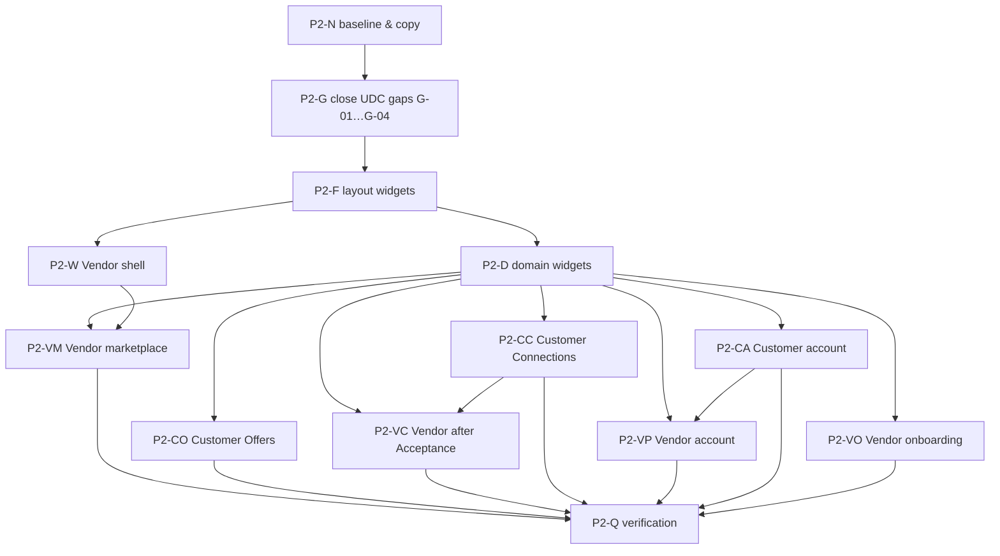

# Mobile visual pass 2 — Vendor and secondary Customer screens — Plan of record

| | |
|---|---|
| **Product** | Karat Hive (`kh_mobile`) |
| **Document** | Plan for bringing every Vendor screen, and every Customer screen that pass 1 did not touch, up to the binding visual specification |
| **Version** | 1.0 |
| **Status** | Draft. Not started |
| **Date** | 30 September 2026 |
| **Task list** | [`Tasks-Register-Pass-2.md`](Tasks-Register-Pass-2.md) |
| **Visual spec (binding)** | [`apps/kh_mobile/karat_hive/docs/UI-Design-Context.md`](../karat_hive/docs/UI-Design-Context.md), cited below as **UDC §n** |
| **Previous pass** | [`Implementation-Plan.md`](Implementation-Plan.md) (lock table §3) · [`Tasks-Register.md`](Tasks-Register.md) · [`Verification-Notes-V01-V02.md`](Verification-Notes-V01-V02.md) |
| **Does not override** | SRS v1.5 · `CONTEXT.md` · `docs/Architecture-Frontend.md` · Customer shell IA in `CLAUDE.md` · UDC · pass-1 locks |

This plan does not restate the visual system. UDC already specifies the tokens, type, components, density and copy rules for every screen in scope. This plan only decides **what to build, in what order, and what "done" means** for the screens UDC calls out as behind. Where this plan and UDC seem to disagree, UDC wins and this plan is wrong.

---

## 1. Why this pass exists

Pass 1 locked the champagne tokens and restyled the Customer front door: Home, the four create screens, review/publish, Guest landing and the summary card.

Every other screen only *inherits* those tokens. It was built as functional Material UI, and it hasn't been through an editorial pass. Across these screens you'll see raw `AppBar`, `Card` plus `ListTile` stacks, ad-hoc `withValues(alpha: …)` tints, inline `TextStyle(fontSize: …)` and spinner loading. UDC §6 describes these components differently. The code audit on 30 Sep 2026 found:

| Area | Finding | Breaks |
|---|---|---|
| Vendor shell | Raw `NavigationBar`, `indicatorColor: gold @ 0.25`, hard-coded English labels (`app/shells/vendor_shell.dart`) | UDC §6.16 (no indicator pill, `goldDark` selection); UDC §9 (all copy in `kh_l10n`) |
| Vendor Dashboard (VEN-S05) | Four bordered `Card`s with inline tints and `fontSize: 12`; gold card border as a "has items" signal; strings "Active bids awaiting customer response", "Won deals & direct customer chats" | UDC §4.4 (gold border only for selection/focus), §3.3 (no inline `TextStyle`), §12 (`bid`, `chat`, `deal` never) |
| Available Requests (VEN-S06) | Filter-count badge: 10 px white bold text on `gold`, placed with `Positioned(right: 8)` | UDC §2.5 contrast; UDC §9 (`PositionedDirectional`, never `left`/`right`) |
| `VendorRequestCard` (`kh_ui_domain`) | Inline `fontSize: 13 / 12 / 11` | UDC §3.3 |
| Offer Comparison (CUS-S12) | Fixed 220 px cards in a horizontal scroll; best price tinted with raw `gold @ 0.12` | UDC §6.19 (a clean table, not stacked big cards) |
| Form screens (KYC, Submit/Revise Offer, Business Profile, Leave Review, Report Abuse, Settings, Registration) | Each builds its own scaffold and button column. `SwitchListTile` in Business Profile and Regions | UDC §6.2 (fixed action bar), §6.3 (fields), §6.5 (no `SwitchListTile`) |
| List screens (Connections, Notifications, My Offers, History, Reviews) | A mix of `Card`, `ListTile` and bespoke rows; empty and loading states vary; spinners throughout | UDC §6.21 (skeletons, one-glyph empty state), §7.8 (Vendor compact rows) |
| Status chips | Saturated 1a colours | UDC §6.20, gap **G-01** |
| Type scale | 1a sizes (form input 14, labels 10.5) | UDC §3.2 and §6.3, gap **G-02** |
| Settings (VEN-S18) | `Colors.green` check icons | UDC §2.2 (never a primitive colour) |
| CUS-S03 Request Type Selection | 40 hard-coded colours from the archived dark theme; still routed (`request_create/routes.dart`) | UDC §2 |

---

## 2. Sources and how work is judged

**No screen in this pass has a picture mock.** UDC's precedence table puts a mock last, so the missing mocks don't block the work, but they do change how it gets accepted:

- A screen task passes on **structure**: it has the named anatomy, reads only tokens and theme styles, and uses the shared components. It isn't judged pixel by pixel.
- If a screen needs a visual call that UDC doesn't settle, mark the task `blocked` and raise it with the Product Owner. Don't decide it in code.

| Source | Role |
|---|---|
| UDC §2–§12 | Binding for every task. Each task cites the sections it implements |
| `ui-screens/customer/CUS-S*.md`, `ui-screens/vendor/VEN-S*.md` | Field inventory. A visual task may regroup or reorder fields. It may not add or drop one |
| `Card-mock.png`, `Find-orna-create.png`, `sell-my-create.png` | Anatomy precedents for card, labelled row with **Edit**, and form surface with action bar |
| `inspire 1.webp`, `5ca7a300611f284c5bd533c4ef5d57b4.webp` | Mood only. These are third-party shots, so don't copy their layout, brown/rose-gold fills or product copy |
| `ChatGPT Image Sep 30, 2026, 06_45_53 AM.png` | Candidate imagery. It isn't assigned to a screen in this pass |
| `source.txt`, `component_src.txt` | Background only. Their palette and `karat_hive_design/` package layout are **not adopted** (UDC §2.1 "not adopted" table, UDC §13 last paragraph) |

---

## 3. Scope

### 3.1 Vendor: all 22 screens and the shell

| Screen | File(s) under `apps/kh_mobile/karat_hive/lib/` unless a package is named | Group |
|---|---|---|
| Vendor shell | `app/shells/vendor_shell.dart` | Shell |
| VEN-S01 Registration | `features/auth/presentation/vendor_register_screen.dart` | Onboarding |
| VEN-S02 KYC Upload | `features/onboarding/presentation/kyc_upload_screen.dart`, `kh_design_system` `DocumentUploadTile` | Onboarding |
| VEN-S03 Awaiting Approval | `features/onboarding/presentation/awaiting_approval_screen.dart`, `kh_ui_domain` `VendorStatusCard` | Onboarding |
| VEN-S04 Login | `features/auth/presentation/vendor_login_screen.dart` | Onboarding |
| VEN-S05 Dashboard | `features/request_feed/presentation/vendor_dashboard_screen.dart` | Marketplace |
| VEN-S06 Available Requests | `features/request_feed/presentation/request_feed_screen.dart`, `kh_ui_domain` `VendorRequestCard` | Marketplace |
| VEN-S07 Request Filters | `features/request_feed/presentation/request_filters_sheet.dart` | Marketplace |
| VEN-S08 Request Detail | `features/request_feed/presentation/request_detail_screen.dart` | Marketplace |
| VEN-S09 Submit Offer | `features/offers_vendor/presentation/submit_offer_screen.dart`, `kh_ui_domain` `OfferTermsForm` | Marketplace |
| VEN-S10 Revise / Withdraw Offer | `features/offers_vendor/presentation/revise_offer_screen.dart` | Marketplace |
| VEN-S11 My Offers | `features/offers_vendor/presentation/my_offers_screen.dart`, `kh_ui_domain` `OfferSummaryCard` | Marketplace |
| VEN-S14 Offer History | `features/offers_vendor/presentation/offer_history_screen.dart` | Marketplace |
| VEN-S12 Connections List | `features/connections/presentation/connections_screen.dart` | After Acceptance |
| VEN-S13 Connection Detail | `features/connections/presentation/connection_detail_screen.dart`, `kh_ui_domain` `RevealedPartyCard`, `connection_widgets.dart` | After Acceptance |
| VEN-S19 Leave Customer Feedback | `features/reviews/presentation/leave_review_screen.dart` (shared with CUS-S18) | After Acceptance |
| VEN-S20 My Reviews | `features/reviews/presentation/my_reviews_screen.dart` | After Acceptance |
| VEN-S15 Business Profile | `features/profile_settings/presentation/business_profile_screen.dart`, `vendor_documents_screen.dart` | Account |
| VEN-S16 Regions | `features/profile_settings/presentation/categories_regions_screen.dart` | Account |
| VEN-S17 Notification Centre | `features/notifications/presentation/vendor_notification_centre_screen.dart` | Account |
| VEN-S18 Settings | `features/profile_settings/presentation/settings_screen.dart` | Account |
| VEN-S21 Report Abuse | `features/abuse/presentation/report_abuse_screen.dart` (shared with CUS-S22) | Account |
| VEN-S22 Subscription | `features/subscription/presentation/subscriptions_screen.dart`, `kh_ui_domain` `SubscriptionBadge` | Account |

### 3.2 Customer: every screen pass 1 did not restyle

The request named CUS-S12, S15, S16 and S18–S22 as examples ("screens like"). This plan covers the whole remainder so no Customer screen is left on functional UI.

| Screen | File(s) | Group |
|---|---|---|
| CUS-S10 Request Detail (owner) | `features/request_manage/presentation/owner_request_detail_screen.dart` | Offers |
| CUS-S11 Offers List | `features/offers_customer/presentation/customer_offers_list_screen.dart`, `widgets/customer_offer_row.dart` | Offers |
| CUS-S12 Offer Comparison | `features/offers_customer/presentation/offer_comparison_screen.dart` | Offers |
| CUS-S13 Offer Detail | `features/offers_customer/presentation/offer_detail_screen.dart` | Offers |
| CUS-S14 Accept Confirmation | `features/offers_customer/presentation/accept_offer_screen.dart` | Offers |
| CUS-S15 Connection Detail | `features/connections_customer/presentation/connection_detail_screen.dart` | Connections |
| CUS-S16 Connections List | `features/connections_customer/presentation/connections_list_screen.dart` | Connections |
| CUS-S18 Leave Review | `features/reviews/presentation/leave_review_screen.dart` (owning task for the shared file) | Connections |
| CUS-S17 History | `features/request_manage/presentation/request_history_screen.dart` | Account |
| CUS-S19 Notification Centre | `features/notifications/presentation/customer_notification_centre_screen.dart` | Account |
| CUS-S20 Profile | `features/profile_settings/presentation/customer_profile_screen.dart` | Account |
| CUS-S21 Settings | `features/profile_settings/presentation/customer_settings_screen.dart` | Account |
| CUS-S22 Report Abuse | `features/abuse/presentation/report_abuse_screen.dart` (owning task for the shared file) | Account |
| CUS-S03 Request Type Selection | `features/request_create/presentation/request_type_screen.dart` | Legacy cleanup |

Pass 1 already restyled CUS-S02 Home, S04–S07 create, S08 image-capture chrome, S09 review/publish, S23 Guest Landing and the My Requests summary card. This pass does **not** reopen them, except where a foundation change (G-01…G-04) regenerates their goldens.

---

## 4. Decisions this plan adds

UDC settles the look. The table below records only the decisions about **how the work is organised** that UDC leaves open.

| # | Topic | Decision | Grounds |
|---|---|---|---|
| P2-1 | Gaps first | Close UDC gaps **G-01** (muted status set), **G-02** (type scale), **G-03** (40/48/64/80 spacing) and **G-04** (field radius 10, sheet top radius 20) before any screen task. They change every screen in scope, and doing them later would regenerate every golden twice | UDC §14.1 |
| P2-2 | Status tokens | G-01 adds the muted status colours as `KhTokens` fields with semantic names (for example `statusActive`, `statusWaiting`, `statusNegative`). Status is the one place this pass adds colour tokens | UDC §2.2 last paragraph, §6.20 |
| P2-3 | Promote, don't copy | Chrome that screens in several features need goes into `kh_design_system` (layout) or `kh_ui_domain` (domain-aware) first: the form scaffold and action bar now in `request_create/.../create_flow_chrome.dart`, a list row, a comparison table, and skeletons. Features never import each other's presentation code | UDC §6 preamble, §13; `docs/Architecture-Frontend.md` §4 |
| P2-4 | Form surface | Screens whose main job is data entry use `formSurface` and the UDC §6.2 action bar: VEN-S01, S02, S09, S10, S15 edit, S16, S18 forms, S19, S21; CUS-S18, S21 forms, S22. Everything else uses `surface` | UDC §2.2 `background`; extends pass-1 C01 |
| P2-5 | Row anatomy | One shared list row: optional 40 px leading icon or thumbnail, title, one secondary line, trailing meta or chevron, and an `inkHairline` divider between rows. Customer lists use it at editorial padding (`md`) and Vendor lists at compact padding (`s12`). There's no card per row on Customer lists | UDC §6.17, §7.8 |
| P2-6 | Shared screens | `leave_review_screen.dart` and `report_abuse_screen.dart` each have one owning task (in the Customer track). The Vendor task for the same screen only verifies Vendor copy and density | Avoids two tasks editing one file |
| P2-7 | Vendor nav | The Vendor shell moves to `KhBottomNav`. Its five destinations don't change: Home, Requests, Offers, Connections, Profile | UDC §6.16 "Vendor destinations are their own list" |
| P2-8 | Gold rates stay hidden | The commented-out dashboard gold-rate panel is not revived or restyled | `CLAUDE.md` live open decisions; UDC O-04 |
| P2-9 | Category | If VEN-S16's `CategoryRegionPicker` still renders category rows, log a follow-up. Don't restyle them | `adr/0014`; UDC §6.4 |
| P2-10 | Pass-1 gaps G-05, G-06 | These are out of this pass: the brand-mark colour and the Home tile labels are pass-1 surfaces. Record them in P2-Q03 if they're still open | UDC §14.1 |

### 4.1 Domain guardrails every screen task inherits

A visual pass is exactly where masking regressions creep in ("just show the shop name on the card"). Each task's acceptance repeats the guardrail that applies to it.

| Guardrail | Source | What it means on screen |
|---|---|---|
| Masking until Acceptance | `BR-006`, `BR-007`; UDC §6.19 | Before Acceptance, render `MaskedPartyLabel` only. Don't leave an empty slot for a name, logo or phone that "fills in later" |
| No competitor data to a Vendor | `BR-008` | Vendor screens may show a Request's **Offer count**. No rank, best-offer badge, price hint or competitor terms |
| Acceptance is atomic and irreversible | `BR-011`–`BR-013`; UDC §6.19, §6.22 | CUS-S12 and S13 always route through CUS-S14. The confirm surface says it's irreversible, reveals both identities to that one Vendor, and rejects the other pending Offers |
| Talk is a hand-off | `C-03`, `BR-015` | Connection detail has a Talk action that opens `wa.me`. No bubbles, no message preview, no "deal closed" state |
| 48-hour expiry | `C-07` | Countdown via `ExpiryCountdown`. No "extend" affordance |
| Three Vendor facts | `BR-002` | Verification, `ACTIVE`, and Type Subscription are shown as three separate facts, never merged into one badge |
| Time zone | `BR-021` | Times display in Gulf Standard Time through the existing formatters |
| Vocabulary | `CONTEXT.md` `_Avoid_`; UDC §12 | No "bid", "chat", "deal", "listing", "order" or "category" in visible copy |

---

## 5. Foundation before screens

Screen tasks stay thin when the shared pieces are right, so the foundation lands first and each screen task becomes mostly a swap.

| Piece | Home | Implements | Consumed by |
|---|---|---|---|
| Muted status tokens + `KhStatusChip` mapping | `tokens.dart`, `kh_status_chip.dart` | UDC §6.20, G-01 | Every list and detail |
| Type scale | `theme.dart`, `typography.dart` | UDC §3.2, §6.3, G-02 | Everything |
| Spacing 40/48/64/80; field radius 10; sheet radius 20 | `tokens.dart`, `theme.dart` | UDC §4.1, §4.3, G-03, G-04 | Forms, sheets, dashboards |
| `KhAppBar` audit | `kh_app_bar.dart` | UDC §6.14 (secondary-screen variant: back button, title, ≤ 2 actions) | Every screen |
| `KhFormScaffold` + `KhActionBar` | new in `kh_design_system`, promoted from `create_flow_chrome.dart` | UDC §6.2, §6.3, §6.17 | P2-4 form screens |
| `KhListRow` + `KhListSection` | new in `kh_design_system` | P2-5, UDC §7.8 | Connections, Notifications, Settings, History, My Offers, Reviews |
| `KhToggleRow` | `kh_toggle.dart` | UDC §6.5 | Business Profile, Regions, Settings |
| State views + `KhSkeleton` | `state_views.dart` | UDC §6.21 | Every screen |
| `KhConfirmDialog` + sheet chrome | `kh_confirm_dialog.dart`, theme `bottomSheetTheme` | UDC §6.22 | CUS-S14, withdraw Offer, close Connection, account deletion, VEN-S07 |
| `KhStatTile` (operational tile) | extend `kh_stat_strip.dart` | UDC §6.12, §7.8 | VEN-S05, VEN-S20 |
| `KhComparisonTable` (generic) | new in `kh_design_system`; the Offer mapping stays in the feature | UDC §6.19 | CUS-S12 |
| Domain widgets | `kh_ui_domain`: `VendorRequestCard`, `OfferSummaryCard`, `RequestSummaryCard`, `RevealedPartyCard`, `ConnectionSummaryRow`, `TalkButton`, `NotificationListItem`, `ReviewListItem`, `SettingsGroup`, `SubscriptionBadge`, `VendorStatusCard`, `MoneyDisplay`, `MaskedPartyLabel` | UDC §6.18–6.20, §3.3 `tabular` | Their screens |

---

## 6. Order of work

- **Gaps before widgets before screens.** G and F regenerate goldens across `kh_design_system`, so they land together, and screen goldens are only captured after them.
- **Screen groups can run in parallel.** They touch separate files. The exceptions are the two shared screens, which is why VC waits on CC and VP waits on CA (P2-6).
- **Priority by traffic:** VM (the Vendor's daily loop) and CO (the Customer's decision moment) first, CC and VC next, then the account screens, with onboarding last.

---

## 7. Out of scope

| Item | Why |
|---|---|
| New fields, routes, tabs, endpoints or controllers | This is a visual pass. `ui-screens/` owns the field lists |
| Pass-1 screens (§3.2 last paragraph) | Done. They are only touched to regenerate goldens after P2-G |
| UDC open items O-01…O-09 | Recorded as open on purpose. Don't resolve them by inference |
| Reference gold rates on any screen | P2-8 |
| A Vendor-specific colour, a dark theme or `KhTheme.dark` | UDC §7.8, §13 |
| Editing UDC, the SRS, `ui-screens/` or `ui-mock/` | UDC §14.1 rows get struck through in P2-Q03 when a gap closes. That's the only doc edit |
| `kh_admin` | It keeps its own theme |
| Committing or publishing | Only when asked |

---

## 8. Done when

1. UDC gaps G-01…G-04 are closed in code, and their rows in UDC §14.1 are marked closed with the date.
2. No file in §3 contains `Color(0x`, `Colors.` (except `Colors.transparent`), `TextStyle(fontSize:`, an ad-hoc `.withValues(alpha:` on a token, `EdgeInsets.only(left|right` or `Positioned(left|right`. The P2-N02 grep script proves it and is re-run in P2-Q01.
3. The Vendor bottom nav is `KhBottomNav` with five destinations, `goldDark` selection, no indicator, and labels from `kh_l10n`.
4. Every P2-4 form screen uses `KhFormScaffold` with a fixed `KhActionBar` and one `ctaFill` primary action.
5. Every list screen uses `KhListRow` or a domain card built on the same hairline anatomy, with skeleton loading and the UDC §6.21 empty state.
6. CUS-S12 is a table with a subtle per-row best-value mark. CUS-S14 states irreversibility, the reveal, and that the other Offers are rejected.
7. No visible string on these screens contains an `_Avoid_` term (UDC §12).
8. Existing masking and `BR-008` tests (`notification_br008_fixture_test.dart`, connection and Offer screen tests) pass **unchanged**, and new LTR + RTL goldens exist for each restyled domain widget.
9. `dart analyze` is clean for `kh_design_system`, `kh_ui_domain`, `kh_l10n` and `karat_hive` (use the workspace `dart analyze`, not `flutter analyze`). The tests named in P2-Q02 pass, and every screen was exercised at about 320 px and about 1024 px, in EN and AR.
