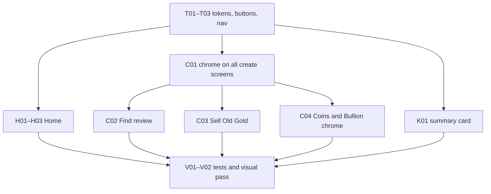

# Mobile visual pass — Plan of record

| | |
|---|---|
| **Product** | Karat Hive (`kh_mobile`) |
| **Document** | Plan for aligning the Flutter theme and the mocked Customer surfaces with the screens that remain in this folder |
| **Version** | 1.1 |
| **Status** | Executed. T–K implemented; V01–V02 verified 30 Sep 2026 ([`Verification-Notes-V01-V02.md`](Verification-Notes-V01-V02.md)) |
| **Date** | 30 September 2026 |
| **Task list** | [`Tasks-Register.md`](Tasks-Register.md) |
| **Written system** | [`design-System.md`](design-System.md) |
| **Code today** | Direction 1a Classic in `packages/kh_design_system` and `apps/kh_mobile/karat_hive/docs/UI-Design-Context.md` |
| **Does not override** | SRS v1.5 · `CONTEXT.md` · `docs/Architecture-Frontend.md` · Customer shell IA in `Claude.md` |

This plan cites those documents. It does not restate business rules. Where a mock shows a control the domain forbids, the domain wins and the task says so.

`design-System.md` is the component standard **except where the lock table below replaces a rule**. Direction 1a stays the theme until the token tasks land. This pass does not rewrite `UI-Design-Context.md`, the SRS, `ui-screens/`, or `ui-mock/`.

The older create-screen plan (`apps/kh_mobile/karat_hive/docs/implementation_plan_create_request_screens.md`) still owns **which fields** each Request type collects. This plan replaces only its chrome: pill radius, `#C8A046` fill, and ink selected chips where a remaining mock shows otherwise.

---

## 1. What changed in this revision

`Home-2.png` and `find-button-rounded.png` are no longer in the folder. They were the two competing directions (pink chrome, pill gradient CTA). They are not sources.

The audit that compared `design-System.md` to the mocks still stands for the files that remain: the written system and the pictures are related, and they are not pixel-identical. This revision **locks the picture** where they disagree, and **locks the product** where a picture would drop a shipped behaviour.

---

## 2. Sources

| File | Role in this pass |
|---|---|
| `Home-1.png` | Customer Home: hero, 2×2 Request types, app-bar mark, selected-nav treatment |
| `Find-orna-create.png` | Find An Ornament **review**: edit rows, photo mosaic, rectangular CTA |
| `sell-my-create.png` | Sell Old Gold **compose**: one-page form, condition chip, value panel, rectangular CTA |
| `Card-mock.png` | Summary card anatomy only. See §4.6 for the two corrections |
| `find-ornament-img.png`, `sell-old-img.png`, `coin-img.png`, `bullion-img.png` | Tile photography |
| `design-System.md` | Spacing, type roles, borders, text actions, empty rules the mocks do not draw |
| `logo-img.png`, `logo-img-2.png`, `ChatGPT Image Sep 30, 2026, 03_41_02 AM.png` | Superseded: `karat-hive-logo.png` (the brand logo) is now the app-bar mark |

Coins and Bullion have no new screen mock. They keep the field layout in the create-screen plan and pick up shared chrome only.

---

## 3. Locked decisions

| # | Topic | Lock |
|---|---|---|
| 1 | Accent | Champagne / gold only. No pink chrome |
| 2 | Primary action | Gold fill, ink label, on Home, create, review, and the summary card. The written “charcoal button + white label” is not the default |
| 3 | Hexes | §5. Do not add `#F84080` or `#906840` |
| 4 | Button shape | Height 48. Radius **10**. Flat fill. Chips may stay fully rounded |
| 5 | Navigation count | **Five** Customer tabs, already shipped: Home, My Requests, Connections, Alerts, Profile. Home-1 draws four; Alerts stays |
| 6 | Navigation selection | Selected icon and label use `goldDark` (`#8A6A1F`), the gold family at accessible contrast; `gold` `#D8A858` on the nav bar is ~1.9:1. No stadium pill, no charcoal-only item, no full-bar gold wash |
| 7 | Type | Cormorant Garamond for display, DM Sans for Latin body, existing Arabic pair. Inter is not added. Serif stays off form values and off sizes below 16 |
| 8 | Home hero | Display type sits on the jewellery photo, as in Home-1 |
| 9 | Create structure | Find mock is the review step. Sell mock is the Sell Old Gold compose screen. No new stepper. Coins and Bullion are chrome-only |
| 10 | Screen title | **Sell Old Gold**. The mock headline “Sell My Gold” is not the product name |
| 11 | Card talk control | No Message action on a Request or Offer card. Talk is a Connection, after Acceptance |
| 12 | Card colour | View Details uses the same CTA fill as create. The sampled bronze is not a token |
| 13 | Gold area | Icon rings on the Sell form may exceed the written “under 10%” guide. That screen follows the mock |
| 14 | Admin | `kh_admin` is unchanged. It does not use `kh_design_system` |

Ink stays `#1C1B1A`. Charcoal `#242320` is close enough that a second near-black is not introduced. Ivory stays `#FDFBF7` on Home. Create screens use the warmer form surface in §5.

Pressed colours are computed in code: the same relative darken already used from 1a gold `#C8A046` to `#B8903A`. No extra sampled hex.

---

## 4. What each surface becomes

### 4.1 Tokens and theme

`KhTokens` / `KhTheme` in `packages/kh_design_system`.

- `gold` moves from `#C8A046` to `#D8A858` (Home-1 icon, dots, arrows, selected nav).
- New `ctaFill` `#D8C0A8` for primary buttons on create, review, and the summary card. Label is `ink`.
- New `formSurface` `#F0E8E0` for create and review scaffolds only. Home scaffold stays ivory.
- `KhRadius` gains a **10** button radius. `FilledButton` / primary `KhButton` stop using the 24 radius pill.
- `NavigationBarTheme` drops the gold stadium. Selected icon and label use `goldDark`. Idle stays `ink` at the current muted level. Height stays 80. Hit targets stay at least 48.

Vendor screens share this theme. They are not restyled into the Customer editorial layout. Verification includes one Vendor screen so the token move does not break it.

### 4.2 Customer Home

`customer_home_screen.dart`.

Home-1 is the layout reference: logo, notification entry, hero with type on the photograph, 2×2 photography tiles for the four Request types, gold arrow on each tile. The open-Request list stays on My Requests. Activity summary may remain under the grid; Home-1 does not show it, and removing it is out of this pass unless it collides with the 2×2.

App-bar mark (revised 2 Oct 2026): the brand logo image `karat-hive-logo.png`, the same one used on loading and splash views, unrecoloured. This replaces the earlier clover plus tracked “KARAT HIVE” wordmark plan; no clover asset is needed.

### 4.3 Find An Ornament review

`request_review_publish_screen.dart`, Find path only.

Take from `Find-orna-create.png`: photo mosaic with a remaining-count, labelled rows, **Edit** as a text action, one full-width rectangular CTA. Field capture stays on `find_ornament_screen.dart` and keeps the field list in the create-screen plan.

### 4.4 Sell Old Gold compose

`SellOldGoldScreen` inside `find_ornament_screen.dart` (same library as today).

Take from `sell-my-create.png`: warm form surface, hairline groups, gold icon on each row, condition choice with the selected value in `ctaFill` and ink text, indicative value panel, rectangular primary CTA. Required fields from the create-screen plan stay. Copy lives in `kh_l10n`. The visible name is Sell Old Gold.

### 4.5 Coins and Bullion

`GoldCoinsScreen`, `GoldBullionScreen`. Shared chrome from §4.1 only: form surface, 10 px CTA, `ctaFill`, text secondary action. Direction control, denominations, and budget rules stay as implemented.

### 4.6 Summary card

The Customer card that summarises a Request or an Offer (`owner_request_card.dart` and the Offer row if it is the same anatomy).

Take from `Card-mock.png`: image, media-count badge, short meta, estimated-value panel, one filled **View Details**.

Corrections:

- No Message control.
- CTA colour is `ctaFill`, not `#906840`.
- Elevation stays 0. Separation is the existing hairline border.

---

## 5. Token table

| Role | Hex | Used for |
|---|---|---|
| `gold` | `#D8A858` | Home icons, carousel, tile arrows, selected nav |
| `ctaFill` | `#D8C0A8` | Primary buttons, selected condition chip, card CTA |
| `ink` | `#1C1B1A` | Text, labels on gold fills |
| `surface` | `#FDFBF7` | Home and shell |
| `formSurface` | `#F0E8E0` | Create and review scaffolds |
| `navBackground` | `#F6F1E6` | Bottom bar (unchanged) |

Measured Home-1 page fill sits near ivory. Create fills cluster on `#F0E8E0`. Home gold clusters on `#D8A858`–`#E0B060`. Find and Sell CTA fills cluster on `#D8C0A8`.

---

## 6. Order of work

Token tasks go first. They change every screen that reads `KhTheme`. Feature tasks stay inside the files in §4. Verification is last and covers Customer and one Vendor surface, narrow and wide.

---

## 7. Out of scope

- Pink Home, pill CTA, gradient CTA
- Replacing DM Sans with Inter, or loading fonts from the network
- Dropping the Alerts tab, or moving the open-Request list onto Home
- A wizard that replaces the current compose screens
- Offer comparison, Vendor density, Arabic layout changes beyond what the theme already does
- `kh_admin`
- Rewriting `UI-Design-Context.md` in this pass
- Publishing or committing, unless asked

---

## 8. Done when

- Primary buttons are 48 × radius 10, fill `#D8C0A8`, label `#1C1B1A`, with no gradient.
- Selected bottom-nav item is `goldDark` icon + `goldDark` label. Five Customer destinations remain.
- Home shows the hero and the four photography tiles from the remaining assets.
- Find review matches `Find-orna-create.png` in structure. Sell Old Gold matches `sell-my-create.png` in structure, under the product name Sell Old Gold.
- Summary card has View Details and no Message control.
- `dart analyze` for the touched packages is clean, and the widget tests named in the task register pass.
