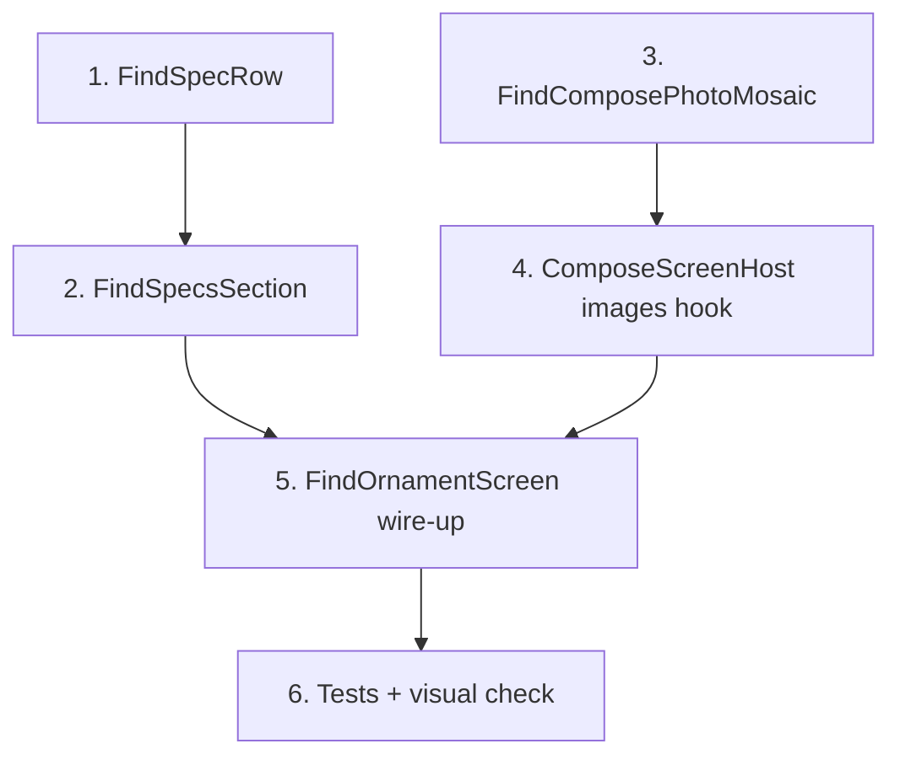

# Plan: Find An Ornament compose restyle (CUS-S04)

| | |
|---|---|
| **Status** | Planned |
| **Workspace export** | `apps/kh_mobile/designs/Plan-Find-Ornament-Compose.md` |
| **Screen** | `FindOrnamentScreen` (CUS-S04) |
| **Layout reference** | `apps/kh_mobile/designs/Find-orna-create.png` |

## Skill answer

**`ui-styling` cannot help here.** It targets React + shadcn/ui + Tailwind. This work is Flutter + `kh_design_system`.

Useful instead:

| Skill / source | Role |
|---|---|
| `anydesign` | Analyse `Find-orna-create.png` into layout/tokens/components (optional pre-step) |
| `UI-Design-Context.md` + `Implementation-Plan.md` | Binding visual rules and locks |
| Existing Sell compose (`SellIconFieldGroup` / `SellIconFieldRow`) | Closest shipped pattern for labelled compose rows |

## Source clarification

| Asset | Reality | Use in this plan |
|---|---|---|
| `apps/kh_mobile/designs/find-ornament-img.png` | Jewellery **tile photography** (warm beige palette; landscape 1536×1024) | Out of scope — Home service tile asset |
| `apps/kh_mobile/designs/Find-orna-create.png` | Portrait **form mock** (Specs, photo mosaic, Continue) | **Layout reference** for compose |
| Field list | `CUS-S04-create-find-ornament.md` + `implementation_plan_create_request_screens.md` | Binding field set |

Lock #9 assigned `Find-orna-create.png` to **review**. This plan deliberately applies that layout language to **compose** (`FindOrnamentScreen`), as requested. Review (`_FindOrnamentReviewBody` / C02) stays as shipped.

## Goal

Replace the current Find compose body (loose chips + `SwitchListTile` + horizontal photo strip) with a Specs-section architecture matching the mock, while **Theme / chrome / controller stay**.

### Keep (do not reinvent)

- `CreateFlowChrome` / `CreateFlowHeader` / `DraftActions` (shared create chrome)
- `ComposeScreenHost` (draft save, continue → review, `combineImages`, errors)
- Tokens: `formSurface`, `ctaFill`, `ink*`, `space`, `radius`, `KhButton`, `KhTextField`, `KhNumericField`, chip themes
- `RequestCreateController` / state / API payload shape
- Field ownership from CUS-S04 (optional type/purity, mandatory budget, ≥1 photo, notes, gemstones, weight approximate, budget flexible)

### Drop from the mock (product wins)

- Bottom nav on create (create flow has none)
- Header with logo left / back right — keep shared `CreateFlowHeader`
- Review-only **Edit** text action on Specs — compose rows are inline-editable
- Inventing a Flexibility **percentage** field — map to existing `budgetIsFlexible` boolean
- New hexes or theme tokens

---

## Layout architecture

```
CreateFlowChrome                    ← theme: formSurface, shared header
└─ ListView (ComposeScreenHost)
   ├─ KhInlineError / warnings      ← existing
   ├─ FindComposePhotoMosaic        ← NEW (editable)
   ├─ FindSpecsSection              ← NEW
   │  ├─ header: "Specs"
   │  ├─ FindSpecRow Type           → OrnamentTypeChips (reuse)
   │  ├─ FindSpecRow Karat          → purity chips (from WeightPurityFields)
   │  ├─ FindSpecRow Weight         → KhNumericField + approximate control
   │  ├─ FindSpecRow Gems           → toggle; type/count when on
   │  ├─ FindSpecRow Budget         → BudgetEditor (reuse, compact in row)
   │  ├─ FindSpecRow Approx value   → derived display (mid of range / max)
   │  └─ FindSpecRow Flexibility    → budgetIsFlexible toggle
   └─ CommonCreateFields (notes)    ← existing
└─ DraftActions                     ← Save draft + Continue (theme CTA)
```

Visual rules from the mock + theme:

- Warm `formSurface` scaffold (already)
- Photos first, Specs second
- Specs: paper/hairline group, label (muted uppercase) + control/value
- Find rows have **no gold leading icons** (unlike Sell) — mock is label/value only
- Full-width Continue via existing `DraftActions` / `KhButton` (`ctaFill`, radius 10)

### Mock row → domain mapping

| Mock label | State / control | Notes |
|---|---|---|
| Type | `ornamentType` / `OrnamentTypeChips` | Optional |
| Karat | `purityKarat` chips | Optional |
| Weight | `weightGrams` + `weightIsApproximate` | Empty + approximate ≈ mock “Flexible” |
| Gems | `gemstonesPresent` + type/count | Conditional reveal |
| Budget Range | `BudgetEditor` (`budgetMin`/`budgetMax`/`budgetMode`) | Mandatory |
| Approx Value | **Display only** from budget mid (range) or max | Not a new input; hide when budget empty |
| Flexibility | `budgetIsFlexible` | Copy can say “Flexible” / “± offers OK”; no % field |

---

## Widgets to create (separately, in order)

Put Find-specific widgets under:

`apps/kh_mobile/karat_hive/lib/features/request_create/presentation/widgets/`

Prefer new files so Sell widgets stay untouched:

| # | Widget | File | Responsibility |
|---|---|---|---|
| 1 | `FindSpecRow` | `find_spec_row.dart` | One labelled row: uppercase muted label + `child`. Padding from `tokens.space`. No icon. |
| 2 | `FindSpecsSection` | `find_specs_section.dart` | “Specs” title + paper/hairline `Column` of rows with `Divider`s. Mirrors `SellIconFieldGroup` structure without icons. |
| 3 | `FindComposePhotoMosaic` | `find_compose_photo_mosaic.dart` | Editable 2-column mosaic: existing thumbs, remaining-count badge, dashed **Add photo** tile, remove/retry. Reuse pick logic from `RequestImagesSection`; visual from `RequestReviewMosaic`. |
| 4 | Wire `FindOrnamentScreen` | `find_ornament_screen.dart` | Compose body uses mosaic + Specs; keep `ComposeScreenHost`. For Find only, skip the default horizontal `RequestImagesSection` inside the host (pass photos via Specs stack or a Find-specific host flag). |

### Wiring note for photos

Today `ComposeScreenHost` always mounts `RequestImagesSection` when `combineImages: true`. Options:

- **A (recommended):** Add optional `Widget? imagesSection` / `bool useDefaultImages` on `ComposeScreenHost` so Find injects `FindComposePhotoMosaic` and Sell keeps the strip.
- **B:** Set `combineImages: false` on Find and mount mosaic inside `fields` (photos still required via controller checks on continue).

Prefer **A** so continue/photo validation stays in one place.

### Reuse as-is

- `OrnamentTypeChips`, purity chip row, `BudgetEditor`, `CommonCreateFields`
- `mediaSlotPreview`, pick/remove/retry on controller
- Existing l10n keys; add only Specs/Approx/Flexibility labels if missing

### Do not change in this pass

- `SellOldGoldScreen` / `SellIconField*`
- `RequestReviewPublishScreen` Find review body (already mosaic + icon rows)
- `kh_design_system` tokens/theme
- Home tile / `find-ornament-img.png`

---

## Implementation sequence



1. **`FindSpecRow`** — pure layout; theme text styles only.
2. **`FindSpecsSection`** — container + dividers; empty children OK.
3. **`FindComposePhotoMosaic`** — pick/remove/remaining badge; keys for tests.
4. **`ComposeScreenHost`** — optional custom images slot for Find.
5. **`FindOrnamentScreen`** — assemble Specs rows with existing field widgets; remove loose `SwitchListTile` gemstones block in favour of Specs Gems row.
6. **Verify** — `dart test test/features/request_create/`; update `create_request_screens_test.dart` finders; manual compose → continue → review.

---

## Verification

- Widget tests: Find screen shows mosaic key, Specs section, ornament chips, budget editor, draft/continue chrome (extend existing C01 chrome expectations).
- Manual: add photos in mosaic, fill Specs, Save draft, Continue to review; confirm review still works; RTL smoke if locale switch is easy.
- No browser verification (Flutter mobile); use widget tests + device/emulator if available.

## Risks / limits

- Mock densifies more fields than today’s Find compose UI; Specs may scroll — allowed by UI-Design-Context §7.3.
- “Approx Value” is derived UI only; if Product wanted a stored field, that needs a separate domain change.
- Flexibility % in the mock is illustrative; boolean `budgetIsFlexible` remains the source of truth.
- Applying a review mock to compose overlaps visually with CUS-S09 Find review — acceptable if compose is editable and review stays read-only + Publish.

## Out of scope

- `anydesign` full `design.md` export (optional follow-up)
- Restyling Coins/Bullion or review
- Replacing Home tile art with `find-ornament-img.png` (already the tile photo role)
