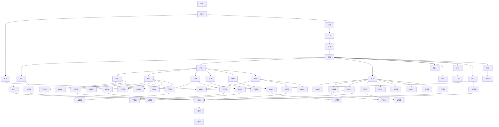

# Mobile visual pass 2 — Task register

| | |
|---|---|
| **Product** | Karat Hive (`kh_mobile`) |
| **Document** | Work list for [`Implementation-Plan-Pass-2.md`](Implementation-Plan-Pass-2.md) |
| **Status** | Draft. All tasks open |
| **Date** | 30 September 2026 |
| **Visual spec (binding)** | [`UI-Design-Context.md`](../karat_hive/docs/UI-Design-Context.md), cited as **UDC §n** |
| **Does not override** | SRS v1.5 · `CONTEXT.md` · `docs/Architecture-Frontend.md` · UDC · pass-1 locks |

The plan is the contract. A task may regroup, reorder, restyle and re-copy. It may **not** add a route, field, endpoint, controller state, tab or colour token (the only exception is P2-G01). If a task seems to need one of those, set it to `blocked` and write the reason in the task.

**Status values:** `open` · `in progress` · `done` · `blocked`.

**Tracks:** **N** baseline · **G** UDC gaps · **F** layout widgets · **D** domain widgets · **W** Vendor shell · **VM** Vendor marketplace · **VC** Vendor after Acceptance · **VP** Vendor account · **VO** Vendor onboarding · **CO** Customer Offers · **CC** Customer Connections · **CA** Customer account · **Q** verification.

All paths are relative to `apps/kh_mobile/karat_hive/` unless they start with `packages/`.

### Rules every screen task inherits

These don't repeat in each task. A reviewer checks them on every screen task:

1. **Tokens only.** No `Color(0x…)`, no `Colors.*` (except `transparent`), no ad-hoc `.withValues(alpha: n)` on a token. Use the named getters (`inkHairline`, `inkBorderSoft`, `inkSecondary`, `goldPanel`, …) from UDC §2.3.
2. **Theme type only.** No `TextStyle(fontSize: …)`. Use `Theme.of(context).textTheme.*` or `KhTypography` (UDC §3.3). Money and counts use `tabular`.
3. **Directional layout.** `EdgeInsetsDirectional`, `PositionedDirectional`, `AlignmentDirectional`. Never `left:` or `right:` (UDC §9).
4. **Copy in `kh_l10n`, EN + AR.** No string literal fallbacks such as `l10n?.x ?? 'English'` left in touched code. No `_Avoid_` terms (UDC §12).
5. **48 × 48 hit targets**, contrast per UDC §2.5, and state that doesn't rely on gold alone (UDC §11).
6. **`KhAppBar`**, never a raw `AppBar`. Loading uses skeletons where the layout is known, and empty and error states use the UDC §6.21 views.
7. **Narrow and wide.** Check at about 320 px and about 1024 px (content centred at a max of 560 px, UDC §10), in EN and AR.
8. **Domain guardrails** in plan §4.1. When a task touches masking, `BR-008`, Acceptance, Talk or expiry, its acceptance repeats the specific guardrail.

---

## Roadmap

---

## N — Baseline

Depends on nothing. These tasks make the target measurable before anything changes.

| ID | Status | Task | Depends |
|---|---|---|---|
| N01 | open | Capture "before" screenshots of every in-scope screen | — |
| N02 | open | Add a raw-style scan test with a shrinking allowlist | N01 |
| N03 | open | Fix `_Avoid_` vocabulary in copy | N02 |

### P2-N01 — Before screenshots

| | |
|---|---|
| **Files** | New folder `apps/kh_mobile/designs/pass-2-before/` (PNG only) |
| **Change** | For every screen in plan §3, capture one screenshot at 390 × 844 in EN, from widget tests (`matchesGoldenFile` into this folder under a throw-away test) or a running app. Name files by screen ID: `VEN-S05.png`, `CUS-S12.png`, and so on. Add the Vendor shell as `VEN-shell.png` |
| **Keep** | Nothing in `lib/` changes |
| **Acceptance** | One PNG per screen in plan §3.1 and §3.2 (37 files). They're referenced from P2-Q02 for before/after review |
| **Tests** | None. Delete the throw-away golden test after capture |

### P2-N02 — Raw-style scan test

| | |
|---|---|
| **Files** | New `test/lint/raw_style_scan_test.dart` |
| **Change** | Add a pure-Dart test that reads each file listed in plan §3 (plus the `kh_ui_domain` widgets named in track D) and fails on these patterns: `Color(0x`, `Colors.` (except `Colors.transparent`), `TextStyle(` containing `fontSize:`, `.withValues(alpha:` applied to a `tokens.` value, `EdgeInsets.only(left` or `right`, `Positioned(` with `left:` or `right:`, `AppBar(` (not `KhAppBar(`), `SwitchListTile(`, and `CircularProgressIndicator(` in a screen body. Seed an **allowlist** map of `file → current count` so the test passes today. Each screen task lowers its file's count to 0 and removes it from the allowlist |
| **Keep** | The test reads files only. It doesn't import app code |
| **Acceptance** | `flutter test test/lint/raw_style_scan_test.dart` passes on the untouched tree. Raising any count, or adding a new file with a hit, fails it |
| **Tests** | This is the test |

### P2-N03 — Vocabulary fixes

| | |
|---|---|
| **Files** | `packages/kh_l10n/lib/l10n/app_en.arb`, `app_ar.arb`, regenerated `app_localizations*.dart`; `features/request_feed/presentation/vendor_dashboard_screen.dart`; `features/request_create/presentation/request_type_screen.dart` |
| **Change** | Rename and re-copy the keys that use `_Avoid_` terms (UDC §12, `CONTEXT.md`). (1) `activeBidsAwaiting` "Active bids awaiting customer response" becomes `pendingOffersAwaiting`, "Offers awaiting the Customer's response". (2) `wonDealsChats` "Won deals & direct customer chats" becomes `connectionsSubtitle`, "Accepted Offers: talk to the Customer directly". (3) `biddingOpensCp3`: if no longer referenced, delete it; if still referenced, re-copy as "Offers open in Check-Point 3". (4) In `request_type_screen.dart`, "competitive buy-back bids from jewellers" becomes "competitive buy-back Offers from Vendors". Provide AR for each. Then grep `lib/`, `packages/kh_l10n`, `packages/kh_ui_domain` for `\bbids?\b`, `\bchats?\b`, `\bdeals?\b`, `\blistings?\b` and `\border\b` in user-visible strings and fix any hit the same way |
| **Keep** | Code identifiers that aren't user-visible may keep old names only if renaming would ripple outside this pass. Say which in the task notes |
| **Acceptance** | The grep returns no user-visible hits. `vendor_dashboard_screen_test.dart` is updated to the new copy and passes |
| **Tests** | `test/features/vendor_dashboard_screen_test.dart` |

---

## G — Close UDC gaps G-01…G-04

Depends on N02. These change every screen and regenerate goldens across `kh_design_system`, so run them before track F. This is plan decision P2-1.

| ID | Status | Task | Depends |
|---|---|---|---|
| G01 | open | Muted status tokens and `KhStatusChip` mapping (UDC G-01) | N02 |
| G02 | open | Type scale to the UDC §3.2 targets (UDC G-02) | G01 |
| G03 | open | Spacing tokens 40 / 48 / 64 / 80 (UDC G-03) | G02 |
| G04 | open | Field radius 10 and sheet top radius 20 (UDC G-04) | G03 |

### P2-G01 — Muted status set

| | |
|---|---|
| **Files** | `packages/kh_design_system/lib/src/tokens.dart`, `lib/src/widgets/kh_status_chip.dart`, `test/theme_tokens_test.dart`, status-chip goldens |
| **Change** | Add semantic status fields to `KhTokens`: `statusActive` `#557A62`, `statusWaiting` `#A5793E` and `statusNegative` `#9B514A`, and include them in `copyWith`. Map `KhStatusChip` tones exactly per UDC §6.20. Published and Offers-received use `statusActive`. Verification pending and other waiting states use `statusWaiting`. Accepted uses a `ctaFill` fill with an `ink` label. Rejected and Removed use `statusNegative`. Expired, Cancelled, Closed and Draft use an `inkFill` fill with an `inkSecondary` label. The chip is fully rounded, and the label always shows, so colour is never the only signal. Keep `danger`, `success` and `warning` for inline errors and toasts |
| **Keep** | The existing `KhStatusChip` API. Callers pass a tone, not a colour |
| **Acceptance** | `theme_tokens_test.dart` asserts the three hexes. No chip in the app renders `#2E7D32` or `#B3261E` as a status fill. Label contrast is ≥ 4.5:1 on every tone |
| **Tests** | `theme_tokens_test.dart`, regenerated `kh_status_chip_tones_{ltr,rtl}.png` |

### P2-G02 — Type scale

| | |
|---|---|
| **Files** | `packages/kh_design_system/lib/src/theme.dart`, `lib/src/typography.dart`, goldens |
| **Change** | Set every `TextTheme` role to the "Target" column of UDC §3.2 (for example `bodyLarge` 16/400, `bodySmall` 12/400, `labelSmall` 11/500, headings to 400–500 weight). Form input values render at 16 (`bodyLarge`). Field labels are 12–13 medium ink, and errors are 12 `danger` (UDC §6.3). Keep `buttonPrimary` at 15/700 |
| **Keep** | Font families, and `KhFonts.forLocale` Arabic switching with letter-spacing 0 |
| **Acceptance** | A table-driven test asserts each role's size and weight. `customer_home_screen_test.dart` overflow cases at 320 / 390 / 1024 in EN + AR still pass. Pass-1 goldens are regenerated and eyeballed for clipping |
| **Tests** | New `test/type_scale_test.dart` in `kh_design_system`; `customer_home_screen_test.dart`; `create_request_screens_test.dart`; `mobile_responsive_test.dart` |

### P2-G03 — Spacing tokens

| | |
|---|---|
| **Files** | `packages/kh_design_system/lib/src/tokens.dart` |
| **Change** | Add `KhSpace` getters for 40, 48, 64 and 80, named in the existing style (for example `xxl` 40, `s48`, `s64`, `s80`). Document each against UDC §4.1 uses (page separation, hero separation, luxury whitespace) |
| **Keep** | Existing getter names and values |
| **Acceptance** | The getters exist and are covered by `theme_tokens_test.dart`. The UDC §4.1 row "Not yet tokens (gap G-03)" can be struck in P2-Q03 |
| **Tests** | `theme_tokens_test.dart` |

### P2-G04 — Field and sheet radius

| | |
|---|---|
| **Files** | `packages/kh_design_system/lib/src/tokens.dart`, `lib/src/theme.dart` |
| **Change** | Set `KhRadius.field` to 10 and leave `md` at 12 for images and thumbnails. Point `InputDecorationTheme` borders at `field`. Set `bottomSheetTheme.shape` to top corners 20 (`lg`) with the UDC §4.4 floating shadow, `showDragHandle: true`, and `surfaceTintColor: transparent` |
| **Keep** | Button radius 10, card radius 16 |
| **Acceptance** | `KhTextField`, `KhNumericField` and `KhSelectField` goldens show radius 10. Any modal sheet opened in a test has 20 top radius |
| **Tests** | `theme_tokens_test.dart`; regenerated field and date-picker goldens |

---

## F — Layout widgets (`kh_design_system`)

Depends on G04. These are generic, with no domain knowledge. Each new widget gets a golden in LTR and RTL at 390 px, and at 1024 px where its layout changes. This is plan decision P2-3.

| ID | Status | Task | Depends |
|---|---|---|---|
| F01 | open | `KhAppBar` secondary-screen variant | G04 |
| F02 | open | `KhListRow` and `KhListSection` | G04 |
| F03 | open | `KhFormScaffold`, `KhActionBar` and `KhFormGroup`, promoted from create chrome | G04 |
| F04 | open | `KhToggleRow` to replace `SwitchListTile` | G04 |
| F05 | open | `KhConfirmDialog` restyle and confirm-content layout | G04 |
| F06 | open | `KhComparisonTable` | G04 |
| F07 | open | State views and `KhSkeleton` | G04 |
| F08 | open | Bottom-sheet chrome: `KhSheetScaffold` | G04 |

### P2-F01 — `KhAppBar` for secondary screens

| | |
|---|---|
| **Files** | `packages/kh_design_system/lib/src/widgets/kh_app_bar.dart`, `kh_scaffold.dart` if it builds its own bar |
| **Change** | Make `KhAppBar` cover every secondary screen per UDC §6.14 and §6.15. It's 60 px high, sits on the scaffold's background colour (ivory or `formSurface`) with elevation 0 and `surfaceTintColor: transparent`, and has no bottom shadow. The leading item is the 36 px circle back button (1 px `inkBorderControl`, `arrow_back` 20, padded to 48). The title is `headlineMedium` serif, start-aligned. There's an optional uppercase tracked **eyebrow** under the title in `inkSecondary`, and at most two trailing actions (icon buttons, or one `goldDark` text action). Add `bottom:` support for a `KhSegmentedTabs` row (used by VEN-S11). `KhScaffold` passes its background to the bar |
| **Keep** | Existing `KhAppBar` callers compile unchanged. New parameters are optional |
| **Acceptance** | Goldens: title only, title + eyebrow, title + two actions, title + tabs, each in LTR and RTL. The back arrow mirrors in RTL |
| **Tests** | New `kh_app_bar_test.dart` + goldens |

### P2-F02 — `KhListRow` and `KhListSection`

| | |
|---|---|
| **Files** | New `packages/kh_design_system/lib/src/widgets/kh_list_row.dart`, exported from `kh_design_system.dart` |
| **Change** | Build one row anatomy (plan P2-5). Parameters: `leading` (40 px icon in a `goldIconCircle` circle, or a 40 × 40 radius-`sm` thumbnail), `title` (`bodyLarge`, one line with ellipsis), `subtitle` (`bodyMedium` `inkSecondary`, at most two lines), `trailing` (meta text in `bodySmall`, a `KhStatusChip`, a chevron, or a toggle), `onTap`, `unread` (a 6 px `gold` dot at the start edge plus a `semanticsLabel` suffix, so it isn't signalled by colour alone), and `density` (`editorial`: vertical padding `md`, min height 64; `compact`: vertical padding `s12`, min height 56). `KhListSection` draws an optional uppercase `eyebrow` header and places `inkHairline` dividers between rows, inset from the start by the leading width. There's no card or border around the section. Press feedback is a 200 ms fill to `inkFill` (UDC §8) |
| **Keep** | No domain types. Rows are prop-driven |
| **Acceptance** | Goldens for both densities with and without leading, trailing and unread, in LTR + RTL and at 200% text scale. The row grows rather than clips at 200% |
| **Tests** | New `kh_list_row_test.dart` + goldens |

### P2-F03 — Form chrome promoted

| | |
|---|---|
| **Files** | New `packages/kh_design_system/lib/src/widgets/kh_form_scaffold.dart`; `features/request_create/presentation/widgets/create_flow_chrome.dart` (switch it to use the new widgets) |
| **Change** | Lift the pass-1 create chrome into the package. `KhFormScaffold` has a `formSurface` background, a `KhAppBar` (F01), a body in a `CustomScrollView` with a 16 px gutter centred at max 560 px, and an optional `actionBar`. `KhActionBar` is fixed to the bottom above `viewInsets` + `SafeArea`, has a 1 px `inkHairline` top edge and padding 10 16 28, and holds either one full-width primary `KhButton` or a secondary + primary pair at 1 : 1.8 (UDC §6.2). It supports a `busy` state that disables the primary and shows an inline progress glyph inside the button. `KhFormGroup` has an optional `fieldLabel` eyebrow, its children, and a full-width `inkHairline` with 12 above and below (UDC §6.17). Then re-point `create_flow_chrome.dart` at these widgets so both code paths match |
| **Keep** | The pass-1 create screens must look identical. Their goldens must not change beyond G02–G04 effects |
| **Acceptance** | `create_request_screens_test.dart` passes unchanged. New goldens for the scaffold with one CTA, with a pair, and with the keyboard inset simulated |
| **Tests** | New `kh_form_scaffold_test.dart` + goldens; `create_request_screens_test.dart` |

### P2-F04 — `KhToggleRow`

| | |
|---|---|
| **Files** | `packages/kh_design_system/lib/src/widgets/kh_toggle.dart` |
| **Change** | Add `KhToggleRow`: a 48 px row with the label at the start and an optional helper line below it, and a `KhToggle` (44 × 26, UDC §6.5) at the end. The whole row is the tap target, and semantics merge the label with the switch state. It replaces `SwitchListTile` on every screen in this pass |
| **Keep** | `KhToggle` visuals from pass 1 |
| **Acceptance** | Golden on and off in LTR + RTL. A tap anywhere on the row toggles. The screen reader reads "label, switch, on" |
| **Tests** | Extend `kh_toggle` goldens; new semantics test |

### P2-F05 — Confirmation dialog

| | |
|---|---|
| **Files** | `packages/kh_design_system/lib/src/widgets/kh_confirm_dialog.dart` |
| **Change** | Restyle per UDC §6.22. Radius `card`, `paper` background, no elevation tint, a title in `headlineMedium`, one or two short body lines in `bodyMedium`, then a **Cancel** text action and a confirming action. The confirming action is primary `ctaFill`, or for destructive actions a secondary with a `danger` label. Expose the body as a reusable `KhConfirmContent` widget as well, so CUS-S14 (a full screen by SRS) can use the same content layout without becoming a dialog |
| **Keep** | The `KhConfirmDialog.show(...)` API and return value |
| **Acceptance** | Goldens in LTR + RTL for the standard and destructive variants |
| **Tests** | Regenerated `kh_confirm_dialog_{ltr,rtl}.png` |

### P2-F06 — `KhComparisonTable`

| | |
|---|---|
| **Files** | New `packages/kh_design_system/lib/src/widgets/kh_comparison_table.dart` |
| **Change** | Build a generic table per UDC §6.19. Inputs are `columns` (header widgets, 2 to 4), `rows` (a label plus a cell widget per column), `highlight` (per row, which column indices are "best"), and `footer` (a per-column action widget). Layout: a sticky first column of row labels in `labelMedium` `inkSecondary`, then equal-width columns. Row separators are `inkHairline`. A highlighted cell gets a `goldPanel` fill **and** a small ✓ glyph in `goldDark` plus a semantics "best" label, so it isn't signalled by colour alone. Values use `tabular`. At widths below 360 px per two columns, scroll horizontally with the label column pinned. At 1024 px, it may widen to use the space (UDC §10 "Expanded") |
| **Keep** | No domain types, and no "winner" logic. The caller decides the highlight |
| **Acceptance** | Goldens for 2, 3 and 4 columns at 320 and 1024 px, in LTR + RTL (in RTL the label column is on the right) |
| **Tests** | New `kh_comparison_table_test.dart` + goldens |

### P2-F07 — State views and skeletons

| | |
|---|---|
| **Files** | `packages/kh_design_system/lib/src/widgets/state_views.dart` |
| **Change** | Restyle `KhEmptyView` to UDC §6.21: a 32 px outlined glyph (default ♢, or an optional `IconData`), a `titleLarge` title, one `bodyMedium` `inkSecondary` line and an optional single text action. Add a `title` parameter and keep `message` as the sub-line. Restyle `KhErrorView` to calm copy with a Retry text action and no red block. Add `KhSkeleton` with `.line`, `.block` and `.row` (matching `KhListRow` sizes) in `inkFill` with a subtle shimmer, and no shimmer when `disableAnimations` is set. Keep `KhLoadingView` for unknown layouts, and use skeletons wherever the layout is known |
| **Keep** | The existing constructor parameters compile. New ones are optional |
| **Acceptance** | Goldens for empty (with and without action), error and a skeleton list. Reduced-motion is covered by a test |
| **Tests** | New `state_views_test.dart` + goldens |

### P2-F08 — Bottom-sheet chrome

| | |
|---|---|
| **Files** | New `packages/kh_design_system/lib/src/widgets/kh_sheet_scaffold.dart` |
| **Change** | Add `KhSheetScaffold` per UDC §6.22: a drag handle, a title row (title plus a "Reset" `goldDark` text action at the end), a scrollable body of `KhFormGroup`s, and one full-width **Apply** primary in a `KhActionBar`. Top radius 20 comes from G04. Height is at most 90% of the screen and grows to fit its content |
| **Keep** | Callers still open it with `showModalBottomSheet` |
| **Acceptance** | Golden in LTR + RTL at 390 and 1024 px (at 1024 it's constrained to 560 wide and centred) |
| **Tests** | New goldens |

---

## D — Domain widgets (`kh_ui_domain`)

Depends on F02. These are the cards and rows many screens share, restyled once. Every task here keeps masking behaviour **byte-for-byte**: before Acceptance, the widget must not render, reserve space for, or accept a parameter carrying an identity field (`BR-006`).

| ID | Status | Task | Depends |
|---|---|---|---|
| D01 | open | `VendorRequestCard` in compact operational density | F02 |
| D02 | open | `OfferSummaryCard`, `CustomerOfferRow`, `MoneyDisplay`, `MaskedPartyLabel` | F02 |
| D03 | open | `ConnectionSummaryRow`, `RevealedPartyCard`, `TalkButton`, `ConnectionClosedBanner` | F02 |
| D04 | open | `NotificationListItem` and `NotificationCentreList` on `KhListRow` | F02 |
| D05 | open | `SettingsGroup`, `LanguagePickerTile` and `NotificationPreferenceMatrix` on `KhListSection` | F02, F04 |
| D06 | open | `VendorStatusCard`, `SubscriptionBadge`, `DocumentUploadTile`, `ReviewListItem`, `RatingSummaryView` | F02 |

### P2-D01 — `VendorRequestCard`

| | |
|---|---|
| **Files** | `packages/kh_ui_domain/lib/src/vendor_request_card.dart` and its goldens |
| **Change** | Restyle to Vendor compact density (UDC §7.8). The card has radius `card`, 1 px `inkBorderSoft` and elevation 0. Inside is a row: a 72 × 72 radius-`md` thumbnail at the start (with `KhNetworkImage` and a media-count badge via `PositionedDirectional`), then a column with the Request Type name in `titleLarge` serif, one meta line (ornament type · weight · karat, in `bodyMedium` `tabular`), one line with Region and `ExpiryCountdown`, and a trailing `KhStatusChip` if the item has a state. Show the **Offer count** as "n Offers" in `bodySmall` if the payload has it. Replace `_Tag` and `_BudgetLabel` inline `fontSize: 13 / 12 / 11` with theme styles. Budget uses `MoneyDisplay` ("Up to AED n" or a range, UDC §7.4) |
| **Keep** | No Customer identity. No rank, competitor price or "best Offer" hint (`BR-008`). `onTap` behaviour unchanged |
| **Acceptance** | Goldens for with and without image, with and without budget, near-expiry, in LTR + RTL at 320 and 1024 px. No inline `fontSize` in the file |
| **Tests** | `request_feed_screens_test.dart`, `vendor_dashboard_screen_test.dart`, new widget goldens |

### P2-D02 — Offer widgets

| | |
|---|---|
| **Files** | `packages/kh_ui_domain/lib/src/offer_widgets.dart` (`OfferSummaryCard`, `OfferTermsForm` visuals only), `money_display.dart`, `masked_party_label.dart`; `features/offers_customer/presentation/widgets/customer_offer_row.dart` |
| **Change** | Apply the UDC §6.19 Offer-card order: **price** (`MoneyDisplay` large, `tabular`), then key terms (karat · weight, making charge, readiness) as a two-column label and value list, then trust signals (verification status and rating, as allowed by UDC §6.19), then **one** action. `OfferSummaryCard` (Vendor, VEN-S11) uses compact density and shows the Offer state chip and validity countdown. `CustomerOfferRow` (Customer, CUS-S11) uses editorial density and has a **compare selector**: a 48 px hit-area check with a ✓, not colour alone, positioned at the end, plus "View Offer" as the single action. `MoneyDisplay` uses `tabular` and places the unit consistently ("AED 4,850"). Its `highlight` state is a `goldDark` ✓ plus the "Best price" label, not a gold wash, and its `delta` shows "+AED 70" in `inkSecondary`. `MaskedPartyLabel` uses a 40 px `inkFill` circle with a generic glyph (not initials) and the masked label in `bodyLarge` |
| **Keep** | `MaskedPartyLabel` never receives or renders a name, logo, phone or initials pre-Acceptance (`BR-006`). `OfferSummaryCard` never renders anything about other Vendors' Offers (`BR-008`). `OfferTermsForm` validation and fields are unchanged |
| **Acceptance** | Goldens for `OfferSummaryCard` in pending, accepted, rejected, expired and withdrawn states; for `CustomerOfferRow` selected and unselected; and for `MoneyDisplay` highlight and delta; each in LTR + RTL. `notification_br008_fixture_test.dart` passes unchanged |
| **Tests** | `my_offers_screen_test.dart`, `submit_offer_screen_test.dart`, `revise_offer_screen_test.dart`, `notification_br008_fixture_test.dart`, new goldens |

### P2-D03 — Connection widgets

| | |
|---|---|
| **Files** | `packages/kh_ui_domain/lib/src/connection_widgets.dart`, `revealed_party_card.dart` |
| **Change** | `ConnectionSummaryRow` becomes a `KhListRow` composition: leading avatar (the revealed logo or initials, which is allowed post-Acceptance), the counterparty name as title, the Request Type · accepted date (GST) as subtitle, and a trailing state chip (Active or Closed). `RevealedPartyCard` has radius `card`, `paper` fill and 1 px `inkBorderSoft`, with the party name in `titleLarge` serif, then contact lines as `KhListRow`s with a copy action (`KhCopyControl`). `TalkButton` becomes the **single primary** on the Connection screen: `ctaFill`, full width, a WhatsApp-neutral `chat_outlined` icon, and the label "Talk" from `kh_l10n`. `TapToCallControl` becomes a secondary. `CloseConnectionButton` becomes a text action with `danger` label that opens `KhConfirmDialog` (F05). `ConnectionClosedBanner` becomes a calm `inkFill` panel with an info glyph, not a warning colour |
| **Keep** | Talk only launches `wa.me`. No in-app thread, preview or message count (`C-03`). Reveal is scoped to this Connection (`BR-007`). There's no "deal completed" state (`BR-015`) |
| **Acceptance** | Goldens for the active and closed Connection, the revealed card with and without phone, in LTR + RTL. Tapping Talk still produces the same `wa.me` URI as before (assert in test) |
| **Tests** | `connections/connection_detail_screen_test.dart`, `connections_customer/connection_detail_screen_test.dart`, new goldens |

### P2-D04 — Notification widgets

| | |
|---|---|
| **Files** | `packages/kh_ui_domain/lib/src/notification_list_item.dart`, `notification_centre_list.dart` |
| **Change** | Rebuild `NotificationListItem` on `KhListRow` (editorial for Customer, compact for Vendor, set by a `density` parameter). The leading item is an icon per notification kind in `goldIconCircle` (Offer received, T−6h expiry warning, Acceptance, Connection, verification, system). The title is the notification headline, the subtitle is the body (two lines max), and the trailing item is a `RelativeTimeLabel`. Unread uses the F02 `unread` dot plus the title in `labelLarge` weight. `NotificationCentreList` groups rows under `KhListSection` eyebrows "Today", "Earlier this week" and "Older" (GST day boundaries), shows skeleton rows while loading, and uses the UDC §6.21 empty state ("No alerts yet") |
| **Keep** | Deep-link targets and mark-read behaviour are unchanged. Vendor notifications never carry competitor data (`BR-008`), so the payload is rendered as-is and nothing is enriched |
| **Acceptance** | Goldens: read, unread, each kind icon, grouped list, empty, loading; LTR + RTL |
| **Tests** | `customer_notification_centre_mark_read_test.dart`, `vendor_notification_centre_mark_read_test.dart`, `vendor_notification_centre_deep_link_test.dart`, `notification_br008_fixture_test.dart` |

### P2-D05 — Settings widgets

| | |
|---|---|
| **Files** | `packages/kh_ui_domain/lib/src/settings_group.dart`, `language_picker_tile.dart`, `notification_preference_matrix.dart` |
| **Change** | `SettingsGroup` becomes a `KhListSection` with an eyebrow title and `KhListRow` children (chevron rows, `KhToggleRow`s, value rows with the current value as trailing meta). `LanguagePickerTile` is a row whose trailing item shows the current language. Tapping opens a `KhSheetScaffold` (F08) with the two options as selectable rows and a ✓. `NotificationPreferenceMatrix` shows one row per notification kind with a `KhToggleRow` per channel. If there's more than one channel, use a compact header row with channel names and a toggle per cell, with a 48 px hit area each |
| **Keep** | Preference keys, defaults and save behaviour. Mandatory notifications stay locked. Show those as a disabled toggle with a "Required" helper line, not hidden |
| **Acceptance** | Goldens for each widget in LTR + RTL. A disabled required toggle has semantics "disabled" |
| **Tests** | `settings_screen_test.dart`, `customer_settings_screen_test.dart` |

### P2-D06 — Vendor account widgets

| | |
|---|---|
| **Files** | `packages/kh_ui_domain/lib/kh_ui_domain.dart` (`VendorStatusCard`), `lib/src/subscription_badge.dart`, `lib/src/review_list_item.dart`, `lib/src/rating_summary_view.dart`, `lib/src/rating_trend_chart.dart`; `packages/kh_design_system/lib/src/widgets/document_upload_tile.dart` |
| **Change** | `VendorStatusCard` shows the **three eligibility facts separately** (`BR-002`): Verification (a status chip), Account state (`ACTIVE` or not, as a chip), and Type Subscriptions ("n of 4 active"). Each is a `KhListRow` inside a `paper` panel with radius `card`, with the trading name in `titleLarge` serif above. `SubscriptionBadge` maps states to the G01 tones (Active uses `statusActive`, Grace uses `statusWaiting`, Lapsed or none uses grey). `DocumentUploadTile` has radius `card` and a 1.5 px dashed `goldDashed` border on `goldWash` when empty (the same language as the photo add tile, UDC §6.9). When filled, it shows a file row with its name, size, a status chip and a Replace text action. `ReviewListItem` is a `KhListRow` with a star row (`goldDark` stars plus a numeric label, not colour alone), the comment and a GST date. `RatingSummaryView` shows the big serif average (`statNumber`), stars and a count. `RatingTrendChart` uses a `gold` line on an `inkHairline` grid with `tabular` axis labels |
| **Keep** | Lifecycle mapping and the subscription state machine are untouched. Reviews show only what the API returns |
| **Acceptance** | Goldens for `VendorStatusCard` in pending, verified-not-active and active-with-0/2/4-subscriptions; for every `SubscriptionBadge` state; for `DocumentUploadTile` empty, uploading, uploaded and rejected; in LTR + RTL |
| **Tests** | `awaiting_approval_screen_test.dart`, `subscriptions_screen_test.dart`, `business_profile_screen_test.dart`, `vendor_documents_screen_test.dart`, `my_reviews_screen_test.dart` |

---

## W — Vendor shell

| ID | Status | Task | Depends |
|---|---|---|---|
| W01 | open | Move the Vendor shell to `KhBottomNav` with `kh_l10n` labels | F01 |

### P2-W01 — Vendor bottom navigation

| | |
|---|---|
| **Files** | `app/shells/vendor_shell.dart`, `packages/kh_l10n/lib/src/strings.dart` (or ARB), `test/app/vendor_shell_test.dart` |
| **Change** | Replace the raw `NavigationBar` (and its `indicatorColor: tokens.gold.withValues(alpha: 0.25)`) with `KhBottomNav`, the same widget as `customer_shell.dart`. There are five `KhNavDestination`s in the current order: Home (`home`), Requests (`work`), Offers (`local_offer`), Connections (`handshake`), Profile (`person`), each with outlined and filled icons. Labels come from new keys `shell.vendor.nav.home|requests|offers|connections|profile` in EN + AR. Restyle `VendorComingSoonPage` with `KhEmptyView` (F07) instead of inline `TextStyle` |
| **Keep** | Branch indexes, `ActiveShellRegistry` wiring, the `initialLocation` re-tap behaviour, and `Key('vendor-shell')` / `Key('vendor-bottom-nav')` (move the key onto `KhBottomNav`) |
| **Acceptance** | `vendor_shell_test.dart` asserts (like `customer_shell_test.dart`) five destinations, a transparent indicator, and `goldDark` selected icon and label. The AR build shows Arabic labels. Nothing in the file hits the N02 scan |
| **Tests** | `test/app/vendor_shell_test.dart`, `mobile_responsive_test.dart` |

---

## VM — Vendor marketplace

Operational density throughout (UDC §7.8): compact rows, more metadata, extensive filters, and no editorial hero. `surface` background, except the P2-4 form screens.

| ID | Status | Task | Depends |
|---|---|---|---|
| VM01 | open | VEN-S05 Dashboard | D01, D06, F07, N03 |
| VM02 | open | VEN-S06 Available Requests | D01, F07 |
| VM03 | open | VEN-S07 Request Filters sheet | F08 |
| VM04 | open | VEN-S08 Request Detail | D01 |
| VM05 | open | VEN-S09 Submit Offer | F03, D02 |
| VM06 | open | VEN-S10 Revise / Withdraw Offer | F03, F05, D02 |
| VM07 | open | VEN-S11 My Offers | D02, F01 |
| VM08 | open | VEN-S14 Offer History | D02, F02, F08 |

### P2-VM01 — VEN-S05 Dashboard

| | |
|---|---|
| **Files** | `features/request_feed/presentation/vendor_dashboard_screen.dart`; `packages/kh_design_system/lib/src/widgets/kh_stat_strip.dart` (add `KhStatTile`) |
| **Change** | Rebuild it as an **operational dashboard** in a `CustomScrollView` of sections (UDC §7.7 rule: no container, card, container, card nesting). (1) **Header**: `KhAppBar` with the brand wordmark (`goldDark`, per UDC §6.14), a bell with a count badge to `/vendor/notifications`, and the logout action moved into Profile. If moving it isn't allowed, keep it as an overflow item. (2) **Status**: `VendorStatusCard` (D06) with its three separate facts. (3) **Today**: a row of three `KhStatTile`s: New Requests, Pending Offers (sub-line "n expiring within 24h" in `statusWaiting`), Active Connections. Each tile is a `paper` panel with radius `card`, 1 px `inkBorderSoft`, a 32 px `goldIconCircle` with an 18 px `goldDark` icon, a `statNumber` value and a `statLabel`, and tapping deep-links to the same routes as today. Emphasis for a non-zero value is the number, not a gold border (UDC §4.4). (4) **Latest matches**: `KhSectionHeader` "Latest matches · See all", then up to three `VendorRequestCard`s. (5) **Account**: a `KhListSection` with two `KhListRow`s, Type Subscriptions ("n active") → `/vendor/subscriptions` and Rating & Reviews ("4.8 · 12 reviews") → `/vendor/reviews`. Loading uses skeletons in the shape of these sections. The all-zero state is one `KhEmptyView` ("No new Requests right now", with the sub-line "Matching Requests for your Type Subscriptions will appear here"). At ≥ 840 px, the stat tiles stay three-up and the section column is capped at 560 |
| **Keep** | Every existing route target and deep-link. The gold-rate panel stays commented out (plan P2-8). Delete `_ActionStatCard` once it's unused. `BR-002` facts are never merged into one "Verified" badge |
| **Acceptance** | No inline `TextStyle`, no gold border, no `Card(` in the file. The copy uses the N03 keys. The skeleton appears on load, and the empty state appears when all counts are 0 |
| **Tests** | `test/features/vendor_dashboard_screen_test.dart` (update finders to keys, not text styles); add a golden at 390 and 1024 in LTR + RTL |

### P2-VM02 — VEN-S06 Available Requests

| | |
|---|---|
| **Files** | `features/request_feed/presentation/request_feed_screen.dart` |
| **Change** | Use `KhAppBar` with the title "Available Requests" and a trailing filter action. The **filter-count badge** becomes a `KhBadge` (min 16 × 16, `ink` fill, `surface` label, `tabular`) placed with `PositionedDirectional(top: 6, end: 6)`, replacing the white-on-gold `Positioned(right: 8)` (contrast and RTL). Below the app bar, add an **active-filter chip row**: one removable chip per applied filter (Request Type, Region, purity and so on), horizontally scrolling, with "Clear all" as a `goldDark` text action. It's only shown when filters are active, and it uses existing controller methods. The list shows `VendorRequestCard`s (D01) with an 8 px gap and 16 gutter. Initial load shows 4 skeleton cards. The end-of-list `KhEndSentinel` is styled as a centred `bodySmall` `inkSecondary` line. The empty state is "No matching Requests" with a "Change filters" text action (only if filters are active), or otherwise the sub-line "New Requests for your Type Subscriptions appear here". Pull-to-refresh uses `KhRefresh` with a `gold` indicator |
| **Keep** | Paging, refresh, filter state and routes. Only Requests the Vendor is eligible for are shown, since that comes from the API (`BR-002`), and the screen adds no client-side eligibility hint |
| **Acceptance** | The badge contrast is ≥ 4.5:1 and it mirrors in RTL. The chip row appears only with active filters. No `Colors.white` in the file |
| **Tests** | `request_feed_screens_test.dart`, `request_feed_controller_test.dart`; new golden at 320 / 1024, LTR + RTL |

### P2-VM03 — VEN-S07 Request Filters sheet

| | |
|---|---|
| **Files** | `features/request_feed/presentation/request_filters_sheet.dart` |
| **Change** | Wrap it in `KhSheetScaffold` (F08) with the title "Filters", "Reset" as a text action and **Apply** as the single primary. Group the content in `KhFormGroup`s with eyebrows: Request Type (four chips with the full Request Type names, UDC §12), Direction (where relevant), Region (chips; a searchable list if there are more than 8), Purity (karat chips, UDC §6.4 purity chip spec), Weight range and Budget range (paired `KhNumericField`s two-up with unit suffixes "g" and "AED"), and Posted / Expiring (chips). Replace raw `TextField` with `KhTextField` or `KhNumericField`, `ChoiceChip` with the themed chip, and `Colors.transparent` background with the sheet theme. Selected chips use an `ink` fill with an ivory label plus a weight change (UDC §6.4) |
| **Keep** | Filter model, validation and apply/reset semantics. Region stays flat, sorted by `display_order`, with no hierarchy. No Category filter (`adr/0014`) |
| **Acceptance** | Sheet top radius 20, one Apply, and it works with the keyboard open (the action bar rides above the inset). At 1024 px it's constrained to 560 and centred |
| **Tests** | `request_filters_sheet_test.dart`; new golden LTR + RTL |

### P2-VM04 — VEN-S08 Request Detail

| | |
|---|---|
| **Files** | `features/request_feed/presentation/request_detail_screen.dart` |
| **Change** | Follow the UDC §7.7 order: Request → photographs → specification → Offers. Use `KhAppBar` with the Request Type name as the title and the Region as the eyebrow. Then a `KhImageGallery` mosaic with a remaining count (as in pass-1 Find review, adapting columns at wide widths), `ExpiryCountdown` in a slim `inkFill` panel, then `SpecificationGrid` as a two-column label/value list with `tabular` values, then Customer notes (`bodyLarge`), then an "Offers on this Request: n" line (count only). Replace the three `Card`s and the `ListTile` with `KhFormGroup`-style hairline sections on `surface`. Replace `Colors.black.withValues(alpha: 0.05)` with `inkFill`. `KhActionBar` holds the single primary **Make an Offer**, or **Revise your Offer** when this Vendor already has a pending one, routing exactly as today |
| **Keep** | Customer identity absent: `MaskedPartyLabel` only (`BR-006`). Offer count only, with no competitor data (`BR-008`). The CTA is hidden or disabled under the same conditions as today (expired, not eligible) |
| **Acceptance** | No `Card(`, `ListTile(` or `Colors.` in the file. The CTA is fixed at the bottom. The gallery doesn't balloon at 1024 px |
| **Tests** | `request_detail_screen_test.dart`; new golden 390 / 1024, LTR + RTL |

### P2-VM05 — VEN-S09 Submit Offer

| | |
|---|---|
| **Files** | `features/offers_vendor/presentation/submit_offer_screen.dart`; `OfferTermsForm` visuals in `packages/kh_ui_domain/lib/src/offer_widgets.dart` |
| **Change** | Use `KhFormScaffold` (F03) on `formSurface`. The `KhAppBar` title is "Make an Offer", and the eyebrow is the Request Type · Region. At the top is a compact read-only Request summary (thumbnail, meta line, expiry countdown) in a `paper` panel. Then `OfferTermsForm` in `KhFormGroup`s: **Price** (Offered price, `MoneyInput`, AED, a large `tabular` value), **Terms** (making charges, delivery timeframe, warranty), **Validity** (the validity picker, whose helper line states the Offer can't outlive the Request's 48-hour expiry, `C-07`) and **Images** (optional). `KhActionBar` has the single primary **Submit Offer** with a busy state. Keep `KhDiscardGuard` |
| **Keep** | Field list, validation and validity clamp to Request expiry. There's no competitor price or "suggested price" (`BR-008`), and no Customer identity (`BR-006`) |
| **Acceptance** | Background `formSurface`, one primary, the action bar rides above the keyboard, and field errors are 12 px below the row |
| **Tests** | `submit_offer_screen_test.dart`, `submit_offer_controller_test.dart`; new golden |

### P2-VM06 — VEN-S10 Revise / Withdraw Offer

| | |
|---|---|
| **Files** | `features/offers_vendor/presentation/revise_offer_screen.dart` |
| **Change** | Use the same scaffold as VM05, titled "Revise Offer", with the current state chip in the header. Show the current terms as a read-only summary above the editable form. `KhActionBar` has the primary **Save revision**. **Withdraw Offer** is a `danger` text action at the foot of the form (not a second filled button). It opens `KhConfirmDialog` (F05, destructive variant) with copy saying the Customer will no longer see this Offer |
| **Keep** | Revise and withdraw behaviour. You can only revise when the state allows it, as today |
| **Acceptance** | One filled button on screen. The withdraw confirm is the destructive dialog |
| **Tests** | `revise_offer_screen_test.dart`, `revise_offer_controller_test.dart` |

### P2-VM07 — VEN-S11 My Offers

| | |
|---|---|
| **Files** | `features/offers_vendor/presentation/my_offers_screen.dart` |
| **Change** | Use `KhAppBar` with `KhSegmentedTabs` in `bottom:` (Pending · Accepted · Closed, same tabs as today). Search is a UDC §6.3 search field (48 px, radius 12, `inkFill`, no border, `gold` focus border) pinned under the tabs. The list shows compact `OfferSummaryCard`s (D02) with 8 px gaps. Each tab has its own empty state: Pending is "No pending Offers" with a "Browse Requests" text action, Accepted is "No accepted Offers yet", and Closed is "Nothing here yet". Use skeletons while loading |
| **Keep** | The `?tab=pending` deep link from the dashboard, and the search behaviour |
| **Acceptance** | Tab selection uses `goldDark` plus weight (UDC §6.7). Each tab has its own empty copy |
| **Tests** | `my_offers_screen_test.dart` |

### P2-VM08 — VEN-S14 Offer History

| | |
|---|---|
| **Files** | `features/offers_vendor/presentation/offer_history_screen.dart` |
| **Change** | Move the inline filter controls (the `ChoiceChip` wraps, the two `KhDateTimeField`s and `KhDateRangePicker`) into a `KhSheetScaffold` (F08) opened from a filter action in `KhAppBar`, with an active-filter chip row like VM02. The list shows `KhListRow`s in compact density: leading is the Request Type icon; title is the Request Type · outcome; subtitle is the date (GST) · validity; trailing is `MoneyDisplay` + state chip. Group rows by month under `KhListSection` eyebrows. Replace the two `Card`s with a summary `KhStatTile` row (Submitted · Accepted · Acceptance rate) at the top. At ≥ 840 px the list may show a second meta column, but stays within 560 |
| **Keep** | Query parameters, paging and date semantics (GST display, UTC query) |
| **Acceptance** | No inline filter UI on the main scroll. Rows are grouped by month. The file drops from 667 lines materially because filter UI moved to the sheet |
| **Tests** | `offer_history_screen_test.dart` (update to open the sheet before filtering) |

---

## CO — Customer Offers (the decision moment)

Editorial density: generous whitespace, large type for price, one action per view. The screens run in the order CUS-S10 → S11 → S12 / S13 → S14.

| ID | Status | Task | Depends |
|---|---|---|---|
| CO01 | open | CUS-S10 Request Detail (owner) | D02 |
| CO02 | open | CUS-S11 Offers List with compare selection | D02 |
| CO03 | open | CUS-S12 Offer Comparison as a table | F06, D02 |
| CO04 | open | CUS-S13 Offer Detail | D02 |
| CO05 | open | CUS-S14 Accept Confirmation | F05 |

### P2-CO01 — CUS-S10 Request Detail (owner)

| | |
|---|---|
| **Files** | `features/request_manage/presentation/owner_request_detail_screen.dart` |
| **Change** | Follow UDC §7.7: Request → photographs → specification → Offers. The `KhAppBar` title is the Request Type, with a trailing overflow for Cancel Request and Report. Then: a `KhImageGallery` mosaic; a status line (`KhStatusChip` + `ExpiryCountdown` "Expires in 31 h"); specification as a label/value list with `tabular` values and hairline groups; the budget as "Up to AED n" or a range; then an **Offers** section. The Offers section has a `KhSectionHeader` "Offers · n", then the first 3 `CustomerOfferRow`s and "View all Offers →" as a text action to CUS-S11. With zero Offers, show the UDC §6.21 empty state "No Offers yet / Your Request is still open.". Cancel Request uses `KhConfirmDialog` (destructive) |
| **Keep** | Masked Vendor labels only (`BR-006`). No extend-expiry control (`C-07`). Route targets are unchanged |
| **Acceptance** | No `Card(` nesting. The empty Offers state matches UDC §6.21 copy |
| **Tests** | `owner_request_detail_screen_test.dart`, `owner_request_detail_controller_test.dart`; new golden |

### P2-CO02 — CUS-S11 Offers List

| | |
|---|---|
| **Files** | `features/offers_customer/presentation/customer_offers_list_screen.dart`, `widgets/customer_offer_row.dart` |
| **Change** | Use `KhAppBar` with the title "Offers" and the eyebrow as the Request Type · "n Offers". Add a sort control ("Price" · "Newest", a `goldDark` text action opening a small sheet) only if the controller already supports sorting; otherwise leave it out. Show a list of `CustomerOfferRow`s (D02) with compare selectors. The existing Compare `KhButton` moves into a `KhActionBar` that appears **only when ≥ 1 Offer is selected**, reading "Compare (2)" when enabled (2–4 selected) and "Select 2–4 Offers to compare" disabled at 1 selected or more than 4. Selection past 4 is prevented, and the check shows a disabled state with the reason in semantics. Use skeleton rows while loading and "No Offers yet / Your Request is still open." when empty |
| **Keep** | `compareSelectionProvider`, the compare route `/customer/requests/:id/compare?ids=…`, and masking |
| **Acceptance** | The action bar is hidden with 0 selected. It's enabled only for 2–4. Selection has ✓ + semantics, not colour alone |
| **Tests** | New `test/features/offers_customer/customer_offers_list_screen_test.dart` (selection bounds, action-bar visibility, golden) |

### P2-CO03 — CUS-S12 Offer Comparison

| | |
|---|---|
| **Files** | `features/offers_customer/presentation/offer_comparison_screen.dart` |
| **Change** | Replace the horizontal strip of 220 px `Card`s with `KhComparisonTable` (F06), per UDC §6.19. **Columns** are the selected Offers, headed by the `MaskedPartyLabel` in compact form plus "Offer A/B/C/D". **Rows**, only for terms at least one Offer has: Price (`MoneyDisplay`), Making charges, Delivery timeframe, Warranty, Validity (countdown), and Verification / Rating if the Offer payload carries them (UDC §6.19 trust signals). **Highlight**: Price uses the existing best-price logic (lowest for Buy, highest for Sell, as `direction` computes today); Making charges uses the lowest; other rows have no highlight. Rows where every value is equal get no highlight. **Footer**, per column: "View Offer" as a `goldDark` text action → CUS-S13, and **Mark as Interested** as the primary → CUS-S14. Since a table has one primary per column, render the footer primary as secondary-outlined, then promote it to filled `ctaFill` only in the column the Customer taps or focuses, so there's one filled button at a time. If that interaction needs a PO call, keep all four outlined and mark the task `blocked` for that detail only. Remove `tokens.gold.withValues(alpha: 0.12)`. The `needTwo` state uses `KhEmptyView` with a "Back to Offers" text action |
| **Keep** | Acceptance always goes through CUS-S14, never directly from this screen (`BR-011`–`BR-013`). No Vendor identity (`BR-006`). The 2–4 bounds |
| **Acceptance** | It's a table, not cards. Best values carry a ✓ + "best" semantics. It works at 320 px (the label column is pinned and the table scrolls horizontally) and at 1024 px (the table uses the width) |
| **Tests** | New `test/features/offers_customer/offer_comparison_screen_test.dart`: best-price for Buy and Sell, equal-values-no-highlight, routes, golden at 320 / 1024 in LTR + RTL |

### P2-CO04 — CUS-S13 Offer Detail

| | |
|---|---|
| **Files** | `features/offers_customer/presentation/offer_detail_screen.dart` |
| **Change** | Follow UDC §7.7 Offer detail: **price → terms → Vendor trust signals → action**. Use `KhAppBar` with "Offer" as the title and a trailing Report action. A hero price block shows `MoneyDisplay` at `displaySmall` scale (serif is allowed here as a headline number, UDC §3.1), with the state chip and validity countdown below it. Then terms as a label/value list, a `KhImageGallery` if there are images, then trust signals (`MaskedPartyLabel`, verification status, rating), and `KhActionBar` with the single primary **Mark as Interested** → CUS-S14, or no action bar if the Offer isn't pending |
| **Keep** | No identity fields (`BR-006`). The Acceptance route is unchanged |
| **Acceptance** | One primary. The price is the first thing on screen. No card nesting |
| **Tests** | New `test/features/offers_customer/offer_detail_screen_test.dart` (pending vs non-pending action bar, golden) |

### P2-CO05 — CUS-S14 Accept Confirmation

| | |
|---|---|
| **Files** | `features/offers_customer/presentation/accept_offer_screen.dart`; `packages/kh_l10n/lib/src/strings.dart` keys `cus.s14.*` |
| **Change** | Keep it a **screen** (SRS Appendix C lists CUS-S14 as a screen), laid out with `KhConfirmContent` (F05) on `surface`. Use `KhAppBar` titled "Mark as Interested". A compact summary of the chosen Offer (masked label, price, key terms) sits in a `paper` panel. Then three short facts as `KhListRow`s with leading glyphs, replacing the current `KhInlineError` warning. That component is for errors, and this is a decision: (1) "You and this Vendor will see each other's details." (2) "Other pending Offers on this Request will be declined. Those Vendors won't see your details or this price." (3) "This can't be undone." `KhActionBar` holds **Cancel** as a secondary and **Confirm and reveal** as the primary, at 1 : 1.8, with a busy state. The timeout message stays as a calm `KhInlineError` below the facts with "Check Connections" as a text action. Split the current long `cus.s14.warning` string into the three keys, in EN + AR |
| **Keep** | Atomic, irreversible Acceptance (`BR-011`–`BR-013`): one tap, one request, and no retry that could double-submit (keep the current timeout guidance "Do not submit again"). Identity is revealed only in the resulting Connection (`BR-007`) |
| **Acceptance** | All three facts appear before the confirm. No `KhInlineError` is used for the warning. The confirm is disabled while busy |
| **Tests** | New `test/features/offers_customer/accept_offer_screen_test.dart`: the three facts render, busy disables the confirm, a timeout shows the guidance, golden |

---

## CC — Customer Connections

| ID | Status | Task | Depends |
|---|---|---|---|
| CC01 | open | CUS-S16 Connections List | D03, F07 |
| CC02 | open | CUS-S15 Connection Detail | D03, F05 |
| CC03 | open | CUS-S18 Leave Review (owns the shared `leave_review_screen.dart`) | F03 |

### P2-CC01 — CUS-S16 Connections List

| | |
|---|---|
| **Files** | `features/connections_customer/presentation/connections_list_screen.dart` |
| **Change** | Use `KhAppBar` titled "Connections". Show two `KhListSection`s, **Active** and **Closed**, with `ConnectionSummaryRow` (D03) in editorial density. Remove the per-row `Card`. The trailing element shows `MoneyDisplay` for the accepted price, and a state chip on closed rows. Use skeleton rows while loading. The empty state is "No Connections yet" with the sub-line "When you mark an Offer as interested, the Connection appears here." |
| **Keep** | Route to CUS-S15. The Connection survives closure as a read-only record |
| **Acceptance** | No `Card(` in the file. Sections are only shown when non-empty |
| **Tests** | New `test/features/connections_customer/connections_list_screen_test.dart` (sections, empty, golden) |

### P2-CC02 — CUS-S15 Connection Detail

| | |
|---|---|
| **Files** | `features/connections_customer/presentation/connection_detail_screen.dart` |
| **Change** | Use `KhAppBar` with the counterparty (Vendor trading name, now revealed) as the title and the Request Type as the eyebrow. Then `RevealedPartyCard` (D03), then an Offer summary (price, terms) as a label/value list, then a Request summary row → CUS-S10. `KhActionBar` holds **Talk** (the `TalkButton` primary) and optionally **Call** as a secondary. Below the content come text actions: Leave a review → CUS-S18 (when eligible), Report → CUS-S22, and Close Connection (`danger` text, with a confirm dialog). A closed Connection shows `ConnectionClosedBanner` at the top, and the Talk bar stays if the API still allows it. Otherwise the bar is hidden |
| **Keep** | Talk = `wa.me` only (`C-03`). No "deal completed" control (`BR-015`). Only this Connection's counterparty is revealed (`BR-007`) |
| **Acceptance** | One filled button (Talk). The destructive action is a text action plus confirm. The `wa.me` URI is unchanged (assert) |
| **Tests** | `connections_customer/connection_detail_screen_test.dart` |

### P2-CC03 — CUS-S18 Leave Review (shared with VEN-S19)

| | |
|---|---|
| **Files** | `features/reviews/presentation/leave_review_screen.dart`; `packages/kh_ui_domain/lib/src/star_rating_input.dart`, `review_comment_field.dart` |
| **Change** | This task owns the shared file (plan P2-6). Use `KhFormScaffold` on `formSurface`. The `KhAppBar` title is "Leave a review" and the eyebrow is the counterparty name (revealed, post-Acceptance). Replace the four `Card`s and three `KhScaffold`s with a single scaffold whose body switches between the form, the success state and the error state. **Form**: a `StarRatingInput` with 48 px star hit areas, `gold` filled and `inkBorderCheck` outline, plus a numeric label ("4 of 5") so it isn't colour alone; then optional tag chips if they exist today; then `ReviewCommentField` (multi-line, counter). `KhActionBar` has the primary **Submit review**. **Success**: `KhEmptyView`-style confirmation with a ✦ glyph, "Thanks for your review" and a "Back to Connection" text action. The role (Customer reviewing a Vendor, or Vendor giving Customer feedback) only changes copy keys |
| **Keep** | Eligibility, one review per Connection, and validation |
| **Acceptance** | One scaffold, one primary. Stars are 48 px targets with numeric semantics. Both roles render |
| **Tests** | `leave_review_screen_test.dart` (both roles) |

---

## CA — Customer account

| ID | Status | Task | Depends |
|---|---|---|---|
| CA01 | open | CUS-S19 Notification Centre | D04 |
| CA02 | open | CUS-S20 Profile | D05 |
| CA03 | open | CUS-S21 Settings | D05, F03 |
| CA04 | open | CUS-S22 Report Abuse (owns the shared `report_abuse_screen.dart`) | F03 |
| CA05 | open | CUS-S17 History, and CUS-S03 legacy cleanup | D01, F02 |

### P2-CA01 — CUS-S19 Notification Centre

| | |
|---|---|
| **Files** | `features/notifications/presentation/customer_notification_centre_screen.dart` |
| **Change** | Use `KhAppBar` titled "Alerts" (the tab name) with the trailing text action **Mark all read** (`goldDark`), shown only when there are unread items. Put `NotificationCentreList` (D04) in editorial density under `KhPullToRefresh`. Loading, error and empty come from D04 and F07 |
| **Keep** | Mark-read calls and deep links |
| **Acceptance** | No raw `AppBar` or `TextButton`. "Mark all read" is hidden when there are 0 unread |
| **Tests** | `customer_notification_centre_mark_read_test.dart`, `notification_deep_link_test.dart` |

### P2-CA02 — CUS-S20 Profile

| | |
|---|---|
| **Files** | `features/profile_settings/presentation/customer_profile_screen.dart` |
| **Change** | Follow UDC §7.7 Profile: **identity → account → preferences**. The identity header has a 64 px avatar (Google photo or initials in `inkFill`), the name in `headlineLarge` serif, and the email and mobile in `bodyMedium` `inkSecondary`, on `surface` with no card. Then `SettingsGroup` sections: **Account** (Edit details, Connected Google account), **Activity** (My Reviews if it exists for Customers, History → CUS-S17), **Preferences** (Language, Notifications → CUS-S21), **Help** (How this works, Report a problem → CUS-S22, Terms, Privacy). At the foot are **Log out** as a text action and `KhAppVersionFooter` |
| **Keep** | Existing row targets. Don't add a row that has no route today |
| **Acceptance** | No card around the header. Sections use `KhListSection` |
| **Tests** | `customer_profile_screen_test.dart` |

### P2-CA03 — CUS-S21 Settings

| | |
|---|---|
| **Files** | `features/profile_settings/presentation/customer_settings_screen.dart` |
| **Change** | The main list is on `surface` with `SettingsGroup`s (D05): Language (sheet), Notifications (`NotificationPreferenceMatrix`), Contact details (a row that opens a `KhFormScaffold` sub-page on `formSurface` with the `KhTextField`s and a **Save** primary in `KhActionBar`, replacing the inline fields on the main list), and Account (Delete account as a `danger` text action → `KhConfirmDialog` destructive). Remove the `Divider`s and replace them with section spacing |
| **Keep** | All settings and their save calls. The development-phase OTP bypass stays as is. Don't harden it (`CLAUDE.md`) |
| **Acceptance** | The main list has no text fields. Editing happens on a form sub-page. The delete action is confirmed by a dialog |
| **Tests** | `customer_settings_screen_test.dart` (update navigation into the contact form) |

### P2-CA04 — CUS-S22 Report Abuse (shared with VEN-S21)

| | |
|---|---|
| **Files** | `features/abuse/presentation/report_abuse_screen.dart`; `packages/kh_ui_domain/lib/src/abuse_report_form.dart`, `entity_reference_chip.dart` |
| **Change** | This task owns the shared file (plan P2-6). Use `KhFormScaffold` on `formSurface`, with "Report a problem" as the `KhAppBar` title. At the top, an `EntityReferenceChip` shows what's being reported (a Request, Offer, Connection or party) as a non-editable chip. `AbuseReportForm` goes in `KhFormGroup`s: Reason (selectable `KhListRow`s with a ✓, one choice, not a dropdown), Details (multi-line field with counter), and Evidence (optional, if supported today). `KhActionBar` has the primary **Send report**. Success is a calm confirmation state with a "Done" text action. The role only changes copy |
| **Keep** | Reason codes, the payload, and rate limiting. Don't reveal a masked party's identity through the reference chip (`BR-006`). Before Acceptance the chip reads "Offer from Vendor A", not a name |
| **Acceptance** | One primary. The reason is a single-select list with ✓. The reference chip is masked pre-Acceptance |
| **Tests** | `report_abuse_screen_test.dart`, `abuse_routes_test.dart` (both roles) |

### P2-CA05 — CUS-S17 History, and CUS-S03 cleanup

| | |
|---|---|
| **Files** | `features/request_manage/presentation/request_history_screen.dart`; `features/request_create/presentation/request_type_screen.dart` |
| **Change** | **History**: use `KhAppBar` titled "History". A search field (UDC §6.3 search spec) sits under it. The list shows `KhListRow`s in editorial density: a 40 × 40 thumbnail, the Request Type name, the "Accepted · 12 Sep" / "Expired · 3 Sep" outcome line in GST, and a trailing state chip (G01 tones). Group by month. The empty state is "No past Requests". **CUS-S03**: it's still routed at `request_create/routes.dart` L48. Remove all 40 hard-coded colours and restyle it as a simple list of the four Request Types. Each is a `KhListRow` with the tile photograph as a 40 px leading thumbnail, the full Request Type name (UDC §12), a one-line description, and a chevron, on `surface`. If the PO confirms the screen is unreachable in the Customer IA (Home tiles replaced it), delete the screen and route instead, and record that in this task |
| **Keep** | History query and paging. The CUS-S03 route destinations |
| **Acceptance** | Zero N02 scan hits in both files. The Request Type names are exact |
| **Tests** | `my_requests_screen_test.dart` (History entry); new `request_history_screen_test.dart` golden; `create_request_screens_test.dart` if it covers CUS-S03 |

---

## VC — Vendor after Acceptance

Depends on the matching CC tasks, which restyle the shared widgets and the shared review file first.

| ID | Status | Task | Depends |
|---|---|---|---|
| VC01 | open | VEN-S12 Connections List | CC01 |
| VC02 | open | VEN-S13 Connection Detail | CC02 |
| VC03 | open | VEN-S19 Leave Customer Feedback (verify only) | CC03 |
| VC04 | open | VEN-S20 My Reviews | D06, F07 |

### P2-VC01 — VEN-S12 Connections List

| | |
|---|---|
| **Files** | `features/connections/presentation/connections_screen.dart` |
| **Change** | Same structure as CC01, at **compact** density: Active and Closed `KhListSection`s of `ConnectionSummaryRow`s, with the trailing accepted price and a "no Talk yet" marker as a `statusWaiting` dot + label on rows where the dashboard's `activeConnectionsNoTalkCount` logic applies (only if the row payload carries it). Use skeletons and the empty state "No Connections yet" with the sub-line "Accepted Offers appear here." |
| **Keep** | Routes and refresh |
| **Acceptance** | No raw `AppBar`, no `Card(` per row |
| **Tests** | `connections/connections_screen_test.dart` |

### P2-VC02 — VEN-S13 Connection Detail

| | |
|---|---|
| **Files** | `features/connections/presentation/connection_detail_screen.dart` |
| **Change** | Mirror CC02 with the Customer as the revealed party: `RevealedPartyCard`, the Offer summary, and a Request summary → VEN-S08 (read-only). `KhActionBar` holds **Talk** primary and **Call** secondary. The two trailing `TextButton`s (feedback, report) become `goldDark` text actions in a `KhListSection` "More". Close Connection is a `danger` text action with confirm |
| **Keep** | `wa.me` only (`C-03`). Reveal is scoped to this Connection (`BR-007`) |
| **Acceptance** | One filled button. The `wa.me` URI is unchanged |
| **Tests** | `connections/connection_detail_screen_test.dart` |

### P2-VC03 — VEN-S19 Leave Customer Feedback (verify only)

| | |
|---|---|
| **Files** | None, unless Vendor-specific copy keys are missing |
| **Change** | After CC03 lands, open the screen in the Vendor role. Confirm the Vendor copy keys ("Leave feedback for the Customer"), the compact density if one is set, and that the success state routes back to VEN-S13. Fix only copy keys if needed |
| **Keep** | The shared file stays owned by CC03 |
| **Acceptance** | `leave_review_screen_test.dart` passes its Vendor-role case, and there's a Vendor golden |
| **Tests** | `leave_review_screen_test.dart` |

### P2-VC04 — VEN-S20 My Reviews

| | |
|---|---|
| **Files** | `features/reviews/presentation/my_reviews_screen.dart` |
| **Change** | Use `KhAppBar` titled "Rating & Reviews". The header is a `RatingSummaryView` (D06) followed by a `KhStatTile` row (Average · Reviews · Last 30 days). `RatingTrendChart` sits in a `paper` panel with radius `card` and a `KhSectionHeader`. Filters (the current `Chip`s and `KhTextField` search) move into a compact chip row (star filter 5★…1★, removable) plus a search field. The list shows `ReviewListItem`s (D06) separated by hairlines, replacing the four `Card`s. The empty state is "No reviews yet" with the sub-line "Reviews appear after Customers rate a Connection." |
| **Keep** | Filters, paging, and any reply or report action that exists today |
| **Acceptance** | No `Card(` in the file. The chart uses tokens only |
| **Tests** | `my_reviews_screen_test.dart` |

---

## VP — Vendor account

| ID | Status | Task | Depends |
|---|---|---|---|
| VP01 | open | VEN-S17 Notification Centre | CA01 |
| VP02 | open | VEN-S18 Settings | CA03 |
| VP03 | open | VEN-S21 Report Abuse (verify only) | CA04 |
| VP04 | open | VEN-S15 Business Profile and Documents | F03, F04, D06 |
| VP05 | open | VEN-S16 Regions | F03, F04 |
| VP06 | open | VEN-S22 Subscription | D06 |

### P2-VP01 — VEN-S17 Notification Centre

| | |
|---|---|
| **Files** | `features/notifications/presentation/vendor_notification_centre_screen.dart` |
| **Change** | Same as CA01 at compact density, titled "Notifications", reached from the dashboard bell (not a tab). Because the Customer and Vendor screens are now near-identical, extract their shared body into one private widget or a `NotificationCentreScreen(density:)` **within the `notifications` feature**. Don't import across features |
| **Keep** | Deep links (`vendor_notification_centre_deep_link_test.dart`) and the `BR-008` fixture behaviour |
| **Acceptance** | Both notification screens share one body. Each keeps its own route and title |
| **Tests** | `vendor_notification_centre_mark_read_test.dart`, `vendor_notification_centre_deep_link_test.dart`, `notification_br008_fixture_test.dart` |

### P2-VP02 — VEN-S18 Settings

| | |
|---|---|
| **Files** | `features/profile_settings/presentation/settings_screen.dart` |
| **Change** | Apply the CA03 structure at compact density. There are seven `SettingsGroup`s today, so regroup them into: **Business** (Business Profile → VEN-S15, Documents, Regions → VEN-S16, Type Subscriptions → VEN-S22), **Notifications** (matrix), **Preferences** (Language), **Account** (Contact details form sub-page, Delete / deactivate as a `danger` text action + confirm), **Help**. Replace the two `Colors.green` check icons with a `statusActive` ✓ glyph plus a "Verified" label. Replace the `Chip` with `KhStatusChip`. Move the inline `KhTextField`s into a form sub-page as in CA03 |
| **Keep** | Every setting and its API call, and the OTP bypass comment and behaviour (`CLAUDE.md`) |
| **Acceptance** | Zero `Colors.` in the file. No text fields on the main list |
| **Tests** | `settings_screen_test.dart` |

### P2-VP03 — VEN-S21 Report Abuse (verify only)

| | |
|---|---|
| **Files** | None, unless Vendor copy keys are missing |
| **Change** | After CA04 lands, open the screen in the Vendor role, from VEN-S08 (report a Request) and VEN-S13 (report a Customer). Confirm the entity chip is masked for a pre-Acceptance Request (`BR-006`) and that the Vendor copy is right |
| **Keep** | The shared file stays owned by CA04 |
| **Acceptance** | `report_abuse_screen_test.dart` passes its Vendor-role case |
| **Tests** | `report_abuse_screen_test.dart`, `abuse_routes_test.dart` |

### P2-VP04 — VEN-S15 Business Profile and Documents

| | |
|---|---|
| **Files** | `features/profile_settings/presentation/business_profile_screen.dart` (743 lines), `vendor_documents_screen.dart` |
| **Change** | Split **view** from **edit**. The **view** (on `surface`) has a header with `KhLogoPicker` in read mode (72 px, radius `md`), the trading name in `headlineLarge` serif and `VendorStatusCard` (D06) facts. Below that come `RatingSummaryView` as a compact row → VEN-S20, and then `KhListSection`s **Business details** (label/value rows), **Documents** → the Documents screen, **Regions** → VEN-S16. An **Edit** text action in `KhAppBar` opens the **edit** state on `formSurface` in a `KhFormScaffold` with the nine `KhTextField`s in `KhFormGroup`s (Identity, Contact, Address, Trading hours) and **Save** in `KhActionBar`. Keep `KhDiscardGuard`. Replace `SwitchListTile` with `KhToggleRow`. Replace the four `Card`s with sections. Remove `MaskedPartyLabel` usage if it only previews "how Customers see you", replacing it with an explicit "How Customers see you before Acceptance" row showing the masked label. **Documents**: a `KhFormScaffold` with a `DocumentUploadTile` (D06) per required document and status chips |
| **Keep** | All fields and validation, and the document types. The masked preview must still show only the masked label (`BR-006`) |
| **Acceptance** | View and edit are distinct states. The view has no text fields. There's no `SwitchListTile` or `Card(`. The file is materially shorter |
| **Tests** | `business_profile_screen_test.dart` (update for view→edit), `business_profile_controller_test.dart`, `vendor_documents_screen_test.dart` |

### P2-VP05 — VEN-S16 Regions

| | |
|---|---|
| **Files** | `features/profile_settings/presentation/categories_regions_screen.dart`; `CategoryRegionPicker` in `packages/kh_ui_domain/lib/kh_ui_domain.dart` (visuals only) |
| **Change** | Use `KhFormScaffold` titled "Regions" with the eyebrow "Where you serve". An "All regions" `KhToggleRow` replaces the `SwitchListTile`. The Regions are a flat list of selectable `KhListRow`s with a ✓ trailing, sorted by `display_order` and searchable if there are more than 8. **Save** goes in `KhActionBar`. **First, check** whether `CategoryRegionPicker` still renders any Category rows. If it does, don't restyle them. Log a follow-up against `adr/0014` (plan P2-9) and leave them untouched |
| **Keep** | Region stays flat, with no hierarchy, no `parentId` and no indentation. Selection semantics and save |
| **Acceptance** | A flat list with ✓ and one primary. The follow-up is logged if Category rows exist |
| **Tests** | `categories_regions_controller_test.dart`; new `categories_regions_screen_test.dart` golden |

### P2-VP06 — VEN-S22 Subscription

| | |
|---|---|
| **Files** | `features/subscription/presentation/subscriptions_screen.dart` |
| **Change** | Use `KhAppBar` titled "Type Subscriptions". An intro line (`bodyMedium` `inkSecondary`) says you need an active Type Subscription for each Request Type you want to receive, alongside verification and an active account (`BR-002`, as three facts). Then one `KhListRow` per Request Type (all four, always listed): leading is the Request Type tile thumbnail at 40 px, title is the full Request Type name (UDC §12), subtitle is the renewal or expiry date (GST), and trailing is `SubscriptionBadge` (D06). Replace `_SubscriptionCard`'s `Card` with this row. The "Manage subscriptions / contact" `KhButton` becomes the single primary in `KhActionBar`, or a `goldDark` text action if there's no purchase flow. Rename the l10n key `categoryEntitlements` to `requestTypeEntitlements`; the value "Request Type Entitlements" can stay |
| **Keep** | State mapping (Active / Grace / Lapsed). No purchase flow is added |
| **Acceptance** | All four Request Types are always shown. No `Card(`. No "category" in keys or copy |
| **Tests** | `subscriptions_screen_test.dart` |

---

## VO — Vendor onboarding

This comes last by traffic. The screens are seen once per Vendor.

| ID | Status | Task | Depends |
|---|---|---|---|
| VO01 | open | VEN-S04 Login | F03 |
| VO02 | open | VEN-S01 Registration | F03 |
| VO03 | open | VEN-S02 KYC Upload and VEN-S03 Awaiting Approval | F03, D06 |
| VO04 | open | Onboarding consistency sweep: blocked, completer and register shells | F01 |

### P2-VO01 — VEN-S04 Login

| | |
|---|---|
| **Files** | `features/auth/presentation/vendor_login_screen.dart`, `widgets/google_continue_panel.dart` |
| **Change** | Use an editorial entry screen on `surface`: the brand wordmark (`goldDark`), a `displaySmall` serif headline ("For jewellers and gold traders" or the existing copy), one sub-line, then the Google continue panel (Google-only login, `adr/0010`) as the primary action, and a "New to Karat Hive? Register" text action. Max width 560, vertically centred at wide widths |
| **Keep** | The Google-only auth flow and error handling |
| **Acceptance** | One primary. Wordmark contrast is ≥ 4.5:1 |
| **Tests** | `login_screen_test.dart`, `vendor_login_controller_test.dart` |

### P2-VO02 — VEN-S01 Registration

| | |
|---|---|
| **Files** | `features/auth/presentation/vendor_register_screen.dart` (515 lines, currently has one pre-existing `unused_import` warning) |
| **Change** | Use `KhFormScaffold` on `formSurface`, titled "Register your business". Replace the two `KhScaffold`s and the eleven loose `KhTextField`s with `KhFormGroup`s: **Business** (trading name, legal name, trade licence number, logo via `KhLogoPicker`), **Contact** (mobile, email), **Location** (emirate or Region chips, address). The Request Type interest `ChoiceChip`s move to the themed chip (UDC §6.4). If `OtpField` is present, keep it as is: OTP is optional or deferred and must not be made mandatory (`CLAUDE.md`). **Continue** goes in `KhActionBar`. Fix the pre-existing `unused_import` while in the file |
| **Keep** | Every field, validation, and the registration API call. The mobile number stays self-reported without a challenge |
| **Acceptance** | One scaffold, grouped fields, one primary. `dart analyze` shows no warning in this file |
| **Tests** | `vendor_register_controller_test.dart`, `register_form_state_test.dart`; new `vendor_register_screen_test.dart` golden |

### P2-VO03 — VEN-S02 KYC Upload and VEN-S03 Awaiting Approval

| | |
|---|---|
| **Files** | `features/onboarding/presentation/kyc_upload_screen.dart`, `awaiting_approval_screen.dart` |
| **Change** | **KYC**: use `KhFormScaffold` titled "Verify your business" with a step eyebrow ("STEP 2 OF 3"), and a one-line explainer of why documents are needed. Then one `DocumentUploadTile` (D06) per required document, the three `KhTextField`s (licence number, expiry and so on) in a `KhFormGroup`, and **Submit for review** in `KhActionBar`. Keep `KhDiscardGuard`. **Awaiting**: on `surface` with no form. Show a ✦ glyph, a `headlineLarge` "We're reviewing your documents" and the `VendorStatusCard` (D06) with the three facts. A "What happens next" `KhListSection` has three rows (review, activation, subscribe to Request Types). Then text actions: "Update documents" (when rejected), "Contact support", "Log out". No spinner as the main visual |
| **Keep** | Upload to object storage via the existing media path, the lifecycle polling or refresh, and the rejected → re-upload route |
| **Acceptance** | KYC has one primary. Awaiting shows the three `BR-002` facts separately, and the rejected state shows the reason and the re-upload action |
| **Tests** | `kyc_upload_controller_test.dart`, `awaiting_approval_screen_test.dart`; new `kyc_upload_screen_test.dart` golden |

### P2-VO04 — Onboarding consistency sweep

| | |
|---|---|
| **Files** | `features/auth/presentation/account_blocked_screen.dart`, `auth_completer_screen.dart`, `customer_register_screen.dart`, `customer_onboarding_screen.dart`, `widgets/customer_completion_view.dart`, `oauth_publish_gate_banner.dart`; `app/shells/splash_screen.dart` |
| **Change** | These small auth screens are shared by both roles and aren't in the user's list, but they sit on the paths into every screen above, and left alone they'll be visibly off-system. Apply `KhAppBar` (where there's a bar), `KhFormScaffold` for the Customer completion form, the UDC §6.21 error view for Account Blocked (calm copy, a "Contact support" text action), and remove any N02 scan hits. No layout redesign beyond that |
| **Keep** | Auth flow, guards and the Guest-first behaviour (`adr/0011`) |
| **Acceptance** | Zero N02 hits in these files. `guards_test.dart` passes |
| **Tests** | `customer_onboarding_screen_test.dart`, `customer_completion_controller_test.dart`, `guards_test.dart` |

---

## Q — Verification

Depends on every screen task.

| ID | Status | Task | Depends |
|---|---|---|---|
| Q01 | open | Scan, analyze and the full test run | all screen tasks |
| Q02 | open | Surface exercise at narrow and wide, EN and AR, before/after review | Q01 |
| Q03 | open | Close the UDC gaps in the doc and write the verification notes | Q02 |

### P2-Q01 — Scan, analyze, test

| | |
|---|---|
| **Change** | (1) `raw_style_scan_test.dart` (N02) passes with an **empty allowlist**. (2) Run `dart analyze` (workspace, not `flutter analyze`) for `packages/kh_design_system`, `packages/kh_ui_domain`, `packages/kh_l10n` and `apps/kh_mobile/karat_hive`. (3) Run `flutter test` in `kh_design_system`, `kh_ui_domain` and `karat_hive`. (4) Grep user-visible strings for `_Avoid_` terms (N03 grep) |
| **Acceptance** | 0 errors and 0 warnings across the four packages. All tests pass. The masking and `BR-008` tests are **unchanged** (`git diff` shows no edits to `notification_br008_fixture_test.dart` assertions or to masking assertions in the Offer and Connection tests) |

### P2-Q02 — Surface exercise

| | |
|---|---|
| **Change** | For every screen in plan §3, open it in a running app (Chrome via `flutter run -d chrome`, or a device) or, failing that, through its widget test. Check it at 320 × 640 and 1024 × 768, in EN and AR. Compare against the N01 "before" screenshot. For each screen, check: tokens only; `KhAppBar`; one filled primary per view; skeleton on load; the empty-state copy; RTL mirroring (badges, chevrons, back arrow, table label column); 200% text scale doesn't clip; and the relevant guardrail from plan §4.1. Walk three flows end-to-end: Vendor **Dashboard → Request → Submit Offer → My Offers**; Customer **Request → Offers → Compare → Mark as Interested → Connection → Talk**; Vendor **Connection → Leave feedback** |
| **Acceptance** | A table per screen in `Verification-Notes-Pass-2.md` with pass or fail per check and the method used (interactive or widget test). Any fail becomes a new task in this register, not a silent fix |

### P2-Q03 — Close the loop in the docs

| | |
|---|---|
| **Change** | (1) In `UI-Design-Context.md` §14.1, mark G-01…G-04 as closed with the date and this register's task IDs, rather than deleting the rows. (2) Update UDC §13 status rows for the widgets that moved from "Partial" or "Exist; restyle" to done. (3) Record still-open items found during the pass (G-05, G-06 if still open, any Category rows found in VP05, any `blocked` detail from CO03) in the verification notes. (4) Set this register's and the plan's status to Complete |
| **Acceptance** | UDC §14.1 reflects the code. The plan and register status headers are updated. No other doc (SRS, `ui-screens/`, `ui-mock/`) is edited |

---

## Not in this register

Pass-1 screens (except goldens regenerated by G), UDC open items O-01…O-09, reference gold rates, a Vendor colour or dark theme, new routes, fields, endpoints or tabs, `kh_admin`, and edits to the SRS, `ui-screens/` or `ui-mock/`.
