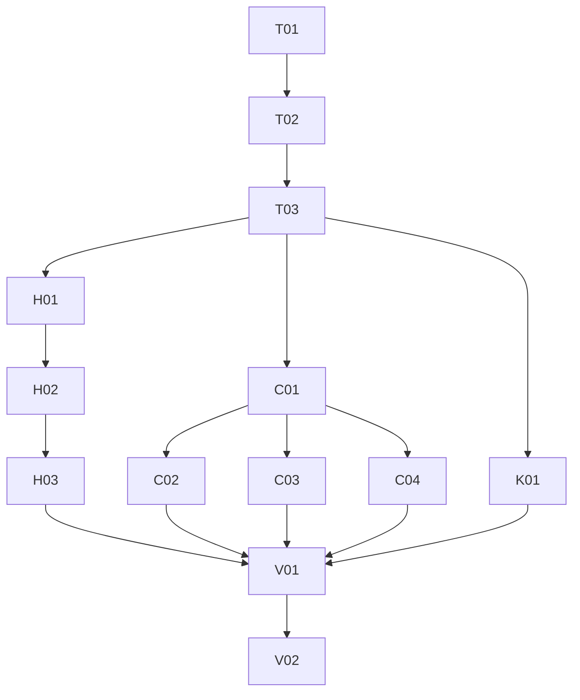

# Mobile visual pass — Task register

| | |
|---|---|
| **Product** | Karat Hive (`kh_mobile`) |
| **Document** | Work list for [`Implementation-Plan.md`](Implementation-Plan.md) |
| **Status** | Complete. N–K done; V01–V02 verified 30 Sep 2026 |
| **Date** | 30 September 2026 |
| **Plan** | [`Implementation-Plan.md`](Implementation-Plan.md) |
| **Does not override** | SRS v1.5 · `CONTEXT.md` · Customer shell IA |

The plan is the contract. Do not add routes, Request fields, or a sixth tab. Field lists for the four Request types stay with `apps/kh_mobile/karat_hive/docs/implementation_plan_create_request_screens.md`.

Status values: **done** · **open** · **blocked**.

Tracks: **N** notes · **T** theme · **H** Home · **C** create · **K** card · **V** verification.

---

## Roadmap

---

## N — Sources

| ID | Status | Task | Acceptance |
|---|---|---|---|
| N01 | done | Retire `Home-2.png` and `find-button-rounded.png` as sources | Both files are absent from `apps/kh_mobile/designs/`. No task references them |

---

## T — Theme

Depends on nothing. Start here. These edits are global to `kh_mobile`.

| ID | Status | Task | Files | Acceptance |
|---|---|---|---|---|
| T01 | done | Lock the colour tokens from plan §5. Set `gold` to `#D8A858`. Add `ctaFill` `#D8C0A8` and `formSurface` `#F0E8E0`. Keep `ink` `#1C1B1A`, Home `surface` `#FDFBF7`, `navBackground` `#F6F1E6`. Pressed fills use the existing relative darken. Do not add pink, bronze `#906840`, or Inter | `packages/kh_design_system/lib/src/tokens.dart` | Tokens match the table. DM Sans and Cormorant stay the bundled families |
| T02 | done | Primary buttons: height 48, radius 10, flat `ctaFill`, ink label, elevation 0. Chips keep their own radius. Secondary actions stay outline or text | `tokens.dart`, `theme.dart`, `KhButton` if it hard-codes the pill | A filled primary button is a rounded rectangle of radius 10, not a stadium. No gradient |
| T03 | done | Bottom nav: height 80, elevation 0, no stadium indicator. Selected icon and label use `goldDark` (contrast; see plan lock #6). Idle icon and label stay muted ink. Do not change destination lists | `theme.dart` `navigationBarTheme` | Customer shell still builds Home, My Requests, Connections, Alerts, Profile. Vendor destinations are unchanged. Selected Home reads as dark gold |

---

## H — Customer Home

Depends on T03.

| ID | Status | Task | Files | Acceptance |
|---|---|---|---|---|
| H01 | done | Hero uses jewellery photography with the display lines on the image, as in `Home-1.png` | `customer_home_screen.dart`, hero widget it already uses | Hero type is the serif display. Copy stays in `kh_l10n` |
| H02 | done | 2×2 tiles for Find An Ornament, Sell Old Gold, Gold Coin(s), Gold Bullion, using the four tile photos in this folder, each with a gold arrow. Tapping a tile still opens that Request type | `customer_home_screen.dart` | Four tiles. Open Requests are not mounted on Home |
| H03 | done (revised 2 Oct 2026) | App bar uses the brand logo `karat-hive-logo.png` (same asset as loading views), unrecoloured, 48 px high. Supersedes the tracked-wordmark approach; no clover asset needed | Home app bar / logo widget | The brand logo is on the app bar, centred. Notification entry remains |

---

## C — Create and review

Depends on T02. C02–C04 also depend on C01.

| ID | Status | Task | Files | Acceptance |
|---|---|---|---|---|
| C01 | done | Shared create chrome: scaffold `formSurface`, primary CTA from T02, secondary Save draft remains an outline or text button. Apply on every create and review scaffold | `create_flow_chrome.dart` | Find, Sell, Coins, Bullion, and review share one CTA shape and fill |
| C02 | done | Find An Ornament **review** follows `Find-orna-create.png`: mosaic with remaining count, rows, Edit as text, one rectangular CTA. Compose fields stay on the Find compose screen | `request_review_publish_screen.dart` | Review matches that structure. Compose is still a separate step |
| C03 | done | Sell Old Gold compose follows `sell-my-create.png`: icon rows, hairline groups, selected condition in `ctaFill` with ink text, indicative value, rectangular CTA. Visible title is Sell Old Gold. Keep the fields required by the create-screen plan | Sell compose screen, `kh_l10n` | Screen title is Sell Old Gold. Condition selection uses `ctaFill` |
| C04 | done | Coins and Bullion take C01 chrome only. Direction, denominations, quantity, and budget behaviour stay | Coin and Bullion compose screens | No new sections. CTA matches C01 |

---

## K — Summary card

Depends on T01.

| ID | Status | Task | Files | Acceptance |
|---|---|---|---|---|
| K01 | done | Bring the Customer summary card in line with `Card-mock.png`: photo, media count, short meta, value panel, one filled View Details using `ctaFill`. No Message control. Border, elevation 0 | `owner_request_card.dart`, Offer row only if it shares this anatomy | Message is absent. CTA hex is `#D8C0A8` |

---

## V — Verification

Depends on H03, C02, C03, C04, and K01.

| ID | Status | Task | Acceptance |
|---|---|---|---|
| V01 | done | Update widget tests that assert pill radius, `#C8A046`, or a gold nav stadium. Run `dart analyze` on `packages/kh_design_system` and `apps/kh_mobile/karat_hive`, plus `flutter test` for `kh_design_system`, customer home, request create, and the summary card | Analyze is clean (0 errors/warnings in `kh_design_system`; karat_hive has one pre-existing unused_import). Named tests pass. Goldens regenerated. See [`Verification-Notes-V01-V02.md`](Verification-Notes-V01-V02.md) |
| V02 | done | Exercise Home, Find review, Sell Old Gold, the summary card, and the Vendor home shell. Check a narrow phone width and a wide width. Confirm five Customer tabs, `goldDark` selected nav, radius-10 CTA, and no Message on the card | Notes recorded in [`Verification-Notes-V01-V02.md`](Verification-Notes-V01-V02.md). Widget/responsive/golden exercise; no interactive Chrome session this run |

---

## Not in this register

Pink Home, pill CTA, Inter, dropping Alerts, moving My Requests onto Home, `kh_admin`, and an edit of `UI-Design-Context.md`.
