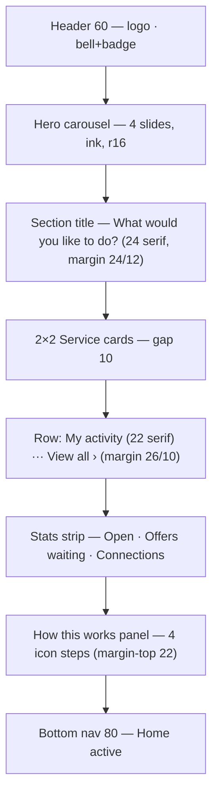
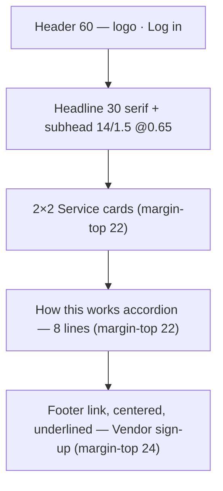

# Karat Hive Mobile — UI Design Context (Direction 1a "Classic")

The binding visual specification for `kh_mobile` Flutter UI: fonts, colours, spacing, shapes, components, screen layouts, motion, and RTL. Every value here is taken from the high-fidelity handoff in [`design_handoff_karat_hive/`](design_handoff_karat_hive/README.md) (`Karat Hive Home.dc.html` option **1a**, `Karat Hive Create Request.dc.html`), then mapped onto the existing `kh_design_system` package.

| | |
|---|---|
| **Status** | Draft — derived from the 1a handoff, 26 Sep 2026 |
| **Scope** | `kh_mobile` Customer surface first (Home CUS-S02, Guest Landing CUS-S23, Create Request CUS-S04–S07); the tokens and components apply app-wide |
| **Fidelity** | High. Colours, type, spacing and component states are final |
| **Reference width** | 390 × 844 logical px (iPhone 14 class) |
| **Code homes** | Tokens/theme/widgets → `packages/kh_design_system`; copy → `packages/kh_l10n/lib/src/strings.dart`; domain-aware widgets → `packages/kh_ui_domain` |
| **Out of scope** | `kh_admin` keeps its own separate theme (`apps/kh_admin/lib/core/design/theme/`) — decided 26 Sep 2026. It does not depend on `kh_design_system` (its `KhStatusTone` is its own, `lib/core/design/widgets/kh_status_tone.dart`), so restyling that package does not change the Admin Portal |

> **Precedence.** This document supersedes the earlier dark sapphire/`#D4AF37` design context, now archived at [`docs/old/Karat_Hive_UI_Design_Context.md`](../../../../docs/old/Karat_Hive_UI_Design_Context.md). Screens not yet redesigned in the 1a style (Offers UI, identity reveal, Vendor screens) take their visual language from this document; the archived one is history only. Neither overrides the SRS or `CONTEXT.md`.

---

## 1. Design personality

| Is | Is not |
|---|---|
| Warm, light, editorial — ivory paper, ink type, gold accents | Dark "luxury app" chrome, neon gold, gradients-everywhere |
| Classic serif headlines over a quiet geometric sans | Decorative type in forms or data |
| Dense but calm — hairlines instead of cards on forms | Card-inside-card nesting, heavy elevation |
| Gold used as a *signal*: CTAs, active states, icons | Gold as a background wash over whole screens |
| Photography-led service tiles | Clip-art or illustration-led tiles |

**Brand-colour rule:** the pink in the logo is the logo's only. Pink never appears anywhere else in the UI.

---

## 2. Colour

### 2.1 Primitive palette

| Token (proposed name) | Hex | Existing `KhTokens` field | Use |
|---|---|---|---|
| `gold` | `#C8A046` | `gold` ✅ | Primary accent: filled CTAs, active icons, toggles/checkbox on, Buy segment, carousel active dot, hero line 1 |
| `goldDark` | `#8A6A1F` | **new** | Links, small labels, eyebrows, icon glyphs inside soft-gold circles |
| `goldPressed` | `#B8903A` | **new** | Primary button pressed/hover |
| `ink` | `#1C1B1A` | `ink` ✅ | All text, dark surfaces (hero), selected chips, active nav pill text |
| `ivory` | `#FDFBF7` | `surface` ✅ | Screen background, cards, text on ink |
| `paper` | `#FFFFFF` | **new** | Raised-on-ivory panels: stats strip, Guest accordion |
| `navBackground` | `#F6F1E6` | **new** | Bottom navigation bar |
| `danger` | `#B3261E` | `danger` ✅ | Notification badge, error text |
| `success` / `warning` / `info` | `#2E7D32` / `#D9A441` / `#6D9BCB` | ✅ | Status only (not used in 1a screens) |

### 2.2 Placeholder imagery

Until real photography is sourced, image slots render a 135° diagonal stripe (6 px bands):

| Context | Stripe A | Stripe B | Caption |
|---|---|---|---|
| On ivory (service tiles, photo thumbnails) | `#F1E9D8` | `#F8F3E8` | 8–9 px mono, `goldDark` |
| On ink (hero photo pane) | `#2A2723` | `#33302A` | 9 px mono, `gold` |

### 2.3 Opacity ramp (alpha tints)

The design builds almost every secondary colour from `ink` or `gold` at a fixed opacity. Use these named levels; don't invent new ones.

**Ink tints** (`ink.withValues(alpha: x)`)

| Alpha | Name | Use |
|---|---|---|
| 0.06 | `inkFill` | Segmented-control track, stepper "–" button, nav top border |
| 0.08 | `inkHairline` | Group dividers on forms, bottom action-bar top border |
| 0.12 | `inkBorderSoft` | Card/tile borders, stats-strip cell separators, accordion border |
| 0.15 | `inkBorderControl` | Back-button ring, toggle track (off) |
| 0.18 | `inkBorderChip` | Unselected chip border |
| 0.20 | `inkBorderField` | Input field border (rest) |
| 0.25 | `inkBorderButton` | Secondary (outlined) button border |
| 0.40 | `inkBorderCheck` | Checkbox border (off), disabled text |
| 0.50–0.55 | `inkMuted` | Trailing chevrons, placeholder icons. The handoff also uses it for label/caption text — see §2.5, text uses 0.62 |
| 0.60–0.65 | `inkSecondary` | Subheads, unselected segment text, stat labels |
| 0.70 | `inkNavIdle` | Inactive nav icon + label |

**Gold tints** (`gold.withValues(alpha: x)`)

| Alpha | Name | Use |
|---|---|---|
| 0.06 | `goldWash` | Add-photo tile background |
| 0.09 | `goldPanel` | "How this works" panel background |
| 0.12 | `goldTile` | Total-weight read-out tile |
| 0.14 | `goldIconCircle` | Stat icon circle |
| 0.16 | `goldNumber` | Numbered guidance circle |
| 0.22 | `goldStepperPlus` | Stepper "+" button |
| 0.28 | `goldNavPill` | Active nav indicator pill |
| 0.50 | `goldRing` | Step-icon circle border |
| 0.70 | `goldDashed` | Add-photo dashed border |
| 1.0 border 1.5 px | — | Focused / emphasised field |

On-ink tint: inactive carousel dot = `ivory @ 0.45`.

### 2.4 Semantic mapping to Material 3

`khTheme()` builds a `ColorScheme.fromSeed(seedColor: gold)`. Override these roles so M3 widgets pick up the 1a palette without per-widget styling:

| `ColorScheme` role | Value |
|---|---|
| `primary` | `gold` |
| `onPrimary` | `ink` (gold buttons carry **ink** text, not white) |
| `secondary` | `ink` |
| `onSecondary` | `ivory` |
| `surface` | `ivory` |
| `onSurface` | `ink` |
| `onSurfaceVariant` | `ink @ 0.55` |
| `surfaceContainerLowest` | `paper` (#FFF) |
| `surfaceContainer` | `navBackground` |
| `outline` | `ink @ 0.20` |
| `outlineVariant` | `ink @ 0.08` |
| `error` | `danger` |

### 2.5 Contrast notes

| Pair | Ratio (approx.) | Verdict |
|---|---|---|
| `ink` on `ivory` | 16:1 | ✅ AAA |
| `ink` on `gold` (CTA label) | ~7:1 | ✅ AAA |
| `goldDark` on `ivory` (links, eyebrows) | ~4.9:1 | ✅ AA body |
| `gold` on `ink` (hero line 1, Sell segment) | ~7:1 | ✅ |
| `gold` on `ivory` | ~2.4:1 | ❌ never for text — icons ≥ 24 px or fills only |
| `ink @ 0.62` on `ivory` | ~4.7:1 | ✅ AA — the lowest alpha allowed for text |
| `ink @ 0.55` on `ivory` (field labels, captions) | ~3.8:1 | ⚠️ Fails AA for the 10.5–11 px text the handoff uses it on. **Deviation from the handoff:** render text at `ink @ 0.62`; keep 0.55 for icons/chevrons only |

---

## 3. Typography

### 3.1 Families

| Role | Latin | Arabic (`ar` locale) | Weights to bundle |
|---|---|---|---|
| **Display / headline** (serif) | Cormorant Garamond | Noto Naskh Arabic | 500, 600, 700, 500 italic |
| **Body / UI** (sans) | DM Sans (optical size 9–40) | IBM Plex Sans Arabic | 400, 500, 600, 700 |
| **Placeholder captions only** | platform monospace | — | — (dev placeholders, never shipped) |

Implementation:

- Bundle the font files as assets in `packages/kh_design_system/fonts/` and declare them in its `pubspec.yaml` `fonts:` block. Reference them with `fontFamily: 'CormorantGaramond', package: 'kh_design_system'`. **Don't fetch fonts at runtime** (`google_fonts` HTTP), because the app must render correctly offline and on first launch.
- Arabic fallback via `fontFamilyFallback: ['NotoNaskhArabic']` / `['IBMPlexSansArabic']`, or switch the family by locale in `khTheme(locale)`. Locale switching is preferred: Cormorant's Latin metrics shouldn't set the line height for Arabic runs.
- The serif is a display face — never below 16 px, never in form values, prices-in-tables, or Vendor data screens.

### 3.2 Type scale

Sizes are logical px. `h` = line height as a multiple of size.

**Serif (Cormorant Garamond)**

| Token | Size / weight / h | Colour | Where |
|---|---|---|---|
| `displayGuest` | 30 / 600 / 1.10 | ink | Guest headline "Request gold your way" |
| `statNumber` | 28 / 700 / 1.00 | ink | Stats-strip numbers |
| `sectionTitle` | 24 / 600 / 1.15 | ink | "What would you like to do?" |
| `heroLead` | 23 / 600 / 1.15 | gold | Hero slide line 1 |
| `blockTitle` | 22 / 600 | ink | "My activity" row header |
| `screenTitle` | 21 / 600 / 1.10 | ink | Create Request screen title |
| `heroBody` | 20 / 500 / 1.20 | ivory | Hero slide lines 2–3 |
| `panelTitle` | 20 / 600 | ink | "How this works" panel title (Home) |
| `accordionTitle` | 19 / 600 | ink | "How this works" accordion header (Guest) |
| `cardTitle` | 17 / 600 / 1.10 | ink | Service card two-line title |
| `purityChip` | 16 / 600 | ink / gold-on-ink | 24K/22K/21K/18K chips |

**Sans (DM Sans)**

| Token | Size / weight / tracking | Colour | Where |
|---|---|---|---|
| `buttonPrimary` | 15 / 700 | ink | Filled gold CTA |
| `buttonSecondary` | 14 / 600 | ink | Outlined button |
| `segmentDirection` | 14 / 700 / +0.06 em, UPPERCASE | per state | BUY / SELL control |
| `body` | 14 / 400 | ink | Field values, general body |
| `bodyLoose` | 14 / 400 / h 1.5 | ink @ 0.65 | Guest subhead |
| `link` | 14 / 600 | goldDark | "Log in" |
| `linkSmall` | 13 / 600 | goldDark | "View all" |
| `list` | 13 / 400 / h 1.45 | ink | Guidance lines |
| `chip` | 13 / 500 (selected 600) | ink / ivory | Ornament-type chips |
| `denomChip` | 12.5 / 500 (selected 600) | ink / gold-on-ink | Coin denomination chips |
| `navLabel` | 12 / 500 (active 700) | ink @ 0.7 / ink | Bottom nav |
| `segment` | 12 / 500 (selected 600) | ink @ 0.6 / ink | Budget-mode segmented control |
| `statLabel` | 12 / 400 | ink @ 0.62 | Stats-strip label |
| `stepLabel` | 11.5 / 600 / h 1.2 | ink | "1. Post a request" |
| `caption` | 11 / 400 | ink @ 0.55 | Helper text, "Purity optional" |
| `fieldLabel` | 10.5 / 600 / +0.08 em, UPPERCASE | ink @ 0.55 | Group labels above fields |
| `fieldInlineLabel` | 10.5 / 400 | ink @ 0.55 | Small label inside a 48 px field |
| `eyebrow` | 10 / 600 / +0.10 em, UPPERCASE | goldDark | "SPECIFY THE PIECE · BUY" |
| `badge` | 10 / 600 / h 16 px | ivory | Notification count |
| `numberBadge` | 11 / 700 | goldDark | Numbered guidance circle |

### 3.3 Mapping to `TextTheme`

Feature code should read `Theme.of(context).textTheme.*` (plus a `KhTypography` extension for the specialist styles), never construct `TextStyle` inline.

| M3 role | 1a token |
|---|---|
| `displaySmall` | `displayGuest` |
| `headlineMedium` | `sectionTitle` |
| `headlineSmall` | `blockTitle` / `screenTitle` |
| `titleLarge` | `panelTitle` |
| `titleMedium` | `cardTitle` |
| `bodyLarge` / `bodyMedium` | `body` / `list` |
| `bodySmall` | `caption` |
| `labelLarge` | `buttonSecondary` |
| `labelMedium` | `navLabel` / `segment` |
| `labelSmall` | `fieldLabel` |
| extension | `statNumber`, `heroLead`, `heroBody`, `purityChip`, `eyebrow`, `segmentDirection` |

### 3.4 Type rules

1. Serif = *what this is* (titles, hero, headline numbers); sans = *everything you read or type*.
2. Uppercase is only for `fieldLabel`, `eyebrow` and `segmentDirection`, always tracked (+0.06 to +0.10 em). Never uppercase Arabic — there is no case, so only the tracking applies, and it should be set to 0 for Arabic.
3. Numbers users compare (weights, AED, counts) use DM Sans with `FontFeature.tabularFigures()`. The single exception is `statNumber`, which is decorative.
4. Units follow the value with a thin space in a muted weight: `24.50 g`, `8,000 AED`. Display in AED, grams and karat (see `CONTEXT.md` for the Karat vs Fineness terms).

---

## 4. Spacing, sizing and layout grid

### 4.1 Spacing scale

The existing `KhSpace` (4/8/16/24/32) covers most values. The 1a screens also use 10, 12, 14 and 22. Add the missing steps rather than hard-coding them:

| Token | px | Existing | Use |
|---|---|---|---|
| `xxs` | 2 | new | Segmented-control inner padding, tight gaps |
| `xs` | 4 | ✅ | Chip-row gaps, nav icon↔label |
| `s6` | 6 | new | Chip gap, label→field gap, dots gap |
| `sm` | 8 | ✅ | Paired-field gap, bottom-bar button gap |
| `s10` | 10 | new | Service grid gap, title-row gap, badge inset |
| `s12` | 12 | new | Vertical gap between form groups, card inner padding |
| `s14` | 14 | new | Stat cell / accordion vertical padding |
| `md` | 16 | ✅ | **Screen side gutter**, panel padding |
| `s22` | 22 | new | Home/Guest section-to-section gap |
| `lg` | 24 | ✅ | Section header top margin, footer gap |
| `xl` | 32 | ✅ | Guest scroll bottom padding |

### 4.2 Fixed dimensions

| Element | Size |
|---|---|
| Screen gutter | 16 px left/right, always |
| App header row | 60 px tall |
| Logo | 44 px tall (Home/Guest); 40 px allowed in compact headers |
| Input / select / read-out row | **48 px, fixed** — every form row |
| Primary & secondary button | 48 px |
| Buy/Sell direction control | 46 px |
| Back button | 36 px circle |
| Ornament-type chip | 32 px tall, 12 px horizontal padding |
| Denomination chip | 38 px |
| Purity chip | 48 px |
| Budget segment | 28 px (in a 32 px track) |
| Toggle switch | 44 × 26 px, knob 20 px, 3 px inset |
| Checkbox | 18 × 18 px |
| Stepper button | 28 px circle |
| Photo thumbnail / add tile | 64 × 64 px |
| Service-card photo | 86 px tall |
| Hero slide | min 208 px tall |
| Icon badge (service card) | 32 × 32 px |
| Stat icon circle | 32 px |
| Step icon circle | 44 px |
| Bottom nav | 80 px (12 top / 16 bottom padding) |
| Nav active pill | 64 × 32 px |
| Notification badge | min 16 × 16 px |

**Touch targets:** anything smaller than 48 px (32 px chips, 28 px stepper buttons, 18 px checkbox, 36 px back button) must still receive a 48 × 48 hit area. Use `materialTapTargetSize: padded` or wrap in a `SizedBox`/`InkWell` with padding. The *visual* size stays as specified.

### 4.3 Shape (radius)

| Token (proposed) | px | Existing `KhRadius` | Use |
|---|---|---|---|
| `chipSm` | 5 | new | Checkbox |
| `sm` | 8 | ✅ | Budget segment thumb |
| `chipMd` | 10 | new | Denomination chips, segmented track, service icon badge |
| `md` / `field` | 12 | ✅ | Inputs, purity chips, thumbnails, total-weight tile |
| `card` | 16 | new | Cards, tiles, hero, stats strip, panels, accordion, Buy/Sell control, ornament chips |
| `lg` | 20 | ✅ (keep for existing callers) | — |
| `pill` | 24 | new | 48 px buttons (fully rounded) |
| `full` | 999 | new | Circles, dots, badges |

Rule of thumb: radius ≈ one third of the element height for pills (`48 → 24`, `32 → 16`, `26 → 13`), 12 for fields, 16 for containers.

### 4.4 Borders and elevation

The 1a style is **flat**. Depth comes from borders and tint, not shadows.

| Level | Treatment | Use |
|---|---|---|
| 0 — flat | No border | Screen, form groups |
| Hairline | 1 px `ink @ 0.08` | Form group dividers, bottom action bar top edge |
| Outlined | 1 px `ink @ 0.12` | Cards, stats strip, accordion |
| Control | 1 px `ink @ 0.20` | Fields |
| Focus | 1.5 px `gold` | Focused field |
| Lift (micro) | `0 1 2 ink@0.12` | Selected budget segment |
| Lift (badge) | `0 1 3 ink@0.10` | Service card icon badge |
| Hover / pressed card | `0 6 18 ink@0.08`, 200 ms | Service card press feedback |

Never use Material elevation tints. Set `surfaceTintColor: Colors.transparent` on cards, app bars and sheets.

---

## 5. Iconography

- **Set:** Material Symbols **Outlined**, weight 400, grade 0, optical size to match. In Flutter use `Icons.*_outlined` equivalents, or the `material_symbols_icons` package if exact glyph parity matters.
- **Filled variant** only for the *active* bottom-nav icon (`FILL 1`).
- **Mirroring:** icons that imply direction (`arrow_back`, `arrow_forward`, `chevron_right`) flip in RTL. Flutter's `Icon` does this automatically for icons with `matchTextDirection: true`; set it on custom ones. Never flip non-directional glyphs (`handshake`, `diamond`, `balance`).

| Context | Size | Colour |
|---|---|---|
| Header bell | 26 | ink |
| Bottom nav | 24 | ink (active, filled) / ink @ 0.7 |
| Step icon (in 44 circle) | 21–22 | goldDark |
| Section/field accents | 22 | goldDark |
| Service badge | 19 | gold |
| Select-field chevron | 20 | ink @ 0.55 |
| Stat icon / "View all" chevron | 18 | goldDark |
| Arrow in 28 px gold circle | 17 | ivory |
| Status bar / small inline | 14–17 | ink @ 0.55 |

| Concept | Material Symbol | Flutter `Icons` |
|---|---|---|
| Home / My Requests / Connections / Alerts / Profile | `home` / `work` / `handshake` / `notifications` / `person` | `home` / `work` / `handshake` / `notifications` / `person` (+ `_outlined` when idle) |
| Find An Ornament | `diamond` | `diamond_outlined` |
| Sell Old Gold | `balance` | `balance` |
| Gold Coin | `monetization_on` | `monetization_on_outlined` |
| Gold Bullion | `crop_landscape` | `crop_landscape_outlined` |
| Stats: Open / Offers waiting / Connections | `description` / `local_offer` / `handshake` | `description_outlined` / `local_offer_outlined` / `handshake_outlined` |
| Steps | `post_add`, `groups`, `balance`, `handshake` | same names |
| Add photo / info / back / accordion | `add_a_photo`, `info`, `arrow_back`, `expand_more`/`expand_less` | `add_a_photo_outlined`, `info_outline`, `arrow_back`, `expand_more`/`expand_less` |

---

## 6. Components

Each entry gives the visual spec, then the Flutter home. **Existing** means a widget already in `kh_design_system` that needs restyling; **new** means a widget to add. All are stateless and driven by props; state lives in the feature controller.

### 6.1 Buttons

| Variant | Spec | Flutter |
|---|---|---|
| **Primary** | 48 px, radius 24, fill `gold`, label 15/700 **ink**, pressed `#B8903A`, disabled `gold @ 0.4` | `KhButton` (existing) → `FilledButton` theme |
| **Secondary** | 48 px, radius 24, 1 px `ink @ 0.25`, transparent, label 14/600 ink | `KhButton(secondary: true)` → `OutlinedButton` theme |
| **Text / link** | 14/600 (or 13/600) `goldDark`, 10×12 padding, optional trailing chevron 18 | `TextButton` theme |
| **Icon circle (back)** | 36 px circle, 1 px `ink @ 0.15`, `arrow_back` 20 | new `KhCircleIconButton` |
| **Arrow chip** | 28 px gold circle, ivory `arrow_forward` 17 (mirrors) | part of `KhServiceCard` |

### 6.2 Bottom action bar (Create Request)

```
┌──────────────────────────────────────────── 1px ink@0.08 ─┐
│  [   Save draft   ]  [          Continue            ]    │  padding 10 16 28
│      1fr (outlined)        1.8fr (filled gold)           │  gap 8
└──────────────────────────────────────────────────────────┘
```

Fixed to the bottom, above the keyboard inset (`MediaQuery.viewInsets` + `SafeArea`). `Row` with `Expanded(flex: 10)` / `Expanded(flex: 18)`. New widget: `KhActionBar`.

### 6.3 Form field (48 px row)

Two layouts share one shell: 48 px tall, radius 12, 1 px `ink @ 0.20`, 12 px horizontal padding.

| Layout | Content | Example |
|---|---|---|
| **Stacked** | `fieldInlineLabel` (10.5) on top, value `body` (14) below, vertically centred | Weight `24.50 g`, Min `8,000 AED` |
| **Inline** | Value/placeholder left, trailing widget right (chevron 20 @ 0.55, unit, switch) | Condition `Good ⌄`, Purity `24K ⌄` |

| State | Change |
|---|---|
| Rest | border `ink @ 0.20` |
| Focused | border 1.5 px `gold` |
| Read-only (computed) | no border, fill `gold @ 0.12` (Total weight tile) or border kept + value non-editable (Weight mirroring total) |
| Error | border 1.5 px `danger`, 11 px `danger` message **below** the row (row height stays 48) |
| Disabled | value `ink @ 0.40` |

Group labels (`fieldLabel`, 10.5/600 uppercase, `ink @ 0.55`) sit 6 px above a field or chip row. A right-aligned counter or note can share the label line (e.g. `REFERENCE PHOTOS ····· 2 / 5`).

Flutter: restyle `KhTextField`, `KhNumericField` and `KhSelectField` through `InputDecorationTheme` (`isDense`, `contentPadding`, `constraints: BoxConstraints.tightFor(height: 48)`, `floatingLabelBehavior: always` with the small label style), rather than wrapping each call site. Notes stay single-line with ellipsis on the compose screen and open a full editor on tap.

### 6.4 Chips (single-select)

| Chip | Size | Unselected | Selected | Layout |
|---|---|---|---|---|
| **Ornament type** | 32 px, radius 16, pad 0 12 | 1 px `ink @ 0.18`, 13/500 ink | fill `ink`, 13/600 **ivory** | One horizontal scrolling row, gap 6, bleeds to screen edge (−16 margin / +16 padding) |
| **Purity** | 48 px, radius 12 | 1 px `ink @ 0.18`, serif 16/600 ink | fill `ink`, serif 16/600 **gold** | 4 equal columns, gap 4 |
| **Coin denomination** | 38 px, radius 10 | 1 px `ink @ 0.18`, 12.5/500 | fill `ink`, 12.5/600 **gold** | 7 equal columns, gap 4, label `Xg` |

Implement one `KhChoiceChip` with a `size`/`typeface` variant, rather than restyling M3 `ChoiceChip` per call site. No checkmark, and no elevation change on select.

### 6.5 Toggle switch

44 × 26 track, radius 13; knob 20 px ivory with a 3 px inset. Off: track `ink @ 0.15`, knob at start. On: track `gold`, knob at end. The knob slides over 150 ms. It sits at the trailing end of a row whose label is 14/400 ink. In paired layouts (Mint + Sealed) the switch stacks above a caption-size label instead.

Flutter: restyle `KhToggle` → `Switch` theme (`trackOutlineColor: transparent`, `thumbIcon: null`, custom `trackColor`/`thumbColor`). Don't use `SwitchListTile` on compose screens: its 56–72 px height breaks the 48 px row.

### 6.6 Checkbox

18 px, radius 5. Off: 1.5 px `ink @ 0.40` border. On: fill `gold`, check glyph ink ~14 px. The label is 14/400 ink with an 8 px gap, and the whole row is tappable. It follows the field above at −4 px (tight coupling). Replace `CheckboxListTile` on compose screens with a compact `KhCheckRow`.

### 6.7 Segmented controls

| Control | Spec |
|---|---|
| **Budget mode** ("Maximum only" / "Min–max range") | Track: pad 2, radius 10, fill `ink @ 0.06`. Segment: 28 px, pad 0 10. Selected: fill ivory, radius 8, shadow `0 1 2 ink@0.12`, 12/600. Unselected: 12/500 `ink @ 0.6`. Hugs content, right-aligned on the Budget label line |
| **Direction** (BUY / SELL) | 46 px, radius 16, 1 px `ink` border, two equal cells, clipped. Buy selected: fill `gold`, ink text. Sell selected: fill `ink`, **gold** text. Unselected cell: transparent, `ink @ 0.6`. Label 14/700, +0.06 em, uppercase |

The Direction control replaces the navy `#1A2744` Sell fill that is hardcoded in `DirectionControl` today. Budget mode replaces the `Radio` pair in `BudgetEditor`. Put both in `kh_design_system` as `KhSegmentedControl<T>`. The existing `KhSegmentedTabs` stays for tab-like lists (Open/Drafts).

### 6.8 Quantity stepper + read-out

A row of `[ – ] 3 [ + ]` beside a Total-weight tile (grid `110px | 1fr`, gap 8).
- `–` 28 px circle, fill `ink @ 0.06`, disabled at 1.
- `+` 28 px circle, fill `gold @ 0.22`.
- Value 16/600, tabular figures.
- Total tile: 48 px, radius 12, fill `gold @ 0.12`, stacked label "Total weight" + value `30.00 g`, recomputed live (`denomination × quantity`).

### 6.9 Photo strip

64 × 64 thumbnails, radius 12, gap 8, horizontal. The add tile uses a 1.5 px **dashed** border `gold @ 0.7`, fill `gold @ 0.06`, and an `add_a_photo` 22 goldDark icon. The counter `n / 5` sits on the label line. For Sell Old Gold, add a notice line: `info` 17 + 11 px goldDark text "Actual item only. No stock or catalogue images." Dashed borders need a `CustomPainter` (Flutter has no dashed `Border`); put it in `kh_media`/`kh_design_system` as `KhDashedTile`.

### 6.10 Service card (`KhServiceCard`, new)

```
┌───────────────────────────┐  radius 16, 1px ink@0.12, fill ivory
│ [◆]                        │  photo 86px (cover image / stripe placeholder)
│                            │  badge 32×32 r10 ivory, shadow, icon 19 gold, inset 10/10 (start)
├───────────────────────────┤
│ Find an                    │  pad 10 12 12, gap 4
│ Ornament                   │  serif 17/600 h1.1, two lines
│                        (→) │  28px gold circle, arrow 17 ivory, aligned end
└───────────────────────────┘
```

Used in a 2 × 2 grid, 10 px gap, on both Home and Guest Landing (identical component). Press gives the card-lift shadow. The whole card is one tap target and one semantics node ("Find An Ornament, button").

### 6.11 Hero carousel (`KhHeroCarousel`, new)

- Container: radius 16, fill `ink`, clipped.
- Slide: `Row` with a 1.15 : 1 split, min height 208.
  - Text pane: padding start 18 / end 6 / top 22 / bottom 40, gap 2.
    - Line 1: `heroLead` in gold.
    - Lines 2–3: `heroBody` in ivory.
    - Then a 28 × 1.5 gold rule, 12 px below.
  - Photo pane: dark stripe placeholder or image, caption bottom-start.
- Dots sit bottom-start (14 bottom, 18 start), gap 6. Active dot: 18 × 6 gold pill. Inactive: 6 × 6 `ivory @ 0.45`. Dots are tappable, with 48 px hit area via padding.
- Build it with `PageView` so swipe works (the prototype only has dot-tap; swipe is required in-app).

### 6.12 Stats strip (`KhStatStrip`, new)

3 equal columns, radius 16, 1 px `ink @ 0.12`, fill `paper`. Each cell has 14 × 12 padding and a 6 px gap. Cells after the first get a 1 px `ink @ 0.12` start border. Each cell contains:
- a 32 px `gold @ 0.14` circle with an 18 px goldDark icon
- the `statNumber` (28/700 serif)
- the `statLabel` (12, `ink @ 0.62`)

Each cell is tappable and deep-links to the filtered My Requests or Connections view.

### 6.13 "How this works"

| Variant | Spec |
|---|---|
| **Panel** (Home) | Radius 16, fill `gold @ 0.09`, pad 16 × 12. Title `panelTitle` pad 0 4 12. 4-column grid, gap 4. Each step: 44 px ivory circle with 1 px `gold @ 0.5` ring and a 21–22 goldDark icon, 6 px gap, `stepLabel` "1. Post a request" (no description) |
| **Accordion** (Guest) | Radius 16, 1 px `ink @ 0.12`, fill `paper`. Header row pad 14 × 16: `accordionTitle` + `expand_more`/`expand_less`. Body pad 0 16 14, gap 8. Rows: 20 px `gold @ 0.16` circle with the number (11/700 goldDark) + 13/1.45 text, gap 10. 8 lines. Animate with `AnimatedSize` 200 ms |

### 6.14 App header

60 px, 16 px gutter.
- Logo (44 px, `assets/karat-hive-logo.png`) at the start.
- At the end, one of:
  - **Home:** bell 26 in a 44 px box, with a `danger` badge (min 16, radius 8, 10/600 ivory, inset 6/6 from the top-end).
  - **Guest:** "Log in" link.

The logo is shown on light backgrounds only. Keep it at native aspect ratio and never tint it.

### 6.15 Compose screen header

A row with gap 10 and padding 2 16 10. It contains the back button (36 circle) and a title column:
- `screenTitle` (serif 21/600)
- `eyebrow` (10/600 uppercase goldDark) with 1 px top margin, e.g. `SPECIFY THE PIECE · BUY`

No `AppBar` elevation or background change.

### 6.16 Bottom navigation (`KhBottomNav`, existing — restyle)

80 px, fill `navBackground #F6F1E6`, 1 px top border `ink @ 0.06`, padding 12 top / 16 bottom, 5 equal slots. Each item is a column with a 4 px gap:
- **Active:** 64 × 32 pill, radius 16, fill `gold @ 0.28`, filled icon 24 ink; label 12/700 ink.
- **Idle:** icon 24 outlined and label 12/500, both `ink @ 0.7`.

This matches M3 `NavigationBar` if you set `indicatorColor`, `indicatorShape: StadiumBorder()`, `height: 80` and `labelBehavior: alwaysShow`. Tabs, in order: **Home · My Requests · Connections · Alerts · Profile**. Guest Landing has **no** bottom nav.

### 6.17 Dividers

On compose screens, groups are separated by a full-width 1 px `ink @ 0.08` rule with 12 px space above and below. This replaces card-per-group. Use `Divider(height: 1, thickness: 1)` with the theme's `outlineVariant`.

---

## 7. Screen layouts

### 7.1 Customer Home (CUS-S02)



- Scroll body padding: 4 top, 16 sides, 24 bottom. Only the body scrolls; the header and nav are fixed.
- The open-request list is **not** on Home. It lives under **My Requests**, with History in that tab's app bar.

### 7.2 Guest Landing (CUS-S23)



Scroll padding is 12 top, 16 sides, 32 bottom, with no bottom nav. A Guest can browse and compose (`adr/0011`); sign-in is asked for at publish, not here.

### 7.3 Create Request (CUS-S04–S07) — shared anatomy

```
┌ Compose header (back · title · eyebrow) ───────────────┐  fixed
│ Body: padding 4 16 0, groups gap 12, hairline dividers │  scrolls if it must
│   [photos]  ─  [type chips]  ─  [weight | purity]  ─    │
│   [toggles/checks]  ─  [budget]  ─  [notes]             │
└ Action bar: Save draft (1) · Continue (1.8) ───────────┘  fixed
```

Density rules:
1. One 48 px row per field. Pair related fields two-up (`Row` + two `Expanded`, gap 8).
2. Chips on one line. If they overflow, scroll horizontally. Don't wrap them.
3. Hairlines between groups; no cards.
4. Conditional sections (gemstone fields, Min budget, the whole Budget block for Sell) are **really removed from the tree** (`if (...)`), never hidden with opacity or `Visibility(maintainSize)`.
5. **One screen is the target, not a guarantee.** The body stays in a scroll view. At 390 × 844 in English with the keyboard down it should fit; with the keyboard open, larger text or Arabic it must scroll rather than overflow.

| Screen | Groups, top → bottom |
|---|---|
| **Find An Ornament** (Buy fixed) | Reference photos `n/5` → Ornament type (optional) chips → Weight + Purity chips (4-up) → ☐ Weight is approximate · "Purity optional" → Includes gemstones ⏻ → *(if on)* Gemstone type + Count → Budget `[Max only \| Range]` → *(range)* Min + Max / *(max)* Max full width → ☐ Budget is flexible → Notes |
| **Sell Old Gold** (Sell fixed) | Photos of your piece `n/5` + actual-item notice → Ornament type chips → Weight + Purity chips → ☐ Weight is approximate → Condition (optional) ⌄ → Original invoice or hallmark certificate ⏻ → Notes. **No Budget** |
| **Buy/Sell Gold Coin(s)** | BUY/SELL control → Coin denomination 7-up chips → Quantity stepper + Total weight tile → Weight (read-only, mirrors total) + Purity `24K ⌄` → Mint/brand (optional) + Sealed ⏻ → *(Buy only)* Budget optional + Max + ☐ Flexible → Notes |
| **Buy/Sell Gold Bullion** | BUY/SELL control → Bar weight + Quantity → Weight (mirrors) + Purity ⌄ → ☐ Weight is approximate → Refiner/brand (optional) → Serial/assay certificate present ⏻ → *(Buy only)* Budget → Notes |

Eyebrow text follows direction: `Specify the piece · Buy` / `· Sell`.

---

## 8. Motion

| Interaction | Duration | Curve |
|---|---|---|
| Carousel auto-advance | every 4200 ms | — |
| Carousel slide transition | 600 ms | `Cubic(0.2, 0.7, 0.2, 1)` |
| Card press shadow | 200 ms | `Curves.easeOut` |
| Toggle knob / chip select / segment thumb | 150 ms | `Curves.easeOut` |
| Accordion / conditional field reveal | 200 ms | `AnimatedSize`, `Curves.easeInOut` |
| Page transition | platform default | — |

- **Reduced motion:** when `MediaQuery.disableAnimationsOf(context)` is true, stop carousel autoplay and make every transition instant.
- **Autoplay behaviour:** pause autoplay while the user drags, and restart the 4.2 s timer after a manual change. Also pause when the Home tab isn't visible (`TickerMode`/visibility) so the timer doesn't run behind other tabs.
- The earlier "gold-light sweep" animation from the old context document is **not** part of 1a. Don't add it to these screens.

---

## 9. RTL and Arabic

| Concern | Rule |
|---|---|
| Direction | Driven by `Localizations` locale. Use `EdgeInsetsDirectional`, `AlignmentDirectional` and `start`/`end` everywhere; never `left`/`right` |
| Fonts | Swap to Noto Naskh Arabic (serif roles) / IBM Plex Sans Arabic (sans roles) by locale; set letter-spacing to 0 for Arabic |
| Mirroring | Carousel direction, dot position, badge inset, chevrons and arrows all mirror. Numbers stay LTR inside RTL runs (use Western digits unless Product decides otherwise) |
| Copy | All strings in `kh_l10n` EN + AR. The Home/Guest Arabic copy exists in the prototype's `COPY.ar` block — import it from there |
| Gap | **Create Request screens have no Arabic in the handoff.** Build them bidi-safe from the start and add the strings |

---

## 10. Responsive behaviour

The handoff is drawn only at 390 px. The project rule is that every screen works at narrow **and** wide widths. Until a wide design exists, apply these `[PROPOSED]` rules:

| Width | Behaviour |
|---|---|
| < 360 | Gutter stays 16. Service grid stays 2-up, card titles may wrap to 3 lines. Purity chips stay 4-up; denominations drop to a horizontal scroll row |
| 360–599 | As designed |
| ≥ 600 (tablet / landscape / web) | Centre the content in a column of max 560 px. Service grid becomes 4-up. The hero keeps its 1.15:1 split with a max height of 260. Pairs stay two-up; the compose body stays max 560 |

Verify with a narrow (~320) and a wide (~1024) viewport before calling a screen done.

---

## 11. Accessibility

- Minimum 48 × 48 hit area on every interactive element (see §4.2).
- Text scales with system settings up to 200%. 48 px rows grow to fit text rather than clipping, which is another reason the compose body must scroll.
- Semantics:
  - Chips: `selected` state.
  - Switch/checkbox rows: one merged node with the label.
  - Stepper: announce the value on change.
  - Carousel dots: "Slide 2 of 4".
  - Notification badge: included in the bell's label ("Alerts, 3 new").
- Never convey state by colour alone. Selected chips invert fill *and* weight; errors add text.
- Placeholder captions (`ring`, `hero · gold necklace`) are dev-only and must never reach a release build.

---

## 12. Terminology in UI copy

The handoff copy was written before the `CONTEXT.md` vocabulary review. When moving strings into `kh_l10n`, use the glossary terms:

| Handoff says | Use | Why |
|---|---|---|
| "Sell my Ornament" | **Sell Old Gold** (Request type) | `CONTEXT.md` Request type name |
| "jeweller(s)" as the main noun | **Vendor(s)**, with "jeweller" only as a friendly synonym | `CONTEXT.md` Vendor `_Avoid_` list |
| "Are you a jeweller? Register here." | Keep as marketing copy if Product agrees; the target is Vendor registration | Product call |
| "Purity 24K · 999.9" (bullion) | Show **Karat** *or* **Fineness**, labelled as such | Karat and Fineness are distinct terms |
| "deal", "bid", "listing", "chat" | Never | `_Avoid_` lists (Offer, Request, Connection) |

---

## 13. Implementation checklist (`kh_design_system`)

| # | Change | File |
|---|---|---|
| 1 | Add `goldDark`, `goldPressed`, `paper`, `navBackground` to `KhTokens`, plus the alpha-ramp getters (§2.3) | `lib/src/tokens.dart` |
| 2 | Add spacing steps 2/6/10/12/14/22 and radii 5/10/16/24/999 (keep existing getters) | `lib/src/tokens.dart` |
| 3 | Bundle the 4 font families; declare them in `pubspec.yaml` | `fonts/`, `pubspec.yaml` |
| 4 | `khTheme(locale)` — ColorScheme overrides (§2.4), TextTheme (§3.3), `KhTypography` extension, Input/Filled/Outlined/Text button, Switch, Checkbox, NavigationBar, Divider themes | `lib/src/theme.dart` |
| 5 | Restyle existing: `KhButton`, `KhTextField`, `KhNumericField`, `KhSelectField`, `KhToggle`, `KhBottomNav` | `lib/src/widgets/` |
| 6 | New: `KhChoiceChip`, `KhSegmentedControl<T>`, `KhCheckRow`, `KhStepper`, `KhReadoutTile`, `KhActionBar`, `KhCircleIconButton`, `KhDashedTile`, `KhServiceCard`, `KhHeroCarousel`, `KhStatStrip`, `KhHowItWorks` (panel + accordion) | `lib/src/widgets/` |
| 7 | Move the hardcoded colours out of `DirectionControl` (`#1A2744` etc.) and onto the tokens | `request_create/.../create_fields.dart` |
| 8 | Add Home/Guest/carousel/guidance copy (EN + AR) and Create Request AR copy | `kh_l10n/lib/src/strings.dart` |
| 9 | Golden tests for each new widget at 320 / 390 / 1024 widths, LTR + RTL | `packages/kh_design_system/test/` |

---

## 14. Open items

Recorded as open; don't resolve them by inference.

| Item | Blocks |
|---|---|
| **Anklet** chip — not in `OrnamentType` (backend enum + SRS change needed) or drop the chip | Ornament type chip row |
| Bullion purity: Karat or Fineness? | Bullion purity picker label/values |
| Validation/error states for all four compose screens, including the AED 500 bullion minimum (`BR-010`) | Compose screens' error styling (§6.3 gives the visual spec only) |
| Wide-viewport layouts (only 390 px exists) | §10 is `[PROPOSED]` |
| Real photography for hero slides and service tiles | Release build |
| `support.js` is missing from the handoff, so the `.dc.html` prototypes don't run locally | Interactive review of the prototypes |
| `ui-mock/` still implements the archived dark palette — re-base its Customer/Vendor screens on this document (`kh_admin` is deliberately excluded, see header) | Prototype matching the mobile app |
