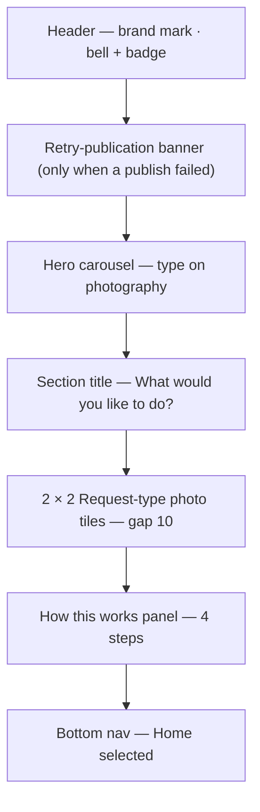
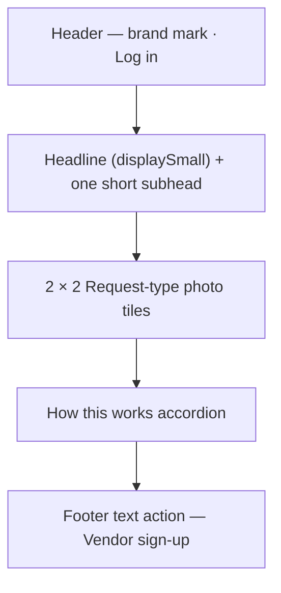

# Karat Hive Mobile — UI Design Context ("Modern Luxury Jewellery Editorial")

The binding visual specification for `kh_mobile` Flutter UI: principles, colour, type, spacing, shape, components, screen layouts, motion, RTL and accessibility. It is built from the written design system [`designs/design-System.md`](../../../../designs/design-System.md), with the decisions locked by the champagne visual pass ([`apps/kh_mobile/designs/Implementation-Plan.md`](../../designs/Implementation-Plan.md) §3) applied on top. It maps everything onto the existing `kh_design_system` package.

| | |
|---|---|
| **Status** | Current — rewritten 30 Sep 2026. Supersedes Direction 1a "Classic" (archived at [`docs/old/UI-Design-Context-1a-Classic.md`](../../../../docs/old/UI-Design-Context-1a-Classic.md)) |
| **Scope** | All of `kh_mobile`, Customer and Vendor. Customer surfaces are editorial; Vendor surfaces share the tokens at a higher density (§7.8) |
| **Reference width** | 390 × 844 logical px (iPhone 14 class) |
| **Code homes** | Tokens/theme/widgets → `packages/kh_design_system`; copy → `packages/kh_l10n/lib/src/strings.dart`; domain-aware widgets → `packages/kh_ui_domain` |
| **Screen mocks** | `apps/kh_mobile/designs/`: `Home-1.png`, `Find-orna-create.png`, `sell-my-create.png`, `Card-mock.png`, and the four tile photographs |
| **Out of scope** | `kh_admin` keeps its own theme (`apps/kh_admin/lib/core/design/theme/`) and does not depend on `kh_design_system` |

> **Precedence.** When sources disagree, the higher row wins:
>
> | # | Source | Wins over |
> |---|---|---|
> | 1 | SRS v1.5, [`CONTEXT.md`](../../../../CONTEXT.md), `docs/Architecture-Frontend.md`, the Customer shell IA in `CLAUDE.md` | Everything below. A mock or written rule that shows a control the domain forbids loses |
> | 2 | Locked decisions — `Implementation-Plan.md` §3 | `design-System.md` where they conflict (colour hexes, CTA colour, fonts, five tabs, nav selection) |
> | 3 | `design-System.md` | The mocks for anything they don't draw: spacing, type roles, borders, text actions, empty/loading/error rules |
> | 4 | The mocks in `apps/kh_mobile/designs/` | — |
>
> Where this document states a target that the code doesn't meet yet, the gap is listed in §14.1. Treat the document as correct and the code as behind.

---

## 1. Design personality

> **Luxury through restraint — not decoration.** The jewellery is the visual focus; the UI almost disappears around it.

| Principle | Rule |
|---|---|
| Minimalism | Remove anything that doesn't help the user act or understand |
| Whitespace | Generous spacing is intentional, not wasted |
| Jewellery first | Photography gets more visual weight than UI decoration |
| Quiet luxury | Gold is an accent, never the dominant colour (§2.6) |
| Simple ornaments | Thin geometric lines and small motifs only (§6.17) |
| Short copy | Prefer 1–3 word labels over sentences |
| Flat | No heavy gradients, glassmorphism or hard shadows |
| Soft geometry | Moderate corner rounding (8–16 px), not highly rounded "app" shapes |
| Editorial | Closer to a luxury catalogue than a marketplace dashboard |
| Material 3 foundation | M3 components and semantics, with the visual language overridden in `KhTheme` |

**The Tiffany principle:** if removing a decorative element makes the jewellery more prominent, remove it. More whitespace, less ornament, less text, better photography and precise type make luxury. More gold, borders, ornaments and gradients don't.

**The 70 / 20 / 10 rule:** 70% neutral space and surfaces, 20% content and imagery, 10% brand accent. Gold lives inside the 10%.

**Explicitly avoid:** gold backgrounds, Art Deco borders, filigree, large gradients, glassmorphism, heavy shadows, long text blocks, badge clutter, too many pills, rainbow status colours, dense dashboards for Customers, every section in a card, decorative icons with no function, and showy animation.

**Brand-colour rule:** the pink in the logo artwork belongs to the logo only. Pink never appears in UI chrome (lock #1).

---

## 2. Colour

### 2.1 Palette

The hexes are locked by the visual pass (`Implementation-Plan.md` §5) and live in `KhTokens.light`.

| Token | Hex | Role |
|---|---|---|
| `gold` | `#D8A858` | Accent signal: Home icons, carousel dots and chevron, tile arrows, toggle/checkbox on, focus ring |
| `goldDark` | `#8A6A1F` | Accessible gold: selected bottom-nav icon and label, links, text actions, eyebrows, small gold glyphs |
| `ctaFill` | `#D8C0A8` | Champagne primary-action fill: filled buttons, selected condition chip, card CTA. Label is `ink` |
| `ctaFillPressed` | computed | `ctaFill` lerped 10% toward `ink`. No separate sampled hex |
| `ink` | `#1C1B1A` | All text, dark surfaces, selected chips |
| `surface` (`ivory`) | `#FDFBF7` | Home, shell and general screen background |
| `formSurface` | `#F0E8E0` | Create and review scaffolds only |
| `paper` | `#FFFFFF` | Panels raised on ivory |
| `navBackground` | `#F6F1E6` | Bottom navigation bar |
| `danger` / `success` / `warning` / `info` | `#B3261E` / `#2E7D32` / `#D9A441` / `#6D9BCB` | Status only. Target is the muted set in §6.20 — see gap G-01 |

**From `design-System.md`, not adopted:**

| Written value | Replaced by | Why |
|---|---|---|
| Charcoal `#242320` | `ink` `#1C1B1A` | Close enough; no second near-black (plan §3) |
| Ivory `#FAF8F3` | `surface` `#FDFBF7` | Measured from `Home-1.png` |
| Champagne `#C6A15B`, gold `#D4AF37`, gold-light `#E8D6A5` | `gold` `#D8A858`, `ctaFill` `#D8C0A8` | Measured from the mocks (plan §5) |
| Stone ramp `stone50`–`stone600`, `mutedText` | The ink alpha ramp (§2.3) | Same job, one family, already in code |
| Sapphire `#0A1128` | Not a token | "Optional legacy tone" in the written system; not introduced without a decision |
| Pink `#F84080`, bronze `#906840` | Never | Lock #3 |

### 2.2 Semantic roles

Feature code never references a primitive hex. It reads `context.tokens.*` or `Theme.of(context)`. The written system's semantic names map onto `KhTokens` like this:

| Semantic role (`design-System.md` §4) | `KhTokens` |
|---|---|
| `background` | `surface` (Home, shell) / `formSurface` (create, review) |
| `surface` (raised) | `paper` |
| `textPrimary` | `ink` |
| `textSecondary` | `inkSecondary` (ink @ 0.62) |
| `textDisabled` | `inkBorderCheck` (ink @ 0.40) |
| `border` | `inkBorderSoft` (containers) / `inkBorderField` (controls) |
| `divider` | `inkHairline` |
| `accent` | `gold` (fills, icons) / `goldDark` (text) |
| `actionPrimary` | `ctaFill` |
| `success` / `error` / `warning` | `success` / `danger` / `warning` |

New tokens get semantic names (`ctaFill`, `formSurface`), not visual ones (`goldButtonColor`). Existing names stay; don't rename them for style.

### 2.3 Opacity ramp (alpha tints)

Secondary colours come from `ink` or `gold` at fixed alphas. Use these named getters; don't invent new levels.

**Ink tints**

| Alpha | Getter | Use |
|---|---|---|
| 0.06 | `inkFill` | Segmented track, stepper "–", nav top border, skeleton fill |
| 0.08 | `inkHairline` | Form-group dividers, action-bar top border |
| 0.12 | `inkBorderSoft` | Card, tile and panel borders |
| 0.15 | `inkBorderControl` | Back-button ring, toggle track off |
| 0.18 | `inkBorderChip` | Unselected chip border |
| 0.20 | `inkBorderField` | Field border at rest |
| 0.25 | `inkBorderButton` | Outlined button border |
| 0.40 | `inkBorderCheck` | Checkbox border off, disabled text |
| 0.55 | `inkMuted` | Icons and chevrons only — never text (§2.5) |
| 0.62 | `inkSecondary` | Secondary text; the lowest alpha allowed for text |
| 0.70 | `inkNavIdle` | Idle bottom-nav icon and label |

**Gold tints**

| Alpha | Getter | Use |
|---|---|---|
| 0.06 | `goldWash` | Add-photo tile |
| 0.09 | `goldPanel` | "How this works" panel |
| 0.12 | `goldTile` | Read-out tile |
| 0.14 | `goldIconCircle` | Icon circles |
| 0.16 | `goldNumber` | Numbered guidance circle |
| 0.22 | `goldStepperPlus` | Stepper "+" |
| 0.50 | `goldRing` | Step-icon ring |
| 0.70 | `goldDashed` | Add-photo dashed border |

On ink or on photography: idle carousel dot = `ivoryDotIdle` (ivory @ 0.45).

### 2.4 Material 3 mapping

`KhTheme.light()` seeds `ColorScheme.fromSeed(gold)` and overrides the roles so stock M3 widgets pick up the palette:

| Role | Value |
|---|---|
| `primary` / `onPrimary` | `gold` / `ink` |
| `secondary` / `onSecondary` | `ink` / `surface` |
| `surface` / `onSurface` | `surface` / `ink` |
| `onSurfaceVariant` | `inkMuted` |
| `surfaceContainerLowest` | `paper` |
| `surfaceContainer` | `navBackground` |
| `outline` / `outlineVariant` | `inkBorderField` / `inkHairline` |
| `error` / `onError` | `danger` / `surface` |
| `surfaceTint` | transparent — never tint by elevation |

Filled and elevated buttons don't use `primary`; they use `ctaFill` directly (§6.1).

### 2.5 Contrast

Ratios computed for the locked hexes (WCAG 2.x).

| Pair | Ratio | Verdict |
|---|---|---|
| `ink` on `surface` | 16.6:1 | AAA |
| `ink` on `formSurface` | 14.2:1 | AAA |
| `ink` on `ctaFill` (CTA label) | 9.8:1 | AAA |
| `gold` on `ink`, `ink` on `gold` | 7.9:1 | AAA |
| `inkNavIdle` on `navBackground` | 6.0:1 | AA |
| `goldDark` on `surface` | 4.9:1 | AA body |
| `inkSecondary` on `surface` | 4.8:1 | AA — lowest text alpha |
| `goldDark` on `navBackground` | 4.5:1 | AA (selected nav label) |
| `inkSecondary` on `formSurface` | 4.5:1 | AA, no margin — don't go lighter on form screens |
| `goldDark` on `formSurface` | 4.2:1 | ⚠️ Fails AA for body text. On create/review screens use `goldDark` only for text ≥ 18.66 px bold / 24 px, or for icons; small eyebrows and labels use `ink`/`inkSecondary` |
| `inkMuted` on `surface` | 3.8:1 | ❌ for text — icons and chevrons only |
| `gold` on `surface` | 2.1:1 | ❌ never text, at any size. Icons ≥ 24 px and fills only |
| `gold` on `navBackground` | 1.9:1 | ❌ — why selected nav uses `goldDark` (lock #6) |

### 2.6 Gold usage

Gold is used for selected states, thin separators, icons, focus, prices where they're the priority, the one important action, and brand details. It generally occupies **under 10%** of a screen. Never a background wash, never gold borders around everything, never a fully gold active nav item.

**Exception (lock #13):** the Sell Old Gold compose screen puts a gold icon on each field row and may exceed 10%, because its mock does.

---

## 3. Typography

Editorial, elegant and quiet. Luxury comes from **scale + whitespace + contrast**, not **bold + gold + borders + shadows**.

### 3.1 Families

| Role | Latin | Arabic (`ar`) |
|---|---|---|
| Display / headline (serif) | Cormorant Garamond | Noto Naskh Arabic |
| UI / body (sans) | DM Sans | IBM Plex Sans Arabic |

- **DM Sans, not Inter.** The written system recommends Inter; lock #7 keeps DM Sans. Don't add Inter.
- Fonts are bundled in `packages/kh_design_system/fonts/` and declared in its `pubspec.yaml`. Never fetch fonts at runtime — the app must render offline and on first launch.
- `KhFonts.forLocale` switches family by locale. Arabic drops letter-spacing to 0.
- The serif is for *what this is*: page titles, hero lines, Request-type names, headline numbers. Never below 16 px, never on form values, prices in tables or Vendor data screens.

### 3.2 Type scale

Target roles from `design-System.md` §7. The "Shipped" column is what `KhTheme` carries today; see gap G-02.

| M3 role | Target size / weight | Family | Use | Shipped |
|---|---|---|---|---|
| `displayLarge` | 40 / 400 | serif | Hero | 40 / 600 |
| `displayMedium` | 32 / 400 | serif | Major editorial title | 34 / 600 |
| `displaySmall` | 28 / 400 | serif | Guest headline, collection-scale title | 30 / 600 |
| `headlineLarge` | 24 / 500 | serif | Screen title | 26 / 600 |
| `headlineMedium` | 20 / 500 | serif | Section title | 24 / 600 |
| `titleLarge` | 18 / 500 | serif | Card / Request title | 20 / 600 |
| `bodyLarge` | 16 / 400 | sans | Main content, **form input values** | 14 / 400 |
| `bodyMedium` | 14 / 400 | sans | Secondary content | 13 / 400 |
| `bodySmall` | 12 / 400 | sans | Metadata, helper, error | 11 / 400 |
| `labelLarge` | 14 / 500 | sans | Buttons, field labels | 14 / 600 |
| `labelMedium` | 12 / 500 | sans | Small labels, nav | 12 / 500 |
| `labelSmall` | 11 / 500 | sans | Micro metadata, uppercase labels | 10.5 / 600 |

Primary-button labels are the one place a heavier weight is allowed (`buttonPrimary`, 15 / 700) so the champagne CTA reads at a glance.

### 3.3 `TextTheme` and `KhTypography`

Feature code reads `Theme.of(context).textTheme.*`, plus the `KhTypography` extension for specialist styles. Never construct a `TextStyle` inline.

| `KhTypography` role | Use |
|---|---|
| `heroLead`, `heroBody` | Hero display lines on photography |
| `displayGuest`, `blockTitle`, `accordionTitle`, `statNumber`, `purityChip` | Serif specialist roles |
| `buttonPrimary` | Filled CTA label |
| `link`, `linkSmall` | Text actions in `goldDark` |
| `chip`, `denomChip`, `segmentDirection` | Chip and segmented labels |
| `fieldLabel`, `fieldInlineLabel`, `eyebrow` | Form labels and tracked uppercase |
| `statLabel`, `stepLabel`, `bodyLoose`, `badge`, `numberBadge` | Small supporting text |
| `tabular` | Numbers users compare (weight, AED, counts) |

### 3.4 Letter spacing

| Text | Tracking |
|---|---|
| Editorial headings (serif) | −0.5 to 0 |
| Uppercase labels (`fieldLabel`, `eyebrow`, the brand wordmark) | +1.2 to +2.0 px |
| Normal UI text | 0 |
| Any Arabic run | 0 |

### 3.5 Rules

1. Serif names things; sans is everything you read or type.
2. Don't use bold everywhere. Hierarchy comes from size and whitespace first.
3. Uppercase only for tracked labels, eyebrows and the direction control. Never uppercase Arabic.
4. Numbers users compare use `FontFeature.tabularFigures()` (`tabular`).
5. Units follow the value: `24.50 g`, `AED 8,000`, `22K`. AED, grams, karat/fineness only (`CONTEXT.md` Karat vs Fineness).

---

## 4. Spacing, sizing and layout grid

### 4.1 Spacing scale

An **8-point system** with 4 as the half-step (`design-System.md` §9). Code names in `KhSpace` are authoritative; don't rename them to the written system's names.

| px | `KhSpace` | Use |
|---|---|---|
| 4 | `xs` | Micro spacing |
| 8 | `sm` | Icon → text, paired-field gap |
| 12 | `s12` | Compact component, gap between form groups |
| 16 | `md` | Standard component padding, component gap, screen gutter |
| 24 | `lg` | Section spacing |
| 32 | `xl` | Major section spacing |
| 40 / 48 / 64 / 80 | — | Page separation, hero separation, luxury whitespace. Not yet tokens (gap G-03) |

`xxs` (2), `s6`, `s10`, `s14` and `s22` are off-grid steps carried over from 1a. Existing callers keep them; new code uses the 8-point steps.

### 4.2 Layout grid and fixed dimensions

| Element | Value |
|---|---|
| Screen gutter | 16 px (the written system allows 16–20 and prefers 20 — open item O-01) |
| Editorial / hero sections | Up to 24 px side padding |
| Component gap / section gap | 16 / 24 px |
| Photography grid | 2 columns, 8–12 px gap (service grid: 10) |
| Horizontal carousels | 12–16 px gap |
| App header | 56–64 px (shipped: 60) |
| Input / select / read-out row | 48 px |
| Primary and secondary button | 48 px (written range 48–52) |
| Buy/Sell direction control | 46 px |
| Back button | 36 px circle |
| Ornament-type chip / denomination chip / purity chip | 32 / 38 / 48 px |
| Toggle / checkbox / stepper button | 44 × 26 / 18 × 18 / 28 px |
| Photo thumbnail and add tile | 64 × 64 px |
| Hero | min 208 px, grows to the tallest slide |
| Bottom nav | 80 px |
| Notification badge | min 16 × 16 px |

**Touch targets:** 48 × 48 minimum on every interactive element — stricter than the written system's 44 × 44, and what `MaterialTapTargetSize.padded` gives. Smaller visuals (chips, stepper, checkbox, back button) keep their visual size and get padded hit areas.

### 4.3 Shape (radius)

"Soft but restrained". Avoid making everything 24/28/32.

| Component | Target | `KhRadius` |
|---|---|---|
| Checkbox | 5 | `chipSm` |
| Segment thumb, small image | 8 | `sm` |
| **Button** (primary and secondary) | **10** | `button` |
| Denomination chip, segmented track | 10 | `chipMd` |
| Input / field | 10 | `field` is 12 today (gap G-04) |
| Product / Request image, thumbnail, purity chip | 12 | `md` |
| Card, tile, hero, panel | 12–16 | `card` (16) |
| Bottom sheet | 20 (top corners) | `lg` — sheets use `card` today (gap G-04) |
| Ornament-type chip, status chip, dots, badges | fully rounded | `full` |
| Avatar | circle | `full` |

`pill` (24) is kept for legacy callers only. Primary buttons are never a stadium (lock #4).

### 4.4 Borders and elevation

Mostly borderless-feeling and shadowless.

| Level | Treatment | Use |
|---|---|---|
| Flat | No border | Screen, form groups |
| Hairline | 1 px `inkHairline` | Group dividers, action-bar top edge |
| Outlined | 1 px `inkBorderSoft` | Cards, tiles, panels |
| Control | 1 px `inkBorderField` | Fields at rest |
| Focus / selected | 1.5 px `gold` | Focused field, selected card or item |
| Floating | `BoxShadow(blurRadius: 20, offset: (0, 6), color: black12)` | Floating surfaces only (sheets, overlays) |

Gold borders are reserved for a selected item, a focused control or the one important action. Elevation is 0 everywhere else; set `surfaceTintColor: Colors.transparent` on cards, app bars, dialogs and sheets.

---

## 5. Iconography

- **One family:** Material Symbols / Material Icons, **Outlined**, thin and geometric. Never mix with FontAwesome, custom filled sets or emoji.
- Filled glyph only for the selected bottom-nav destination.
- **Sizes:** 20 standard, 24 primary action and nav, 28 feature icon, 32 empty-state icon.
- Gold icons sparingly: Home tile arrows, hero chevron, Sell Old Gold row icons (lock #13). Small gold glyphs on light surfaces use `goldDark`.
- Directional icons (`arrow_back`, `arrow_forward`, `chevron_right`) mirror in RTL (`matchTextDirection: true`). Non-directional glyphs (`handshake`, `diamond`, `balance`) never flip.

| Concept | `Icons` |
|---|---|
| Home / My Requests / Connections / Alerts / Profile | `home` / `work` / `handshake` / `notifications` / `person` (+ `_outlined` when idle) |
| Find An Ornament / Sell Old Gold / Gold Coin / Gold Bullion | `diamond_outlined` / `balance` / `monetization_on_outlined` / `crop_landscape_outlined` |
| Add photo / info / back / expand | `add_a_photo_outlined` / `info_outline` / `arrow_back` / `expand_more`, `expand_less` |

---

## 6. Components

Each entry gives the visual rule, then the Flutter home. Components are stateless and prop-driven; state lives in the feature controller. Build reusable components in `kh_design_system` rather than styling screens one by one.

### 6.1 Buttons

| Variant | Spec | Flutter |
|---|---|---|
| **Primary** | 48 px, radius 10, flat `ctaFill`, label `buttonPrimary` in `ink`, pressed `ctaFillPressed`, disabled `ctaFill @ 0.4` with `inkBorderCheck` label. No gradient, elevation 0 | `KhButton` → `FilledButton` theme |
| **Secondary** | 48 px, radius 10, 1 px `inkBorderButton`, transparent, `labelLarge` ink | `KhButton(secondary: true)` → `OutlinedButton` theme |
| **Text action** | `link` / `linkSmall` in `goldDark`, 10 × 12 padding, optional trailing chevron | `TextButton` theme |
| **Back** | 36 px circle, 1 px `inkBorderControl`, `arrow_back` 20 | circle icon button |

- The written system's default "charcoal button, white label" is **not** the default (lock #2). Its "luxury CTA — champagne with dark text" *is* the primary button everywhere.
- Prefer text actions ("View all →", "Edit", "Remove") over extra buttons. One filled button per view.
- Press feedback: a slight fill change, not a scale or bounce.

### 6.2 Bottom action bar (create and review)

Fixed to the bottom above the keyboard inset (`viewInsets` + `SafeArea`), 1 px `inkHairline` top edge, padding 10 16 28.

- The primary CTA is a full-width rectangular button (Find review, Sell compose), or shares the row with a secondary at 1 : 1.8.
- **Save draft** is an outlined or text secondary action on every create and review scaffold (C01).

### 6.3 Form fields

Forms are extremely clean: a label, a field, an error, nothing else.

| Part | Target | Shipped |
|---|---|---|
| Label | 12–13 px, medium, `ink`, above the field | 10.5 px uppercase `fieldLabel` / inline `fieldInlineLabel` |
| Input value | 16 px (`bodyLarge`) | 14 px |
| Error | 12 px `danger`, below the row; the row stays 48 px | 11 px |
| Row | 48 px, radius 10, 1 px `inkBorderField`; focus 1.5 px `gold`; disabled value `inkBorderCheck` | 48 px, radius 12 |

- **Read-only / computed** values (total weight): no border, `goldTile` fill.
- **Sell Old Gold rows** (lock #13): hairline-separated groups on `formSurface`, a gold leading icon per row, value right-aligned.
- **Search** (§25 of the written system): 48 px, radius 12, fill `inkFill`, no border, 1 px `gold` border on focus.
- Style every field through `InputDecorationTheme`, not per call site. Notes stay single-line on the compose screen and open a full editor on tap.

### 6.4 Chips (single-select)

Chips are for purity, ornament type, Region, Request Type and filters. **Never "category"** — the Category taxonomy entity is gone (`adr/0014`); what the written system calls a category selector is the ornament-type chip row.

| Chip | Size | Unselected | Selected |
|---|---|---|---|
| Ornament type | 32 px, fully rounded, pad 0 12 | 1 px `inkBorderChip`, `chip` ink | `ink` fill, ivory label, weight 600 |
| Purity (karat) | 48 px, radius 12, 4-up | 1 px `inkBorderChip`, serif `purityChip` ink | `ink` fill, `gold` label |
| Coin denomination | 38 px, radius 10, 7-up | 1 px `inkBorderChip`, `denomChip` | `ink` fill, `gold` label |
| Condition (Sell) | 32 px, fully rounded | 1 px `inkBorderChip` | `ctaFill` fill, `ink` label |

Selected state never relies on colour alone: fill *and* weight change, or a ✓. No colourful chips, no checkmark widget, no elevation change.

### 6.5 Toggle

44 × 26 track; 20 px ivory knob with a 3 px inset. Off: `inkBorderControl` track. On: `gold` track. 150 ms knob slide. Trailing end of a 48 px row; don't use `SwitchListTile` on compose screens.

### 6.6 Checkbox

18 px, radius 5. Off: 1.5 px `inkBorderCheck`. On: `gold` fill with an ink check. The whole label row is the tap target (compact check row, not `CheckboxListTile`).

### 6.7 Segmented controls

| Control | Spec |
|---|---|
| Budget mode ("Maximum only" / "Min–max range") | Track pad 2, radius 10, `inkFill`. Segment 28 px. Selected: ivory, radius 8, micro-shadow, 12/600. Idle: 12/500 `inkSecondary` |
| Direction (BUY / SELL) | 46 px, radius 16, 1 px `ink` border, two equal cells. Buy selected: `gold` fill, ink text. Sell selected: `ink` fill, `gold` text. Label `segmentDirection`, uppercase, tracked |

### 6.8 Quantity stepper and read-out

`[ – ] 3 [ + ]` beside a read-out tile. "–" is a 28 px `inkFill` circle, disabled at 1; "+" is a 28 px `goldStepperPlus` circle. The value uses `tabular`. The read-out tile is 48 px, radius 12, `goldTile`, with a stacked label and value, recomputed live.

### 6.9 Photos

- **Compose strip:** 64 × 64 thumbnails, radius 12, gap 8. The add tile has a 1.5 px dashed `goldDashed` border on `goldWash` with an `add_a_photo` icon. A counter `n / 5` sits on the label line. Sell Old Gold adds an info line: actual item only, no stock images.
- **Review mosaic** (`Find-orna-create.png`): a mosaic of the Request's photos with a remaining-count overlay. Adapt the column count at wide widths so tiles don't balloon.
- Photography carries the luxury: soft light, neutral backgrounds, close-ups. No text over jewellery, no heavy image borders, no badge clutter over photos.

### 6.10 Request-type tile (`KhServiceCard`)

Full-bleed photograph (`assets/images/tile_*.webp`), serif title and a `gold` arrow circle overlaid at the bottom, radius `card`. The whole tile is one tap target and one semantics node ("Find An Ornament, button"). Used in a 2 × 2 grid with a 10 px gap on Home and Guest Landing. No icon badge. The stripe placeholder shows only when a photo is missing.

### 6.11 Hero carousel (`KhHeroCarousel`)

- Display type sits **on the jewellery photograph** (lock #8): `heroLead` + `heroBody`, then a 28 × 1.5 `gold` rule.
- Radius `card`, clipped. Min height 208; the height follows the tallest slide, so wrapped Arabic or large text never clips.
- Dots: active 18 × 6 `gold` pill, idle 6 × 6 `ivoryDotIdle`, each with a tall hit area. A `gold` circle chevron advances.
- `PageView` swipe, 4.2 s autoplay (§8).

### 6.12 Activity summary (`KhStatStrip`)

3 equal columns, radius `card`, 1 px `inkBorderSoft`, `paper` fill. Each cell has a 32 px `goldIconCircle` with an 18 px `goldDark` icon, a `statNumber` and a `statLabel`, and deep-links to the filtered My Requests or Connections view. Where it belongs on Home is open item O-03.

### 6.13 "How this works"

| Variant | Spec |
|---|---|
| Panel (Home) | Radius `card`, `goldPanel` fill. 4 steps, each a 44 px ivory circle with a `goldRing` ring, a `goldDark` icon and a `stepLabel` |
| Accordion (Guest) | Radius `card`, 1 px `inkBorderSoft`, `paper`. Header `accordionTitle` + expand icon. Numbered rows use `goldNumber` circles and `numberBadge`. `AnimatedSize` 200 ms |

### 6.14 App header

Clean and ivory: no elevation, minimal icons, the brand mark given breathing room. 56–64 px high, 16 px gutter.

- **Brand mark:** the tracked "KARAT HIVE" wordmark set in Cormorant, standing in for the clover lockup from `Home-1.png` until that asset exists (open item O-02). The wordmark is text on ivory, so it uses `goldDark` or `ink`, never `gold` (§2.5; gap G-05).
- **Home:** bell in a 44 px box with a `danger` count badge (min 16, 10/600 ivory), inset from the top-end corner.
- **Guest:** a "Log in" text action.
- The pink logo artwork is not used in the app bar (plan §2).

### 6.15 Compose header

A row with the 36 px back button and a title column: the screen title (serif) and an uppercase tracked eyebrow ("SPECIFY THE PIECE · BUY"). On `formSurface` the eyebrow uses `inkSecondary`, not `goldDark` (§2.5). No `AppBar` elevation or colour change.

### 6.16 Bottom navigation (`KhBottomNav` / `NavigationBar` theme)

- 80 px, `navBackground`, 1 px `inkFill` top border, elevation 0.
- **No indicator pill** (`indicatorColor: transparent`).
- **Selected:** filled icon 24 and label 12/700, both `goldDark` (lock #6).
- **Idle:** outlined icon 24 and label 12/500, both `inkNavIdle`.
- **Customer — five tabs, in order: Home · My Requests · Connections · Alerts · Profile** (lock #5; the written system's four-tab bar is not adopted). Vendor destinations are their own list. Guest Landing has no bottom nav.

### 6.17 Dividers and ornaments

- Compose groups are separated by a full-width 1 px `inkHairline` with 12 px above and below — hairlines, not a card per group.
- Ornaments are accents, not content: a thin line, a small ring outline, a tiny four-point ✦, a thin gold divider. Never filigree, ornate corners, repeated patterns or framed boxes.

### 6.18 Summary card (Request / Offer)

From `Card-mock.png` with the plan §4.6 corrections:

- Image with a media-count badge, placed with `PositionedDirectional` so it mirrors.
- Short meta: Request Type, localised ornament type, weight, karat. At most two metadata rows.
- An **Indicative Value** panel, shown only when an Indicative Value exists. It is labelled "Indicative Value" (`CONTEXT.md`) and never shows a Customer budget in its place.
- One filled **View Details** (`ctaFill`, radius 10).
- **No Message or chat control** (lock #11). Talk exists only on a Connection, after Acceptance.
- Elevation 0; separation is a 1 px `inkBorderSoft` border.

### 6.19 Offer card and Offer comparison

- **Offer card** order: price → key terms (karat · weight, making charge, readiness) → trust signals → one action. Highly readable, no decoration.
- **Comparison:** a clean table (Offer A / B / C × price, making charge, readiness, rating), not stacked big cards. Highlight differences subtly.
- **Before Acceptance, Vendor identity fields are absent** from the payload and the UI (`BR-006`). Trust signals such as verification status and rating may show; a name, logo or contact may not.
- The Acceptance action may be labelled "Mark as Interested" (`CONTEXT.md` Acceptance). It always goes through a confirmation dialog (§6.22) that says it is irreversible, reveals both identities to that one Vendor, and rejects the other pending Offers.

### 6.20 Status chips

Small, muted, semantic — no rainbow. Colour is never the only signal; the label always shows.

| State (per `CONTEXT.md`) | Treatment |
|---|---|
| Published, Offers received (active) | muted green `#557A62` |
| Verification pending, other waiting states | muted amber `#A5793E` |
| Accepted | champagne (`ctaFill` fill, ink label) |
| Rejected, Removed | muted red `#9B514A` |
| Expired, Cancelled, Closed, Draft | grey (`inkFill` fill, `inkSecondary` label) |

The muted hexes are targets from the written system; they are not tokens yet (gap G-01).

### 6.21 Empty, loading and error states

| State | Rule |
|---|---|
| Empty | One 32 px outlined glyph (♢), a short title ("No Offers yet"), one short line ("Your Request is still open."). No illustration, no paragraph |
| Loading | Skeletons in `inkFill` with a subtle shimmer, not spinners, wherever the layout is known |
| Error | Calm: "Couldn't load Offers" / "Please try again." / a Retry action. Never alarmist copy |

### 6.22 Dialogs and bottom sheets

- **Dialogs** only for destructive, irreversible or important decisions (Acceptance, Cancel a Request, discard a draft). Title, one or two short lines, then Cancel and a confirming action. Radius `card`, no elevation tint.
- **Bottom sheets** for filters, sorting, choosing purity, choosing Region. Top radius 20 (gap G-04), floating shadow (§4.4), one Apply action.

---

## 7. Screen layouts

### 7.1 Customer Home (CUS-S02)


```mermaid
flowchart TB
  H["Header — brand mark · bell + badge"] --> R["Retry-publication banner (only when a publish failed)"]
  R --> C["Hero carousel — type on photography"]
  C --> S["Section title — What would you like to do?"]
  S --> G["2 × 2 Request-type photo tiles — gap 10"]
  G --> HW["How this works panel — 4 steps"]
  HW --> N["Bottom nav — Home selected"]
```

- One visual priority: brand → hero → Request actions → supporting content.
- The body scrolls; header and nav are fixed. Content is a centred column of max 560 px.
- The open-Request list is **not** on Home. It lives under **My Requests**, with History in that tab's app bar (`CLAUDE.md` shell IA).

### 7.2 Guest Landing (CUS-S23)


```mermaid
flowchart TB
  H["Header — brand mark · Log in"] --> HL["Headline (displaySmall) + one short subhead"]
  HL --> G["2 × 2 Request-type photo tiles"]
  G --> AC["How this works accordion"]
  AC --> F["Footer text action — Vendor sign-up"]
```

No bottom nav. A Guest can browse and compose (`adr/0011`); sign-in is asked at publish, not here.

### 7.3 Create Request — shared anatomy (CUS-S04–S07)

```
┌ Compose header (back · title · eyebrow) ────────────────┐  fixed
│ formSurface body, 16 gutter, groups 12 apart, hairlines │  scrolls when it must
└ Action bar: Save draft (secondary) · Continue (primary) ┘  fixed
```

- **Progressive disclosure** (`design-System.md` §28): the Request Type is chosen first, on the Home / Guest tiles; the type's screen then shows only its own fields. No extra wizard or stepper (lock #9).
- The **field list** for each Request Type is owned by [`implementation_plan_create_request_screens.md`](implementation_plan_create_request_screens.md); this document owns only the chrome.
- One 48 px row per field; pair related fields two-up; chips on one scrolling line; conditional sections removed from the tree, not hidden.
- One screen is the target, not a guarantee: with the keyboard open, larger text or Arabic, it scrolls rather than overflows.

### 7.4 Find An Ornament — review

From `Find-orna-create.png`: the photo mosaic with remaining count, labelled rows each with an **Edit** text action, and one full-width rectangular primary CTA, plus Save draft (§6.2). A budget entered as a range shows as a range; a maximum-only budget shows as "Up to AED n".

### 7.5 Sell Old Gold — compose

From `sell-my-create.png`, titled **Sell Old Gold** (lock #10; the mock's "Sell My Gold" is not the product name). `formSurface`, hairline groups, a gold icon per row, condition chips (§6.4), an Indicative Value panel and a rectangular CTA. No budget.

The Indicative Value panel is computed from the Customer's stated weight and karat (`CONTEXT.md` Indicative Value). With no karat chosen, the panel shows no figure rather than assuming 24K. Showing a reference-rate-derived figure to end users also depends on the open Yahoo Finance decision (O-04).

### 7.6 Buy/Sell Gold Coin(s) and Gold Bullion

Shared chrome only: `formSurface`, radius-10 CTA, `ctaFill`, secondary text action. The direction control, denominations and budget rules stay as implemented.

### 7.7 Composition by screen

| Screen | Visual order |
|---|---|
| Home | Brand → hero → Request actions → supporting content |
| Request detail | Request → photographs → specification → Offers |
| Offer detail | Price → terms → Vendor trust signals → action |
| Profile | Identity → account → preferences |

Build screens as `Scaffold` → app bar → `CustomScrollView` of sections. Never as container → card → container → card nesting.

### 7.8 Customer vs Vendor density

| | Customer | Vendor |
|---|---|---|
| Whitespace, imagery | High | Medium |
| Text, metadata | Low | Medium to more |
| Filters | Minimal | Extensive |
| Cards | Large | Compact rows |
| Dashboard | Editorial | Operational |

Vendor screens share the tokens and theme but are **not** restyled into the Customer editorial layout. The Vendor monitors Requests and Offers often; density serves that.

---

## 8. Motion

Slow, subtle, deliberate.

| Interaction | Duration | Curve | Constant |
|---|---|---|---|
| Default transition | 200 ms | `Curves.easeOut` | — |
| "Luxury" transition (hero, sheet) | 300 ms | `Curves.easeInOut` | — |
| Carousel autoplay / slide | every 4200 ms / 600 ms | `Cubic(0.2, 0.7, 0.2, 1)` | `KhMotion.carouselInterval`, `carouselSlide`, `carouselCurve` |
| Chip, toggle, segment select | 150 ms | `Curves.easeOut` | `KhMotion.select` |
| Conditional reveal, accordion | 200 ms | `AnimatedSize` | `KhMotion.reveal` |
| Card press | 200 ms | `Curves.easeOut` | `KhMotion.cardPress` |

- **Feedback:** every tap gets a response — button: slight fill/opacity change; card: scale to 0.99; selection: `gold` border; submission: a success confirmation.
- **Avoid:** bouncing, excessive scaling, parallax, spinning jewellery, flashy transitions.
- **Reduced motion:** when `MediaQuery.disableAnimationsOf(context)` is true, stop autoplay and make transitions instant. Pause autoplay while dragging and while Home isn't the visible tab.

---

## 9. RTL and Arabic

The app supports English and Arabic, switched immediately with correct RTL layout. Don't mirror screenshots — build direction-aware layouts.

| Concern | Rule |
|---|---|
| Direction | From the locale. `EdgeInsetsDirectional`, `AlignmentDirectional`, `PositionedDirectional`, `start`/`end` everywhere; never `left`/`right` |
| Adapts automatically | Padding, navigation, arrows, alignment, icon placement, horizontal lists, forms, carousel direction, badge insets |
| Fonts | Noto Naskh Arabic (serif roles), IBM Plex Sans Arabic (sans roles), letter-spacing 0 |
| Numbers | Stay LTR inside RTL runs; Western digits unless Product decides otherwise |
| Copy | Every user-visible string in `kh_l10n`, EN + AR — including labels derived from enums (ornament type, condition). Never display a wire value |

---

## 10. Responsive behaviour

Mobile is primary, but no screen relies on a fixed size. Classes from `design-System.md` §41:

| Class | Width | Behaviour |
|---|---|---|
| Compact | < 600 dp | As designed. Below 360: gutter stays 16, tile titles may wrap, denominations scroll horizontally |
| Medium | 600–840 dp | Content centres in a column of max 560 px. The service grid goes 4-up once its column is ≥ 520 px. The hero keeps its layout. Pairs stay two-up |
| Expanded | > 840 dp | As Medium; photo mosaics and Offer comparison may use the extra width, but body text stays within the 560 column |

Use `LayoutBuilder` on constraints, not device checks. Verify at a narrow (~320) **and** a wide (~1024) viewport before calling a screen done.

---

## 11. Accessibility

Target **WCAG 2.2 AA**.

- 48 × 48 minimum hit area on every interactive element (§4.2).
- Text contrast per §2.5. Nothing below `inkSecondary` for text; `gold` never for text.
- Text scales with system settings up to 200%; 48 px rows grow rather than clip.
- **Never rely on gold alone** to show state: selected = ✓ or weight change + gold border, not a gold border only. Errors add text.
- Semantics: chips expose `selected`; switch and checkbox rows merge with their label; the stepper announces its value; carousel dots read "Slide 2 of 4"; the bell includes the count ("Alerts, 3 new").
- Placeholder captions and stripe placeholders never reach a release build.

---

## 12. Terminology in UI copy

The written design system uses retail-catalogue words. UI copy uses `CONTEXT.md` terms and honours its `_Avoid_` lists.

| Written system / mocks say | Use | Why |
|---|---|---|
| "category", "Category selector" | Ornament type, or Request Type | Category entity removed (`adr/0014`) |
| "product", "collection", "new arrivals" | Request, ornament, piece | This is a Request-driven marketplace, not a catalogue |
| "jeweller", "Verified Jeweller" | Vendor; "jeweller" only as a friendly synonym | Vendor `_Avoid_` list |
| "Gold Coins", "Gold Bullion" tile labels | The Request Type names: Buy/Sell Gold Coin(s), Buy/Sell Gold Bullion | Request Type names are fixed (gap G-06) |
| "Sell My Gold", "Sell my Ornament" | Sell Old Gold | Request Type name |
| "Estimated Value" | Indicative Value | `CONTEXT.md` Indicative Value (`_Avoid_`: price, valuation, appraisal, quote) |
| "Mark as Interested" | Allowed as the label for Acceptance | `CONTEXT.md` Acceptance |
| "Message" on a card | No such control before Acceptance; "Talk" on a Connection | Lock #11, `C-03` |
| "deal", "bid", "listing", "chat", "order" | Never | `_Avoid_` lists for Offer, Request, Connection |
| "Purity 24K · 999.9" | Karat *or* Fineness, labelled as such | They are distinct terms |
| "Explore", "Activity" tab | Home · My Requests · Connections · Alerts · Profile | Customer shell IA |

---

## 13. Implementation status (`kh_design_system`)

| Area | File | Status |
|---|---|---|
| Palette, alpha ramp, spacing, radii (§2, §4) | `lib/src/tokens.dart` | Done: champagne hexes, `ctaFill`, `formSurface`, `button` radius |
| Theme: ColorScheme, TextTheme, button/field/chip/toggle/checkbox/nav themes | `lib/src/theme.dart` | Done: radius-10 flat CTAs, `goldDark` nav, no indicator. Type sizes still 1a (G-02) |
| Fonts and `KhTypography` | `fonts/`, `lib/src/typography.dart` | Done: Cormorant + DM Sans + Arabic pair, bundled |
| Home and Guest widgets: `KhServiceCard`, `KhServiceGrid`, `KhHeroCarousel`, `KhHowItWorksPanel`, `KhHowItWorksAccordion`, `KhStatStrip`, `KhBellButton`, `KhBrandMark` | `lib/src/widgets/` | Done |
| Compose widgets: choice chip, segmented control, check row, stepper, read-out tile, action bar, dashed tile | `lib/src/widgets/` | Partial — several still live in `request_create/.../create_fields.dart` |
| Domain widgets: indicative valuation, purity picker | `packages/kh_ui_domain` | Exist; the Sell compose screen should reuse them rather than re-implement |
| Status chip, empty/loading/error states, confirmation dialog | `kh_status_chip.dart`, `state_views.dart`, `kh_confirm_dialog.dart` | Exist; restyle to §6.20–§6.22 |
| Goldens at 320 / 390 / 1024, LTR + RTL | `packages/kh_design_system/test/` | Partial |

The package layout suggested at the end of `design-System.md` (`karat_hive_design/` with `tokens/`, `theme/`, `components/`) is not adopted: `packages/kh_design_system` already is that package (`docs/Architecture-Frontend.md`). Dark mode (`KhTheme.dark`) is not in scope.

---

## 14. Gaps and open items

### 14.1 Gaps — the code is behind this document

| ID | Gap | Where |
|---|---|---|
| G-01 | Status colours are the saturated 1a set; the target is the muted set in §6.20 | `tokens.dart`, `kh_status_chip.dart` |
| G-02 | `TextTheme` still carries 1a sizes and weights (§3.2); form input 14 → 16, labels 10.5 → 12–13, errors 11 → 12 | `theme.dart`, `typography.dart` |
| G-03 | No spacing tokens for 40 / 48 / 64 / 80 | `tokens.dart` `KhSpace` |
| G-04 | Field radius 12 → 10; bottom-sheet top radius 16 → 20 | `tokens.dart`, `theme.dart` |
| G-05 | Brand wordmark renders in `gold` on ivory (2.1:1); must be `goldDark` or `ink` | `kh_brand_mark.dart` |
| G-06 | Request-type tiles use shortened labels ("Gold Coin(s)", "Gold Bullion") instead of the Request Type names | `kh_l10n` `service.card.*` |

### 14.2 Open items

Recorded as open; don't resolve them by inference.

| ID | Item | Blocks |
|---|---|---|
| O-01 | Screen gutter: shipped 16 vs the written system's preferred 20 | §4.2 |
| O-02 | Clover brand-mark asset from `Home-1.png` | App header (wordmark stands in) |
| O-03 | Activity summary on Home: the `CLAUDE.md` shell notes list it, `Home-1.png` doesn't show it, Home doesn't mount it today | §7.1 |
| O-04 | Yahoo Finance redistribution terms (`CLAUDE.md` live open decisions) | Showing a reference-rate-derived Indicative Value to end users (§7.5) |
| O-05 | **Anklet** chip — not in `OrnamentType` | Ornament-type chip row |
| O-06 | Bullion purity: Karat or Fineness | Bullion purity label and values |
| O-07 | Validation and error states for the four compose screens, including the bullion minimum (`BR-010`) | Compose error styling |
| O-08 | Real photography for hero slides | Release build |
| O-09 | `ui-mock/` still implements the archived dark palette | Prototype matching the app |
