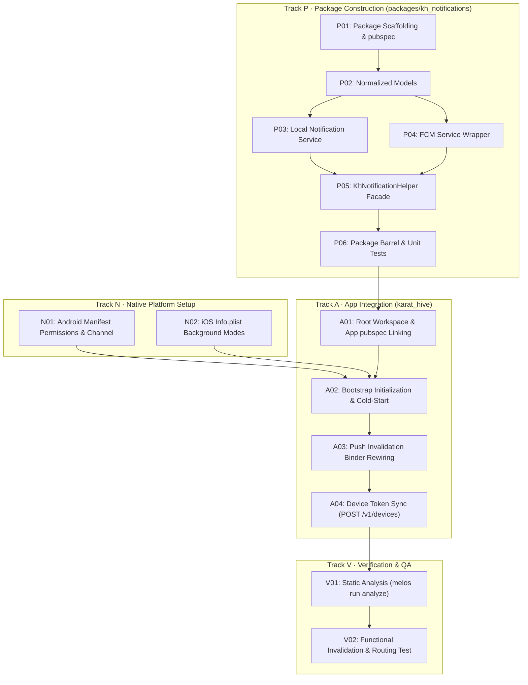

# FCM In-App & Local Notifications — Task Register

| | |
|---|---|
| **Product** | Karat Hive Mobile App & Workspace |
| **Document** | Executable Task Register for FCM In-App & Local Notifications Package |
| **Status** | **Ready to execute** |
| **Date** | 8 October 2026 |
| **Plan of record** | [`docs/implementation_plan_fcm_local_notifications.md`](implementation_plan_fcm_local_notifications.md) |
| **SOP Reference** | `SOP-KH-NOTIF-001` |
| **Scope** | `packages/kh_notifications` (New), `apps/kh_mobile/karat_hive` |

---

## Status Legend
- **open**: Not yet started.
- **in_progress**: Currently being implemented.
- **done**: Code committed, builds cleanly, tests pass.
- **blocked**: Waiting on a predecessor dependency.

---

## Task Dependency Graph

---

## Track P — Package Construction (`packages/kh_notifications`)

### `NOTIF-P01` · Package Scaffolding & Melos Registration
- **Status**: `open`
- **Files**:
  - `packages/kh_notifications/pubspec.yaml`
  - `packages/kh_notifications/README.md`
  - `pubspec.yaml` (workspace root)
- **Description**: Create the package folder, define metadata, dependencies (`flutter`, `firebase_core`, `firebase_messaging`, `flutter_local_notifications`), and add `packages/kh_notifications` to the root workspace `pubspec.yaml`.
- **Acceptance Criteria**:
  - `dart pub get` succeeds in `packages/kh_notifications`.
  - Melos discovers the new package across the workspace.

---

### `NOTIF-P02` · Data Models & Configuration
- **Status**: `open`
- **Files**:
  - `packages/kh_notifications/lib/src/models/kh_notification_config.dart`
  - `packages/kh_notifications/lib/src/models/kh_notification_message.dart`
- **Description**: Define `KhNotificationConfig` (channel ID, channel name, icons, vibration, sound flags) and `KhNotificationMessage` (normalized immutable object mapping title, body, payload, `deep_link`, and custom data from `RemoteMessage`).
- **Acceptance Criteria**:
  - Models are immutable with const constructors.
  - Serialization to/from JSON and `RemoteMessage` tested and sound.

---

### `NOTIF-P03` · Local Notification Service
- **Status**: `open`
- **Files**:
  - `packages/kh_notifications/lib/src/local/kh_local_notification_service.dart`
- **Description**: Encapsulate `FlutterLocalNotificationsPlugin`. Create the high-importance Android notification channel (`kh_high_importance_channel`), configure initialization settings (Android default icon + Darwin settings), and implement `show()` and tap response routing.
- **Acceptance Criteria**:
  - Notification channel created with `Importance.max` and `Priority.high`.
  - Tap response parses payload into `KhNotificationMessage` and pushes to internal stream.

---

### `NOTIF-P04` · FCM Service Wrapper
- **Status**: `open`
- **Files**:
  - `packages/kh_notifications/lib/src/fcm/kh_fcm_service.dart`
- **Description**: Encapsulate `FirebaseMessaging.instance`. Provide token retrieval, token refresh stream, topic subscription, foreground `onMessage` stream, background tap `onMessageOpenedApp` stream, and `getInitialMessage()`.
- **Acceptance Criteria**:
  - Normalizes all incoming `RemoteMessage` instances into `KhNotificationMessage`.
  - Unhandled errors in FCM streams are caught and logged gracefully.

---

### `NOTIF-P05` · Unified `KhNotificationHelper` Facade
- **Status**: `open`
- **Files**:
  - `packages/kh_notifications/lib/src/kh_notification_helper.dart`
- **Description**: Implement the top-level facade tying FCM and Local Notifications together. Expose `initialize()`, `requestPermission()`, `onForegroundMessage`, `onNotificationTapped`, `showLocalNotification()`, and `getInitialMessage()`. When foreground alerts are enabled, incoming FCM messages automatically invoke `showLocalNotification`.
- **Acceptance Criteria**:
  - Single method initialization sets up both native notification channels and FCM listeners.
  - Tapping a local notification or tapping a system background notification emits on the exact same `onNotificationTapped` stream.

---

### `NOTIF-P06` · Public Barrel & Unit Tests
- **Status**: `open`
- **Files**:
  - `packages/kh_notifications/lib/kh_notifications.dart`
  - `packages/kh_notifications/test/kh_notification_message_test.dart`
- **Description**: Export public interfaces in the barrel file and add unit tests for message parsing, deep-link extraction, and configuration defaults.
- **Acceptance Criteria**:
  - Barrel exports only public facade and models.
  - `flutter test` in `packages/kh_notifications` passes with 100% test success.

---

## Track N — Native Platform Configurations

### `NOTIF-N01` · Android Permissions & Channel Metadata
- **Status**: `open`
- **Files**:
  - `apps/kh_mobile/karat_hive/android/app/src/main/AndroidManifest.xml`
- **Description**: Add permissions: `POST_NOTIFICATIONS`, `VIBRATE`, `RECEIVE_BOOT_COMPLETED`. Add `<meta-data>` tags for default FCM channel ID (`kh_high_importance_channel`) and default notification icon (`@mipmap/ic_launcher`).
- **Acceptance Criteria**:
  - AndroidManifest validates without XML schema errors.
  - Android 13+ devices prompt for notification permission without runtime crash.

---

### `NOTIF-N02` · iOS Remote Notification Capabilities
- **Status**: `open`
- **Files**:
  - `apps/kh_mobile/karat_hive/ios/Runner/Info.plist`
- **Description**: Verify `UIBackgroundModes` contains `remote-notification` and `fetch`. Ensure APNs foreground presentation options are set in Dart layer.
- **Acceptance Criteria**:
  - iOS plist contains background execution keys.

---

## Track A — Karat Hive App Integration

### `NOTIF-A01` · Dependency Linking
- **Status**: `open`
- **Files**:
  - `apps/kh_mobile/karat_hive/pubspec.yaml`
- **Description**: Add `kh_notifications: path: ../../../packages/kh_notifications` to `apps/kh_mobile/karat_hive/pubspec.yaml`.
- **Acceptance Criteria**:
  - `flutter pub get` in `apps/kh_mobile/karat_hive` resolves clean.

---

### `NOTIF-A02` · Bootstrap Initialization & Cold-Start Routing
- **Status**: `open`
- **Files**:
  - `apps/kh_mobile/karat_hive/lib/bootstrap.dart`
  - `apps/kh_mobile/karat_hive/lib/app/notifications/pending_notification_payload.dart`
- **Description**: Replace raw Firebase messaging calls in `bootstrap.dart` with `KhNotificationHelper.instance.initialize(...)`. Query `getInitialMessage()`; if a cold-start push launched the app, cache its deep link to navigate after router mounting.
- **Acceptance Criteria**:
  - Bootstrap initializes cleanly without blocking initial frame render.
  - Cold-start deep link is preserved.

---

### `NOTIF-A03` · Push Invalidation Binder Rewiring
- **Status**: `open`
- **Files**:
  - `apps/kh_mobile/karat_hive/lib/app/notifications/push_invalidation_binder.dart`
- **Description**: Rewire `pushInvalidationBinderProvider` to listen to `KhNotificationHelper.instance.onForegroundMessage` (for `PushInvalidationPlan.apply`) and `onNotificationTapped` (for `NotificationDeepLink.open`).
- **Acceptance Criteria**:
  - Foreground push invalidates Riverpod caches AND displays a native heads-up alert.
  - Tapping foreground or background push routes to the target `/vendor/...` or `/customer/...` screen.

---

### `NOTIF-A04` · Device Token Registration Hook
- **Status**: `open`
- **Files**:
  - `apps/kh_mobile/karat_hive/lib/app/session/session_controller.dart` (or dedicated device sync service)
- **Description**: Trigger `KhNotificationHelper.instance.getToken()` upon successful authentication and send token to `POST /v1/devices`. Subscribe to `onTokenRefresh` to keep the backend registration up to date.
- **Acceptance Criteria**:
  - Device token uploaded on login; token refresh emits and updates backend.

---

## Track V — Verification & QA

### `NOTIF-V01` · Static Analysis & Build Verification
- **Status**: `open`
- **Action**: Run `melos run analyze` across all monorepo packages.
- **Acceptance Criteria**:
  - Zero analyzer errors or warnings.

---

### `NOTIF-V02` · Integration & Functional Verification
- **Status**: `open`
- **Action**: Run test suite and verify push invalidation and navigation dispatching.
- **Acceptance Criteria**:
  - All existing mobile tests and newly introduced notification tests pass.
