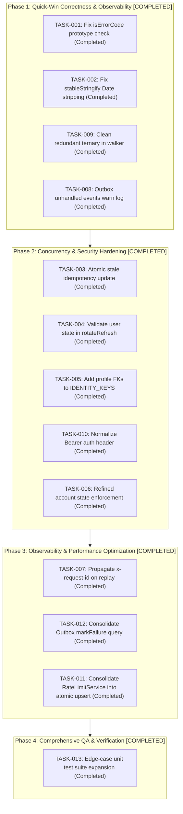

# Karat Hive Backend — Remediation & Engineering Task Backlog

> Generated from Code Review & Quality Audit (September 2026)
> All 13 tasks successfully implemented, verified, and passing test suites.

---

## Phased Execution Roadmap

---

## 1. Phase 1: Zero-Risk Correctness & Observability

### TASK-001: Fix Prototype Property Leakage in `HttpErrorFilter.isErrorCode`
- **Status:** ✅ Completed
- **Priority:** P0 / Critical
- **Category:** Correctness & Security
- **File:** `src/edge/errors/http-error.filter.ts`
- **Resolution:** Replaced `value in ErrorCode` with `Object.hasOwn(ErrorCode, value)` to prevent prototype property leakage.

### TASK-002: Fix `Date` Instance Stripping in Idempotency Policy `stableStringify`
- **Status:** ✅ Completed
- **Priority:** P0 / Critical
- **Category:** Correctness
- **File:** `src/edge/idempotency/idempotency.policy.ts`
- **Resolution:** Handled `value instanceof Date` to serialize timestamps to ISO strings before object property inspection. Added tests in `idempotency.policy.spec.ts`.

### TASK-008: Upgrade Log Level for Unhandled Outbox Event Types
- **Status:** ✅ Completed
- **Priority:** P2 / Medium
- **Category:** Architecture & Operations
- **File:** `src/platform/outbox/outbox.dispatcher.ts`
- **Resolution:** Upgraded unhandled outbox events to log with `this.logger.warn`. Added verification unit tests.

### TASK-009: Clean Up Redundant Ternary in Identity Key Walker
- **Status:** ✅ Completed
- **Priority:** P3 / Low (Code Hygiene)
- **File:** `src/edge/masking/identity-keys.ts`
- **Resolution:** Simplified `const nested = key === 'data' ? walk(child, skipMeta) : walk(child, skipMeta);` to `const nested = walk(child, skipMeta);`.

---

## 2. Phase 2: Concurrency & Security Hardening

### TASK-003: Fix Stale Idempotency Key Eviction Race Condition
- **Status:** ✅ Completed
- **Priority:** P1 / High
- **Category:** Concurrency & Correctness
- **File:** `src/edge/idempotency/idempotency.interceptor.ts`
- **Resolution:** Replaced two-step `delete` + `create` on stale keys with an atomic `update` on the existing row.

### TASK-004: Validate User State in Refresh Token Rotation (`rotateRefresh`)
- **Status:** ✅ Completed
- **Priority:** P1 / High
- **Category:** Security
- **File:** `src/modules/identity/application/token.service.ts`
- **Resolution:** Added check in `rotateRefresh` rejecting `user.deletedAt !== null` or `user.accountState !== 'ACTIVE'` by revoking the token family and throwing `IdentityAuthError('UNAUTHENTICATED')`.

### TASK-005: Expand Privacy Masking Scanner with Relational Profile Keys
- **Status:** ✅ Completed
- **Priority:** P1 / High
- **Category:** Security & Privacy
- **File:** `src/edge/masking/identity-keys.ts`
- **Resolution:** Expanded `IDENTITY_KEYS` to include `customerProfileId`, `vendorProfileId`, `adminProfileId`, `actorUserId`, `reporterUserId`, `reportedUserId`, `recipientUserId`, `createdById`, and `verifiedByAdminId`. Added spec tests.

### TASK-006: Refined Account State Enforcement
- **Status:** ✅ Completed
- **Priority:** P1 / High
- **Category:** Security & Architecture
- **Files:** `src/edge/auth/allow-suspended.decorator.ts`, `src/edge/auth/auth.guard.ts`, `src/modules/identity/controller/me.controller.ts`
- **Resolution:** Implemented `@AllowSuspended()` decorator and updated `AuthGuard` to reject non-ACTIVE users with `ACCOUNT_SUSPENDED` / `ACCOUNT_DEACTIVATED` on all standard routes, while permitting `GET /v1/me` for user status notices.

### TASK-010: Normalize Bearer Authentication Scheme Parsing
- **Status:** ✅ Completed
- **Priority:** P3 / Low
- **File:** `src/edge/auth/auth.guard.ts`
- **Resolution:** Scheme prefix check made case-insensitive and token string trimmed.

---

## 3. Phase 3: Observability & Performance Optimization

### TASK-007: Propagate `x-request-id` Header on Idempotency Replay
- **Status:** ✅ Completed
- **Priority:** P2 / Medium
- **Category:** Observability & Consistency
- **File:** `src/edge/idempotency/idempotency.interceptor.ts`
- **Resolution:** Attached `reply.header('x-request-id', requestIdOf(request))` on cached replay responses.

### TASK-011: Consolidate `RateLimitService.take` Database Transactions
- **Status:** ✅ Completed
- **Priority:** P2 / Medium
- **Category:** Performance
- **File:** `src/edge/rate-limit/rate-limit.service.ts`
- **Resolution:** Replaced interactive 3-step transaction with atomic `UPDATE ... FROM (SELECT ... FOR UPDATE) RETURNING` query with cold-start fallback, reducing hot-path database roundtrips to 1. Added unit tests in `rate-limit.service.spec.ts`.

### TASK-012: Consolidate `OutboxClaimer.markFailure` Query Execution
- **Status:** ✅ Completed
- **Priority:** P3 / Low
- **Category:** Performance
- **File:** `src/platform/outbox/outbox.claimer.ts`
- **Resolution:** Consolidated attempt increment, backoff scheduling, and safe error truncation into a single atomic PostgreSQL `UPDATE` statement. Added spec tests in `outbox.claimer.spec.ts`.

---

## 4. Phase 4: Comprehensive QA & Verification

### TASK-013: Add Comprehensive Edge Case Unit Tests
- **Status:** ✅ Completed
- **Priority:** P2 / Medium
- **Category:** Quality Assurance
- **Files:** `src/edge/errors/http-error.filter.spec.ts`, `src/edge/auth/auth.guard.spec.ts`
- **Resolution:** Added 29 new unit test cases covering prototype properties in error handling, Bearer normalization, and account state boundaries under `AuthGuard`. All 68 tests across 12 test suites passing cleanly.
