# Karat Hive Admin API Alignment — Task Register

> **Status**: Approved for Execution  
> **Target Release**: Backend & Admin Portal Alignment Sprint  
> **Source Documents**: [`docs/kh_admin_api_endpoints.md`](file:///E:/work/karat_hive/docs/kh_admin_api_endpoints.md), [`docs/admin-backend-api-gaps.md`](file:///E:/work/karat_hive/docs/admin-backend-api-gaps.md), [`docs/adr/0010-google-signin-only-login.md`](file:///E:/work/karat_hive/docs/adr/0010-google-signin-only-login.md)  
> **Prefix**: `ADM-API-GAP-01` to `ADM-API-GAP-11`  
> **Legend**: `[ ]` Not Started · `[~]` In Progress · `[x]` Done  

---

## 1. Execution Order & Dependency Graph

```mermaid
flowchart TD
    G01["ADM-API-GAP-01<br/>Fix Review Moderation Bug (BUG-ADM-01)"] --> G11["ADM-API-GAP-11<br/>Update kh_admin_api_endpoints.md"]
    G02["ADM-API-GAP-02<br/>Implement POST /v1/admin/audit-log"] --> G11
    G03["ADM-API-GAP-03<br/>Reconcile Auth Spec (ADR-0010) & Deprecate Password Login"] --> G11
    G04["ADM-API-GAP-04<br/>Implement Media Redirect/Proxy GET /v1/media/:key"] --> G11
    G05["ADM-API-GAP-05<br/>Case-Insensitive Export Format Validation"] --> G11
    G06["ADM-API-GAP-06<br/>Harmonize Region Taxonomy (Drop icon)"] --> G11
    G07["ADM-API-GAP-07<br/>Harmonize Abuse Reports Query Param (status vs state)"] --> G11
    G08["ADM-API-GAP-08<br/>Dashboard Date Range Scoping (from/to)"] --> G11
    G09["ADM-API-GAP-09<br/>Reports Time-Series Series Generation & groupBy"] --> G11
    G10["ADM-API-GAP-10<br/>Offers Search Query Filter (q)"] --> G11

    classDef critical fill:#ffebee,stroke:#c62828,stroke-width:2px;
    classDef high fill:#fff3e0,stroke:#ef6c00,stroke-width:2px;
    classDef medium fill:#e8f5e9,stroke:#2e7d32,stroke-width:2px;
    classDef doc fill:#e1f5fe,stroke:#0277bd,stroke-width:2px;

    class G01 critical;
    class G02,G03,G04 high;
    class G05,G06,G07,G08,G09,G10 medium;
    class G11 doc;
```



---

## 2. Phase 1 — Critical Defect & Missing Route Fixes (Severity: Critical & High)

- [x] **ADM-API-GAP-01: Fix Review Moderation Handler (`BUG-ADM-01`)**
  - **Severity**: Critical (Endpoint currently returns Request rows instead of Review rows)
  - **Layers**: Backend Controller, Service, Repository
  - **Target Files**:
    - [`backend/src/modules/admin/controller/admin.controller.ts`](file:///E:/work/karat_hive/backend/src/modules/admin/controller/admin.controller.ts#L422-L432)
    - [`backend/src/modules/admin/application/admin.service.ts`](file:///E:/work/karat_hive/backend/src/modules/admin/application/admin.service.ts)
    - [`backend/src/modules/admin/repository/admin.repository.ts`](file:///E:/work/karat_hive/backend/src/modules/admin/repository/admin.repository.ts)
  - **Changes Required**:
    1. In `admin.repository.ts`: Implement `listReviews(query: { state?: ReviewModerationState, authorType?: string, q?: string, limit?: number, cursor?: string })`. Query `prisma.review` with relation joins (`authorUser`, `subjectUser`, `connection`, `request`).
    2. In `admin.service.ts`: Expose `listReviews(query)`.
    3. In `admin.controller.ts`: Replace `this.service.listRequests` with `this.service.listReviews({ state, authorType, q, limit, cursor })`.
  - **Acceptance Criteria**: Calling `GET /v1/admin/reviews?state=PENDING_MODERATION` returns actual Review records with cursor pagination; ADM-S16 moderation queue loads correct review data.

- [x] **ADM-API-GAP-02: Implement Customer Access Audit Route (`GAP-ADM-11`)**
  - **Severity**: High (Compliance requirement `FR-ADM-010 AC5` / `ADM-INS-40`)
  - **Layers**: Backend Controller, Service, Audit Outbox
  - **Target Files**:
    - [`backend/src/modules/admin/controller/admin.controller.ts`](file:///E:/work/karat_hive/backend/src/modules/admin/controller/admin.controller.ts#L532)
    - [`backend/src/modules/admin/application/admin.service.ts`](file:///E:/work/karat_hive/backend/src/modules/admin/application/admin.service.ts)
  - **Changes Required**:
    1. Define `createAuditLogSchema = z.object({ action: z.string().trim().min(1).max(100), entityType: z.string().trim().min(1).max(100), occurredAt: z.coerce.date().optional(), metadata: z.record(z.unknown()).optional() })`.
    2. Add `@Post('audit-log')` to `AdminController` accepting `createAuditLogSchema`.
    3. Append entry to `AuditService` using `viewer.userId` as `actorUserId`. Return `{ data: { recorded: true } }`.
  - **Acceptance Criteria**: `POST /v1/admin/audit-log` returns HTTP 200/201; [`CustomerRepository.logCustomerListAccess`](file:///E:/work/karat_hive/apps/kh_admin/lib/features/customers/repository/customer_repository.dart#L62-L75) call succeeds without swallowing 404 errors.

- [x] **ADM-API-GAP-03: Reconcile Authentication Flow with ADR-0010 (Google Sign-In Only)**
  - **Severity**: High (Architectural consistency & removing dead auth paths)
  - **Layers**: Flutter Admin App, Docs
  - **Target Files**:
    - [`apps/kh_admin/lib/core/auth/auth_repository.dart`](file:///E:/work/karat_hive/apps/kh_admin/lib/core/auth/auth_repository.dart#L13-L22)
    - [`docs/kh_admin_api_endpoints.md`](file:///E:/work/karat_hive/docs/kh_admin_api_endpoints.md#L103-L130)
    - [`docs/adr/0010-google-signin-only-login.md`](file:///E:/work/karat_hive/docs/adr/0010-google-signin-only-login.md)
  - **Changes Required**:
    1. Update `docs/kh_admin_api_endpoints.md`: Deprecate and remove Endpoint #1 (`POST /v1/auth/login/password`). Document `POST /v1/auth/google/session` as the sole login entrypoint for admins per `ADR-0010`.
    2. In `apps/kh_admin`: Remove or deprecate `AuthRepository.login(email, password)` and remove any unused password login input fields from UI to prevent calling non-existent routes.
  - **Acceptance Criteria**: Admin authentication flow uses Google session exchange exclusively; no unhandled calls to `/v1/auth/login/password`.

- [x] **ADM-API-GAP-04: Implement Media Download/Redirect Endpoint (`GET /v1/media/:key`)**
  - **Severity**: High (Prevents broken image rendering across requests and offers)
  - **Layers**: Backend Media Module, Fastify Routing
  - **Target Files**:
    - [`backend/src/modules/media/controller/media.controller.ts`](file:///E:/work/karat_hive/backend/src/modules/media/controller/media.controller.ts#L23-L45)
    - [`backend/src/modules/media/application/media.service.ts`](file:///E:/work/karat_hive/backend/src/modules/media/application/media.service.ts)
    - [`apps/kh_admin/lib/features/requests/model/request_detail.dart`](file:///E:/work/karat_hive/apps/kh_admin/lib/features/requests/model/request_detail.dart#L86-L90)
  - **Changes Required**:
    1. In `MediaController`: Add `@Get(':key')` route (public or signed token validated).
    2. In `MediaService`: Resolve the storage provider key; issue a short-lived presigned redirect (HTTP 302/307 `Location: <presigned-url>`) or proxy stream the object with appropriate `Content-Type` and `Cache-Control` headers.
  - **Acceptance Criteria**: Requesting `GET /v1/media/<key>` resolves to the image asset; [`RequestMediaItem.fromApiResponse`](file:///E:/work/karat_hive/apps/kh_admin/lib/features/requests/model/request_detail.dart#L86-L90) URLs load images in Flutter Web without 404s.

---

## 3. Phase 2 — Schema Validation & Parameter Harmonization (Severity: Medium)

- [x] **ADM-API-GAP-05: Case-Insensitive Export Format Validation**
  - **Severity**: Medium (Prevents 422 errors on client exports)
  - **Layers**: Backend Controller Zod Schema
  - **Target Files**:
    - [`backend/src/modules/admin/controller/admin.controller.ts`](file:///E:/work/karat_hive/backend/src/modules/admin/controller/admin.controller.ts#L109-L114)
    - [`docs/kh_admin_api_endpoints.md`](file:///E:/work/karat_hive/docs/kh_admin_api_endpoints.md#L860-L870)
  - **Changes Required**:
    1. In `admin.controller.ts`: Update `createExportSchema` format field to pre-process lowercase input:
       ```ts
       format: z.preprocess(
         (val) => (typeof val === 'string' ? val.toUpperCase() : val),
         z.enum(['CSV', 'XLSX', 'PNG']),
       ),
       ```
    2. Update sample JSON in `docs/kh_admin_api_endpoints.md` line 862 to `"format": "CSV"`.
  - **Acceptance Criteria**: Both `{"format": "csv"}` and `{"format": "CSV"}` successfully pass validation and enqueue the export job.

- [x] **ADM-API-GAP-06: Harmonize Region Taxonomy Schema (`icon` Field Removal)**
  - **Severity**: Medium (Aligns DB schema, backend validation, and Flutter DTOs)
  - **Layers**: Flutter Taxonomy Models, Docs
  - **Target Files**:
    - [`apps/kh_admin/lib/features/taxonomy/model/taxonomy_dto.dart`](file:///E:/work/karat_hive/apps/kh_admin/lib/features/taxonomy/model/taxonomy_dto.dart#L7-L34)
    - [`docs/kh_admin_api_endpoints.md`](file:///E:/work/karat_hive/docs/kh_admin_api_endpoints.md#L756-L780)
  - **Changes Required**:
    1. Confirm `Region` has no `icon` column in `prisma/schema.prisma` (only `Category` has `icon`).
    2. In `apps/kh_admin`: Remove `icon` from Region-specific create/update dialogs, or ensure `CreateTaxonomyDto` omits `icon` when kind is `region`.
    3. Update `docs/kh_admin_api_endpoints.md` sample payloads for #46 and #47 to remove `"icon": "location_city"` and `"icon": "map_location"`.
  - **Acceptance Criteria**: Region creation/update requests never send `icon`; schema documentation accurately reflects the Prisma data model.

- [x] **ADM-API-GAP-07: Harmonize Abuse Reports Query Parameter (`status` vs `state`)**
  - **Severity**: Medium (Ensures client status filtering is honored)
  - **Layers**: Backend Controller
  - **Target Files**:
    - [`backend/src/modules/admin/controller/admin.controller.ts`](file:///E:/work/karat_hive/backend/src/modules/admin/controller/admin.controller.ts#L464-L476)
    - [`docs/kh_admin_api_endpoints.md`](file:///E:/work/karat_hive/docs/kh_admin_api_endpoints.md#L980)
  - **Changes Required**:
    1. In `admin.controller.ts`: Support alias parameter:
       ```ts
       @Query('state') state?: AbuseReportState,
       @Query('status') status?: AbuseReportState,
       ```
       Resolve effective state with `const resolvedState = state ?? status;`.
    2. In `docs/kh_admin_api_endpoints.md`: Clarify that `state` is the primary query parameter name (`OPEN`, `UNDER_REVIEW`, `RESOLVED`, `DISMISSED`).
  - **Acceptance Criteria**: Querying `GET /v1/admin/abuse-reports?status=OPEN` and `?state=OPEN` both correctly filter the abuse queue.

---

## 4. Phase 3 — Filtering & Analytics Enhancements (Severity: Medium)

- [x] **ADM-API-GAP-08: Implement Date Range Scoping for Dashboard Metrics (`GAP-ADM-09`)**
  - **Severity**: Medium (ADM-S02 date range selector has no server effect)
  - **Layers**: Backend Controller, Service, Repository
  - **Target Files**:
    - [`backend/src/modules/admin/controller/admin.controller.ts`](file:///E:/work/karat_hive/backend/src/modules/admin/controller/admin.controller.ts#L130-L134)
    - [`backend/src/modules/admin/application/admin.service.ts`](file:///E:/work/karat_hive/backend/src/modules/admin/application/admin.service.ts#L36-L38)
    - [`backend/src/modules/admin/repository/admin.repository.ts`](file:///E:/work/karat_hive/backend/src/modules/admin/repository/admin.repository.ts)
  - **Changes Required**:
    1. In `admin.controller.ts`: Add `@Query('from') from?: string`, `@Query('to') to?: string` to `getDashboard`.
    2. In `admin.repository.ts:getDashboardStats`: Apply date window `createdAt: { gte: fromDate, lte: toDate }` to period-sensitive counts (`newInPeriod`, `activeInPeriod`, etc.).
  - **Acceptance Criteria**: Changing date filters (7d / 30d / 90d) on ADM-S02 re-scopes dashboard stats returned from the backend.

- [x] **ADM-API-GAP-09: Implement Trend Time-Series Generation (`GAP-ADM-10`)**
  - **Severity**: Medium (ADM-S02 trend chart renders empty series)
  - **Layers**: Backend Controller, Repository
  - **Target Files**:
    - [`backend/src/modules/admin/controller/admin.controller.ts`](file:///E:/work/karat_hive/backend/src/modules/admin/controller/admin.controller.ts#L665-L675)
    - [`backend/src/modules/admin/repository/admin.repository.ts`](file:///E:/work/karat_hive/backend/src/modules/admin/repository/admin.repository.ts#L938-L950)
  - **Changes Required**:
    1. In `admin.controller.ts`: Accept `@Query('groupBy') groupBy?: 'day' | 'week' | 'month'` on `GET /v1/admin/reports/:name`.
    2. In `admin.repository.ts:getReportData`: For `request-volume`, generate daily/weekly bucketed counts using SQL date trunc aggregation and populate `series: Array<{ date: string, status: string, count: number }>`.
  - **Acceptance Criteria**: `GET /v1/admin/reports/request-volume?from=...&to=...&groupBy=day` returns populated `series` array; trend graph on ADM-S02 plots continuous line data.

- [x] **ADM-API-GAP-10: Implement Search Query Filter on Offers (`GAP-ADM-03`)**
  - **Severity**: Medium (ADM-S10 free-text search has no effect)
  - **Layers**: Backend Controller, Repository
  - **Target Files**:
    - [`backend/src/modules/admin/controller/admin.controller.ts`](file:///E:/work/karat_hive/backend/src/modules/admin/controller/admin.controller.ts#L354-L382)
    - [`backend/src/modules/admin/repository/admin.repository.ts`](file:///E:/work/karat_hive/backend/src/modules/admin/repository/admin.repository.ts#L452-L485)
  - **Changes Required**:
    1. In `admin.controller.ts:listOffers`: Add `@Query('q') q?: string`.
    2. In `admin.repository.ts:listOffers`: Add `where` clause matching `q` against vendor commercial name, note text, and associated request title.
  - **Acceptance Criteria**: Calling `GET /v1/admin/offers?q=Ingot` filters results server-side by matching term.

---

## 5. Phase 4 — Documentation Finalization (Severity: Low)

- [x] **ADM-API-GAP-11: Update & Harmonize `docs/kh_admin_api_endpoints.md`**
  - **Severity**: Low / Documentation Integrity
  - **Layers**: Workspace Documentation
  - **Target Files**:
    - [`docs/kh_admin_api_endpoints.md`](file:///E:/work/karat_hive/docs/kh_admin_api_endpoints.md)
  - **Changes Required**:
    1. Remove Endpoint #1 (`POST /v1/auth/login/password`); add cross-reference to `ADR-0010`.
    2. Update Endpoint #9 (`POST /v1/admin/audit-log`) to document status once ADM-API-GAP-02 lands.
    3. Update Endpoint #46 and #47 sample payloads (remove `icon` from Region).
    4. Update Endpoint #49 to reflect fixed `listReviews` response structure and filters.
    5. Update Endpoint #54 sample payload to `"format": "CSV"`.
    6. Update Endpoint #61 to document `state` parameter (with `status` alias).
    7. Update Section 4 summary table to match actual backend types and enums.
  - **Acceptance Criteria**: `kh_admin_api_endpoints.md` matches 100% with the live backend controllers and OpenAPI schema.
