# Admin Checkpoint 1: Taxonomy Management — Task Backlog

> **Source of Truth**: [`docs/Admin-Checkpoint-1-Taxonomy-Plan.md`](Admin-Checkpoint-1-Taxonomy-Plan.md)  
> **Scope**: End-to-end vertical slice across Backend (NestJS), Database (Supabase/Postgres), and Frontend (`apps/kh_admin` Flutter Web).  
> **Target Branch**: backend ADM-BE-001–012 landed on `main` (CP1 merge). Thin follow-up tracks remaining seed/CI items; do not revive `feat/checkpoint-1-admin-taxonomy`.  
> **Total Tasks**: 23 tasks across 8 execution phases.

---

## Phased Execution Roadmap

```mermaid
flowchart TD
    subgraph P1["Phase 1: Backend Auth & Identity [Part A1]"]
        T01["ADM-BE-001: PasswordHasher Port & Service"]
        T02["ADM-BE-002: Admin Login in LoginService"]
        T03["ADM-BE-003: AuthController Admin Endpoints"]
        T04["ADM-BE-004: MeController Admin Branch"]
        T05["ADM-BE-005: @AdminOnly Decorator & AuthGuard"]
        T06["ADM-BE-006: SessionBundle & Me Presenters"]
    end

    subgraph P2["Phase 2: Backend Taxonomy Module [Part A2]"]
        T07["ADM-BE-007: TaxonomyRepository CRUD"]
        T08["ADM-BE-008: TaxonomyService & Business Rules"]
        T09["ADM-BE-009: AdminTaxonomyController Endpoints"]
        T10["ADM-BE-010: Register TaxonomyModule"]
        T11["ADM-BE-011: Taxonomy & Auth Unit Tests"]
    end

    subgraph P3["Phase 3: Database Seeding & Verification [Part A3 & A4]"]
        T12["ADM-BE-012: Seed Script (Admin + UAE Taxonomy)"]
        T13["ADM-BE-013: Backend CI Verification & Smoke Test"]
    end

    subgraph P4["Phase 4: Frontend Setup & Design Tokens [Part B1 & B2]"]
        T14["ADM-FE-001: Flatten kh_admin Project Structure"]
        T15["ADM-FE-002: pubspec.yaml Dependencies"]
        T16["ADM-FE-003: Admin Design Tokens & ThemeExtension"]
    end

    subgraph P5["Phase 5: Frontend Plumbing & Shell [Part B3 & B4]"]
        T17["ADM-FE-004: Typed ApiClient with Envelope Handling"]
        T18["ADM-FE-005: Secure Token Storage & SessionController"]
        T19["ADM-FE-006: GoRouter with Auth Guards & Query State"]
        T20["ADM-FE-007: KhAdminScaffold Shell (SH-ADM-01)"]
    end

    subgraph P6["Phase 6: Frontend Auth & Taxonomy Screens [Part B5 & B6]"]
        T21["ADM-FE-008: Admin Login Screen (ADM-S01)"]
        T22["ADM-FE-009: Freezed Taxonomy Models & DTOs"]
        T23["ADM-FE-010: Typed TaxonomyRepository"]
        T24["ADM-FE-011: Riverpod TaxonomyController"]
        T25["ADM-FE-012: TaxonomyTree Widget (SH-ADM-14)"]
        T26["ADM-FE-013: NodeEditorPanel Widget (SH-ADM-08)"]
        T27["ADM-FE-014: TaxonomyScreen (ADM-S14 / ADM-S15)"]
        T28["ADM-FE-015: ARB Localization (EN / AR Scaffolding)"]
    end

    subgraph P7["Phase 7: Frontend Verification & Tests [Part B7]"]
        T29["ADM-FE-016: Frontend Unit & Widget Tests"]
        T30["ADM-FE-017: Flutter Analyze & Test Suite Pass"]
    end

    subgraph P8["Phase 8: Reconciliation & Release [Part C & Git]"]
        T31["ADM-DOC-001: Spec Docs & Deviation Notes Reconciliation"]
        T32["ADM-E2E-001: End-to-End Click-Through & Audit Log Check"]
        T33["ADM-GIT-001: Staged Commits & Draft PR Creation"]
    end

    P1 --> P2 --> P3
    P3 --> P4 --> P5 --> P6 --> P7 --> P8
```

---

## Detailed Task Breakdown

### Phase 1: Backend Identity & Auth (Part A1)

- [x] **ADM-BE-001: PasswordHasher Port & Service**
  - **Priority**: P0 | **Estimate**: 1.5h | **Target File**: `backend/src/modules/identity/application/password-hasher.ts`
  - **Description**: Add `argon2` (or `bcrypt`) dependency to `backend/package.json` and implement `PasswordHasher` (`hash`, `verify`) for admin user authentication and seed scripts.
  - **Acceptance Criteria**: Passwords hashed securely; verification passes valid strings and rejects mismatches.

- [x] **ADM-BE-002: Admin Login in LoginService**
  - **Priority**: P0 | **Estimate**: 2h | **Target File**: `backend/src/modules/identity/application/login.service.ts`
  - **Description**: Replace the `user.userType === 'ADMIN'` throw `NOT_IMPLEMENTED` with admin authentication logic. Verify account state is `ACTIVE`, issue access + refresh tokens via `TokenService`, enforce 3-strike lockout counter, and write `ADMIN_LOGIN` audit logs.
  - **Acceptance Criteria**: Admin user can authenticate with email/password; non-active admin returns 403; bad password increments failed login attempts and returns 401; >=3 failures locks account (423).

- [x] **ADM-BE-003: AuthController Admin Endpoints**
  - **Priority**: P0 | **Estimate**: 1.5h | **Target File**: `backend/src/modules/identity/controller/auth.controller.ts`
  - **Description**: Ensure `POST /v1/auth/login/password`, `POST /v1/auth/refresh`, and `POST /v1/auth/logout` correctly serve admin sessions.
  - **Acceptance Criteria**: Admin login returns `200 SessionBundle` (with `// [DEVIATION AD-API: 2FA deferred — checkpoint-1]`); refresh rotates tokens; logout revokes token.

- [x] **ADM-BE-004: MeController Admin Branch**
  - **Priority**: P1 | **Estimate**: 1h | **Target File**: `backend/src/modules/identity/controller/me.controller.ts`
  - **Description**: Extend `GET /v1/me` to construct and return the admin identity profile (`admin: { displayName }`) when `viewer.role === 'ADMIN'`.
  - **Acceptance Criteria**: `GET /v1/me` with admin token returns `{ userType: "ADMIN", admin: { displayName: "..." } }`.

- [x] **ADM-BE-005: @AdminOnly Decorator & AuthGuard Enforcement**
  - **Priority**: P0 | **Estimate**: 1.5h | **Target File**: `backend/src/edge/auth/`
  - **Description**: Create an `@AdminOnly()` decorator and wire into `AuthGuard` such that any `/v1/admin/*` route requires `viewer.role === 'ADMIN'`. Return `404 NOT_FOUND` for non-admin tokens per `AD-API-01`.
  - **Acceptance Criteria**: Non-admin authenticated user receives 404 on `/v1/admin/*`; unauthenticated user receives 401; admin user passes.

- [x] **ADM-BE-006: SessionBundle & Me Presenters**
  - **Priority**: P1 | **Estimate**: 0.5h | **Target File**: `backend/src/modules/identity/presenter/`
  - **Description**: Ensure TypeScript response DTO types match `API-Route-Inventory.md:763` and `:904` for Admin identity.
  - **Acceptance Criteria**: Strict DTO typing without unwanted fields leaked on the wire.

---

### Phase 2: Backend Taxonomy Module (Part A2)

- [x] **ADM-BE-007: TaxonomyRepository Implementation**
  - **Priority**: P0 | **Estimate**: 2.5h | **Target File**: `backend/src/modules/taxonomy/repository/taxonomy.repository.ts`
  - **Description**: Implement Prisma data access for categories and regions supporting `listTree(kind, {includeInactive})`, `create(kind, dto)`, `update(kind, id, dto)`, `deactivate(kind, id)`, and `countReferences(kind, id)`.
  - **Acceptance Criteria**: Queries correctly load self-referential hierarchies and detect active references in `request`, `vendor_category`, and `customer_profile`.

- [x] **ADM-BE-008: TaxonomyService Business Rules & Audit Logging**
  - **Priority**: P0 | **Estimate**: 2.5h | **Target File**: `backend/src/modules/taxonomy/application/taxonomy.service.ts`
  - **Description**: Implement business logic: enforce strict 2-level hierarchy limit (reject nesting under a node that has a parent with 422), validate `nameEn` + `nameAr`, disallow DELETE (deactivate only), throw `409 TAXONOMY_IN_USE` if delete attempted with references, and wrap all mutations in `prisma.$transaction` with `AuditWriter`.
  - **Acceptance Criteria**: Nesting > 2 levels blocked; blank names rejected; audit entries written for create, update, and deactivate.

- [x] **ADM-BE-009: AdminTaxonomyController Endpoints**
  - **Priority**: P0 | **Estimate**: 2h | **Target File**: `backend/src/modules/taxonomy/controller/admin-taxonomy.controller.ts`
  - **Description**: Expose `@AdminOnly()` endpoints:
    - `GET  /v1/admin/categories` & `/v1/admin/regions`
    - `POST /v1/admin/categories` & `/v1/admin/regions`
    - `PATCH /v1/admin/categories/:id` & `/v1/admin/regions/:id`
    - `POST /v1/admin/categories/:id/deactivate` & `/v1/admin/regions/:id/deactivate`
  - **Acceptance Criteria**: Controllers accept validated Zod DTOs and return `CategorySummary[]` / `RegionSummary[]`.

- [x] **ADM-BE-010: Register TaxonomyModule**
  - **Priority**: P1 | **Estimate**: 0.5h | **Target File**: `backend/src/app.module.ts`
  - **Description**: Wire `AdminTaxonomyController`, `TaxonomyService`, and `TaxonomyRepository` into `TaxonomyModule` and register in root `AppModule`.
  - **Acceptance Criteria**: Routes mount cleanly and respond under `/v1/admin/categories` and `/v1/admin/regions`.

- [x] **ADM-BE-011: Taxonomy & Auth Unit Test Suites**
  - **Priority**: P1 | **Estimate**: 2h | **Target File**: `backend/src/modules/taxonomy/application/taxonomy.service.spec.ts`
  - **Description**: Add unit and integration tests covering: 2-level depth validation, blank name rejection, reference counting on deactivate, audit record emission, admin login happy path, and 404 on `/v1/admin/*` for non-admin viewers.
  - **Acceptance Criteria**: All new tests pass with `npm test`.

---

### Phase 3: Database Seeding & Verification (Part A3 & A4)

- [x] **ADM-BE-012: Seed Script for Admin & UAE Taxonomy**
  - **Priority**: P0 | **Estimate**: 2h | **Target File**: `backend/prisma/seed/index.ts`
  - **Description**: Create idempotent seed script that populates:
    1. Default Super Admin (`user` + `admin_profile`) using env vars `SEED_ADMIN_EMAIL`, `SEED_ADMIN_PASSWORD`
    2. 7 UAE Emirates with child areas (EN + AR)
    3. 2-level Gold Categories (Jewellery, Bullion, Coins, Scrap, Watches with child categories)
    4. Default `platform_setting` rows
  - **Acceptance Criteria**: `npm run seed` executes idempotently without duplicate key errors; database is populated.

- [ ] **ADM-BE-013: Backend CI Verification & Smoke Test** *(Partial — unit/lint in follow-up PR; HTTP smoke + integration blocked without `DATABASE_URL` / secrets in this agent environment)*
  - **Priority**: P1 | **Estimate**: 1h | **Target File**: `backend/`
  - **Description**: Run full backend pipeline: `npm run lint`, `npm run format:check`, `npm test`, and manual HTTP smoke tests on `/v1/auth/login/password`, `/v1/me`, and `/v1/admin/categories`.
  - **Acceptance Criteria**: All linters and test suites pass 100% green. Mark Completed only after CI `check` + `integration` and HTTP smoke are evidenced.

---

### Phase 4: Frontend Setup & Design Tokens (Part B1 & B2)

- [x] **ADM-FE-001: Flatten kh_admin Project Structure**
  - **Priority**: P1 | **Estimate**: 1h | **Target File**: `apps/kh_admin/`
  - **Description**: Clean up the redundant nesting between `apps/kh_admin` and `apps/kh_admin/hive_admin`, establishing `apps/kh_admin` as the single clean Flutter Web app root with `pubspec.yaml` `name: kh_admin`.
  - **Acceptance Criteria**: Clean project hierarchy with single `pubspec.yaml`, `lib/`, and `test/` directory.

- [x] **ADM-FE-002: Add Frontend Dependencies**
  - **Priority**: P0 | **Estimate**: 0.5h | **Target File**: `apps/kh_admin/pubspec.yaml`
  - **Description**: Add required packages: `flutter_riverpod`, `go_router`, `freezed_annotation`, `json_annotation`, `dio`, `flutter_secure_storage`, `intl`, `flutter_localizations`; dev: `build_runner`, `freezed`, `json_serializable`, `riverpod_lint`.
  - **Acceptance Criteria**: `flutter pub get` succeeds cleanly with zero dependency conflicts.

- [x] **ADM-FE-003: Admin Design Tokens & ThemeExtension**
  - **Priority**: P0 | **Estimate**: 2h | **Target File**: `apps/kh_admin/lib/core/design/theme/`
    - **Description**: Implement admin-density design tokens per `Karat_Hive_UI_Design_Context.md` §4.1: `kh_colors.dart` (sapphire/gold/cream palette), `kh_typography.dart`, `kh_spacing.dart`, `kh_shapes.dart`, and `kh_theme.dart`. Expose through `ThemeExtension` (`context.kh.colors.goldPrimary`). No gold-sweep animations.
  - **Acceptance Criteria**: Design tokens accessible via `Theme.of(context).extension<KhTheme>()` or `context.kh`.

---

### Phase 5: Frontend Plumbing & Shell (Part B3 & B4)

- [x] **ADM-FE-004: Typed ApiClient with Envelope Handling**
  - **Priority**: P0 | **Estimate**: 2h | **Target File**: `apps/kh_admin/lib/core/api/api_client.dart`
  - **Description**: Build `ApiClient` with Dio. Read `KH_API_BASE` (default `http://localhost:3000`). Unwrap `{ data, meta }` response envelope and map error envelopes to typed `ApiException` (with `code` and `message`). Include Bearer token interceptor.
  - **Acceptance Criteria**: Successful responses unwrap `data`; error responses throw typed `ApiException`.

- [x] **ADM-FE-005: Token Storage & SessionController**
  - **Priority**: P0 | **Estimate**: 2h | **Target File**: `apps/kh_admin/lib/core/auth/`
  - **Description**: Implement `AuthRepository` (login, refresh, logout, me) and Riverpod `SessionController` holding tokens, `Me` admin profile, and server time offset. Use `flutter_secure_storage`. Intercept 401s for one-shot refresh; redirect to `/login` if refresh fails.
  - **Acceptance Criteria**: Stored tokens survive reload; 401 triggers silent refresh; invalid session resets state.

- [x] **ADM-FE-006: GoRouter with Auth Guards & Query State**
  - **Priority**: P0 | **Estimate**: 1.5h | **Target File**: `apps/kh_admin/lib/core/router/app_router.dart`
  - **Description**: Configure `GoRouter` with redirect guard (unauthenticated -> `/login`; authenticated -> `/`). Define routes: `/login`, `/` (dashboard), `/taxonomy/categories`, `/taxonomy/regions`. Encode selection and `showInactive` in URL query parameters (`AD-FE` §16.2).
  - **Acceptance Criteria**: URL query parameters preserve selection across page refreshes; unauthenticated access redirects to `/login`.

- [x] **ADM-FE-007: KhAdminScaffold Shell (SH-ADM-01)**
  - **Priority**: P0 | **Estimate**: 2.5h | **Target File**: `apps/kh_admin/lib/core/shell/kh_admin_scaffold.dart`
  - **Description**: Build responsive admin shell with:
    - Sidebar navigation (Dashboard, Categories, Regions active; placeholder for other items)
    - Top bar with admin `displayName` and Logout action
    - Responsive layout (fixed sidebar >= 1280px; collapsible navigation drawer < 1280px).
  - **Acceptance Criteria**: Shell renders cleanly across viewport widths; active navigation item highlighted; logout triggers session clear.

---

### Phase 6: Frontend Auth & Taxonomy Screens (Part B5 & B6)

- [x] **ADM-FE-008: Admin Login Screen (ADM-S01)**
  - **Priority**: P0 | **Estimate**: 2h | **Target File**: `apps/kh_admin/lib/features/auth/presentation/login_screen.dart`
  - **Description**: Build password-only login screen with email + password fields, submit handling via `SessionController`, Art-Deco styled card frame, and error messaging (`ACCOUNT_LOCKED`, invalid credentials, server unavailable). Include `// TODO ADM-S01 2FA`.
  - **Acceptance Criteria**: Successful login navigates to dashboard/taxonomy; errors display clearly.

- [x] **ADM-FE-009: Freezed Taxonomy Models & DTOs**
  - **Priority**: P0 | **Estimate**: 1.5h | **Target File**: `apps/kh_admin/lib/features/taxonomy/model/`
  - **Description**: Create `TaxonomyNode` model (`id`, `parentId`, `nameEn`, `nameAr`, `icon`, `displayOrder`, `isActive`, `children`) and request DTOs using `freezed` and `json_serializable`. Run `build_runner`.
  - **Acceptance Criteria**: Generated serialization code parses backend tree JSON cleanly.

- [x] **ADM-FE-010: Typed TaxonomyRepository**
  - **Priority**: P0 | **Estimate**: 1.5h | **Target File**: `apps/kh_admin/lib/features/taxonomy/repository/taxonomy_repository.dart`
  - **Description**: Implement repository wrapping `ApiClient` for:
    - `fetchCategories({bool includeInactive})`
    - `fetchRegions({bool includeInactive})`
    - `createCategory(dto)` / `createRegion(dto)`
    - `updateCategory(id, dto)` / `updateRegion(id, dto)`
    - `deactivateCategory(id)` / `deactivateRegion(id)`
  - **Acceptance Criteria**: All 8 backend endpoints typed and accessible.

- [x] **ADM-FE-011: Riverpod TaxonomyController**
  - **Priority**: P0 | **Estimate**: 2h | **Target File**: `apps/kh_admin/lib/features/taxonomy/controller/taxonomy_controller.dart`
  - **Description**: Implement `AsyncNotifier` family over `TaxonomyKind` (`CATEGORY`, `REGION`). Mutation methods perform API calls and invalidate state (`AD-FE-09` in-memory invalidation).
  - **Acceptance Criteria**: State reloads automatically following mutations; loading and error states handled cleanly.

- [x] **ADM-FE-012: TaxonomyTree Widget (SH-ADM-14)**
  - **Priority**: P0 | **Estimate**: 2.5h | **Target File**: `apps/kh_admin/lib/features/taxonomy/presentation/taxonomy_tree.dart`
  - **Description**: Build 2-level expandable tree view. Inactive rows rendered dimmed with an explicit "Inactive" text chip (not color-only, per accessibility §40/§56). Include `showInactive` filter toggle.
  - **Acceptance Criteria**: Tree expands/collapses 2 levels; clicking node selects it; inactive nodes distinct and filterable.

- [x] **ADM-FE-013: NodeEditorPanel Widget (SH-ADM-08)**
  - **Priority**: P0 | **Estimate**: 2.5h | **Target File**: `apps/kh_admin/lib/features/taxonomy/presentation/node_editor_panel.dart`
  - **Description**: Build side editor panel:
    - `nameEn` and `nameAr` fields (Arabic input RTL-aware)
    - `icon` selector (categories only)
    - `displayOrder` input
    - `isActive` switch
    - Actions: Create Child, Save/Rename, Deactivate.
    - Deactivate prompts `SH-FND-15` confirmation dialog; "Delete" wording strictly forbidden (SAM-GAP-9).
  - **Acceptance Criteria**: Edits mutate selected node; deactivation requires confirmation; "Delete" text not present.

- [x] **ADM-FE-014: TaxonomyScreen (ADM-S14 & ADM-S15)**
  - **Priority**: P0 | **Estimate**: 2h | **Target File**: `apps/kh_admin/lib/features/taxonomy/presentation/taxonomy_screen.dart`
  - **Description**: Shared screen parameterized by `TaxonomyKind`. Integrates `TaxonomyTree`, `NodeEditorPanel`, empty states (`SH-FND-12`), validation banners (`SH-FND-13`), and success toasts (`SH-FND-17`).
  - **Acceptance Criteria**: Screen serves both Categories and Regions paths; URL syncs selected node.

- [x] **ADM-FE-015: ARB Localization Scaffolding**
  - **Priority**: P1 | **Estimate**: 1h | **Target File**: `apps/kh_admin/lib/l10n/`
  - **Description**: Provide `app_en.arb` and `app_ar.arb` for all UI chrome labels, buttons, dialog titles, and error toasts.
  - **Acceptance Criteria**: Screen chrome displays in English and Arabic based on locale.

---

### Phase 7: Frontend Verification & Tests (Part B7)

- [x] **ADM-FE-016: Frontend Unit & Widget Tests**
  - **Priority**: P1 | **Estimate**: 2h | **Target File**: `apps/kh_admin/test/`
  - **Description**: Add unit tests for `taxonomy_controller_test.dart` (load, create, deactivate, invalidate) and widget test for `login_screen_test.dart` (form submission, error rendering).
  - **Acceptance Criteria**: Tests pass cleanly under `flutter test`.

- [x] **ADM-FE-017: Flutter Analyze & Test Suite Pass**
  - **Priority**: P0 | **Estimate**: 0.5h | **Target File**: `apps/kh_admin/`
  - **Description**: Run `flutter analyze` and `flutter test` to ensure zero lints, warnings, or regressions.
  - **Acceptance Criteria**: Analysis clean; all tests green.

---

### Phase 8: Reconciliation & Release (Part C & Git)

- [ ] **ADM-DOC-001: Spec Docs & Deviation Notes Reconciliation**
  - **Priority**: P1 | **Estimate**: 1h | **Target Files**: `docs/` & `ui-screens/`
  - **Description**: Update documentation:
    1. Reword `ui-screens/admin/ADM-S14-*.md` & `ADM-S15-*.md` Delete -> Deactivate (**SAM-GAP-9**)
    2. Mark SAM-GAP-9 resolved in `docs/Screen-API-Map.md`
    3. Update `docs/API-Route-Inventory.md` (§21.6 taxonomy and admin auth marked built, 2FA deviation noted)
    4. Annotate `docs/Backend-Implementation-Plan.md` and `docs/Architecture-Frontend.md`
    5. Update `CLAUDE.md`.
  - **Acceptance Criteria**: Documentation reflects current checkpoint implementation.

- [ ] **ADM-E2E-001: End-to-End Click-Through & Verification**
  - **Priority**: P0 | **Estimate**: 1.5h | **Target File**: Local environment
  - **Description**: Verify complete workflow:
    1. Start backend with seed data
    2. Log into Admin Flutter Web app with seeded admin credentials
    3. Create, edit, and deactivate categories and regions
    4. Verify URL query state preservation on browser refresh
    5. Confirm mutation audit rows written to PostgreSQL `audit_log`.
  - **Acceptance Criteria**: End-to-end journey executes without errors; audit trail confirmed.

- [ ] **ADM-GIT-001: Staged Commits & Draft PR Creation**
  - **Priority**: P1 | **Estimate**: 0.5h | **Target File**: Git repository
  - **Description**: Create branch `feat/checkpoint-1-admin-taxonomy` off `main`. Stage work into 6 atomic commits:
    1. `backend: password login, refresh, /v1/me, admin-surface guard`
    2. `backend: taxonomy module (categories + regions CRUD) + audit`
    3. `backend: seed script — admin user + UAE taxonomy + platform settings`
    4. `kh_admin: foundation — deps, design tokens, api client, auth, router, shell`
    5. `kh_admin: taxonomy screens (ADM-S14 + ADM-S15)`
    6. `docs: reconcile SAM-GAP-9, mark built endpoints, note checkpoint-1 deviations`
  - **Acceptance Criteria**: Clean git history; draft PR opened.
