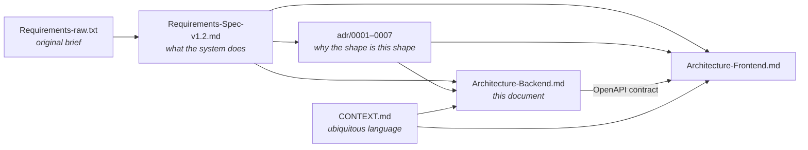
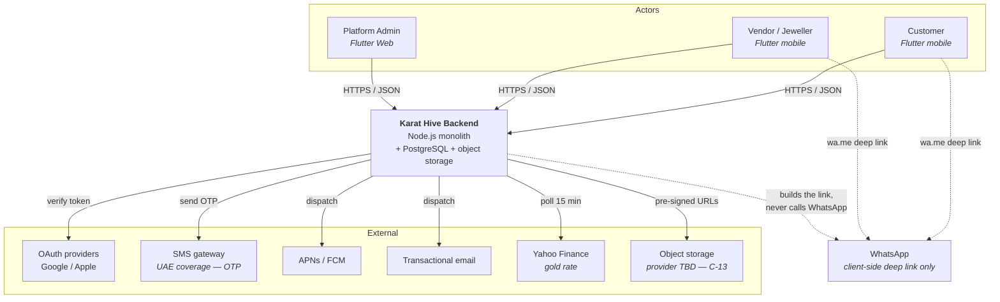
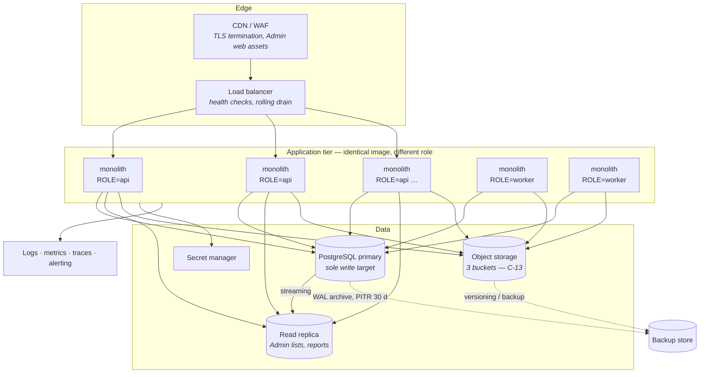
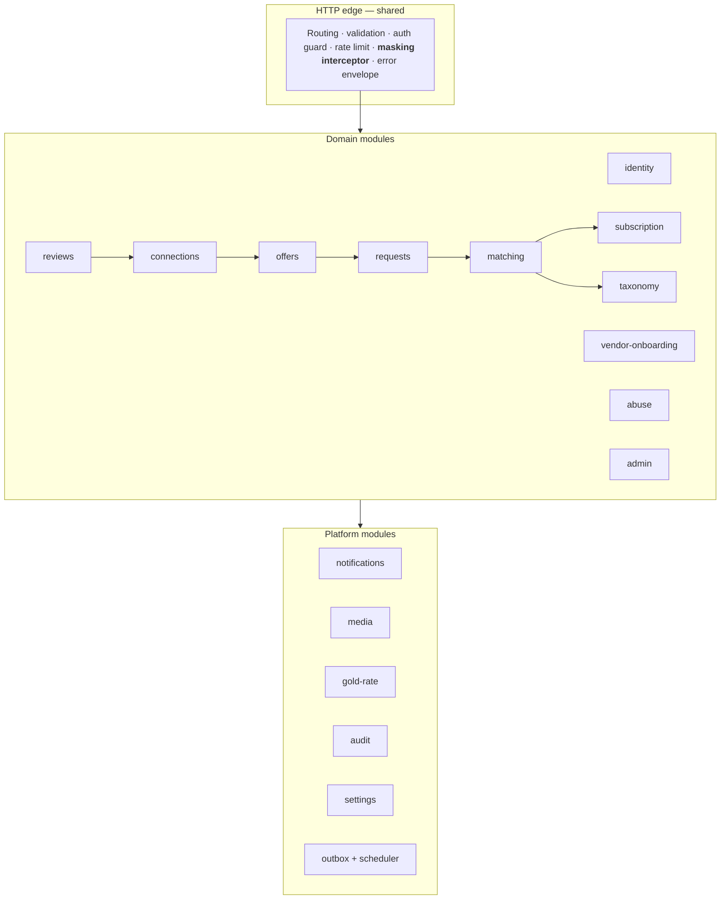
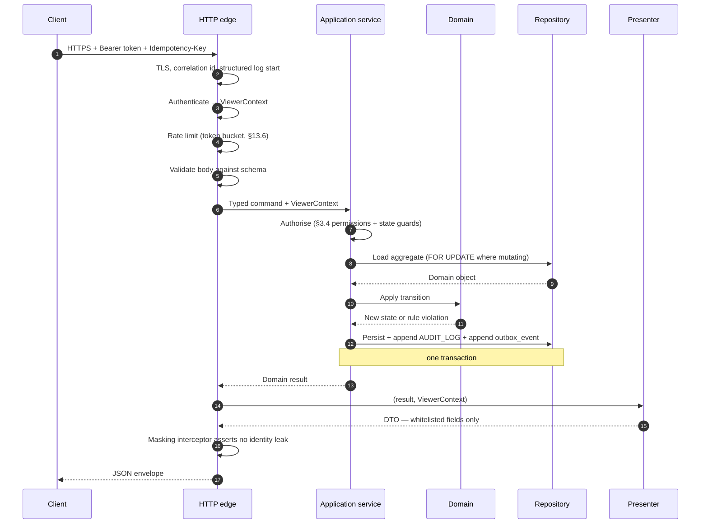

# Karat Hive — Backend Architecture

| | |
|---|---|
| **Product** | Karat Hive — Digital Jewellery Marketplace |
| **Document** | Software Architecture Document — **Backend** |
| **Version** | 1.0 |
| **Status** | Draft — for Technical Lead review. Contains `[PROPOSED]` decisions requiring sign-off. |
| **Date** | 10 August 2026 |
| **Companion** | [`docs/Architecture-Frontend.md`](Architecture-Frontend.md) — client architecture |
| **Governs** | Node.js monolith, PostgreSQL, object storage, background workers, all server-side integrations |
| **Source of truth** | [`docs/Requirements-Spec-v1.2.md`](Requirements-Spec-v1.2.md) · [`docs/adr/0001`–`0007`](adr/) · [`CONTEXT.md`](../CONTEXT.md) |

---

## Table of Contents

1. [Purpose, Scope and Conventions](#1-purpose-scope-and-conventions)
2. [Architectural Drivers](#2-architectural-drivers)
3. [Decision Register](#3-decision-register)
4. [System Context](#4-system-context)
5. [Deployment View](#5-deployment-view)
6. [Runtime Process Model](#6-runtime-process-model)
7. [Module Structure](#7-module-structure)
8. [Layering and Request Lifecycle](#8-layering-and-request-lifecycle)
9. [The Masking Pipeline](#9-the-masking-pipeline)
10. [The Acceptance Transaction](#10-the-acceptance-transaction)
11. [Asynchronous Work — Outbox, Scheduler, Workers](#11-asynchronous-work--outbox-scheduler-workers)
12. [Data Architecture](#12-data-architecture)
13. [API Architecture](#13-api-architecture)
14. [Identity, Authentication and Authorisation](#14-identity-authentication-and-authorisation)
15. [Integration Ports and Adapters](#15-integration-ports-and-adapters)
16. [Media Pipeline](#16-media-pipeline)
17. [Cross-cutting Concerns](#17-cross-cutting-concerns)
18. [Security Architecture](#18-security-architecture)
19. [Reliability, Scaling and Disaster Recovery](#19-reliability-scaling-and-disaster-recovery)
20. [Testing Strategy and Release Gates](#20-testing-strategy-and-release-gates)
21. [Source Layout](#21-source-layout)
22. [Open Decisions and Risks](#22-open-decisions-and-risks)
- [Appendix A — Requirement → Architecture Traceability](#appendix-a--requirement--architecture-traceability)
- [Appendix B — Table Ownership by Module](#appendix-b--table-ownership-by-module)
- [Appendix C — Infrastructure Tables Not in SRS §6](#appendix-c--infrastructure-tables-not-in-srs-6)
- [Appendix D — Revision History and Sign-off](#appendix-d--revision-history-and-sign-off)

---

## 1. Purpose, Scope and Conventions

### 1.1 Purpose

This document describes **how the Karat Hive backend is built**. The SRS says *what* the system must do; this document says *what the code and infrastructure look like* so that the SRS is satisfied. It is written to be sufficient, without further clarification, to:

- lay out the repository and let engineers start on independent modules without colliding,
- fix the contracts that the mobile and Admin clients integrate against,
- give QA the seams to test at, and
- let infrastructure be provisioned before application code lands.

### 1.2 Scope

**In scope.** The single Node.js deployable, its internal structure, PostgreSQL, object storage, background processing, all outbound integrations, and the HTTP API contract.

**Out of scope.** Client-side architecture (see the companion frontend document), visual design, and product requirements themselves. Where this document appears to restate a requirement, the SRS prevails.

### 1.3 Conventions

| Tag | Meaning |
|---|---|
| **`[PROPOSED]`** | An architecture decision made by *this document*. The SRS does not fix it. It requires Technical Lead sign-off before it becomes binding. |
| **`[BLOCKED]`** | Cannot be finalised until an external decision lands. Every occurrence is listed in §22. |
| `AD-BE-nn` | Backend architecture decision identifier — stable, never reused. Registered in §3. |
| `FR-…`, `NFR-…`, `BR-…`, `C-…` | Requirement, business rule and constraint identifiers from the SRS. |

Domain nouns — Request, Offer, Connection, Acceptance, Match Set, Fan-out, Talk, Type Subscription — carry exactly the meanings in `CONTEXT.md`. They are used in code as written.

### 1.4 Relationship to other documents



The API contract flows one way: the backend owns it, publishes it as OpenAPI (`NFR-030`), and the clients consume it. There is no reverse dependency.

---

## 2. Architectural Drivers

### 2.1 Fixed constraints

These are not open. They come from `Requirements-raw.txt` L96–L103 and are recorded as SRS constraints.

| ID | Constraint | Architectural consequence |
|---|---|---|
| **C-11** | Single Node.js monolithic deployable. No service decomposition, **no message broker**. | Asynchronous work must be built on PostgreSQL. §11 exists because of this. |
| **C-12** | PostgreSQL is the single system of record. **No secondary datastore** for search, cache or analytics. | No Redis, no Elasticsearch. Rate limiting, idempotency, job locks, sessions and search all land in PostgreSQL. §12.6 and §13.6 exist because of this. |
| **C-13** | Object storage provider **undecided**. | All storage access sits behind a port (§15.3) so the adapter can be written last. |
| **C-05 / BR-006** | Identity masking until Acceptance. | The single most invasive constraint on the code. §9. |
| **C-07** | Requests hard-expire at 48 h. | A clock the system must honour to the minute, across restarts and instances. §11.3. |

### 2.2 Quality attributes that shape the design

Ranked by how much they distort the design, not by importance to the business.

| Driver | Requirement | What it forces |
|---|---|---|
| **Masking is absolute** | `FR-SYS-003`, `NFR-013`, `BR-006`–`BR-008` | A single response-serialisation layer with field whitelisting, plus a release-gate test suite. Masked fields are **absent**, not null. |
| **Acceptance is atomic** | `FR-SYS-006`, `FR-SYS-007`, `BR-011`, `BR-013` | One PostgreSQL transaction with a deterministic lock order. No partial application under concurrency. |
| **Async without a broker** | `FR-SYS-001`, `NFR-004`, C-11 | Transactional outbox + polling workers, all in PostgreSQL. |
| **Stateless instances** | `NFR-009` | Nothing in process memory that a request depends on. Reference-data caches only, with explicit invalidation. |
| **List latency at volume** | `NFR-002` (10 M Offers, first page < 1 s) | Cursor pagination everywhere, a deliberate index plan, read replicas for Admin and reporting reads. |
| **Auditability** | `FR-SYS-011`, `NFR-015`, `NFR-016` | Append-only audit writes in the same transaction as the action they describe. |
| **Erasure vs retention** | `NFR-019` vs `NFR-021` | Anonymise-in-place rather than delete for transactional records; hard-delete for objects. §12.7. |

### 2.3 The four invariants

Everything else is negotiable. These four are what the architecture is arranged to protect:

1. **A masked field never leaves the process.** Not null, not empty string, not present-and-ignored — absent.
2. **At most one Offer per Request reaches `ACCEPTED`** (`BR-011`), under any amount of concurrency.
3. **Exactly one Connection exists per accepted Offer** (`BR-012`).
4. **Every identity reveal and every KYC document access is audited** (`FR-SYS-011`, `NFR-015`).

Code review rejects any change that weakens one of these, regardless of what else it improves.

---

## 3. Decision Register

Decisions made by this document. Status `Proposed` means it needs Technical Lead sign-off (Appendix D); `Fixed` means the SRS already binds it and the row is recorded here only for completeness.

| ID | Decision | Status |
|---|---|---|
| `AD-BE-01` | Single Node.js deployable; modules separated in code, not over the network | Fixed (C-11) |
| `AD-BE-02` | PostgreSQL is the only datastore, including for cache, locks, queue and search | Fixed (C-12) |
| `AD-BE-03` | **TypeScript** in strict mode; no JavaScript source in the application tree | `[PROPOSED]` |
| `AD-BE-04` | **NestJS on Fastify** as the application framework | `[PROPOSED]` |
| `AD-BE-05` | **Prisma** for schema, migrations and the transaction API; raw SQL for the six hot read paths in §12.5 | `[PROPOSED]` |
| `AD-BE-06` | **Transactional outbox** in PostgreSQL for all asynchronous work | `[PROPOSED]` |
| `AD-BE-07` | One binary, two runtime **roles** (`api`, `worker`) selected by environment variable | `[PROPOSED]` |
| `AD-BE-08` | Masking enforced by **explicit presenters with field whitelists**; entity objects never serialised directly | `[PROPOSED]` |
| `AD-BE-09` | Acceptance serialises on a `SELECT … FOR UPDATE` of the parent Request row | `[PROPOSED]` |
| `AD-BE-10` | PostgreSQL-backed token-bucket rate limiting | `[PROPOSED]` |
| `AD-BE-11` | Search via PostgreSQL GIN + `pg_trgm`; no external search engine | `[PROPOSED]` |
| `AD-BE-12` | Hexagonal ports for all five external integrations; adapters are the only place a vendor SDK appears | `[PROPOSED]` |
| `AD-BE-13` | Anonymise-in-place for erasure of transactional records; hard-delete for object storage | `[PROPOSED]` |
| `AD-BE-14` | OpenAPI generated from code, published as the client contract, and diffed in CI | `[PROPOSED]` |

### 3.1 Rationale for the contested ones

**`AD-BE-04` — NestJS on Fastify.** The product is a modular monolith with fourteen modules that must not reach into one another's tables (§7.3). NestJS's module system, dependency injection and interceptor pipeline give that boundary a runtime shape rather than a naming convention, and its global interceptor is exactly the right place for the single serialisation layer that `NFR-013` demands. Fastify rather than Express for throughput headroom against `NFR-007`. The alternative — plain Fastify with hand-rolled modules — is lighter and has fewer decorators, but the masking interceptor and the module boundary then have to be invented and defended by convention alone. If the team has strong prior Fastify experience and weak Nest experience, take the alternative and make §9 a code-review checklist instead of a framework feature.

**`AD-BE-05` — Prisma.** Migrations, generated types and a transaction API that maps cleanly onto §10. Its weakness is complex read queries, which is precisely where §12.5 says to drop to raw SQL anyway. Alternatives: Drizzle (better SQL fidelity, younger migration story) or Kysely + node-pg-migrate (best SQL fidelity, most hand-written plumbing). Any of the three is defensible; the decision that matters is that **there is exactly one** data-access mechanism per path and no ad-hoc `pg` calls scattered through services.

**`AD-BE-06` — Transactional outbox.** C-11 forbids a message broker, but `FR-SYS-001` needs fan-out to be idempotent and `NFR-004` needs 99 % of time-critical notifications dispatched within 60 seconds. Writing the domain change and the intent-to-notify in the **same transaction**, then having workers drain the outbox, gives at-least-once delivery with no broker and no lost events when an instance dies mid-dispatch. It is the standard answer to "reliable async on a relational database" and it is the reason §11 is as detailed as it is.

---

## 4. System Context



**The dotted WhatsApp edges are the point of §7.2 of the SRS.** The backend constructs a `wa.me` URL and records a `CONTACT_EVENT`; it never contacts WhatsApp, never receives a callback, and has no technical means of reading the conversation (`NFR-017`). Everything downstream of the Talk button is unobservable to the platform by design.

### 4.1 Trust boundaries

| Boundary | Rule |
|---|---|
| Client → API | Zero trust. Every filter, every masking rule, every state guard is re-evaluated server-side (`FR-SYS-003`, §7.5 of the SRS). A client-supplied role, vendor id, or "isRevealed" flag is never honoured. |
| API → PostgreSQL | Private network only. No public database endpoint. Credentials from the secret manager, rotated. |
| API → object storage | Backend holds the credentials; clients never do. Clients receive only short-lived pre-signed URLs (§16). |
| API → third parties | Outbound only, over TLS, through adapters (§15). No third party initiates a connection into the platform in v1 — there are no inbound webhooks. |

---

## 5. Deployment View



### 5.1 Environments

| Environment | Purpose | Data | Notes |
|---|---|---|---|
| `local` | Developer machine | Seeded synthetic | Docker Compose: PostgreSQL + MinIO (S3-compatible) stands in for the undecided provider (C-13) |
| `ci` | Automated test | Ephemeral, per-run | Full migration run from empty on every build |
| `staging` | UAT, PO `[ASSUMED]` sign-off, penetration test | Synthetic only — **never** production personal data | Same region and topology as production |
| `production` | Live | Real | UAE-consistent region (`NFR-020`) |

**No production personal data leaves production.** `NFR-016` forbids bulk extraction, and a staging refresh from a production dump would be exactly that. Staging is seeded from a generator, not a restore. Restore *testing* (`NFR-011`) happens into an isolated, access-controlled environment that is destroyed afterwards.

### 5.2 Regional placement

One region, chosen for UAE data-residency consistency (`NFR-020`, C-13 residency row). Object storage, database, backups and logs all sit in that region. Any log shipping or APM vendor whose ingestion lands outside it needs a documented legal basis before it is enabled — this catches people out late, so it is an infrastructure checklist item, not an afterthought.

---

## 6. Runtime Process Model

`AD-BE-07`. One container image. `KH_ROLE` selects behaviour at boot:

| Role | Serves HTTP | Runs schedulers | Typical count |
|---|---|---|---|
| `api` | Yes | No | Scales with interactive traffic |
| `worker` | No (health endpoint only) | Yes | 1–2; horizontally safe because every job takes a lock (§11.4) |
| `all` | Yes | Yes | `local` and `staging` only |

This is the concrete form of `NFR-009`'s requirement that background processing be "independently togglable per instance". Splitting the roles means a fan-out storm after a burst of Request publications cannot eat the event loop that interactive Offer submissions are running on — which is the single most likely way the monolith disappoints under load.

**Startup sequence.** Load configuration → validate it (fail fast on a missing secret; never boot with a defaulted secret) → connect PostgreSQL and verify the migration version matches the build → warm reference caches (§17.1) → register the role's components → begin accepting traffic. Readiness reports true only after all of that; the load balancer keeps traffic away until then.

**Shutdown sequence.** On `SIGTERM`: fail readiness immediately, let the load balancer drain, finish in-flight HTTP requests up to a 30-second cap, stop claiming new outbox batches, let claimed batches finish or expire their lease, close pools, exit. This is what makes `NFR-028`'s zero-downtime rolling release actually zero-downtime.

---

## 7. Module Structure

### 7.1 Module map



### 7.2 Module responsibilities

| Module | Owns | Principal requirements |
|---|---|---|
| `identity` | `USER`, `CUSTOMER_PROFILE`, `ADMIN_PROFILE`, sessions, OTP, OAuth binding, 2FA | `FR-CUS-001`–`004`, `FR-VEN-003`, `FR-ADM-001`, `FR-ADM-002` |
| `vendor-onboarding` | `VENDOR_PROFILE`, `VENDOR_DOCUMENT`, the vendor state machine, verification workflow | `FR-VEN-001`, `FR-VEN-002`, `FR-VEN-024`, `FR-ADM-015`, `FR-ADM-016`, SRS §5.4 |
| `subscription` | `VENDOR_TYPE_SUBSCRIPTION`, per-Request-type entitlement checks | `FR-VEN-031`, C-09 |
| `taxonomy` | `CATEGORY`, `REGION`, hierarchy, deactivate-never-delete | `FR-ADM-024`, `FR-ADM-025`, `BR-019` |
| `requests` | `REQUEST`, `REQUEST_MEDIA` links, the Request state machine, four Request types, indicative valuation | `FR-CUS-005`–`018`, SRS §5.2 |
| `matching` | `REQUEST_MATCH`, eligibility evaluation, fan-out orchestration | `FR-SYS-001`, `FR-SYS-002` |
| `offers` | `OFFER`, `OFFER_REVISION`, the Offer state machine, validity clamping | `FR-VEN-012`–`019`, `FR-CUS-019`–`022`, SRS §5.3 |
| `connections` | `CONNECTION`, `CONTACT_EVENT`, **acceptance orchestration**, identity reveal, WhatsApp link construction | `FR-CUS-023`–`027`, `FR-VEN-020`–`022`, `FR-SYS-006`, `FR-SYS-007` |
| `reviews` | `REVIEW`, moderation workflow, rating aggregates | `FR-CUS-029`–`031`, `FR-VEN-028`, `FR-ADM-026`, `FR-SYS-012` |
| `abuse` | `ABUSE_REPORT`, the report queue | `FR-CUS-033`, `FR-VEN-030`, `FR-ADM-032` |
| `admin` | Admin read models, queues, exports, analytics | `FR-ADM-003`–`033` |
| `notifications` | `NOTIFICATION`, delivery records, preference and quiet-hours evaluation, channel adapters | `FR-SYS-008`, `FR-CUS-032`, `FR-VEN-026`, `FR-ADM-029` |
| `media` | Upload authorisation, processing pipeline, signed-URL issuance | `FR-CUS-007`, `FR-VEN-002`, `FR-SYS-009` |
| `gold-rate` | `GOLD_RATE`, ingestion, purity derivation, staleness, manual override | `FR-SYS-010`, `FR-CUS-018`, `FR-ADM-031` |
| `audit` | `AUDIT_LOG`, append-only writer | `FR-SYS-011`, `FR-ADM-033` |
| `settings` | `PLATFORM_SETTING`, hot reload, change epoch | `FR-ADM-030`, `NFR-026`, `BR-020` |
| `outbox` | `outbox_event`, scheduler, job locks, worker registry | `FR-SYS-001`, `004`, `005`, `008`, `009`, `010`, `012` |

### 7.3 Module boundary rules

C-11 removes the network boundary that would otherwise stop modules bleeding into one another. Four rules replace it, enforced by lint and by code review:

1. **A module owns its tables.** No module reads or writes another module's tables directly. `offers` does not `SELECT` from `request` — it asks `requests`.
2. **Cross-module calls go through a published interface**, exported from the module's `index.ts`. Everything else is internal. An import that reaches past `index.ts` fails the build (`eslint-plugin-boundaries` or equivalent).
3. **Domain modules depend on platform modules, never the reverse.** `notifications` does not know what a Request is; it is handed a rendered notification.
4. **The dependency graph is acyclic.** Where two modules genuinely need each other, the dependency is inverted through an outbox event. `offers` does not call `notifications`; it emits `offer.submitted` and the notification worker reacts.

Rule 4 is doing real work: it is what keeps acceptance (§10) from turning into a transaction that holds a database lock while waiting on APNs.

**Query exception.** The `admin` module reads across module boundaries for its list and analytics screens, because assembling an Admin Request list through eleven module interfaces one entity at a time would violate `NFR-002` outright. It does so through **read-only, explicitly named query views** owned by the module that owns the tables — not by direct table access. This is the one place where the rule bends, and it bends in a named, reviewable way.

---

## 8. Layering and Request Lifecycle

### 8.1 Layers within a module

| Layer | Contains | Must not |
|---|---|---|
| **Controller** | Route definition, request schema, response presenter selection | Contain business logic, or touch the database |
| **Application service** | Use-case orchestration, transaction boundaries, authorisation checks, outbox emission | Contain HTTP or SQL concepts |
| **Domain** | Entities, value objects (Money, Weight, Purity, Karat), state-machine transition rules, business-rule predicates | Perform I/O of any kind |
| **Repository** | SQL and Prisma access, mapping rows to domain objects | Contain business rules or authorisation |
| **Presenter** | Domain object + viewer context → response DTO | Fetch anything |

The domain layer being I/O-free is what makes the state machines in SRS §5 unit-testable to the exhaustive standard `NFR-029` demands. Each transition table is a pure function; the test suite walks every legal and illegal transition without a database.

### 8.2 Request lifecycle



`ViewerContext` — who is asking, in what role, with what account state, and which Connections they are party to — is constructed once at the edge and threaded through everything. Authorisation and masking both read from it. It is never derived from the request body.

---

## 9. The Masking Pipeline

This is the section to read twice. `BR-006` is the product's core asset (SRS §2.2); `NFR-013` makes its enforcement a release gate; and a monolith gives exactly one place to get it right (`docs/adr/0007`).

### 9.1 The rule

> A response payload contains a counterparty's identifying fields **only** when an `ACTIVE` or `CLOSED` `CONNECTION` links the viewer and that counterparty. Otherwise the fields are **absent from the payload** — not null, not empty, not present-with-a-placeholder.

Identifying fields, by role:

| Party | Masked before Acceptance | Visible after Acceptance |
|---|---|---|
| Customer | Name, mobile, email, exact address, OAuth subject, user id | All of the above, scoped to that Connection (`BR-007`) |
| Vendor | Business name, trade licence, mobile, email, address, shop photos, vendor id | All of the above, scoped to that Connection |
| Either | — | Pseudonymous label, Region, aggregate rating and deal count are visible throughout (`SH-ID-01`) |

Admins see everything, always (SRS §3.4) — and every reveal they trigger is audited.

### 9.2 Four layers of enforcement

Defence in depth, because a single mechanism will eventually be bypassed by someone in a hurry.

| Layer | Mechanism | Catches |
|---|---|---|
| **1. Query** | Repository methods for pre-acceptance contexts do not `SELECT` identity columns at all | Accidental over-fetch; limits blast radius of a later bug |
| **2. Presenter** (`AD-BE-08`) | Every DTO is constructed field by field from an explicit whitelist. Object spread of an entity into a response is banned and lint-enforced | The overwhelming majority of real-world leaks — someone adds a column and it appears in the API |
| **3. Interceptor** | A global response interceptor runs a recursive scan for known identity key names on any route not flagged `@RevealsIdentity`. A hit is a 500 and a high-severity alert, never a silent redaction | A presenter someone forgot to update |
| **4. Test gate** | Contract tests assert **absence** of every identity key in every pre-acceptance payload, on every route, for every role. Failing = build fails (`NFR-013`, `NFR-029`) | Regression |

Layer 3 deliberately fails loudly rather than quietly stripping the field. A silent redaction would mask the defect and let it survive into a payload shape nobody tested.

### 9.3 The reveal decision

One function, in `connections`, is the sole authority:

```
canRevealIdentity(viewerUserId, counterpartyUserId) → boolean
  ← true iff ∃ CONNECTION where
      {customer_user_id, vendor_user_id} = {viewerUserId, counterpartyUserId}
      AND state ∈ {ACTIVE, CLOSED}
```

`BR-007` — reveal is scoped to the Connection that produced it — falls out of this naturally: the check is per counterparty pair, so a Vendor connected to Customer A learns nothing about Customer B. There is no account-level "verified, therefore trusted" shortcut, and there must never be one.

### 9.4 Media and enumeration

`FR-SYS-003.4` and `NFR-014`. Object keys are random UUIDs, never sequential and never derived from the Request reference. Every read is a signed URL issued after the same `canRevealIdentity` / match-set check that guards the parent entity, valid for 15 minutes. A Vendor who is no longer in a Request's match set stops being issued URLs immediately; any URL already issued dies within the window. `[BLOCKED]` on C-13 only for the signing mechanics, not for the policy.

### 9.5 Where masking does *not* apply

Notifications to losing Vendors after an Acceptance (`FR-SYS-006.3`) must disclose neither the winner's identity nor the winning price (`BR-008`). Because notification content is rendered inside the outbox worker rather than in a request context, that worker does **not** get a `ViewerContext` for free — the rendering function is given only the fields it is allowed to use, and the same contract tests cover notification bodies. This is an easy place to leak a price into a push notification, so it is called out explicitly.

---

## 10. The Acceptance Transaction

`FR-CUS-023` → `FR-SYS-006` + `FR-SYS-007`. The one operation the platform cannot get wrong: it is irreversible (`BR-013`), it reveals identities, and it concludes every competing Offer.

```mermaid
sequenceDiagram
    autonumber
    participant C as Customer
    participant S as connections service
    participant DB as PostgreSQL
    participant OB as outbox

    C->>S: POST /v1/offers/{id}/accept + Idempotency-Key
    S->>DB: BEGIN
    S->>DB: INSERT idempotency_key (unique) — replay returns stored response
    S->>DB: SELECT … FROM request WHERE id = ? FOR UPDATE
    Note over S,DB: the serialisation point — all concurrent<br/>acceptances on this Request queue here
    S->>DB: Re-read Offer; assert PENDING and not past validity
    S->>DB: Assert Request ∈ {PUBLISHED, OFFERS_RECEIVED}
    S->>DB: UPDATE offer SET state = ACCEPTED
    S->>DB: UPDATE offer SET state = REJECTED WHERE request_id = ? AND state = PENDING
    S->>DB: INSERT connection (ACTIVE) — unique on offer_id
    S->>DB: UPDATE request SET state = ACCEPTED
    S->>DB: INSERT audit_log (identity reveal, both parties)
    S->>OB: INSERT outbox_event ×N (winner, losers, customer)
    S->>DB: COMMIT
    S-->>C: 200 — Connection with both identities revealed
```

### 10.1 Why this is correct

| Threat | Defence |
|---|---|
| Two Customers accepting simultaneously | Impossible — one Customer per Request |
| One Customer double-tapping | `Idempotency-Key` unique constraint; second call returns the first response, not a second Connection |
| Two concurrent requests racing on the same Request | `FOR UPDATE` on the Request row serialises them; the second re-reads state `ACCEPTED` and is rejected with a domain error (`BR-011`) |
| Accepting an Offer that expired seconds ago | Validity re-checked inside the transaction (`FR-SYS-004.2`) — never trusted from the read that rendered the screen |
| Accepting on a cancelled/removed/expired Request | Request state asserted inside the transaction |
| Partial application | Single transaction; any failure rolls back everything and the Customer is told the acceptance failed (`FR-SYS-006.4`) |
| Notification failure aborting a valid acceptance | Notifications are outbox rows, not calls. Dispatch happens after commit; a push gateway outage cannot roll back a Connection |

**Isolation level:** `READ COMMITTED` with the explicit row lock, not `SERIALIZABLE`. The Request row is the only contention point, and locking it directly is cheaper and more predictable than serialisation-failure retries.

**Lock ordering:** Request first, then Offers in ascending `id`. Every multi-row write path in the codebase follows the same order, which is what prevents deadlock between acceptance and, say, a bulk Admin removal.

**Duration:** the transaction touches at most a few hundred rows and performs no network I/O. If it ever grows an external call, that is a defect — the outbox exists precisely so it does not have to.

---

## 11. Asynchronous Work — Outbox, Scheduler, Workers

C-11 gives no broker. C-12 gives no Redis. PostgreSQL is therefore the queue, and `AD-BE-06` makes that explicit rather than accidental.

### 11.1 The outbox

```
outbox_event(
  id, event_type, aggregate_type, aggregate_id, payload jsonb,
  created_at, available_at, claimed_at, claimed_by, attempts,
  state ∈ {PENDING, CLAIMED, DONE, FAILED}, last_error
)
```

Producers `INSERT` in the same transaction as the domain change. Consumers claim in batches:

```sql
UPDATE outbox_event SET state='CLAIMED', claimed_at=now(), claimed_by=$1
WHERE id IN (
  SELECT id FROM outbox_event
  WHERE state='PENDING' AND available_at <= now()
  ORDER BY available_at
  FOR UPDATE SKIP LOCKED
  LIMIT $2
) RETURNING *;
```

`FOR UPDATE SKIP LOCKED` is what makes multiple worker instances safe without coordination: each claims a disjoint batch. Delivery is **at-least-once**, so every consumer must be idempotent — enforced by a unique `(event_id, consumer)` row written on success. Failures back off exponentially (1 m, 5 m, 25 m) to three attempts, then `FAILED` with an alert (`NFR-025`). A claim older than its lease is reclaimable, so an instance killed mid-batch loses nothing.

### 11.2 Event catalogue

| Event | Producer | Consumers |
|---|---|---|
| `request.published` | `requests` | fan-out (`FR-SYS-001`), vendor notification |
| `request.expired` | expiry sweep | offer cascade, notifications |
| `request.expiry.warning` | expiry sweep | customer notification at T−6 h (`FR-SYS-005.2`) |
| `offer.submitted` | `offers` | customer notification, Request → `OFFERS_RECEIVED` |
| `offer.revised` / `offer.withdrawn` | `offers` | customer notification |
| `offer.expired` | expiry sweep | both-party notification, Request state re-evaluation (`FR-SYS-004.4`) |
| `offer.accepted` | `connections` | winner notification, loser notifications (price- and identity-free — §9.5) |
| `connection.closed` | `connections` | review prompts to both parties |
| `review.published` / `review.moderated` | `reviews` | rating aggregation (`FR-SYS-012`) |
| `vendor.verification.decided` | `vendor-onboarding` | vendor notification (`FR-ADM-015`) |
| `vendor.eligibility.changed` | `vendor-onboarding`, `subscription` | match-set recomputation (`FR-SYS-002.3`) |
| `media.uploaded` | `media` | processing pipeline (`FR-SYS-009`) |

### 11.3 Scheduled jobs

| Job | Cadence | Requirement | Idempotency |
|---|---|---|---|
| Offer expiry sweep | 1 min (spec allows 5 — `FR-SYS-004.1`) | `FR-SYS-004` | Transition guarded on current state |
| Request expiry sweep | 1 min | `FR-SYS-005`, C-07 | As above |
| Request expiry warning | 5 min | `FR-SYS-005.2` | `warned_at` set once |
| Outbox drain | 5 s | `NFR-004` | Claim + consumer marker |
| Notification retry | 1 min | `FR-SYS-008.3` | Attempt counter |
| Gold rate poll | 15 min, configurable | `FR-SYS-010`, `FR-ADM-031` | Upsert on `(purity, source_timestamp)` |
| Rating recompute | On event + 5 min reconciliation | `FR-SYS-012.3` | Full recompute is naturally idempotent |
| Media processing | On event | `FR-SYS-009` | Keyed on object id |
| Retention purge | Daily, 03:00 GST | `NFR-021`, `FR-SYS-009.6` | Idempotent by construction |
| Match-set recompute | On event | `FR-SYS-002.3` | Upsert on `(request_id, vendor_id)` |
| Stale-rate / feed-failure alert | 15 min | `FR-SYS-010.5` | Alert de-duplicated by window |

The two expiry sweeps run every minute even though `FR-SYS-004` permits five, because `FR-SYS-005.3` cascades a Request expiry into every pending Offer and the Customer-visible countdown (`SH-DOM-07`) reaching zero while the Request still shows as live is a trust problem, not a correctness one.

### 11.4 Job locking

`NFR-009` requires scheduled jobs to be guarded against duplicate execution across instances. A `job_lock` table holds one row per job name with an owner and a lease expiry; acquisition is a conditional `UPDATE` returning the row. Leases are short and renewed by the running job, so a killed worker's lock expires rather than wedging the job forever. PostgreSQL advisory locks would also work and are cheaper, but they vanish silently on connection loss and leave no operator-visible trace — the table is worth its cost for the observability alone.

### 11.5 Fan-out at scale

`FR-SYS-001` wants fan-out within 60 seconds for 99 % of Requests, idempotently. The worker resolves the match set with a single indexed query over `vendor_profile` joined to its Categories, Regions and active Type Subscriptions, then bulk-inserts `REQUEST_MATCH` rows with `ON CONFLICT DO NOTHING` — which is what makes a retry after partial failure harmless (`FR-SYS-001.4`). Notifications are emitted as a second outbox event per matched Vendor so a single failing device token cannot stall the batch. Zero matches is a valid outcome, not an error: the Request stays published, the Customer is told no vendor currently covers their Category and Region, and the gap is recorded for the liquidity report (`FR-SYS-001.3`, `FR-ADM-027`).

---

## 12. Data Architecture

### 12.1 Ownership

PostgreSQL is the system of record for every entity in SRS §6 (C-12). Object storage holds bytes only; PostgreSQL holds every key and every piece of metadata (SRS §7.6). There is no state that exists in one and not the other — which is why `NFR-011` requires the two to be backed up on the same schedule and restored together.

### 12.2 Schema conventions

| Convention | Rule |
|---|---|
| Keys | UUID v7 primary keys — random enough not to be enumerable (`NFR-014`), time-ordered enough to index well |
| Naming | `snake_case` tables and columns, singular table names, matching SRS §6 entity names |
| Timestamps | `timestamptz`, always UTC (`BR-021`). Display conversion to GST is the client's job |
| Money | `numeric(12,2)` with a separate currency column fixed to `AED` in v1 (C-01). Never floating point |
| Weight | `numeric(9,3)` grams (C-02) |
| Enums | PostgreSQL enum types for the four state machines, so an invalid state is rejected by the database, not only by the application |
| Soft state | No generic `deleted_at`. Lifecycle is modelled explicitly by state machines; taxonomy uses `is_active` (`BR-019`) |
| Migrations | Forward-only, reviewed, run automatically at deploy. Expand-migrate-contract for anything a running instance reads |

### 12.3 Migration discipline under rolling deploys

`NFR-028` requires zero-downtime rolling releases, which means old and new code run simultaneously against one schema. Therefore: additive changes only in a single release; no column is renamed or dropped in the release that stops using it; drops happen one release later. A migration that takes a long lock on `offer` or `request` — the two large hot tables — is rejected in review, since it stalls every interactive write for its duration.

### 12.4 Anticipated volumes

From `NFR-008`: 500 k Customers, 5 k Vendors, 2 M Requests, 10 M Offers, plus `REQUEST_MATCH` which is the largest table by row count — 2 M Requests × the average match-set size. At 50 matched Vendors per Request that is 100 M rows, so `REQUEST_MATCH` is designed for from day one: narrow, indexed on both directions, and a partitioning candidate by `created_at` if growth outruns the plan.

### 12.5 Hot read paths and their indexes

Six queries carry `NFR-002`. Each is written as raw SQL, has a committed `EXPLAIN` plan in the repository, and has a performance test against seeded production-scale data.

| # | Query | Index strategy |
|---|---|---|
| 1 | Vendor's Available Requests feed | `request_match(vendor_id, created_at DESC)` filtered to live Request states; covering columns to avoid the heap fetch |
| 2 | Customer's Offers on a Request | `offer(request_id, state, created_at DESC)` |
| 3 | Vendor's My Offers, three tabs | `offer(vendor_id, state, created_at DESC)` |
| 4 | Admin entity lists with arbitrary filters | Composite indexes on the filterable columns; **served from the read replica** |
| 5 | Expiry sweeps | Partial index `WHERE state = 'PENDING'` / `WHERE state IN ('PUBLISHED','OFFERS_RECEIVED')` — small and hot regardless of table size |
| 6 | Vendor eligibility for fan-out | `vendor_profile(verification_state, account_state)` plus join indexes on the Category, Region and Subscription link tables |

**Pagination is cursor-based everywhere** (`NFR-002`). Offset pagination is banned: page 900 of an Admin Offer list would scan nine million rows. Cursors are opaque, signed, and encode the sort key plus the tiebreak id.

### 12.6 Search without a search engine

C-12 forbids a search engine, and `FR-VEN-009` and the Admin lists still need text search. PostgreSQL provides it: GIN full-text indexes for descriptions and notes, `pg_trgm` for fuzzy business-name and reference lookup in the Admin console. This is comfortable at the stated volumes. It will not scale to relevance-ranked, faceted, multi-language search — so if the product later wants that, C-12 needs an explicit exception rather than a workaround. Recorded here so the ceiling is known in advance rather than discovered.

### 12.7 Retention, anonymisation and erasure

`NFR-019` (erasure within 30 days) and `NFR-021` (transactional records retained 7 years in anonymised form) pull in opposite directions. `AD-BE-13` resolves them:

| Data | On a data-subject erasure request |
|---|---|
| `USER`, profile identity fields | Overwritten in place with tombstone values; the row survives as an anonymous identifier so foreign keys hold |
| `REQUEST`, `OFFER`, `CONNECTION` | Retained, now pointing at the anonymised user; commercial history stays intact and unattributable (`NFR-021`) |
| `REQUEST_MEDIA`, `VENDOR_DOCUMENT` | Objects **hard-deleted** from storage, with the deletion verified and recorded; rows tombstoned |
| `REVIEW` text | Author anonymised; text retained or redacted per moderation policy |
| `AUDIT_LOG` | **Retained unaltered.** It is the legal record of what happened, including the erasure itself; anonymising it would defeat `FR-SYS-011.3` |
| `NOTIFICATION` | Purged (90-day retention anyway) |

Every erasure runs as one auditable job producing a completion certificate for the Admin who actioned it — because "we deleted your data" is a statement someone may have to defend to a regulator. The object-storage half of this is `[BLOCKED]` on C-13: the provider must support programmatic delete with verifiable completion (SRS §7.6).

### 12.8 Replicas

The primary is the sole write target (`NFR-008`). Admin lists, reports and exports read from a replica; every interactive Customer or Vendor path reads from the primary. Read-your-writes matters on the Offer submission and Acceptance paths, and replica lag would produce exactly the kind of "I submitted it but it isn't there" report that erodes Vendor trust. Routing is explicit per repository method, never inferred.

---

## 13. API Architecture

### 13.1 Style

REST over HTTPS, JSON, versioned in the path (`/v1/…`), as fixed by SRS §7.5. Resource-oriented, with state transitions expressed as sub-resource actions (`POST /v1/offers/{id}/accept`) rather than as PATCHes of a state field — the transition carries authorisation, side effects and an audit entry that a generic field update would hide.

### 13.2 Envelope and errors

Every response carries the same envelope; every error carries a machine-readable code plus a message already localised to the caller's `Accept-Language` (`NFR-024` — the client must not be assembling error prose from codes).

```json
{ "data": { }, "meta": { "requestId": "…", "serverTime": "2026-08-10T09:12:00Z" } }
{ "error": { "code": "OFFER_ALREADY_ACCEPTED", "message": "…", "details": [ ] },
  "meta": { "requestId": "…" } }
```

`meta.serverTime` is present on every response for a specific reason: the 48-hour Request countdown and Offer validity timers are legally and commercially meaningful, and a device with a skewed clock must not render its own idea of the remaining time. The client computes an offset from this field (see the frontend document, §10).

Error codes are a closed, documented enumeration. Internal identifiers, SQL fragments and stack traces never appear in a response (`NFR-024`).

### 13.3 Idempotency

Every mutating endpoint accepts `Idempotency-Key` and, for the acceptance and offer-submission paths, **requires** it (SRS §7.5). The key, the route, the caller and a hash of the body are stored with the response; a replay within 24 hours returns the stored response verbatim. A replay with the same key but a different body is a 409 — it means a client bug, and silently accepting it would be worse than failing.

### 13.4 Pagination, filtering, sorting

Cursor pagination on every collection: `?limit=&cursor=`, returning `meta.nextCursor`. `limit` is capped server-side. Filters are an explicit allow-list per endpoint; arbitrary field filtering is not exposed, because it is both an injection surface and an index-plan hazard. Sorts likewise come from a fixed set with a deterministic tiebreak, so cursors remain stable.

### 13.5 Versioning and client lifecycle

`NFR-027`: a deprecated version stays live for at least six months, because mobile clients cannot be force-upgraded. Practically, that means the code carries two active version surfaces at times. To keep that survivable, versioning happens **at the presenter layer only** — the domain and repositories are never forked per version. `Sunset` and `Deprecation` headers advertise the retirement date; the client surfaces an upgrade prompt from them (frontend §19).

### 13.6 Rate limiting

`NFR-018` requires rate limiting on authentication, OTP issuance, search and all mutating endpoints. `NFR-009` forbids in-process state. C-12 forbids Redis. `AD-BE-10` therefore puts token buckets in PostgreSQL — an `UPSERT … RETURNING` against a narrow `rate_limit_bucket` table, keyed by scope plus subject.

**This is a genuine architectural tension and it is stated plainly:** a per-request write to a shared table is more expensive than an in-memory or Redis counter, and at the far end of `NFR-007` (500 rps) it becomes a measurable share of database load. Two mitigations are designed in from the start: coarse buckets (per minute, not per second) to bound write volume, and edge rate limiting at the load balancer or WAF for crude volumetric abuse, so the database-backed limiter only handles the fine-grained per-user rules that actually need shared state. If measurement shows this is still the bottleneck, the correct response is an explicit, documented exception to C-12 for a cache tier — **not** an in-memory limiter that silently multiplies the effective limit by the instance count.

### 13.7 Contract publication

`NFR-030`: OpenAPI generated from the code's schema definitions, published to the client teams as the authoritative reference, and diffed against the previous build in CI. A breaking change without a version bump fails the build. The frontend generates its client from this document (`AD-FE-06` in the [frontend architecture](Architecture-Frontend.md#3-decision-register)), so drift is caught at compile time on both sides.

---

## 14. Identity, Authentication and Authorisation

### 14.1 Three authentication paths

| Actor | Mechanism | Requirements |
|---|---|---|
| **Customer** | Mobile number + OTP; **one-time OAuth binding** (Google / Apple) required before any Request may be published | `FR-CUS-001`, `FR-CUS-002`, `BR-001`, A-08 |
| **Vendor** | Email + password (Argon2id) | `FR-VEN-001`, `FR-VEN-003`, `NFR-012` |
| **Admin** | Email + password + **mandatory 2FA**; provisioned internally, self-registration structurally impossible | `FR-ADM-001`, `FR-ADM-002`, `NFR-012` |

Self-registration as an Admin is not merely unexposed — there is no code path that creates an `ADMIN_PROFILE` from an unauthenticated request. That is the difference between a missing endpoint and an enforced rule.

### 14.2 Tokens

Short-lived access JWT (15 minutes) plus a long-lived, rotating, single-use refresh token stored hashed. Refresh reuse detection: presenting a rotated token invalidates the whole family and forces re-authentication, which is what turns a stolen refresh token from an indefinite session into a detectable event.

The access token carries user id, role and token version only. It carries **no** entitlement, vendor state, or subscription claim — those change mid-session (an Admin suspends a Vendor; a subscription lapses) and a token that claimed them would keep granting access until expiry. Volatile authorisation facts are read from the database per request, cached only within that request. Suspension therefore takes effect on the very next call, as `FR-ADM-016` and `FR-SYS-002.2` require.

### 14.3 The OAuth publish gate

`BR-001` is unusual and worth stating precisely: OAuth is not the login mechanism. A Customer authenticates by OTP and can browse, draft and manage an account without it. The OAuth binding gates exactly one action — **publishing a Request** (`FR-CUS-014`). The gate is enforced in the publish use case, not at the edge, so it cannot be routed around by a different endpoint reaching the same operation.

### 14.4 Authorisation model

Three layers, all server-side (SRS §7.5, `FR-SYS-003`):

1. **Role** — coarse, from §3.4's permission matrix. A Customer cannot reach an Offer-submission route at all.
2. **Account state** — a Vendor who is not `VERIFIED` **and** `ACTIVE` is confined to the Awaiting-Approval shell (`BR-002`, `FR-VEN-003`, C-04). Enforced as a guard, so a new route is confined by default rather than by remembering.
3. **Relationship** — this Customer owns this Request; this Vendor is in this Request's match set and holds an active Type Subscription for its type (`FR-VEN-031`); these two parties share a Connection (§9.3).

Layer 3 is where authorisation bugs live, because it needs a query. It is implemented once per aggregate as a named policy function and reused, never re-derived inline in a controller.

---

## 15. Integration Ports and Adapters

`AD-BE-12`. Each external system is reached through a narrow port defined in domain terms. The adapter is the only place a vendor SDK is imported, which is what lets the undecided storage provider (C-13) and the legally uncertain rate feed (SRS §7.4) be swapped without touching business logic.

### 15.1 Notification gateway (SRS §7.3)

Port: `send(channel, recipient, renderedMessage) → DeliveryResult`. Adapters: APNs, FCM, transactional email, SMS. Retry with exponential backoff to three attempts (`FR-SYS-008.3`), delivery receipts recorded where the channel supports them, per-channel failure rates exposed as metrics and surfaced to Admins.

Two rules the implementation must not soften: every notification is **persisted to the in-app centre regardless of push outcome** (`FR-SYS-008.6`) — the in-app centre is the source of truth and push is best-effort; and quiet hours and preferences are evaluated **at dispatch time**, not at enqueue time, except for critical notifications which always deliver (`FR-SYS-008.2`).

### 15.2 Gold rate feed (SRS §7.4)

Port: `fetchSpotRate() → { aedPerGram24k, sourceTimestamp }`. Adapter: Yahoo Finance. Polled at the configured interval (default 15 minutes), rates for 22K / 21K / 18K derived from the 24K base using configured purity factors, every ingested rate retained historically so any past indicative valuation can be reconstructed (`FR-SYS-010.4`).

Failure behaviour is specified precisely because getting it wrong is a commercial hazard: retain the last good value, mark it stale past the configured threshold, **never substitute zero or a fabricated rate**, alert Admins after two hours, and support a manual per-purity Admin override with a mandatory reason and explicit expiry (`FR-ADM-031`).

**`[BLOCKED]` — legal.** Whether Yahoo's terms permit redistribution of rate data to end users is unresolved (SRS §7.4, A-06). The port exists so that a different provider, or manual-entry-only operation, is an adapter change of a day rather than a refactor.

### 15.3 Object storage (SRS §7.6) `[BLOCKED]` on C-13

Port: `presignUpload`, `presignDownload`, `delete`, `head`. The interface is specified against S3 semantics so requirements can be written and tested now; MinIO backs `local` and `ci`. Three buckets with distinct policies — Request media, Vendor KYC, system/export artefacts — no public objects, server-side encryption, signed URLs of 15 minutes by default (`NFR-014`).

Provider selection gates signed-URL semantics, the KYC retention policy, PDPL erasure mechanics and the media cost model. It cannot be deferred past the start of media-handling implementation.

### 15.4 OAuth providers

Port: `verifyIdentityToken(provider, token) → { subject, emailVerified }`. Verification is against the provider's published keys, server-side, always. A client-supplied profile is never trusted. The provider subject is stored hashed and bound to exactly one `USER`.

### 15.5 WhatsApp — a link builder, not an integration

There is no adapter, because there is no call. A pure function builds `https://wa.me/<digits>?text=<url-encoded>` from the counterparty's number and a message template rendered in the initiating party's language (`FR-CUS-025`, `FR-VEN-022`). The backend's only runtime involvement is recording a `CONTACT_EVENT` when the client reports a Talk tap.

Number normalisation is the whole risk: international format, digits only, no `+`, no spaces, no leading zeros. A malformed number produces a dead link with no error anywhere in the system — no delivery guarantee, no callback (SRS §7.2). Normalisation therefore happens **once, at profile capture**, and is validated then; the link builder formats an already-valid number rather than repairing an arbitrary one. The tap-to-call and copyable-number fallbacks are mandatory (`FR-CUS-027`, SRS §7.2) precisely because this path can fail silently.

---

## 16. Media Pipeline

`FR-CUS-007`, `FR-VEN-002`, `FR-SYS-009`, `NFR-005`, `NFR-014`.

```mermaid
sequenceDiagram
    autonumber
    participant App as Client
    participant API as media service
    participant OS as Object storage
    participant W as media worker

    App->>API: POST /v1/media/upload-intent (type, size, mime, parent)
    API->>API: Authorise; validate declared type and size
    API->>OS: Create pre-signed PUT (constrained: content-type, max size)
    API-->>App: uploadUrl + objectKey (random UUID)
    App->>OS: PUT bytes directly (progress, resumable retry)
    App->>API: POST /v1/media/{key}/complete
    API->>OS: HEAD — verify existence, size, content type
    API->>API: INSERT media row (state = PENDING_PROCESSING) + outbox
    W->>OS: GET original
    W->>W: Content-inspect the magic bytes — reject non-image posing as image
    W->>W: Malware scan → quarantine on failure
    W->>W: Strip ALL EXIF incl. GPS · re-encode · generate thumbnail
    W->>OS: PUT derivatives
    W->>API: Mark READY (or QUARANTINED, blocking parent publication)
```

Direct-to-storage upload keeps 5 MB photographs off the application tier entirely, which is what makes `NFR-005` (5 MB over 4G in 15 seconds, with progress and resumable retry) achievable without the monolith becoming a file proxy.

Non-negotiables: type validated by **content inspection, not extension** (`FR-SYS-009.1`); **all EXIF including GPS stripped before storage** — a Customer's home coordinates in an ornament photograph would defeat the entire masking model (`FR-SYS-009.2`, `FR-VEN-011`); originals never served to counterparties before processing completes (SRS §7.6); a failed malware scan quarantines the file and **blocks the parent Request from publication** (`FR-SYS-009.5`); media attached to a deleted or removed entity purged within 30 days (`FR-SYS-009.6`).

**KYC documents are a separate bucket with a separate policy.** They are never served to any actor other than a Platform Admin, encrypted at rest, and **every single access is individually audited** (`NFR-015`) — not sampled, not aggregated.

---

## 17. Cross-cutting Concerns

### 17.1 Configuration and platform settings

Two distinct kinds, deliberately not merged:

| Kind | Examples | Mechanism |
|---|---|---|
| **Infrastructure config** | Database URL, secrets, region, role | Environment + secret manager. Immutable per deployment. Validated at boot |
| **Platform settings** (`FR-ADM-030`) | Request lifetime, offer validity options, purity factors, rate poll interval, notification thresholds | `PLATFORM_SETTING` rows, editable in the Admin Portal **without deployment or restart** (`NFR-026`) |

Settings are cached per instance and invalidated by a monotonically increasing epoch that every instance checks cheaply; a change propagates within seconds without a restart. This is legitimate under `NFR-009` because it is reference data, not request state — an instance losing its cache re-reads and continues correctly.

`BR-020` is enforced at the point of use: a setting change applies only to entities created after it. A Request that was published under a 48-hour lifetime keeps its 48 hours even if the setting later becomes 24. Practically, that means **the effective value is snapshotted onto the entity at creation** rather than read live at evaluation time — a rule that is trivial to implement on day one and painful to retrofit.

### 17.2 Audit

`FR-SYS-011`. Append-only. `AUDIT_LOG` is written **in the same transaction as the action it records**, so an action can never exist without its audit entry. No `UPDATE` or `DELETE` grant exists on the table for the application role — the immutability of `FR-SYS-011.3` is a database permission, not a code convention.

Mandatory coverage: every authentication event; every Admin mutation; **every identity reveal**; **every KYC document access**; every personal-data export; every platform-setting change; every account state transition. Each entry records actor, action, target, before/after where applicable, source IP, user agent and UTC timestamp. Retention ≥ 24 months (`NFR-021`).

### 17.3 Observability

`NFR-025`. Structured JSON logs with a correlation id spanning client → API → database → worker; RED metrics per endpoint; distributed traces on the critical paths (publish, offer submit, accept, fan-out). Personal data never appears in a log line — masked in the logger's serialiser, so it cannot be leaked by an incidental object dump.

Alerts, at minimum: error rate, p95/p99 latency against `NFR-001`, notification delivery failure per channel, gold-rate ingestion failure (2 h — `FR-SYS-010.5`), outbox backlog depth and age, job-lock staleness, replication lag, and any masking-interceptor trigger (§9.2 layer 3) — which is a page-immediately event.

### 17.4 Server-side localisation

`NFR-022`. English and Arabic. The server localises: notification bodies, error messages, and export headers. Locale comes from the user's stored preference, falling back to `Accept-Language`. No user-facing string is hard-coded, including in notification templates. Money and dates are formatted **on the client**, not the server — the server sends amounts and ISO-8601 UTC timestamps, and the client applies GST, Hijri, and Arabic numeral preferences (frontend §13).

### 17.5 Time

All storage and all API timestamps are UTC (`BR-021`). GST (UTC+4) is a display concern. Expiry evaluation uses database time, not application time, so instances with drifting clocks cannot expire Requests early or late.

---

## 18. Security Architecture

| Requirement | Implementation |
|---|---|
| `NFR-012` | Argon2id password hashing; ≥ 12 characters with mixed classes for Vendor and Admin; breached-password list checked at set time; TOTP 2FA mandatory for every Admin |
| `NFR-013` | §9 — four-layer masking with a release-gate test suite |
| `NFR-014` | Random object keys; 15-minute signed URLs; no public bucket listing; EXIF stripped |
| `NFR-015` | KYC and personal identifiers encrypted at rest; KYC readable only by authenticated Admins; every access audited individually |
| `NFR-016` | No bulk personal-data export exists for Customers or Vendors at any privilege level. Admin exports are watermarked with the exporting Admin, timestamp and stated purpose, and audited |
| `NFR-017` | No WhatsApp API integration exists; the platform has no technical means of accessing conversation content |
| `NFR-018` | Parameterised queries throughout; strict input validation at the edge; security headers; dependency and container scanning in CI; SAST; independent penetration test before launch; TLS 1.2+; rate limiting per §13.6 |
| `NFR-020` | Single region consistent with UAE residency; cross-border transfer requires documented legal basis — this includes third-party log and APM ingestion |

**Secrets** live in the platform secret manager, are injected at runtime, never committed, and are rotated on a schedule. The application refuses to boot with a missing or default-valued secret rather than starting in a degraded state that looks healthy.

**Threats specific to this product**, beyond the OWASP baseline:

| Threat | Mitigation |
|---|---|
| A Vendor scraping Customer identities by enumerating Requests | Masking at the API layer (§9); random ids; rate limiting on list endpoints; anomalous-volume alerting |
| Contact details smuggled through free-text Offer notes to bypass the platform | `BR-022` — pattern detection on phone numbers, emails and messaging handles in free-text fields at submission (`FR-VEN-011`, `FR-VEN-012`), with detections surfaced to the abuse queue |
| A suspended Vendor continuing to act on a live token | Volatile authorisation read per request, never claimed in the JWT (§14.2) |
| An Admin exfiltrating personal data at scale | `NFR-016` watermarking plus mandatory audit; export volume alerting |
| A masked field appearing in a log, notification body, or error payload | Logger serialiser masking; notification-body contract tests (§9.5); no internal identifiers in error responses |

---

## 19. Reliability, Scaling and Disaster Recovery

### 19.1 Scaling

`NFR-007`: 10 000 concurrent sessions, 500 rps at launch. The unit of scale is the whole application (C-11) — capacity comes from more identical instances behind a load balancer, which is only sound because `NFR-009` keeps process memory free of request state. Vertical scaling of the PostgreSQL primary first, then read replicas for Admin and reporting (§12.8). The primary is the ceiling in this topology, and everyone should know that: partitioning `REQUEST_MATCH` and `OFFER` is the next lever, and sharding would require revisiting C-11 and C-12 outright.

### 19.2 Failure modes

| Failure | Behaviour |
|---|---|
| One `api` instance dies | Load balancer drains it; in-flight requests fail and are retried by the client; no state lost |
| All `worker` instances die | Interactive traffic is unaffected. Fan-out and expiry stall — the visible symptom is Requests not expiring on time, so **outbox age** is a first-class alert, not a nice-to-have |
| PostgreSQL primary fails | Managed failover to standby; the application reconnects with a bounded retry and surfaces a maintenance error meanwhile. Writes are unavailable during failover — this is the platform's dominant single point of failure and is accepted under `NFR-010`'s 99.5 % |
| Read replica lags or fails | Admin reads fall back to the primary with a stricter rate limit; interactive paths were never on the replica |
| Object storage unavailable | Media upload and display degrade; **Request creation without media still works**; KYC review is blocked and the verification queue holds |
| Push gateway down | Outbox retries; in-app notification centre is unaffected and remains the source of truth (`FR-SYS-008.6`) |
| Gold rate feed down | Last good value retained and marked stale; never zero; Admin alert at 2 h; manual override available (`FR-SYS-010`) |

### 19.3 Backup and recovery

`NFR-011`: daily backups with continuous WAL archiving giving point-in-time recovery across a 30-day window; RPO ≤ 1 hour; RTO ≤ 4 hours. Object storage is versioned or independently backed up **on the same schedule** — a database restore without the corresponding media leaves Requests and KYC records incomplete, which is a half-restore that looks like a success.

Restore procedures for database **and** object storage together are exercised quarterly, into an isolated environment, with the RTO measured and recorded. An untested backup is a hypothesis.

---

## 20. Testing Strategy and Release Gates

| Level | Scope | Notes |
|---|---|---|
| Unit | Domain layer — state machines, business rules, value objects | No I/O; fast; this is where `NFR-029`'s 80 % business-logic coverage is earned |
| Integration | Repositories and services against a real PostgreSQL | Testcontainers or equivalent. No mocked database — the transaction and locking semantics of §10 are precisely what needs testing |
| Contract | Every endpoint, every role, request and response schemas | Generates and validates the OpenAPI document |
| **Masking** | Absence assertions on every pre-acceptance payload and every notification body | Its own suite because it is its own release gate (`NFR-013`) |
| Concurrency | Parallel acceptance, parallel offer submission, duplicate outbox claims, double scheduler fire | The only way to prove `BR-011` and `BR-012` hold |
| Performance | The six hot paths of §12.5 against production-scale seed data | Asserts `NFR-001` and `NFR-002` numerically |
| Security | SAST, dependency and container scanning, plus an independent penetration test before launch | `NFR-018` |

**Release gate — the build fails if any of these fail** (`NFR-029`):

1. Masking absence assertions — all routes, all roles, notification bodies included.
2. Full state-machine transition tests for Request, Offer, Vendor and Connection (SRS §5), legal and illegal transitions both.
3. Business-logic coverage ≥ 80 %.
4. Concurrency suite green — no duplicate Connection, no double acceptance.
5. OpenAPI diff shows no unversioned breaking change.
6. No high or critical vulnerability in dependency or container scans.

---

## 21. Source Layout

```
karat-hive-backend/
├─ src/
│  ├─ main.ts                     # role-aware bootstrap (api | worker | all)
│  ├─ config/                     # schema-validated env loading, fail fast
│  ├─ edge/                       # guards, interceptors, filters, envelope
│  │  ├─ auth/                    # ViewerContext construction
│  │  ├─ masking/                 # §9 layer 3 interceptor
│  │  ├─ idempotency/
│  │  ├─ rate-limit/
│  │  └─ errors/
│  ├─ modules/
│  │  ├─ identity/                # each module: controller/ application/
│  │  ├─ vendor-onboarding/       #   domain/ repository/ presenter/ index.ts
│  │  ├─ subscription/
│  │  ├─ taxonomy/
│  │  ├─ requests/
│  │  ├─ matching/
│  │  ├─ offers/
│  │  ├─ connections/             # acceptance transaction lives here
│  │  ├─ reviews/
│  │  ├─ abuse/
│  │  ├─ admin/
│  │  ├─ notifications/
│  │  ├─ media/
│  │  ├─ gold-rate/
│  │  ├─ audit/
│  │  └─ settings/
│  ├─ platform/
│  │  ├─ outbox/                  # producer, claimer, dispatcher
│  │  ├─ scheduler/               # job registry, job_lock leases
│  │  ├─ db/                      # Prisma client, transaction helper, replica routing
│  │  ├─ ports/                   # interfaces only — no SDK imports
│  │  └─ adapters/                # apns/ fcm/ email/ sms/ storage/ oauth/ gold-rate/
│  └─ shared/                     # Money, Weight, Purity, Result, time, logging
├─ prisma/
│  ├─ schema.prisma
│  ├─ migrations/
│  └─ seed/                       # synthetic data incl. production-scale perf seed
├─ test/
│  ├─ masking/                    # release-gate suite
│  ├─ concurrency/
│  ├─ contract/
│  └─ performance/
├─ openapi/                       # generated artefact, committed for diffing
└─ docker/                        # local compose: postgres + minio
```

One repository. `packages/` and workspaces are deliberately absent — C-11 says one deployable, and a workspace split invites the module graph to grow edges the boundary rules of §7.3 forbid.

---

## 22. Open Decisions and Risks

### 22.1 Blocking

| # | Item | Blocks | Owner |
|---|---|---|---|
| 1 | **Object storage provider** (C-13, SRS §7.6) — `Requirements-raw.txt` L102 is blank | Media upload and display, KYC review and retention, signed-URL semantics, PDPL erasure mechanics, media cost model. `local`/`ci` can proceed on MinIO; **staging cannot** | Product Owner + Infrastructure |
| 2 | **Yahoo Finance redistribution terms** (SRS §7.4, A-06) | Displaying reference rates to end users. The port and manual-override fallback exist, so this blocks a feature, not the build | Legal |
| 3 | **Cloud provider and region** (`NFR-020`) | Provisioning, residency compliance, managed-PostgreSQL selection, backup topology | Infrastructure |

### 22.2 Decisions awaiting Technical Lead sign-off

Every `[PROPOSED]` row in §3. The three worth the most discussion: `AD-BE-04` (framework), `AD-BE-05` (data access) and `AD-BE-10` (PostgreSQL rate limiting, §13.6 — the one place where a fixed constraint and a non-functional requirement genuinely pull against each other).

### 22.3 Risks

| Risk | Likelihood | Impact | Response |
|---|---|---|---|
| PostgreSQL primary becomes the scaling ceiling before the `NFR-008` volumes are reached | Medium | High | Index plan and cursor pagination from day one; replica offload for Admin; partitioning plan for `REQUEST_MATCH` and `OFFER` ready before it is needed |
| Rate-limiting write load degrades API latency (§13.6) | Medium | Medium | Coarse buckets + edge limiting; measure early; escalate to a documented C-12 exception rather than an incorrect in-memory limiter |
| Masking regression reaches production | Low | **Severe** — it is the core asset | Four-layer defence (§9); loud interceptor failure; release-gate suite; alert on any interceptor trigger |
| Outbox backlog silently stalls fan-out and expiry | Medium | High | Backlog depth **and age** alerting; expiry is user-visible within minutes, so this must be caught by monitoring, not by users |
| No SLA on manual Vendor verification (A-03, `FR-ADM-015`) creates an operational queue nobody owns | Medium | Medium | Queue-age metrics exposed on the Admin dashboard from v1 so the business can see the backlog it has chosen not to bound |
| Free-text contact-detail leakage defeats the marketplace's economics (`BR-022`) | High | High | Pattern detection at submission; abuse queue; this is a policy-and-detection arms race, not a solved problem — accept that and instrument it |

---

## Appendix A — Requirement → Architecture Traceability

| Requirement | Section |
|---|---|
| `FR-SYS-001` Fan-out | §11.1, §11.2, §11.5 |
| `FR-SYS-002` Eligibility and matching | §7.2 (`matching`), §11.5, §14.4 |
| `FR-SYS-003` Masking enforcement | **§9** (all), §8.2 |
| `FR-SYS-004` Offer expiry | §11.3, §10 (synchronous re-check) |
| `FR-SYS-005` Request expiry | §11.3 |
| `FR-SYS-006` Competing-Offer rejection | §10 |
| `FR-SYS-007` Connection creation | §10 |
| `FR-SYS-008` Notification dispatch | §11.1, §15.1 |
| `FR-SYS-009` Media processing | §16 |
| `FR-SYS-010` Gold rate ingestion | §15.2, §11.3 |
| `FR-SYS-011` Audit logging | §17.2 |
| `FR-SYS-012` Rating aggregation | §11.3, §7.2 (`reviews`) |
| `FR-ADM-030` Platform settings | §17.1 |
| `BR-006`–`BR-008` Masking rules | §9.1, §9.3, §9.5 |
| `BR-011`, `BR-012` Single acceptance, single Connection | §10.1 |
| `BR-020` Settings non-retroactivity | §17.1 |
| `BR-021` UTC storage | §12.2, §17.5 |
| `BR-022` Contact-detail smuggling | §18 threat table |
| `NFR-001`, `NFR-002` Latency | §12.5, §20 |
| `NFR-004` Notification timeliness | §11.1, §11.3 |
| `NFR-007`, `NFR-008` Scale | §5, §19.1, §12.4 |
| `NFR-009` Statelessness, worker toggle | §6, §11.4, §17.1 |
| `NFR-011` Backup and PITR | §19.3 |
| `NFR-012`–`NFR-018` Security | §14, §18 |
| `NFR-019`, `NFR-021` Erasure and retention | §12.7 |
| `NFR-020` Residency | §5.2, §18 |
| `NFR-024` Error messages | §13.2 |
| `NFR-025` Observability | §17.3 |
| `NFR-026` Runtime configurability | §17.1 |
| `NFR-027` API versioning | §13.5 |
| `NFR-028` Zero-downtime deploy | §6, §12.3 |
| `NFR-029` Coverage and gates | §20 |
| `NFR-030` OpenAPI | §13.7 |
| C-10 – C-13 | §2.1, §15.3, §22.1 |

## Appendix B — Table Ownership by Module

| Module | Tables (SRS §6 unless noted) |
|---|---|
| `identity` | `USER`, `CUSTOMER_PROFILE`, `ADMIN_PROFILE`, `refresh_token`*, `otp_challenge`* |
| `vendor-onboarding` | `VENDOR_PROFILE`, `VENDOR_DOCUMENT` |
| `subscription` | `VENDOR_TYPE_SUBSCRIPTION` |
| `taxonomy` | `CATEGORY`, `REGION`, vendor↔category and vendor↔region link tables |
| `requests` | `REQUEST`, `REQUEST_MEDIA` |
| `matching` | `REQUEST_MATCH` |
| `offers` | `OFFER`, `OFFER_REVISION` |
| `connections` | `CONNECTION`, `CONTACT_EVENT` |
| `reviews` | `REVIEW` |
| `abuse` | `ABUSE_REPORT` |
| `notifications` | `NOTIFICATION`, `notification_delivery`* |
| `gold-rate` | `GOLD_RATE` |
| `audit` | `AUDIT_LOG` |
| `settings` | `PLATFORM_SETTING` |
| `outbox` | `outbox_event`*, `job_lock`* |
| `edge` (shared) | `idempotency_key`*, `rate_limit_bucket`* |

`*` introduced by this document — see Appendix C.

## Appendix C — Infrastructure Tables Not in SRS §6

These exist for architectural reasons, carry no domain meaning, and are listed so the gap against SRS §6 is explicit rather than discovered during schema review.

| Table | Purpose | Introduced by |
|---|---|---|
| `outbox_event` | Transactional outbox — reliable async without a broker | `AD-BE-06`, §11.1 |
| `job_lock` | Scheduled-job lease, preventing duplicate execution across instances | `NFR-009`, §11.4 |
| `idempotency_key` | Stored responses for mutating-request replay | SRS §7.5, §13.3 |
| `rate_limit_bucket` | Shared token buckets — required because C-12 forbids Redis | `AD-BE-10`, §13.6 |
| `refresh_token` | Hashed rotating refresh tokens with reuse detection | §14.2 |
| `otp_challenge` | OTP issuance, attempt counting, expiry | `FR-CUS-001`, `FR-CUS-002` |
| `notification_delivery` | Per-channel delivery attempts and receipts | `FR-SYS-008.3`, SRS §7.3 |
| `data_subject_request` | PDPL request tracking and completion certificate | `NFR-019`, §12.7 |

**Recommendation:** fold these into SRS §6 at the next revision, or add a note there pointing here, so the data model has one home.

## Appendix D — Revision History and Sign-off

| Version | Date | Change |
|---|---|---|
| 1.0 | 10 Aug 2026 | Initial backend architecture, derived from SRS v1.2 and ADRs 0001–0007 |

| Role | Signs off on | Status |
|---|---|---|
| Technical Lead | Every `[PROPOSED]` decision in §3; the module boundaries of §7; the release gates of §20 | Pending |
| Product Owner | The blocking items in §22.1 — object storage provider above all | Pending |
| Infrastructure / DevOps | §5 deployment topology, §5.2 region, §19.3 backup and restore | Pending |
| Security / Compliance | §18, §12.7 erasure, §5.1 no-production-data-in-staging | Pending |

> **Not yet binding.** Until §3's `[PROPOSED]` rows are signed off, this document describes an intended architecture rather than an agreed one. The four invariants of §2.3 are the exception — they derive from the SRS and are binding already.
