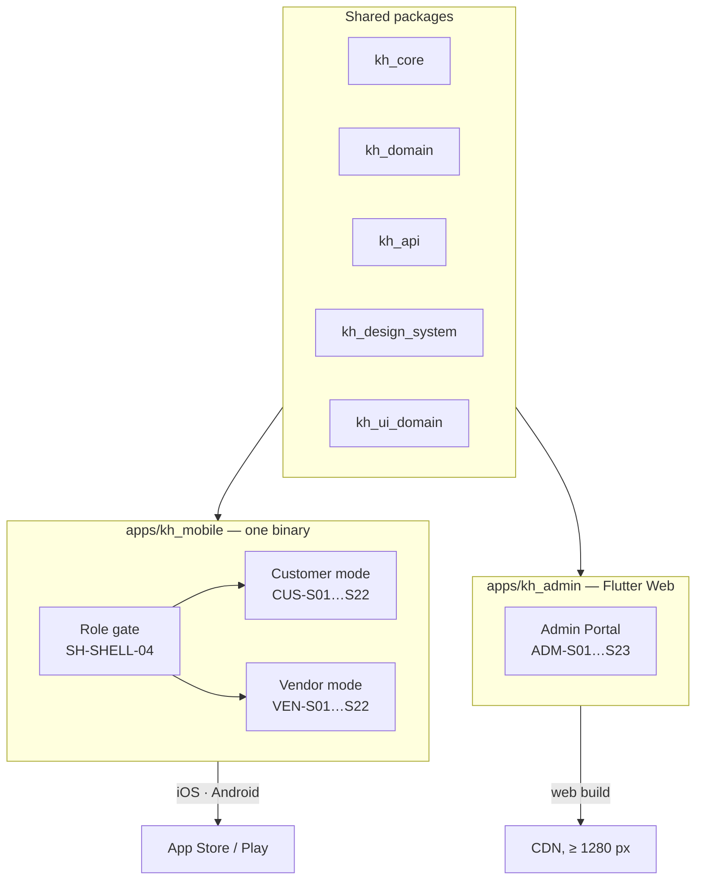
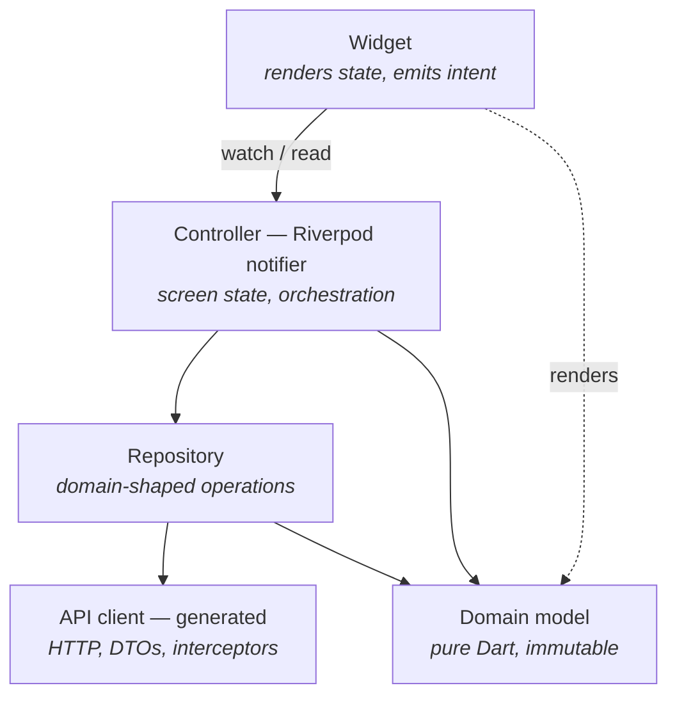
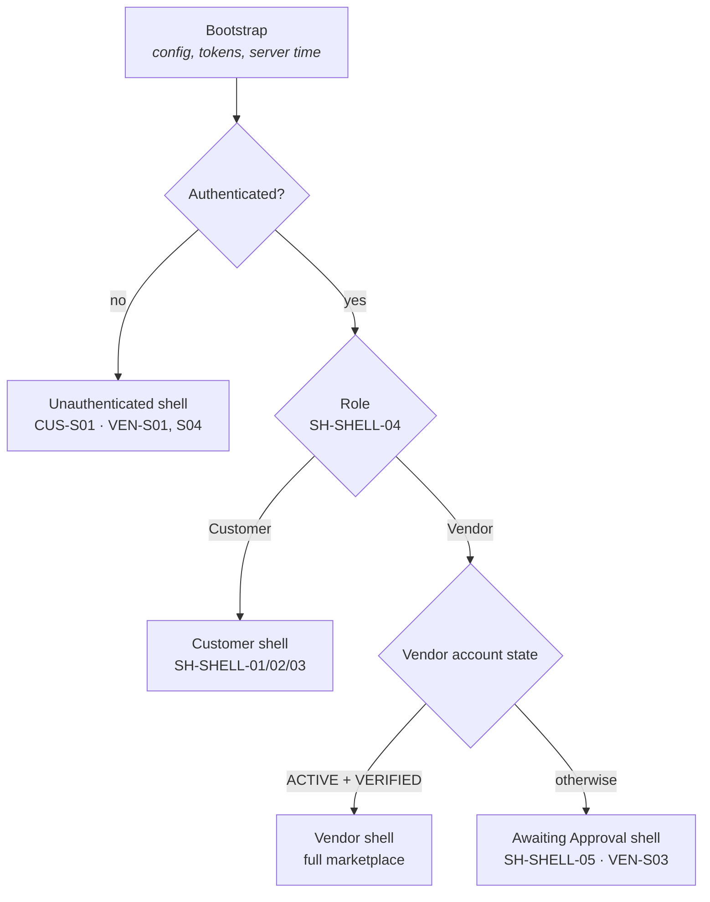

# Karat Hive — Frontend Architecture

| | |
|---|---|
| **Product** | Karat Hive — Digital Jewellery Marketplace |
| **Document** | Software Architecture Document — **Frontend** |
| **Version** | 1.0 |
| **Status** | Draft — for Technical Lead review. Contains `[PROPOSED]` decisions requiring sign-off. |
| **Date** | 10 August 2026 |
| **Companion** | [`docs/Architecture-Backend.md`](Architecture-Backend.md) — server architecture and the API contract |
| **Governs** | The Flutter codebase: dual-mode mobile app (iOS + Android) and the Flutter Web Admin Portal |
| **Source of truth** | [`docs/Requirements-Spec-v1.2.md`](Requirements-Spec-v1.2.md) · [`docs/adr/0006`](adr/0006-flutter-single-codebase-all-surfaces.md) · [`ui-screens/`](../ui-screens/) · [`CONTEXT.md`](../CONTEXT.md) |

---

## Table of Contents

1. [Purpose, Scope and Conventions](#1-purpose-scope-and-conventions)
2. [Architectural Drivers](#2-architectural-drivers)
3. [Decision Register](#3-decision-register)
4. [Surfaces and Build Targets](#4-surfaces-and-build-targets)
5. [Repository and Package Structure](#5-repository-and-package-structure)
6. [Layering and State Management](#6-layering-and-state-management)
7. [Navigation, Shell and Access Gating](#7-navigation-shell-and-access-gating)
8. [Design System](#8-design-system)
9. [Data Layer](#9-data-layer)
10. [Domain Modelling — Masking as a Type](#10-domain-modelling--masking-as-a-type)
11. [Freshness, Time and Countdowns](#11-freshness-time-and-countdowns)
12. [Media Handling](#12-media-handling)
13. [Notifications](#13-notifications)
14. [Localisation and RTL](#14-localisation-and-rtl)
15. [Accessibility](#15-accessibility)
16. [The Admin Portal on Flutter Web](#16-the-admin-portal-on-flutter-web)
17. [Performance](#17-performance)
18. [Client-side Security](#18-client-side-security)
19. [Build, Release and Version Lifecycle](#19-build-release-and-version-lifecycle)
20. [Testing Strategy](#20-testing-strategy)
21. [Open Decisions and Risks](#21-open-decisions-and-risks)
- [Appendix A — Screen → Feature Module Map](#appendix-a--screen--feature-module-map)
- [Appendix B — Requirement → Architecture Traceability](#appendix-b--requirement--architecture-traceability)
- [Appendix C — Revision History and Sign-off](#appendix-c--revision-history-and-sign-off)

---

## 1. Purpose, Scope and Conventions

### 1.1 Purpose

This document describes **how the Karat Hive client applications are built**. It exists to make 67 screens across three user surfaces buildable by several engineers in parallel without the codebase turning into three codebases wearing one repository.

It is written to be sufficient to lay out the repository, fix the state-management and navigation model, define how the client talks to the backend, and settle the questions that Flutter Web raises for the Admin Portal.

### 1.2 Scope

**In scope.** Everything inside the Flutter codebase: package structure, state management, routing, the design system, the API client, offline/freshness policy, localisation, accessibility, build flavours and release.

**Out of scope.** Visual design (owned by UX), server behaviour (companion document), and product requirements (SRS). Field-level screen content lives in [`ui-screens/`](../ui-screens/) and is not repeated here.

### 1.3 Conventions

| Tag | Meaning |
|---|---|
| **`[PROPOSED]`** | An architecture decision made by *this document*. Requires Technical Lead sign-off before it becomes binding. |
| **`[BLOCKED]`** | Cannot be finalised until an external decision lands. Listed in §21. |
| `AD-FE-nn` | Frontend architecture decision identifier — stable, never reused. Registered in §3. |
| `CUS-Snn`, `VEN-Snn`, `ADM-Snn` | Screen identifiers from SRS Appendix C and `ui-screens/`. |
| `SH-*` | Shared component identifiers from [`ui-screens/component-widgets.md`](../ui-screens/component-widgets.md). |

### 1.4 The one-sentence summary

**One Flutter codebase, two applications, three modes** — a dual-mode mobile binary whose mode is decided by account role, and a separate Flutter Web build for Admin, sharing the design system, domain models and API client with the mobile app (`C-10`, `docs/adr/0006`).

---

## 2. Architectural Drivers

### 2.1 Fixed constraints

| ID | Constraint | Consequence for the client |
|---|---|---|
| **C-10** | Flutter is the sole client framework; Admin Portal is a Flutter Web target `[ASSUMED]` | §16 exists entirely because of this, and is the highest-risk section in the document |
| **C-08** | Customer and Vendor ship as **one dual-mode application** | Both modes' code is in every install — §17.2 explains why that cannot be deferred away on mobile |
| **C-05 / BR-006** | Identity masking until Acceptance | §10 — the client models masked and revealed parties as **different types**, so a pre-acceptance screen is structurally incapable of rendering a phone number |
| **C-07** | Requests hard-expire at 48 h | §11 — countdowns are driven by server time, never device time |
| **C-03** | WhatsApp handoff, no in-app messaging | The Talk button builds a deep link and reports the tap; there is no message UI to build |
| **C-13** | Object storage provider undecided | §12 is written against pre-signed URL semantics and is `[BLOCKED]` only on the concrete adapter |

### 2.2 Quality attributes that shape the design

| Driver | Requirement | What it forces |
|---|---|---|
| **Two very different users, one binary** | SRS §2.1, §7.1 | Customer is infrequent and high-intent; Vendor is a working tool wanting density and speed. Shared shell, divergent information architecture — §7 |
| **Cold start ≤ 3 s on a 2020 mid-range Android** | `NFR-006` | Nothing heavy before first frame; deferred feature initialisation; a hard binary-size budget |
| **Full Arabic and RTL, switchable at runtime** | `NFR-022` | Localisation is architectural, not a late pass. No hard-coded strings anywhere, `Directionality` correctness in every custom widget, Arabic font subsetting |
| **WCAG 2.1 AA, keyboard-operable Admin** | `NFR-023` | §15 — on Flutter Web this is a build task with a test gate, not a default |
| **Server is the only authority** | `FR-SYS-003`, SRS §7.5 | The client never filters for security, never computes eligibility, never decides whether an identity is revealed. It renders what it is given |
| **No offline capability in v1** | SRS §2.4 | No local database, no sync engine, no conflict resolution. Explicit connectivity states instead — a deliberate simplification worth defending |
| **6-month API version support** | `NFR-027` | §19.4 — deprecation handling and a forced-upgrade path from day one, because clients cannot be upgraded on demand |

### 2.3 The three client invariants

1. **A masked party's identifying fields cannot be rendered, because they cannot be constructed** (§10).
2. **Every countdown and expiry the user sees is computed from server time**, never from the device clock (§11).
3. **The client never grants itself access.** Route guards mirror server rules for usability, never for security; a bypassed guard must find a 403 waiting for it (§7.3).

---

## 3. Decision Register

| ID | Decision | Status |
|---|---|---|
| `AD-FE-01` | Flutter for all three surfaces; Admin as a Flutter Web target | Fixed (C-10) |
| `AD-FE-02` | **Melos-managed monorepo** — two apps, shared packages | `[PROPOSED]` |
| `AD-FE-03` | **Riverpod** for state management and dependency injection | `[PROPOSED]` |
| `AD-FE-04` | **go_router** with typed routes and declarative guards | `[PROPOSED]` |
| `AD-FE-05` | **freezed + json_serializable** for immutable models and unions | `[PROPOSED]` |
| `AD-FE-06` | API client **generated from the backend's OpenAPI document**, wrapped in hand-written repositories | `[PROPOSED]` |
| `AD-FE-07` | **Masked and revealed parties are distinct sealed types** — not one nullable model | `[PROPOSED]` |
| `AD-FE-08` | Feature-first module structure; layers within a feature, not across the app | `[PROPOSED]` |
| `AD-FE-09` | **No local database in v1.** In-memory cache with explicit invalidation only | `[PROPOSED]` |
| `AD-FE-10` | Freshness by **push-triggered invalidation plus foreground polling**; no WebSocket in v1 | `[PROPOSED]` |
| `AD-FE-11` | Server time offset maintained from `meta.serverTime`; all countdowns derive from it | `[PROPOSED]` |
| `AD-FE-12` | Admin data grid — **build-or-buy decision required before `ADM-S03` starts** | `[BLOCKED]` |
| `AD-FE-13` | Golden tests in both LTR and RTL for every shared component | `[PROPOSED]` |
| `AD-FE-14` | Mobile and Admin ship on independent release trains from one repository | `[PROPOSED]` |

### 3.1 Rationale for the contested ones

**`AD-FE-03` — Riverpod.** It gives dependency injection, asynchronous state with loading and error as first-class states, and testability without a widget tree, in one mechanism. Its `AsyncValue` maps directly onto what nearly every screen here needs: a list with loading, empty (`SH-FND-12`), error (`SH-FND-13`) and data states. Compile-safe provider overrides make widget tests trivial to seed. The alternative is BLoC — more ceremony, more files, and a stronger fit where the client owns complex state machines. Here it does not: the four state machines in SRS §5 are **server-owned**, and the client only ever renders the state it is told. That tips the decision to Riverpod. If the team has deep BLoC experience and none in Riverpod, take BLoC; the layering in §6 is unchanged either way.

**`AD-FE-06` — generated client.** `NFR-030` makes OpenAPI the authoritative integration reference, and the backend already diffs it in CI. Generating from it means a breaking server change fails the client build instead of failing a user. The generated code is wrapped rather than used directly, so generated DTOs never leak into the UI layer and the masking types of §10 stay under our control.

**`AD-FE-07` — masking as a type.** This is the most important decision in this document. The naive model is `Party { name?, mobile?, … }` with nulls before Acceptance, and it fails in the most ordinary way imaginable: someone writes `party.name ?? 'Vendor'` on a pre-acceptance screen and now the UI has a shape for a field it must never have. Making `MaskedParty` and `RevealedParty` distinct types means the pre-acceptance widget takes a `MaskedParty`, which **has no name field to reference**, and the mistake stops being possible rather than being caught in review. The server already enforces this (backend §9); this makes the client structurally agree instead of merely complying.

**`AD-FE-09` — no local database.** SRS §2.4 states no offline transaction capability in v1. A local database would buy list persistence across cold starts, at the cost of a cache-invalidation problem on data whose staleness is commercially dangerous — a 48-hour countdown, an Offer that has already been accepted, a Vendor who has been suspended. Showing a stale Offer as available is worse than showing a spinner. In-memory only, and the connectivity state is shown honestly.

---

## 4. Surfaces and Build Targets

### 4.1 Two applications from one codebase



| Target | Build | Notes |
|---|---|---|
| iOS | `apps/kh_mobile`, iOS 15+ | Dual-mode |
| Android | `apps/kh_mobile`, API 28+ | Dual-mode |
| Admin Web | `apps/kh_admin` | Chrome, Edge, Safari, Firefox — current and previous major; responsive from 1280 px |

### 4.2 Why Admin is a separate app, not a third mode

Three reasons, all practical. Admin is authenticated staff-only software with a completely different information architecture — queues and dense tables rather than cards and flows. Bundling it into the mobile binary would add weight to a build already fighting `NFR-006`'s three-second cold start. And Admin releases on its own cadence: a web deployment ships in minutes, while a mobile release waits on store review (SRS §9.3).

They remain one codebase because they share the domain model, the API client, the design tokens and every domain widget that renders a Request, an Offer or a Connection — which is exactly the benefit `docs/adr/0006` claims for Flutter here.

### 4.3 The dual-mode model

One account has exactly one role (SRS §2.1). There is no in-session mode switch and no dual-role session. On cold start the role gate (`SH-SHELL-04`) reads the authenticated role and hands the app to the correct shell; a session whose role does not match the current shell is redirected, not accommodated.

Mode divergence is expressed as **two shells over shared features**, not as `if (isVendor)` branches inside widgets. Customer mode gets a Customer navigation set and Customer-density layouts; Vendor mode gets a working-tool information hierarchy with the Submit Offer action reachable in at most two taps from the feed (SRS §7.1). Where a widget genuinely serves both — a Request card, an Offer row — it takes an explicit `view: owner | vendor` parameter (`SH-REQ-01`), so the divergence is a documented parameter rather than scattered role checks.

---

## 5. Repository and Package Structure

`AD-FE-02`, `AD-FE-08`.

```
karat-hive-frontend/
├─ melos.yaml
├─ apps/
│  ├─ kh_mobile/                    # dual-mode Customer + Vendor binary
│  │  └─ lib/
│  │     ├─ main_dev.dart · main_staging.dart · main_prod.dart
│  │     ├─ app/                    # shells, role gate, router assembly
│  │     └─ features/
│  │        ├─ auth/                # CUS-S01, VEN-S01…S04
│  │        ├─ request_create/      # CUS-S03…S09
│  │        ├─ request_manage/      # CUS-S02, S10, S17
│  │        ├─ offers_customer/     # CUS-S11…S14
│  │        ├─ request_feed/        # VEN-S05…S08
│  │        ├─ offers_vendor/       # VEN-S09…S11, S14
│  │        ├─ connections/         # CUS-S15, S16 · VEN-S12, S13
│  │        ├─ reviews/             # CUS-S18 · VEN-S19, S20
│  │        ├─ notifications/       # CUS-S19 · VEN-S17
│  │        ├─ profile_settings/    # CUS-S20, S21 · VEN-S15, S16, S18
│  │        ├─ subscription/        # VEN-S22
│  │        └─ abuse/               # CUS-S22 · VEN-S21
│  └─ kh_admin/                     # Flutter Web
│     └─ lib/
│        ├─ app/                    # admin shell, nav, router
│        └─ features/
│           ├─ auth/                # ADM-S01, S23
│           ├─ dashboard/           # ADM-S02
│           ├─ customers/ vendors/ verification/
│           ├─ requests/ offers/ connections/
│           ├─ taxonomy/ moderation/ abuse/
│           ├─ reports/ announcements/
│           └─ settings/ gold_rate/ audit/
├─ packages/
│  ├─ kh_core/                      # Result, failures, logging, env, extensions
│  ├─ kh_domain/                    # entities, value objects, masking types, enums
│  ├─ kh_api/                       # generated OpenAPI client + interceptors + envelope
│  ├─ kh_design_system/             # tokens, theme, SH-FND-*, SH-SHELL-*, RTL primitives
│  ├─ kh_ui_domain/                 # SH-REQ-*, SH-OFF-*, SH-CON-*, SH-ID-*, SH-DOM-*
│  └─ kh_l10n/                      # ARB files, generated delegates, formatters
└─ tooling/                         # codegen scripts, golden runners, CI helpers
```

### 5.1 Structure inside a feature

Every feature folder has the same five subfolders, so an engineer opening an unfamiliar feature knows where everything is:

```
features/offers_customer/
├─ presentation/     # screens and widgets — no business logic, no HTTP
├─ controller/       # Riverpod notifiers; screen state; user intent
├─ repository/       # domain-shaped methods over kh_api
├─ model/            # feature-local view models only; shared models live in kh_domain
└─ routes.dart       # this feature's routes, mounted by the app router
```

### 5.2 Dependency rules

1. `apps/*` may depend on any package. Packages **never** depend on apps.
2. `kh_mobile` and `kh_admin` never import each other. A widget both need moves down into `kh_ui_domain`.
3. `kh_design_system` knows nothing about the domain — it renders buttons and fields, not Offers. Anything domain-aware belongs in `kh_ui_domain`.
4. `kh_domain` is pure Dart: no Flutter import, no HTTP, no `BuildContext`. This keeps it unit-testable and stops UI concerns from leaking into the model.
5. `presentation` never talks to `kh_api` directly. It goes through `controller` → `repository`.

Rules 3 and 4 are what keep the design system reusable and the domain testable; they are enforced by lint, not by good intentions.

---

## 6. Layering and State Management

### 6.1 Layers



| Layer | Responsibility | Must not |
|---|---|---|
| **Widget** | Render state; emit intent; local ephemeral UI state only (scroll, focus, animation) | Call a repository, hold business state, format money or dates itself |
| **Controller** | Own screen state as `AsyncValue`; sequence calls; map failures to user-facing messages | Contain HTTP or JSON |
| **Repository** | Expose domain operations (`submitOffer`, `acceptOffer`); map DTO → domain; own the cache policy | Know about widgets |
| **API client** | Transport, serialisation, auth, retry, idempotency headers | Contain product rules |
| **Domain model** | Immutable data, value objects, formatting-free invariants | Perform I/O |

### 6.2 State categories

Not all state is the same, and conflating the four is how Flutter apps become unmaintainable:

| Category | Examples | Mechanism | Lifetime |
|---|---|---|---|
| **Ephemeral UI** | Scroll offset, expanded panel, focus | `StatefulWidget` | The widget |
| **Screen state** | List page, filter selection, form draft | Autodisposing Riverpod notifier | The route |
| **Session state** | Auth tokens, role, locale, server-time offset | Keep-alive Riverpod provider | The session |
| **Server cache** | Requests, Offers, Connections, taxonomy, gold rate | Riverpod async providers with explicit invalidation (§9.5) | Until invalidated |

**Form state deserves specific mention.** The Request creation flow (`CUS-S03`…`CUS-S09`) is a multi-screen wizard, and the SRS gives it a two-minute completion target for a returning user (SRS §7.1) plus a draft-save requirement (`FR-CUS-015`). Its state therefore lives in a controller scoped to the **flow**, not to any one screen, so back-navigation never loses input, and it is persisted to the draft endpoint on step transitions.

### 6.3 Error handling

Every repository returns `Result<T, Failure>` rather than throwing. Failures are a sealed union — `Network`, `Timeout`, `Unauthorised`, `Forbidden`, `NotFound`, `Conflict`, `Validation`, `RateLimited`, `Server`, `Maintenance` — mapped from the backend's error envelope (backend §13.2).

**The client does not compose error prose.** `NFR-024` requires messages that state what went wrong and what to do about it, in the user's language, and the server already returns that string localised. The client shows it. It supplies its own copy only for failures the server cannot report on — no connectivity, timeout — and never surfaces an internal identifier or a raw code to a user.

Presentation is by severity: inline field errors for validation (`SH-FND-13`), a snackbar for transient recoverable failures (`SH-FND-17`), a full-screen state for a failed initial load with a retry, and a dedicated maintenance screen for a 503.

---

## 7. Navigation, Shell and Access Gating

`AD-FE-04`.

### 7.1 Router structure

One `go_router` per app, assembled from per-feature route files (§5.1). Routes are typed, so navigation arguments are compile-checked and a screen cannot be pushed without its required identifiers.

URLs are meaningful in both apps — mandatory for Admin (§16.3), and useful on mobile for notification deep links (§13.3).

### 7.2 Mobile shell hierarchy



The Awaiting Approval shell is a **separate shell, not a disabled state of the Vendor shell** (`C-04`, `BR-002`, `FR-VEN-003`). A non-`ACTIVE` Vendor's router simply has no marketplace routes mounted, so there is no navigation path, no cached feed and no dashboard data to leak. Building it as a permission flag inside the full shell would leave every one of those one bug away from being visible.

### 7.3 Route guards — usability, never security

Guards mirror server rules so users see a sensible screen instead of a rejection: unauthenticated → login; wrong role → correct shell; non-`ACTIVE` Vendor → approval shell; unbound OAuth → the publish gate (`SH-AUTH-05`).

**They are not a security boundary.** The server re-evaluates every rule (`FR-SYS-003`), and a bypassed guard must find a 403 waiting for it. The client's job is to avoid dead ends, not to enforce policy — invariant 3 of §2.3.

The OAuth gate is worth stating precisely because it is unusual: OAuth is not required to sign in or to browse. It gates exactly one action — publishing a Request (`BR-001`, `FR-CUS-014`). So the guard sits on the publish action inside `CUS-S09`, presented as a banner (`SH-AUTH-05`), not on the create flow's entry. Gating the whole flow would be a materially worse product and would not match the requirement.

### 7.4 Admin shell

Persistent left navigation, breadcrumb, and a content area that is fully URL-addressable (§16.3). Every queue screen (`ADM-S07`, `ADM-S16`, `ADM-S21`) uses a **list-detail-within-context** layout: opening an item must not lose the queue, because SRS §7.1 requires keyboard-driven review without leaving the queue context. That is a layout decision with a keyboard-navigation consequence, so it is fixed here rather than left to each screen.

### 7.5 Deep links

Three sources: notification taps (§13.3), WhatsApp return (the OS simply returns to the app — there is no callback, SRS §7.2), and Admin URLs. Every deep link resolves through the same guard chain as ordinary navigation — a notification about a Request the user may no longer access lands on an explanatory screen, never a broken one.

---

## 8. Design System

`kh_design_system` implements the shared catalogue in [`ui-screens/component-widgets.md`](../ui-screens/component-widgets.md). That document is the inventory; this section is the construction rule.

### 8.1 Tokens

No raw values in feature code. Colour, spacing, radius, elevation, motion and typography come from a token set exposed through a `ThemeExtension`, so a widget reads `context.tokens.spacing.md`, never `16.0`. This is what makes a later visual redesign a token change rather than a repository-wide search.

### 8.2 Structure

| Tier | Contents | Package |
|---|---|---|
| **Foundations** | `SH-FND-01`…`SH-FND-26` — buttons, fields, chips, dialogs, empty and error states, skeletons, tabs, pagination sentinel | `kh_design_system` |
| **Shell** | `SH-SHELL-01`…`SH-SHELL-07` — app shell, app bar, bottom nav, role gate, approval shell, pull-to-refresh, keyboard-avoiding layout | `kh_design_system` |
| **Domain chrome** | `SH-DOM-01`…`SH-DOM-09` — gold rate strip, indicative valuation, AED money, gram weight, purity picker, expiry countdown, relative time, reference chip | `kh_ui_domain` |
| **Domain cards** | `SH-REQ-*`, `SH-OFF-*`, `SH-CON-*`, `SH-ID-*` — Request, Offer, Connection, identity and rating widgets | `kh_ui_domain` |

### 8.3 Rules for shared components

1. **No `BuildContext`-derived business decisions.** A component receives what it renders. It does not look up the current user's role and decide.
2. **RTL-correct by construction.** Directional insets and alignments only — `EdgeInsetsDirectional`, `AlignmentDirectional`; never `left`/`right`. Every component has a golden test in both directions (`AD-FE-13`).
3. **Every component is `Semantics`-annotated at the point it is built** (§15). Retrofitting semantics across 60 components is a project; doing it inline is a habit.
4. **Domain formatting lives in one place.** AED (`SH-DOM-03`), grams (`SH-DOM-05`), karat and fineness (`SH-DOM-06`), relative time (`SH-DOM-08`) each have exactly one formatter in `kh_l10n`. Money is never formatted with string interpolation anywhere in the codebase.

### 8.4 Two components carrying disproportionate weight

**`SH-DOM-07` — the expiry countdown.** It appears on Request cards, Request detail, Offer rows and Offer detail, with urgency styling under 24 h and under 6 h, and it is the visible face of the 48-hour hard expiry (C-07). It ticks from the server-time offset (§11), never the device clock, and it announces changes to screen readers politely rather than on every tick — an accessibility detail that is invisible until someone actually uses VoiceOver on it.

**`SH-ID-01` / `SH-ID-02` — masked and revealed party.** These are the visual expression of `BR-006`. They take `MaskedParty` and `RevealedParty` respectively (§10), which is why they cannot be misused: `SH-ID-01` has no name or mobile to render.

---

## 9. Data Layer

### 9.1 Client generation and wrapping

`AD-FE-06`. `kh_api` holds the generated OpenAPI client plus the transport concerns. Repositories wrap it and expose domain-shaped methods. Generated DTOs never cross into `controller` or `presentation`; the repository maps them to `kh_domain` types (§10). One consequence worth accepting deliberately: a server field rename that is not breaking for the server still breaks the client build. That is the point.

### 9.2 The interceptor chain

| Order | Interceptor | Behaviour |
|---|---|---|
| 1 | Correlation | Attaches a request id; joins the server's trace (backend `NFR-025`) |
| 2 | Auth | Attaches the bearer token; refreshes on 401 (§9.3) |
| 3 | Locale | `Accept-Language` from the user's preference, so server-localised errors and notifications arrive correct (`NFR-022`) |
| 4 | Idempotency | Generates and **persists** an `Idempotency-Key` per mutating operation (§9.4) |
| 5 | API version | Sends the client's contract version; reads `Deprecation` / `Sunset` (§19.4) |
| 6 | Retry | Idempotent GETs only, exponential backoff, network and 5xx only — **never** a mutating call without a stored key |
| 7 | Server time | Reads `meta.serverTime` and updates the offset (§11) |
| 8 | Error mapping | Envelope → sealed `Failure` (§6.3) |

### 9.3 Token refresh

Access tokens are short-lived and refresh tokens rotate and are single-use (backend §14.2). A naive client fires several refreshes when three parallel requests 401 simultaneously, and rotation turns that into a reuse detection that logs the user out — a self-inflicted logout that is maddening to debug.

The refresh interceptor therefore holds a **single-flight refresh**: the first 401 starts a refresh, subsequent 401s queue on the same future, and all requests replay once with the new token. If refresh fails, the session is cleared once and the user is routed to sign-in with a message — not a silent failure loop.

### 9.4 Idempotency

The backend requires `Idempotency-Key` on mutating endpoints and mandates it for Offer submission and Acceptance (backend §13.3). The client generates the key **when the user's intent is formed**, not when the HTTP call is made, and persists it for the operation's lifetime. That way a retry after a timeout — the exact case that matters — reuses the key rather than minting a new one and creating a duplicate.

Acceptance (`CUS-S14`) is the critical instance: irreversible (`BR-013`), with an explicit confirmation stating the consequence (`NFR-024`). The confirm button is disabled for the duration of the call, the key is stored before the request, and a timeout offers "check status" rather than "try again" — because retrying an acceptance whose result is unknown is precisely what idempotency exists to make safe, and the UI should not encourage a second guess.

### 9.5 Caching and invalidation

`AD-FE-09`. In-memory only, per provider, with three invalidation triggers: an explicit user refresh (`SH-SHELL-06` pull-to-refresh), a mutation that touches the data, and a push notification that says the data changed (§13.2).

| Data | Policy |
|---|---|
| Taxonomy — Categories, Regions | Long-lived; refreshed on app foreground |
| Platform settings, purity factors | Long-lived; refreshed on foreground |
| Gold rate (`SH-DOM-01`) | Short-lived; visibly marked stale past the configured threshold rather than silently reused (`FR-CUS-018`) |
| Request feed, Offer lists | Never cached across app launches; refreshed on foreground and on push (§11.3) |
| Connection detail with revealed identity | Cached for the session only, never persisted to disk (§18.2) |

**Nothing containing personal data is written to disk.** That is a security position (§18.2) as much as a caching one.

### 9.6 Pagination

Cursor-based, matching the backend (backend §13.4). One shared `PagedListController` handles page requests, appending, the end sentinel (`SH-FND-25`), retry-on-page-failure without losing loaded pages, and refresh-resets-cursor. Written once, used by every list in all three surfaces — which matters, since roughly half the 67 screens are lists.

---

## 10. Domain Modelling — Masking as a Type

`AD-FE-07`. The most consequential decision here.

### 10.1 The model

```dart
sealed class Party {}

/// Everything visible before Acceptance. Has no identity fields at all.
class MaskedParty extends Party {
  final PartyRole role;          // Customer | Vendor
  final String pseudonym;        // "Vendor in Deira"
  final Region region;
  final RatingSummary? rating;   // SH-ID-03
  final int completedConnections;// SH-ID-07
}

/// Constructible only from a payload that included identity —
/// i.e. only from a Connection the viewer is party to.
class RevealedParty extends Party {
  final String displayName;
  final PhoneNumber mobile;      // value object — normalised, wa.me-safe
  final Address? address;
  final BusinessDetails? business; // Vendor only
  final RatingSummary? rating;
}
```

`SH-ID-01` accepts `MaskedParty`. `SH-ID-02` accepts `RevealedParty`. A pre-acceptance screen holds a `MaskedParty` and therefore has no `mobile` to render — the mistake is unrepresentable rather than merely forbidden.

### 10.2 Where the boundary is enforced

The repository decides the type, from the payload the server actually sent. If identity fields are absent — which is exactly what the server guarantees pre-acceptance (`NFR-013`, backend §9) — a `MaskedParty` is constructed. There is no client-side "am I allowed to see this?" logic to get wrong, because the server has already answered by what it did and did not send.

`BR-007` — reveal is scoped to the Connection that produced it — follows naturally: a `RevealedParty` is only ever reachable through a Connection object, so there is no global "known identities" store to consult from an unrelated screen.

### 10.3 Value objects

`kh_domain` models the domain vocabulary of `CONTEXT.md` as types, not primitives:

| Type | Why it is not a primitive |
|---|---|
| `Money` | AED-tagged, integer minor units — no floating-point currency arithmetic (C-01, `BR-021`) |
| `Weight` | Grams, 2–3 dp, with validated bounds (C-02) |
| `Purity` | 24K / 22K / 21K / 18K with fineness mapping (999 / 916 / 875 / 750) |
| `PhoneNumber` | Normalised at construction to the `wa.me` form — international, digits only, no `+`, no leading zeros. SRS §7.2 makes a malformed number a silent dead end, so it must be impossible to hold an unvalidated one |
| `RequestReference` | `KH-RQ-…`, copyable (`SH-DOM-09`) |
| State enums | Mirror the server's four state machines exactly (SRS §5). Unknown values from a newer server are parsed into an explicit `unknown` case and rendered neutrally rather than crashing — required by the 6-month version overlap (`NFR-027`) |

That last row is a small decision with a large payoff: during the version overlap window an old client **will** meet states it has never heard of, and an exhaustive `switch` that throws would turn a server feature launch into a client crash wave.

---

## 11. Freshness, Time and Countdowns

### 11.1 Server time is the only time

`AD-FE-11`. Every response carries `meta.serverTime` (backend §13.2). The client maintains a rolling offset and derives every countdown, expiry and "time remaining" from it. Device time is used for nothing user-visible.

This is not pedantry. The 48-hour Request expiry (C-07) and Offer validity are commercially and contractually meaningful; a device 20 minutes fast would show a Vendor that a Request is closed while it is still accepting Offers, and both parties would be right about what they saw. `SH-DOM-07` therefore consumes the offset, never `DateTime.now()` directly — a lint rule bans bare `DateTime.now()` outside `kh_core`'s clock.

### 11.2 Timers

One shared ticker drives every visible countdown, rather than a timer per widget. Sixty Offer rows each running their own second-timer is measurable battery and jank on the mid-range device `NFR-006` targets. The ticker pauses in background and resyncs on foreground.

### 11.3 Freshness without WebSockets

`AD-FE-10`. `NFR-003` requires list views to reflect server state within 30 seconds of a change, and immediately on explicit refresh. Three mechanisms, no persistent socket:

| Trigger | Behaviour |
|---|---|
| **Push notification** | Data-carrying pushes invalidate the affected providers, so a new Offer refreshes the Offers list if it is on screen (§13.2) |
| **Foreground polling** | Only the visible screen polls, at a screen-appropriate interval — the Vendor feed and a Customer's Offers list are the aggressive ones, everything else is not |
| **Lifecycle** | Foreground resume triggers refresh plus a server-time resync |

A WebSocket would be a better fit for the Vendor feed specifically. It is out of v1 because it adds a stateful connection to a backend whose instances are deliberately stateless (`NFR-009`, C-11), and because push plus polling meets the stated 30-second requirement. If Vendor responsiveness proves to be the competitive lever the SRS says it is (SRS §3.2), this is the first thing to revisit in v1.1.

---

## 12. Media Handling

`FR-CUS-007`, `FR-VEN-002`, `NFR-005`. `[BLOCKED]` on C-13 for the concrete provider only; the flow is provider-agnostic.

```mermaid
sequenceDiagram
    participant U as User
    participant App as Client
    participant API as Backend
    participant OS as Object storage

    U->>App: Pick or capture image (SH-MED-01)
    App->>App: Validate type and size · downscale · re-encode
    App->>API: POST /v1/media/upload-intent
    API-->>App: pre-signed PUT URL + object key
    App->>OS: PUT bytes — progress (SH-MED-05), resumable retry
    App->>API: POST /v1/media/{key}/complete
    API-->>App: PENDING_PROCESSING
    App->>App: Show pending thumbnail; poll or await push for READY
```

**Client-side downscaling before upload is mandatory, not an optimisation.** `NFR-005` gives 15 seconds for a 5 MB photograph over 4G with visible progress and resumable retry; a modern phone camera produces files well past that, and uploading originals would miss the target on the first attempt. Downscale to the maximum useful display dimension, re-encode, then upload.

The client strips no metadata and trusts no local processing — EXIF stripping, content-type inspection and malware scanning are all server-side (`FR-SYS-009`), because a client-side guarantee is not a guarantee.

Upload state survives navigation: a user who backgrounds the app mid-upload during Request creation returns to a flow that is still uploading, not one that has silently reset. Failures are per-file with per-file retry (`SH-MED-05`), never an all-or-nothing batch.

KYC upload (`VEN-S02`, `SH-MED-04`) uses the same pipeline against a different bucket and policy, adds document type and expiry date, and never renders an uploaded KYC document back to the Vendor at full resolution — only Admins view them (`NFR-015`).

---

## 13. Notifications

### 13.1 Token lifecycle

Register for push after sign-in, not at first launch — asking for permission before the user knows what the app does costs a permanent denial. Register the token against the session, refresh it on rotation, and **de-register on sign-out**, so a shared device does not deliver one user's Offers to the next.

### 13.2 In-app centre is the source of truth

`FR-SYS-008.6`: every notification is persisted server-side regardless of push outcome. The in-app centre (`CUS-S19`, `VEN-S17`) reads that list. A push is a hint that something happened, never the record that it happened — so a user with notifications disabled loses timeliness, never information.

Data-carrying pushes invalidate the relevant providers (§11.3), which is what makes "an Offer arrived while I was looking at the list" work without polling aggressively.

### 13.3 Deep-link payload contract

Every notification carries a target type and identifier. The client resolves it through the normal guard chain (§7.5) — three states from cold start (unauthenticated, wrong role, no longer permitted) all have to land somewhere sensible. Payloads are treated as untrusted routing input: the target is validated against a known route table, and identifiers are never interpolated into a request without validation.

### 13.4 Preferences and quiet hours

Displayed and edited on the client (`FR-CUS-034`, `FR-VEN-027`); **evaluated server-side at dispatch time** (`FR-SYS-008.2`, backend §15.1). The client never suppresses a delivered notification locally — critical notifications are always delivered by design, and a client-side filter would break that contract invisibly.

---

## 14. Localisation and RTL

`NFR-022`. English and Arabic, full RTL, switchable at runtime without reinstall or logout.

`AD-FE-05` and `kh_l10n`: ARB files, generated delegates, no hard-coded user-facing string anywhere — enforced by a lint rule, because this rule is broken accidentally and constantly otherwise.

| Concern | Approach |
|---|---|
| Layout direction | `Directionality` from the locale; directional insets and alignments only (§8.3) |
| Runtime switch | Locale is session state (§6.2); changing it rebuilds the tree and updates `Accept-Language` so server-rendered strings follow (`NFR-024`) |
| Numerals | Arabic-Indic numeral preference honoured in every formatter, including countdowns and money |
| Dates | Gregorian with Hijri alongside where culturally appropriate; GST display from UTC (`BR-021`) |
| Money | `SH-DOM-03` formatter — AED placement and separators differ by locale |
| Fonts | Arabic and Latin faces bundled and **subsetted**. On Flutter Web this is a payload issue, not just a typography one (§17.3) |
| Pluralisation and gender | ICU messages in ARB, not string concatenation |
| Screen-reader language | Semantics labels localised too — an Arabic UI read aloud in English is a failure of `NFR-023`, not a rough edge |

**Every shared component has a golden test in both directions** (`AD-FE-13`). RTL bugs are overwhelmingly layout bugs — a mirrored chevron, a stranded badge, a clipped countdown — and they are invisible to anyone testing in English.

---

## 15. Accessibility

`NFR-023`. WCAG 2.1 AA. Mobile and Admin have genuinely different difficulty levels here, and the document says so plainly.

### 15.1 Mobile

Well-trodden ground: 4.5:1 contrast, `Semantics` on every interactive and informational widget, VoiceOver and TalkBack tested on the critical paths, 44×44 pt minimum targets, and dynamic type to 200 % without layout breakage — which means no fixed-height rows anywhere in the design system, since that is how 200 % type breaks.

Live regions are used sparingly and deliberately: an arriving Offer and an expiry crossing a threshold are announced; a ticking countdown is not (§8.4).

### 15.2 Admin on Flutter Web — the hard part

Flutter Web renders to a canvas rather than DOM. Nothing in §15.1 is free here, and three specific requirements of `NFR-023` and SRS §7.1 need explicit engineering:

| Requirement | Why it is not free | Approach |
|---|---|---|
| **Full keyboard operability** | Canvas has no native tab order | Explicit `FocusTraversalGroup` and focus order per screen; `Shortcuts`/`Actions` for queue verbs (approve, reject, next); every action reachable without a mouse |
| **Visible focus order** | No browser-default focus ring | Focus indicators are a design-system token, applied by every foundation component, tested |
| **Browser text selection on all tabular data** | Canvas text is not selectable by default | `SelectionArea` around every table and detail pane, verified by test — Admins copy references, licence numbers and phone numbers all day, and losing that would make the portal hostile |
| **Screen-reader semantics** | Accessibility is a rendered semantics tree, not DOM | An assistive-technology pass is a **release gate**, not a review item (`NFR-023` states this explicitly) |

This is the concrete cost that `docs/adr/0006` predicted and accepted. It is budgeted engineering work, not a surprise — but it is work, and it must appear in the plan for `ADM-S03`…`ADM-S12` rather than being discovered during the accessibility audit.

---

## 16. The Admin Portal on Flutter Web

The riskiest part of the client stack (SRS §7.1, `docs/adr/0006`). Twenty-three screens of dense-table, keyboard-driven, copy-paste-heavy queue work on a canvas renderer.

### 16.1 The data grid decision — `AD-FE-12` `[BLOCKED]`

Flutter has no first-party data grid. Fourteen Admin screens need one: sortable and filterable columns, sticky headers, column sizing, row selection, keyboard row navigation, cell text selection, and virtualisation at the volumes of `NFR-008` (2 M Requests, 10 M Offers).

| Option | For | Against |
|---|---|---|
| **Buy** — a commercial or mature open-source Flutter data grid | Fast; features exist on day one | Licence cost and legal review; a third-party dependency at the heart of the internal tool; its own accessibility gaps to audit |
| **Build** — one internal `KhDataTable` over `TwoDimensionalScrollView` | Full control of semantics, focus and selection; no licence | Weeks of work before `ADM-S03` can ship; virtualisation and column sizing are genuinely fiddly |

**Recommendation: buy, then wrap.** Whichever way it goes, every Admin screen consumes an internal `KhDataTable` facade, never the third-party widget directly — so a licence problem or an accessibility dead end is a swap behind one interface instead of fourteen rewrites. **The decision must be made before `ADM-S03` starts**, because it determines the shape of every list screen after it.

### 16.2 Renderer and payload

Recent Flutter releases render web through CanvasKit or the WebAssembly (skwasm) renderer; the legacy HTML renderer has been removed, so canvas rendering is **not opt-out-able** — confirm the exact options against the pinned SDK at project setup. Consequences to plan for:

- A meaningful initial download before first paint (engine, fonts, app). Acceptable for an authenticated internal tool used by single-digit staff (SRS §2.3); it would not be acceptable for a public site.
- Bundled Arabic and Latin fonts add to it — subsetting is required (§14).
- Deferred imports work on web, so rarely used Admin areas (reports, audit log, announcements) load on demand.
- No SEO, no server-side rendering. Irrelevant here: nothing in the Admin Portal is public.

### 16.3 URL addressability

Admins share links — "look at this vendor", "here is the queue I mean". Every Admin screen is deep-linkable, and **list state lives in the URL**: filters, sort, page cursor and selected id. This has to be designed in from the first list screen; retrofitting it across fourteen screens is a rewrite, and Flutter Web makes it easy to build screens where the browser back button does something surprising instead.

### 16.4 Session and desktop expectations

2FA at sign-in (`FR-ADM-001`); idle timeout shorter than mobile's, with a warning before it fires; browser refresh restores the current view from the URL and never loses a queue position; multiple tabs work independently. Desktop conventions the canvas does not provide by default — right-click context menus where they add value, `Esc` to close a dialog, `Enter` to confirm, `Ctrl/Cmd+F` handled or explicitly replaced by an in-app find, since browser find-in-page will not work on canvas-rendered content.

That last one is worth naming: Admins **will** press Ctrl+F, and nothing will happen. An in-app search affordance on every list screen is the mitigation.

---

## 17. Performance

### 17.1 Budgets

| Metric | Target | Source |
|---|---|---|
| Cold start → interactive first screen | ≤ 3 s on 2020 mid-range Android, 4 GB RAM | `NFR-006` |
| First page of any list | ≤ 1 s at production volumes | `NFR-002` |
| 5 MB image upload on 4G | ≤ 15 s with progress | `NFR-005` |
| Frame budget | 60 fps scrolling on the Vendor feed and Offer lists | Implied by `NFR-006` |
| Android release APK | Budget set at project setup and enforced in CI | — |

### 17.2 Cold start, and the dual-mode cost

`NFR-006` is the tightest client budget, and C-08 works against it: one binary carries Customer and Vendor code, and the user only ever needs one.

**Deferred loading does not solve this on mobile.** Dart's `deferred as` splits code on web; on iOS it is effectively a no-op, and on Android it requires Play Feature Delivery with real packaging complexity. Plan on the whole binary being present, and buy the budget elsewhere:

- Nothing heavy before the first frame — no analytics init, no font preloading, no eager provider construction. Bootstrap loads configuration, restores tokens, and renders.
- The role gate decides early and only the chosen shell's providers initialise.
- Assets are audited and compressed; unreferenced assets fail CI.
- Startup is measured on the target device class in CI, not on the newest phone in the office — the two numbers differ by enough to hide a regression for months.

### 17.3 Lists

Every list is lazily built and virtualised; fixed extents where possible so scrolling does not measure. Images use a bounded memory cache with explicit decode sizing — decoding a 4000 px photograph into a 120 px thumbnail slot is the standard way Flutter list scrolling dies. Skeletons (`SH-FND-14`) rather than spinners on first load, so the layout does not jump.

### 17.4 Web specifics

Deferred imports for rarely used Admin areas (§16.2); subsetted fonts; long-cache immutable build assets behind the CDN with a versioned entry point; and a **measured** initial-load budget for the Admin build, tracked in CI so it does not drift upward release by release.

---

## 18. Client-side Security

### 18.1 Token storage

Access and refresh tokens in platform secure storage — Keychain on iOS, EncryptedSharedPreferences / Keystore on Android. Never in plain preferences, never in a file, never logged.

**Web is different and the difference should be stated, not glossed.** Browser storage is reachable by any script that executes on the page, so the Admin build minimises what it holds: short-lived access token in memory only, refresh handled such that a page reload re-authenticates rather than resurrecting a long-lived credential from storage. Combined with 2FA (`FR-ADM-001`) and a short idle timeout (§16.4), this keeps the highest-privilege surface the least persistent one.

### 18.2 Data at rest on the device

Nothing containing personal data is persisted. No local database (`AD-FE-09`), no cached revealed identities on disk, no images written outside the platform cache. Logs never contain personal data or tokens — the logger's serialiser masks them, so an incidental object dump cannot leak.

Screens showing revealed identity (`CUS-S15`, `VEN-S13`) and KYC documents (`ADM-S07`) are excluded from OS app-switcher snapshots and, where the platform allows, from screenshots. This is a reasonable-effort control, not a guarantee — a photograph of a screen defeats it — but it is the difference between deliberate and careless.

### 18.3 Transport

TLS 1.2+ enforced (`NFR-018`). Certificate pinning is `[PROPOSED]` and deliberately left open: it raises the bar against interception but creates a hard outage if a certificate rotates unexpectedly. If adopted, it needs pin rotation shipped ahead of use and a remote kill switch — otherwise it is a self-inflicted outage waiting for a certificate renewal.

### 18.4 What the client does not do

It does not enforce masking (the server does — §10.2), does not decide Vendor eligibility, does not compute whether an Offer may still be accepted, and does not hold any secret beyond the user's own session tokens. There is no API key, no signing secret and no third-party credential in the bundle — anything shipped to a device is public, and the architecture assumes an attacker has read every line of it.

---

## 19. Build, Release and Version Lifecycle

### 19.1 Flavours

Three per app — `dev`, `staging`, `prod` — differing in API base URL, logging verbosity, analytics target and app identifier, so all three can be installed side by side. Configuration is compile-time via `--dart-define-from-file`; no secrets, because there are none to hide (§18.4).

### 19.2 CI pipeline

Analyse (strict lints, including the no-hard-coded-strings, no-`DateTime.now()` and directional-insets rules) → unit tests → widget tests → golden tests LTR **and** RTL → build all targets → size and startup budget checks → integration tests on the critical paths → upload artefacts.

The critical paths that always run end to end: Customer publish → Vendor offer → Customer accept → identity reveal → Talk link constructed. That single flow exercises the product's entire value loop (SRS §2.2), and if it is green the app fundamentally works.

### 19.3 Release trains

`AD-FE-14`. Mobile releases through the stores, with a phased rollout and a staged release; Admin deploys continuously to the CDN. One repository, two cadences — which is exactly why Admin is a separate app (§4.2). Mobile cannot be hot-fixed, so anything shippable as an Admin-side change should be.

### 19.4 API version handling and forced upgrade

`NFR-027` gives a deprecated API version at least six months of support because mobile clients cannot be force-upgraded instantly. The client's obligations:

1. Send its contract version on every request (§9.2).
2. Read `Deprecation` and `Sunset` headers and surface a **soft** upgrade prompt as the sunset approaches — dismissible, repeated, escalating.
3. Handle a hard 426 with a blocking upgrade screen, for the case where a version really has been retired. Building this on day one costs an afternoon; retrofitting it means the clients that need it most are precisely the ones that cannot receive it.
4. Tolerate unknown enum values gracefully (§10.3) rather than crashing on a state a newer server introduced.

---

## 20. Testing Strategy

| Level | Scope | Notes |
|---|---|---|
| Unit | `kh_domain` — value objects, formatters, state parsing, masking type construction | Pure Dart, fast, no Flutter |
| Controller | Riverpod notifiers with overridden repositories | Asserts loading, empty, error and data transitions per screen |
| Widget | Screens against seeded providers | Every empty (`SH-FND-12`) and error (`SH-FND-13`) state has a test, because those are the states nobody demos and everybody ships broken |
| **Golden** | Every shared component, **LTR and RTL**, light and dark, default and 200 % text scale | `AD-FE-13`; the only practical defence against RTL and dynamic-type regressions |
| Integration | The value-loop path (§19.2), plus auth, upload and the Vendor feed | On device and in the web build |
| Accessibility | Focus order, keyboard operability, text selection, semantics presence | **Release gate for Admin** (`NFR-023`, §15.2) |
| Contract | Generated client compiles against the published OpenAPI; unknown-enum tolerance | Catches server drift at build time (§9.1) |
| Performance | Cold start on target-class device; list scroll frame timing; Admin initial-load size | Budgets from §17.1, enforced in CI |

**A client-side masking test also exists**, even though the server is the enforcement point: it asserts that pre-acceptance screens construct `MaskedParty` and that no widget path renders an identity field from one. It is cheap, and it documents the intent of §10 to the next engineer better than a comment would.

---

## 21. Open Decisions and Risks

### 21.1 Blocking

| # | Item | Blocks | Owner |
|---|---|---|---|
| 1 | **Admin data grid — build or buy** (`AD-FE-12`, §16.1) | `ADM-S03`…`ADM-S12`, `ADM-S17`, `ADM-S22` — fourteen screens. Must be decided before the first Admin list is built | Technical Lead |
| 2 | **Object storage provider** (C-13) | The upload adapter and signed-URL handling in §12. The flow is provider-agnostic, so this blocks integration, not design | Product Owner + Infrastructure |
| 3 | **Is the Admin Portal really Flutter Web?** (C-10 `[ASSUMED]`, `docs/adr/0006`) | If the PO intends a DOM-based Admin app, §16 and most of §15.2 are void and Admin delivery becomes materially lower-risk. Worth asking **before** the data-grid decision, since it makes that decision moot | Product Owner |
| 4 | **Visual design and design tokens** | Token values in §8.1. Structure can proceed on placeholders; final look cannot | UX |

Item 3 is sequenced deliberately: confirming it first could remove item 1 entirely.

### 21.2 Awaiting Technical Lead sign-off

Every `[PROPOSED]` row in §3. The ones worth real discussion: `AD-FE-03` (state management — largely a team-familiarity call), `AD-FE-07` (masking as a type — recommended strongly), `AD-FE-09` (no local database) and `AD-FE-12` (the data grid).

### 21.3 Risks

| Risk | Likelihood | Impact | Response |
|---|---|---|---|
| Flutter Web makes the Admin Portal slow to build and unpleasant to use | **High** | High | §16 in full; the `KhDataTable` facade; the accessibility gate; and an honest early checkpoint after `ADM-S03` — if it is going badly, that is the moment to escalate C-10, not month four |
| Admins hit canvas limitations daily — find-in-page, selection, right-click | High | Medium | `SelectionArea` everywhere; in-app find on every list; desktop shortcuts (§16.4) |
| `NFR-006` cold start missed because both modes ship in one binary | Medium | Medium | §17.2 budget enforced in CI on target-class hardware from the first sprint |
| RTL defects reach production | Medium | Medium | Mandatory bidirectional goldens (`AD-FE-13`); Arabic in the definition of done, not a later pass |
| Push-plus-polling proves too slow for Vendor competitiveness | Medium | Medium | Measure feed latency against `NFR-003`; WebSockets are the v1.1 answer (§11.3) |
| Duplicate acceptance from a retried request | Low | **Severe** | Idempotency key formed at intent (§9.4); disabled confirm; "check status" rather than "retry" on timeout |
| A revealed identity is cached or logged | Low | **Severe** | No disk persistence (§18.2); logger masking; snapshot exclusion on reveal screens |

---

## Appendix A — Screen → Feature Module Map

| Screens | Feature module | App |
|---|---|---|
| `CUS-S01` | `auth` | mobile |
| `CUS-S02`, `S10`, `S17` | `request_manage` | mobile |
| `CUS-S03`–`S09` | `request_create` | mobile |
| `CUS-S11`–`S14` | `offers_customer` | mobile |
| `CUS-S15`, `S16` | `connections` | mobile |
| `CUS-S18` | `reviews` | mobile |
| `CUS-S19` | `notifications` | mobile |
| `CUS-S20`, `S21` | `profile_settings` | mobile |
| `CUS-S22` | `abuse` | mobile |
| `VEN-S01`–`S04` | `auth` | mobile |
| `VEN-S05`–`S08` | `request_feed` | mobile |
| `VEN-S09`–`S11`, `S14` | `offers_vendor` | mobile |
| `VEN-S12`, `S13` | `connections` | mobile |
| `VEN-S15`, `S16`, `S18` | `profile_settings` | mobile |
| `VEN-S17` | `notifications` | mobile |
| `VEN-S19`, `S20` | `reviews` | mobile |
| `VEN-S21` | `abuse` | mobile |
| `VEN-S22` | `subscription` | mobile |
| `ADM-S01`, `S23` | `auth` | admin |
| `ADM-S02` | `dashboard` | admin |
| `ADM-S03`, `S04` | `customers` | admin |
| `ADM-S05`, `S06` | `vendors` | admin |
| `ADM-S07` | `verification` | admin |
| `ADM-S08`, `S09` | `requests` | admin |
| `ADM-S10`, `S11` | `offers` | admin |
| `ADM-S12`, `S13` | `connections` | admin |
| `ADM-S14`, `S15` | `taxonomy` | admin |
| `ADM-S16` | `moderation` | admin |
| `ADM-S17` | `reports` | admin |
| `ADM-S18` | `announcements` | admin |
| `ADM-S19` | `settings` | admin |
| `ADM-S20` | `gold_rate` | admin |
| `ADM-S21` | `abuse` | admin |
| `ADM-S22` | `audit` | admin |

## Appendix B — Requirement → Architecture Traceability

| Requirement | Section |
|---|---|
| C-08 dual-mode single app | §4.1, §4.3, §7.2, §17.2 |
| C-10 Flutter sole framework `[ASSUMED]` | §4, §16, §21.1 |
| `BR-006`, `BR-007` masking | **§10**, §8.4 |
| `BR-001` OAuth publish gate | §7.3 |
| `BR-002`, C-04 Vendor access gating | §7.2 |
| `BR-013` acceptance irreversibility | §9.4 |
| `BR-021` UTC / GST | §11.1, §14 |
| C-07 48-hour hard expiry | §11.1, §8.4 |
| `FR-CUS-014`, `FR-CUS-015` publish and draft | §6.2, §7.3 |
| `FR-CUS-023` acceptance | §9.4 |
| `FR-CUS-025`, `FR-VEN-022` Talk handoff | §10.3 (`PhoneNumber`), §7.5 |
| `FR-VEN-003` Awaiting Approval shell | §7.2 |
| `FR-SYS-003` masking enforcement | §10.2, §18.4 |
| `FR-SYS-008` notification dispatch | §13 |
| `FR-SYS-009` media | §12 |
| `NFR-002` list latency | §9.6, §17.3 |
| `NFR-003` 30-second freshness | §11.3 |
| `NFR-005` upload | §12 |
| `NFR-006` cold start | §17.1, §17.2 |
| `NFR-013` masked fields absent | §10.1, §10.2, §20 |
| `NFR-014` signed media URLs | §12 |
| `NFR-018` TLS | §18.3 |
| `NFR-022` EN/AR and RTL | §14 |
| `NFR-023` accessibility | §15, §16.4 |
| `NFR-024` error messages | §6.3 |
| `NFR-027` API version support | §19.4, §10.3 |
| `NFR-029` coverage and gates | §20 |
| `NFR-030` OpenAPI as contract | §9.1 |

## Appendix C — Revision History and Sign-off

| Version | Date | Change |
|---|---|---|
| 1.0 | 10 Aug 2026 | Initial frontend architecture, derived from SRS v1.2, ADR 0006 and `ui-screens/` |

| Role | Signs off on | Status |
|---|---|---|
| Technical Lead | Every `[PROPOSED]` decision in §3; the package structure of §5; the data-grid decision in §16.1 | Pending |
| Product Owner | §21.1 items 2 and 3 — object storage, and whether Admin is really Flutter Web | Pending |
| UX / Design | §8 token structure; §15 accessibility approach; §16 Admin interaction model | Pending |
| QA | §20, and the accessibility release gate for Admin | Pending |

> **Not yet binding.** Until §3's `[PROPOSED]` rows are signed off, this document describes an intended architecture rather than an agreed one. The three invariants of §2.3 are the exception — they derive from the SRS and are binding already.
