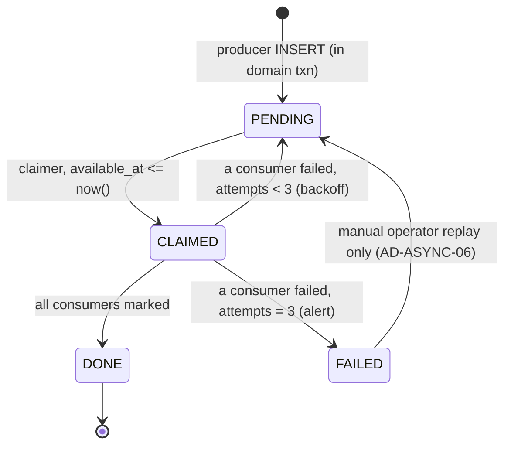

# Karat Hive — Async Contract

| | |
|---|---|
| **Product** | Karat Hive — Digital Jewellery Marketplace |
| **Document** | Outbox events, consumers, scheduled jobs (pre-code contract) |
| **Version** | 0.1 |
| **Status** | Draft — `[PROPOSED]`. Technical Lead sign-off required before it becomes binding. |
| **Date** | 1 September 2026 |
| **Source of truth** | [`docs/Requirements-Spec-v1.3.md`](Requirements-Spec-v1.3.md) §4.4, §5, §7.3 · [`CONTEXT.md`](../CONTEXT.md) · [`docs/Architecture-Backend.md`](Architecture-Backend.md) §9–§11, §15, §17 · [`docs/API-Route-Inventory.md`](API-Route-Inventory.md) §12, §18 · [`docs/Physical-Data-Model.md`](Physical-Data-Model.md) §3 |
| **Encoding** | [`backend/prisma/schema.prisma`](../backend/prisma/schema.prisma) — `outbox_event`, `outbox_consumer`, `job_lock`, `notification`, `notification_delivery` |
| **Companion** | `docs/Notification-Catalogue.md` — EN/AR bodies per trigger ([`Spec-Document-Sequence.md`](Spec-Document-Sequence.md) document #4, not yet written). This document fixes the *trigger*, *recipient*, *channel* and *deep link*; it never writes copy. |
| **Identifier prefix** | `AD-ASYNC-nn` — decisions made by *this* document. Stable, never reused. |

---

## Table of Contents

1. [Purpose and status](#1-purpose-and-status)
2. [Decision register](#2-decision-register)
3. [The outbox envelope and delivery guarantees](#3-the-outbox-envelope-and-delivery-guarantees)
4. [Event catalogue](#4-event-catalogue)
5. [Consumer registry](#5-consumer-registry)
6. [Scheduled jobs](#6-scheduled-jobs)
7. [Notification dispatch](#7-notification-dispatch)
8. [Idempotency and concurrency guarantees](#8-idempotency-and-concurrency-guarantees)
9. [Failure, alerting and replay](#9-failure-alerting-and-replay)
10. [Schema deltas this document proposes](#10-schema-deltas-this-document-proposes)
11. [Open items](#11-open-items)
- [Appendix A — Revision history](#appendix-a--revision-history)
- [Appendix B — Sign-off](#appendix-b--sign-off)
- [Appendix C — Event → consumer → job coverage](#appendix-c--event--consumer--job-coverage)

---

## 1. Purpose and status

[`Architecture-Backend.md`](Architecture-Backend.md) §11 *names* the outbox events (§11.2) and the scheduled jobs (§11.3). It does not give payload fields, consumer behaviour, or the retry contract a worker has to be written against. [`API-Route-Inventory.md`](API-Route-Inventory.md) says "emits outbox" in passing (§13) and lists notification *triggers* (§18) without an event behind each one. [`Physical-Data-Model.md`](Physical-Data-Model.md) §3 assigns the `outbox_event` / `outbox_consumer` / `job_lock` tables but not their contents.

**This document is the missing middle.** It exists so the backend workers (`Backend-Implementation-Plan.md` tasks `T05`, `T21`, `T23`, `T28`, `T30`; phases `P2`, `P7`, `P10`, `P12`) can be implemented without inventing payload shapes independently.

**What this document does not do.** It does not restate the physical schema — [`Physical-Data-Model.md`](Physical-Data-Model.md) and [`backend/prisma/schema.prisma`](../backend/prisma/schema.prisma) own that. It does not hand-write OpenAPI (`NFR-030`, `AD-BE-14`). It does not write notification copy — that is `Notification-Catalogue.md` (document #4). It does not re-describe the media pipeline steps (inventory §12, architecture §16) — only the worker's input and output.

**Tag legend.** `[PROPOSED]` — an engineering decision this document makes that the SRS and architecture do not fix; needs Technical Lead sign-off (§2, §11). `[ASSUMED]` — product behaviour the SRS omits; needs Product Owner sign-off. `[BLOCKED]` — waits on an external decision.

Domain nouns follow [`CONTEXT.md`](../CONTEXT.md) exactly. Fan-out is never a "broadcast" or a bare "push"; a Connection is never a "chat"; an Offer is never a "bid". Event type names are dotted lower-case tokens (`request.published`) and are **not** domain nouns.

---

## 2. Decision register

Decisions made by this document. `Locked` means the SRS or architecture already fixes it and this document only records the consequence. `[PROPOSED]` needs Technical Lead sign-off and is carried in §11.

| ID | Decision | Status |
|---|---|---|
| `AD-ASYNC-01` | Every outbox payload is a common **envelope** (`eventId`, `eventType`, `occurredAt`, `schemaVersion`, `aggregate`) wrapping a typed `data` object. The whole envelope is stored in `outbox_event.payload`; `event_type`, `aggregate_type`, `aggregate_id`, `created_at` are also promoted to columns for the claim query. | `[PROPOSED]` |
| `AD-ASYNC-02` | Fan-out emits **one `request.matched` event per matched Vendor**, not one fat event carrying the whole Match Set (architecture §11.5). A single failing device token cannot then stall the batch. | `[PROPOSED]` |
| `AD-ASYNC-03` | The `offer.accepted` payload carries **no** competing Offer's price, terms, identity, or pseudonymous label (`BR-008`, architecture §9.5). Loser notifications are rendered from the loser's own Offer plus `requestId` only, and the notification body is covered by the masking contract tests (`NFR-013`). | Locked (`BR-008`) |
| `AD-ASYNC-04` | A consumer's idempotency key is its **`outbox_consumer.consumer` string** (§5). The dispatcher writes that marker row on success and skips any consumer that already has one, so a redelivered event never re-runs a consumer that already succeeded. | Locked (architecture §11.1) |
| `AD-ASYNC-05` | `outbox_event.attempts` and the `1 m / 5 m / 25 m` backoff are **per event, not per consumer**. Retry re-runs only the consumers without a marker row. After three failed attempts the event goes to `state = FAILED` with `last_error` and a page-immediately alert (`NFR-025`). | `[PROPOSED]` |
| `AD-ASYNC-06` | Dead-lettering is `state = FAILED` + alert. There is **no dead-letter table and no automatic replay.** Replay is a manual operator action (reset `state = PENDING`, `attempts = 0`, clear `claimed_*`), documented in the Operations runbook (document #6). | `[PROPOSED]` |
| `AD-ASYNC-07` | `notification_delivery.channel` and `.status` — free `varchar` in the schema today — are pinned to enums: `channel ∈ {IN_APP, PUSH, EMAIL, SMS}`; `status ∈ {PENDING, SENT, DELIVERED, FAILED, BOUNCED}`. §10. | `[PROPOSED]` |
| `AD-ASYNC-08` | This document adds five events and four scheduled jobs the architecture §11 tables do not cover: `request.matched`, `request.edited`, `request.cancelled`, `offer.expiry.warning`, `announcement.scheduled`, `vendor.document.expiring`, `request.draft.purge_warning`; jobs `offer-expiry-warning`, `request-draft-purge`, `vendor-document-expiry`, `announcement-dispatch`. Each is `[PROPOSED]`. | `[PROPOSED]` |
| `AD-ASYNC-09` | Scheduled jobs evaluate against **database time** (`now()`), never application time (architecture §17.5), and against the value **snapshotted onto the entity at creation** (`request.expires_at`, not the live `request.lifetime_hours` setting — `BR-020`, architecture §17.1). | Locked (`BR-020`, architecture §17.5) |
| `AD-ASYNC-10` | The first-Offer `PUBLISHED → OFFERS_RECEIVED` transition happens **synchronously inside the `POST /v1/requests/{id}/offers` transaction** (inventory §15), not in an `offer.submitted` consumer. The reverse transition (`OFFERS_RECEIVED → PUBLISHED` when the last non-terminal Offer expires) is the `offers:request-state` consumer (`FR-SYS-004.4`). This reconciles the ambiguity in architecture §11.2. | `[PROPOSED]` |
| `AD-ASYNC-11` | `request.cancelled` withdraws pending Offers **synchronously** in the cancel transaction (inventory §13); `request.expired` withdraws them **asynchronously** via the `requests:expiry-cascade` consumer. The asymmetry is deliberate: cancel touches one Request, the expiry sweep touches many and must stay bounded per run. | `[PROPOSED]` |

---

## 3. The outbox envelope and delivery guarantees

### 3.1 Envelope

Reusing the primitive aliases from inventory §4.1 (`UUID`, `DateTime`, `Money`, `WeightGrams`).

```
OutboxEnvelope = {
  eventId:       UUID            // = outbox_event.id
  eventType:     string          // = outbox_event.event_type, e.g. "request.published"
  occurredAt:    DateTime        // domain event time, = outbox_event.created_at
  schemaVersion: integer         // payload contract version for eventType; starts at 1
  aggregate:     { type: string, id: UUID }   // = outbox_event.aggregate_type / aggregate_id
  data:          object          // the typed body defined per event in §4
}
```

`data` field names are camelCase, matching the wire convention of inventory §4. Payloads may grow **additively** within a `schemaVersion`; a breaking change increments `schemaVersion` and consumers branch on it. A wholly new shape uses a new `eventType`.

Payloads carry the **internal** identifiers a consumer needs (`customerUserId`, `vendorProfileId`, `vendorUserId`). These are routing inputs for the worker, never rendered into a masked payload or a notification body — see `AD-ASYNC-03` and §7.

### 3.2 Column mapping

`outbox_event` (schema ~L1049):

| Column | Meaning in this contract |
|---|---|
| `event_type` | `OutboxEnvelope.eventType` |
| `aggregate_type` / `aggregate_id` | `OutboxEnvelope.aggregate` — the domain row the event is about |
| `payload` | the whole `OutboxEnvelope`, JSON |
| `available_at` | when a claimer may pick the row up. Producers set `now()`; backoff pushes it forward |
| `claimed_at` / `claimed_by` | lease held by one worker instance |
| `attempts` | per-event failure counter (`AD-ASYNC-05`) |
| `state` | `PENDING → CLAIMED → DONE \| FAILED` (enum `OutboxState`, schema L228) |
| `last_error` | last consumer exception message; set on every failed attempt, kept on `FAILED` |

### 3.3 Producer rule

A producer `INSERT`s the outbox row **in the same transaction as the domain change** (architecture §11.1, §10). If the transaction rolls back, the event was never emitted. Producers never call a consumer, a port, or an HTTP service inline (architecture §7.3 rule 4).

### 3.4 Claim, dispatch, retry

The batch claim query (`FOR UPDATE SKIP LOCKED`) is in architecture §11.1 and is **not** restated here. Per claimed event the dispatcher:

1. Loads the ordered consumer list for `event_type` (§5).
2. For each consumer **without** an `outbox_consumer(event_id, consumer)` row: run it; on success write the marker row in the consumer's own transaction.
3. If every consumer has a marker → `state = DONE`.
4. If any consumer threw → `attempts += 1`, `last_error = <message>`, and:
   - `attempts < 3` → `state = PENDING`, `available_at = now() + backoff(attempts)` where `backoff = [1 m, 5 m, 25 m]`.
   - `attempts = 3` → `state = FAILED`, alert (`NFR-025`, §9).



### 3.5 Delivery semantics

**At-least-once.** Every consumer must be idempotent regardless of its marker row, because a worker can die between doing its work and writing the marker. Idempotency strategies are stated per consumer in §5.

**Ordering is not guaranteed** across events. A consumer that needs the current state of an aggregate re-reads it rather than trusting the payload snapshot (the payload records what was true at `occurredAt`).

---

## 4. Event catalogue

Fourteen events from architecture §11.2, then seven added by this document (`AD-ASYNC-08`, flagged **[new]**). Each entry gives the producer, the `data` shape, the consumers (behaviour only — idempotency markers are in §5), and any masking or state constraint.

### 4.1 `request.published`

**Producer** `requests` — in the `POST /v1/requests/{id}/publish` transaction (inventory §13).
**Aggregate** `request` / `requestId`

```
data: {
  requestId:       UUID
  requestType:     RequestType         // FIND_ORNAMENT | SELL_OLD_GOLD | GOLD_COIN | GOLD_BULLION
  direction:       Direction           // BUY | SELL
  categoryId:      UUID
  regionId:        UUID
  customerUserId:  UUID                 // routing only — never rendered to a Vendor
  publishedAt:     DateTime
  expiresAt:       DateTime             // publishedAt + snapshotted lifetime (BR-020)
}
```

| Consumer | Action |
|---|---|
| `matching:fan-out` | Resolve the Match Set (architecture §11.5); bulk-insert `request_match` `ON CONFLICT DO NOTHING`; emit one `request.matched` per Vendor. Zero matches is success, not error: record the liquidity gap for `FR-ADM-027` and leave the Request `PUBLISHED` (`FR-SYS-001.3`). |

**Notes.** `meta.matchCount` on the publish HTTP response comes from a synchronous count, not from this event (inventory §13). Fan-out latency budget: 99 % within 60 s (`FR-SYS-001.1`, `NFR-004`).

### 4.2 `request.matched` **[new]**

**Producer** `matching:fan-out` consumer (one event per matched Vendor).
**Aggregate** `request_match` / `requestMatchId`

```
data: {
  requestId:       UUID
  requestMatchId:  UUID
  vendorProfileId: UUID
  vendorUserId:    UUID
  requestType:     RequestType
  category:        { id: UUID, labelEn: string, labelAr: string }
  region:          { id: UUID, labelEn: string, labelAr: string }
  matchedAt:       DateTime
}
```

| Consumer | Action |
|---|---|
| `notifications:dispatch` | "New matched Request" to the Vendor. Time-critical — 60 s budget (`FR-SYS-001.2`, `NFR-004`). Deep link `/requests/{requestId}`. |

**Notes.** Carries **no** Customer identity or notes text. The Vendor sees the full masked Request when they open it, guarded by the match-set check (architecture §9.4).

### 4.3 `request.edited` **[new]**

**Producer** `requests` — in the `PATCH /v1/requests/{id}` transaction, only for a `PUBLISHED` / `OFFERS_RECEIVED` Request (inventory §13; `FR-CUS-016` AC4).
**Aggregate** `request` / `requestId`

```
data: {
  requestId:      UUID
  customerUserId: UUID
  changedFields:  string[]        // e.g. ["notes", "budgetMax"]
  editedAt:       DateTime
  notifyVendorProfileIds: UUID[]  // Vendors holding a PENDING Offer on this Request
}
```

| Consumer | Action |
|---|---|
| `notifications:dispatch` | "A Request you offered on was edited" to each Vendor in `notifyVendorProfileIds`. Deep link `/requests/{requestId}`. |

**Notes.** Scope is Vendors **with a pending Offer** (`[PROPOSED]`, `AD-ASYNC-08`) — matched Vendors without an Offer are not notified, to avoid feed noise. Structural fields cannot be edited post-publish (`BR-014`), so the change set is always `notes` / `budget*` / `mediaKeys`.

### 4.4 `request.cancelled` **[new]**

**Producer** `requests` — in the `POST /v1/requests/{id}/cancel` transaction (inventory §13; `FR-CUS-017`). Pending Offers are set to `WITHDRAWN_BY_SYSTEM` **in that same transaction** (`AD-ASYNC-11`).
**Aggregate** `request` / `requestId`

```
data: {
  requestId:        UUID
  customerUserId:   UUID
  cancelledAt:      DateTime
  cancellationReason?: string
  affectedOfferIds: UUID[]        // already WITHDRAWN_BY_SYSTEM by the producer txn
}
```

| Consumer | Action |
|---|---|
| `notifications:dispatch` | "A Request you offered on was cancelled" to each affected Vendor (resolve `vendorUserId` from the Offer). Deep link `/requests/{requestId}`. |

### 4.5 `request.expired`

**Producer** `request-expiry-sweep` job.
**Aggregate** `request` / `requestId`

```
data: {
  requestId:       UUID
  customerUserId:  UUID
  expiredAt:       DateTime
  pendingOfferIds: UUID[]         // to be withdrawn by the cascade consumer
}
```

| Consumer | Action |
|---|---|
| `requests:expiry-cascade` | Set each `pendingOfferIds` Offer to `WITHDRAWN_BY_SYSTEM`, guarded on current state (`FR-SYS-005.3`). |
| `notifications:dispatch` | "Your Request expired" to the Customer; "A Request you offered on expired" to each affected Vendor. Deep link `/requests/{requestId}`. |

**Notes.** The Request is retained in history and may be duplicated (`FR-SYS-005.4`, inventory §13 `/duplicate`). Hard expiry, no extension (`C-07`).

### 4.6 `request.expiry.warning`

**Producer** `request-expiry-warning` job, once per Request (`request.expiry_warned_at` set — Physical-Data-Model §4, "Expiry warning once").
**Aggregate** `request` / `requestId`

```
data: {
  requestId:      UUID
  customerUserId: UUID
  expiresAt:      DateTime
  hoursRemaining: integer         // 6, from platform-config requestExpiryWarningHours
}
```

| Consumer | Action |
|---|---|
| `notifications:dispatch` | "Your Request expires soon" to the Customer (`FR-SYS-005.2`). Deep link `/requests/{requestId}`. |

### 4.7 `request.draft.purge_warning` **[new]**

**Producer** `request-draft-purge` job, once per draft (`request.draft_purge_warned_at` — §10 schema delta).
**Aggregate** `request` / `requestId`

```
data: {
  requestId:      UUID
  customerUserId: UUID
  draftCreatedAt: DateTime
  purgeAfter:     DateTime         // draftCreatedAt + 30 d
}
```

| Consumer | Action |
|---|---|
| `notifications:dispatch` | "An unfinished Request will be deleted in 3 days" to the Customer (`FR-CUS-015` AC4). Deep link `/requests/{requestId}`. |

### 4.8 `offer.submitted`

**Producer** `offers` — in the `POST /v1/requests/{id}/offers` transaction. The first-Offer `PUBLISHED → OFFERS_RECEIVED` transition is done **in that transaction**, not here (`AD-ASYNC-10`).
**Aggregate** `offer` / `offerId`

```
data: {
  offerId:               UUID
  requestId:             UUID
  customerUserId:        UUID
  vendorProfileId:       UUID       // routing only — masked from the Customer pre-Acceptance
  isFirstOfferOnRequest: boolean    // drives first vs subsequent notification copy
  submittedAt:           DateTime
}
```

| Consumer | Action |
|---|---|
| `notifications:dispatch` | "You have a new Offer" (or "another Offer") to the Customer (`FR-CUS-032`). Time-critical — 60 s (`NFR-004`). Deep link `/requests/{requestId}/offers`. |

**Notes.** The Customer may see the Offer **price and terms** pre-Acceptance (inventory §4.8); only the Vendor's **identity** is masked. The notification body must not name or label the Vendor.

### 4.9 `offer.revised`

**Producer** `offers` — in the `POST /v1/offers/{id}/revise` transaction (inventory §15; `FR-VEN-014`, max 3 revisions).
**Aggregate** `offer` / `offerId`

```
data: {
  offerId:        UUID
  requestId:      UUID
  customerUserId: UUID
  previousPrice:  Money
  newPrice:       Money
  newExpiresAt:   DateTime          // reset, still <= parent Request hard expiry (C-07)
  revisedAt:      DateTime
}
```

| Consumer | Action |
|---|---|
| `notifications:dispatch` | "An Offer was revised" to the Customer, with previous and new price (inventory §15). Deep link `/requests/{requestId}/offers`. |

### 4.10 `offer.withdrawn`

**Producer** `offers` — in the `POST /v1/offers/{id}/withdraw` transaction (`FR-VEN-014`).
**Aggregate** `offer` / `offerId`

```
data: {
  offerId:        UUID
  requestId:      UUID
  customerUserId: UUID
  withdrawnAt:    DateTime
}
```

| Consumer | Action |
|---|---|
| `notifications:dispatch` | "An Offer was withdrawn" to the Customer. Deep link `/requests/{requestId}/offers`. |

**Notes.** A Vendor-initiated withdrawal (`WITHDRAWN`) is distinct from the system cascade (`WITHDRAWN_BY_SYSTEM`) produced by `request.cancelled` / `request.expired`; only the former emits this event.

### 4.11 `offer.expiry.warning` **[new]**

**Producer** `offer-expiry-warning` job, once per Offer (`offer.expiry_warned_at` — §10 schema delta).
**Aggregate** `offer` / `offerId`

```
data: {
  offerId:        UUID
  requestId:      UUID
  vendorUserId:   UUID              // the Offer's own Vendor
  expiresAt:      DateTime
  hoursRemaining: integer           // 6 (FR-VEN-013 AC4)
}
```

| Consumer | Action |
|---|---|
| `notifications:dispatch` | "Your Offer expires soon" to the Vendor. Deep link `/offers/{offerId}`. |

### 4.12 `offer.expired`

**Producer** `offer-expiry-sweep` job (also re-checked synchronously at Acceptance — `FR-SYS-004.2`, architecture §10; that synchronous check does not emit this event).
**Aggregate** `offer` / `offerId`

```
data: {
  offerId:                   UUID
  requestId:                 UUID
  customerUserId:            UUID
  vendorUserId:              UUID
  expiredAt:                 DateTime
  wasLastNonTerminalOffer:   boolean   // hint; the consumer re-checks
}
```

| Consumer | Action |
|---|---|
| `offers:request-state` | If the Request now has zero non-terminal Offers, revert `OFFERS_RECEIVED → PUBLISHED` (`FR-SYS-004.4`). Re-read; never trust `wasLastNonTerminalOffer`. |
| `notifications:dispatch` | "Your Offer expired" to the Vendor; "An Offer expired" to the Customer (`FR-SYS-004.3`). |

**Notes.** An `ACCEPTED` Offer is never touched by expiry (`FR-SYS-004.5`).

### 4.13 `offer.accepted`

**Producer** `connections` — inside the Acceptance transaction (architecture §10). The Offer state changes, the Connection row, the competing-Offer rejections, the identity-reveal audit row, and this event are one atomic transaction (`BR-011`–`BR-013`, `FR-SYS-006`, `FR-SYS-007`).
**Aggregate** `connection` / `connectionId`

```
data: {
  requestId:        UUID
  acceptedOfferId:  UUID
  connectionId:     UUID
  customerUserId:   UUID
  winnerVendorUserId: UUID
  rejectedOfferIds: UUID[]          // losing Offers — IDs ONLY
  acceptedAt:       DateTime
}
```

> **Masking (`AD-ASYNC-03`, `BR-008`, architecture §9.5).** This payload deliberately omits the winning price, the winning terms, and any winner identity or label. The `notifications:dispatch` consumer, rendering the loser notification, may read only the loser's own Offer and `requestId`. It must **not** join to `acceptedOfferId`. The loser notification body is covered by the masking contract test suite (`NFR-013`, `NFR-029`).

| Consumer | Action |
|---|---|
| `notifications:dispatch` | **Winner:** "Your Offer was accepted" — time-critical, `isCritical`-adjacent (60 s, `NFR-004`), deep link `/connections/{connectionId}`. **Losers:** "The Customer selected another Vendor" — no price, no identity — deep link `/requests/{requestId}`. **Customer:** "You are now connected" — deep link `/connections/{connectionId}`. |

### 4.14 `connection.closed`

**Producer** `connections` — in the `POST /v1/connections/{id}/close` transaction (`FR-SYS-007.5`).
**Aggregate** `connection` / `connectionId`

```
data: {
  connectionId:   UUID
  requestId:      UUID
  customerUserId: UUID
  vendorUserId:   UUID
  closedBy:       ClosedBy          // CUSTOMER | VENDOR | ADMIN
  closedAt:       DateTime
}
```

| Consumer | Action |
|---|---|
| `notifications:dispatch` | Review prompt to both parties (architecture §11.2; `FR-CUS-029`, `FR-VEN-028`). Deep link `/connections/{connectionId}/review`. |

**Notes.** Identity access and history survive closure (`FR-SYS-007.5`). Talk becomes unavailable (`talk.available = false`, Screen-API-Map `CUS-S15` / `VEN-S13`).

### 4.15 `review.published`

**Producer** `reviews` — either on direct publish (no moderation hold) or from a `review.moderated` `APPROVED` decision. One event per transition into `PUBLISHED`.
**Aggregate** `review` / `reviewId`

```
data: {
  reviewId:     UUID
  connectionId: UUID
  authorType:   "CUSTOMER" | "VENDOR"
  subjectVendorProfileId?: UUID     // present when authorType = CUSTOMER
  subjectCustomerUserId?:  UUID     // present when authorType = VENDOR
  publishedAt:  DateTime
}
```

| Consumer | Action |
|---|---|
| `reviews:rating-recompute` | Recompute the subject's aggregate rating and count from `PUBLISHED` reviews only (`FR-SYS-012.1`, `FR-SYS-012.2`). Write to `vendor_profile` / `customer_profile` denormalised columns. |
| `notifications:dispatch` | "You received a new review" to the reviewed party. Deep link to the reviewed party's own reviews screen. |

**Notes.** Customer aggregates are visible to Vendors and Admins only (`FR-SYS-012.5`, `BR-018`) — the notification to a reviewed Customer must not disclose the numeric aggregate to anyone else.

### 4.16 `review.moderated`

**Producer** `reviews` — in the `POST /v1/admin/...` moderation transaction (inventory §21.7; `FR-ADM-026`).
**Aggregate** `review` / `reviewId`

```
data: {
  reviewId:          UUID
  connectionId:      UUID
  decision:          "APPROVED" | "REJECTED" | "REDACTED"
  moderatedByAdminId: UUID
  moderatedAt:       DateTime
}
```

| Consumer | Action |
|---|---|
| `reviews:rating-recompute` | Recompute the subject aggregate (a `REJECTED` / `REDACTED` review leaves the contributing set; `APPROVED` may enter it). Full recompute is naturally idempotent (`FR-SYS-012.3`). |

**Notes.** `APPROVED` also causes the producer to emit `review.published`. This event drives the rating math for all three decisions; the notification path is only on `review.published`.

### 4.16a `vendor.registered` **[PROPOSED]**

**Producer** `identity` — in the `POST /v1/auth/register/vendor` transaction.
**Aggregate** `vendor_profile` / `vendorProfileId`

```
data: {
  vendorProfileId: UUID
  vendorUserId:    UUID
  registeredAt:    DateTime
}
```

| Consumer | Action |
|---|---|
| none this slice | Audit trail only. Notifications land with a later consumer. |

### 4.16b `vendor.documents.submitted` **[PROPOSED]**

**Producer** `vendor-onboarding` — when the mandatory KYC set (`TRADE_LICENCE` + `EMIRATES_ID`) is complete.
**Aggregate** `vendor_profile` / `vendorProfileId`

```
data: {
  vendorProfileId: UUID
  vendorUserId:    UUID
}
```

| Consumer | Action |
|---|---|
| none this slice | Audit trail only. Admin verification queue consumes this later. |

### 4.17 `vendor.verification.decided`

**Producer** `vendor-onboarding` — in the Admin verification-decision transaction (inventory §21.3; `FR-ADM-015`).
**Aggregate** `vendor_profile` / `vendorProfileId`

```
data: {
  vendorProfileId:  UUID
  vendorUserId:     UUID
  decision:         "VERIFIED" | "REJECTED" | "MORE_INFO"
  reason?:          string          // required for REJECTED / MORE_INFO
  decidedByAdminId: UUID
  decidedAt:        DateTime
}
```

| Consumer | Action |
|---|---|
| `notifications:dispatch` | Verification outcome to the Vendor, channels in-app + push + email. Deep link `/me/vendor`. |

**Notes.** `VERIFIED` does not by itself grant marketplace access — the Vendor still needs `account_state = ACTIVE` and a live Type Subscription (`BR-002`, `FR-VEN-031`, Physical-Data-Model §2). A grant of access emits `vendor.eligibility.changed`, not this event.

### 4.18 `vendor.eligibility.changed`

**Producer** `vendor-onboarding` (verification lost, account suspended/reactivated, Category/Region change) or `subscription` (Type Subscription added, lapsed to `EXPIRED`).
**Aggregate** `vendor_profile` / `vendorProfileId`

```
data: {
  vendorProfileId: UUID
  vendorUserId:    UUID
  reason: "VERIFICATION_LOST" | "ACCOUNT_SUSPENDED" | "ACCOUNT_REACTIVATED"
        | "SUBSCRIPTION_ADDED" | "SUBSCRIPTION_LAPSED"
        | "CATEGORY_CHANGED" | "REGION_CHANGED"
  affectedRequestTypes?: RequestType[]
  changedAt:       DateTime
}
```

| Consumer | Action |
|---|---|
| `matching:eligibility-recompute` | Recompute `request_match` for this Vendor across every **live** Request (`PUBLISHED` / `OFFERS_RECEIVED`). Insert new matches `ON CONFLICT DO NOTHING`; flip `request_match.is_eligible = false` where the Vendor no longer qualifies. **Never** touch matches for `ACCEPTED` or terminal Requests (`FR-SYS-002.3`). |

**Notes.** Existing Offers from a now-ineligible Vendor are handled per `FR-ADM-016`, not by this consumer. Suspension already takes effect on the Vendor's next call (token carries no entitlement claims, architecture §14.2); this event only fixes the feed.

### 4.19 `media.uploaded`

**Producer** `media` — in the `POST /v1/media/{key}/complete` transaction (inventory §12).
**Aggregate** `media` / `mediaId`

```
data: {
  mediaId:           UUID
  objectKey:         string
  bucket:            "REQUEST_MEDIA" | "KYC" | "EXPORT"
  purpose:           MediaPurpose
  parentType:        string          // "request" | "offer" | "vendor_document" | ...
  parentId:          UUID
  uploadedByUserId:  UUID
  contentType:       string
  byteSize:          integer
}
```

| Consumer | Action |
|---|---|
| `media:process` | Run the pipeline defined in inventory §12 / architecture §16 — **not restated here.** Worker input: the original object at `objectKey`. Worker output: `media.state = READY` with `thumbnail_key` set and `exif_stripped = true`, **or** `media.state = QUARANTINED` (malware / type-mismatch), which blocks the parent Request from publication (`FR-SYS-009.5`). |

**Notes.** Idempotent on `mediaId` (architecture §11.3). Originals are never served to a counterparty before `READY` (SRS §7.6).

### 4.20 `announcement.scheduled` **[new]**

**Producer** `announcement-dispatch` job, when `announcement.scheduled_for <= now()`, `cancelled_at IS NULL`, and the dispatch guard is unset (§10).
**Aggregate** `announcement` / `announcementId`

```
data: {
  announcementId: UUID
  scheduledFor:   DateTime
  audience:       object            // { userTypes?, accountStates?, regionIds?, categoryIds? } — schema shape
  channels:       { inApp: boolean, push: boolean, email: boolean }
  critical:       boolean           // overrides recipient preferences and quiet hours
}
```

| Consumer | Action |
|---|---|
| `notifications:dispatch` | Expand `audience` into recipient `user` ids; create one `notification` row per recipient with `is_critical = critical`; record counts back onto `announcement.dispatch_stats`. Deep link: announcement detail route. |

**Notes.** An immediate (non-scheduled) announcement is emitted directly by the `POST /v1/admin/announcements` handler with the same payload and `scheduledFor = occurredAt`. Cancellation is only possible before the guard is set (inventory §21.9).

### 4.21 `vendor.document.expiring` **[new]**

**Producer** `vendor-document-expiry` job, once per document at T−30 days (`vendor_document.reminder_sent_at` — §10 schema delta; `FR-VEN-002` AC4).
**Aggregate** `vendor_document` / `documentId`

```
data: {
  vendorProfileId: UUID
  vendorUserId:    UUID
  documentId:      UUID
  documentType:    DocumentType      // TRADE_LICENCE | EMIRATES_ID | VAT_CERT | ...
  expiresOn:       DateTime          // date
  daysRemaining:   integer           // 30
}
```

| Consumer | Action |
|---|---|
| `notifications:dispatch` | "A document expires in 30 days" to the Vendor **and** to Admins (`FR-VEN-002` AC4). Covers the "KYC nearing expiry" Vendor trigger (inventory §18). Deep link `/me/vendor/documents`. |

---

## 5. Consumer registry

Every value that may appear in `outbox_consumer.consumer` (`varchar(64)`). This is a **closed set** — a dispatcher encountering an unknown consumer name for an event type is a defect, not a no-op. Naming: `<module>:<handler>`.

| `consumer` | Module | Subscribes to | Idempotency strategy (beyond the marker row) |
|---|---|---|---|
| `matching:fan-out` | `matching` | `request.published` | `request_match` unique `(request_id, vendor_profile_id)` + `ON CONFLICT DO NOTHING`; `request.matched` emission keyed on `request_match.id` |
| `matching:eligibility-recompute` | `matching` | `vendor.eligibility.changed` | Full recompute for the Vendor's live Requests; upsert on `(request_id, vendor_profile_id)`; `is_eligible` set to a computed value, not toggled |
| `requests:expiry-cascade` | `requests` | `request.expired` | Offer transition guarded on current state (`WHERE state = 'PENDING'`) |
| `offers:request-state` | `offers` | `offer.expired` | Re-reads the Request's non-terminal Offer count; the `OFFERS_RECEIVED → PUBLISHED` update is guarded on current state |
| `reviews:rating-recompute` | `reviews` | `review.published`, `review.moderated` | Full arithmetic-mean recompute over `PUBLISHED` reviews — naturally idempotent (`FR-SYS-012.3`) |
| `media:process` | `media` | `media.uploaded` | Keyed on `media.id`; re-run tolerates an already-`READY` row (no-op) |
| `notifications:dispatch` | `notifications` | `request.matched`, `request.edited`, `request.cancelled`, `request.expired`, `request.expiry.warning`, `request.draft.purge_warning`, `offer.submitted`, `offer.revised`, `offer.withdrawn`, `offer.expiry.warning`, `offer.expired`, `offer.accepted`, `connection.closed`, `review.published`, `vendor.verification.decided`, `announcement.scheduled`, `vendor.document.expiring` | One `notification` row per (event, recipient); the marker row `outbox_consumer(event_id, 'notifications:dispatch')` covers the whole recipient fan. Per-channel delivery is retried separately by the `notification-retry` job, keyed on `notification_delivery.attempt` |

**Consumer order per event.** Where an event has both a state consumer and `notifications:dispatch` (`request.expired`, `offer.expired`), the state consumer runs first so a notification never describes a state the database has not reached yet. The dispatcher runs consumers in the order listed in §4.

---

## 6. Scheduled jobs

Architecture §11.3 rows are preserved; the four **[new]** rows are `AD-ASYNC-08`. Every lease-based job takes its named `job_lock` row (schema L1080) with a short renewed lease (architecture §11.4). `outbox-drain` is **not** lease-based — `FOR UPDATE SKIP LOCKED` lets every `worker` instance drain concurrently.

| Job | `job_lock` key | Cadence | Reads | Emits / writes | Success metric | User-visible symptom if stalled |
|---|---|---|---|---|---|---|
| Offer expiry sweep | `offer-expiry-sweep` | 1 min | `offer WHERE state='PENDING' AND expires_at <= now()` (partial index) | `offer.state = EXPIRED`; `offer.expired` | Offer `EXPIRED` within 1 min of deadline (`FR-SYS-004.1` allows 5) | Vendor feed shows a live Offer past its countdown |
| Offer expiry warning **[new]** | `offer-expiry-warning` | 5 min | `offer` pending, `expires_at` within 6 h, `expiry_warned_at IS NULL` | `offer.expiry_warned_at = now()`; `offer.expiry.warning` | Warning sent once, ≥ 5.5 h before expiry (`FR-VEN-013` AC4) | Vendor's Offer lapses with no warning |
| Request expiry sweep | `request-expiry-sweep` | 1 min | `request WHERE state IN ('PUBLISHED','OFFERS_RECEIVED') AND expires_at <= now()` (partial index) | `request.state = EXPIRED`; `request.expired` | Request `EXPIRED` within 1 min of `expires_at` (`C-07`) | Customer countdown hits zero while the Request still shows live — a trust failure (architecture §11.3) |
| Request expiry warning | `request-expiry-warning` | 5 min | `request` live, `expires_at` within 6 h, `expiry_warned_at IS NULL` | `request.expiry_warned_at = now()`; `request.expiry.warning` | Warning sent once, ~6 h before expiry (`FR-SYS-005.2`) | Customer's Request expires with no warning |
| Draft purge **[new]** | `request-draft-purge` | Hourly | `request WHERE state='DRAFT'`: at age 27 d → warn; at age 30 d → delete | `request.draft_purge_warned_at`; `request.draft.purge_warning`; hard-delete draft + `request_media` at 30 d | Warned at T−3 d, purged at 30 d (`FR-CUS-015` AC4) | A draft the Customer expected to keep vanishes with no notice |
| Outbox drain | — (SKIP LOCKED) | 5 s | `outbox_event WHERE state='PENDING' AND available_at <= now()` | Consumer side effects; `outbox_consumer` markers; `state` transitions | Time-critical events dispatched within 60 s (`NFR-004`) | Every notification and fan-out stalls; Requests do not expire (all `worker` instances down — architecture §19.2) |
| Notification retry | `notification-retry` | 1 min | `notification_delivery WHERE status='FAILED' AND attempt < 3` | New delivery attempt via the notification gateway port; `attempt++`; `status` | Transient push/email failures recovered within a few minutes (`FR-SYS-008.3`) | Push not received (in-app centre still correct — `FR-SYS-008.6`) |
| Gold rate poll | `gold-rate-poll` | 15 min (configurable) | `fetchSpotRate()` port (architecture §15.2) | `gold_rate` upsert on `(purity_karat, source, source_timestamp)` for 24K + derived purities | Fresh rate every ≤ 15 min (`FR-SYS-010.1`) | Indicative valuations drift; bullion publish blocked (`GOLD_RATE_UNAVAILABLE`) |
| Gold rate stale alert | `gold-rate-stale-alert` | 15 min | Newest `gold_rate.source_timestamp` per purity | Admin alert, de-duplicated per window | Admin alerted after 2 h of ingestion failure (`FR-SYS-010.5`) | Stale rates shown with no operator awareness |
| Rating reconcile | `rating-reconcile` | 5 min | All `PUBLISHED` reviews vs denormalised aggregates | Corrective recompute where they disagree (`FR-SYS-012.3` safety net) | Aggregates match within 5 min even if an event was missed | A Vendor's rating lags reality |
| Announcement dispatch **[new]** | `announcement-dispatch` | 1 min | `announcement WHERE scheduled_for <= now() AND cancelled_at IS NULL AND dispatch_stats IS NULL` | dispatch guard set; `announcement.scheduled` | Scheduled announcement fans out within 1 min of its time (`FR-ADM-029`) | A timed announcement is late or silent |
| Vendor document expiry **[new]** | `vendor-document-expiry` | Daily 02:00 GST | `vendor_document WHERE expiry_date - now() <= 30 d AND reminder_sent_at IS NULL` | `vendor_document.reminder_sent_at`; `vendor.document.expiring` | Vendor + Admin reminded ~30 d out (`FR-VEN-002` AC4) | A licence lapses unnoticed; Vendor silently loses eligibility |
| Retention purge | `retention-purge` | Daily 03:00 GST | Rows past their retention window (`NFR-021`): notifications > 90 d, orphan media > 30 d (`FR-SYS-009.6`), `idempotency_key` > 24 h, audit never | Hard-delete or anonymise-in-place (`AD-BE-13`) | Retention windows enforced (`NFR-021`) | None directly; a compliance failure |
| Media processing | — (event-driven) | on `media.uploaded` | — | See `media:process`, §5 | Derivatives `READY` before the parent can publish | Request stuck un-publishable ("media not ready") |
| Match-set recompute | — (event-driven) | on `vendor.eligibility.changed` | — | See `matching:eligibility-recompute`, §5 | Feed corrected within one drain cycle | Ineligible Vendor still sees a Request, or an eligible one does not |

**Cadence note.** Both expiry sweeps run every minute although `FR-SYS-004.1` permits five — a Customer-visible countdown (`SH-DOM-07`) reaching zero on a Request still marked live is a trust problem, not just a correctness one (architecture §11.3).

**`gold_rate` upsert key.** Architecture §11.3 writes "`(purity, source_timestamp)`"; the schema's unique constraint is `(purity_karat, source, source_timestamp)`. The schema is authoritative — the poll job upserts on all three.

---

## 7. Notification dispatch

`notifications:dispatch` is the single consumer that turns events into `notification` rows (schema L874) and `notification_delivery` attempts (L896). **Mechanism only — bodies and localised strings are `Notification-Catalogue.md` (document #4).**

### 7.1 Dispatch rules (architecture §15.1, `FR-SYS-008`)

- Every notification is **written to the in-app centre (`notification` row) regardless of push outcome** (`FR-SYS-008.6`). The in-app centre is the source of truth; push/email/SMS are best-effort.
- Preferences (`notification_preference`, L912) and quiet hours are evaluated **at dispatch time**, not when the event was enqueued (`FR-CUS-034`, `FR-VEN-027`) — honoured within one minute of a preference change (`FR-CUS-032` AC).
- `is_critical = true` bypasses preferences and quiet hours (`FR-SYS-008.2`). Security-critical categories cannot be disabled (inventory §9).
- Failed channel deliveries are retried by the `notification-retry` job, exponential backoff, **max 3 attempts** (`FR-SYS-008.3`).
- Notifications are idempotent: the `outbox_consumer` marker plus one `notification` row per (event, recipient) means a redelivered event produces no duplicate (`FR-SYS-008.5`).

### 7.2 Trigger table

Covers the Customer triggers (`FR-CUS-032`) and Vendor triggers (`FR-VEN-026`) from inventory §18. `Deep link` is a client route (`notification.deep_link`).

| Trigger (inventory §18) | Event | Recipient — user id source | Channels | `is_critical` | Deep link |
|---|---|---|---|---|---|
| New matched Request | `request.matched` | Vendor — `vendorUserId` | in-app, push | no | `/requests/{requestId}` |
| First Offer received | `offer.submitted` (`isFirstOfferOnRequest`) | Customer — `customerUserId` | in-app, push | no | `/requests/{requestId}/offers` |
| Subsequent Offer received | `offer.submitted` | Customer | in-app, push | no | `/requests/{requestId}/offers` |
| Offer revised | `offer.revised` | Customer | in-app, push | no | `/requests/{requestId}/offers` |
| Offer withdrawn | `offer.withdrawn` | Customer | in-app, push | no | `/requests/{requestId}/offers` |
| Request approaching expiry (T−6 h) | `request.expiry.warning` | Customer | in-app, push | no | `/requests/{requestId}` |
| Request expired | `request.expired` | Customer + each affected Vendor | in-app, push | no | `/requests/{requestId}` |
| Request edited | `request.edited` | Vendors with a pending Offer | in-app, push | no | `/requests/{requestId}` |
| Request cancelled | `request.cancelled` | each affected Vendor | in-app, push | no | `/requests/{requestId}` |
| Unfinished draft (T−3 d) | `request.draft.purge_warning` | Customer | in-app | no | `/requests/{requestId}` |
| Offer approaching expiry (T−6 h) | `offer.expiry.warning` | Vendor (own Offer) | in-app, push | no | `/offers/{offerId}` |
| Offer expired | `offer.expired` | Vendor + Customer | in-app, push | no | `/offers/{offerId}` · `/requests/{requestId}/offers` |
| Offer accepted (winner) | `offer.accepted` | winner Vendor — `winnerVendorUserId` | in-app, push | no | `/connections/{connectionId}` |
| Offer rejected (loser) | `offer.accepted` (per `rejectedOfferIds`) | loser Vendor | in-app, push | no | `/requests/{requestId}` — **no price, no identity** |
| Connected (customer confirmation) | `offer.accepted` | Customer | in-app, push | no | `/connections/{connectionId}` |
| Connection closed | `connection.closed` | Customer + Vendor | in-app | no | `/connections/{connectionId}` |
| Review reminder | `connection.closed` | Customer + Vendor | in-app, push | no | `/connections/{connectionId}/review` |
| New review received | `review.published` | reviewed party | in-app, push | no | reviewed party's reviews screen |
| Verification outcome | `vendor.verification.decided` | Vendor — `vendorUserId` | in-app, push, email | no | `/me/vendor` |
| Document / KYC nearing expiry | `vendor.document.expiring` | Vendor + Admins | in-app, push, email | no | `/me/vendor/documents` |
| Platform announcement | `announcement.scheduled` | expanded `audience` | per `channels` | per `critical` | announcement detail route |
| Security-critical account events (OTP, password, new device, suspension) | *emitted inline by `identity` / `admin` producers as `notifications:dispatch` events* `[PROPOSED]` | affected user | in-app, push, **SMS** | **yes** | `/settings/security` |

### 7.3 `notification_delivery` enums (`AD-ASYNC-07`)

```
NotificationChannel = IN_APP | PUSH | EMAIL | SMS
NotificationDeliveryStatus = PENDING | SENT | DELIVERED | FAILED | BOUNCED
```

`IN_APP` is written `DELIVERED` on creation (it is the persisted row). `PUSH` / `EMAIL` / `SMS` start `PENDING`, move to `SENT` on gateway hand-off, `DELIVERED` on a receipt where the channel supplies one (architecture §15.1), `FAILED` (retryable) or `BOUNCED` (terminal) otherwise.

---

## 8. Idempotency and concurrency guarantees

Consolidated for the `Release-Gate-Tests.md` concurrency suite (document #5; architecture §20 "duplicate outbox claims, double scheduler fire").

| Hazard | Guard | Requirement |
|---|---|---|
| Two `worker` instances claim the same event | `FOR UPDATE SKIP LOCKED` in the claim query — disjoint batches (architecture §11.1) | `NFR-009` |
| A redelivered event re-runs a succeeded consumer | `outbox_consumer` composite PK `(event_id, consumer)`; dispatcher skips marked consumers (`AD-ASYNC-04`) | architecture §11.1 |
| Fan-out retried after partial failure | `request_match` unique `(request_id, vendor_profile_id)` + `ON CONFLICT DO NOTHING` (`FR-SYS-001.4`, Physical-Data-Model §5) | `FR-SYS-001` |
| A scheduled job fires on two instances at once | `job_lock` conditional-`UPDATE` lease; killed holder's lease expires (architecture §11.4) | `NFR-009` |
| Expiry warning sent twice | `*_warned_at` / `reminder_sent_at` set once, checked in the job's `WHERE` | `FR-SYS-005.2`, `FR-VEN-013` AC4 |
| Announcement dispatched twice | `dispatch_stats IS NULL` guard in the job's `WHERE`, set inside the dispatch transaction | `FR-ADM-029` |
| Duplicate notification for one trigger | one `notification` row per (event, recipient); marker row covers the fan (`FR-SYS-008.5`) | `FR-SYS-008` |
| Acceptance racing with Offer expiry | Offer validity re-checked **inside** the Acceptance transaction, not trusted from the render read (architecture §10.1) | `FR-SYS-004.2` |
| Concurrent Acceptance on one Request | `SELECT … FOR UPDATE` of the `request` row serialises; the loser re-reads `ACCEPTED` and gets a domain error (`AD-BE-09`, `BR-011`) | `FR-SYS-006`, `FR-SYS-007` |

---

## 9. Failure, alerting and replay

### 9.1 Alerts (architecture §17.3, §19.2, `NFR-025`)

| Signal | Threshold | Severity |
|---|---|---|
| Outbox backlog depth | `count(state='PENDING' AND available_at <= now())` sustained above a configured bound | page |
| Outbox event age | oldest `PENDING` `available_at` older than a few minutes | page — first-class symptom that all `worker` instances are down (architecture §19.2) |
| `outbox_event.state = FAILED` count | any increase | page (`AD-ASYNC-05`) |
| `job_lock` staleness | a job's `leased_until` far in the past with no renewal | page |
| Notification delivery failure per channel | per-channel `FAILED` rate above baseline | warn; surfaced to Admins (architecture §15.1) |
| Gold-rate ingestion failure | 2 h without a fresh `gold_rate` (`FR-SYS-010.5`) | Admin alert |
| Masking interceptor trigger (architecture §9.2 layer 3) | any | page-immediately |

### 9.2 Replay (`AD-ASYNC-06`)

There is no dead-letter table and no automatic replay. A `FAILED` event is investigated from `last_error`, the root cause fixed, and the event replayed manually:

```sql
UPDATE outbox_event
SET state = 'PENDING', attempts = 0, available_at = now(),
    claimed_at = NULL, claimed_by = NULL, last_error = NULL
WHERE id = $1;
```

Consumers that already succeeded keep their `outbox_consumer` marker and are skipped on replay, so replay is safe even for a partially-processed event. The full operator procedure (access, audit, when to instead discard) belongs in the Operations runbook (document #6).

---

## 10. Schema deltas this document proposes

All `[PROPOSED]`, for Technical Lead sign-off. None changes an existing column's type. To be reflected in [`backend/prisma/schema.prisma`](../backend/prisma/schema.prisma) and [`Physical-Data-Model.md`](Physical-Data-Model.md).

| # | Table | Change | Driven by |
|---|---|---|---|
| 1 | `notification_delivery` | `channel` → enum `NotificationChannel`; `status` → enum `NotificationDeliveryStatus` (`AD-ASYNC-07`). Closes Physical-Data-Model §8 open encoding | `FR-SYS-008` |
| 2 | `offer` | add `expiry_warned_at timestamptz NULL` | `offer.expiry.warning` (`FR-VEN-013` AC4) |
| 3 | `request` | add `draft_purge_warned_at timestamptz NULL` | `request.draft.purge_warning` (`FR-CUS-015` AC4) |
| 4 | `vendor_document` | add `reminder_sent_at timestamptz NULL` | `vendor.document.expiring` (`FR-VEN-002` AC4) |
| 5 | `announcement` | dispatch guard: use `dispatch_stats IS NULL` as the "not yet dispatched" predicate, **or** add `dispatched_at timestamptz NULL` for clarity | `announcement.scheduled` |
| 6 | `outbox_consumer` | no change — but the table is absent from Architecture Appendix C and Physical-Data-Model Appendix A. Add a row to both: "consumer idempotency marker, `(event_id, consumer)` PK, written on success" | architecture §11.1 |
| 7 | *(none)* | `request_match.is_eligible` already exists (schema) and is the flip target for `matching:eligibility-recompute` — recorded here, no change | `FR-SYS-002.3` |

Partial indexes the new jobs rely on (to be added to [`backend/prisma/sql/partial-indexes.sql`](../backend/prisma/sql/partial-indexes.sql), which Prisma cannot express — Physical-Data-Model §7):

```sql
CREATE INDEX offer_expiry_warn   ON offer (expires_at)
  WHERE state = 'PENDING' AND expiry_warned_at IS NULL;
CREATE INDEX request_draft_age   ON request (created_at)
  WHERE state = 'DRAFT';
CREATE INDEX vendor_doc_expiry   ON vendor_document (expiry_date)
  WHERE reminder_sent_at IS NULL;
CREATE INDEX announcement_due    ON announcement (scheduled_for)
  WHERE cancelled_at IS NULL AND dispatch_stats IS NULL;
```

---

## 11. Open items

Recorded so implementation does not silently resolve them.

| Item | Kind | Impact on this contract |
|---|---|---|
| All `AD-ASYNC-*` marked `[PROPOSED]` | `[PROPOSED]` | Whole document is Draft until Technical Lead sign-off (Appendix B) |
| Schema deltas §10 (items 1–5) | `[PROPOSED]` | Four jobs and their events cannot be built until the marker columns exist |
| Security-critical account-event notifications (§7.2 last row) — which producers, exact event names, SMS provider | `[ASSUMED]` (product) | SMS channel and `is_critical` path under-specified; SRS §12 lists the need, not the catalogue |
| `request.edited` recipient scope — pending-Offer Vendors only, vs all matched Vendors | `[PROPOSED]` | Chosen: pending-Offer only. Revisit if `FR-CUS-016` AC is clarified |
| Second review nudge if no review N days after `connection.closed` | `[ASSUMED]` (product) | Not built; only the immediate prompt on `connection.closed` exists |
| No live-update channel in v1 (no WebSocket/SSE — inventory §23, `NFR-003`) | Client constraint | Dispatch latency is only felt on the client's next pull-to-refresh / focus refetch; the 60 s budgets (`NFR-004`) are server-to-notification, not server-to-screen |
| Announcement audience-size preview has no endpoint (`SAM-GAP-10`) | Deferred | `announcement.scheduled` carries `audience`; the count is computed at dispatch, not previewable |
| Yahoo Finance redistribution terms | `[BLOCKED]` — legal | `gold-rate-poll` and `gold-rate-stale-alert` run regardless; end-user *display* of the rate stays blocked (`AD-API-09`) |
| Offer `validityHours` 12/24/48 (`FR-VEN-013`, `AD-API-07`) vs SRS §6.2 dictionary 24/48/72/168 | Spec tension (tracked in inventory §23) | This contract follows `FR-VEN-013`; `offer.expiry.warning` timing is unaffected |

---

## Appendix A — Revision history

| Version | Date | Change |
|---|---|---|
| 0.1 | 1 September 2026 | Initial async contract against SRS v1.3, Architecture-Backend §11, API inventory 0.1, Physical-Data-Model 0.1. 21 events (14 from architecture §11.2 + 7 new), 7 consumers, 15 scheduled jobs (11 + 4 new), notification dispatch table, 5 proposed schema deltas. |

---

## Appendix B — Sign-off

| Role | Signs off on | Status |
|---|---|---|
| Technical Lead | Envelope, retry contract, consumer set, job set, schema deltas §10 (`AD-ASYNC-01`, `02`, `05`, `06`, `07`, `08`, `10`, `11`) | Pending |
| Product Owner | Notification triggers and channels §7.2, `[ASSUMED]` rows in §11 | Pending |

---

## Appendix C — Event → consumer → job coverage

| Event | Emitted by | Consumed by |
|---|---|---|
| `request.published` | `POST …/publish` txn | `matching:fan-out` |
| `request.matched` | `matching:fan-out` | `notifications:dispatch` |
| `request.edited` | `PATCH /v1/requests/{id}` txn | `notifications:dispatch` |
| `request.cancelled` | `POST …/cancel` txn | `notifications:dispatch` |
| `request.expired` | `request-expiry-sweep` | `requests:expiry-cascade`, `notifications:dispatch` |
| `request.expiry.warning` | `request-expiry-warning` | `notifications:dispatch` |
| `request.draft.purge_warning` | `request-draft-purge` | `notifications:dispatch` |
| `offer.submitted` | `POST /v1/requests/{id}/offers` txn | `notifications:dispatch` |
| `offer.revised` | `POST /v1/offers/{id}/revise` txn | `notifications:dispatch` |
| `offer.withdrawn` | `POST /v1/offers/{id}/withdraw` txn | `notifications:dispatch` |
| `offer.expiry.warning` | `offer-expiry-warning` | `notifications:dispatch` |
| `offer.expired` | `offer-expiry-sweep` | `offers:request-state`, `notifications:dispatch` |
| `offer.accepted` | Acceptance txn (`connections`) | `notifications:dispatch` |
| `connection.closed` | `POST /v1/connections/{id}/close` txn | `notifications:dispatch` |
| `review.published` | `reviews` | `reviews:rating-recompute`, `notifications:dispatch` |
| `review.moderated` | `POST /v1/admin/...` moderation txn | `reviews:rating-recompute` |
| `vendor.verification.decided` | Admin verification txn | `notifications:dispatch` |
| `vendor.eligibility.changed` | `vendor-onboarding` / `subscription` | `matching:eligibility-recompute` |
| `media.uploaded` | `POST /v1/media/{key}/complete` txn | `media:process` |
| `announcement.scheduled` | `announcement-dispatch` (or inline for immediate) | `notifications:dispatch` |
| `vendor.document.expiring` | `vendor-document-expiry` | `notifications:dispatch` |

*End of document. Authoritative OpenAPI is generated from code (`NFR-030`) once the monolith exists; the outbox payloads above are the pre-code contract the workers are written against and must be diffed against the shipped event types at first implementation.*
