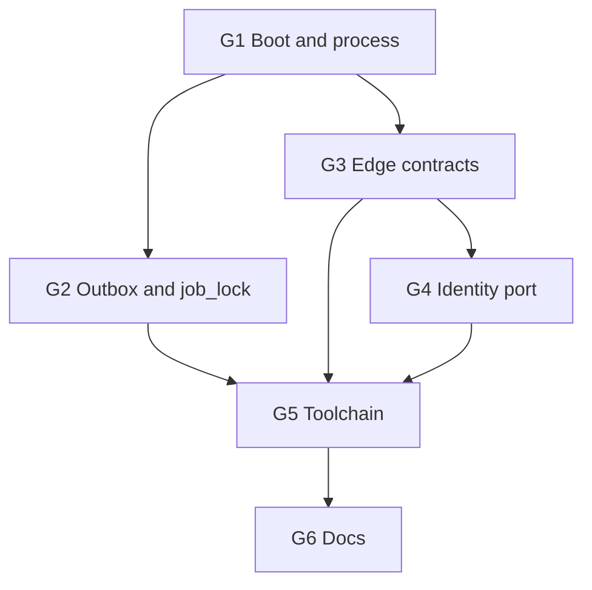

# Fix P0/P1 gaps from the two-axis review

## Goal

Close every **Standards** and **Spec** finding from the review of untracked `backend/` vs HEAD `3c0fd35`. Do not start P2 marketplace/OTP routes. Do not reopen T01’s init migration.

Authority: SRS v1.3 → Architecture-Backend (`AD-BE-07`, §§6, 7.3, 9.2, 11, 13, 14.2, 18) → Backend-Implementation-Plan P0/P1 (T33–T35). Physical-Data-Model / SRS win over Architecture where they already disagree.

## Out of this plan (reviewed, not code defects)

| Finding | Why not a code fix |
|---|---|
| `Weight` / `numeric(9,3)` | SRS §6.2 and Physical-Data-Model use **`numeric(10,2)` grams** (0.10–5000.00). Architecture §12.2 is stale. Docs-only: D01. |
| T36 SAM-GAP / Async-Contract columns already in `20260901120000_init` | Reverting a frozen init migration is worse than leaving `[PROPOSED]` columns. Docs-only: D02. TL still owes sign-off. |
| `backend/docker/` present | Plan already marks it optional and unused. Keep. Docs-only: D03. |

## Design locks (do not reopen while implementing)

1. **Role env is `KH_ROLE`** (Architecture §6 / `AD-BE-07`). Accept `APP_ROLE` as a one-release alias so existing `.env` still boots.
2. **No default JWT secret in any environment.** Missing or known-dev value fails `loadEnv()`. Tests and `.env.example` set an explicit value.
3. **Local `/health` without Postgres stays.** That was an explicit P0/no-Docker decision. Production (`NODE_ENV=production`) fail-fast connects and checks migrations before listen — the Architecture §6 sequence. Development keeps lazy `$connect`.
4. **Worker listens for `/health` and `/ready` only** — still the same Fastify app, no domain controllers yet so this is just “do not use `createApplicationContext`”.
5. **Outbox consumer marker is written on success only.** Handler first; `outbox_consumer` insert; then `DONE` if every handler succeeded. Failure → no marker, backoff, reclaimable claim.
6. **Backoff:** do **not** increment `attempts` on claim (match §11.1 SQL). Increment on failure. After failure 1/2/3: wait 1 m / 5 m / 25 m. After failure ≥4: `FAILED`. The 25 m delay is live.
7. **Idempotency required set is exactly P1 #10:** publish, offer submit, accept, media intent. All other mutating routes still *accept* a key. Extra required patterns (revise, admin) come off the required list.
8. **Masking interceptor is completed, not removed.** Spec called the stub scope-creep; Standards called the no-op a §9.2 hole. The seam is already global — implement the recursive identity-key scan.



G2 and G3 can proceed in parallel after G1. G4 needs G3’s AuthGuard still compiling. G5 is the merge gate.

---

## G1 — Boot and process model

### F01 — Secrets and `KH_ROLE`

Files: `backend/src/config/env.ts`, `backend/.env.example`, `backend/README.md`.

- Remove `.default(DEV_JWT_SECRET)` from `JWT_ACCESS_SECRET`. Require `min(16)`.
- Reject if the value equals the well-known dev string **in every `NODE_ENV`**, not only production (Architecture §18: “refuses to boot with a missing or default-valued secret”).
- Parse `KH_ROLE` first, then `APP_ROLE`, default `api`. Export a single `role` field on `Env`.
- Tests: missing secret throws; default string throws; `KH_ROLE=worker` wins over `APP_ROLE=api`.

### F02 — `start:worker` actually starts a worker

Files: `backend/package.json`.

- Add `cross-env`. Script: `"start:worker": "cross-env KH_ROLE=worker node dist/main.js"`.
- `start:prod` stays `KH_ROLE`/`APP_ROLE` from the environment (typically `api`).
- README PowerShell snippet can stay as a manual override.

### F03 — Worker HTTP health

Files: `backend/src/main.ts`.

- Always `NestFactory.create` + Fastify listen. Drop `createApplicationContext`.
- `KH_ROLE=worker`: listen + `startWorkerJobs`. `api`: listen, no jobs. `all`: both (local/staging).
- No domain controllers exist yet, so “health only” is already true.

### F04 — Prisma connect vs `/health`

Files: `backend/src/platform/db/prisma.service.ts`, `backend/src/main.ts`.

- `NODE_ENV=production`: `$connect()` and `migrationsAreCurrent()` in bootstrap **before** listen; throw if either fails.
- `development` / `test`: keep current lazy connect + warn (P0 no-Docker).
- `/health` remains DB-free. `/ready` remains 503 when DB or migrations fail.

### F05 — SIGTERM drain

New: `backend/src/platform/lifecycle/readiness.gate.ts` (or equivalent on `HealthController` + dispatcher).

Architecture §6 shutdown:

1. Flip readiness false immediately (`/ready` → 503).
2. Stop scheduler timers (already `OnModuleDestroy`).
3. `OutboxDispatcher`: stop claiming new batches; let the in-flight `drain()` finish or hit a 30 s cap.
4. Then close the Fastify server / Prisma pool.

Wire via Nest `beforeApplicationShutdown` / `enableShutdownHooks()` (already on).

---

## G2 — Outbox and job_lock

### F06 — Consumer marker on success only

Files: `backend/src/platform/outbox/outbox.dispatcher.ts`, new `outbox.dispatcher.spec.ts`.

Today: `markConsumed` **before** `handler`; on throw the row stays, loop `continue`s, then `markDone` — event completes with no successful consume.

Required:

```
for each handler:
  if already consumed: skip
  await handler(event)
  await markConsumed(event.id, consumer)   // unique (event_id, consumer)
await markDone(event.id)
on throw: markFailure (no consumer row)
```

At-least-once: a crash after handler success and before the insert re-runs the handler; consumers stay idempotent. That is the Architecture §11.1 contract.

### F07 — Backoff 1 m / 5 m / 25 m, attempts on failure

Files: `outbox.policy.ts`, `outbox.claimer.ts`, `outbox.policy.spec.ts`.

- Claim `UPDATE` matches §11.1: set `CLAIMED` / `claimed_at` / `claimed_by` only. **No** `attempts = attempts + 1`.
- `markFailure`: `attempts += 1`; delay `BACKOFF_MS[attempts-1]` for attempts 1..3; `FAILED` when `attempts >= 4`.
- Rewrite the spec that currently expects `outboxBackoffAfterFailure(3) === fail` (that is the bug that killed 25 m).

### F08 — `OutboxEventType` catalogue

Files: `outbox.producer.ts`, `outbox.dispatcher.ts`, new `outbox.events.ts`.

- String union (or const object) of Architecture §11.2 / Async-Contract event names.
- `enqueueOutbox` and `register` take that type. Unknown types fail at compile time, not as a runtime map of `string`.

### F11 — Job lock: no overlapping ticks

Files: `job-lock.service.ts`, `job-lock.policy.ts`, `job-lock.policy.spec.ts`, `scheduler.service.ts`.

- `tryAcquire` `WHERE` only `leased_until <= now`. Remove `OR job_lock.owner = EXCLUDED.owner` (that is how the same worker re-enters a live lease).
- Same-owner **renew** stays on `JobLockService.renew`, called on a heartbeat while `job.run()` is in flight (interval ~ lease/3), not once after the run.
- In-process: skip `runOnce` if that job’s previous tick has not finished (`Set` of in-flight names).
- `canAcquireJobLock`: same owner + live lease → **false** for acquire (renew is a different function). Update the spec that currently asserts same-owner acquire is true.
- `finally` still releases (set `leased_until` to epoch) so a healthy finish does not block the next interval.

---

## G3 — Edge contracts

### F09 — Atomic token bucket

Files: `rate-limit.service.ts`, `rate-limit.policy.ts`, specs.

- One `INSERT … ON CONFLICT DO UPDATE … RETURNING` implementing `refillBucket` in SQL (or `refillBucket` in TS **inside** a single `$queryRaw` that locks the row: `SELECT … FOR UPDATE` then update — but prefer one UPSERT as §13.6 states).
- `take()` on an unknown scope: **throw / deny**, never `{ allowed: true }`. The guard already skips when `scopeFor` returns `null` (`/health`, `/ready`, GETs).
- Keep per-minute coarse buckets.

### F10 — Idempotency: store-before-work, narrow required set

Files: `idempotency.interceptor.ts`, `idempotency.policy.ts`, specs. **No Prisma schema change:** use `statusCode = 0` and `responseBody = {}` as the in-flight sentinel.

- Before `next.handle()`: `INSERT` the unique `(key, route, callerSubject)` row as in-flight.
- Unique hit:
  - in-flight → 409 `CONFLICT` (or a dedicated code if inventory already has one; do not invent a new inventory code without adding it to `error-codes.ts` **and** the inventory).
  - complete + same `bodyHash` + fresh → return stored `statusCode` + `responseBody` verbatim.
  - complete + different hash → 409 `IDEMPOTENCY_KEY_REUSED`.
- After handler: `UPDATE` status + body (not fire-and-forget `void create` in `tap`).
- `REQUIRED_PATTERNS` only:
  - `POST /v1/requests/{id}/publish`
  - `POST /v1/requests/{id}/offers`
  - `POST /v1/offers/{id}/accept`
  - `POST /v1/media/upload-intent`
- Other mutating routes still persist when the header is present (Architecture §13.3 “every mutating endpoint accepts”).

### F12 — Masking interceptor is a real scan

Files: `masking.interceptor.ts`, new `identity-keys.ts`, `reveals-identity.decorator.ts`, spec.

Architecture §9.2 layer 3, verbatim: recursive scan for known identity key names on any route **not** flagged `@RevealsIdentity`. Hit → 500 + high-severity log; **never silent redaction**.

Catalogue (JSON camelCase, from §9.1): e.g. `mobile`, `email`, `legalName` / `name`, `address`, `tradeLicence`, `oauthSubject`, `userId`, `vendorId`, `shopPhotos`, and the inventory’s actual field names once presenters exist. Walk objects and arrays under `data`. Skip `meta`. Health payloads have none of these keys.

`@RevealsIdentity` is how Connection-detail and Admin routes will opt in later. Do not special-case Admin by role in the interceptor — that would hide a missing decorator.

### F14 — Closed codes + `en`/`ar` messages

Files: `api-exception.ts`, `http-error.filter.ts`, new `error-messages.ts`.

- `ApiException` `code` is `ErrorCode` only (drop `| string`). Filter `ErrorBody.error.code` is `ErrorCode`.
- Message catalogue keyed by `ErrorCode` × `'en' | 'ar'`. Resolve: viewer `preferredLanguage` if present, else `Accept-Language`, else `en` (API inventory § locale rule).
- Callers pass a code; the filter (or `ApiException`) fills `message`. Stop hardcoding English in guards except as catalogue entries.
- Still no stack / SQL in the body.

### F15 — Shared client IP helper

New `backend/src/edge/client-ip.ts`. Idempotency + rate-limit guard both call it. Tiny, kills the duplication smell.

---

## G4 — Identity module port

### F13 — Edge must not touch `user` / `refresh_token`

New under `backend/src/modules/identity/`:

- `identity.module.ts`, `index.ts` (the only import surface).
- `application/session.query.ts` (or repository): `findUserForViewer(id)`, refresh-token find/create/rotate/revoke-family.

Move `TokenService` from `edge/auth/` into `modules/identity/application/token.service.ts`. Export it from `index.ts`.

`AuthGuard` stays in edge and imports `TokenService` + a `loadViewer(userId)` function **only** from `modules/identity`. No `prisma.user` / `prisma.refreshToken` in `src/edge`.

This is not P2 OTP. It is the §7.3 seam P1 #12 should have used. Also removes TokenService Feature Envy.

`eslint-plugin-boundaries` already allows `edge → module-public`. Confirm `npm run lint` after the move.

---

## G5 — Toolchain

### F16 — Prettier (T34 remainder)

- `prettier` + `eslint-config-prettier` in `backend/`.
- `prettier.config.mjs`, ignore `dist/`, `node_modules/`, `prisma/migrations/`.
- Scripts: `"format": "prettier --write ."` and `"format:check": "prettier --check ."`.
- Fold Prettier disable into `eslint.config.mjs`.

### F17 — CI (T35 remainder, OpenAPI generator still later)

New `.github/workflows/backend.yml`:

- `working-directory: backend`
- Node 20, `npm ci`, `npx prisma generate`, `npm run build`, `npm run lint`, `npm test`, `npm run format:check`
- No Postgres service (these tests are unit specs). No Docker.

OpenAPI generator stays T31. This workflow is the harness T35 asked for.

---

## G6 — Docs (after code)

| ID | Change |
|---|---|
| D01 | Architecture-Backend §12.2 Weight: cite SRS `numeric(10,2)`; drop `numeric(9,3)` as the rule. |
| D02 | Physical-Data-Model / Backend-Implementation-Plan: T36 columns landed in init without TL sign-off; remain `[PROPOSED]`; do not rewrite the migration. |
| D03 | README: `KH_ROLE`, fail-fast secrets, worker listens on `/health`, docker still optional. |
| D04 | Backend-Implementation-Plan: T33/T34/T35 ticks after G5; pointer to this gap-fix task list. |

Export this document to `docs/Backend-Gap-Fix-Plan.md` when implementation starts so the repo, not the session, owns the backlog.

---

## Task list

Status starts `pending`. IDs are stable and not reused.

### G1 Boot

| ID | Task | Review refs | Status |
|---|---|---|---|
| F01 | `KH_ROLE` + fail-fast `JWT_ACCESS_SECRET` (no default) | Std env.ts; Spec Arch §6/§18 | done |
| F02 | `start:worker` sets `KH_ROLE=worker` via `cross-env` | Std package.json; Spec T33 | done |
| F03 | Worker uses Fastify listen (health), not `ApplicationContext` | Std/Spec Arch §6 | done |
| F04 | Production fail-fast DB+migrations; dev lazy connect | Std prisma.service; P0 /health | done |
| F05 | SIGTERM: `/ready` 503, stop claims, drain 30 s | Spec Arch §6 shutdown | done |

### G2 Async

| ID | Task | Review refs | Status |
|---|---|---|---|
| F06 | `markConsumed` after successful handler only | Spec Arch §11.1 | done |
| F07 | Attempts on failure; backoff 1/5/25 m then FAILED; claim SQL matches §11.1 | Spec backoff | done |
| F08 | `OutboxEventType` union from §11.2 | Std Primitive Obsession | done |
| F11 | Job lock: no same-owner overlap; heartbeat renew; in-process skip | Spec Arch §11.4 | done |

### G3 Edge

| ID | Task | Review refs | Status |
|---|---|---|---|
| F09 | Rate limit single UPSERT/RETURNING; unknown scope deny | Std/Spec AD-BE-10 | done |
| F10 | Idempotency insert-before-handler; required keys = P1 #10 only | Spec Arch §13.3 | done |
| F12 | Masking recursive identity-key scan + `@RevealsIdentity` | Std §9.2; Spec stub | done |
| F14 | `ErrorCode` only; en/ar catalogue from Accept-Language | Std §13.2 NFR-024 | done |
| F15 | Shared `client-ip` helper | Std Duplicated Code | done |

### G4 Module boundary

| ID | Task | Review refs | Status |
|---|---|---|---|
| F13 | `modules/identity` public API owns user/refresh; move `TokenService` | Std §7.3; Feature Envy | done |

### G5 Toolchain

| ID | Task | Review refs | Status |
|---|---|---|---|
| F16 | Prettier + `format` / `format:check` | Spec T34 | done |
| F17 | `.github/workflows/backend.yml` build · lint · test · format | Spec T35 | done |

### G6 Docs

| ID | Task | Status |
|---|---|---|
| D01 | Align Architecture §12.2 weight with SRS `numeric(10,2)` | done |
| D02 | Record T36-in-init as `[PROPOSED]`, do not revert | done |
| D03 | README `KH_ROLE` / worker health / secrets | done |
| D04 | Tick T33–T35 in Backend-Implementation-Plan; add `docs/Backend-Gap-Fix-Plan.md` | done |

---

## Gate (all must pass)

- `cd backend && npm run build` clean (`strict`).
- `npm test` — includes new specs for F06, F07, F09, F10, F11, F12, F01.
- `npm run lint` — edge does not import past `modules/identity/index.ts`.
- `npm run format:check`.
- `GET /health` 200 with Postgres down (`NODE_ENV=development`).
- Production-shaped env without `JWT_ACCESS_SECRET` refuses to boot.
- `npm run start:worker` process serves `/health` and registers `outbox.drain`.

## Non-goals

P2 OTP/register, media adapters, marketplace routes, OpenAPI generator (T31), T36 TL sign-off, deleting `backend/docker/`, changing weight storage.
