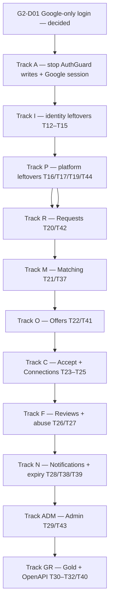

# Karat Hive — Backend post-CP1 gap tasks

| | |
|---|---|
| **Product** | Karat Hive |
| **Document** | Executable task list for remaining backend work after Checkpoint 1 |
| **Status** | Working backlog. Statuses checked against the `main` working tree on 7 September 2026 (v0.7) |
| **Date** | 7 September 2026 |
| **Source snapshot** | [`backend_code_review_and_gap_report.md`](backend_code_review_and_gap_report.md) (6 Sep — historical) |
| **Plan of record (phases)** | [`Backend-Implementation-Plan.md`](Backend-Implementation-Plan.md) v0.9 (P0–P12, T01–T44). This register is the live tick list. |
| **Does not override** | SRS v1.3 (except marketplace login — [`adr/0010`](adr/0010-google-signin-only-login.md)) · API-Route-Inventory · Async-Contract · Physical-Data-Model |
| **Branch** | `main` (no extra worktree). Marketplace modules are **uncommitted** on this working tree; they are not on `origin/main`. |
| **Prefix** | `G2-*` — stable, never reused. Each row maps to an existing `Tnn` where one exists. |

This file is the work list: IDs, order, files, acceptance. Do not invent routes, fields, states, or error codes that are not in the inventory. A new route or code is allowed only after the matching **open decision** is recorded and the inventory is amended.

**Current tree (7 Sep 2026):** Checkpoint-1 vendor onboarding and admin taxonomy are **committed** on `main`. Marketplace modules and Google-session Track A work exist as **uncommitted** files on the same `main` working tree. Track A is closed (D02 catalogue, KH-token-only guard, Flutter exchange, Vendor Google completer, password/OTP LOGIN removed, repair script). Identity leftovers (sessions / mobile / deactivate / deletion), P9 residuals, P10 notify dispatcher, and P12 gold-rate/OpenAPI remain. Use [§ Remaining to close](#remaining-to-close) as the live punch list.

---

## How to execute

Track A closed. Wave-1 + wave-2 closed most remaining punch-list rows. Still open: **G2-GR06–GR09** (contract/masking-CI/machines/perf), **G2-I13** (Google IT), **G2-D04** `[BLOCKED]`. C06 stays mocked. Commercial spine and new modules are on disk, uncommitted.

**Gates.**

| Gate | Passes when |
|---|---|
| A | `AuthGuard.canActivate` performs no inserts/updates. Unbound Firebase token does not create a `User`. Unit tests in `auth.guard.spec.ts` and `session.query.spec.ts` cover the rejected paths. |
| I | Google → session → register Customer or Vendor with terms + real mobile → `GET /v1/me` returns the matching profile. No auto-created Vendor. |
| R | Publish refused if the Customer has no Google binding (`403 OAUTH_REQUIRED`). Draft never appears in any Vendor query. |
| C | Two concurrent accepts → exactly one Connection and one `409 OFFER_ALREADY_ACCEPTED` (`test/concurrency/accept.spec.ts`). |
| GR | Generated OpenAPI diffs in CI (`NFR-030`). Masking suite fails the build on a leaked identity key. |

---

## Open decisions — do not implement around these

Do not silently resolve these by inference. They are recorded as open on purpose.

| ID | Decision | Blocks | Status |
|---|---|---|---|
| **G2-D01** | Login | Track A path | **Decided 6 Sep 2026.** Google is the **only** login for Customer, Vendor, and Admin ([`adr/0010`](adr/0010-google-signin-only-login.md)). Path B (OTP/password login) is **n/a**. |
| **G2-D02** | API list + error codes for the Google session route | — | **Done** (inventory v0.2 / `AD-API-13`). Unbound token → `401 UNAUTHENTICATED`. |
| **G2-D03** | T36 extra columns | — | **Decided.** Columns are in the schema. Jobs that use them are **open**, not blocked. Do not revert the init migration. |
| **G2-D04** | Yahoo Finance redistribution terms for **end-user display**. | Populating `GET /v1/gold-rates.rates` in production | **Still blocked** on Legal. Ship ingest + Admin override + `goldRates.endUserDisplay` flag. Until then, `available: false, reason: "DISPLAY_NOT_LICENSED"`. |
| **G2-D05** | SAM-GAP-7 (who may set categories) | Replacing the current guard | **Decided: keep the API list** (active-only). Code that lets a verified Vendor set categories is a **temporary shortcut**. How first activation works after the shortcut is removed is **open**. |
| **G2-D06** | Admin login | G2-I05, G2-I06, G2-I12 | **Decided 6 Sep 2026.** Admin uses Google only (`adr/0010`). No Admin password. No platform 2FA. Admin still cannot self-register. |

Already closed and not reopened: Admin Portal = Flutter Web (`C-10`). Object storage = R2 + MinIO (`C-13`). Supabase Data API locked down (`adr/0009`). Password hashing = scrypt (`AD-BE-16`).

---

## Review of the source report

The 6 Sep snapshot was right **then**: P0–P5 (minus leftovers) on disk; P6–P12 stubs; Firebase path writing Users inside the guard. The 7 Sep working tree has closed most of those defects. The table below is history — do not re-implement a struck finding.

### Accepted (verified against `backend/src` on 6 Sep 2026; status now)

| Report finding | Evidence (6 Sep) | Lands in | 7 Sep working tree |
|---|---|---|---|
| `AuthGuard` writes inside `canActivate` | `auth.guard.ts` called `findOrCreateUserForFirebase` | G2-A01 | **Closed.** Guard is lookup-only. |
| Hardcoded `userType: 'VENDOR'` + synthetic `VendorProfile` | `session.query.ts` (`PENDING_<uid>`, `+365d` licence) | G2-A06 | **Closed.** Unbound token → 401, no insert. |
| Fallback mobile `+fb_${uid}` is not E.164 | synthetic mobile | G2-A03, G2-A07 | **Closed in code.** Repair script for already-written rows is still G2-A07. |
| Unverified Firebase email can bind an existing account | email match without `emailVerified` | G2-A02 | **Closed.** Match requires `emailVerified === true`. |
| Terms/privacy null on auto-provision | `user.create` omitted terms | G2-A09 | **Closed.** No auto-provision; register stamps terms. |
| `MeService` / `presentMe` have no `customer` branch | presenter | G2-I03 | **Closed.** Customer branch + `liveRequestCount` / `canCreateRequest`. |
| `SessionQuery` named as a read, performs writes | `session.query.ts` | G2-A04 | **Closed.** Writes live in `OAuthAccountService`. |
| `isFirebaseToken` is `alg === 'RS256'` only | `token.service.ts` | G2-A05 | **Closed.** Issuer must be `securetoken.google.com`. |
| 11 domain modules are `.gitkeep` stubs | empty folders | Tracks R–GR | **Stale.** All except `gold-rate` have implementations (uncommitted). |
| `GET /v1/platform-config` missing | no handler | G2-P01 | **Closed.** |
| OTP request schema omits `REGISTER_CUSTOMER` | purpose enum | G2-I01 | **Closed.** Enum includes `REGISTER_CUSTOMER`. |

### Corrected

| Report claim | Correction |
|---|---|
| TSK-BE-01…27 as the work list | Too coarse (one ID = entire P6). Split into `G2-*` with files and acceptance. Map onto existing **T12–T44**; do not run a parallel ID universe. |
| `POST /v1/auth/firebase/session` as required work | **Now required** (`adr/0010`). Still missing from the API list — **G2-D02** must add it before the handler. |
| `ONBOARDING_REQUIRED` as the AuthGuard miss | Not in inventory §5. Either amend the catalogue or use `UNAUTHENTICATED`. |
| T15 “sessions / me / settings / shell guard = done” (Implementation Plan) | Overstated on 6 Sep. As of 7 Sep: Customer `me`, settings, and devices exist. Sessions list/delete, mobile change, deactivate, deletion still do **not**. Track I. |
| “11 of 16 modules empty” | Was accurate on 6 Sep. 7 Sep working tree implements all of them except `gold-rate` (still empty). |
| Dual-token mode (HS256 + RS256) on every request | Transition only. Session-exchange route exists (G2-A10). **G2-A12 is still open:** the guard still accepts a Firebase bearer on domain routes. Flutter still sends the Firebase ID token (G2-A14). |
| AuthGuard 60 s `UserForViewer` cache | **Rejected.** Architecture §14.2: volatile authorisation is cached **within the request only**. A TTL cache would delay `FR-ADM-016` suspension. Request-scoped memoisation of the User row is already implied; do not add a process cache. |
| Storage path-traversal task | Report itself notes `randomUUID()` keys are safe. No task. |
| All 15 jobs as one task (TSK-BE-26) | Jobs land **with their domain phase** (Implementation Plan scheduled-job table). Track-local job rows below. |
| Admin operations “10%” | Was true on 6 Sep (taxonomy only). 7 Sep working tree has Admin customers/vendors/KYC/requests/offers/connections/reviews/abuse/announcements/exports/audit/notes/admins. Gold-rate Admin routes are still 0%. |

### Dropped from the work list (not defects)

- Fastify-vs-Express throughput note.
- Redundant `TokenService.isFirebaseToken` wrapper — fold into G2-A05 if touching the file, not a standalone ID.
- Re-stating P0/P1 spine work (outbox, job_lock, audit, idempotency, rate-limit, masking). That is done (`T01–T11`, `T33–T35`, F01–F17).

---

## Remaining to close

Do these in this order. Struck rows are implemented on the `main` working tree (uncommitted unless noted). Open rows have no matching handler/job, or fail the stated acceptance.

| ID | Track | Task | Why it is still open |
|---|---|---|---|
| ~~G2-D01~~ | D | Google is the only marketplace login | **Decided** — [`adr/0010`](adr/0010-google-signin-only-login.md) |
| ~~G2-D02~~ | D | Add the Google session route to the API list | **done** — inventory v0.2 / `AD-API-13` |
| ~~G2-D06~~ | D | Admin login is Google only | **Decided** — [`adr/0010`](adr/0010-google-signin-only-login.md) |
| ~~G2-A01~~ | A | AuthGuard read-only | Guard performs no inserts |
| ~~G2-A02~~ | A | Require `emailVerified` before email match | Match requires `claims.emailVerified === true` |
| ~~G2-A03~~ | A | Refuse non-E.164 mobile | `+fb_` fallback removed; no auto-provision |
| ~~G2-A06~~ | A | Stop Vendor auto-provision | Unbound token → `401 UNAUTHENTICATED` |
| ~~G2-A07~~ | A | Repair already-written auto-provision rows | **done** — `npm run repair:auto-provision` |
| ~~G2-A12~~ | A | Domain routes accept only the Karat Hive access token | **done** — Firebase bearer → 401 on domain routes |
| ~~G2-A14~~ | A | Flutter calls the session route, then sends the KH token | **done** — mobile + admin exchange then KH token |
| ~~G2-A15~~ | A | Remove leftover password login / OTP `LOGIN` | **done** — password route + OTP LOGIN removed |
| ~~G2-I02~~ | I | `POST /v1/auth/register/customer` | Handler on disk (Google token or OTP) |
| ~~G2-I04~~ | I | Sessions list/delete | **done** — `GET/DELETE /v1/auth/sessions` |
| ~~G2-I07 / I08 / I09~~ | I | Mobile change, deactivate, deletion-request | **done** (wave-1) |
| ~~G2-P01~~ | P | `GET /v1/platform-config` | Handler on disk |
| ~~G2-P02~~ | P | Media EXIF/scan/thumbnail worker | **done** (wave-2) |
| ~~G2-P07~~ | P | Vendor performance CSV export | **done** (wave-1) |
| ~~G2-R05~~ | R | Publish + OAuth gate | Handler on disk |
| ~~G2-M06~~ | M | Real dashboard counts | **done** (wave-1) |
| ~~G2-C01~~ | C | Accept transaction | Handler on disk (`FOR UPDATE` + one Connection) |
| ~~G2-C06~~ | C | Concurrent-accept test | File exists; mocked, not a live-Postgres race |
| ~~G2-C05 / C07~~ | C | `connectionId?` on Customer Request; `BR-007` scoped-reveal test | **done** (wave-1) |
| ~~G2-F03~~ | F | `rating-reconcile` job | **done** (wave-1) |
| ~~G2-N02 / N03~~ | N | 21-event notification dispatcher + FCM/APNs | **done** (wave-2; APNs HTTP/2 send stubs) |
| ~~G2-N06~~ | N | Full retention purge | **done** (wave-1) — notifications + orphan media + idempotency_key |
| ~~G2-GR01–GR05~~ | GR | Gold-rate ingest/display/Admin + OpenAPI | **done** (wave-2; display stays `DISPLAY_NOT_LICENSED`) |
| **G2-GR06–GR09** | GR | Contract, masking CI gate, exhaustive machines, perf | `test/contract/` and `test/performance/` empty |
| **G2-D04** | D | Yahoo end-user display | `[BLOCKED]` on Legal |
| **G2-I13** | I | Customer Google round-trip IT | Still open |

---

## Constraints (do not reopen)

Copied from the Implementation Plan so this file is executable on its own. Later documents may not contradict these.

- No Redis, Kafka, Elasticsearch (`C-12`). Outbox + `job_lock` + `rate_limit_bucket` in PostgreSQL.
- Masked identity fields **absent** from JSON, not null (`BR-006`, `FR-SYS-003`).
- Acceptance is one transaction: accept + reject competitors + Connection + reveal (`BR-011`–`BR-013`).
- State transitions are `POST` sub-resources, never a `PATCH` of `state`.
- Admin only under `/v1/admin`. Non-Admin token → `404` (`AD-API-01`).
- Type Subscriptions Admin-granted, no checkout (`AD-API-04`).
- Offer `validity_hours` ∈ {12, 24, 48} (`AD-API-07`).
- WhatsApp is a `wa.me` URL + `CONTACT_EVENT`. No Business API (`C-03`). Number normalised once at profile capture (Architecture §15.5).
- Yahoo end-user **display** remains `[BLOCKED]`; ingest + Admin override + bullion floor still ship.
- Module boundaries: own tables, public `index.ts` only, acyclic graph, notifications via outbox.
- `CONTEXT.md` vocabulary in code and JSON: Request, Offer, Connection, Talk — never listing, bid, or chat.

---

## Already committed on `main` — do not rebuild

| Area | Status | Residual |
|---|---|---|
| P0 scaffold, toolchain, CI | T01–T04, T33–T35 done | OpenAPI generator is T31 / G2-GR05 |
| P1 platform spine | T05–T11, F01–F17 done | — |
| Vendor OTP, vendor register, password login, refresh, logout | CP1-A04 done | Not the intended login (`adr/0010`). Remove via G2-A15. |
| `GET/PATCH /v1/me` (vendor + admin branches) | CP1-A04f done | Customer branch is in the working tree (G2-I03), not in the last commit |
| Taxonomy public + admin CRUD + seeds | T16 / CP1-A03 done | Config route is in the working tree (G2-P01) |
| Media KYC path (intent / complete / delete, local + Supabase) | T17 partial | EXIF/scan/thumbnail worker still G2-P02 |
| Vendor profile, documents, categories/regions, availability, dev-verify, shell guard | T18 done | Dashboard counts still zeros (G2-M06) |
| Masking interceptor + identity-key scan | F12 done | Full release-gate still T32 / G2-GR07 |

## On disk, uncommitted on `main` — do not rebuild

Marketplace modules and identity fixes below exist as untracked/modified files. They are **not** on `origin/main`. Commit them; do not start a second copy.

| Area | Evidence |
|---|---|
| Google session + read-only guard | `POST /v1/auth/google/session`, `/firebase/session`; `OAuthAccountService`; `SessionQuery` lookup-only |
| Customer register + Customer `me` | `POST /v1/auth/register/customer`; `customer` on `GET /v1/me` |
| Platform-config, settings, devices, subscriptions | `GET /v1/platform-config`; `GET/PATCH /v1/me/settings`; `POST/DELETE /v1/devices`; `GET /v1/me/subscriptions` + Admin grant |
| P6–P9 spine | requests, matching, offers, connections; accept uses `SELECT … FOR UPDATE` |
| P10–P11 | reviews, abuse, notifications centre, Admin lists/actions/exports/announcements |
| Jobs in `main.ts` | offer/request expiry + warnings, draft purge, vendor-document expiry, notification retry, retention purge (notifications only), announcement dispatch |

---

## Full task register

Status values: **done** · **open** · **blocked** (named decision or task) · **n/a** (other path of G2-D01).

Files are starting points, not a closed set. Acceptance is the merge bar.

### Track D — Decisions

| ID | Task | Acceptance | Status | Maps to |
|---|---|---|---|---|
| G2-D01 | Product Owner: Google Sign-In vs OTP/password login. | [`adr/0010`](adr/0010-google-signin-only-login.md): Google is the **only** login (Customer, Vendor, Admin). | **done** | — |
| G2-D02 | API list §8 + §5 + `error-codes.ts` + `error-messages.ts` (`en`/`ar`) updated in the same change as the Google session handler. | New route and codes appear in the inventory before the controller. No handler-only codes. | **done** (inventory v0.2 / `AD-API-13`; unbound uses existing `UNAUTHENTICATED`) | AD-API-13 |
| G2-D03 | T36 extra columns. | Columns are in the schema. Jobs unblocked. No init-migration revert. | **done** | T36 |
| G2-D04 | Legal: Yahoo redistribution. | Flag `goldRates.endUserDisplay` remains false until signed. | `[BLOCKED]` | T30 |
| G2-D05 | SAM-GAP-7: keep the API list (active-only). Code shortcut stays until replaced. | API list not edited. Guard may keep admitting `VERIFIED` until a later task replaces it. | **done** (shortcut accepted as temporary) | T18 |
| G2-D06 | Admin login: Google vs email + password + 2FA. | Google only. No password. No platform 2FA. No self-register. | **done** | T13 |

---

### Track A — Firebase / AuthGuard defects

Stop the bleeding first (A01–A09). Then Google session (A10–A13). Path B is **n/a**.

#### A1 — Stop writing in the guard

| ID | Task | Files | Acceptance | Status | Maps to |
|---|---|---|---|---|---|
| G2-A01 | `AuthGuard.canActivate` is read-only. Remove `findOrCreateUserForFirebase`. Firebase (RS256) tokens: verify signature/claims, then **lookup** `OauthBinding` / `User`. Miss → 401 (`UNAUTHENTICATED`, unless D02 adds another code). | `backend/src/edge/auth/auth.guard.ts`, `auth.guard.spec.ts` | Guard tests assert `prisma.user.create` is never called. Concurrent `GET /v1/me` with a new Firebase token creates **zero** users. | **done** | T10 |
| G2-A02 | Email match requires `claims.emailVerified === true`. Phone match requires the Firebase `phone_number` to pass E.164. | `session.query.ts` (or the extracted service), spec | Unverified-email token does not bind to an existing User. Verified-email match still upserts `OauthBinding`. | **done** | T14 |
| G2-A03 | Delete `+fb_${uid}` fallback. Provisioning (wherever it lives after A04) refuses missing/invalid mobile. | `session.query.ts` | No `mobile_number` row can fail `/^\+[1-9]\d{6,14}$/`. | **done** | T12 |
| G2-A04 | Extract writes from `SessionQuery` into `OAuthAccountService` (name as a command). `SessionQuery` is lookup-only. | `identity/application/session.query.ts`, new command service, `identity.module.ts` | CQRS naming matches behaviour. Guard depends on the query only. | **done** | T10 |
| G2-A05 | `isFirebaseToken`: require `alg === RS256` **and** issuer `https://securetoken.google.com/<projectId>`. Collapse the redundant `TokenService` wrapper if the file is open. | `token.service.ts`, `firebase-token.service.ts`, specs | An RS256 JWT with a different issuer is not routed to Firebase verification. | **done** | T10 |
| G2-A06 | No code path creates `userType: 'VENDOR'` + `VendorProfile` from a Firebase token alone. Admin cannot be created from Google. | registration / oauth services | A new Google identity with no Karat Hive user does not insert `vendor_profile`. | **done** | T12 |
| G2-A07 | Repair rows already written by auto-provision: invalid `+fb_` mobiles, synthetic licences, missing terms, wrong role. One-off script or Admin-held list; do not invent a replacement phone. | `scripts/repair-auto-provision.ts`; `npm run repair:auto-provision`; seed README | Script is idempotent, dry-run capable, and refuses to UPDATE `mobile_number` to another invalid value. Product decides whether those users re-register. | **done** | — |
| G2-A08 | Regression tests for A01–A06. | `session.query.spec.ts`, `auth.guard.spec.ts`, integration if DB is up | Covers: unbound token, unverified email, verified email match, E.164 reject, no Vendor insert, issuer mismatch. | **done** (unit specs; no DB integration) | T32 |
| G2-A09 | Marketplace use requires stamped `termsVersion`, `privacyVersion`, `termsAcceptedAt`. Auto-provisioned nulls fail closed. | register handlers, Me presenter, publish gate | `POST /v1/auth/register/*` remains the only writer of those columns (plus any D02 session-completer). | **done** | T12 |

#### A2 — Google session (`adr/0010`)

Inventory lists the route (`AD-API-13`, G2-D02 **done**).

| ID | Task | Files | Acceptance | Status | Maps to |
|---|---|---|---|---|---|
| G2-A10 | `POST /v1/auth/firebase/session` `@Public @RevealsIdentity`. Verifies Google ID token; looks up binding; returns `SessionBundle`. Does **not** create a User. | `auth.controller.ts`, new application service | Unbound token → documented error (D02). Bound token → Karat Hive `SessionBundle`. Idempotent. | **done** (also `/v1/auth/google/session`; unbound → `UNAUTHENTICATED`) | T14 / T10 |
| G2-A11 | Completer: `POST /v1/auth/register/customer` and `/register/vendor` accept a verified Google identity, still requiring terms/privacy and an E.164 mobile (OTP or verified Google phone). Role is the route, never inferred. | `registration.service.ts`, Zod bodies | Terms stamped. **No Admin register via Google.** A provisioned Admin signs in with Google (email must match the Admin row). | **done** | T12 |
| G2-A12 | After exchange, domain routes accept **only** the Karat Hive access token. Google token is valid on G2-A10 only. | `auth.guard.ts` | A Google bearer on `GET /v1/me` is 401 once the client has a `SessionBundle`. | **done** | T10 |
| G2-A13 | Rate-limit the exchange route with the auth bucket. Audit `AUTH_FIREBASE_SESSION`. | rate-limit policy, audit writer | Same per-IP/per-subject limits as today’s password login. | **done** (`/v1/auth/` uses the auth bucket; audit action is `OAUTH_BOUND`, not `AUTH_FIREBASE_SESSION`) | T09 |
| G2-A14 | Flutter: after Google Sign-In, call the session route, then send the Karat Hive access token on other calls. | `apps/kh_mobile`, `apps/kh_admin` | Not a backend merge gate. Listed so it is not forgotten. Admin app uses the same Google session. | **done** | — |
| G2-A15 | Remove leftover password login, OTP `LOGIN` purpose, and Admin 2FA routes after G2-A10 works. | `auth.controller.ts` (LoginService deleted) | Those paths 404 or are deleted. Seed Admin signs in with Google. | **done** (password route + OTP LOGIN removed; 2FA routes were never built) | T13 |

#### A3 — Path B (OTP/password login) — n/a

`adr/0010` rejected this path. IDs G2-A20–A22 are **not used**. Do not implement `POST /v1/auth/oauth/bind` as a second login.

---

### Track I — Identity leftovers (P2)

`T12`/`T14` follow `adr/0010` (Google login). `T13` is **n/a** (G2-D06 done — no password, no 2FA). `T15` still partial (sessions / mobile / deactivate / deletion).

| ID | Task | Endpoint / files | Acceptance | Status | Maps to |
|---|---|---|---|---|---|
| G2-I01 | OTP request body: keep `CHANGE_MOBILE` (and Vendor register if still used for phone proof). Add `REGISTER_CUSTOMER` only if phone proof still uses OTP. **Do not** treat OTP `LOGIN` as marketplace login. | `auth.controller.ts` `otpRequestSchema` | Google is the login (`adr/0010`). OTP, if present, proves a number. | **done** | T12 |
| G2-I02 | `POST /v1/auth/register/customer` after Google (G2-A11). Body: display name, terms/privacy, real E.164 mobile (OTP or verified Google phone), `preferredLanguage`, `defaultRegionId?`. | `registration.service.ts`, presenter | One transaction: `User` CUSTOMER/`ACTIVE`, `CustomerProfile`, terms stamp, Google binding, `SessionBundle` 201. Duplicate mobile → `409 MOBILE_ALREADY_REGISTERED`. `@RevealsIdentity`. | **done** | **T12** |
| G2-I03 | `customer` branch on `GET /v1/me` and Customer fields on `PATCH /v1/me` (`displayName`, `email`, `preferredLanguage`, `defaultRegionId`, `photoMediaKey`). | `me.service.ts`, `me.presenter.ts`, `me.controller.ts` | Shape matches inventory §9 `CustomerProfile`. Email change is pending-until-verified (`emailPending` `[PROPOSED]` — implement or explicitly defer in the PR). | **done** (`liveRequestCount` / `canCreateRequest` present; PATCH omits `photoMediaKey` / `emailPending`) | T15 |
| G2-I04 | `GET /v1/auth/sessions` · `DELETE /v1/auth/sessions/{id}` | `session.service.ts`, `auth.controller.ts` | List current refresh families for the caller. Delete revokes that family. | **done** | T15 |
| G2-I05 | `POST /v1/auth/password` (set/change). | identity | **n/a** — no password login (`adr/0010`). | n/a | T13 |
| G2-I06 | `POST /v1/auth/password/reset/request` · `/confirm` (`AD-API-10`). | identity | **n/a** — no password login (`adr/0010`). | n/a | T13 |
| G2-I07 | `POST /v1/me/mobile/change` with `challengeId` purpose `CHANGE_MOBILE`. | `me.controller.ts` | New number E.164 + verified OTP. Old number released. | **done** | T15 |
| G2-I08 | `POST /v1/me/deactivate`. Customer: closes live Requests, blocks login. Vendor: `403` if an `ACTIVE` Connection exists (`[PROPOSED]` in inventory). | identity | `accountState = DEACTIVATED`. Subsequent auth → `403 ACCOUNT_DEACTIVATED`. | **done** | T15 |
| G2-I09 | `POST /v1/me/deletion-requests` + `/{id}/confirm` (`FR-CUS-004`, `NFR-019`). Refuse if a Connection was created in the last 30 days. | identity | Two-step + OTP. Worker completion may stub as queued until G2-N07. | **done** | T15 |
| G2-I10 | `GET/PATCH /v1/me/settings` (language, default region, notification preferences, quiet hours). | `modules/settings/` | Inventory §9 settings object. Quiet hours evaluated at **dispatch** time later (G2-N02), stored now. | **done** | T15 |
| G2-I11 | `POST /v1/devices` · `DELETE /v1/devices/{id}` | identity | Stores push device tokens for G2-N04. `[PROPOSED]` in inventory — implement as specified. | **done** | T15 |
| G2-I12 | Admin 2FA: `POST /v1/auth/admin/2fa/setup` · `/confirm` · `/verify`. | identity | **n/a** — no platform 2FA (`adr/0010`). | n/a | **T13** |
| G2-I13 | Customer Google round-trip integration test. | `test/integration/` | Google session → register customer → refresh → `GET /v1/me` has `customer`, no `vendor`. | open | T12 |
| G2-I14 | Surface `oauthBound` on Customer `Me` (true after Google login/completer). | `me.presenter.ts` | Publish (G2-R05) reads the binding row, not only the presenter. | **done** | T14 / T15 |

`GET /v1/me` `liveRequestCount` / `canCreateRequest` (`SAM-GAP-2`) land with G2-R02, not here.

---

### Track P — Platform leftovers (P3–P5)

| ID | Task | Endpoint / files | Acceptance | Status | Maps to |
|---|---|---|---|---|---|
| G2-P01 | `GET /v1/platform-config` from `platform_setting`. Include seed keys `legal.termsUrl`, `legal.privacyUrl`, `supportContactUrl`, `subscriptionContactUrl` (`SAM-GAP-5`). | `modules/settings/` or `taxonomy/` read; **settings owns the table** | Body matches inventory §10. Clients must not cache past `meta.serverTime + 5 min` (document in handler comment). Empty DB → 500, not invented defaults. | **done** | T16 leftover |
| G2-P02 | Media processing worker on `media.uploaded`: magic-byte inspect, EXIF strip, re-encode, thumbnail, malware stub → `READY` / `QUARANTINED`. Dev KYC shortcut may stay for `NODE_ENV!=production`. | `modules/media/`, outbox consumer | Customer Request images cannot publish while `PENDING_PROCESSING` (`MEDIA_NOT_READY`). Quarantine blocks parent (`MEDIA_QUARANTINED`). | **done** | T17 leftover · P4 #30 |
| G2-P03 | `GET /v1/me/subscriptions` read-only. | `modules/subscription/` | Empty list is valid. Shape per inventory §20. Dashboard currently returns `[]` — replace the stub. | **done** (dashboard still hard-codes `subscriptions: []` — G2-M06) | **T19** |
| G2-P04 | Admin grant/patch: `POST /v1/admin/vendors/{id}/subscriptions`, `PATCH …/subscriptions/{requestType}` (`AD-API-04`). Emit `vendor.eligibility.changed`. | `subscription/` + admin controller | No Vendor POST to subscribe. Entitlement check used by matching/offers is the real table, not a stub. | **done** | T19 |
| G2-P05 | `vendor-document-expiry` job, daily 02:00 GST. `vendor_document` within 30 days of `expiry_date` with no `reminder_sent_at` → `vendor.document.expiring`. | scheduler + vendor-onboarding | Column exists. Lease via `job_lock`. | **done** (registered in `main.ts`; cadence is 24 h from worker start, not 02:00 GST) | **T44** |
| G2-P06 | `GET /v1/me/vendor/performance` empty-safe until reviews exist; `ratingTrend[]` filled by G2-F04 (`SAM-GAP-8`). | vendor-onboarding or reviews | Does not scan other Vendors' prices (`BR-008`). | **done** | T18 leftover |
| G2-P07 | `GET /v1/me/vendor/performance/export` signed CSV in the exports bucket. | media + vendor | Own records only. Watermark + audit (`NFR-016`) can wait for G2-ADM07 if the same export pipeline is shared — say so in the PR. | **done** (direct CSV + signed URL; no shared watermark pipeline) | T18 |

---

### Track R — Requests (P6) · T20, T42

Module is implemented in the working tree (uncommitted). State machine is a pure domain function (`NFR-029`).

| ID | Task | Endpoint / files | Acceptance | Status | Maps to |
|---|---|---|---|---|---|
| G2-R01 | Request state machine: `DRAFT → PUBLISHED → OFFERS_RECEIVED → ACCEPTED → CLOSED`, plus `EXPIRED` / `CANCELLED`. Illegal transition → `409`. | `modules/requests/domain/` | Exhaustive table tests. No `PATCH` of `state`. | **done** | T20 |
| G2-R02 | `POST /v1/requests` draft. Optional attributes per type. Expose `liveRequestCount` / `canCreateRequest` on `GET /v1/me` (`SAM-GAP-2`). | controller + service | Customer only (`BR-005`). Concurrent live cap checked at publish, advertised here. | **done** | T20 · P6 #38 |
| G2-R03 | `PATCH /v1/requests/{id}`. Draft: wide. Published: `BR-014` structural fields immutable → `409 STRUCTURAL_FIELD_IMMUTABLE`. Emit `request.edited` to **pending-Offer Vendors only** (Async-Contract §11). | requests | Contact-detail scan on notes (`BR-022`) → `422 CONTACT_DETAILS_IN_TEXT`. | **done** | T20 |
| G2-R04 | `GET /v1/me/requests`, `GET /v1/requests/{id}` Customer presenter (no Vendor identity). Vendor presenter on the same GET is a **match-set** read — lands with G2-M02, still no Customer identity. | presenters | Masking suite: Vendor `mobileNumber` / `tradingName` absent from Customer payload. | **done** | T20 · P6 #41 |
| G2-R05 | `POST /v1/requests/{id}/publish` *Idempotency-Key required*. Checks: Google binding present (`403 OAUTH_REQUIRED` — login already bound it under `adr/0010`), media `READY`, bullion floor (`BULLION_BELOW_MINIMUM`), gold rate available for bullion (`503 GOLD_RATE_UNAVAILABLE` — flag-aware), concurrent live limit, contact scan. Snapshot `expires_at = published_at + lifetime` (`BR-020`, `C-07`). Outbox `request.published`. | requests | Draft never appears in Vendor queries. Idempotent replay 24 h. | **done** | T20 · P6 #39 |
| G2-R06 | `POST /v1/requests/{id}/cancel`. Refused if `ACCEPTED` (`REQUEST_NOT_CANCELLABLE`, `BR-013`). Outbox `request.cancelled`. | requests | Competing Offers terminate per SRS §5.2. | **done** | T20 |
| G2-R07 | `POST /v1/requests/{id}/duplicate` → new `DRAFT`. | requests | Copies type/attributes/media keys per inventory. | **done** | T20 |
| G2-R08 | Request media: Customer images use the Request-media bucket via existing media port (not KYC). | media + requests | `maxRequestImages` from platform-config. Unattached delete still 204. | **done** | T17 / T20 |
| G2-R09 | Draft purge job `request-draft-purge` hourly: warn 27 d (`request.draft.purge_warning`), hard-delete draft + `request_media` at 30 d (`FR-CUS-015` AC4). | scheduler | Column `draft_purge_warned_at` exists. | **done** | **T42** |
| G2-R10 | Domain tests: publish without OAuth, without READY media, bullion below floor, notes with a phone number. | `requests/*.spec.ts` | Every inventory error code in §5.3 that this phase can emit is asserted. | **done** | T20 |

---

### Track M — Matching (P7) · T21, T37

| ID | Task | Endpoint / files | Acceptance | Status | Maps to |
|---|---|---|---|---|---|
| G2-M01 | Fan-out worker on `request.published`: `VERIFIED` + `ACTIVE` + category + region + live Type Subscription (`FR-SYS-002`). `INSERT … ON CONFLICT DO NOTHING`. | `modules/matching/` consumer | Zero matches is valid (`FR-SYS-001.3`). Request stays `PUBLISHED`. | **done** | T21 · P7 #43 |
| G2-M02 | `GET /v1/matches` filters (type, karat, weight, budget), sort, `pg_trgm` search. Customer identity **absent**. | matching controller | Masking suite fails the build if Customer `mobileNumber` / `displayName` appears. | **done** | T21 · P7 #44 |
| G2-M03 | `POST /v1/matches/{requestId}/viewed`. Not a side effect of GET. | matching | Retries/prefetch do not decrement “New” twice. | **done** | T21 |
| G2-M04 | Filter presets: `GET/POST /v1/filter-presets`, `PATCH/DELETE /v1/filter-presets/{id}` (`FR-VEN-009`, `VEN-S07`). | matching | Per-Vendor. Bounded list. | **done** | T21 |
| G2-M05 | Match-set recompute on `vendor.eligibility.changed` (categories, regions, verification, subscription). Upsert `(request_id, vendor_profile_id)`. | matching consumer | A Vendor who subscribes mid-Request sees live Requests they now qualify for (`FR-SYS-002.3`). | **done** | **T37** |
| G2-M06 | Dashboard counts: new matches / pending offers become real (replace CP1 zeros) for fields this phase owns. | `GET /v1/me/dashboard` | Empty-safe. Gold rates stay null until G2-GR02. | **done** | T18 leftover |
| G2-M07 | Release-gate masking test specifically on `/v1/matches`. | `test/masking/` | Build-failing (`NFR-013`). | **done** (presenter-level `matches-feed-masking.spec.ts`; not an HTTP integration) | T21 · P7 #46 |

---

### Track O — Offers (P8) · T22, T41

| ID | Task | Endpoint / files | Acceptance | Status | Maps to |
|---|---|---|---|---|---|
| G2-O01 | Offer state machine SRS §5.3 as a pure function. | `modules/offers/domain/` | Illegal transition 409. | **done** | T22 |
| G2-O02 | `POST /v1/requests/{id}/offers` *Idempotency-Key required*. Subscription + in match set + `BR-009` one pending + note scan + validity clamp to `{12,24,48}` and Request remaining life. | offers | Second pending → `409 OFFER_ALREADY_PENDING`. Not in match set → `403 NOT_IN_MATCH_SET`. No subscription → `403 SUBSCRIPTION_REQUIRED`. | **done** | T22 · P8 #47 |
| G2-O03 | `POST /v1/offers/{id}/revise` *Idempotency-Key required*. Writes `offer_revision`. Max 3 → `OFFER_REVISION_LIMIT`. | offers | `GET /v1/offers/{id}` is the current-terms snapshot `VEN-S10` reads. | **done** | T22 |
| G2-O04 | `POST /v1/offers/{id}/withdraw`. | offers | Terminal; Vendor may then submit a new Offer if the Request is still open (SRS). | **done** | T22 |
| G2-O05 | `GET /v1/requests/{id}/offers` Customer presenter (Vendor identity masked). `viewedByCustomerAt` + `unreadOfferCount` on `RequestForCustomer` (`SAM-GAP-1`). | presenters | Competing Vendor terms never appear (`BR-008` is Customer-side here as identity only). | **done** (`viewedByCustomerAt` present; `unreadOfferCount` not on `RequestForCustomer`) | T22 · P8 #49 |
| G2-O06 | `GET /v1/me/offers`, `GET /v1/offers/{id}` Vendor presenter. **No competing price, terms, or identity** (`BR-008`). Offer count only. | presenters | Masking + competitor-terms suite. | **done** | T22 |
| G2-O07 | `GET /v1/offers/{id}/vendor-rating` (`FR-CUS-031`). Aggregates only. | offers / reviews | Hidden Customer ratings of this Vendor are not leaked (`BR-018`). | **done** | T22 · P8 #50 |
| G2-O08 | Offer expiry sweep `offer-expiry-sweep` at **1 min**. Synchronous expiry check on accept as well (`FR-SYS-004`). | scheduler | Pending past `expires_at` → expired. Accept of expired → `409 OFFER_EXPIRED`. | **done** | T22 · P8 #51 |
| G2-O09 | `offer-expiry-warning` at 5 min, once, within 6 h of `expires_at` (`FR-VEN-013` AC4). | scheduler | Column `expiry_warned_at` exists. | **done** | **T41** |

---

### Track C — Acceptance and Connections (P9) · T23–T25

Commercial spine. The phase is not done without G2-C06.

| ID | Task | Endpoint / files | Acceptance | Status | Maps to |
|---|---|---|---|---|---|
| G2-C01 | `POST /v1/offers/{id}/accept` *Idempotency-Key required*, body `confirmation: REVEAL_AND_CONNECT`. `SELECT … FOR UPDATE` on Request. One transaction: Offer `ACCEPTED`, Request `ACCEPTED`, other `PENDING` → `REJECTED`, insert Connection with `identity_revealed_at = now()`, audit `IDENTITY_REVEALED`, outbox notifications for winner and rejected Vendors. | `modules/connections/` + offers | Exactly one Connection. Masked fields become present **only** on this Connection's presenters (`BR-007`). | **done** | **T23** · P9 #52–54 |
| G2-C02 | `POST /v1/offers/{id}/decline` with optional `DeclineReason`. | offers | Request stays open. Offer terminal. | **done** | T23 |
| G2-C03 | `GET /v1/me/connections`, `GET /v1/connections/{id}` with `talk.waUrl` from the **already-normalised** E.164 number (Architecture §15.5). `@RevealsIdentity`. | connections presenter | No WhatsApp Business API. No conversation content. Tap-to-call and copyable-number fallbacks in the payload as specified. | **done** | **T24** |
| G2-C04 | `POST /v1/connections/{id}/close`; `POST …/contact-events` (channel + time only — `NFR-017`). Close emits `connection.closed` (P10 review prompt). | connections | `CONNECTION_CLOSED` on Talk after close. | **done** | T24 · P9 #57 |
| G2-C05 | `connectionId?` on `RequestForCustomer` when `state = ACCEPTED` — presenter join on unique `connection.offer_id`, no new column (`SAM-GAP-3`). | requests presenter | `CUS-S10` can deep-link. | **done** | T24 |
| G2-C06 | Concurrency test: two simultaneous accepts → one Connection + one `409 OFFER_ALREADY_ACCEPTED`. | `backend/test/concurrency/accept.spec.ts` | **Merge gate for this track.** | **done** (mocked `FOR UPDATE` simulation; not a live-Postgres race) | **T25** |
| G2-C07 | Reveal is scoped to this Connection. A second Request between the same parties starts masked. | masking + connections tests | `BR-007` asserted, not assumed. | **done** | T24 |

---

### Track F — Reviews and abuse (P10) · T26, T27

| ID | Task | Endpoint / files | Acceptance | Status | Maps to |
|---|---|---|---|---|---|
| G2-F01 | `POST /v1/connections/{id}/reviews` → `PENDING_MODERATION`. One per party (`BR-017`). Author must be a party (`BR-016`). | `modules/reviews/` | `409 REVIEW_ALREADY_EXISTS`. Customer review shows `displayName` only. | **done** | T26 |
| G2-F02 | `GET /v1/me/reviews`; `PATCH /v1/reviews/{id}` within 14 days; `POST …/withdraw`; Vendor `POST …/response`; `POST …/flag`. | reviews | `REVIEW_EDIT_WINDOW_CLOSED` after 14 d. | **done** | T26 |
| G2-F03 | Rating aggregation worker on `review.published` / `review.moderated` + 5 min reconcile (`rating-reconcile`). Full recompute. Emits 6-month `ratingTrend[]` (`SAM-GAP-8`). Customer ratings hidden from other Customers (`BR-018`). | reviews worker | Idempotent. Feeds G2-P06 and G2-O07. | **done** (`rating-reconcile` 5 min job + inline recompute) | T26 · P10 #60 |
| G2-F04 | `POST /v1/abuse-reports`. Reporter identity withheld. | `modules/abuse/` | Presenter omits reporter. | **done** | **T27** |
| G2-F05 | `SAM-GAP-4`: screens report a Vendor or Customer with no Request/Offer/Connection in hand. Schema enum already has `VENDOR` and `CUSTOMER`. | schema + abuse | Report API accepts those types. | **done** | T27 / T36 |

---

### Track N — Notifications and expiry (P10) · T28, T38, T39

Notification **bodies** are `Notification-Catalogue.md` (sequence doc #4, not yet written). Ship placeholder EN/AR strings. Do not invent final copy.

| ID | Task | Endpoint / files | Acceptance | Status | Maps to |
|---|---|---|---|---|---|
| G2-N01 | In-app centre: `GET /v1/notifications`, `POST …/{id}/read`, `POST …/read-all`, `GET …/unread-count`. | `modules/notifications/` | Persist **regardless of push** (`FR-SYS-008.6`). | **done** | T28 · P10 #62 |
| G2-N02 | Dispatcher consumes the 21 Async-Contract events. Quiet hours + preferences evaluated at **dispatch**, not enqueue, except critical (`FR-SYS-008.2`). | notifications consumer | Unknown event type → `logger.warn` (already the outbox behaviour). Placeholder copy keyed by event name. | **done** | T28 |
| G2-N03 | Push port + FCM/APNs adapters. Stub OK if credentials absent; in-app still written. | `platform/ports` + adapters | No new datastore. Device tokens from G2-I11. | **done** (FCM/APNs stub without credentials; APNs HTTP/2 send not fully wired) | T28 |
| G2-N04 | `notification-retry` 1 min: `notification_delivery` `FAILED` and `attempt < 3`. Distinct from outbox drain. | scheduler | Schema columns exist. | **done** (job registered; retry marks `DELIVERED` without a real push) | **T38** |
| G2-N05 | Request expiry warning (T−6 h, 5 min job) + hard expiry 48 h (1 min job) (`FR-SYS-005`, `C-07`). | scheduler + requests | Countdown at zero must not still read live. | **done** | T28 · P10 #63 |
| G2-N06 | `retention-purge` daily 03:00 GST: notifications > 90 d, orphan media > 30 d, `idempotency_key` > 24 h. Audit never (`NFR-021`). | scheduler | Idempotent. Pairs with G2-I09. | **done** | **T39** |

---

### Track ADM — Admin (P11) · T29, T43

Taxonomy CUD is **done** (Checkpoint 1). Non-Admin on `/v1/admin` → `404` is **done**. Gold-rate Admin routes are still open (G2-GR03). The rest of inventory §21 is on disk, uncommitted.

| ID | Task | Endpoint / files | Acceptance | Status | Maps to |
|---|---|---|---|---|---|
| G2-ADM01 | Dashboard `GET /v1/admin/dashboard` via **named read-only views** owned by source modules (Architecture §7.3 exception). | `modules/admin/` + views | Ranges `TODAY\|7D\|30D\|90D\|CUSTOM`. `FR-ADM-003`–`009`. | **done** (GET exists; inline Prisma counts, not named views; no range query) | T29 · P11 #65 |
| G2-ADM02 | Customers: list/detail/suspend/reactivate/erasure. | admin | Erasure completion certificate via exports (G2-ADM07). | **done** | T29 · #66 |
| G2-ADM03 | Vendors: list/detail, KYC signed URL (audited, `NFR-015`), verification queue, verify/reject/request-info (writes `verificationMessage`, `SAM-GAP-6`), activate/suspend/reactivate/deactivate. Reuse `markVerified` from vendor-onboarding. | admin + vendor-onboarding public API | Dev-verify is not the production path (`BR-003`). | **done** | T29 · #67 |
| G2-ADM04 | Requests / Offers / Connections oversight; `POST /v1/admin/requests/{id}/remove`; Admin close Connection. | admin | Presenters may reveal identity (`@RevealsIdentity`). | **done** | T29 · #68 |
| G2-ADM05 | Review moderation: list/approve/reject/redact. | admin + reviews | Feeds G2-F03. | **done** | T29 · #70 |
| G2-ADM06 | Reports `GET /v1/admin/reports/{name}`; `POST /v1/admin/exports` + `GET …/exports/{id}`. Watermark + audit (`NFR-016`). | admin | Async. No PII in the filename. | **done** | T29 · #71 |
| G2-ADM07 | Announcements create/list/cancel. **No preview endpoint** unless reversing Async-Contract §11 (`SAM-GAP-10`). | admin | Cancel only before dispatch. | **done** | T29 · #72 |
| G2-ADM08 | `announcement-dispatch` 1 min job. Dispatch guard + `announcement.scheduled`. Audience count computed **at dispatch**. Guard: `dispatch_stats IS NULL` (column exists). | scheduler | Do not add a preview endpoint (`SAM-GAP-10` / Async-Contract §11). | **done** | **T43** |
| G2-ADM09 | `GET /v1/admin/settings`, `PATCH /v1/admin/settings/{key}` (`BR-020` — no retroactive rewrite of live Requests/Offers). Includes gold-rate poll interval and staleness threshold (`SAM-GAP-11`). | settings | Changes audit. | **done** | T29 · #72 |
| G2-ADM10 | Abuse queue list/detail/resolve. | admin + abuse | Reporter remains masked. | **done** | T29 |
| G2-ADM11 | `GET /v1/admin/audit-log` rows carry `before` / `after` / `ip` / `userAgent` in full (`SAM-GAP-12`). Add `GET …/audit-log/{id}` only if the list row cannot. | admin + audit | Append-only; no update/delete path. | **done** (list returns full `auditLog` rows; no `{id}` route) | T29 |
| G2-ADM12 | Admin user provisioning: list/create/suspend/revoke. Coarse role (`AD-API-03`). No self-register. Unauthenticated `POST /v1/auth/register/admin` → `404 ADMIN_SELF_REGISTRATION_FORBIDDEN` (add code to catalogue if missing from `error-codes.ts`). | admin + identity | Create stores the Admin email they will use with Google. No password in the body. No password-reset route. | **done** | T29 · #72 |
| G2-ADM13 | `POST /v1/admin/{collection}/{id}/notes` (`AD-API-12`). | admin | `[PROPOSED]` — implement as specified. | **done** | T29 · #73 |

---

### Track GR — Gold rate, OpenAPI, release gates (P12) · T30–T32, T40

| ID | Task | Endpoint / files | Acceptance | Status | Maps to |
|---|---|---|---|---|---|
| G2-GR01 | Gold-rate poll port + Yahoo adapter, 15 min, `job_lock` `gold-rate-poll`. Upsert `(purity_karat, source, source_timestamp)`. Never fabricate `0`. | `modules/gold-rate/` | Last-good retained; stale marked. Manual override still works if the adapter is down. | **done** | **T30** · #74 |
| G2-GR02 | `GET /v1/gold-rates`. Feature flag `goldRates.endUserDisplay`. Until G2-D04, `available: false, reason: "DISPLAY_NOT_LICENSED"`. | gold-rate | Bullion publish (G2-R05) uses ingest availability, not the display flag. | **done** | T30 |
| G2-GR03 | Admin `GET /v1/admin/gold-rates`, `/history`, `POST /v1/admin/gold-rates/override` (reason + expiry). Not display-gated. | admin + gold-rate | `FR-ADM-031`. | **done** | T30 |
| G2-GR04 | `gold-rate-stale-alert` 15 min, de-duplicated, Admin after 2 h of ingestion failure. | scheduler | `FR-SYS-010.5`. | **done** | **T40** |
| G2-GR05 | Generate OpenAPI from Nest/Zod into `backend/openapi/`. CI diff (`NFR-030`). Zod remains the single source of shape. First commit diffs against the inventory, not against empty. | T31 leftover from T35 | Generator chosen and wired. | **done** (`openapi:generate` / `openapi:check`; success bodies still placeholder) | **T31** |
| G2-GR06 | Contract tests: every inventory route, every role, closed error catalogue. | `test/contract/` | No handler invents a code outside `ErrorCode`. | open | T32 · #76 |
| G2-GR07 | Masking suite as a **build-failing** CI gate (`NFR-013`). | `test/masking/` + `backend.yml` | Already has unit coverage; this is the release gate. | open | T32 · #77 |
| G2-GR08 | Exhaustive state-machine tests Request / Offer / Vendor / Connection — legal and every illegal 409 (`NFR-029`). | domain specs | Vendor machine already exists from CP1; extend, do not fork. | open (Request/Offer/Vendor specs exist; Connection machine has no spec) | T32 · #78 |
| G2-GR09 | Performance tests for the six hot paths (Physical-Data-Model §6) **after** a production-scale seed. May trail functionally. | `test/performance/` | Not a P9 gate. | open | T32 · #79 |

---

## Scheduled-job coverage

Same 15 jobs as Implementation Plan / Async-Contract §6. Outbox drain is already P1. The rest:

| Job | `job_lock` key | Cadence | Task | 7 Sep |
|---|---|---|---|---|
| Outbox drain | — (`SKIP LOCKED`) | 5 s | done (T05) | **done** (committed) |
| Media processing | — (event) | on `media.uploaded` | **G2-P02** | **done** |
| Vendor document expiry | `vendor-document-expiry` | Daily 02:00 GST | **G2-P05** (T44) | **done** (registered; not pinned to 02:00 GST) |
| Draft purge | `request-draft-purge` | Hourly | **G2-R09** (T42) | **done** |
| Match-set recompute | — (event) | on `vendor.eligibility.changed` | **G2-M05** (T37) | **done** (outbox consumer) |
| Offer expiry sweep | `offer-expiry-sweep` | 1 min | **G2-O08** | **done** |
| Offer expiry warning | `offer-expiry-warning` | 5 min | **G2-O09** (T41) | **done** |
| Rating reconcile | `rating-reconcile` | 5 min | **G2-F03** | **done** |
| Notification retry | `notification-retry` | 1 min | **G2-N04** (T38) | **done** |
| Request expiry sweep | `request-expiry-sweep` | 1 min | **G2-N05** | **done** |
| Request expiry warning | `request-expiry-warning` | 5 min | **G2-N05** | **done** |
| Retention purge | `retention-purge` | Daily 03:00 GST | **G2-N06** (T39) | **done** |
| Announcement dispatch | `announcement-dispatch` | 1 min | **G2-ADM08** (T43) | **done** |
| Gold rate poll | `gold-rate-poll` | 15 min | **G2-GR01** | **done** |
| Gold rate stale alert | `gold-rate-stale-alert` | 15 min | **G2-GR04** (T40) | **done** |

None of the fifteen may fire in a `KH_ROLE=api` process. `outbox-drain` is not lease-based.

---

## Mapping to T01–T44

IDs are not replaced. This register **splits** the pending/partial T-rows.

| T ID | This register (7 Sep working tree) | Open G2 leftovers |
|---|---|---|
| T01–T11, T33–T35 | **done** (committed) | — |
| T12 | **done** except round-trip IT | G2-I13 |
| T13 | n/a (`adr/0010`); leftover password path removed | G2-A15 **done** |
| T14 | **done** | — |
| T15 | **done** except I13 IT | G2-I13 |
| T16 | **done** | — |
| T17 | **done** (uncommitted) | — |
| T18 | **done** | — |
| T19 | **done** | — |
| T20 | **done** (uncommitted) | — |
| T21 | **done** (uncommitted) | — |
| T22 | **done** (uncommitted) | — |
| T23 | **done** (uncommitted) | — |
| T24 | **done** (uncommitted) | — |
| T25 | **done** (mocked concurrency spec) | — |
| T26 | **done** (uncommitted) | — |
| T27 | **done** (uncommitted) | — |
| T28 | **done** (uncommitted) | — |
| T29 | **done** (uncommitted; gold-rate Admin is T30) | — |
| T30 | **done** (uncommitted; display still licensed-off) | G2-D04 |
| T31 | **done** (uncommitted) | — |
| T32 | pending (A08 unit specs done) | G2-GR06–GR09 |
| T36 | **done** (columns in schema) | G2-D03 |
| T37 | **done** (uncommitted) | — |
| T38 | **done** (uncommitted) | — |
| T39 | **done** (uncommitted) | — |
| T40 | **done** (uncommitted) | — |
| T41 | **done** (uncommitted) | — |
| T42 | **done** (uncommitted) | — |
| T43 | **done** (uncommitted) | — |
| T44 | **done** (uncommitted) | — |

Report IDs `TSK-BE-01`–`TSK-BE-27` are **retired**. Do not allocate new work to them.

| Retired | Replacement |
|---|---|
| TSK-BE-01 | G2-D01, G2-A01–A14 (A20–A22 unused) |
| TSK-BE-02 | G2-I01–I03 |
| TSK-BE-03 | G2-P01 |
| TSK-BE-04–07 | G2-R01–R10 |
| TSK-BE-08–10 | G2-M01–M07 |
| TSK-BE-11–13 | G2-O01–O09 |
| TSK-BE-14–17 | G2-C01–C07 |
| TSK-BE-18–21 | G2-F01–F05, G2-N01–N04 |
| TSK-BE-22–24 | G2-ADM01–ADM13 |
| TSK-BE-25–27 | G2-GR01–GR09 + per-phase jobs |

---

## Explicitly not in this list

- Flutter / Admin Portal implementation (except G2-A14 as a reminder).
- Admin data grid build-vs-buy (`AD-FE-12`).
- Docker as a required local dependency.
- In-app WhatsApp, payment/settlement, Redis/Kafka/ES.
- Super / Ops / Analyst Admin roles.
- Production Yahoo redistribution to end users (G2-D04).
- Production-scale perf seed (G2-GR09 may follow).
- Final notification copy (`Notification-Catalogue.md`).
- The QA case enumeration (`Release-Gate-Tests.md`).
- Re-opening Checkpoint 1 vendor onboarding, taxonomy, or KYC upload.
- Re-opening F01–F17 / `backend/TASKS.md` TASK-001–013.

---

## Verification per track

- Routes match the inventory (method, path, error codes).
- `CONTEXT.md` vocabulary in code and JSON.
- No masked field on the wire unless `@RevealsIdentity` and `BR-007` scopes it.
- `cd backend && npm run build && npm run lint && npm test` green.
- Every `SAM-GAP` assigned to the track is implemented or explicitly deferred in the PR description.
- After Track C: concurrency test is mandatory.

---

## Appendix — How this file relates to the others

| Document | Role after this file exists |
|---|---|
| SRS v1.3 | Still what the system must do, **except** marketplace login — that is [`adr/0010`](adr/0010-google-signin-only-login.md) until the SRS is rewritten |
| API-Route-Inventory | Still the HTTP catalogue; G2-D02 must add the Google session route. SAM-GAP-7 stays as written (active-only) |
| Backend-Implementation-Plan | Still the phase order P0–P12 and T01–T44. That file's “where the code is today” section is the 6 Sep snapshot. This register is the live tick list. |
| Backend-Gap-Fix-Plan | Closed (F01–F17). Do not append G2 IDs there |
| checkpoint-1-vendor-onboarding-tasks | Closed except deferred V01/V02 walks. Do not pull P6+ into it |
| `backend/TASKS.md` | Closed remediation of a prior quality audit (TASK-001–013) |
| `backend_code_review_and_gap_report.md` | Snapshot that prompted this register. Not the plan of record |

---

## Appendix — Revision history

| Version | Date | Change |
|---|---|---|
| 0.1 | 6 Sep 2026 | Initial register. Reviewed `backend_code_review_and_gap_report.md` against the tree, inventory, and T01–T44. Retired TSK-BE-01–27. Recorded G2-D01 as blocking. |
| 0.2 | 6 Sep 2026 | Product choices: G2-D01 done (`adr/0010` Google-only marketplace login); G2-D03 done (T36 columns); G2-D05 API list kept for SAM-GAP-7 (code shortcut temporary); G2-D06 Admin login still open. Path B n/a. Jobs unblocked. |
| 0.3 | 6 Sep 2026 | G2-D06 done: Admin Google-only. T13 / I05 / I06 / I12 n/a. G2-A15 removes leftover password login. |
| 0.4 | 7 Sep 2026 | Reticked every `G2-*` row against the `main` working tree. Marketplace modules P6–P11 (except gold-rate) and identity AuthGuard fixes are on disk, uncommitted — not a worktree. Remaining punch list: D02, A07/A11/A12/A14/A15, I04/I07–I09/I13, P02/P07, M06, C05/C07, F03, N02/N03/N06, GR01–GR09, D04. |
| 0.5 | 7 Sep 2026 | Closed Track A: G2-D02 (inventory `AD-API-13`), A07 repair script, A11 Vendor Google completer, A12 KH-token-only guard, A14 Flutter session exchange, A15 password/OTP LOGIN removed. Next: I04/I07–I09/I13, then P9 residuals. |
| 0.6 | 7 Sep 2026 | Wave-1 parallel agents: I07–I09, C05/C07, M06, P07, F03, N06 closed. I04 already done. Still open: P02, N02/N03, I13, GR01–GR09; D04 blocked. |
| 0.7 | 7 Sep 2026 | Wave-2 parallel agents: P02 media worker, N02/N03 dispatcher+push stubs, GR01–GR04 gold-rate, GR05 OpenAPI+CI. Still open: GR06–GR09, I13; D04 blocked. |