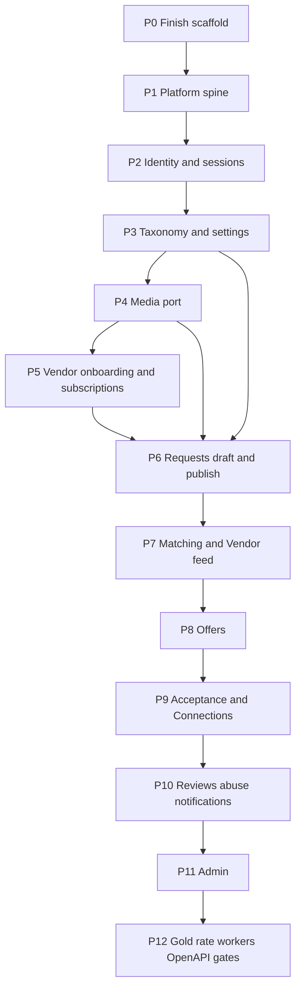

# Karat Hive — Backend Implementation Plan

| | |
|---|---|
| **Product** | Karat Hive — Digital Jewellery Marketplace |
| **Document** | Backend implementation plan and task list |
| **Version** | 0.4 |
| **Status** | Draft — working backlog. Does not override the SRS or architecture. |
| **Date** | 6 September 2026 |
| **Source of truth** | [`Requirements-Spec-v1.3.md`](Requirements-Spec-v1.3.md) · [`Architecture-Backend.md`](Architecture-Backend.md) · [`API-Route-Inventory.md`](API-Route-Inventory.md) · [`Physical-Data-Model.md`](Physical-Data-Model.md) · [`Async-Contract.md`](Async-Contract.md) (`AD-ASYNC-nn` — outbox payloads and the 15 scheduled jobs; feeds P2/P7/P10/P12, T05/T21/T23/T28) |
| **Coverage inputs** | [`Screen-API-Map.md`](Screen-API-Map.md) (`SAM-GAP-nn`) · [`Spec-Document-Sequence.md`](Spec-Document-Sequence.md) |
| **Tasks** | [§ Task list](#task-list-t01t44) · P0/P1 review fixes: [`Backend-Gap-Fix-Plan.md`](Backend-Gap-Fix-Plan.md) (F01–F17, D01–D04) · Post-CP1 executable split: [`Backend-Gap-Tasks.md`](Backend-Gap-Tasks.md) (`G2-*`) |

Build the **Node.js monolith** (`C-11`) so every route in the API inventory is implemented against PostgreSQL (`C-12`). Flutter clients are out of scope. OpenAPI is generated from this code (`NFR-030`, `AD-BE-14`).

**Local runtime: no Docker.** PostgreSQL 16 on the host. When media lands, an S3-compatible endpoint or a local-disk adapter behind the same port. `backend/docker/` stays optional and unused.

---

## Already done

Verified against the working tree, 1 Sep 2026.

| Artefact | Status |
|---|---|
| SRS v1.3, ADRs 0001–0008, Architecture-Backend, API inventory, Physical-Data-Model, Screen-API-Map, Async-Contract | Authoritative / companion |
| `backend/prisma/schema.prisma` + `docs/Physical-Data-Model.md` | Written; `prisma validate` passed |
| `backend/prisma/sql/` — `extensions.sql`, `partial-indexes.sql` (+ `README.md`) | Written, not yet folded into a named Prisma migration |
| Nest 11 + Fastify 5 + Prisma 5 + Zod `package.json`, `npm install` | Done (`node_modules` present) |
| `src/config/env.ts`, `edge/envelope.interceptor.ts`, `edge/errors/{error-codes,http-error.filter}.ts`, `edge/masking/masking.interceptor.ts`, `edge/request-id.ts`, `edge/health/health.controller.ts` | Source written |
| `src/platform/db/prisma.{module,service}.ts` (lazy connect) | Source written |
| `src/shared/{money,weight,result}.ts` | Stubs written — `Karat` / `Purity` still missing (P1 #14) |
| `backend/src/main.ts` / `app.module.ts` | Written, **not yet built or run** |
| `backend/README.md` (local Postgres, no Docker, `/health` vs `/ready`) | **Written** — P0 #6 / T04 is done bar a re-read after T01 |
| `prisma/migrations/_diff.sql` | Raw `migrate diff` dump, 1 129 lines; **not** a deployable migration folder |
| `backend/docker/` (`docker-compose.yml`, `init/01-extensions.sql`) | Present, optional, unused by the no-Docker path |
| `backend/{openapi,test/{contract,masking,concurrency,performance}}/` | Empty `.gitkeep` folders |
| The 16 `src/modules/*` domain modules | Empty `application/controller/domain/presenter/repository` folders + `.gitkeep` only |

### Not present yet — and every phase gate assumes it

The gates below say "tests green", "masking suite fails the build", "CI diff". None of that
can run today. These are **P0 work**, not P12 work.

| Missing | Consumed by | Task |
|---|---|---|
| Test runner (no `jest` / `vitest`, no `test` script in `package.json`) | Every phase gate; T25, T32 | **T33** |
| ESLint + Prettier + `eslint-plugin-boundaries`; no `lint` script | P1 #13, T11 | **T34** |
| CI workflow (no `.github/` in the repo at all) | `NFR-030` OpenAPI diff, build-failing masking gate | **T35** |
| OpenAPI generator wired to Nest/Zod (no `@nestjs/swagger` or zod-to-openapi dependency) | T31 | **T35** |
| `start:worker` sets no `APP_ROLE`; it is byte-identical to `start:prod` | P1 #8 job locking, `AD-BE-07` | **T33** |

Stray artefact: a root `package-lock.json` containing an empty `packages: {}` — an accidental
root `npm install`. Delete it; the Node tree lives under `backend/` only (backend README, §21).

---

## Constraints (do not reopen)

- No Redis, Kafka, Elasticsearch (`C-12`). Outbox + `job_lock` + `rate_limit_bucket` in PostgreSQL.
- Masked identity fields **absent** from JSON, not null (`BR-006`, `FR-SYS-003`).
- Acceptance is one transaction: accept + reject competitors + Connection + reveal (`BR-011`–`BR-013`, `FR-SYS-006`, `FR-SYS-007`).
- State transitions are `POST` sub-resources, never a `PATCH` of `state`.
- Admin only under `/v1/admin`. Coarse `role=ADMIN` (`AD-API-03`).
- Type Subscriptions Admin-granted, no checkout (`AD-API-04`).
- Offer `validity_hours` ∈ {12, 24, 48} (`AD-API-07`).
- WhatsApp is a `wa.me` URL + `CONTACT_EVENT`. No Business API (`C-03`).
- Yahoo end-user **display** remains `[BLOCKED]`; ingest + Admin override + bullion floor still ship.
- Module boundaries: own tables, public `index.ts` only, acyclic graph, notifications via outbox ([Architecture-Backend](Architecture-Backend.md) §7.3).

---

## Screen coverage gaps folded into this plan

[`Screen-API-Map.md`](Screen-API-Map.md) §6 maps all 67 screens onto the inventory and records
13 unmet needs as `SAM-GAP-nn`. They are **not** resolved here — each needs Technical Lead
sign-off, the same as any `[PROPOSED]` row. This table only says *where the work lands if it is
accepted*, so no gap gets discovered at P8 that a P0 migration should have carried.

**Five of them add columns** (`SAM-GAP-1`, `3`, `4`, `6`, `8`). `SAM-GAP-4` widens a PostgreSQL
enum. Decide those **before T01 freezes the init migration**; anything undecided becomes a
follow-up migration, which is acceptable but noisier.

| Gap | Sev | Backend consequence | Phase / task |
|---|---|---|---|
| `SAM-GAP-7` | **H** | Auth scope contradiction: `FR-VEN-025` AC1 needs a `VERIFIED`-but-not-yet-`ACTIVE` Vendor to set Categories/Regions *in order to* become `ACTIVE`, but Route Index marks those `PUT`s `V` (ACTIVE only). The guard must admit a `Vshell`-plus state or first activation is unreachable. | **P5 #34**, T18. Blocks the P5 gate |
| `SAM-GAP-4` | M | `AbuseEntityType` gains `VENDOR` \| `CUSTOMER` — a PostgreSQL enum, cheapest before T01 | **P0 decision → P10 #61**, T27 |
| `SAM-GAP-1` | M | `offer.viewed_by_customer_at` column + `unreadOfferCount` on the `RequestForCustomer` list row (or `POST /v1/offers/{id}/viewed`, mirroring `/matches/{id}/viewed`) | **P8 #49**, T22 |
| `SAM-GAP-3` | M | `connectionId?` on `RequestForCustomer` when `state = ACCEPTED`. No new column — `connection.offer_id` is unique, so it is a presenter join | **P9 #56**, T24 |
| `SAM-GAP-6` | M | `vendor_profile.verification_message` (latest Admin free-text) surfaced as `verificationMessage?` on `VendorMe`; written by `POST /v1/admin/vendors/{id}/request-info` | **P5 #32** + **P11 #67**, T18 |
| `SAM-GAP-8` | M | `ratingTrend[]` on `GET /v1/me/vendor/performance` — a 6-month aggregate over `review`, computed by the rating worker, not at read time | **P10 #60**, T26 |
| `SAM-GAP-2` | L | `liveRequestCount` / `canCreateRequest` on `GET /v1/me` so the client blocks flow entry instead of dead-ending on `CONCURRENT_REQUEST_LIMIT` | **P6 #38**, T20 |
| `SAM-GAP-5` | L | Three seed keys — `legal.termsUrl`, `legal.privacyUrl`, `supportContactUrl` — on `platform_setting`, served by `GET /v1/platform-config` | **P3 #25**, T16 |
| `SAM-GAP-10` | L | `POST /v1/admin/announcements/preview` → `{ estimatedRecipients }`, or accept post-send `deliveryStats` only. **Async-Contract §11 already answers this**: the count is computed at dispatch and is not previewable. Build the preview only as a deliberate reversal | **P11 #72 / #72a**, T29 |
| `SAM-GAP-9`, `11`, `12`, `13` | L | No backend work. Screen-file wording (`ADM-S14`/`S15` Delete), settings write-through (`ADM-S20`), audit row self-sufficiency (`ADM-S22`), Admin role selector (`ADM-S23`, already deferred by `AD-API-03`) | Out of this plan |

`SAM-GAP-12` is a **verification** item for P11 #72: `GET /v1/admin/audit-log` rows must carry
`before` / `after` / `ip` / `userAgent` in full, or the screen's detail view has no source.

---

## Implementation order

Vertical slices, not “all controllers then all services”. Each phase is mergeable when its routes, domain tests, and masking assertions pass.

**P9 is the commercial spine.** Nothing after it is more important than getting P9 correct.

---

## P0 — Finish interrupted scaffold (no Docker)

**Before item 1 — T36, the one genuinely blocking decision.** Two documents now propose columns
that do not exist in `schema.prisma`. The init migration has never been run, so this is the last
cheap moment to fold them in; everything undecided becomes a follow-up migration against a
schema nobody has deployed.

*From [`Screen-API-Map.md`](Screen-API-Map.md)* — `SAM-GAP-1` (`offer.viewed_by_customer_at`),
`3` (presenter join, no column), `4` (**widen the `AbuseEntityType` enum**), `6`
(`vendor_profile.verification_message`), `8` (rating-trend aggregate).

*From [`Async-Contract.md`](Async-Contract.md) §10* — five deltas that **four jobs cannot be
built without**: `notification_delivery.channel` / `.status` as enums (`AD-ASYNC-07`, which also
closes a Physical-Data-Model §8 open encoding), `offer.expiry_warned_at`,
`request.draft_purge_warned_at`, `vendor_document.reminder_sent_at`, and the announcement
dispatch guard (`dispatch_stats IS NULL`, or an explicit `dispatched_at`). Its item 6 is a
documentation fix: `outbox_consumer` is missing from Architecture Appendix C and
Physical-Data-Model Appendix A.

Async-Contract §10 also lists **four partial indexes** the new jobs scan against —
`offer_expiry_warn`, `request_draft_age`, `vendor_doc_expiry`, `announcement_due`. Prisma cannot
express them, so they go into `prisma/sql/partial-indexes.sql` and therefore into the same
assembled migration as item 1. Miss them and four sweeps table-scan.

Whatever is accepted updates `schema.prisma` **and** `docs/Physical-Data-Model.md` together.

1. Assemble `prisma/migrations/20260901120000_init/migration.sql` from `_diff.sql` + `prisma/sql/extensions.sql` + `prisma/sql/partial-indexes.sql`. Add `migration_lock.toml`. Delete `_diff.sql`.
2. `npm run build`. Fix TypeScript until clean (`strict`).
3. Start `npm run start:dev`. **Do not start Docker.**
4. `GET /health` → 200 envelope even if Postgres is down.
5. `GET /ready` → 503 until a local Postgres exists and `prisma migrate deploy` has run — then verify it flips to 200 against a real local Postgres 16. `/ready` is untested until that round-trip runs once.
6. `backend/README.md` — **already written**; re-read it after T01 so the migrate command matches the real migration folder name.

**Toolchain (T33–T35) lands in this phase, not P12.** Every later gate is a lie until it does:
a test runner + `npm test`, an `APP_ROLE`-aware `start:worker`, ESLint/Prettier with
`eslint-plugin-boundaries` wired to `npm run lint`, and a CI workflow that runs build + lint +
test. The OpenAPI generator (T31) can wait; the harness that will fail the build cannot.

**Gate:** process boots; `/health` verified with curl; `/ready` observed at 200 after
`migrate deploy`; `npm test` and `npm run lint` both execute (zero tests is fine, "no such
script" is not). Domain code does not start before this.

---

## P1 — Platform spine

Used by every later module. Implement once.

7. **Outbox** (`platform/outbox`): insert in the same transaction as the domain write; worker claims `FOR UPDATE SKIP LOCKED`; `outbox_consumer` unique `(event_id, consumer)`; backoff then `FAILED`.
8. **Scheduler + `job_lock`**: lease table, register jobs, no duplicate fire across `APP_ROLE=worker` instances. Short renewed leases so a killed worker expires rather than wedging the job ([Architecture-Backend](Architecture-Backend.md) §11.4). Needs the `APP_ROLE`-aware `start:worker` from T33 — today that script does not set it.
9. **Audit writer**: append-only helper used inside the domain transaction (`FR-SYS-011`). No update/delete path.
10. **Idempotency** (`edge/idempotency`): required keys on publish / offer submit / accept / media intent; 24 h replay; 409 on key reuse with different body.
11. **Rate limit** (`edge/rate-limit`): PostgreSQL token bucket (`AD-BE-10`); stricter on OTP, auth, search.
12. **Auth guard + ViewerContext** (`edge/auth`): JWT access + refresh rotation + reuse detection. No entitlements in the token (Architecture-Backend §14.2).
13. **eslint-plugin-boundaries** (or equivalent) so imports cannot skip `modules/*/index.ts`. The 16 module folders exist but none has an `index.ts` yet — the rule has nothing to guard until P2 writes the first one, so land the config in P0 (T34) and the rule here.
14. Shared value objects already stubbed (`Money`, `Weight`, `Result`) — add `Karat` / `Purity` and clock offset via `meta.serverTime`.

**Gate:** unit tests for outbox claim and job_lock; no HTTP domain routes yet.

---

## P2 — Identity and sessions

Routes: API inventory §8–§9.

15. OTP issue/verify (`FR-CUS-001`, `FR-CUS-002`, `FR-VEN-001`, `FR-VEN-003`) — dummy challenge on unknown LOGIN numbers to avoid enumeration.
16. Customer register; Vendor register → `PENDING_VERIFICATION` + shell.
17. Password login (Vendor + Admin); Admin 2FA setup/confirm/verify (`FR-ADM-001`).
18. OAuth bind (Customer publish gate only — not login) (`BR-001`).
19. Refresh, logout, sessions, password set/reset, devices.
20. `GET/PATCH /v1/me`, mobile change, deactivate, deletion-request (PDPL job may stub as queued).
21. Settings + notification preferences.
22. Vendor shell enforcement: marketplace routes `403 VENDOR_NOT_ACTIVE` (`BR-002`).

**Gate:** register/login/refresh round-trip against local Postgres; suspended user cannot authenticate.

---

## P3 — Taxonomy and platform settings

23. `GET /v1/categories`, `GET /v1/regions` (active only).
24. `GET /v1/platform-config` from `platform_setting`.
25. Seed: UAE region tree, category tree, settings defaults (`C-07` 48 h, bullion AED 500, validity `[12,24,48]`, karat list, media limits), plus `legal.termsUrl`, `legal.privacyUrl`, `supportContactUrl` (`SAM-GAP-5` — `CUS-S21` / `VEN-S18` link to them and nothing serves them today). `subscriptionContactUrl` already exists.
26. One local Admin user in seed (no self-register).

**Gate:** config endpoint returns the defaults the Request form needs.

---

## P4 — Media port

27. Storage **port**: `presignUpload`, `presignDownload`, `delete`, `head`.
28. Adapters: S3/R2/MinIO for hosted; **local filesystem adapter** for no-Docker dev `[PROPOSED]` — same interface, files under `backend/.data/storage`. Not a second datastore; bytes only.
29. `POST /v1/media/upload-intent`, `POST /v1/media/{key}/complete`, `DELETE /v1/media/{key}`.
30. Worker: magic-byte inspect, EXIF strip, re-encode, thumbnail, malware stub → `READY` / `QUARANTINED` (`FR-SYS-009`).
31. KYC bucket never issued to Customer/Vendor; Admin URL audited (`NFR-015`).

**Gate:** upload-intent → put bytes → complete → `READY` on local disk; quarantine blocks parent publish.

---

## P5 — Vendor onboarding and subscriptions

32. Vendor profile GET/PATCH; `BR-004` re-verification on legal name / licence / address. `VendorMe` also carries `verificationMessage?` — the Admin's latest free-text request-for-information, which `VEN-S03` renders and no read model currently exposes (`SAM-GAP-6`).
33. KYC documents via media; resubmit after reject.
33a. **Vendor document expiry job** (`vendor-document-expiry`, daily 02:00 GST) — `vendor_document` within 30 days of `expiry_date` with no `reminder_sent_at`; emits `vendor.document.expiring` to Vendor and Admin (`FR-VEN-002` AC4). Needs the `reminder_sent_at` column from T36. Without it a trade licence lapses unnoticed and the Vendor silently loses eligibility.
34. Categories / Regions / away mode (`FR-VEN-025`). **`SAM-GAP-7` decides the guard here.** `FR-VEN-025` AC1 and the `VEN-S03` flow require a `VERIFIED`-but-not-yet-`ACTIVE` Vendor to set Categories and Regions *in order to* reach `ACTIVE`; the Route Index marks `PUT /v1/me/vendor/categories`, `/regions` and `PATCH /v1/me/vendor/availability` as `V` (ACTIVE only). Implementing the index literally makes first activation unreachable. Resolve before writing the guard — do not pick one reading silently.
35. `GET /v1/me/subscriptions` read-only.
36. Admin grant/patch subscriptions (`AD-API-04`) — can land with P11; stub entitlement check now so matching can proceed.
37. Dashboard counts (`GET /v1/me/dashboard`) — empty-safe until P7/P8.

**Gate:** Vendor in shell cannot hit `/v1/matches`; `ACTIVE` + subscription required to offer; a
newly `VERIFIED` Vendor can complete the `VEN-S03` → `ACTIVE` path end to end (`SAM-GAP-7`).

---

## P6 — Requests (Customer)

State machine SRS §5.2 as a pure domain function (`NFR-029`).

38. `POST /v1/requests` draft; `PATCH` draft vs published field rules (`BR-014`). Expose `liveRequestCount` / `canCreateRequest` on `GET /v1/me` so `CUS-S03` can block entry to the flow instead of dead-ending at publish on `CONCURRENT_REQUEST_LIMIT` (`SAM-GAP-2`).
39. `POST /v1/requests/{id}/publish` — OAuth gate, media `READY`, contact-detail scan (`BR-022`), concurrent live limit, bullion floor.
40. `POST .../cancel`, `POST .../duplicate`.
41. `GET /v1/me/requests`, `GET /v1/requests/{id}` Customer presenter (no Vendor identity).
42. Snapshot `expires_at = published_at + lifetime` (`BR-020`).
42a. **Draft purge job** (`request-draft-purge`, hourly) — warn at 27 days (`request.draft.purge_warning`), hard-delete draft + `request_media` at 30 days (`FR-CUS-015` AC4). Needs `request.draft_purge_warned_at` from T36. This job deletes Customer data on a timer; land it with the draft rules that create it, not months later.
42b. Emit `request.edited` and `request.cancelled` (Async-Contract §4.3, §4.4). `request.edited` notifies **pending-Offer Vendors only** — a `[PROPOSED]` scope choice recorded in Async-Contract §11, not a free decision.

**Gate:** publish refused without OAuth; draft never appears in any Vendor query.

---

## P7 — Matching and Vendor feed

43. Fan-out worker on `request.published`: eligibility `VERIFIED` + `ACTIVE` + category + region + live Type Subscription (`FR-SYS-002`); `ON CONFLICT DO NOTHING`. Zero matches is a valid outcome, not an error — the Request stays published and the gap is recorded for the liquidity report (`FR-SYS-001.3`, `FR-ADM-027`).
43a. **Match-set recompute** on `vendor.eligibility.changed` (`FR-SYS-002.3`) — emitted by `vendor-onboarding` and `subscription` when Categories, Regions, verification or a Type Subscription change. Upsert on `(request_id, vendor_profile_id)`. Without it a Vendor who subscribes mid-Request never sees live Requests they now qualify for.
44. `GET /v1/matches` + filters + presets (`FR-VEN-009`).
45. `POST /v1/matches/{id}/viewed`.
46. Customer identity **absent** from Vendor payloads (`FR-VEN-011`). Release-gate test.

**Gate:** masking suite fails the build if `mobileNumber` / `displayName` of the Customer appears on `/v1/matches`.

---

## P8 — Offers

State machine SRS §5.3.

47. `POST /v1/requests/{id}/offers` — subscription, match set, `BR-009` unique, note scan, validity clamp to Request remaining life.
48. Revise (max 3) / withdraw.
49. `GET /v1/me/offers`, `GET /v1/requests/{id}/offers`, `GET /v1/offers/{id}` role presenters (`BR-008` — no competing terms). `GET /v1/offers/{id}` is also the current-terms snapshot `VEN-S10` reads before a revise. Unread state (`SAM-GAP-1`): `viewedByCustomerAt` on `OfferForCustomer` + `unreadOfferCount` on the `RequestForCustomer` list row — `CUS-S02` and `CUS-S11` both render a marker that nothing currently feeds.
50. `GET /v1/offers/{id}/vendor-rating` (`FR-CUS-031`).
51. Offer expiry sweep (1 min, not the permitted 5 — Async-Contract §6 cadence note; plus a synchronous check on accept) (`FR-SYS-004`).
51a. **Offer expiry warning job** (`offer-expiry-warning`, 5 min) — pending Offers within 6 h of `expires_at`, warned once, emits `offer.expiry.warning` (`FR-VEN-013` AC4). Needs `offer.expiry_warned_at` from T36. Symmetric with the Customer's Request warning at #63; a Vendor's Offer currently lapses silently.

**Gate:** second pending Offer from same Vendor → 409; Vendor payload never includes another Vendor’s price.

---

## P9 — Acceptance and Connections (spine)

52. Domain: `SELECT … FOR UPDATE` Request; Offer `PENDING` and unexpired; Request open.
53. One transaction: Offer `ACCEPTED`, Request `ACCEPTED`, other `PENDING` → `REJECTED`, insert Connection, audit `IDENTITY_REVEALED`, outbox notifications (`AD-BE-09`).
54. `POST /v1/offers/{id}/accept` with required Idempotency-Key and `confirmation: REVEAL_AND_CONNECT`.
55. `POST /v1/offers/{id}/decline`.
56. `GET /v1/me/connections`, `GET /v1/connections/{id}` with `talk.waUrl` (normalised number, no WhatsApp call). Add `connectionId?` to `RequestForCustomer` when `state = ACCEPTED` so `CUS-S10` can deep-link to the Connection — a presenter join on the unique `connection.offer_id`, no new column (`SAM-GAP-3`). The Vendor presenter already carries it.
57. Close Connection; `POST .../contact-events` (channel + time only, no content field — `NFR-017`). Closing emits `connection.closed`, which is what prompts both parties to review in P10.
58. **Concurrency test:** two accepts → one Connection (`BR-011`, `BR-012`).

**Gate:** release-gate concurrency suite green. This phase is not done without that test.

---

## P10 — Reviews, abuse, notifications

59. Reviews hold-for-approval; one per party (`BR-016`, `BR-017`); edit window 14 days; Vendor response + flag.
60. Rating aggregation worker (`FR-SYS-012`) — on `review.published` / `review.moderated`, plus a 5-minute reconciliation; full recompute, so idempotent by construction. Customer ratings hidden from other Customers (`BR-018`). Same worker emits the 6-month `ratingTrend[]` for `GET /v1/me/vendor/performance` that `VEN-S20` charts (`SAM-GAP-8`) — an aggregate, not a read-time scan.
61. `POST /v1/abuse-reports`; reporter identity withheld. `SAM-GAP-4`: `CUS-S22` and `VEN-S21` report a Vendor or a Customer directly, with no Request/Offer/Connection in hand, but `AbuseEntityType` is `REQUEST | OFFER | CONNECTION | REVIEW`. Either the enum widens (a migration — decide at P0) or the screens must always resolve to one of the four.
62. In-app notification centre + preferences + quiet hours; push adapters (APNs/FCM) behind ports — stub OK if credentials absent; **persist in-app regardless of push** (`FR-SYS-008.6`).
62a. **Notification retry job** (`notification-retry`, 1 min) — `notification_delivery` rows `FAILED` with `attempt < 3` (`FR-SYS-008.3`). Distinct from outbox drain: the outbox guarantees the event, this guarantees the delivery. Needs the `notification_delivery` enums from T36.
63. Request T−6 h warning + hard expiry 48 h worker (`FR-SYS-005`, `C-07`). Both sweeps run at 1 min, not the 5 the spec permits — a Customer-visible countdown at zero while the Request still reads live is a trust problem (Async-Contract §6 cadence note).
63a. **Retention purge job** (`retention-purge`, daily 03:00 GST) — notifications past 90 d, orphan media past 30 d (`FR-SYS-009.6`), `idempotency_key` past 24 h; audit never (`NFR-021`, `AD-BE-13`). Idempotent by construction. Pairs with the PDPL erasure path stubbed at P2 #20.

---

## P11 — Admin (`/v1/admin`)

64. Guard: non-Admin token on `/v1/admin` → 404 (do not advertise). Admin token on marketplace mutating routes → 403.
65. Dashboard metrics (`FR-ADM-003`–`009`) via **named read-only views** owned by source modules (Architecture-Backend §7.3 exception).
66. Customers: list/detail/suspend/reactivate/erasure.
67. Vendors: list/detail/KYC signed URL (audited)/verification queue/verify/reject/request-info/activate/suspend/deactivate + subscription grant.
68. Requests/Offers/Connections oversight + Request remove + Admin close Connection.
69. Taxonomy CUD (deactivate, never delete).
70. Review moderation approve/reject/redact.
71. Reports + async exports (watermark + audit, `NFR-016`).
72. Announcements; platform settings (`BR-020`); gold-rate override; abuse queue; audit log viewer; Admin user provisioning (no role column). Two screen-driven checks: `ADM-S18` has a "zero audience" edge state that implies a pre-send recipient estimate — either `POST /v1/admin/announcements/preview` or an accepted post-send-only count (`SAM-GAP-10`); and `GET /v1/admin/audit-log` rows must carry `before` / `after` / `ip` / `userAgent` in full, or `ADM-S22`'s detail view has no source and needs `GET /v1/admin/audit-log/{id}` (`SAM-GAP-12`).
72a. **Announcement dispatch job** (`announcement-dispatch`, 1 min) — due, uncancelled, not-yet-dispatched announcements; sets the dispatch guard and emits `announcement.scheduled` (`FR-ADM-029`). Needs the T36 guard decision (`dispatch_stats IS NULL` vs an explicit `dispatched_at`). Note Async-Contract §11 resolves `SAM-GAP-10` the other way: the audience count is computed **at dispatch**, not previewable — so #72's preview endpoint is now a deliberate choice against that, or is dropped.
73. Internal notes `POST /v1/admin/{collection}/{id}/notes`.

---

## P12 — Gold rate, OpenAPI, release gates

74. Gold-rate poll port (Yahoo adapter, 15 min configurable) + manual override; never fabricate `0`; feature flag `goldRates.endUserDisplay` (`AD-API-09`). Upsert on `(purity_karat, source, source_timestamp)` — Async-Contract §6 records that Architecture §11.3's two-column key is wrong and the schema constraint wins.
74a. **Gold-rate stale alert** (`gold-rate-stale-alert`, 15 min), de-duplicated per window — Admin alerted after 2 h of ingestion failure (`FR-SYS-010.5`). `ADM-S20` surfaces both the poll interval and the staleness threshold; they are `platform_setting` keys written through `PATCH /v1/admin/settings/{key}`, not a dedicated route (`SAM-GAP-11`).
75. Generate OpenAPI from Nest/Zod into `backend/openapi/`; CI diff (`NFR-030`). Neither `@nestjs/swagger` nor a zod-to-openapi bridge is a dependency yet — pick one at T35 and keep Zod the single source of shape, so schemas are not written twice. First commit diffs against the inventory, not against empty.
76. Contract tests: every inventory route, every role, error codes. The error catalogue is a closed enum (inventory §5) — assert no handler invents a code outside it.
77. Masking suite as a **build-failing** gate (`NFR-013`). Needs the T33 runner and the T35 CI job; without both this is a wish, not a gate.
78. State-machine exhaustive tests Request/Offer/Vendor/Connection (`NFR-029`) — legal transitions and the 409 for every illegal one.
79. Performance tests for the six hot paths ([Physical-Data-Model](Physical-Data-Model.md) §6) — **after** a production-scale seed; may trail functionally.

---

## Scheduled-job coverage

Same completeness check the Screen-API map runs against the inventory, applied to
[`Async-Contract.md`](Async-Contract.md) §6 — which is now the authority here, superseding
Architecture §11.3. It preserves the eleven §11.3 jobs and adds four (`AD-ASYNC-08`). **Eight
of the fifteen had no phase in v0.1 of this plan.**

| Job (Async-Contract §6) | `job_lock` key | Cadence | Phase |
|---|---|---|---|
| Outbox drain | — (`SKIP LOCKED`) | 5 s | P1 #7 |
| Media processing | — (event) | on `media.uploaded` | P4 #30 |
| Vendor document expiry **[new]** | `vendor-document-expiry` | Daily 02:00 GST | **P5 #33a** |
| Draft purge **[new]** | `request-draft-purge` | Hourly | **P6 #42a** |
| Match-set recompute | — (event) | on `vendor.eligibility.changed` | **P7 #43a** |
| Offer expiry sweep | `offer-expiry-sweep` | 1 min | P8 #51 |
| Offer expiry warning **[new]** | `offer-expiry-warning` | 5 min | **P8 #51a** |
| Rating reconcile | `rating-reconcile` | 5 min | P10 #60 |
| Notification retry | `notification-retry` | 1 min | **P10 #62a** |
| Request expiry sweep | `request-expiry-sweep` | 1 min | P10 #63 |
| Request expiry warning | `request-expiry-warning` | 5 min | P10 #63 |
| Retention purge | `retention-purge` | Daily 03:00 GST | **P10 #63a** |
| Announcement dispatch **[new]** | `announcement-dispatch` | 1 min | **P11 #72a** |
| Gold rate poll | `gold-rate-poll` | 15 min | P12 #74 |
| Gold rate stale alert | `gold-rate-stale-alert` | 15 min | **P12 #74a** |

Every lease-based job takes its named `job_lock` row through P1 #8 (`NFR-009`). **`outbox-drain`
is deliberately not lease-based** — `FOR UPDATE SKIP LOCKED` lets every `worker` instance drain
concurrently. None of the fifteen may fire in an `APP_ROLE=api` process.

Async-Contract §4 carries **21 events**, seven of them new against Architecture §11.2:
`request.matched`, `request.edited`, `request.cancelled`, `request.draft.purge_warning`,
`offer.expiry.warning`, `announcement.scheduled`, `vendor.document.expiring`. Producers land
with their phase; the `notifications:dispatch` consumer at P10 #62 must handle all 21 — the
bodies come later, from `Notification-Catalogue.md` (sequence doc #4).

---

## Task list (T01–T44)

Working backlog. Tick in this file as work lands. P0 is immediate. IDs are stable and never
reused — v0.2 appends T33–T44 rather than renumbering.

### P0 Scaffold

| ID | Task | Status |
|---|---|---|
| T01 | Named init migration (diff + extensions + partial indexes) | done |
| T02 | `nest build` clean | done |
| T03 | Boot API without Docker; curl `/health` 200 | done |
| T04 | README: local Postgres only; `/ready` 503 until migrated | done |

### P1 Platform

| ID | Task | Status |
|---|---|---|
| T05 | Outbox producer + claimer + consumer marker | done |
| T06 | `job_lock` scheduler | done |
| T07 | Audit helper (same transaction) | done |
| T08 | Idempotency middleware | done |
| T09 | Rate-limit buckets | done |
| T10 | JWT ViewerContext + refresh rotation | done |
| T11 | Module-boundary lint | done |

### P2–P5 Identity → Vendor

| ID | Task | Status |
|---|---|---|
| T12 | OTP + register Customer/Vendor | pending |
| T13 | Password + Admin 2FA | partial (password login done; 2FA deferred — checkpoint-1) |
| T14 | OAuth bind (publish gate) | pending |
| T15 | Sessions / me / settings / shell guard | partial (checkpoint-1: me + vendor shell guard). Sessions list/delete, settings, password change/reset, mobile change, deactivate, deletion, devices: [`Backend-Gap-Tasks.md`](Backend-Gap-Tasks.md) G2-I03–I11 |
| T16 | Taxonomy GET + seed | done (checkpoint-1: public + admin CRUD + seed) |
| T17 | Media port + local-disk adapter + complete/process | done (checkpoint-1: KYC path — signed upload, complete, unattached delete; EXIF/scan worker remains P4) |
| T18 | Vendor profile, KYC, categories/regions | done (checkpoint-1: profile, documents, categories/regions, shell guard, dashboard zeros) |
| T19 | Subscriptions read + Admin grant | pending |

### P6–P9 Marketplace spine

| ID | Task | Status |
|---|---|---|
| T20 | Request draft/publish/cancel/duplicate + presenters | pending |
| T21 | Fan-out + `/v1/matches` + masking tests | pending |
| T22 | Offer submit/revise/withdraw/list | pending |
| T23 | Accept transaction + decline | pending |
| T24 | Connections + Talk URL + contact-events | pending |
| T25 | Concurrency test: single Connection | pending |

### P10–P12 Rest of v1

| ID | Task | Status |
|---|---|---|
| T26 | Reviews + aggregation | pending |
| T27 | Abuse reports | pending |
| T28 | Notifications + expiry workers | pending |
| T29 | Admin lists/actions/exports/settings | pending |
| T30 | Gold-rate ingest/override + display flag | pending |
| T31 | Generated OpenAPI + CI diff | pending |
| T32 | Release-gate suites (masking, state machines, contract) | pending |

### Toolchain and coverage — added in v0.2

T33–T36 are **P0**. They are prerequisites for gates the plan already claimed, not new scope.

| ID | Task | Phase | Status |
|---|---|---|---|
| T33 | Test runner + `npm test`; `start:worker` sets `KH_ROLE=worker` | P0 | done (`KH_ROLE`; `APP_ROLE` alias) |
| T34 | ESLint + Prettier + `eslint-plugin-boundaries` + `npm run lint` | P0 | done |
| T35 | CI workflow (build · lint · test); choose the Nest/Zod → OpenAPI generator | P0 → feeds T31 | CI done (`.github/workflows/backend.yml`); generator still T31 |
| T36 | Fold the accepted `SAM-GAP` columns **and** the five Async-Contract §10 deltas + four partial indexes into `schema.prisma`, `prisma/sql/partial-indexes.sql` and `Physical-Data-Model.md` — **before** T01 freezes the init migration | P0 | Columns are in init; still **`[PROPOSED]` / blocked on Technical Lead** — do not revert |
| T37 | Match-set recompute on `vendor.eligibility.changed` (`FR-SYS-002.3`) | P7 | pending |
| T38 | Notification retry job (`FR-SYS-008.3`) | P10 | pending |
| T39 | Retention purge job, daily 03:00 GST (`NFR-021`, `FR-SYS-009.6`) | P10 | pending |
| T40 | Gold-rate stale alert (`FR-SYS-010.5`) | P12 | pending |
| T41 | Offer expiry warning job (`FR-VEN-013` AC4) | P8 | blocked on T36 |
| T42 | Draft purge job — warn 27 d, delete 30 d (`FR-CUS-015` AC4) | P6 | blocked on T36 |
| T43 | Announcement dispatch job (`FR-ADM-029`) | P11 | blocked on T36 |
| T44 | Vendor document expiry job (`FR-VEN-002` AC4) | P5 | blocked on T36 |

Also housekeeping, not worth an ID: delete the stray root `package-lock.json`.

---

## Explicitly not in this plan

- Flutter apps, Admin data grid (`AD-FE-12`)
- Docker as a required local dependency
- In-app WhatsApp, payment/settlement, Redis/Kafka/ES
- Super / Ops / Analyst Admin roles
- Production Yahoo redistribution to end users
- Production-scale perf seed (T32 performance half can follow)
- **Notification bodies.** P10 #62 builds the dispatch mechanism and the 21 event triggers; EN/AR copy, deep links and quiet-hours wording are `Notification-Catalogue.md` (sequence doc #4), which is not yet written. Ship with placeholder strings rather than inventing final copy here.
- **The QA case list.** T32 builds the suites; `Release-Gate-Tests.md` (sequence doc #5) enumerates the cases. Writing the suites first is fine — do not treat this plan's one-line gates as that enumeration.

---

## Verification per phase

- Routes match the inventory (method, path, error codes).
- `CONTEXT.md` vocabulary in code and JSON (Request, Offer, Connection, Talk).
- No masked field on the wire.
- `npm run build` + `npm run lint` + the phase's tests green.
- Every `SAM-GAP` assigned to the phase is either implemented or explicitly deferred in writing — a screen the phase claims to serve must actually load.
- After P0: `/health` with curl (no browser), `/ready` at 200 after `migrate deploy`. After P9: concurrency test is mandatory.

---

## Risk

`AD-BE-04` / `AD-BE-05` remain `[PROPOSED]`. This plan assumes Nest + Fastify + Prisma as already scaffolded. If Technical Lead rejects them, P0–P1 are the only sunk cost; the physical model and inventory survive.

Two additions in v0.2:

- **T36 is on the critical path and is blocked.** Ten proposed schema changes are now pending across two documents — five `SAM-GAP` resolutions (one widens an enum) and five Async-Contract §10 deltas, four of which gate a job outright. Freezing the init migration (T01) first means follow-up migrations against a schema no one has run yet: survivable, but avoidable by deciding now. `AD-ASYNC-*` are all `[PROPOSED]` and the whole Async-Contract is Draft until Technical Lead sign-off, so T36 and that sign-off are the same conversation.
- **`SAM-GAP-7` can stall P5.** It is not a missing endpoint, it is two authoritative documents disagreeing about who may call `PUT /v1/me/vendor/categories`. Implementing either reading silently produces a Vendor onboarding funnel that either cannot complete or leaks a route to a shell account.

---

## Appendix — Revision history

| Version | Date | Change |
|---|---|---|
| 0.1 | 1 Sep 2026 | Initial backend implementation plan. No Docker. P0–P12, T01–T32. |
| 0.2 | 1 Sep 2026 | Reconciled with `Screen-API-Map.md` (13 `SAM-GAP`s assigned to phases; `SAM-GAP-7` flagged as a P5 blocker) and with `Async-Contract.md` (now the authority for events and jobs, superseding Architecture §11.3). Gave a phase to the **eight** scheduled jobs that had none — vendor-document expiry, draft purge, match-set recompute, offer expiry warning, notification retry, retention purge, announcement dispatch, gold-rate stale alert — and added a 15-row job-coverage table. Folded both documents' schema deltas into a single pre-migration decision, T36. Pulled the missing toolchain (test runner, lint, CI, OpenAPI generator) forward into P0 as T33–T35. Appended T33–T44. Corrected the "Already done" table against the real `backend/` tree. |
| 0.3 | 1 Sep 2026 | P0/P1 review-gap fixes (`docs/Backend-Gap-Fix-Plan.md` F01–F17). T33–T35 toolchain closed except OpenAPI generator (T31). T36 columns remain in init as `[PROPOSED]`. |
| 0.4 | 6 Sep 2026 | Pointer to [`Backend-Gap-Tasks.md`](Backend-Gap-Tasks.md) (`G2-*`) as the post-CP1 executable split of pending T-rows plus Firebase AuthGuard defects. T15 corrected from "done" to **partial** (me + shell guard only). |
