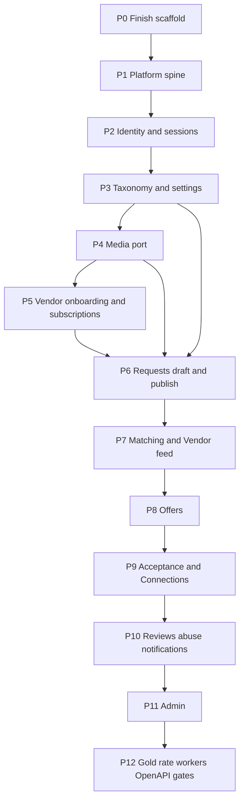

# Karat Hive — Backend Implementation Plan

| | |
|---|---|
| **Product** | Karat Hive — Digital Jewellery Marketplace |
| **Document** | Backend implementation plan and task list |
| **Version** | 0.6 |
| **Status** | Working backlog. Does not override the SRS. Last checked against `backend/` on 6 September 2026. Marketplace login: [`adr/0010`](adr/0010-google-signin-only-login.md). |
| **Date** | 6 September 2026 |
| **Source of truth** | [`Requirements-Spec-v1.3.md`](Requirements-Spec-v1.3.md) · [`Architecture-Backend.md`](Architecture-Backend.md) · [`API-Route-Inventory.md`](API-Route-Inventory.md) · [`Physical-Data-Model.md`](Physical-Data-Model.md) · [`Async-Contract.md`](Async-Contract.md) (`AD-ASYNC-nn` — outbox payloads and the 15 scheduled jobs; feeds P2/P7/P10/P12, T05/T21/T23/T28) |
| **Coverage inputs** | [`Screen-API-Map.md`](Screen-API-Map.md) (`SAM-GAP-nn`) · [`Spec-Document-Sequence.md`](Spec-Document-Sequence.md) |
| **Day-to-day leftover list** | [`Backend-Gap-Tasks.md`](Backend-Gap-Tasks.md) (`G2-*`) — splits the open T-rows into smaller tasks |
| **Closed P0/P1 fixes** | [`Backend-Gap-Fix-Plan.md`](Backend-Gap-Fix-Plan.md) (F01–F17) |

Build the **Node.js monolith** (`C-11`) so every route in the API inventory is implemented against PostgreSQL (`C-12`). Flutter apps are out of scope here. OpenAPI is generated from this code (`NFR-030`, `AD-BE-14`).

**Local runtime: no Docker.** PostgreSQL on the host (managed Supabase for non-production — `adr/0009`). File storage uses a local-disk adapter in tests and Supabase Storage for KYC in checkpoint-1; production target remains Cloudflare R2 (`adr/0008`). `backend/docker/` stays optional and unused.

This file is the **order of work** (P0–P12) and the **T01–T44 tick list**. For the next small tasks, use [`Backend-Gap-Tasks.md`](Backend-Gap-Tasks.md).

---

## Where the code is today (6 September 2026)

Checked against `backend/src`, `backend/prisma`, `backend/test`, and `.github/workflows`.

### Built

| Area | What is on disk |
|---|---|
| Specs | SRS v1.3, ADRs 0001–**0009**, Architecture-Backend, API inventory, Physical-Data-Model, Screen-API-Map, Async-Contract |
| Database | Named Prisma migrations from `20260901120000_init` through `20260906120000_category_icon`. Extra columns listed under T36 (warning timestamps, `verification_message`, `viewed_by_customer_at`, abuse types `VENDOR` and `CUSTOMER`) are **in the schema**. The jobs that use those columns are not written yet. |
| Tooling | Nest 11 + Fastify 5 + Prisma 5 + Zod. `npm run build`, `npm test` (Vitest), `npm run lint`, CI (`.github/workflows/backend.yml`). Worker start script sets `KH_ROLE=worker`. |
| Shared values | `Money`, `Weight`, `Result`, `Karat`, `Purity` |
| Health | `GET /health` (no database). `GET /ready` (database + migrations). |
| Platform spine (P0–P1) | Outbox (write, claim, consumer marker, backoff). Job lock + scheduler. Audit writer. Idempotency. Rate-limit buckets. Auth guard + ViewerContext. Masking interceptor. Error codes with English and Arabic messages. |
| Identity (part of P2) | Vendor OTP request/verify. Vendor register. Email/password login (Vendor and Admin). Refresh and logout. `GET/PATCH /v1/me` (Vendor and Admin only). Google ID-token check inside the auth guard — see P2 leftover. |
| Taxonomy (part of P3) | Public category and region trees. Admin create/update/deactivate. Seeds for UAE regions, categories, platform settings, one Admin user, and a Vendor seed helper. |
| Media (part of P4) | Upload-intent, complete, delete. Local-disk adapter (tests) and Supabase Storage adapter (KYC). In development, KYC files are marked ready without the later image-clean worker. |
| Vendor onboarding (part of P5) | Profile get/patch, KYC documents, resubmit, categories/regions, away mode, thin dashboard (counts are zeros), dev-verify shortcut. A verified Vendor who is not yet fully active **can** set categories and regions (code comment: SAM-GAP-7). |
| Admin hide | A non-Admin token on `/v1/admin` returns `404`. Admin taxonomy routes are live. |

### Not built

| Area | Evidence |
|---|---|
| Customer register, Customer profile on `GET /v1/me`, session list/delete, password change/reset, mobile change, deactivate, delete-my-account, settings, device tokens, Admin 2FA, OAuth bind route | No matching routes in `auth.controller.ts` / `me.controller.ts` |
| `GET /v1/platform-config` | No handler. The setting **values** are seeded. |
| Image-clean worker (strip hidden photo data, virus stub, thumbnails) | KYC is marked ready in development; no worker |
| Vendor subscriptions (read + Admin grant) | `modules/subscription/` is empty |
| Requests, matching, offers, connections, reviews, abuse, notifications, gold-rate, Admin (except taxonomy) | Empty module folders |
| Background jobs except outbox drain | `main.ts` registers only `outbox.drain` |
| OpenAPI generator | Not a dependency. `backend/openapi/` is empty |
| Contract and performance test suites | Folders empty. Masking tests **do** exist under `test/masking/` |

**Decided (6 September 2026), not guessed:**

1. **Google is the only marketplace login** ([`adr/0010`](adr/0010-google-signin-only-login.md)). Customer and Vendor do not log in with OTP or password. The SRS and the API list still describe the old login; they need a later rewrite. Code today also **creates a Vendor automatically** on first Google use — that is a bug to fix, not the design.
2. **Password hashing is scrypt** (`AD-BE-16`). Architecture-Backend now matches the code.
3. **T36 extra columns are done** in the schema. Jobs that use them can be built in their phase. Do not revert the init migration.
4. **SAM-GAP-7:** the API list still says only an **active** Vendor may set categories. The code currently lets a **verified** Vendor do it so first activation works. That code is a **temporary shortcut**. Do not change the API list. A later change must replace the shortcut without trapping new Vendors.

---

## Constraints (do not reopen)

- No Redis, Kafka, Elasticsearch (`C-12`). Outbox + `job_lock` + `rate_limit_bucket` in PostgreSQL.
- Masked identity fields **absent** from JSON, not null (`BR-006`, `FR-SYS-003`).
- Acceptance is one transaction: accept + reject competitors + Connection + reveal (`BR-011`–`BR-013`, `FR-SYS-006`, `FR-SYS-007`).
- State transitions are `POST` sub-resources, never a `PATCH` of `state`.
- Admin only under `/v1/admin`. Coarse `role=ADMIN` (`AD-API-03`).
- Type Subscriptions Admin-granted, no checkout (`AD-API-04`).
- Offer `validity_hours` ∈ {12, 24, 48} (`AD-API-07`).
- WhatsApp is a `wa.me` URL + `CONTACT_EVENT`. No Business API (`C-03`).
- Yahoo end-user **display** remains `[BLOCKED]`; ingest + Admin override + bullion floor still ship.
- Module boundaries: own tables, public `index.ts` only, acyclic graph, notifications via outbox ([Architecture-Backend](Architecture-Backend.md) §7.3).

---

## Screen coverage gaps folded into this plan

[`Screen-API-Map.md`](Screen-API-Map.md) §6 maps all 67 screens onto the inventory and records
13 unmet needs as `SAM-GAP-nn`. They are **not** resolved here — each needs Technical Lead
sign-off, the same as any `[PROPOSED]` row. This table only says *where the work lands if it is
accepted*.

T01 has already frozen the init migration. Columns that were still open at that time are now **in the schema** (see T36). The API list and the screen map have not all been updated to match.

| Gap | Sev | Backend consequence | Phase / task | Code today |
|---|---|---|---|---|
| `SAM-GAP-7` | **H** | A verified Vendor must set Categories/Regions to become `ACTIVE`, but the API list marks those routes as active-only. | **P5 #34**, T18 | **Temporary shortcut in code.** Guard allows `VERIFIED` (not yet active). API list is unchanged (active-only). Replace the shortcut later; do not edit the API list for this. |
| `SAM-GAP-4` | M | Abuse reports against a Vendor or a Customer with no Request/Offer/Connection in hand | **P10 #61**, T27 | Enum in schema already has `VENDOR` and `CUSTOMER`. Report API is not built. |
| `SAM-GAP-1` | M | `offer.viewed_by_customer_at` + unread count on Customer Request list | **P8 #49**, T22 | Column exists. Presenter not built. |
| `SAM-GAP-3` | M | `connectionId?` on a Customer Request when accepted — join, no new column | **P9 #56**, T24 | Not built. |
| `SAM-GAP-6` | M | `verificationMessage?` on `VendorMe` | **P5 #32** + **P11 #67**, T18 | Column and VendorMe field exist. Admin `request-info` route is only on the **dev-verify** shortcut, not the real Admin module. |
| `SAM-GAP-8` | M | `ratingTrend[]` on Vendor performance | **P10 #60**, T26 | Not built. |
| `SAM-GAP-2` | L | `liveRequestCount` / `canCreateRequest` on `GET /v1/me` | **P6 #38**, T20 | Not built. |
| `SAM-GAP-5` | L | Seed keys `legal.termsUrl`, `legal.privacyUrl`, `supportContactUrl` served by `GET /v1/platform-config` | **P3 #25**, T16 | **Seeded.** Config **route** is not built. |
| `SAM-GAP-10` | L | Announcement preview vs count-at-dispatch | **P11 #72 / #72a**, T29 | Not built. Async-Contract §11: count at dispatch, not previewable. |
| `SAM-GAP-9`, `11`, `12`, `13` | L | No backend work, or verify audit-log fields at P11 | Out of this plan / P11 #72 | — |

---

## Implementation order

Vertical slices, not “all controllers then all services”. Each phase is mergeable when its routes, domain tests, and masking assertions pass.

**P9 is the commercial spine.** Nothing after it is more important than getting P9 correct.

**Phase status:** P0 **done**. P1 **done**. P2–P5 **partly built** (leftovers listed in each phase). P6–P12 **not built**.

---

## P0 — Scaffold (done)

T01–T04 and T33–T35 (except the OpenAPI generator, which stays T31).

Named init migration exists. `npm run build` is clean. API boots without Docker. `/health` works with no database. `/ready` waits for migrate. Tests, lint, and CI run. Worker start sets `KH_ROLE=worker`.

T36 columns are in the init migration and are **done**. Do not revert that migration. Jobs that read those columns are still unwritten (T41–T44 and friends).

**Gate:** met.

---

## P1 — Platform spine (done)

7. **Outbox** (`platform/outbox`): insert in the same transaction as the domain write; worker claims `FOR UPDATE SKIP LOCKED`; `outbox_consumer` unique `(event_id, consumer)`; backoff then `FAILED`. **Built.** `main.ts` registers `outbox.drain` every 5 seconds when `KH_ROLE` is `worker` or `all`.
8. **Scheduler + `job_lock`**: lease table, register jobs, no duplicate fire across worker instances. **Built.** No domain jobs are registered yet besides outbox drain.
9. **Audit writer**: append-only helper used inside the domain transaction (`FR-SYS-011`). **Built.**
10. **Idempotency** (`edge/idempotency`): required keys on publish / offer submit / accept / media intent; 24 h replay; 409 on key reuse with different body. **Built.**
11. **Rate limit** (`edge/rate-limit`): PostgreSQL token buckets. **Built.**
12. **Auth guard + ViewerContext**: Karat Hive access JWT + refresh rotation + reuse detection. **Built.** The guard also accepts a Google ID token — that extra path is listed under P2, not here.
13. **eslint-plugin-boundaries** so imports cannot skip `modules/*/index.ts`. **Built.**
14. Shared value objects: `Money`, `Weight`, `Result`, `Karat`, `Purity`. **Built.**

**Gate:** met (unit tests for outbox claim and job lock).

---

## P2 — Identity and sessions (partly built)

Routes: API inventory §8–§9.

| Item | Intended now | Code today |
|---|---|---|
| 15. OTP | Not a login. May still prove a mobile number for Talk. | Vendor OTP request/verify **built**. Customer purpose missing from the HTTP body. |
| 16. Register after Google | New Google user picks Customer or Vendor, accepts terms, supplies a real mobile number. | Vendor register **built** (old OTP path). Customer register **missing**. Google auto-creates a Vendor (bug). |
| 17. Password + Admin 2FA | Not marketplace login. Admin method **open**. | Password login **built** (Vendor and Admin). Admin 2FA **not built**. |
| 18. Login | Google only (`adr/0010`). Exchange Google token → Karat Hive session. | Google token accepted on every request. New users become Vendors. No session-exchange route. |
| 19. Refresh, logout, sessions, password set/reset, devices | Refresh/logout stay. Password set/reset only if Admin still uses passwords. | Refresh and logout **built**. Sessions list/delete, password set/reset, devices **not built**. |
| 20. `GET/PATCH /v1/me`, mobile change, deactivate, deletion-request | All | `GET/PATCH /v1/me` **built** for Vendor and Admin. No `customer` object. Mobile change, deactivate, deletion-request **not built**. |
| 21. Settings + notification preferences | — | **Not built.** `modules/settings/` is empty. |
| 22. Vendor shell: marketplace routes `403 VENDOR_NOT_ACTIVE` | — | **Built** on vendor-onboarding routes (`VendorAccessGuard`). |

**Gate (old):** Vendor password/OTP login works. **Gate (intended):** Google → session bundle → `GET /v1/me` for both Customer and Vendor, with no auto-created Vendor. Not met.

Leftovers: [`Backend-Gap-Tasks.md`](Backend-Gap-Tasks.md) Track A (Google session) and Track I.

---

## P3 — Taxonomy and platform settings (partly built)

23. `GET /v1/categories`, `GET /v1/regions` (active only). **Built.**
24. `GET /v1/platform-config` from `platform_setting`. **Not built.** This is the P3 gate.
25. Seed: UAE region tree, category tree, settings defaults (`C-07` 48 h, bullion AED 500, validity `[12,24,48]`, karat list, media limits), plus `legal.terms_url`, `legal.privacy_url`, `support.contact_url` (`SAM-GAP-5`). **Seeded.** `subscriptionContactUrl` is **not** in the seed file.
26. One local Admin user in seed (no self-register). **Built.**

**Gate:** not met — config endpoint is missing. Request forms have no server source for 48 h / bullion floor / validity hours.

---

## P4 — Media port (partly built)

27. Storage port: `presignUpload`, `presignDownload`, `delete`, `head`. **Built.**
28. Adapters: local filesystem for tests; Supabase Storage for KYC in checkpoint-1. Production target remains R2/MinIO (`adr/0008`). **Built for the KYC path.**
29. `POST /v1/media/upload-intent`, `POST /v1/media/{key}/complete`, `DELETE /v1/media/{key}`. **Built.**
30. Worker: magic-byte inspect, EXIF strip, re-encode, thumbnail, malware stub → `READY` / `QUARANTINED` (`FR-SYS-009`). **Not built.** Dev KYC is marked `READY` in the complete call.
31. KYC bucket never issued to Customer/Vendor; Admin URL audited (`NFR-015`). KYC path hides the URL on Vendor document list. Real Admin signed-URL route is not built.

**Gate:** KYC upload-intent → put bytes → complete works. Image-clean worker and Request-image bucket are still open.

---

## P5 — Vendor onboarding and subscriptions (partly built)

32. Vendor profile GET/PATCH; `BR-004` re-verification on legal name / licence / address. `VendorMe` carries `verificationMessage?`. **Built.**
33. KYC documents via media; resubmit after reject. **Built.**
33a. **Vendor document expiry job** (`vendor-document-expiry`, daily 02:00 GST). **Not built.** Column `reminder_sent_at` is in the schema.
34. Categories / Regions / away mode (`FR-VEN-025`). **Built as a temporary shortcut:** guard admits `VERIFIED` before first `ACTIVE`. API list still says active-only (SAM-GAP-7). Do not change the API list.
35. `GET /v1/me/subscriptions` read-only. **Not built.** Dashboard returns `subscriptions: []`.
36. Admin grant/patch subscriptions (`AD-API-04`). **Not built.**
37. Dashboard counts (`GET /v1/me/dashboard`). **Built as zeros** until P7/P8.

**Gate:** Vendor in shell cannot hit marketplace routes that use `VendorAccessGuard`. `/v1/matches` does not exist yet. A newly `VERIFIED` Vendor can complete categories → `ACTIVE` on the Vendor routes that exist. Subscriptions are still missing, so matching/offers cannot enforce `BR-002` for Request type.

---

## P6 — Requests (Customer)

**Status: not built.** `modules/requests/` is empty.

State machine SRS §5.2 as a pure domain function (`NFR-029`).

38. `POST /v1/requests` draft; `PATCH` draft vs published field rules (`BR-014`). Expose `liveRequestCount` / `canCreateRequest` on `GET /v1/me` so `CUS-S03` can block entry to the flow instead of dead-ending at publish on `CONCURRENT_REQUEST_LIMIT` (`SAM-GAP-2`).
39. `POST /v1/requests/{id}/publish` — OAuth gate, media `READY`, contact-detail scan (`BR-022`), concurrent live limit, bullion floor.
40. `POST .../cancel`, `POST .../duplicate`.
41. `GET /v1/me/requests`, `GET /v1/requests/{id}` Customer presenter (no Vendor identity).
42. Snapshot `expires_at = published_at + lifetime` (`BR-020`).
42a. **Draft purge job** (`request-draft-purge`, hourly) — warn at 27 days (`request.draft.purge_warning`), hard-delete draft + `request_media` at 30 days (`FR-CUS-015` AC4). Column `draft_purge_warned_at` is in the schema. This job deletes Customer data on a timer; land it with the draft rules that create it, not months later.
42b. Emit `request.edited` and `request.cancelled` (Async-Contract §4.3, §4.4). `request.edited` notifies **pending-Offer Vendors only** — a `[PROPOSED]` scope choice recorded in Async-Contract §11, not a free decision.

**Gate:** publish refused without OAuth; draft never appears in any Vendor query.

---

## P7 — Matching and Vendor feed

**Status: not built.** `modules/matching/` is empty.

43. Fan-out worker on `request.published`: eligibility `VERIFIED` + `ACTIVE` + category + region + live Type Subscription (`FR-SYS-002`); `ON CONFLICT DO NOTHING`. Zero matches is a valid outcome, not an error — the Request stays published and the gap is recorded for the liquidity report (`FR-SYS-001.3`, `FR-ADM-027`).
43a. **Match-set recompute** on `vendor.eligibility.changed` (`FR-SYS-002.3`) — emitted by `vendor-onboarding` and `subscription` when Categories, Regions, verification or a Type Subscription change. Upsert on `(request_id, vendor_profile_id)`. Without it a Vendor who subscribes mid-Request never sees live Requests they now qualify for.
44. `GET /v1/matches` + filters + presets (`FR-VEN-009`).
45. `POST /v1/matches/{id}/viewed`.
46. Customer identity **absent** from Vendor payloads (`FR-VEN-011`). Release-gate test.

**Gate:** masking suite fails the build if `mobileNumber` / `displayName` of the Customer appears on `/v1/matches`.

---

## P8 — Offers

**Status: not built.** `modules/offers/` is empty.

State machine SRS §5.3.

47. `POST /v1/requests/{id}/offers` — subscription, match set, `BR-009` unique, note scan, validity clamp to Request remaining life.
48. Revise (max 3) / withdraw.
49. `GET /v1/me/offers`, `GET /v1/requests/{id}/offers`, `GET /v1/offers/{id}` role presenters (`BR-008` — no competing terms). `GET /v1/offers/{id}` is also the current-terms snapshot `VEN-S10` reads before a revise. Unread state (`SAM-GAP-1`): `viewedByCustomerAt` on `OfferForCustomer` + `unreadOfferCount` on the `RequestForCustomer` list row — `CUS-S02` and `CUS-S11` both render a marker that nothing currently feeds. Column `viewed_by_customer_at` is in the schema.
50. `GET /v1/offers/{id}/vendor-rating` (`FR-CUS-031`).
51. Offer expiry sweep (1 min, not the permitted 5 — Async-Contract §6 cadence note; plus a synchronous check on accept) (`FR-SYS-004`).
51a. **Offer expiry warning job** (`offer-expiry-warning`, 5 min) — pending Offers within 6 h of `expires_at`, warned once, emits `offer.expiry.warning` (`FR-VEN-013` AC4). Column `expiry_warned_at` is in the schema. Symmetric with the Customer's Request warning at #63; a Vendor's Offer currently lapses silently.

**Gate:** second pending Offer from same Vendor → 409; Vendor payload never includes another Vendor’s price.

---

## P9 — Acceptance and Connections (spine)

**Status: not built.** `modules/connections/` is empty.

52. Domain: `SELECT … FOR UPDATE` Request; Offer `PENDING` and unexpired; Request open.
53. One transaction: Offer `ACCEPTED`, Request `ACCEPTED`, other `PENDING` → `REJECTED`, insert Connection, audit `IDENTITY_REVEALED`, outbox notifications (`AD-BE-09`).
54. `POST /v1/offers/{id}/accept` with required Idempotency-Key and `confirmation: REVEAL_AND_CONNECT`.
55. `POST /v1/offers/{id}/decline`.
56. `GET /v1/me/connections`, `GET /v1/connections/{id}` with `talk.waUrl` (normalised number, no WhatsApp call). Add `connectionId?` to `RequestForCustomer` when `state = ACCEPTED` so `CUS-S10` can deep-link to the Connection — a presenter join on the unique `connection.offer_id`, no new column (`SAM-GAP-3`). The Vendor presenter already carries it.
57. Close Connection; `POST .../contact-events` (channel + time only, no content field — `NFR-017`). Closing emits `connection.closed`, which is what prompts both parties to review in P10.
58. **Concurrency test:** two accepts → one Connection (`BR-011`, `BR-012`).

**Gate:** release-gate concurrency suite green. This phase is not done without that test.

---

## P10 — Reviews, abuse, notifications

**Status: not built.** `modules/reviews/`, `modules/abuse/`, `modules/notifications/` are empty.

59. Reviews hold-for-approval; one per party (`BR-016`, `BR-017`); edit window 14 days; Vendor response + flag.
60. Rating aggregation worker (`FR-SYS-012`) — on `review.published` / `review.moderated`, plus a 5-minute reconciliation; full recompute, so idempotent by construction. Customer ratings hidden from other Customers (`BR-018`). Same worker emits the 6-month `ratingTrend[]` for `GET /v1/me/vendor/performance` that `VEN-S20` charts (`SAM-GAP-8`) — an aggregate, not a read-time scan.
61. `POST /v1/abuse-reports`; reporter identity withheld. Schema enum already includes `VENDOR` and `CUSTOMER` (`SAM-GAP-4`).
62. In-app notification centre + preferences + quiet hours; push adapters (APNs/FCM) behind ports — stub OK if credentials absent; **persist in-app regardless of push** (`FR-SYS-008.6`). Adapter folders `platform/adapters/{apns,fcm,email}` exist and are empty.
62a. **Notification retry job** (`notification-retry`, 1 min) — `notification_delivery` rows `FAILED` with `attempt < 3` (`FR-SYS-008.3`). Distinct from outbox drain: the outbox guarantees the event, this guarantees the delivery.
63. Request T−6 h warning + hard expiry 48 h worker (`FR-SYS-005`, `C-07`). Both sweeps run at 1 min, not the 5 the spec permits — a Customer-visible countdown at zero while the Request still reads live is a trust problem (Async-Contract §6 cadence note).
63a. **Retention purge job** (`retention-purge`, daily 03:00 GST) — notifications past 90 d, orphan media past 30 d (`FR-SYS-009.6`), `idempotency_key` past 24 h; audit never (`NFR-021`, `AD-BE-13`). Idempotent by construction. Pairs with the PDPL erasure path stubbed at P2 #20.

---

## P11 — Admin (`/v1/admin`)

**Status: taxonomy only.** `modules/admin/` is empty. Admin taxonomy lives in `modules/taxonomy/`.

64. Guard: non-Admin token on `/v1/admin` → 404 (do not advertise). Admin token on marketplace mutating routes → 403. **404 hide is built** in `AuthGuard`.
65. Dashboard metrics (`FR-ADM-003`–`009`) via **named read-only views** owned by source modules (Architecture-Backend §7.3 exception).
66. Customers: list/detail/suspend/reactivate/erasure.
67. Vendors: list/detail/KYC signed URL (audited)/verification queue/verify/reject/request-info/activate/suspend/deactivate + subscription grant. Checkpoint-1 has a **dev-verify** shortcut, not these Admin routes.
68. Requests/Offers/Connections oversight + Request remove + Admin close Connection.
69. Taxonomy CUD (deactivate, never delete). **Built.**
70. Review moderation approve/reject/redact.
71. Reports + async exports (watermark + audit, `NFR-016`).
72. Announcements; platform settings (`BR-020`); gold-rate override; abuse queue; audit log viewer; Admin user provisioning (no role column). Two screen-driven checks: `ADM-S18` has a "zero audience" edge state that implies a pre-send recipient estimate — either `POST /v1/admin/announcements/preview` or an accepted post-send-only count (`SAM-GAP-10`); and `GET /v1/admin/audit-log` rows must carry `before` / `after` / `ip` / `userAgent` in full, or `ADM-S22`'s detail view has no source and needs `GET /v1/admin/audit-log/{id}` (`SAM-GAP-12`).
72a. **Announcement dispatch job** (`announcement-dispatch`, 1 min) — due, uncancelled, not-yet-dispatched announcements; sets the dispatch guard and emits `announcement.scheduled` (`FR-ADM-029`). Note Async-Contract §11 resolves `SAM-GAP-10` the other way: the audience count is computed **at dispatch**, not previewable — so #72's preview endpoint is now a deliberate choice against that, or is dropped.
73. Internal notes `POST /v1/admin/{collection}/{id}/notes`.

---

## P12 — Gold rate, OpenAPI, release gates

**Status: not built.** `modules/gold-rate/` is empty. OpenAPI generator is not a dependency.

74. Gold-rate poll port (Yahoo adapter, 15 min configurable) + manual override; never fabricate `0`; feature flag `goldRates.endUserDisplay` (`AD-API-09`). Upsert on `(purity_karat, source, source_timestamp)` — Async-Contract §6 records that Architecture §11.3's two-column key is wrong and the schema constraint wins.
74a. **Gold-rate stale alert** (`gold-rate-stale-alert`, 15 min), de-duplicated per window — Admin alerted after 2 h of ingestion failure (`FR-SYS-010.5`). `ADM-S20` surfaces both the poll interval and the staleness threshold; they are `platform_setting` keys written through `PATCH /v1/admin/settings/{key}`, not a dedicated route (`SAM-GAP-11`).
75. Generate OpenAPI from Nest/Zod into `backend/openapi/`; CI diff (`NFR-030`). Neither `@nestjs/swagger` nor a zod-to-openapi bridge is a dependency yet — pick one at T31 and keep Zod the single source of shape, so schemas are not written twice. First commit diffs against the inventory, not against empty.
76. Contract tests: every inventory route, every role, error codes. The error catalogue is a closed enum (inventory §5) — assert no handler invents a code outside it.
77. Masking suite as a **build-failing** gate (`NFR-013`). Unit and some integration masking tests exist; this item is the CI gate on every identity-bearing route, including P6–P9 when they land.
78. State-machine exhaustive tests Request/Offer/Vendor/Connection (`NFR-029`) — legal transitions and the 409 for every illegal one. Vendor machine tests exist from checkpoint-1.
79. Performance tests for the six hot paths ([Physical-Data-Model](Physical-Data-Model.md) §6) — **after** a production-scale seed; may trail functionally.

---

## Scheduled-job coverage

Same completeness check the Screen-API map runs against the inventory, applied to
[`Async-Contract.md`](Async-Contract.md) §6 — which is now the authority here, superseding
Architecture §11.3.

| Job (Async-Contract §6) | `job_lock` key | Cadence | Phase | Code today |
|---|---|---|---|---|
| Outbox drain | — (`SKIP LOCKED`) | 5 s | P1 #7 | **Built.** `main.ts` `outbox.drain` |
| Media processing | — (event) | on `media.uploaded` | P4 #30 | Not built |
| Vendor document expiry | `vendor-document-expiry` | Daily 02:00 GST | **P5 #33a** | Not built (column exists) |
| Draft purge | `request-draft-purge` | Hourly | **P6 #42a** | Not built (column exists) |
| Match-set recompute | — (event) | on `vendor.eligibility.changed` | **P7 #43a** | Not built |
| Offer expiry sweep | `offer-expiry-sweep` | 1 min | P8 #51 | Not built |
| Offer expiry warning | `offer-expiry-warning` | 5 min | **P8 #51a** | Not built (column exists) |
| Rating reconcile | `rating-reconcile` | 5 min | P10 #60 | Not built |
| Notification retry | `notification-retry` | 1 min | **P10 #62a** | Not built |
| Request expiry sweep | `request-expiry-sweep` | 1 min | P10 #63 | Not built |
| Request expiry warning | `request-expiry-warning` | 5 min | P10 #63 | Not built |
| Retention purge | `retention-purge` | Daily 03:00 GST | **P10 #63a** | Not built |
| Announcement dispatch | `announcement-dispatch` | 1 min | **P11 #72a** | Not built |
| Gold rate poll | `gold-rate-poll` | 15 min | P12 #74 | Not built |
| Gold rate stale alert | `gold-rate-stale-alert` | 15 min | **P12 #74a** | Not built |

Every lease-based job takes its named `job_lock` row through P1 #8 (`NFR-009`). **`outbox-drain`
is deliberately not lease-based** — `FOR UPDATE SKIP LOCKED` lets every `worker` instance drain
concurrently. None of the fifteen may fire in a `KH_ROLE=api` process.

Async-Contract §4 carries **21 events**. Event **names** are listed in `outbox.events.ts`. No domain consumer is registered except the drain itself. The `notifications:dispatch` consumer at P10 #62 must handle all 21 — the bodies come later, from `Notification-Catalogue.md` (sequence doc #4).

---

## Task list (T01–T44)

Working backlog. Tick in this file as work lands. IDs are stable and never reused.

### P0 Scaffold

| ID | Task | Status |
|---|---|---|
| T01 | Named init migration (diff + extensions + partial indexes) | done |
| T02 | `nest build` clean | done |
| T03 | Boot API without Docker; curl `/health` 200 | done |
| T04 | README: local Postgres only; `/ready` 503 until migrated | done |

### P1 Platform

| ID | Task | Status |
|---|---|---|
| T05 | Outbox producer + claimer + consumer marker | done |
| T06 | `job_lock` scheduler | done |
| T07 | Audit helper (same transaction) | done |
| T08 | Idempotency middleware | done |
| T09 | Rate-limit buckets | done |
| T10 | JWT ViewerContext + refresh rotation | done (Google token path is extra; see P2) |
| T11 | Module-boundary lint | done |

### P2–P5 Identity → Vendor

| ID | Task | Status |
|---|---|---|
| T12 | OTP + register Customer/Vendor | **partial** — Vendor register exists. Intended login is Google (`adr/0010`), not OTP. Customer register after Google is still missing. Phone OTP may still prove a number for Talk. |
| T13 | Password + Admin 2FA | **partial** — password login exists in code. Not the intended marketplace login. Admin 2FA not built. Admin login method is **open**. |
| T14 | Google session (was OAuth bind) | **pending** — intended: exchange Google token for a Karat Hive session (`adr/0010`). Do not build `POST /v1/auth/oauth/bind` as a second login. Code today auto-creates Vendors inside the guard (bug). |
| T15 | Sessions / me / settings / shell guard | **partial** — `GET/PATCH /v1/me` (Vendor/Admin) + vendor shell guard done. No Customer `me`, sessions list/delete, settings, password change/reset, mobile change, deactivate, deletion, devices. |
| T16 | Taxonomy GET + seed | **partial** — public + admin CRUD + seed done. `GET /v1/platform-config` missing (P3 gate). |
| T17 | Media port + local-disk adapter + complete/process | **partial** — KYC upload-intent/complete/delete done. Image-clean worker not built. |
| T18 | Vendor profile, KYC, categories/regions | done (checkpoint-1: profile, documents, categories/regions, shell guard, dashboard zeros) |
| T19 | Subscriptions read + Admin grant | pending |

### P6–P9 Marketplace spine

| ID | Task | Status |
|---|---|---|
| T20 | Request draft/publish/cancel/duplicate + presenters | pending |
| T21 | Fan-out + `/v1/matches` + masking tests | pending |
| T22 | Offer submit/revise/withdraw/list | pending |
| T23 | Accept transaction + decline | pending |
| T24 | Connections + Talk URL + contact-events | pending |
| T25 | Concurrency test: single Connection | pending |

### P10–P12 Rest of v1

| ID | Task | Status |
|---|---|---|
| T26 | Reviews + aggregation | pending |
| T27 | Abuse reports | pending |
| T28 | Notifications + expiry workers | pending |
| T29 | Admin lists/actions/exports/settings | pending (taxonomy CUD already done under T16) |
| T30 | Gold-rate ingest/override + display flag | pending |
| T31 | Generated OpenAPI + CI diff | pending |
| T32 | Release-gate suites (masking, state machines, contract) | pending (masking unit tests exist; not a full release gate) |

### Toolchain and coverage — added in v0.2

| ID | Task | Phase | Status |
|---|---|---|---|
| T33 | Test runner + `npm test`; `start:worker` sets `KH_ROLE=worker` | P0 | done (`KH_ROLE`; `APP_ROLE` alias) |
| T34 | ESLint + Prettier + `eslint-plugin-boundaries` + `npm run lint` | P0 | done |
| T35 | CI workflow (build · lint · test); choose the Nest/Zod → OpenAPI generator | P0 → feeds T31 | CI done (`.github/workflows/backend.yml`); generator still T31 |
| T36 | Fold SAM-GAP columns and Async-Contract §10 deltas into schema | P0 | **done** (columns in schema). Jobs that use them: T41–T44 and related rows, still pending. |
| T37 | Match-set recompute on `vendor.eligibility.changed` (`FR-SYS-002.3`) | P7 | pending |
| T38 | Notification retry job (`FR-SYS-008.3`) | P10 | pending |
| T39 | Retention purge job, daily 03:00 GST (`NFR-021`, `FR-SYS-009.6`) | P10 | pending |
| T40 | Gold-rate stale alert (`FR-SYS-010.5`) | P12 | pending |
| T41 | Offer expiry warning job (`FR-VEN-013` AC4) | P8 | pending |
| T42 | Draft purge job — warn 27 d, delete 30 d (`FR-CUS-015` AC4) | P6 | pending |
| T43 | Announcement dispatch job (`FR-ADM-029`) | P11 | pending |
| T44 | Vendor document expiry job (`FR-VEN-002` AC4) | P5 | pending |

---

## Explicitly not in this plan

- Flutter apps, Admin data grid (`AD-FE-12`)
- Docker as a required local dependency
- In-app WhatsApp, payment/settlement, Redis/Kafka/ES
- Super / Ops / Analyst Admin roles
- Production Yahoo redistribution to end users
- Production-scale perf seed (T32 performance half can follow)
- **Notification bodies.** P10 #62 builds the dispatch mechanism and the 21 event triggers; EN/AR copy, deep links and quiet-hours wording are `Notification-Catalogue.md` (sequence doc #4), which is not yet written. Ship with placeholder strings rather than inventing final copy here.
- **The QA case list.** T32 builds the suites; `Release-Gate-Tests.md` (sequence doc #5) enumerates the cases. Writing the suites first is fine — do not treat this plan's one-line gates as that enumeration.

---

## Verification per phase

- Routes match the inventory (method, path, error codes).
- `CONTEXT.md` vocabulary in code and JSON (Request, Offer, Connection, Talk).
- No masked field on the wire.
- `npm run build` + `npm run lint` + the phase's tests green.
- Every `SAM-GAP` assigned to the phase is either implemented or explicitly deferred in writing — a screen the phase claims to serve must actually load.
- After P0: `/health` with curl (no browser), `/ready` at 200 after `migrate deploy`. After P9: concurrency test is mandatory.

---

## Risk

Nest + Fastify + Prisma is what the repo runs. `AD-BE-04` / `AD-BE-05` are still tagged `[PROPOSED]` in architecture; changing stack now would throw away P0–P5, not only P0–P1.

Open, not guessed:

- **Admin login.** Marketplace login is Google (`adr/0010`). Whether Admins also use Google, or stay on email + password + 2FA, is not decided.
- **SAM-GAP-7 shortcut.** API list stays active-only. Code currently lets verified Vendors set categories. How first activation works after the shortcut is removed is not decided.

---

## Appendix — Revision history

| Version | Date | Change |
|---|---|---|
| 0.1 | 1 Sep 2026 | Initial backend implementation plan. No Docker. P0–P12, T01–T32. |
| 0.2 | 1 Sep 2026 | Reconciled with `Screen-API-Map.md` (13 `SAM-GAP`s assigned to phases; `SAM-GAP-7` flagged as a P5 blocker) and with `Async-Contract.md` (now the authority for events and jobs, superseding Architecture §11.3). Gave a phase to the **eight** scheduled jobs that had none — vendor-document expiry, draft purge, match-set recompute, offer expiry warning, notification retry, retention purge, announcement dispatch, gold-rate stale alert — and added a 15-row job-coverage table. Folded both documents' schema deltas into a single pre-migration decision, T36. Pulled the missing toolchain (test runner, lint, CI, OpenAPI generator) forward into P0 as T33–T35. Appended T33–T44. Corrected the "Already done" table against the real `backend/` tree. |
| 0.3 | 1 Sep 2026 | P0/P1 review-gap fixes (`docs/Backend-Gap-Fix-Plan.md` F01–F17). T33–T35 toolchain closed except OpenAPI generator (T31). T36 columns remain in init as `[PROPOSED]`. |
| 0.4 | 6 Sep 2026 | Pointer to [`Backend-Gap-Tasks.md`](Backend-Gap-Tasks.md) (`G2-*`) as the post-CP1 executable split of pending T-rows plus Firebase AuthGuard defects. T15 corrected from "done" to **partial** (me + shell guard only). |
| 0.5 | 6 Sep 2026 | Rewrote status against the code. Replaced the 1 Sep "empty repo" snapshot. P0 and P1 marked done. P2–P5 marked partly built with leftovers. P6–P12 marked not built. T12/T16/T17 corrected to partial. T36: columns exist; jobs still pending. SAM-GAP-7 and SAM-GAP-4 recorded as present in code/schema. Did not change SRS, architecture, or the API list. |
| 0.6 | 6 Sep 2026 | Product choices: Google is the only marketplace login (`adr/0010`); SAM-GAP-7 code is a temporary shortcut (API list unchanged); T36 columns treated as done; password hashing is scrypt (`AD-BE-16`). Admin login still open. |
