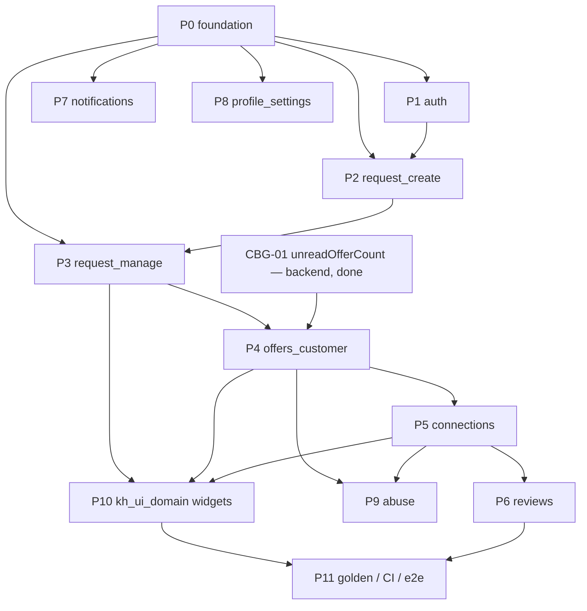

# Karat Hive — Customer App Build Plan

| | |
|---|---|
| **Product** | Karat Hive — Digital Jewellery Marketplace |
| **Document** | Customer mobile app build order and task register (`CUS-S01`…`CUS-S22`) |
| **Status** | Working plan — `[PROPOSED]`. Front-end analogue of [`Backend-Implementation-Plan.md`](Backend-Implementation-Plan.md). Checked against the `feat/customer-app` working tree on 8 September 2026. |
| **Date** | 8 September 2026 |
| **Does not override** | SRS v1.3 · [`Architecture-Frontend.md`](Architecture-Frontend.md) · [`Screen-API-Map.md`](Screen-API-Map.md) · [`adr/0010`](adr/0010-google-signin-only-login.md) |
| **Source of truth** | [`Requirements-Spec-v1.3.md`](Requirements-Spec-v1.3.md) · [`Architecture-Frontend.md`](Architecture-Frontend.md) §4–§7, §10, §11 · [`ui-screens/`](../ui-screens/) · [`ui-screens/component-widgets.md`](../ui-screens/component-widgets.md) |
| **Coverage inputs** | [`Screen-API-Map.md`](Screen-API-Map.md) §3 (`SAM-GAP-nn`) · [`Customer-App-Backend-Gaps.md`](Customer-App-Backend-Gaps.md) (`CBG-nn`) |
| **Identifier prefix** | `CFE-nn` — Customer Front-End task. Stable, never reused. Distinct from `AD-FE-nn` (architecture decisions) and `ADM-FE-nnn` (Admin Checkpoint-1). |

Build the **Customer half of the dual-mode `apps/kh_mobile` binary** (`C-08`, `C-10`; [Architecture-Frontend §4.3](Architecture-Frontend.md)). Vendor mode, the Admin Portal, and backend routes are out of scope here. Every task cites `FR-CUS-*` / `BR-*` / screen IDs rather than restating them.

This file is the **order of work** (P0–P11) and the **`CFE-01`…`CFE-42` tick list**. It does not resolve `SAM-GAP` / `CBG` items — those carry their own sign-off.

---

## Where the code is today (8 September 2026)

Checked against `apps/kh_mobile/karat_hive/lib/app`, `packages/kh_*`, and `git status` on `feat/customer-app`. Foundation packages and the Customer shell are **in progress, uncommitted** — another agent is on them now.

| Area | State |
|---|---|
| `session_controller.dart` | **In progress.** `SessionState` union, `SignedIn.role`, `CustomerMe` / `VendorLifecycle` accessors, Firebase auth-state listener → `google/session` exchange. |
| `guards.dart` / `router.dart` | **In progress.** Role gate (`SH-SHELL-04`) dispatch, Customer shell route constants (`/home`, `/requests/:id`, `/notifications`, `/profile`), guard-chain redirect. |
| `app/shells/customer_shell.dart` | **In progress** (new, untracked). `SH-SHELL-01/02/03`. |
| `packages/kh_api` | **In progress.** ~444 lines of Customer client methods + DTOs added; `packages/kh_api/test/` untracked. |
| `packages/kh_domain/src/session.dart` | **In progress.** Session/`MeUser`/`CustomerMe` model. |
| `packages/kh_l10n` | **In progress.** `l10n.yaml`, `lib/l10n/` ARB scaffold, `gen_l10n` wired in `pubspec.yaml`. |
| `packages/kh_core/src/api_client.dart` | **In progress.** Typed client + envelope handling. |
| Everything below `features/` (Customer) | **Not started.** |

**Backend readiness** (from [`Customer-App-Backend-Gaps.md`](Customer-App-Backend-Gaps.md)): the Customer API surface is committed on `main` bar `CBG-01` (`unreadOfferCount`), which is now built and uncommitted alongside the Checkpoint-1 presenters. `CBG-06` / `CBG-07` are test-only and do not block screen work.

---

## Constraints (do not reopen)

Carried from [Architecture-Frontend §2.1, §3](Architecture-Frontend.md) and the [domain invariants](../CLAUDE.md#domain-invariants):

- Flutter only; one dual-mode binary; two shells over shared features, never `if (isVendor)` in widgets (`AD-FE-01`, §4.3).
- Riverpod + `go_router` + `freezed` (`AD-FE-03`–`AD-FE-05`). `presentation` never calls `kh_api` directly — always `controller` → `repository` (§5.2).
- Masking is a **type**: `MaskedParty` has no identity fields; `RevealedParty` is constructible only from a Connection payload (`AD-FE-07`, §10; `BR-006`, `BR-007`, `NFR-013`).
- Route guards are usability, never security — a bypassed guard must meet a server `403` (§7.3, `FR-SYS-003`).
- OAuth gates exactly one action: publish (`BR-001`, `FR-CUS-014`). Banner on the `CUS-S09` publish action, not on the create-flow entry (§7.3, `SH-AUTH-05`).
- Google Sign-In is the only login (`adr/0010`); no `oauth/bind` step. Unbound Google token → `401 UNAUTHENTICATED`.
- Countdowns derive from `meta.serverTime` offset, never `DateTime.now()` (`AD-FE-11`, §11.1; `C-07`).
- No personal data written to disk; revealed-identity Connection cache is session-only (§9.5, §18.2).
- `Money` / `Weight` / `Purity` / `PhoneNumber` are value objects; money is never string-interpolated (§8.3, §10.3; `C-01`, `C-02`, `BR-021`).
- WhatsApp is an outbound `wa.me` deep link + a `contact-event` post; no callback (`C-03`, `SH-CON-02`).

---

## Implementation order

Vertical slices behind the foundation. Each phase is mergeable when its screens load against the live API, its controller/repository tests pass, and its widgets have LTR + RTL goldens (`AD-FE-13`).

| Phase | Feature folder ([Arch-FE §5](Architecture-Frontend.md)) | Screens | Depends on | Status |
|---|---|---|---|---|
| **P0** foundation | `app/`, `packages/kh_*` | shell host for `CUS-S02/S19/S20` | `CBG-01` (backend) | **In progress** |
| **P1** auth | `features/auth` | `CUS-S01` | P0 | Not started |
| **P2** request_create | `features/request_create` | `CUS-S03`–`CUS-S09` | P0, P1 | Not started |
| **P3** request_manage | `features/request_manage` | `CUS-S02`, `CUS-S10`, `CUS-S17` | P0, P2 | Not started |
| **P4** offers_customer | `features/offers_customer` | `CUS-S11`–`CUS-S14` | P3, `CBG-01` | Not started |
| **P5** connections | `features/connections` | `CUS-S15`, `CUS-S16` | P4 | Not started |
| **P6** reviews | `features/reviews` | `CUS-S18` | P5 | Not started |
| **P7** notifications | `features/notifications` | `CUS-S19` | P0 | Not started |
| **P8** profile_settings | `features/profile_settings` | `CUS-S20`, `CUS-S21` | P0 | Not started |
| **P9** abuse | `features/abuse` | `CUS-S22` | P4, P5 | Not started |
| **P10** shared widgets | `packages/kh_ui_domain`, `packages/kh_l10n` | `SH-REQ-*`, `SH-OFF-*`, `SH-CON-*`, `SH-ID-*`, `SH-DOM-*` | P3, P4, P5 | Not started |
| **P11** golden / CI / e2e | `tooling/`, `test/`, `.github/workflows` | — | P10, P6 | Not started |

**P4 is the commercial spine on the client** — the Accept action (`CUS-S14`) is irreversible (`BR-013`) and the one place idempotency and the masking→reveal transition both bite. Nothing after P4 matters more than getting P4 right.

**P10 note.** Each vertical builds its domain widgets locally first; P10 promotes them into `kh_ui_domain` with the `view: owner | vendor` parameter (`SH-REQ-01`, §4.3) and the both-directions golden gate, so Vendor mode can reuse them later. Domain formatters (`SH-DOM-03/05/06/08`) land in `kh_l10n` as single implementations (§8.3 rule 4).

---

## P0 — Foundation

Owns the packages and `app/` assembly every vertical imports. In progress now; land it before opening any `features/` folder.

| CFE | Title | Feature folder | Key endpoints / contract | Depends | Status |
|---|---|---|---|---|---|
| CFE-01 | Role-aware session + `CustomerMe` (`SessionState` union, keep-alive provider, server-time offset seed) — §6.2, §7.2 | `app/session` | `POST /v1/auth/google/session`, `GET /v1/me` | — | **In progress** |
| CFE-02 | Role gate `SH-SHELL-04` + Customer shell `SH-SHELL-01/02/03` (app bar, bottom nav, pull-to-refresh host) — §7.2 | `app/shells`, `app/guards` | — | CFE-01 | **In progress** |
| CFE-03 | `kh_domain` Customer entities + masking types: `Party`/`MaskedParty`/`RevealedParty`, `Money`, `Weight`, `Purity`, `PhoneNumber`, `RequestReference`, four state enums with `unknown` case — §10 | `packages/kh_domain` | — | — | **In progress** |
| CFE-04 | `kh_api` Customer client methods + interceptor chain (correlation, auth single-flight refresh, locale, idempotency, server-time, error→`Failure`) — §9.1, §9.2, §9.3 | `packages/kh_api`, `packages/kh_core` | envelope + `error.code` catalogue | CFE-03 | **In progress** |
| CFE-05 | `kh_l10n` ARB + `gen_l10n` (EN/AR), RTL delegates, formatter entry points — §14 | `packages/kh_l10n` | — | — | **In progress** |
| CFE-06 | Shared ticker + `meta.serverTime` offset clock (bans bare `DateTime.now()` outside `kh_core`) — §11.1, §11.2 | `packages/kh_core` | `meta.serverTime` | CFE-04 | Planned |
| CFE-07 | `go_router` Customer route table (typed routes) + deep-link resolution through the guard chain — §7.1, §7.5, §13.3 | `app/router` | — | CFE-02 | **In progress** |
| CFE-08 | Caching + invalidation providers (foreground refresh, mutation, push) and `PagedListController` (cursor, end sentinel `SH-FND-25`) — §9.5, §9.6 | `app/di`, `packages/kh_core` | `meta.nextCursor` | CFE-04 | Planned |

**Backend dependency in this phase:** `CBG-01` — `unreadOfferCount` on `RequestForCustomer` (`GET /v1/me/requests` rows and `GET /v1/requests/{id}`). **Done** (built, uncommitted on `main`; `request.presenter.ts`). Consumed first at `CFE-19` and `CFE-22`.

**Gate:** cold start → role gate → Customer shell with an empty `CUS-S02`; a forced Vendor/Admin session is redirected, not rendered.

---

## P1 — auth (`CUS-S01`)

| CFE | Title | Screens | Key endpoints | Depends | Source |
|---|---|---|---|---|---|
| CFE-09 | Onboarding — Google Sign-In (`SH-AUTH-04`), biometric unlock toggle (`SH-AUTH-06`), lockout message (`SH-AUTH-07`) | `CUS-S01` | `POST /v1/auth/google/session`, `POST /v1/auth/logout` | CFE-07 | `FR-CUS-002` |
| CFE-10 | New-user completion — terms accept (`SH-FND-07`) + real mobile via OTP (`SH-AUTH-01/02/03`); `MOBILE_ALREADY_REGISTERED`, `OTP_*`, `ACCOUNT_SUSPENDED` | `CUS-S01` | `POST /v1/auth/otp/request`, `POST /v1/auth/otp/verify`, `POST /v1/auth/register/customer` | CFE-09 | `FR-CUS-002`, `adr/0010` |
| CFE-11 | OAuth-required publish gate banner `SH-AUTH-05` — guard on the publish action only, not the flow entry | `CUS-S09` | `→ OAUTH_REQUIRED` on publish | CFE-09 | `BR-001`, `FR-CUS-014`, §7.3 |

**Gate:** unbound Google token lands on the completion step; a completed Customer reaches the shell; biometric re-entry works on a warm start.

---

## P2 — request_create (`CUS-S03`…`CUS-S09`)

Flow-scoped controller, not per-screen; back-navigation never loses input; persisted to the draft endpoint on step transitions (§6.2). Two-minute returning-user target (SRS §7.1).

| CFE | Title | Screens | Key endpoints | Depends | Source |
|---|---|---|---|---|---|
| CFE-12 | Flow-scoped draft controller + wizard shell (`SH-SHELL-07`) | `CUS-S03`–`S09` | `POST /v1/requests`, `PATCH /v1/requests/{id}` | CFE-07 | `FR-CUS-015` |
| CFE-13 | Type selection (`SH-REQ-02`) + entry gate on `liveRequestCount` / `canCreateRequest` (`SAM-GAP-2`) | `CUS-S03` | `GET /v1/platform-config`, `GET /v1/me` | CFE-12 | `FR-CUS-005` |
| CFE-14 | Find An Ornament — direction/budget/ornament (`SH-REQ-03/04/05`), gold-rate strip `SH-DOM-01` | `CUS-S04` | `GET /v1/categories`, `/regions`, `/gold-rates`, `/platform-config` | CFE-13 | `FR-CUS-006` |
| CFE-15 | Sell Old Gold + indicative valuation `SH-DOM-02` — suppressed when `gold-rates.available:false`; never infer staleness from a timestamp | `CUS-S05` | as `CUS-S04` | CFE-14 | `FR-CUS-010`, `FR-CUS-018`, `CBG-02` |
| CFE-16 | Gold Coins — denomination + quantity, computed total weight (`SH-REQ-06`); `quantity ≤ 0 → VALIDATION_FAILED` | `CUS-S06` | as `CUS-S04` | CFE-14 | `FR-CUS-011` |
| CFE-17 | Gold Bullion — bar weight + quantity + min-value gate (`SH-REQ-07`); rate required; `BULLION_BELOW_MINIMUM`, `GOLD_RATE_UNAVAILABLE`, `gold-rates.stale:true` warning | `CUS-S07` | as `CUS-S04` | CFE-14 | `FR-CUS-012`, `FR-CUS-013` |
| CFE-18 | Image capture — client downscale/re-encode, resumable PUT with progress (`SH-MED-01/02/05`), per-file retry, upload survives navigation | `CUS-S08` | `POST /v1/media/upload-intent` → PUT storage → `POST /v1/media/{key}/complete`, `DELETE /v1/media/{key}` | CFE-12 | `FR-CUS-007`, `NFR-005`, §12 |
| CFE-19 | Review & publish — owner Request card (`SH-REQ-01`), reference chip `SH-DOM-09`; `MEDIA_NOT_READY`, `CONTACT_DETAILS_IN_TEXT`, `CONCURRENT_REQUEST_LIMIT`, `REQUEST_NOT_PUBLISHABLE` | `CUS-S09` | `GET /v1/requests/{id}`, `POST /v1/requests/{id}/publish` | CFE-17, CFE-18, CFE-11 | `FR-CUS-014`, `BR-022` |

**Gate:** each type publishes end-to-end; a killed app mid-flow resumes on the same step with draft intact; publish is refused without a Google binding and shows `SH-AUTH-05`.

---

## P3 — request_manage (`CUS-S02`, `CUS-S10`, `CUS-S17`)

| CFE | Title | Screens | Key endpoints | Depends | Source |
|---|---|---|---|---|---|
| CFE-20 | Home — Request list (`SH-REQ-01` owner, `SH-SHELL-06`, empty state `SH-FND-12`) + per-Request unread-offer badge from `unreadOfferCount` (`SH-FND-18`) | `CUS-S02` | `GET /v1/me/requests` | CFE-02, `CBG-01` | `FR-CUS-019`, `SAM-GAP-1` |
| CFE-21 | Request detail (owner presenter, offers nested; `SH-REQ-01/08`) — edit / cancel; `STRUCTURAL_FIELD_IMMUTABLE`, `REQUEST_NOT_CANCELLABLE`; deep-link to Connection via `connectionId` when `ACCEPTED` | `CUS-S10` | `GET /v1/requests/{id}`, `PATCH /v1/requests/{id}`, `POST /v1/requests/{id}/cancel` | CFE-20 | `FR-CUS-016`, `FR-CUS-017`, `SAM-GAP-3` |
| CFE-22 | History — terminal-state list, date-range presets (`SH-FND-10`), cursor pagination (`SH-FND-25`) | `CUS-S17` | `GET /v1/me/requests?state=<terminal set>` | CFE-20 | `FR-CUS-028` |

**Gate:** the unread badge reflects `unreadOfferCount` and clears after the offers are viewed; a cancelled/expired Request opens read-only from `CUS-S17`.

---

## P4 — offers_customer (`CUS-S11`…`CUS-S14`)

Masking holds until Acceptance: every payload here yields a `MaskedParty` (`SH-ID-01`), never a name or number (§10.2).

| CFE | Title | Screens | Key endpoints | Depends | Source |
|---|---|---|---|---|---|
| CFE-23 | Offers list — rows (`SH-OFF-01`, masked vendor context, expiry `SH-DOM-07`, unread) + `POST viewed` on render (first-write-wins, no-op on terminal) | `CUS-S11` | `GET /v1/requests/{id}/offers`, `POST /v1/offers/{id}/viewed` | CFE-21 | `FR-CUS-019`, `BR-008`, `CBG-03` |
| CFE-24 | Offer comparison — client composition, select 2–4, best-value highlight (`SH-DOM-03`) | `CUS-S12` | `GET /v1/requests/{id}/offers` | CFE-23 | `FR-CUS-020` |
| CFE-25 | Offer detail — read-only terms block (`SH-OFF-04`), rating summary (`SH-ID-03`), decline; `OFFER_EXPIRED` / `OFFER_NOT_PENDING` → read-only from `state` | `CUS-S13` | `GET /v1/offers/{id}`, `GET /v1/offers/{id}/vendor-rating`, `POST /v1/offers/{id}/decline`, `POST /v1/offers/{id}/viewed` | CFE-23 | `FR-CUS-022`, `FR-CUS-026`, `FR-CUS-031` |
| CFE-26 | Accept confirmation — irreversible confirm dialog (`SH-FND-15`) stating the consequence; `Idempotency-Key` stored **before** the request; timeout offers "check status", not "retry" | `CUS-S14` | `POST /v1/offers/{id}/accept` `{confirmation:"REVEAL_AND_CONNECT"}` | CFE-25 | `FR-CUS-023`, `BR-011`–`BR-013`, §9.4 |

**Gate:** a second accept on the same Offer is a no-op via the stored key; on success the client discards masked caches and routes to the Connection; competing Offer prices/terms never appear anywhere in this phase.

---

## P5 — connections (`CUS-S15`, `CUS-S16`)

| CFE | Title | Screens | Key endpoints | Depends | Source |
|---|---|---|---|---|---|
| CFE-27 | Connection detail — `RevealedParty` card (`SH-ID-02`), Talk button (`SH-CON-02`: builds `wa.me` + prefilled text, logs contact event), tap-to-call (`SH-CON-03`), close (`SH-CON-04`); `talk.available:false` when closed | `CUS-S15` | `GET /v1/connections/{id}`, `POST /v1/connections/{id}/contact-events`, `POST /v1/connections/{id}/close` | CFE-26 | `FR-CUS-024`, `FR-CUS-025`, `C-03` |
| CFE-28 | Connections list — rows (`SH-CON-01`), ACTIVE first, Talk inline | `CUS-S16` | `GET /v1/me/connections` | CFE-27 | `FR-CUS-024` |

**Gate:** the revealed card and number exist only inside a Connection object (`BR-007`); the WhatsApp deep link falls back to copy-number when WhatsApp is absent; the revealed cache never touches disk (§18.2).

---

## P6 — reviews (`CUS-S18`)

| CFE | Title | Screens | Key endpoints | Depends | Source |
|---|---|---|---|---|---|
| CFE-29 | Leave review — star input (`SH-ID-04`), comment (`SH-ID-05`, ≤1000); edit-within-window and withdraw; `REVIEW_ALREADY_EXISTS`, `REVIEW_EDIT_WINDOW_CLOSED`, `NOT_A_PARTY` | `CUS-S18` | `GET /v1/connections/{id}` (`myReview`), `POST /v1/connections/{id}/reviews`, `PATCH /v1/reviews/{id}`, `POST /v1/reviews/{id}/withdraw` | CFE-27 | `FR-CUS-029`, `FR-CUS-030`, `BR-016`, `BR-017` |

**Gate:** review entry appears only after a Connection exists; one review per party; the 14-day edit window is derived from server time.

---

## P7 — notifications (`CUS-S19`)

| CFE | Title | Screens | Key endpoints | Depends | Source |
|---|---|---|---|---|---|
| CFE-30 | Notification centre — list, read / read-all, deep-link tap resolves through the guard chain (`SH-FND-19`) | `CUS-S19` | `GET /v1/notifications`, `POST /v1/notifications/{id}/read`, `POST /v1/notifications/read-all` | CFE-07 | `FR-CUS-032`, §13.2, §13.3 |
| CFE-31 | Push token lifecycle + data-push cache invalidation (a new-Offer push refreshes `CUS-S11` if on screen) | — | device-token route | CFE-01 | `FR-CUS-032`, §13.1, §11.3 |

**Gate:** the in-app centre is the source of truth (§13.2); a deep link to a now-inaccessible Request lands on an explanatory screen, not a broken one.

---

## P8 — profile_settings (`CUS-S20`, `CUS-S21`)

| CFE | Title | Screens | Key endpoints | Depends | Source |
|---|---|---|---|---|---|
| CFE-32 | Profile — view / edit, mobile change via OTP (`CHANGE_MOBILE`); `VALIDATION_FAILED`, `OTP_INVALID` | `CUS-S20` | `GET /v1/me`, `PATCH /v1/me`, `POST /v1/me/mobile/change`, `POST /v1/auth/otp/request` | CFE-07 | `FR-CUS-002` |
| CFE-33 | Settings — notification prefs + quiet hours, biometric toggle, legal/support external-link rows (`SH-FND-23/24`), deactivate, deletion-request + confirm; deletion blocked by recent Connection → `FORBIDDEN` | `CUS-S21` | `GET /v1/me/settings`, `PATCH /v1/me/settings`, `POST /v1/me/deactivate`, `POST /v1/me/deletion-requests`, `GET /v1/platform-config` | CFE-07 | `FR-CUS-034`, `FR-CUS-004`, `SAM-GAP-5` |

**Gate:** legal/support URLs come from `platform-config` (not hard-coded); deletion honours `FR-CUS-004` AC2.

---

## P9 — abuse (`CUS-S22`)

| CFE | Title | Screens | Key endpoints | Depends | Source |
|---|---|---|---|---|---|
| CFE-34 | Report abuse — entity-context bottom sheet (`SH-FND-16`), `VENDOR` / `CUSTOMER` / `OFFER` / `CONNECTION` / `REQUEST` / `REVIEW` types; reporter identity withheld; `RATE_LIMITED` (5 / 24 h) | `CUS-S22`, invoked from `CUS-S13` / `CUS-S15` | `POST /v1/abuse-reports` | CFE-25, CFE-27 | `FR-CUS-033`, `SAM-GAP-4` (resolved) |

**Gate:** a Vendor can be reported from an Offer or a Connection with no Request in hand; the rate-limit message is the server's localised string.

---

## P10 — kh_ui_domain shared widgets

Promote the domain widgets the verticals built locally, add the `view: owner | vendor` parameter, and gate each on both-direction goldens (`AD-FE-13`, §8.3).

| CFE | Title | Widgets | Depends | Source |
|---|---|---|---|---|
| CFE-35 | Request widgets → `kh_ui_domain` — `SH-REQ-01`…`SH-REQ-08` (owner/vendor summary card, type tile, direction, budget editor, ornament/coin/bullion editors, state timeline) | `SH-REQ-*` | CFE-21 | `component-widgets.md` |
| CFE-36 | Offer widgets → `kh_ui_domain` — `SH-OFF-01` row, `SH-OFF-04` read-only terms block (Offer form `SH-OFF-02/03` stay Vendor-side) | `SH-OFF-*` | CFE-25 | `component-widgets.md` |
| CFE-37 | Connection + identity widgets → `kh_ui_domain` — `SH-CON-01`…`SH-CON-04`, `SH-ID-01/02/03/07` (masked label, revealed card, rating summary, trust row) | `SH-CON-*`, `SH-ID-*` | CFE-28 | `component-widgets.md`, §8.4 |
| CFE-38 | Domain chrome + formatters — `SH-DOM-01` gold-rate strip (stale style), `SH-DOM-02` valuation, `SH-DOM-07` countdown (server-time, polite SR announce), and the single `Money`/`Weight`/`Purity`/relative-time formatters in `kh_l10n` | `SH-DOM-*` | CFE-06 | §8.3 rule 4, §8.4 |

**Gate:** no `BuildContext`-derived role decision inside a shared widget; `SH-ID-01` has no name/mobile field to render; every widget has an LTR and an RTL golden.

---

## P11 — golden / CI / e2e

| CFE | Title | Scope | Depends | Source |
|---|---|---|---|---|
| CFE-39 | Golden suite — every `kh_ui_domain` + shell widget, LTR + RTL, light/dark | `tooling/` golden runner | CFE-35–CFE-38 | `AD-FE-13` |
| CFE-40 | Masking type-safety tests — `RevealedParty` unreachable except via a Connection; repository maps to `MaskedParty` when identity fields are absent (client mirror of `CBG-07`) | `packages/kh_domain/test`, `features/*/repository` | CFE-27 | §10.2, `NFR-013` |
| CFE-41 | Controller / repository unit tests — `Result<T, Failure>` mapping for every sealed `Failure` case; single-flight refresh; stored-key retry | per feature | CFE-26 | §6.3, §9.3 |
| CFE-42 | e2e happy path — create → publish → offer arrives → compare → accept → Talk → review, on a device integration test | `apps/kh_mobile/integration_test` | CFE-29 | SRS §7.1 |
| CFE-43 | CI — `melos bootstrap`, `analyze`, `test`, golden, build `dev` flavour; blocks on a server field rename breaking the client (§9.1) | `.github/workflows` | CFE-39 | §19.2 |

**Gate:** CI green on the `dev` flavour; the golden and masking suites fail the build on regression.

> **Task count:** 43 tasks (`CFE-01`…`CFE-43`) across 12 phases (P0–P11). `CFE-06`/`CFE-08` sit in P0 but are not on the critical path to a first rendered shell.

---

## Parallelisation

Once **P0 lands** (CFE-01…CFE-05, CFE-07 mergeable), the verticals are largely independent and can run concurrently:

| Track | Tasks | Can start when | Independent of |
|---|---|---|---|
| Auth | CFE-09…CFE-11 | P0 | everything else |
| Create flow | CFE-12…CFE-19 | P0 + CFE-11 (for the publish gate only) | offers, connections, reviews |
| Manage | CFE-20…CFE-22 | CFE-19 (needs a published Request to list) | offers, connections |
| Notifications | CFE-30…CFE-31 | P0 | all feature verticals |
| Profile / settings | CFE-32…CFE-33 | P0 | all feature verticals |

Serial edges that cannot be parallelised away:

- **offers_customer (P4) → connections (P5)** — the Accept flow (`CFE-26`) is what creates the Connection and flips `MaskedParty` → `RevealedParty`; `CUS-S15` has nothing to render before it.
- **connections (P5) → reviews (P6)** — a review is posted against a Connection (`FR-CUS-029`, `BR-016`); closing the Connection (`SH-CON-04`) is the prompt.
- **abuse (P9)** waits on P4 and P5 only because its launch points live on `CUS-S13` and `CUS-S15`; the report sheet itself is standalone.
- **P10** consolidation trails the verticals that first needed each widget; **P11** trails P10.

`kh_l10n` ARB keys (`CFE-05`) grow with every vertical — keep additive, one PR per feature, so tracks do not collide on the generated delegate.

---

## Backend dependencies

Tracked in [`Customer-App-Backend-Gaps.md`](Customer-App-Backend-Gaps.md). Client tasks that touch a not-yet-final contract:

| Backend item | Blocks | State | Client tasks |
|---|---|---|---|
| `CBG-01` `unreadOfferCount` on `RequestForCustomer` (`SAM-GAP-1`) | `CUS-S02` badge, `CUS-S11` count | **Done** — built, uncommitted on `main` (`request.presenter.ts`); recorded in [`API-Route-Inventory.md`](API-Route-Inventory.md) §4.7 v0.3 | CFE-20, CFE-23 |
| `CBG-02` `GET /v1/gold-rates` carries `available` + `stale` on **every** shape incl. display-not-licensed | `CUS-S04`–`S07` valuation branch | **Done** — `gold-rate.presenter.ts`; recorded in [`API-Route-Inventory.md`](API-Route-Inventory.md) §11 v0.3 | CFE-14, CFE-15, CFE-17, CFE-38 |
| `CBG-03` `POST /v1/offers/{id}/viewed` — first-write-wins, no-op on terminal offer, owner-only | `CUS-S11` bulk render, `CUS-S13` open | **Done** — `offer.repository.ts` (`state:'PENDING'` + `viewedByCustomerAt:null` guard) | CFE-23, CFE-25 |
| `CBG-06` Customer Google round-trip integration test (`G2-I13`) | auth flow trust | In test — not blocking screen work | CFE-09, CFE-10, CFE-42 |
| `CBG-07` masking release-gate on the Offer/Connection Customer path | invariant 1 confidence | In test — not blocking | CFE-40 |
| `SAM-GAP-2` `liveRequestCount` / `canCreateRequest` on `GET /v1/me` | `CUS-S03` entry gate | Built (uncommitted) | CFE-13 |
| `SAM-GAP-3` `connectionId?` on `RequestForCustomer` when `ACCEPTED` | `CUS-S10` deep-link | **Resolved** (Checkpoint-1) | CFE-21 |
| `SAM-GAP-4` `AbuseEntityType` += `VENDOR` / `CUSTOMER` | `CUS-S22`, `CUS-S13` report | **Resolved** (Checkpoint-1) | CFE-34 |
| `SAM-GAP-5` `legal` / `support` URLs on `GET /v1/platform-config` | `CUS-S21` links | **Resolved** (Checkpoint-1) | CFE-33 |

---

## Explicitly not in this plan

- Vendor mode (`VEN-S01`–`VEN-S22`), the Admin Portal, and any backend route.
- The dark-mode palette and the full visual system — [`Karat_Hive_UI_Design_Context.md`](../ui-screens/Karat_Hive_UI_Design_Context.md) and `kh_design_system` tokens are a separate track.
- Notification copy (EN/AR strings, deep-link wording) — `Notification-Catalogue.md`, not yet written; ship placeholder strings.
- A WebSocket for the Offers list — push + foreground polling meets `NFR-003` (§11.3); revisit in v1.1.
- The QA case list — `CFE-42` builds the e2e path; `Release-Gate-Tests.md` enumerates the cases.

---

## Decision register

`[PROPOSED]` choices this document makes. Needs Technical Lead sign-off, same as any architecture `[PROPOSED]` row.

| ID | Decision | Status |
|---|---|---|
| `CFE-D01` | Task-ID prefix is **`CFE-nn`** (Customer Front-End). Distinct from `AD-FE-nn` (architecture decisions) and `ADM-FE-nnn` (Admin Checkpoint-1). Stable, never reused. | `[PROPOSED]` |
| `CFE-D02` | Phase order is **foundation → auth → request_create → request_manage → offers_customer → connections → reviews → notifications → profile_settings → abuse → kh_ui_domain widgets → golden/CI/e2e**. Rationale: the create→manage→offers→connections→reviews chain is a hard data dependency; notifications, profile, and abuse hang off the foundation and the two launch-point screens. | `[PROPOSED]` |
| `CFE-D03` | Domain widgets are built **locally inside each vertical first**, then promoted to `kh_ui_domain` in P10 with the `view: owner \| vendor` parameter (`SH-REQ-01`, [Arch-FE §4.3](Architecture-Frontend.md)). This trades a later refactor for unblocked parallel verticals; the alternative (build `kh_ui_domain` fully up front) serialises the whole client behind the widget package. | `[PROPOSED]` |
| `CFE-D04` | Foundation splits into `CFE-01`…`CFE-08`; `CFE-06` (server-time clock) and `CFE-08` (paged list / caching) are off the critical path to a first rendered shell and may land after the auth vertical starts. | `[PROPOSED]` |
| `CFE-D05` | This plan assumes the melos monorepo layout of [Arch-FE §5](Architecture-Frontend.md) (`AD-FE-02`, itself `[PROPOSED]`). The current tree has `apps/kh_mobile/karat_hive/`; if the flatten does not happen, feature-folder paths shift but the task list and order do not. | `[PROPOSED]` |

---

## Revision history

| Version | Date | Change |
|---|---|---|
| 0.1 | 8 Sep 2026 | Initial Customer app build plan. P0–P11, `CFE-01`…`CFE-43`, derived from [`Architecture-Frontend.md`](Architecture-Frontend.md) §4–§11, [`Screen-API-Map.md`](Screen-API-Map.md) §3, [`Customer-App-Backend-Gaps.md`](Customer-App-Backend-Gaps.md), and the 22 `ui-screens/customer/` files. Foundation tasks marked **In progress** against the `feat/customer-app` working tree. |

---

*End of document. This is a working plan, not a spec; it does not override the SRS, the frontend architecture, or the screen map. Ticks land here as work merges.*
