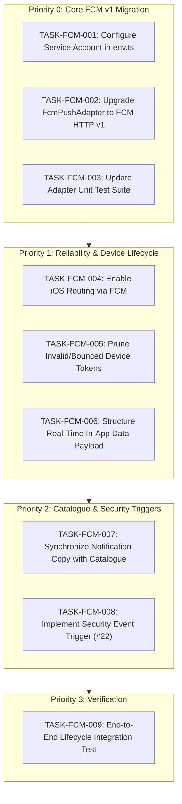

# FCM & In-App Notification — Backend Task Register

| Metadata | Details |
| :--- | :--- |
| **Feature** | FCM Push & In-App Notification Delivery (Backend) |
| **Status** | Open / Ready for Implementation |
| **Date** | October 2026 |
| **Reference Specs** | [`docs/Notification-Catalogue.md`](Notification-Catalogue.md) · [`docs/Async-Contract.md`](Async-Contract.md) §7 · [`docs/Architecture-Backend.md`](Architecture-Backend.md) §15 |
| **Target Service** | `backend` (NestJS Monolith) |

---

## 1. Architectural Overview & Context

The backend notification infrastructure consists of:
1. **Persistent In-App Center**: PostgreSQL-backed `Notification` and `NotificationDelivery` tables for unread counts, pagination, and user inboxes.
2. **Push Delivery**: Abstracted behind the `PushGateway` port ([`push.port.ts`](../backend/src/platform/ports/push.port.ts)), currently routed via [`routed-push.adapter.ts`](../backend/src/platform/adapters/push/routed-push.adapter.ts).
3. **Outbox Event Dispatching**: Listens to 17+ domain events via [`notification.dispatcher.ts`](../backend/src/modules/notifications/application/notification.dispatcher.ts) and resolves recipients and templates.

### Database Status
- **Schema & Migrations**: Already **fully implemented and up to date** in Prisma (`Notification`, `NotificationDelivery`, `Device`, `NotificationPreference`).
- **No new database migrations are required** for this slice.

---

## 2. Task Breakdown



---

### Priority 0: Critical (FCM HTTP v1 Migration)

#### TASK-FCM-001: Add Firebase Service Account Credentials to Environment Config
- **Priority**: P0
- **Target File**: [`backend/src/config/env.ts`](../backend/src/config/env.ts)
- **Description**: Deprecate legacy `FCM_SERVER_KEY` and add support for Firebase Service Account authentication.
- **Specification**:
  - Add optional `FIREBASE_SERVICE_ACCOUNT_JSON` (raw JSON string for containerized / 12-factor environments).
  - Add optional `GOOGLE_APPLICATION_CREDENTIALS` (path to service account JSON file).
  - Ensure `FIREBASE_PROJECT_ID` is defined.

#### TASK-FCM-002: Upgrade `FcmPushAdapter` to FCM HTTP v1 API
- **Priority**: P0
- **Target File**: [`backend/src/platform/adapters/fcm/fcm-push.adapter.ts`](../backend/src/platform/adapters/fcm/fcm-push.adapter.ts)
- **Description**: Migrate from deprecated legacy FCM endpoint to Google's FCM HTTP v1 API (`https://fcm.googleapis.com/v1/projects/{projectId}/messages:send`).
- **Specification**:
  - Acquire OAuth 2.0 access token using scope `https://www.googleapis.com/auth/firebase.messaging` (via `google-auth-library` or `firebase-admin`).
  - Format request payload to match FCM v1 schema:
    ```json
    {
      "message": {
        "token": "<target_token>",
        "notification": {
          "title": "<localized_title>",
          "body": "<localized_body>"
        },
        "data": {
          "deepLink": "<client_route>",
          "type": "<notification_type>"
        },
        "android": {
          "priority": "HIGH",
          "notification": {
            "channel_id": "default",
            "click_action": "FLUTTER_NOTIFICATION_CLICK"
          }
        },
        "apns": {
          "payload": {
            "aps": {
              "sound": "default",
              "contentAvailable": true
            }
          }
        }
      }
    }
    ```
  - Maintain stub behavior when credentials are absent (`providerRef: 'stub:fcm'`).

#### TASK-FCM-003: Update Adapter Unit Test Suite
- **Priority**: P0
- **Target File**: [`backend/src/platform/adapters/fcm/fcm-push.adapter.spec.ts`](../backend/src/platform/adapters/fcm/fcm-push.adapter.spec.ts)
- **Description**: Update unit tests to mock and verify the FCM v1 endpoint, payload structure, and OAuth 2.0 authorization headers.

---

### Priority 1: Delivery Reliability & Device Lifecycle

#### TASK-FCM-004: Enable iOS Routing via FCM in `RoutedPushAdapter`
- **Priority**: P1
- **Target File**: [`backend/src/platform/adapters/push/routed-push.adapter.ts`](../backend/src/platform/adapters/push/routed-push.adapter.ts)
- **Description**: Flutter mobile clients use `firebase_messaging` on both Android and iOS. Route iOS tokens through `FcmPushAdapter` by default unless APNs direct HTTP/2 credentials are explicitly configured.

#### TASK-FCM-005: Automatic Stale & Bounced Token Pruning
- **Priority**: P1
- **Target Files**:
  - [`backend/src/platform/adapters/fcm/fcm-push.adapter.ts`](../backend/src/platform/adapters/fcm/fcm-push.adapter.ts)
  - [`backend/src/modules/notifications/application/notification.service.ts`](../backend/src/modules/notifications/application/notification.service.ts)
  - [`backend/src/modules/notifications/repository/notification.repository.ts`](../backend/src/modules/notifications/repository/notification.repository.ts)
- **Description**: Handle token invalidation when FCM returns errors like `UNREGISTERED`, `NOT_FOUND`, or `registration-token-not-registered`.
- **Specification**:
  - Return `status: 'BOUNCED'` from `FcmPushAdapter`.
  - In `NotificationService` / `NotificationRepository`, delete or deactivate the corresponding token from the `Device` table to avoid wasteful dispatch retries.

#### TASK-FCM-006: Standardize FCM Data Payload for Real-Time In-App Handling
- **Priority**: P1
- **Target Files**:
  - [`backend/src/platform/ports/push.port.ts`](../backend/src/platform/ports/push.port.ts)
  - [`backend/src/modules/notifications/application/notification.service.ts`](../backend/src/modules/notifications/application/notification.service.ts)
- **Description**: Pass structured notification ID and category within `message.data` to allow the active Flutter foreground handler to display an in-app banner/toast and immediately invalidate the local unread count query cache.

---

### Priority 2: Catalogue Copy & Security Triggers

#### TASK-FCM-007: Synchronize Notification Copy with Catalogue
- **Priority**: P2
- **Target File**: [`backend/src/modules/notifications/domain/notification.copy.ts`](../backend/src/modules/notifications/domain/notification.copy.ts)
- **Description**: Replace placeholder dictionary text with the finalized bilingual (EN/AR) copy specified in [`docs/Notification-Catalogue.md`](Notification-Catalogue.md). Enforce `BR-008` (no competitor name or pricing disclosure).

#### TASK-FCM-008: Implement Security Event Trigger (Trigger #22)
- **Priority**: P2
- **Target File**: [`backend/src/modules/notifications/domain/notification.plans.ts`](../backend/src/modules/notifications/domain/notification.plans.ts)
- **Description**: Add dispatch support for Trigger #22 (`security.event` — OTP, password changed, new device login, account suspension) with `isCritical: true` to bypass quiet hours and user opt-outs (`FR-SYS-008.2`).

---

### Priority 3: Verification & Integration Testing

#### TASK-FCM-009: End-to-End Notification Lifecycle Test
- **Priority**: P3
- **Target File**: `backend/test/integration/notification-flow.spec.ts`
- **Description**: Validate the complete flow:
  1. Register device (`POST /v1/devices`).
  2. Emit outbox event (`request.matched`).
  3. Validate `notification` row creation (`IN_APP` DELIVERED) and `notification_delivery` row (`PUSH` SENT).
  4. Query unread count (`GET /v1/notifications/unread-count`).
  5. Mark as read (`POST /v1/notifications/:id/read`) and verify unread count decreases.
