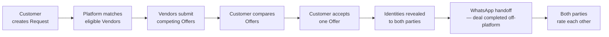
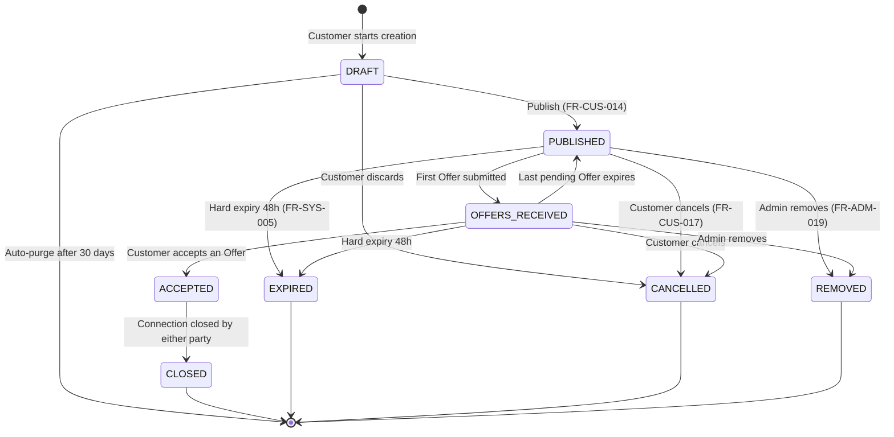
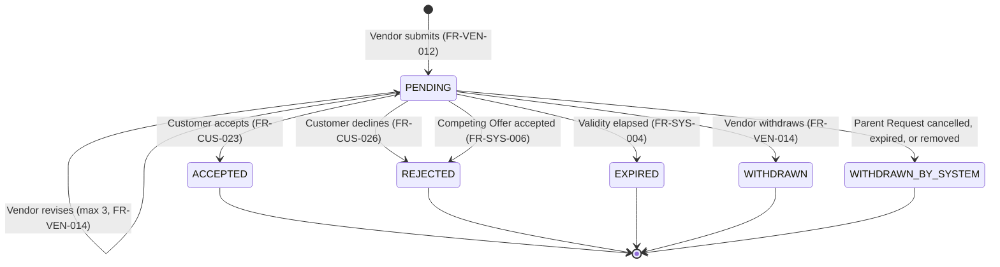
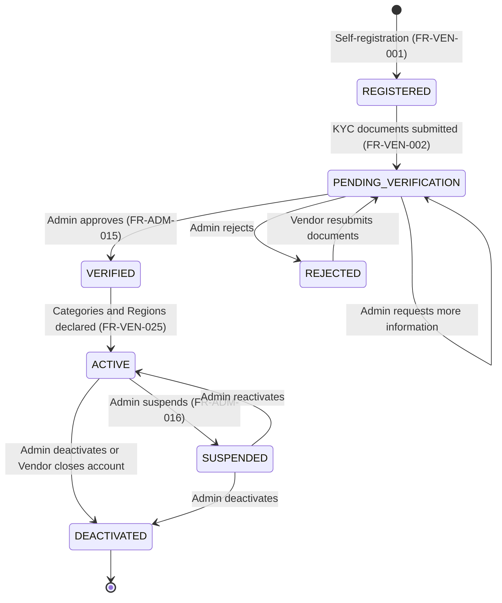
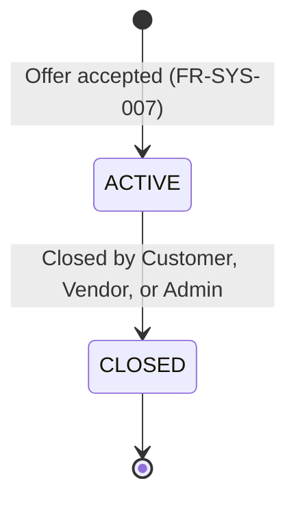
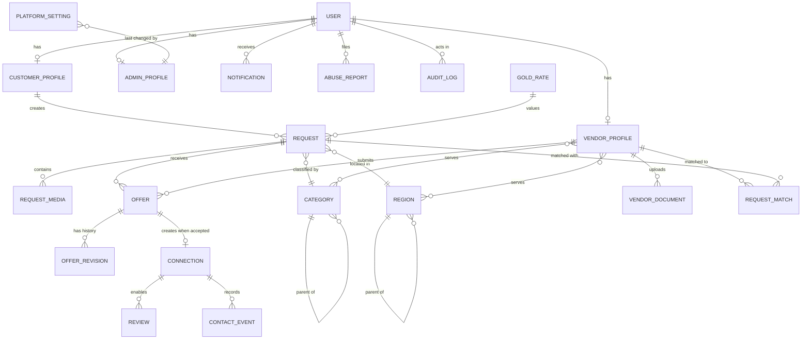

# Karat Hive — Software Requirements Specification

| | |
|---|---|
| **Product** | Karat Hive — Digital Jewellery Marketplace |
| **Document** | Software Requirements Specification (SRS) |
| **Version** | 1.2 |
| **Status** | Draft — PO walk decisions applied (§1–3, §5, §9) + technology stack fixed (§2.4, §2.5) |
| **Date** | 10 August 2026 |
| **Supersedes** | `docs/old/Requirements-Spec-v1.1.md` (v1.1), `docs/old/Requirements-Spec.md` (v1.0) |
| **Source** | `docs/Requirements-raw.txt` (incl. Technical section, L96–L103) + PO decisions 10 Aug 2026 |
| **Standard** | Structured per IEEE Std 830-1998 |

---

## Table of Contents

1. [Introduction](#1-introduction)
2. [Overall Description](#2-overall-description)
3. [Actors, Personas and Permissions](#3-actors-personas-and-permissions)
4. [Functional Requirements](#4-functional-requirements)
   - 4.1 [Customer — `FR-CUS`](#41-customer-requirements-fr-cus)
   - 4.2 [Vendor / Jeweller — `FR-VEN`](#42-vendor--jeweller-requirements-fr-ven)
   - 4.3 [Platform Admin — `FR-ADM`](#43-platform-admin-requirements-fr-adm)
   - 4.4 [System / Cross-cutting — `FR-SYS`](#44-system--cross-cutting-requirements-fr-sys)
5. [Business Rules and State Machines](#5-business-rules-and-state-machines)
6. [Data Model](#6-data-model)
7. [External Interface Requirements](#7-external-interface-requirements)
8. [Non-Functional Requirements](#8-non-functional-requirements)
9. [Assumptions, Constraints, Dependencies and Scope Boundaries](#9-assumptions-constraints-dependencies-and-scope-boundaries)
   - 9.5 [Commercial Decisions (resolved)](#95-commercial-decisions-resolved--v11)
   - 9.6 [PO decisions applied in v1.1](#96-product-owner-decisions-applied-in-v11-cross-cutting)
   - 9.7 [Technology decisions applied in v1.2](#97-technology-decisions-applied-in-v12)
10. [Appendices](#10-appendices)

---

## 1. Introduction

### 1.1 Purpose

This document specifies the complete functional and non-functional requirements for **Karat Hive**, a digital jewellery marketplace connecting retail customers with verified gold vendors and jewellers.

It is written to be sufficient, without further clarification, to:

- drive UI/UX design and screen definition,
- drive data modelling and API design,
- support effort estimation and sprint planning,
- serve as the basis for QA test-case authoring and User Acceptance Testing.

### 1.2 Intended Audience

| Audience | How to read this document |
|---|---|
| Product Owner / Business stakeholder | §1, §2, §3, §5, §9 — then confirm every `[ASSUMED]` requirement |
| UX / UI Designer | §3, §4, §7.1, Appendix C |
| Solution Architect / Backend Engineer | §4, §5, §6, §7, §8 |
| Mobile Engineer | §4.1, §4.2, §7.1, §7.2, §8 |
| QA Engineer | §4 (acceptance criteria), §5, Appendix B |
| Compliance / Legal | §8.4, §8.5, §9 |

### 1.3 Document Conventions

**Requirement identifiers.** Every requirement carries a stable, globally unique, never-reused identifier:

| Prefix | Meaning |
|---|---|
| `FR-CUS-nnn` | Functional requirement — Customer |
| `FR-VEN-nnn` | Functional requirement — Vendor / Jeweller |
| `FR-ADM-nnn` | Functional requirement — Platform Admin |
| `FR-SYS-nnn` | Functional requirement — System / cross-cutting (no direct human actor) |
| `BR-nnn` | Business rule |
| `NFR-nnn` | Non-functional requirement |

**Priority.** MoSCoW classification:

| Priority | Meaning |
|---|---|
| **Must** | v1.0 does not ship without it |
| **Should** | Important; targeted for v1.0, may slip to v1.1 |
| **Could** | Desirable; included only if capacity allows |
| **Won't (v1)** | Explicitly deferred beyond v1.0; recorded so it is not silently reintroduced |

**Modal verbs.** "Shall" denotes a binding requirement. "Should" denotes a recommendation. "May" denotes an option.

**The `[ASSUMED]` tag.** The source material (`docs/Requirements-raw.txt`) is an outline and is silent on a number of concerns that a functioning marketplace cannot omit — registration, offer expiry, notifications, media limits, and others. Rather than leave gaps, this document specifies them as full requirements and marks each with **`[ASSUMED]`**.

> ⚠️ **Action required of the Product Owner:** every `[ASSUMED]` requirement is the specification author's inference, not a stated business decision. Each must be explicitly **confirmed**, **amended**, or **struck** before development begins. Appendix B lists all of them in one place.

**Traceability.** Every requirement's **Source** field cites either the originating line in `docs/Requirements-raw.txt` (e.g. *raw §1.1, L17*) or `[ASSUMED]`. Appendix B provides the full bidirectional matrix.

### 1.4 Product Scope

Karat Hive is a **request-driven, three-sided marketplace** for gold and gold jewellery, operating in the **United Arab Emirates** market with **AED** as the transaction currency.

Its central mechanic inverts the conventional e-commerce model. Rather than browsing vendor inventory, a **Customer posts a Request** describing what they want to buy or sell. The platform distributes that Request to eligible **verified Vendors**, who respond with competing **Offers**. The Customer compares the Offers and accepts one. Only at that moment do the two parties' identities become mutually visible, and the conversation moves to WhatsApp.

**In scope for v1.0:** account management for all three actors (Customer **OAuth once** before any Request may be published), vendor verification (marketplace access only when `ACTIVE`), the four Request types (**hard-expire 48 hours** after publish), offer submission and comparison, offer acceptance and identity reveal, WhatsApp handoff, two-way ratings (**hold-for-approval** moderation), notifications, vendor **subscription priced per Request type**, reference gold rates from **Yahoo Finance**, and a full administrative back-office.

**Delivery surface:** a **single dual-mode mobile application** (Customer mode and Vendor mode), plus the Admin web portal and backend.

**Out of scope for v1.0** — see §9.4 for the complete list with rationale. In summary: no in-app payments or escrow, no logistics or delivery tracking, no in-app messaging beyond the WhatsApp handoff, and no jewellery assaying or authentication service. **v1.0 geography is UAE / AED only**; Kerala and Qatar are a post-UAE roadmap (see §9.5).

### 1.5 References

| Ref | Document |
|---|---|
| R1 | `docs/Requirements-raw.txt` — original raw requirement notes (the sole source input to this SRS) |
| R2 | IEEE Std 830-1998 — Recommended Practice for Software Requirements Specifications |
| R3 | UAE Federal Decree-Law No. 45 of 2021 — Personal Data Protection Law (PDPL) |
| R4 | WhatsApp Click-to-Chat specification (`https://wa.me/` deep-link format) |
| R5 | WCAG 2.1 Level AA — Web Content Accessibility Guidelines |

---

## 2. Overall Description

### 2.1 Product Perspective

Karat Hive is a **new, self-contained system** with no predecessor and no requirement to integrate with an existing platform. It comprises three deployable components:

| Component | Users | Platform |
|---|---|---|
| **Mobile App (dual-mode)** | Customers and Vendors / Jewellers | **Flutter** — iOS + Android, one binary, two modes |
| **Admin Portal** | Platform Admins | **Flutter Web**, responsive from 1280 px `[ASSUMED]` — see C-10 |
| **Backend Platform** | — | **Node.js monolith** over **PostgreSQL** + object storage, with job scheduler and notification gateway inside the same deployable |

The technology stack is prescribed by the source material (`Requirements-raw.txt` L96–L103) and is not an open engineering choice. It is stated as constraints C-10 through C-13 in §2.5 and reasoned about in `docs/adr/0006` and `docs/adr/0007`.

The Customer and Vendor experiences are delivered as **two modes of one mobile application** (PO decision, v1.1). Mode is determined by account role; a given account operates in exactly one role (Customer **or** Vendor), not both simultaneously. Workflows still differ: a Customer opens the app occasionally to post a Request and review Offers; a Vendor uses it as a working tool, monitoring an inbound request feed throughout the business day. UI density and navigation may diverge by mode within the shared shell.

### 2.2 The Core Value Loop

Two properties of this loop define the product and shape most requirements in §4:

**Identity masking is the platform's core asset.** Until a Customer accepts an Offer, neither side can identify the other. This is what compels Vendors to compete on price and terms rather than route the customer to an existing off-platform relationship, and it is what protects the Customer from being contacted by every Vendor who sees their Request. Requirements `FR-SYS-003`, `BR-006`, `BR-007` and `NFR-013` exist to enforce it.

**Transaction completion happens off-platform.** Karat Hive brokers the introduction; it does not process the sale. The platform therefore has no authoritative knowledge of whether a deal actually closed, at what price, or whether goods changed hands. This is a deliberate v1 scope decision (§9.4) with consequences the business must accept: platform analytics measure *introductions*, not *transactions*, and the rating system is the only feedback channel on deal quality.

### 2.3 User Classes

| Class | Description | Volume (est.) | Technical proficiency |
|---|---|---|---|
| **Customer** | Retail individual buying or selling gold ornaments, coins, or bullion. Self-registers. Unverified. | High — the majority of accounts | Low to moderate; consumer-grade mobile literacy assumed |
| **Vendor / Jeweller** | Registered gold business or independent jeweller. Must pass Admin verification before transacting. | Low relative to Customers; each is high-value and high-frequency | Moderate; uses the app as a daily business tool |
| **Platform Admin** | Karat Hive staff. Provisioned internally — never self-registers. | Very low (single-digit to low tens) | High; trained on the Admin Portal |

### 2.4 Operating Environment

| Aspect | Requirement |
|---|---|
| Dual-mode mobile app | **Flutter**, targeting iOS 15+ and Android 9 (API 28)+ — single install for Customer or Vendor mode |
| Admin Portal | **Flutter Web**, served over current-and-previous major versions of Chrome, Edge, Safari, and Firefox; responsive from 1280 px upward |
| Backend runtime | **Node.js** (active LTS at build freeze), deployed as a **single monolithic service** |
| Database | **PostgreSQL** — the system of record for every entity in §6 |
| Object storage | S3-compatible object storage for Request media and Vendor KYC documents — **provider not yet selected** (§7.6, C-13) |
| Connectivity | Persistent internet connection required; no offline transaction capability in v1 |
| External dependency | WhatsApp installed on the device for the post-acceptance handoff (with a web fallback — see `FR-CUS-027`) |
| Gold rate feed | Yahoo Finance (see §7.4) |
| Hosting | Cloud-hosted; region selected to satisfy UAE data-residency expectations for v1.0 (see `NFR-020`) |

### 2.5 Design and Implementation Constraints

| ID | Constraint |
|---|---|
| C-01 | v1.0 transaction currency is **AED**. All monetary values for UAE operations are stored and displayed in AED. Multi-currency arrives only with post-UAE markets (§9.5). |
| C-02 | Gold weight is expressed in **grams**; purity is expressed in **karat** (24K, 22K, 21K, 18K) and, where applicable, fineness (999, 916, 875, 750). |
| C-03 | Post-acceptance communication uses **WhatsApp**. The platform does not build or operate a messaging system in v1. |
| C-04 | Only Vendors in the `VERIFIED` **and** `ACTIVE` state may view or respond to Requests (`BR-002`). Pending vendors may sign in only to an **Awaiting Approval** shell. |
| C-05 | Customer identity is masked from Vendors, and Vendor identity from Customers, until an Offer is accepted (`BR-006`). |
| C-06 | Gold Bullion Requests are subject to a **minimum value of AED 500** (`BR-010`). |
| C-07 | A published Request **hard-expires 48 hours** after publication. No Customer extension is offered (`FR-SYS-005`). |
| C-08 | Customer and Vendor mobile experiences ship as **one dual-mode application** (§2.1). |
| C-09 | Revenue is a **Vendor subscription**, sold **separately per Request type** the Vendor is entitled to serve (`FR-VEN-031`). |
| C-10 | **Flutter is the sole client framework** for all three user surfaces. The Admin Portal is a Flutter Web target of the same toolchain rather than a separate web application `[ASSUMED]` — the source states Flutter targets "IOS/Android/Web" but does not explicitly bind the Admin Portal to that web target. See `docs/adr/0006`. |
| C-11 | The backend ships as a **single Node.js monolithic deployable**. No service decomposition, no inter-service network contracts, and no message broker in v1. Background work (fan-out, expiry sweeps, rate polling, notification dispatch — `FR-SYS-001`, `-004`, `-005`, `-008`, `-010`) runs as scheduled workers inside that deployable. See `docs/adr/0007`. |
| C-12 | **PostgreSQL** is the single system of record. Every entity in §6 is relational; no secondary datastore is introduced in v1 for search, cache, or analytics. |
| C-13 | **Object storage provider is undecided** (`Requirements-raw.txt` L102 is blank). This is a live blocker for `FR-CUS-007` (Request media), `FR-VEN-002` (KYC documents), `FR-SYS-009` (media processing), `NFR-013` (signed, time-limited media URLs) and `NFR-019` (PDPL erasure). See §7.6. |

### 2.6 Assumptions and Dependencies

Consolidated in §9. The dependencies with the greatest delivery risk are the **WhatsApp deep-link handoff** (§7.2), the **push notification gateway** (§7.3), and the **Yahoo Finance gold-rate feed** (§7.4) — provider chosen by PO (v1.1); licensing/terms of redistribution to end users still require legal sign-off.

---

## 3. Actors, Personas and Permissions

### 3.1 Customer

**Goal.** Get the best available price and terms for a gold purchase or sale without visiting multiple shops, and without exposing their phone number to a dozen vendors.

**Behaviour.** Low session frequency, high intent. Opens the app with a specific need, creates a Request, then returns intermittently over the following **48-hour** Request window as Offers arrive. Price-sensitive and comparison-driven. Wary of unsolicited contact.

**Account lifecycle:** `REGISTERED → ACTIVE → (SUSPENDED) → (DEACTIVATED)`

**Identity / OAuth.** No business KYC. The Customer must complete **OAuth once** (supported providers configured by the platform — e.g. Google / Apple / phone-backed identity as implemented) before any Request may be published (`BR-001`, `FR-CUS-001`). After that one successful OAuth binding, subsequent Requests do not re-require OAuth. A Customer transacts as an individual and is not Admin-vetted.

### 3.2 Vendor / Jeweller

**Goal.** Acquire a steady stream of qualified, high-intent leads that would not otherwise walk into the shop, and win them by responding faster and pricing better than competing vendors.

**Behaviour.** High session frequency. Monitors the inbound Request feed throughout the business day; responsiveness is a direct competitive advantage. Values dense information display, fast filtering, and reliable real-time notification.

**Account lifecycle:** `REGISTERED → PENDING_VERIFICATION → VERIFIED → ACTIVE ⇄ SUSPENDED → DEACTIVATED`
A Vendor may also be `REJECTED` at the verification stage (see §5.4).

**Verification.** Mandatory and **manual** (`BR-003`). Until Admin approval yields `ACTIVE`, a Vendor who signs in sees only an **Awaiting Approval** (or rejection / more-info) shell — **no** Request feed, dashboard marketplace data, or Offer actions (`FR-VEN-003`). **No service-level turnaround is promised** for verification (`FR-ADM-015`). Subscription entitlements are sold **per Request type** (`FR-VEN-031`).

### 3.3 Platform Admin

**Goal.** Keep the marketplace trustworthy and liquid — admit legitimate vendors quickly, remove bad actors, and monitor platform health.

**Behaviour.** Desk-based, web portal, working through queues: verification backlog, abuse reports, review moderation.

**Account lifecycle:** Provisioned internally only. Self-registration is not possible under any circumstance (`FR-ADM-002`).

### 3.4 Permissions Matrix

Legend: **✓** full · **◐** partial or masked · **✗** none

| Capability | Customer | Vendor | Admin |
|---|:---:|:---:|:---:|
| Self-register | ✓ | ✓ (subject to verification) | ✗ |
| Create a Request | ✓ | ✗ | ✗ |
| View own Requests | ✓ | — | ✓ (all) |
| View others' Requests | ✗ | ◐ (matched, identity-masked) | ✓ (all) |
| Submit an Offer | ✗ | ✓ (if `VERIFIED` + `ACTIVE`) | ✗ |
| View Offers on own Request | ✓ | — | ✓ (all) |
| View competing Vendors' Offers | ✗ | ✗ | ✓ |
| Accept an Offer | ✓ | ✗ | ✗ |
| View counterparty identity | ◐ (post-acceptance only) | ◐ (post-acceptance only) | ✓ (always) |
| Rate the counterparty | ✓ | ✓ | ✗ |
| Verify a Vendor | ✗ | ✗ | ✓ |
| Suspend / deactivate an account | ✗ | ✗ | ✓ |
| Moderate reviews | ✗ | ✗ | ✓ |
| Manage categories & regions | ✗ | ✗ | ✓ |
| Broadcast announcements | ✗ | ✗ | ✓ |
| View platform analytics | ✗ | ◐ (own performance only) | ✓ |
| View audit log | ✗ | ✗ | ✓ |

---

## 4. Functional Requirements

Each requirement below states its **Priority**, its **Source** (a line reference into `docs/Requirements-raw.txt`, or `[ASSUMED]`), a normative statement, and **acceptance criteria** written to be directly convertible into test cases.

### 4.1 Customer Requirements (`FR-CUS`)

#### 4.1.1 Account and Identity

---

#### FR-CUS-001 · Customer Registration and OAuth Gate
**Priority:** Must · **Source:** `[ASSUMED]` refined by PO decision (v1.1) — OAuth once before any Request; the raw notes describe Customer activity but never specify account creation.

The system shall allow a prospective Customer to self-register using a UAE-format mobile number verified by one-time password (OTP), capturing name and mobile number as mandatory fields and email as optional, and shall require a **one-time OAuth identity binding** before any Request may be published.

**Acceptance criteria**
1. Registration succeeds only after the OTP sent to the supplied mobile number is correctly entered.
2. An OTP expires 5 minutes after issue; a maximum of 5 OTP requests per number per hour is enforced.
3. A mobile number already registered to an active account cannot be registered again; the user is directed to login instead.
4. On success the account is created in state `ACTIVE` and the user is signed in.
5. The user must accept the Terms of Service and Privacy Policy before the account is created; the accepted version identifier and timestamp are persisted.
6. **OAuth once:** before the first Request publish, the Customer must complete OAuth with a configured provider (e.g. Google and/or Apple Sign-In). The binding is stored on the account; subsequent sessions and Request publishes do **not** re-prompt for OAuth unless the binding is revoked by the user or Admin.
7. Publish of a Request is refused server-side if OAuth is not bound (`BR-001`). Profile browsing and draft composition may be allowed before OAuth; publish is not.

---

#### FR-CUS-002 · Customer Login and Session Management `[ASSUMED]`
**Priority:** Must · **Source:** `[ASSUMED]` — the raw notes specify login for Vendor (§2.1) and Admin (§3.1) but omit it for Customer.

The system shall authenticate a returning Customer by mobile number and OTP, and shall maintain the authenticated session across app restarts until explicit logout or session expiry.

**Acceptance criteria**
1. A valid mobile number plus correct OTP authenticates the Customer and restores their session.
2. A session persists across app restarts for 30 days of inactivity, after which re-authentication is required.
3. Logout invalidates the session token on the server, not only on the device.
4. Authentication is refused for accounts in state `SUSPENDED` or `DEACTIVATED`, with a message distinguishing the two cases.
5. Biometric unlock (Face ID / fingerprint) may be enabled by the Customer as a convenience layer over an existing valid session.

---

#### FR-CUS-003 · Customer Profile Management
**Priority:** Must · **Source:** raw §1.8 (L32)

The Customer shall be able to view and edit their profile: display name, email address, profile photo, preferred language, and default Region.

**Acceptance criteria**
1. The profile screen displays all stored profile attributes, plus account creation date and lifetime Request count.
2. Name, email, photo, language, and Region are editable and persist immediately on save.
3. Changing the registered mobile number requires OTP verification of the **new** number before the change takes effect.
4. Email address, if supplied, must be syntactically valid and is verified by a confirmation link.
5. Profile changes do not alter identity-masking behaviour on Requests already published (`BR-006`).

---

#### FR-CUS-004 · Customer Account Deactivation and Deletion `[ASSUMED]`
**Priority:** Should · **Source:** `[ASSUMED]` — required by UAE PDPL (R3) right-to-erasure, absent from raw notes.

The Customer shall be able to deactivate their account, and to request permanent deletion of their personal data.

**Acceptance criteria**
1. Deactivation immediately closes all `PUBLISHED` Requests owned by the Customer and blocks further login.
2. Deletion is a two-step confirmed action and is refused while the Customer has any Connection created within the preceding 30 days.
3. On deletion, personal identifiers are irreversibly removed or anonymised within 30 days; Requests and Offers are retained in anonymised form for platform analytics.
4. Reviews written by a deleted Customer are retained but attributed to "Deleted user".

---

#### 4.1.2 Request Creation — Common Behaviour

---

#### FR-CUS-005 · Create a Request
**Priority:** Must · **Source:** raw §1 (L15), §1.1–§1.4 (L17–26)

The Customer shall be able to create a Request of exactly one of four types — **Find An Ornament**, **Sell Old Gold**, **Buy/Sell Gold Coin(s)**, **Buy/Sell Gold Bullion** — through a guided, type-specific flow.

**Acceptance criteria**
1. Request type is selected first and cannot be changed after the Request is published; changing type before publishing resets type-specific fields.
2. Every Request captures, regardless of type: type, direction (`BUY` or `SELL`), Category, Region, free-text notes, and creation timestamp.
3. Direction is fixed by type where the type implies it — *Find An Ornament* is always `BUY`, *Sell Old Gold* is always `SELL` — and is user-selectable for Coins and Bullion.
4. Validation errors are reported inline against the offending field; the Request cannot be published until all are cleared.
5. A Customer may hold at most 10 concurrently `PUBLISHED` Requests. `[ASSUMED]`

---

#### FR-CUS-006 · Request Type — Find An Ornament
**Priority:** Must · **Source:** raw §1.1 (L17)

The Customer shall be able to create a *Find An Ornament* Request describing a piece of jewellery they wish to buy, so that Vendors can source or offer a matching item.

**Acceptance criteria**
1. The flow captures: reference image(s) (`FR-CUS-007`), ornament specification (`FR-CUS-008`), budget (`FR-CUS-009`), and free-text notes.
2. At least one reference image is mandatory for this Request type.
3. Ornament type (ring, chain, bangle, necklace, earring, bracelet, pendant, other) is mandatory.
4. Direction is fixed to `BUY` and is not user-editable.

---

#### FR-CUS-007 · Ornament Image Upload
**Priority:** Must · **Source:** raw §1.1.1 (L18), §1.2.1 (L22)

The Customer shall be able to attach photographic images to a Request, captured live via the device camera or selected from the device gallery.

**Acceptance criteria**
1. Between 1 and 5 images may be attached per Request.
2. Accepted formats are JPEG, PNG, and HEIC; maximum 10 MB per image before client-side compression. `[ASSUMED]`
3. Images are compressed client-side to a maximum edge of 2048 px prior to upload. `[ASSUMED]`
4. Upload progress is shown per image and a failed upload can be retried without restarting the Request flow.
5. An attached image can be removed or reordered before the Request is published; the first image is the Request thumbnail.
6. EXIF metadata — in particular GPS coordinates — is stripped server-side before the image is stored or served (`FR-SYS-009`, `NFR-014`).

---

#### FR-CUS-008 · Ornament Specification Capture
**Priority:** Must · **Source:** raw §1.1.1 (L18), §1.2.2 (L23)

The Customer shall be able to record the physical specification of the ornament: approximate weight in grams, purity in karat, ornament type, and optional gemstone details.

**Acceptance criteria**
1. Weight accepts a positive decimal to two places, in grams, within the range 0.10 g – 5000.00 g.
2. Purity is chosen from the configured karat list (24K, 22K, 21K, 18K) — see `FR-ADM-030`.
3. Weight may be flagged **approximate**, which is displayed as such to Vendors so that Offers are understood to be indicative.
4. Gemstone presence, type, and count are optional and, when supplied, are shown on the Vendor's Request detail view.
5. The reference gold rate for the selected purity is displayed alongside the weight field (`FR-CUS-020`).

---

#### FR-CUS-009 · Budget Specification
**Priority:** Must · **Source:** raw §1.1.2 (L19)

The Customer shall be able to state a budget for a `BUY` Request, either as a single maximum figure or as a minimum–maximum range in AED.

**Acceptance criteria**
1. Budget is mandatory for *Find An Ornament* and optional for other `BUY` types.
2. Where a range is given, the minimum must be strictly less than the maximum; violation is blocked with an inline error.
3. The budget is displayed to matched Vendors on the Request detail view.
4. The Customer may mark the budget **flexible**, which is surfaced to Vendors as an indication that Offers outside the stated range will still be considered. `[ASSUMED]`

---

#### FR-CUS-010 · Request Type — Sell Old Gold
**Priority:** Must · **Source:** raw §1.2 (L21)

The Customer shall be able to create a *Sell Old Gold* Request to solicit purchase Offers for gold jewellery they currently own.

**Acceptance criteria**
1. The flow captures image(s) of the actual item (`FR-CUS-007`) and its specification (`FR-CUS-008`).
2. At least one image of the actual item is mandatory — stock or catalogue imagery is not acceptable for this type, and the Customer is advised of this in the flow.
3. Item condition (excellent / good / fair / damaged) and possession of the original purchase invoice or hallmark certificate are captured as optional attributes. `[ASSUMED]`
4. Direction is fixed to `SELL` and is not user-editable.
5. An indicative valuation, computed from the stated weight and purity against the current reference rate, is displayed before publishing, clearly labelled as an estimate and not an offer (`FR-CUS-020`).

---

#### FR-CUS-011 · Request Type — Buy/Sell Gold Coins
**Priority:** Must · **Source:** raw §1.3 (L25)

The Customer shall be able to create a Request to buy or sell gold coins, specifying denomination, quantity, purity, and mint or brand where known.

**Acceptance criteria**
1. Direction (`BUY` / `SELL`) is explicitly selected by the Customer and is mandatory.
2. Coin denomination (in grams — for example 1 g, 2.5 g, 5 g, 10 g, 20 g, 50 g, 100 g) and quantity are mandatory; quantity is a positive integer.
3. Total weight is computed and displayed as denomination × quantity.
4. Mint / brand and packaging condition (sealed / opened) are optional.
5. Images are optional for `BUY` and mandatory for `SELL`.

---

#### FR-CUS-012 · Request Type — Buy/Sell Gold Bullion
**Priority:** Must · **Source:** raw §1.4 (L26)

The Customer shall be able to create a Request to buy or sell gold bullion bars, specifying bar weight, quantity, purity, and refiner where known.

**Acceptance criteria**
1. Direction (`BUY` / `SELL`) is explicitly selected by the Customer and is mandatory.
2. Bar weight and quantity are mandatory; purity defaults to 999 fineness (24K) and is editable.
3. Refiner or brand and serial/assay-certificate presence are optional attributes.
4. The Request is subject to the minimum-value rule in `FR-CUS-013`.
5. Images are optional for `BUY` and mandatory for `SELL`.

---

#### FR-CUS-013 · Gold Bullion Minimum Value
**Priority:** Must · **Source:** raw §1.4 (L26) — "Minimum value @AED.500"

The system shall reject any Gold Bullion Request whose computed indicative value falls below **AED 500**.

**Acceptance criteria**
1. Indicative value is computed as `total weight (g) × current reference rate for the stated purity (AED/g)`.
2. If the computed value is below AED 500 the Request cannot be published, and an explanatory message states the minimum and the computed value.
3. The threshold is not hard-coded: it is a platform setting maintained by an Admin (`FR-ADM-031`), and a change to it applies only to Requests published thereafter.
4. The rule applies to Gold Bullion Requests only, in both `BUY` and `SELL` directions.
5. The check is enforced server-side; a client that bypasses the check receives a validation failure from the API.

---

#### FR-CUS-014 · Publish a Request
**Priority:** Must · **Source:** raw §1.1.3 (L20), §1.2.3 (L24), §1.3 (L25), §1.4 (L26) — "Create Post" / "Create & Send Post"

The Customer shall be able to publish a completed Request, at which point it becomes visible to matched Vendors and begins accepting Offers.

**Acceptance criteria**
1. Publishing transitions the Request from `DRAFT` to `PUBLISHED` and stamps `published_at`.
2. All type-specific mandatory fields are validated server-side before the transition is permitted.
3. On publication the Request is fanned out to eligible Vendors and notifications are dispatched (`FR-SYS-001`, `FR-SYS-008`).
4. The Customer receives an on-screen confirmation showing the Request reference and the **hard expiry** (publication time + **48 hours**, `FR-SYS-005` / `C-07`).
5. A published Request is assigned a human-readable reference (e.g. `KH-RQ-2026-004821`) used in all subsequent communication.
6. Publish is refused if the Customer has not completed the one-time OAuth binding (`FR-CUS-001`, `BR-001`).

---

#### FR-CUS-015 · Save a Request as Draft `[ASSUMED]`
**Priority:** Should · **Source:** `[ASSUMED]` — implied by the multi-step creation flows in raw §1.1–§1.2 but never stated.

The Customer shall be able to save an incomplete Request as a draft and resume it later.

**Acceptance criteria**
1. A draft is saved without mandatory-field validation and is visible only to its owner.
2. Drafts are never fanned out to Vendors and never appear in any Vendor view.
3. A draft can be resumed at the step at which it was abandoned, with all captured data and uploaded images intact.
4. Drafts older than 30 days are automatically purged, after a notification to the Customer 3 days prior.

---

#### FR-CUS-016 · Edit a Published Request `[ASSUMED]`
**Priority:** Should · **Source:** `[ASSUMED]` — not addressed in the raw notes.

The Customer shall be able to amend the notes and budget of a `PUBLISHED` Request that has not yet had an Offer accepted.

**Acceptance criteria**
1. Editing is permitted while the Request is in `PUBLISHED` or `OFFERS_RECEIVED`; it is blocked once an Offer has been accepted.
2. Structural attributes — Request type, direction, weight, purity, quantity — are **not** editable after publication, because existing Offers were priced against them.
3. Notes, budget, and images are editable.
4. Every edit is versioned and every Vendor holding a pending Offer on the Request is notified of the change.
5. Vendors may revise their Offer following an edit (`FR-VEN-014`).

---

#### FR-CUS-017 · Cancel a Request `[ASSUMED]`
**Priority:** Must · **Source:** `[ASSUMED]` — the raw notes provide no way for a Customer to stop a Request.

The Customer shall be able to cancel a Request they no longer wish to pursue.

**Acceptance criteria**
1. Cancellation is available while the Request is in `DRAFT`, `PUBLISHED`, or `OFFERS_RECEIVED`.
2. Cancellation transitions the Request to `CANCELLED` and automatically transitions all pending Offers on it to `WITHDRAWN_BY_SYSTEM`.
3. Every Vendor holding a pending Offer is notified of the cancellation.
4. A Request that has reached `ACCEPTED` cannot be cancelled; it can only be `CLOSED` (`BR-013`).
5. The Customer is asked for an optional cancellation reason from a configured list, retained for analytics.

---

#### FR-CUS-018 · Reference Gold Rate Display `[ASSUMED]`
**Priority:** Should · **Source:** `[ASSUMED]` — no rate mechanism appears in the raw notes, yet the AED 500 bullion floor (raw §1.4) cannot be evaluated without one.

The system shall display the current reference gold rate, per karat in AED per gram, at the points where a Customer states weight, budget, or reviews Offers.

**Acceptance criteria**
1. The rate is shown for each supported purity with the timestamp at which it was last updated.
2. The rate is labelled as **indicative** and explicitly not a quotation or an offer.
3. Where the feed is stale beyond the configured threshold (default 60 minutes), the display is visually marked stale and the age is shown.
4. If no rate is available, rate-dependent screens degrade gracefully: the indicative valuation is suppressed rather than shown as zero, and Request creation is not blocked — except for Bullion, where `FR-CUS-013` requires a rate and the Customer is asked to retry shortly.

---

#### 4.1.3 Offers and Acceptance

---

#### FR-CUS-019 · View Incoming Offers
**Priority:** Must · **Source:** raw §1.5 (L28)

The Customer shall be able to view all Offers received against each of their Requests.

**Acceptance criteria**
1. Offers are listed against their parent Request with count, and unread Offers are visually distinguished.
2. Each list row shows: offered price, Vendor's masked display label, Vendor aggregate rating, Vendor's completed-connection count, offer submission time, and offer expiry.
3. The Vendor's real identity — business name, contact details, address — is **not** shown at this stage (`BR-006`).
4. The list updates without a manual refresh when a new Offer arrives while the screen is open.
5. Where no Offers have yet been received, an explanatory empty state is shown with the Request's expiry date.

---

#### FR-CUS-020 · Compare Offers
**Priority:** Must · **Source:** raw §1.5 (L28) — "View & Compare Incoming Offers"

The Customer shall be able to compare Offers on a single Request side by side across their differentiating attributes.

**Acceptance criteria**
1. At least 2 and up to 4 Offers may be selected for simultaneous side-by-side comparison.
2. The comparison presents, row-aligned: price, price difference against the lowest/highest competing Offer, making charges, delivery or readiness timeframe, warranty or buy-back terms, Vendor rating, and Vendor completed-connection count.
3. The best value in each comparable numeric row is visually highlighted, with the direction of "best" determined by Request direction — lowest price for `BUY`, highest for `SELL`.
4. An Offer can be accepted directly from the comparison view.
5. Vendor identity remains masked throughout comparison.

---

#### FR-CUS-021 · Sort and Filter Offers `[ASSUMED]`
**Priority:** Should · **Source:** `[ASSUMED]` — implied by "compare" in raw §1.5 but not specified.

The Customer shall be able to sort and filter the Offers on a Request.

**Acceptance criteria**
1. Sort options: price (ascending / descending), Vendor rating, submission time (newest / oldest), expiring soonest.
2. Filter options: minimum Vendor rating, price range, and exclusion of Offers expiring within a chosen window.
3. The default sort favours the Customer's interest by direction — lowest price first for `BUY`, highest first for `SELL`.
4. The active sort and filter selection persists for the duration of the session.

---

#### FR-CUS-022 · View Offer Detail `[ASSUMED]`
**Priority:** Must · **Source:** `[ASSUMED]` — the raw notes specify a Vendor-side "Request Details" view (§2.3.2) but no corresponding Customer-side Offer detail view.

The Customer shall be able to open a single Offer to view its full terms before deciding.

**Acceptance criteria**
1. The detail view shows every attribute the Vendor supplied on submission (`FR-VEN-012`), including any attached images and the Vendor's free-text note.
2. The Vendor is represented by a masked label (for example "Verified Jeweller · Deira · ★ 4.6 · 128 deals") together with their public rating summary and review excerpts.
3. Actions available from the detail view: **Accept** (`FR-CUS-023`) and **Decline** (`FR-CUS-026`).
4. An expired or withdrawn Offer is displayed read-only with its status and the time of the status change.

---

#### FR-CUS-023 · Accept an Offer ("Mark as Interested")
**Priority:** Must · **Source:** raw §1.6 (L29)

The Customer shall be able to accept exactly one Offer per Request, an action labelled **Mark as Interested** in the user interface.

**Acceptance criteria**
1. Acceptance requires an explicit confirmation step that states plainly that identities will be revealed to both parties and cannot be undone.
2. On acceptance, the Offer transitions to `ACCEPTED`, the parent Request transitions to `ACCEPTED`, and a Connection record is created (`FR-SYS-007`).
3. All other pending Offers on the same Request are automatically transitioned to `REJECTED` and their Vendors are notified (`FR-SYS-006`).
4. Only one Offer per Request may ever reach `ACCEPTED` (`BR-011`); a concurrent second acceptance attempt fails with a clear error.
5. Acceptance is refused if the Offer has expired or been withdrawn since the screen was rendered, with an explanatory message.
6. Acceptance is an irreversible action; the Customer's remedy for a bad outcome is to close the Connection and leave a review.

---

#### FR-CUS-024 · Identity Reveal on Acceptance
**Priority:** Must · **Source:** raw §1.6.1 (L30) — "This reveals the identity of Customer & Vendor to each other"

Upon acceptance of an Offer, the system shall simultaneously reveal each party's contact identity to the other, and to neither party before that moment.

**Acceptance criteria**
1. The Customer is shown the Vendor's business name, contact person, mobile number, shop address, and Region.
2. The Vendor is shown the Customer's name and mobile number (`FR-VEN-021`).
3. The reveal is mutual and simultaneous; there is no state in which one party is identified and the other is not.
4. Identity data is released **only** in the context of the resulting Connection — it does not become visible on any other Request, Offer, or historical record.
5. Vendors whose Offers were rejected gain no visibility of the Customer's identity at any point.
6. Every identity reveal is written to the audit log with actor, counterparty, Connection reference, and timestamp (`FR-SYS-011`).

---

#### FR-CUS-025 · WhatsApp Handoff ("Talk" Button)
**Priority:** Must · **Source:** raw §1.6.1 (L30) — "Talk Button navigates to WhatsApp Messenger"

The system shall provide a **Talk** action on an active Connection that opens WhatsApp with the counterparty's number pre-filled and a pre-composed opening message.

**Acceptance criteria**
1. Talk constructs a `https://wa.me/<international-number>?text=<url-encoded-message>` deep link and hands it to the operating system.
2. The pre-composed message identifies the context — platform name, Request reference, and Offer summary — so that neither party opens a conversation without knowing what it concerns.
3. Where WhatsApp is not installed, the link opens WhatsApp Web in the device browser rather than failing.
4. The counterparty's number is also displayed as selectable text with a copy action, so the handoff is never a dead end if the deep link fails.
5. Use of the Talk action is logged against the Connection for analytics; the **content** of the resulting conversation is never accessible to the platform.

---

#### FR-CUS-026 · Decline an Offer `[ASSUMED]`
**Priority:** Should · **Source:** `[ASSUMED]` — raw §2.5.3 refers to "Rejected" Offers, but no rejection mechanism is defined.

The Customer shall be able to explicitly decline an individual Offer without accepting any other.

**Acceptance criteria**
1. Declining transitions that Offer to `REJECTED` and removes it from the active comparison set.
2. The Request remains open and continues to accept further Offers.
3. The Vendor is notified that their Offer was declined; the notification does not disclose competing Offer prices.
4. An optional, structured decline reason (price too high / terms unsuitable / no longer required / other) may be captured and is shown to the Vendor in aggregate form only.

---

#### FR-CUS-027 · Customer Connections List `[ASSUMED]`
**Priority:** Must · **Source:** `[ASSUMED]` — raw §2.6 defines Connections for the Vendor but omits the mirrored Customer view, without which the Customer cannot return to the Talk action.

The Customer shall be able to view all of their active and past Connections.

**Acceptance criteria**
1. Each entry shows the counterparty Vendor's revealed identity, the originating Request reference, the accepted Offer terms, and the connection date.
2. Active Connections offer the **Talk** action (`FR-CUS-025`) and a **Close Connection** action.
3. Closing a Connection prompts the Customer to leave a review (`FR-CUS-029`).
4. Closed Connections remain permanently accessible in read-only form.

---

#### 4.1.4 History, Feedback and Notifications

---

#### FR-CUS-028 · Customer History
**Priority:** Must · **Source:** raw §1.7 (L31)

The Customer shall be able to view the complete history of their Requests, the Offers received on each, and the outcome of each.

**Acceptance criteria**
1. History covers all Requests in terminal states — `ACCEPTED`, `CLOSED`, `EXPIRED`, `CANCELLED` — with the outcome shown per Request.
2. History is filterable by Request type, direction, date range, and outcome; it is searchable by Request reference.
3. Opening a historical Request shows the Offers it received, the accepted Offer if any, and the resulting Connection.
4. History is read-only; no historical record may be edited or deleted by the Customer.
5. History is paginated and remains performant at 500+ records (`NFR-002`).

---

#### FR-CUS-029 · Submit Vendor Feedback
**Priority:** Must · **Source:** raw §1.9 (L33)

The Customer shall be able to rate and review a Vendor with whom they have an established Connection.

**Acceptance criteria**
1. A review comprises a mandatory 1–5 star rating and an optional free-text comment of up to 1000 characters.
2. A review can only be submitted against a Connection the Customer is party to — reviews unattached to a Connection are impossible (`BR-016`).
3. At most one review per Connection per party is permitted (`BR-017`).
4. The Customer is prompted to review when they close a Connection, and again by notification 7 days after the Connection was created if no review has been left. `[ASSUMED]`
5. A submitted review enters state `PENDING_MODERATION` and is **held for Admin approval** before any public display (`FR-ADM-026`). It is never visible to the reviewed party or third parties until approved.
6. The review is attributed to the Customer's display name; the Customer's mobile number is never exposed through a review.

---

#### FR-CUS-030 · Edit or Withdraw Own Review `[ASSUMED]`
**Priority:** Could · **Source:** `[ASSUMED]` — no review-lifecycle rules appear in the raw notes.

The Customer shall be able to edit or withdraw a review they have submitted, within a limited window.

**Acceptance criteria**
1. A review may be edited within 14 days of submission; thereafter it is immutable.
2. Editing re-submits the review for moderation and recomputes the Vendor's aggregate rating.
3. Withdrawal removes the review from public display and excludes it from the aggregate rating.
4. All versions of an edited review are retained internally for audit and abuse investigation.

---

#### FR-CUS-031 · View Vendor Ratings Before Accepting `[ASSUMED]`
**Priority:** Must · **Source:** `[ASSUMED]` — raw §1.9 and §10 establish that ratings exist, but never state that a Customer can see them at the decision point, which is the only point at which they carry value.

The Customer shall be able to view a masked Vendor's rating summary and published reviews while evaluating that Vendor's Offer.

**Acceptance criteria**
1. The summary shows aggregate rating to one decimal place, total review count, distribution across the five star values, and completed-connection count.
2. Up to 10 most recent published review comments are viewable, with reviewer names abbreviated (for example "Ahmed K.").
3. Nothing in the rating view discloses the Vendor's real business identity (`BR-006`).
4. A Vendor with fewer than 3 reviews is shown as "New vendor — limited rating history" rather than with a potentially misleading single-review average.

---

#### FR-CUS-032 · Customer Notifications `[ASSUMED]`
**Priority:** Must · **Source:** `[ASSUMED]` — raw §2.9 specifies notifications for the Vendor only; the Customer's core loop is unusable without them, since Offers arrive asynchronously.

The system shall notify the Customer of events material to their Requests, in-app and by push notification.

**Acceptance criteria**
1. Notification triggers: first Offer received on a Request; each subsequent Offer received; Request approaching hard expiry (**6 hours** before the 48-hour deadline); Request expired; Offer withdrawn or revised by a Vendor; review reminder; platform announcement. No extension offer is presented.
2. Each notification deep-links to the screen where the corresponding action is taken.
3. An in-app notification centre retains the last 90 days of notifications with read/unread state.
4. The Customer may disable push notifications by category, except for security-critical notifications, which cannot be disabled.

---

#### FR-CUS-033 · Report a Vendor or Offer `[ASSUMED]`
**Priority:** Should · **Source:** `[ASSUMED]` — a marketplace with an off-platform handoff has no abuse channel without this.

The Customer shall be able to report an Offer, a Vendor, or a Connection for abuse or misconduct.

**Acceptance criteria**
1. A report captures a category (fraudulent offer / abusive behaviour / off-platform solicitation / misleading terms / other) and free text.
2. Submitted reports enter the Admin abuse queue (`FR-ADM-032`) and are acknowledged to the reporter.
3. The reported party is not informed of the reporter's identity.
4. A Customer may not submit more than 5 reports in 24 hours.

---

#### FR-CUS-034 · Customer Settings `[ASSUMED]`
**Priority:** Should · **Source:** `[ASSUMED]` — raw §2.10 provides Settings for the Vendor only.

The Customer shall be able to manage application preferences: language, notification categories, and default Region.

**Acceptance criteria**
1. Language selection between English and Arabic applies immediately and includes correct RTL layout for Arabic (`NFR-022`).
2. Notification preferences are honoured by the dispatch service within one minute of the change (`FR-SYS-008`).
3. Settings expose links to Terms of Service, Privacy Policy, support contact, and app version.

---

### 4.2 Vendor / Jeweller Requirements (`FR-VEN`)

#### 4.2.1 Onboarding, Verification and Access

---

#### FR-VEN-001 · Vendor Registration `[ASSUMED]`
**Priority:** Must · **Source:** `[ASSUMED]` — raw §2.1 specifies Vendor *login*, but never how a Vendor account is created.

The system shall allow a prospective Vendor to self-register as a business, capturing business and contact details, and shall place the resulting account in `PENDING_VERIFICATION` pending Admin review.

**Acceptance criteria**
1. Registration captures as mandatory: legal business name, trading name, trade licence number, emirate and Region, business address, contact person name, mobile number, and business email.
2. The contact mobile number is verified by OTP before the registration is submitted.
3. Service Categories and served Regions are selected at registration (`FR-VEN-025`).
4. On submission the account enters `PENDING_VERIFICATION`. The Vendor may log in only to the **Awaiting Approval** shell (`FR-VEN-003`) — profile/document completion and status only — and **cannot** access marketplace data, view Requests, or submit Offers until `ACTIVE` (`BR-002`).
5. The Vendor is shown their verification status and the expected review turnaround on every login while pending.

---

#### FR-VEN-002 · Vendor KYC Document Upload `[ASSUMED]`
**Priority:** Must · **Source:** `[ASSUMED]` — raw §4.3 requires Admin "Vendor Verification", which cannot be performed without evidence to review.

The Vendor shall be able to upload the business documentation on which verification is decided.

**Acceptance criteria**
1. Mandatory documents: valid UAE trade licence and Emirates ID of the authorised contact person.
2. Optional documents: VAT registration certificate, gold/precious-metal trading permit, shop tenancy contract.
3. Accepted formats are PDF, JPEG, and PNG, to a maximum of 10 MB per document.
4. Each document records an expiry date where applicable; the Vendor and the Admin are notified 30 days before a document expires.
5. Uploaded documents are stored encrypted at rest, are accessible only to Admins, and are never exposed to any Customer or other Vendor (`NFR-015`).
6. Where a verification is rejected, the Vendor may replace documents and resubmit.

---

#### FR-VEN-003 · Vendor Login and Session Management
**Priority:** Must · **Source:** raw §2.1 (L38); PO decision v1.1 — Awaiting Approval shell (not hard deny of session)

The system shall authenticate a Vendor and maintain their authenticated session, restricting non-`ACTIVE` Vendors to a non-marketplace shell.

**Acceptance criteria**
1. Authentication is by registered mobile number and OTP, or by email and password where the Vendor has set one.
2. Login is permitted in states `PENDING_VERIFICATION`, `VERIFIED` (pre-activation), and `ACTIVE`; it is refused in `REJECTED`, `SUSPENDED`, and `DEACTIVATED` with a state-appropriate message.
3. A Vendor in `PENDING_VERIFICATION` or awaiting Admin action lands exclusively on an **Awaiting Approval** shell: verification status, messages from Admin (e.g. more information requested), document re-upload if allowed, and support contact. **No** dashboard, Request feed, Offers, Connections, ratings of others, or any marketplace API data is available until state `ACTIVE`.
4. A Vendor who is `VERIFIED` but not yet `ACTIVE` (e.g. Categories/Regions not declared) lands on a constrained onboarding shell until activation prerequisites are met (`§5.4`); still no Request access.
5. Sessions expire after 14 days of inactivity — shorter than the Customer session, reflecting the higher sensitivity of Vendor data.
6. Five consecutive failed authentication attempts lock the account for 15 minutes and notify the registered contact.
7. Server-side authorisation enforces the shell restriction; client routing alone is insufficient (`NFR-013` pattern).

---

#### 4.2.2 Dashboard

---

#### FR-VEN-004 · Vendor Dashboard
**Priority:** Must · **Source:** raw §2.2 (L39)

The system shall present the Vendor, on login, with a dashboard summarising the state of their business on the platform and the actions awaiting them.

**Acceptance criteria**
1. The dashboard is the Vendor's landing screen after successful authentication in state `ACTIVE`.
2. It presents the three summary panels defined in `FR-VEN-005`, `FR-VEN-006`, and `FR-VEN-007`, each with a live count and a link to the corresponding full list.
3. It additionally shows the current reference gold rate per karat (`FR-CUS-018`) and the Vendor's aggregate rating.
4. Dashboard counts refresh on screen focus and on pull-to-refresh, and reflect server state within 30 seconds of a change (`NFR-003`).

---

#### FR-VEN-005 · Dashboard — New Requests Panel
**Priority:** Must · **Source:** raw §2.2.1 (L40)

The dashboard shall show the count of newly matched Requests that the Vendor has not yet viewed or responded to.

**Acceptance criteria**
1. The count includes only Requests matched to this Vendor (`FR-SYS-002`), in state `PUBLISHED` or `OFFERS_RECEIVED`, on which this Vendor holds no Offer.
2. The three most recent matched Requests are previewed inline with type, weight/quantity, budget, Region, and elapsed time since publication.
3. Selecting the panel navigates to the Available Requests list (`FR-VEN-008`).
4. The count decrements as Requests are viewed and is never negative or stale beyond the refresh interval.

---

#### FR-VEN-006 · Dashboard — Pending Offers Panel
**Priority:** Must · **Source:** raw §2.2.2 (L41)

The dashboard shall show the count of Offers the Vendor has submitted that are still awaiting a Customer decision.

**Acceptance criteria**
1. The count includes only Offers in state `PENDING`.
2. Offers expiring within 24 hours are visually distinguished within the panel.
3. Selecting the panel navigates to My Offers, filtered to Pending (`FR-VEN-017`).

---

#### FR-VEN-007 · Dashboard — Active Connections Panel
**Priority:** Must · **Source:** raw §2.2.3 (L42)

The dashboard shall show the count of the Vendor's currently active Connections.

**Acceptance criteria**
1. The count includes only Connections in state `ACTIVE`.
2. Connections with no recorded Talk action since creation are flagged for follow-up.
3. Selecting the panel navigates to the Connections list (`FR-VEN-020`).

---

#### 4.2.3 Requests and Offers

---

#### FR-VEN-008 · Available Requests List
**Priority:** Must · **Source:** raw §2.3.1 (L44)

The Vendor shall be able to browse all open Requests matched to them.

**Acceptance criteria**
1. The list contains only Requests matched to this Vendor by Category and Region (`FR-SYS-002`), in state `PUBLISHED` or `OFFERS_RECEIVED`.
2. Each row shows: Request type, direction, weight or quantity, purity, budget where stated, Region, thumbnail image, time since publication, number of Offers already received, and Request expiry.
3. Requests the Vendor has already responded to are marked as such and are excluded by default, with an option to include them.
4. The Customer's identity is not present anywhere in the list or its underlying API response (`BR-006`, `NFR-013`).
5. The list is paginated with infinite scroll and remains responsive at 1000+ open Requests (`NFR-002`).

---

#### FR-VEN-009 · Search, Filter and Sort Requests `[ASSUMED]`
**Priority:** Should · **Source:** `[ASSUMED]` — implied by the scale of raw §2.3.1 but unspecified.

The Vendor shall be able to search, filter, and sort the Available Requests list.

**Acceptance criteria**
1. Filters: Request type, direction, Category, Region, weight range, budget range, purity, and time since publication.
2. Sort options: newest first, expiring soonest, highest value, fewest Offers received.
3. Free-text search matches against Request reference and notes.
4. A filter combination may be saved as a named preset and reapplied; presets persist across sessions.
5. Where a saved preset yields no results, the Vendor is offered a one-tap reset.

---

#### FR-VEN-010 · Request Detail View
**Priority:** Must · **Source:** raw §2.3.2 (L45)

The Vendor shall be able to open a matched Request to view its full detail before deciding whether to make an Offer.

**Acceptance criteria**
1. The view shows every attribute supplied by the Customer: all images at full resolution, complete specification, budget, notes, Category, Region, and publication time.
2. It shows competitive context — the number of Offers already submitted — **without** disclosing any competing Offer's price or terms (`BR-008`).
3. It shows the Customer only as a masked label (for example "Customer · Dubai · 3 previous deals"), never as an identity (`FR-VEN-011`).
4. The primary action is **Submit Offer** (`FR-VEN-012`); where the Vendor already holds an Offer on this Request, the action becomes **View / Revise Offer**.
5. Viewing a Request marks it as viewed for that Vendor and decrements the New Requests count.

---

#### FR-VEN-011 · Customer Identity Masking on Requests
**Priority:** Must · **Source:** derived from raw §1.6.1 (L30) — identity is revealed only on acceptance, therefore it must be withheld before it.

The system shall withhold all Customer-identifying data from every Vendor-facing Request view until that Vendor's Offer is accepted.

**Acceptance criteria**
1. Customer name, mobile number, email, and exact address are absent from the Vendor-facing Request payload — not merely hidden in the client (`NFR-013`).
2. The Customer is represented by a stable per-Request pseudonymous label and coarse Region only.
3. Uploaded images are served with EXIF stripped, so location cannot be inferred from image metadata (`FR-SYS-009`).
4. Free-text notes are scanned on publication and the Customer is warned if they appear to contain a phone number or email address, as this would circumvent masking. `[ASSUMED]`

---

#### FR-VEN-012 · Submit an Offer
**Priority:** Must · **Source:** raw §2.4 (L46)

The Vendor shall be able to submit a priced Offer against a matched Request.

**Acceptance criteria**
1. An Offer captures as mandatory: offered price in AED and validity period (`FR-VEN-013`).
2. It captures as optional: making charges, applicable rate per gram, delivery or readiness timeframe, warranty or buy-back terms, up to 3 supporting images, and a free-text note.
3. Submission is refused if the Vendor is not `VERIFIED` and `ACTIVE` (`BR-002`), if the Request is no longer open, or if the Vendor already holds a `PENDING` Offer on that Request (`BR-009`).
4. On submission the Offer enters state `PENDING`, and the parent Request transitions to `OFFERS_RECEIVED` if it was `PUBLISHED`.
5. The Customer is notified of the new Offer (`FR-SYS-008`).
6. The Vendor's identity is not transmitted to the Customer with the Offer (`BR-006`).
7. The free-text note is scanned for contact details, and submission is blocked where they are detected, since including them would circumvent identity masking. `[ASSUMED]`

---

#### FR-VEN-013 · Offer Validity Period `[ASSUMED]`
**Priority:** Must · **Source:** `[ASSUMED]` — raw §2.5.3 names an "Expired" Offer state but never defines what causes expiry.

Every Offer shall carry an explicit validity period, after which it expires automatically.

**Acceptance criteria**
1. The Vendor selects a validity period at submission from a configured set (default options: **12 h, 24 h, 48 h**), defaulting to **24 hours**. Options longer than the parent Request's remaining lifetime are not offered; absolute Offer expiry is **never later than** the Request's hard expiry (`C-07`).
2. The absolute expiry timestamp is computed at submission and displayed to both parties.
3. On expiry the Offer transitions automatically to `EXPIRED` and can no longer be accepted (`FR-SYS-004`).
4. The Vendor is notified 6 hours before their Offer expires (when remaining validity ≥ 6 h) and may revise terms under `FR-VEN-014` but **cannot** extend past the Request hard expiry.
5. The Customer sees a countdown on each Offer and is notified when an Offer they have viewed is about to expire.
6. Expiry is enforced server-side at the point of acceptance, so a stale client cannot accept an expired Offer.

---

#### FR-VEN-014 · Revise or Withdraw an Offer `[ASSUMED]`
**Priority:** Should · **Source:** `[ASSUMED]` — not addressed in the raw notes; required because gold prices move intraday.

The Vendor shall be able to revise or withdraw an Offer while it remains `PENDING`.

**Acceptance criteria**
1. Revision and withdrawal are permitted only while the Offer is `PENDING`; both are blocked once it is `ACCEPTED`.
2. Revision replaces the Offer's terms in place, resets its expiry, retains its position in the Customer's list, and preserves the full revision history internally.
3. The Customer is notified of a revision, with the previous and new price shown.
4. Withdrawal transitions the Offer to `WITHDRAWN` and notifies the Customer.
5. A Vendor may revise a given Offer at most 3 times, to prevent price-churn gaming of the comparison view.

---

#### FR-VEN-015 · One Active Offer per Request `[ASSUMED]`
**Priority:** Must · **Source:** `[ASSUMED]` — implied by "Pending Offers" being countable in raw §2.2.2; stated here explicitly.

A Vendor shall hold at most one non-terminal Offer against any given Request.

**Acceptance criteria**
1. Submission of a second Offer while a `PENDING` Offer exists on the same Request is refused; the Vendor is directed to revise the existing Offer instead (`FR-VEN-014`).
2. Where the previous Offer is in a terminal state — `REJECTED`, `EXPIRED`, or `WITHDRAWN` — a new Offer may be submitted if the Request is still open.
3. The constraint is enforced by a database uniqueness constraint over `(request_id, vendor_id, non-terminal)`, not by client-side validation alone.

---

#### FR-VEN-016 · My Offers
**Priority:** Must · **Source:** raw §2.5 (L47)

The Vendor shall be able to view all Offers they have submitted, organised by status.

**Acceptance criteria**
1. Offers are presented under three tabs: Pending, Accepted, and Rejected / Expired, each showing a count.
2. Each row shows the parent Request summary, the offered price, submission time, and current status.
3. Selecting an Offer opens its detail, including the parent Request as it stood when the Offer was made.
4. The list is filterable by date range and Request type, and searchable by Request reference.

---

#### FR-VEN-017 · My Offers — Pending
**Priority:** Must · **Source:** raw §2.5.1 (L48)

The Pending tab shall list Offers awaiting a Customer decision.

**Acceptance criteria**
1. Only Offers in state `PENDING` appear.
2. Each row shows a countdown to expiry, and rows expiring within 24 hours are visually prioritised.
3. Revise and Withdraw actions are available directly from each row (`FR-VEN-014`).
4. The tab count matches the Dashboard Pending Offers panel at all times (`FR-VEN-006`).

---

#### FR-VEN-018 · My Offers — Accepted
**Priority:** Must · **Source:** raw §2.5.2 (L49)

The Accepted tab shall list Offers the Customer has accepted.

**Acceptance criteria**
1. Only Offers in state `ACCEPTED` appear.
2. Each entry links to the resulting Connection, through which the revealed Customer identity is reached (`FR-VEN-020`).
3. Acceptance time and elapsed time since acceptance are shown.
4. Entries with no recorded Talk action are flagged, prompting the Vendor to make contact.

---

#### FR-VEN-019 · My Offers — Rejected and Expired
**Priority:** Must · **Source:** raw §2.5.3 (L50)

The Rejected / Expired tab shall list Offers that concluded without acceptance.

**Acceptance criteria**
1. The tab includes Offers in states `REJECTED`, `EXPIRED`, and `WITHDRAWN`, with the specific state shown per row.
2. Where a Request was closed by acceptance of a competing Offer, the row states that the Request was awarded elsewhere — **without** disclosing the winning price or the winning Vendor (`BR-008`).
3. Where a decline reason was supplied by the Customer (`FR-CUS-026`), the reason category is shown.
4. Entries are read-only.

---

#### 4.2.4 Connections and Communication

---

#### FR-VEN-020 · Connections — Accepted Requests
**Priority:** Must · **Source:** raw §2.6 (L51), §2.6.1 (L52)

The Vendor shall be able to view all Connections arising from their accepted Offers.

**Acceptance criteria**
1. Connections are listed with the counterparty Customer, the originating Request reference, the agreed Offer terms, and the connection date.
2. Active and closed Connections are separated, with active shown first.
3. Each Connection exposes the Talk action (`FR-VEN-022`) and a Close Connection action.
4. Closing a Connection prompts the Vendor to leave customer feedback (`FR-VEN-028`).

---

#### FR-VEN-021 · Connections — Customer Details
**Priority:** Must · **Source:** raw §2.6.2 (L53)

Within an active Connection, the Vendor shall be able to view the revealed identity and contact details of the Customer.

**Acceptance criteria**
1. Displayed: Customer name, mobile number, Region, platform tenure, and count of previously completed Connections.
2. These details are available **only** through a Connection created by an accepted Offer (`FR-CUS-024`).
3. The details remain accessible after the Connection is closed, so the Vendor retains a record of a completed dealing.
4. Every access to revealed Customer contact details is written to the audit log (`FR-SYS-011`).
5. Bulk export of Customer contact details is not available to Vendors under any circumstance (`NFR-016`).

---

#### FR-VEN-022 · Connections — Contact and Communication
**Priority:** Must · **Source:** raw §2.6.3 (L54)

The Vendor shall be able to initiate contact with the connected Customer via WhatsApp.

**Acceptance criteria**
1. The Talk action behaves as specified in `FR-CUS-025`, with a Vendor-appropriate pre-composed message.
2. A tap-to-call action on the revealed mobile number is also provided.
3. Talk and call actions are available only while the Connection is `ACTIVE`.
4. The platform records that contact was initiated and when; it never records or accesses conversation content.

---

#### 4.2.5 Profile, History and Preferences

---

#### FR-VEN-023 · Offer History
**Priority:** Must · **Source:** raw §2.7 (L55)

The Vendor shall be able to review the complete history of their Offers with performance context.

**Acceptance criteria**
1. History covers all Offers in terminal states, filterable by date range, Request type, Category, Region, and outcome.
2. Aggregate performance metrics are shown for the selected period: Offers submitted, acceptance rate, average response time from Request publication to Offer submission, and average offered price relative to the accepted price where the Vendor lost. `[ASSUMED]`
3. History is exportable to CSV for the Vendor's own records. `[ASSUMED]`
4. No metric in this view discloses another Vendor's identity or individual pricing; comparative figures are aggregated only (`BR-008`).

---

#### FR-VEN-024 · Vendor Profile
**Priority:** Must · **Source:** raw §2.8 (L56)

The Vendor shall be able to view and maintain their business profile.

**Acceptance criteria**
1. Editable without re-verification: trading name, business description, logo, shop photographs, business hours, contact person, and business email.
2. Requiring Admin re-verification before taking effect: legal business name, trade licence number, and registered address (`BR-004`).
3. Read-only: verification status, verification date, aggregate rating, total Offers submitted, and total Connections.
4. A preview of the masked public representation shown to Customers pre-acceptance is available, so the Vendor understands exactly what is disclosed and when.

---

#### FR-VEN-025 · Service Categories, Regions and Availability `[ASSUMED]`
**Priority:** Must · **Source:** `[ASSUMED]` — raw §8 and §9 establish that Categories and Regions exist as Admin-managed entities, but never state how a Vendor is associated with them, without which matching (`FR-SYS-002`) cannot function.

The Vendor shall be able to declare the Categories they trade in and the Regions they serve, which together determine which Requests they are matched to.

**Acceptance criteria**
1. At least one Category and at least one Region must be selected; an account cannot be `ACTIVE` without both.
2. Changes take effect for Requests published after the change; they do not retroactively alter existing matches.
3. Business hours may be declared, and the Vendor may enable an "away" mode that suspends new-request notifications without deactivating the account.
4. The Vendor is shown an estimate of the matched-Request volume implied by their current selection.

---

#### FR-VEN-026 · Vendor Notifications
**Priority:** Must · **Source:** raw §2.9 (L57)

The system shall notify the Vendor of events material to their business on the platform.

**Acceptance criteria**
1. Notification triggers: new matched Request published; Offer accepted; Offer rejected; Offer expiring in 6 hours; Offer expired; Request edited by the Customer while the Vendor holds a pending Offer; Request cancelled; verification outcome; KYC document nearing expiry; new review received; platform announcement.
2. New-matched-Request notifications are dispatched within 60 seconds of publication (`NFR-004`), since response speed is the Vendor's principal competitive lever.
3. Notifications are suppressed outside declared business hours where the Vendor has enabled that preference (`FR-VEN-025`), and queued for delivery at the next open hour.
4. An in-app notification centre retains 90 days of history with read/unread state.

---

#### FR-VEN-027 · Vendor Settings
**Priority:** Should · **Source:** raw §2.10 (L58)

The Vendor shall be able to manage application and account preferences.

**Acceptance criteria**
1. Configurable: language (English / Arabic), notification preferences by category and channel, quiet hours, and default filter preset for the Available Requests list.
2. Security settings permit setting or changing an email/password credential and viewing active sessions, with the ability to revoke any session.
3. Settings expose the Vendor agreement, Privacy Policy, support contact, and app version.

---

#### FR-VEN-028 · Submit Customer Feedback
**Priority:** Must · **Source:** raw §2.11 (L59)

The Vendor shall be able to rate and review a Customer with whom they have an established Connection.

**Acceptance criteria**
1. A review comprises a mandatory 1–5 star rating and an optional comment of up to 1000 characters.
2. It may be submitted only against a Connection the Vendor is party to (`BR-016`), at most once per Connection (`BR-017`).
3. Customer ratings are aggregated and surfaced to Vendors as a trust signal on future Requests from that Customer (`FR-VEN-010`), and are **never** displayed publicly to other Customers. Only **approved** reviews contribute (`FR-ADM-026`).
4. The Vendor is prompted to review on closing a Connection.
5. A submitted review is **held for Admin approval** before any display (`FR-ADM-026`).

---

#### FR-VEN-029 · View Own Ratings and Reviews `[ASSUMED]`
**Priority:** Should · **Source:** `[ASSUMED]` — raw §10 establishes ratings; the Vendor's view of their own is not specified.

The Vendor shall be able to view the reviews Customers have left about them.

**Acceptance criteria**
1. Aggregate rating, review count, and star distribution are shown, together with the individual published reviews.
2. The Vendor may publish a single public response of up to 500 characters per review; responses are subject to moderation (`FR-ADM-026`).
3. The Vendor may flag a **published** review as unfair, which re-enters the Admin moderation queue (`FR-ADM-026`); it remains visible until Admin action.
4. A rating trend over the trailing 6 months is displayed.

---

#### FR-VEN-030 · Report a Customer or Request `[ASSUMED]`
**Priority:** Should · **Source:** `[ASSUMED]` — mirrors `FR-CUS-033`; absent from the raw notes.

The Vendor shall be able to report a Request or a Customer for abuse, fraud, or time-wasting.

**Acceptance criteria**
1. A report captures a category (fraudulent request / abusive behaviour / unrealistic expectations / suspected non-genuine item / other) and free text.
2. Reports enter the Admin abuse queue (`FR-ADM-032`) and are acknowledged.
3. The reported Customer is not told who reported them.
4. A Request accumulating reports from 3 distinct Vendors is automatically flagged for priority Admin review. `[ASSUMED]`

---

#### FR-VEN-031 · Vendor Subscription per Request Type
**Priority:** Must · **Source:** PO decision v1.1 — Vendor subscription, sold separately for each Request type. (Originally `[ASSUMED]` revenue model.)

The system shall require a **Vendor subscription entitlement per Request type** before that Vendor may receive matched Requests of that type or submit Offers against them.

**Acceptance criteria**
1. The four Request types (`Find An Ornament`, `Sell Old Gold`, `Buy/Sell Gold Coins`, `Buy/Sell Gold Bullion`) each have an independent subscription product (price and allowance configured by Admin via `FR-ADM-030`).
2. A Vendor may subscribe to one or more types; entitlement is checked at match time (`FR-SYS-002`) and at Offer submission.
3. Without an active subscription for a Request's type, the Vendor is **not** included in the match set for that Request and **cannot** submit an Offer for that type.
4. Dashboard shows active type entitlements, renewal dates, and an upgrade/subscribe path for unsubscribed types.
5. Billing period, grace rules, and prices are Admin-configurable; upgrades take effect immediately, downgrades at period end.
6. Matching still also requires `VERIFIED` + `ACTIVE`, Category, and Region eligibility (`BR-002`, `FR-SYS-002`).

---

### 4.3 Platform Admin Requirements (`FR-ADM`)

> **Note on source numbering.** The Admin section of `docs/Requirements-raw.txt` (L61–92) contains a numbering fault: it opens `3. Admin / 3.1 Login / 3.2 Dashboard`, then restarts at `3 Customers`, and thereafter runs `4, 5, 5, 7, 8…`, with sub-items under "Offers" numbered `6.1/6.2` beneath a heading numbered `5`. The requirements below reorganise that content into a single consistent hierarchy with no items lost. Appendix B traces each requirement to its original line.

#### 4.3.1 Access Control

---

#### FR-ADM-001 · Admin Login
**Priority:** Must · **Source:** raw §3.1 (L62)

The system shall authenticate Platform Admins to the Admin Portal.

**Acceptance criteria**
1. Authentication is by email and password, with mandatory two-factor authentication by TOTP or SMS. `[ASSUMED]`
2. Passwords meet the policy in `NFR-012`.
3. Three consecutive failed attempts lock the account for 30 minutes and raise a security alert.
4. Admin sessions expire after 60 minutes of inactivity — materially shorter than user sessions, reflecting the privilege level.
5. Every login, successful or failed, is written to the audit log with source IP and user agent (`FR-SYS-011`).

---

#### FR-ADM-002 · Admin Account Provisioning and Roles `[ASSUMED]`
**Priority:** Must · **Source:** `[ASSUMED]` — raw §3 describes Admin capability but not how Admin accounts exist or whether they are differentiated.

Admin accounts shall be created only by an existing Super Admin, and shall carry a role that bounds their permissions.

**Acceptance criteria**
1. Self-registration into any Admin role is impossible through any interface.
2. Roles supported at minimum: **Super Admin** (all permissions, including Admin management), **Operations Admin** (verification, moderation, user management), and **Read-only Analyst** (dashboards and reports only, no mutations).
3. Every mutating Admin action is attributed to a named Admin account in the audit log; shared accounts are prohibited by policy and discouraged by design.
4. A Super Admin may suspend or revoke any Admin account, but may not delete the audit trail of its past actions.

---

#### 4.3.2 Dashboard and Platform Statistics

---

#### FR-ADM-003 · Admin Dashboard
**Priority:** Must · **Source:** raw §3.2 (L63)

The Admin Portal shall present a dashboard summarising overall platform state and highlighting work awaiting action.

**Acceptance criteria**
1. The dashboard is the Admin landing page and presents the metric panels defined in `FR-ADM-004` through `FR-ADM-009`.
2. Actionable queues are surfaced prominently with counts: pending vendor verifications, open abuse reports, and reviews awaiting moderation.
3. A date-range selector (today / 7 days / 30 days / 90 days / custom) applies to all trend metrics.
4. Every metric panel links through to the corresponding management screen with the equivalent filter pre-applied.

---

#### FR-ADM-004 · Dashboard — Customers Metric
**Priority:** Must · **Source:** raw §3.2.1 (L64)

The dashboard shall report Customer population and activity.

**Acceptance criteria**
1. Reported: total registered Customers, new registrations in the selected period, active Customers (those with at least one Request in the period), and suspended Customers.
2. A registration trend is charted over the selected period.
3. The panel links to the Customer List (`FR-ADM-010`).

---

#### FR-ADM-005 · Dashboard — Vendors Metric
**Priority:** Must · **Source:** raw §3.2.2 (L65)

The dashboard shall report Vendor population and verification pipeline state.

**Acceptance criteria**
1. Reported by state: total Vendors, `PENDING_VERIFICATION`, `VERIFIED`/`ACTIVE`, `SUSPENDED`, `REJECTED`.
2. The pending-verification count is presented as an actionable queue with the age of the oldest waiting application.
3. The panel links to the Vendor List (`FR-ADM-013`) and to the verification queue (`FR-ADM-015`).

---

#### FR-ADM-006 · Dashboard — Requests Metric
**Priority:** Must · **Source:** raw §3.2.3 (L66)

The dashboard shall report Request volume and disposition.

**Acceptance criteria**
1. Reported: Requests created in the period, broken down by type, direction, and current state.
2. The proportion of Requests that received at least one Offer is reported — the platform's core liquidity indicator.
3. The proportion of Requests expiring with zero Offers is reported and trended, as the primary early-warning signal of vendor-supply shortfall.

---

#### FR-ADM-007 · Dashboard — Offers Metric
**Priority:** Must · **Source:** raw §3.2.4 (L67)

The dashboard shall report Offer volume and outcomes.

**Acceptance criteria**
1. Reported: Offers submitted in the period, by state; mean Offers per Request; mean time from Request publication to first Offer.
2. Acceptance rate and expiry rate are reported and trended.

---

#### FR-ADM-008 · Dashboard — Connections Metric
**Priority:** Must · **Source:** raw §3.2.5 (L68)

The dashboard shall report Connection formation.

**Acceptance criteria**
1. Reported: Connections created in the period, active versus closed, and mean time from Request publication to Connection.
2. The proportion of Connections in which the Talk action was used is reported, as the closest available proxy for genuine engagement given that transactions complete off-platform (§2.2).

---

#### FR-ADM-009 · Platform Statistics
**Priority:** Must · **Source:** raw §3.2.6 (L69)

The dashboard shall present consolidated platform health statistics.

**Acceptance criteria**
1. Reported: total gold weight transacted by indicative value, mean Request value, funnel conversion (Request → Offer → Acceptance → Connection), and Category and Region distribution.
2. Statistics are computed from indicative values and are labelled as such, since the platform holds no authoritative transaction data (§2.2).
3. Figures are consistent with those reported by Reports & Analytics (`FR-ADM-027`) for the same period.

---

#### 4.3.3 Customer Management

---

#### FR-ADM-010 · Customer List
**Priority:** Must · **Source:** raw §3.1 under "3 Customers" (L71)

The Admin shall be able to browse and search all registered Customers.

**Acceptance criteria**
1. Columns: name, mobile number, Region, registration date, Request count, Connection count, aggregate rating, account state.
2. Filters: account state, Region, registration date range, and activity level.
3. Free-text search matches name, mobile number, and email.
4. The list is paginated and remains performant at 100,000+ records (`NFR-002`).
5. Access to the list is logged, as it exposes personal data in bulk (`FR-SYS-011`).

---

#### FR-ADM-011 · Customer Details
**Priority:** Must · **Source:** raw §3.2 under "3 Customers" (L72)

The Admin shall be able to open a Customer record for full detail.

**Acceptance criteria**
1. Shows profile data, verification-free account history, all Requests with states, all Offers received, all Connections, all reviews written and received, and any abuse reports filed by or against them.
2. Administrative actions available: suspend, reactivate, and initiate data deletion (`FR-ADM-012`).
3. An internal notes field permits Admins to record context; notes are visible only to Admins and are attributed and timestamped.
4. Opening the record is written to the audit log.

---

#### FR-ADM-012 · Customer Suspension and Reactivation `[ASSUMED]`
**Priority:** Must · **Source:** `[ASSUMED]` — raw §4.4 provides activation/deactivation for Vendors only, leaving no enforcement mechanism against a misbehaving Customer.

The Admin shall be able to suspend and reactivate a Customer account.

**Acceptance criteria**
1. Suspension requires a reason selected from a configured list plus free text, and takes effect immediately.
2. Suspension blocks login, closes all `PUBLISHED` Requests, and cancels all pending Offers on them, notifying the affected Vendors.
3. The Customer is notified of the suspension and its stated reason.
4. Reactivation restores login but does not restore closed Requests.
5. Both actions are written to the audit log with the acting Admin, reason, and timestamp.

---

#### 4.3.4 Vendor Management

---

#### FR-ADM-013 · Vendor List
**Priority:** Must · **Source:** raw §4.1 (L74)

The Admin shall be able to browse and search all registered Vendors.

**Acceptance criteria**
1. Columns: business name, trade licence number, Region, Categories, verification state, account state, registration date, Offer count, acceptance rate, aggregate rating.
2. Filters: verification state, account state, Region, Category, and registration date range.
3. Vendors in `PENDING_VERIFICATION` are sortable by waiting time so the oldest application can be prioritised.
4. Free-text search matches business name, trade licence number, and contact mobile number.

---

#### FR-ADM-014 · Vendor Details
**Priority:** Must · **Source:** raw §4.2 (L75)

The Admin shall be able to open a Vendor record for full detail.

**Acceptance criteria**
1. Shows business profile, submitted KYC documents with a document viewer, verification history with the deciding Admin and rationale, Categories and Regions served, full Offer history, Connections, and reviews received.
2. Performance metrics are shown: acceptance rate, mean response time, expiry rate, and rating trend.
3. Administrative actions available: verify, reject, suspend, reactivate, deactivate, and request additional documents.
4. Viewing KYC documents is individually logged, since they contain identity documents (`NFR-015`).

---

#### FR-ADM-015 · Vendor Verification
**Priority:** Must · **Source:** raw §4.3 (L76)

The Admin shall be able to review a Vendor's submitted credentials and decide their verification outcome.

**Acceptance criteria**
1. A verification queue lists all Vendors in `PENDING_VERIFICATION`, ordered oldest-first by default.
2. The reviewing Admin can view every submitted document at full resolution alongside the declared business details.
3. Available decisions: **Approve** (→ `VERIFIED`, then `ACTIVE`), **Reject** (→ `REJECTED`), and **Request more information** (remains `PENDING_VERIFICATION`, with a message to the Vendor).
4. Approve and Reject both require a rationale, which is retained on the record; Reject additionally sends the Vendor a stated reason and permits resubmission.
5. Approval is the sole event that advances a Vendor toward Request access (`BR-002`); no other action confers marketplace access. Final Request access still requires state `ACTIVE` and relevant type subscriptions (`FR-VEN-031`).
6. The Vendor is notified of the outcome within one minute of the decision.
7. Every decision is written to the audit log with the deciding Admin identified.
8. **No verification SLA is published or contractually promised** to Vendors (PO decision v1.1). Queue ordering remains oldest-first for operational fairness only.

---

#### FR-ADM-016 · Vendor Activation and Deactivation
**Priority:** Must · **Source:** raw §4.4 (L77)

The Admin shall be able to activate, suspend, and deactivate a verified Vendor account.

**Acceptance criteria**
1. Suspension takes effect immediately: it blocks access to Requests, blocks new Offer submission, and withdraws all the Vendor's `PENDING` Offers, notifying the affected Customers.
2. Suspension does **not** terminate the Vendor's existing `ACTIVE` Connections, so in-flight dealings with Customers are not stranded.
3. Deactivation is the terminal state and additionally removes the Vendor from all future matching (`FR-SYS-002`).
4. Reactivation from `SUSPENDED` restores full access without requiring re-verification, provided KYC documents remain unexpired.
5. All state transitions require a reason, notify the Vendor, and are written to the audit log.

---

#### 4.3.5 Request, Offer and Connection Oversight

---

#### FR-ADM-017 · All Requests
**Priority:** Must · **Source:** raw §5.1 (L79)

The Admin shall be able to browse and search every Request on the platform, in any state.

**Acceptance criteria**
1. Columns: reference, type, direction, Customer, Category, Region, indicative value, Offer count, state, publication date.
2. Filters: type, direction, state, Category, Region, value range, date range, and "zero Offers received".
3. Free-text search matches Request reference and notes.
4. Admins see unmasked Customer identity throughout, as required for investigation.

---

#### FR-ADM-018 · Request Details
**Priority:** Must · **Source:** raw §5.2 (L80)

The Admin shall be able to open any Request for full detail.

**Acceptance criteria**
1. Shows all Customer-supplied data including images, the complete list of matched Vendors, every Offer received with full terms and Vendor identity, the state-transition history with timestamps, and the resulting Connection where one exists.
2. Administrative actions available: remove the Request (`FR-ADM-019`) and add an internal note.
3. The view is otherwise read-only — an Admin cannot alter a Customer's stated requirements or a Vendor's stated price.

---

#### FR-ADM-019 · Request Moderation and Removal `[ASSUMED]`
**Priority:** Should · **Source:** `[ASSUMED]` — raw §5 provides Admin visibility of Requests but no ability to act on an abusive one.

The Admin shall be able to remove a Request that violates platform policy.

**Acceptance criteria**
1. Removal requires a reason and transitions the Request to `REMOVED`, a terminal state.
2. All pending Offers on the Request are withdrawn and the affected Vendors are notified.
3. The Customer is notified with the stated reason and the applicable policy clause.
4. A removed Request is retained for audit and is never hard-deleted.
5. Removal is written to the audit log.

---

#### FR-ADM-020 · All Offers
**Priority:** Must · **Source:** raw §6.1 (L82)

The Admin shall be able to browse and search every Offer on the platform.

**Acceptance criteria**
1. Columns: parent Request reference, Vendor, offered price, state, submission time, expiry, and outcome.
2. Filters: state, Vendor, date range, price range, and Request type.
3. Both parties are shown unmasked to Admins.

---

#### FR-ADM-021 · Offer Details
**Priority:** Must · **Source:** raw §6.2 (L83)

The Admin shall be able to open any Offer for full detail.

**Acceptance criteria**
1. Shows all Offer terms, any attached images, the full revision history (`FR-VEN-014`), state-transition history, and the parent Request.
2. Where the Offer was rejected because a competitor's Offer was accepted, the winning Offer is linked — Admin-only visibility.
3. The view is read-only; an Admin may add an internal note but may not modify commercial terms.

---

#### FR-ADM-022 · Active Connections
**Priority:** Must · **Source:** raw §7.1 (L85)

The Admin shall be able to browse all Connections, filtered by default to those currently active.

**Acceptance criteria**
1. Columns: Customer, Vendor, originating Request reference, agreed price, connection date, Talk-action usage, and state.
2. Filters: state, date range, Region, Category, and "no contact initiated".
3. Connections in which no Talk action has been recorded after 48 hours are flagged, as a leading indicator of a failed introduction.

---

#### FR-ADM-023 · Connection Details
**Priority:** Must · **Source:** raw §7.2 (L86)

The Admin shall be able to open a Connection for full detail.

**Acceptance criteria**
1. Shows both parties unmasked, the originating Request and accepted Offer, the identity-reveal timestamp, recorded contact-initiation events, both reviews where left, and any abuse reports linked to the Connection.
2. Conversation **content** is not shown, because it occurs on WhatsApp and is never accessible to the platform (§2.2, `NFR-017`).
3. The Admin may close a Connection administratively, with a reason, notifying both parties.

---

#### 4.3.6 Taxonomy, Content and Configuration

---

#### FR-ADM-024 · Category Management
**Priority:** Must · **Source:** raw §8 (L87)

The Admin shall be able to manage the Category taxonomy used to classify Requests and Vendor specialisations.

**Acceptance criteria**
1. Create, rename, reorder, activate, and deactivate Categories; a two-level hierarchy (category / sub-category) is supported.
2. Each Category carries a name in English and Arabic, an optional icon, a display order, and an active flag.
3. A Category in use by any Request or Vendor cannot be deleted; it can only be deactivated, which hides it from new selection while preserving existing associations.
4. Category changes take effect immediately for new Requests and do not retroactively reclassify existing ones.

---

#### FR-ADM-025 · Region Management
**Priority:** Must · **Source:** raw §9 (L88)

The Admin shall be able to manage the Region taxonomy used for geographic matching.

**Acceptance criteria**
1. Create, rename, activate, and deactivate Regions, organised as emirate → area.
2. Each Region carries a name in English and Arabic and an active flag.
3. A Region in use cannot be deleted, only deactivated.
4. Region assignment drives Vendor–Request matching (`FR-SYS-002`); a change to the taxonomy applies only to Requests published thereafter.

---

#### FR-ADM-026 · Reviews and Ratings Moderation
**Priority:** Must · **Source:** raw §10 (L89); PO decision v1.1 — **hold-for-approval**

The Admin shall be able to moderate reviews submitted by Customers and Vendors under a **hold-for-approval** policy.

**Acceptance criteria**
1. Every newly submitted review (and Vendor response) enters `PENDING_MODERATION` and is **not** publicly visible until an Admin approves it.
2. A moderation queue lists reviews that are newly submitted, flagged by the reviewed party (`FR-VEN-029`), or auto-flagged by content filtering.
3. Available decisions: **Approve** (publish), **Reject** (withhold, with a reason sent to the author), and **Redact** (publish with the offending passage removed, retaining the original internally).
4. Approving, rejecting, or redacting a review triggers recomputation of the affected party's aggregate rating (`FR-SYS-012`). Only `PUBLISHED` reviews contribute to aggregates.
5. Vendor responses to reviews (`FR-VEN-029`) pass through the same hold-for-approval queue.
6. Every moderation decision is written to the audit log with the deciding Admin and rationale.
7. Publish-then-moderate is **out of scope** for v1.0 (PO decision). The hold-for-approval mode is mandatory, not a toggle.

---

#### FR-ADM-027 · Reports and Analytics
**Priority:** Must · **Source:** raw §11 (L90)

The Admin shall be able to generate operational and business reports over any period.

**Acceptance criteria**
1. Standard reports: Customer acquisition and retention; Vendor performance league table; Request volume by type, Category, and Region; Offer competitiveness (Offers per Request, price spread); funnel conversion; liquidity gaps (Category/Region combinations with Requests but no matched Vendors); and rating distribution.
2. Every report accepts a date range and supports filtering by Region and Category.
3. Results are presented both tabulated and charted.
4. The liquidity-gap report explicitly identifies Category/Region combinations where Requests are going unmatched, since this is the platform's primary supply-side growth signal.

---

#### FR-ADM-028 · Report Export `[ASSUMED]`
**Priority:** Should · **Source:** `[ASSUMED]` — raw §11 requires reports but not their extraction.

The Admin shall be able to export report results.

**Acceptance criteria**
1. Export formats: CSV and XLSX; charts additionally exportable as PNG.
2. Exports honour the filters currently applied on screen.
3. Exports containing personal data are watermarked with the exporting Admin, timestamp, and purpose, and the export is written to the audit log (`NFR-016`).
4. Exports exceeding 50,000 rows are generated asynchronously and delivered by a time-limited download link.

---

#### FR-ADM-029 · Notifications and Announcements
**Priority:** Must · **Source:** raw §12 (L91)

The Admin shall be able to compose and broadcast announcements to user segments.

**Acceptance criteria**
1. Audience targeting by user type, account state, Region, and Category.
2. Channels: in-app notification, push notification, and email, individually selectable.
3. Announcements support English and Arabic content, and are delivered in each recipient's preferred language.
4. An announcement can be scheduled for future delivery and can be cancelled before dispatch begins.
5. Delivery statistics — sent, delivered, opened — are reported per announcement.
6. Announcements are subject to the recipient's notification preferences except where marked **critical** (service outage, policy change), which override preferences.

---

#### FR-ADM-030 · Platform Settings
**Priority:** Must · **Source:** raw §13 (L92)

The Admin shall be able to configure platform-wide operational parameters without a code deployment.

**Acceptance criteria**
1. Configurable at minimum: Gold Bullion minimum value (`FR-CUS-013`); default and permitted Offer validity periods (`FR-VEN-013`); Request hard-expiry duration (default **48 hours**, `C-07`); maximum concurrent Requests per Customer; supported karat purities; image count and size limits; and **per–Request-type subscription** product definitions (`FR-VEN-031`). Review moderation is fixed to hold-for-approval (`FR-ADM-026`).
2. Every setting displays its current value, its permitted range, and the effect of changing it.
3. Setting changes take effect for entities created after the change and never retroactively alter existing Requests or Offers.
4. Every change is written to the audit log with previous value, new value, acting Admin, and timestamp.
5. Changes to settings with commercial impact require confirmation by a Super Admin.

---

#### FR-ADM-031 · Gold Rate Configuration
**Priority:** Must · **Source:** PO decision v1.1 — **Yahoo Finance** as reference source; AED 500 bullion floor in raw §1.4 requires a rate.

The Admin shall be able to monitor the Yahoo Finance–backed reference gold rate and, where necessary, override the rate manually.

**Acceptance criteria**
1. Default rate source is **Yahoo Finance** (§7.4). Admin may fall back to manual entry if the feed is unavailable or unlicensed for display.
2. Feed refresh interval and staleness threshold are configurable.
3. A manual override may be applied per purity, requires a reason, and carries an explicit expiry after which the Yahoo feed resumes.
4. Rate history is retained and viewable, so that any historical indicative valuation can be reconstructed and explained.
5. Rate changes and feed failovers are written to the audit log.

---

#### FR-ADM-032 · Abuse Report Queue `[ASSUMED]`
**Priority:** Should · **Source:** `[ASSUMED]` — the counterpart to `FR-CUS-033` and `FR-VEN-030`; absent from the raw notes.

The Admin shall be able to triage and resolve abuse reports submitted by Customers and Vendors.

**Acceptance criteria**
1. Reports are queued with category, reporter, reported party, linked entity, and age, ordered by severity then age.
2. From a report the Admin can reach the reported entity and both parties' records in one step.
3. Resolutions available: dismiss, warn, suspend, or deactivate the reported party — each requiring a rationale.
4. The reporter is informed that their report was resolved; the resolution detail and the reporter's identity are never disclosed to the reported party.
5. All actions are written to the audit log.

---

#### FR-ADM-033 · Audit Log Viewer `[ASSUMED]`
**Priority:** Should · **Source:** `[ASSUMED]` — required to make the accountability guarantees asserted throughout §4.3 verifiable.

The Admin shall be able to search and review the platform audit log.

**Acceptance criteria**
1. Searchable and filterable by acting user, action type, target entity, date range, and source IP.
2. Entries are immutable and cannot be edited or deleted through any interface, including by a Super Admin.
3. Access to the audit log viewer is itself audited.
4. Entries are retained for a minimum of 24 months (`NFR-021`).

---

### 4.4 System / Cross-cutting Requirements (`FR-SYS`)

These requirements have no direct human actor. They specify platform behaviour on which the requirements in §4.1–§4.3 depend.

---

#### FR-SYS-001 · Request Fan-out
**Priority:** Must · **Source:** derived from raw §2.2.1 (L40) and §2.3.1 (L44) — Vendors receive "New Requests" and browse "Available Requests", which presupposes a distribution mechanism.

On publication of a Request, the system shall determine the set of eligible Vendors and make the Request available to each.

**Acceptance criteria**
1. Fan-out completes within 60 seconds of publication for at least 99 % of Requests (`NFR-004`).
2. Each matched Vendor sees the Request in Available Requests and, subject to preferences, receives a notification.
3. Where zero Vendors match, the Request is still published and the Customer is informed that no vendor currently covers their Category and Region; the event is recorded for the liquidity-gap report (`FR-ADM-027`).
4. Fan-out is idempotent — a retry after partial failure does not produce duplicate matches or duplicate notifications.

---

#### FR-SYS-002 · Vendor Eligibility and Matching
**Priority:** Must · **Source:** derived from raw §4.3 (L76), §8 (L87), §9 (L88)

The system shall include a Vendor in a Request's match set only where every eligibility condition is satisfied.

**Acceptance criteria**
1. Conditions, all of which must hold: verification state is `VERIFIED`; account state is `ACTIVE`; the Vendor's declared Categories include the Request's Category; the Vendor's served Regions include the Request's Region; and the Vendor holds an **active subscription for that Request's type** (`FR-VEN-031`).
2. A Vendor who becomes ineligible after matching loses access to the Request from that moment; existing Offers they hold are handled per `FR-ADM-016`.
3. Match sets are recomputed on Vendor eligibility changes but are **not** recomputed for Requests already accepted or in a terminal state.
4. The match set for any Request is inspectable by an Admin (`FR-ADM-018`), so that "why did I not see this Request?" is answerable.

---

#### FR-SYS-003 · Identity Masking Enforcement
**Priority:** Must · **Source:** derived from raw §1.6.1 (L30)

The system shall enforce identity masking at the API layer, not in client applications.

**Acceptance criteria**
1. API responses to a Vendor for a Request on which they hold no accepted Offer contain no Customer-identifying field — the fields are absent from the payload, not merely null or flagged for client-side suppression.
2. API responses to a Customer for an Offer they have not accepted contain no Vendor-identifying field.
3. Direct requests for a counterparty's identity resource are rejected with HTTP 403 unless an `ACTIVE` or `CLOSED` Connection links the two parties.
4. Serving of uploaded media uses non-guessable identifiers and time-limited signed URLs, so masked content cannot be enumerated (`NFR-014`).
5. Automated tests assert the absence of identifying fields in every pre-acceptance payload, and these tests are part of the release gate.

---

#### FR-SYS-004 · Offer Expiry Processing
**Priority:** Must · **Source:** derived from raw §2.5.3 (L50)

The system shall automatically expire Offers that reach their validity deadline without a decision.

**Acceptance criteria**
1. Expiry is evaluated at least every 5 minutes; an Offer transitions to `EXPIRED` within 5 minutes of its deadline.
2. Expiry is additionally enforced synchronously at the point of acceptance, so no expired Offer can be accepted even if the batch has not yet run.
3. Both parties are notified on expiry.
4. Where expiry leaves a Request with zero non-terminal Offers, the Request reverts from `OFFERS_RECEIVED` to `PUBLISHED`.
5. An `ACCEPTED` Offer is never expired by this process.

---

#### FR-SYS-005 · Request Expiry Processing
**Priority:** Must · **Source:** PO decision v1.1 — **hard expire 48 hours**, no extension. (Originally `[ASSUMED]` lifetime.)

The system shall automatically hard-expire Requests that reach the end of their lifetime without an accepted Offer.

**Acceptance criteria**
1. Default Request lifetime is **48 hours from publication** (`C-07`). Admin may configure the duration platform-wide via `FR-ADM-030`; the v1.0 product default is 48 hours.
2. The Customer is notified **6 hours** before hard expiry. **No extension** is offered (hard expire only).
3. On expiry the Request transitions to `EXPIRED`, all pending Offers transition to `WITHDRAWN_BY_SYSTEM`, and all affected parties are notified.
4. An expired Request is retained in history (`FR-CUS-028`) and may be duplicated into a new draft Request by the Customer.

---

#### FR-SYS-006 · Automatic Rejection of Competing Offers
**Priority:** Must · **Source:** derived from raw §1.6 (L29) and §2.5.3 (L50)

On acceptance of an Offer, the system shall automatically conclude all competing Offers on the same Request.

**Acceptance criteria**
1. All other Offers on the Request in state `PENDING` transition to `REJECTED` within the same atomic transaction as the acceptance.
2. Each affected Vendor is notified that the Request was awarded to another Vendor.
3. The notification and the resulting record disclose neither the winning Vendor's identity nor the winning price (`BR-008`).
4. If the transaction fails at any point, no Offer state changes and the acceptance is reported as failed to the Customer — partial application is impossible.

---

#### FR-SYS-007 · Connection Creation
**Priority:** Must · **Source:** derived from raw §1.6.1 (L30), §2.6 (L51)

On acceptance of an Offer, the system shall create a Connection linking the Customer and the Vendor.

**Acceptance criteria**
1. The Connection is created in state `ACTIVE`, recording both parties, the Request, the accepted Offer, and the creation timestamp.
2. Connection creation, Offer acceptance, competing-Offer rejection, and identity reveal occur within a single atomic transaction.
3. The Connection is the sole authorisation basis for mutual identity access (`FR-SYS-003`).
4. Exactly one Connection exists per accepted Offer (`BR-012`).
5. A Connection may be closed by either party or by an Admin, transitioning it to `CLOSED`; identity access and history survive closure.

---

#### FR-SYS-008 · Notification Dispatch
**Priority:** Must · **Source:** raw §2.9 (L57), §12 (L91)

The system shall dispatch notifications across the supported channels, honouring recipient preferences.

**Acceptance criteria**
1. Channels supported: in-app, push (APNs / FCM), email, and SMS for security-critical events.
2. Recipient preferences and quiet hours are evaluated at dispatch time (`FR-CUS-034`, `FR-VEN-027`), except for critical notifications, which are always delivered.
3. Failed deliveries are retried with exponential backoff up to 3 attempts; permanent failures are logged and surfaced in Admin reporting.
4. Time-critical notifications — new matched Request, Offer accepted — are dispatched within 60 seconds of the triggering event (`NFR-004`).
5. Notifications are idempotent: a retried trigger does not produce a duplicate delivery.
6. Every notification is persisted to the recipient's in-app notification centre regardless of the push outcome, so no event is lost to a delivery failure.

---

#### FR-SYS-009 · Media Processing `[ASSUMED]`
**Priority:** Must · **Source:** `[ASSUMED]` — the raw notes require image upload (§1.1.1, §1.2.1) but specify no handling rules.

The system shall validate, normalise, and securely store all uploaded media.

**Acceptance criteria**
1. File type is validated by content inspection, not by file extension; non-image content submitted as an image is rejected.
2. All EXIF metadata, including GPS coordinates, is stripped before storage (`FR-VEN-011`, `NFR-014`).
3. Thumbnail and display derivatives are generated on upload; originals are retained in private storage.
4. Media is served only through time-limited signed URLs; direct object-store access is not publicly reachable.
5. Uploads are scanned for malware, and a failed scan quarantines the file and blocks the parent Request from publication.
6. Media attached to a deleted or removed entity is purged within 30 days.

---

#### FR-SYS-010 · Gold Rate Ingestion (Yahoo Finance)
**Priority:** Must · **Source:** PO decision v1.1 — Yahoo Finance; see `FR-CUS-018`, `FR-ADM-031`, §7.4.

The system shall ingest reference gold rates from **Yahoo Finance** (or Admin manual override) and make them available to rate-dependent features.

**Acceptance criteria**
1. Rates are fetched from Yahoo Finance at the configured interval (default every 15 minutes) and stored with their source timestamp and source identifier `YAHOO_FINANCE`.
2. An ingestion failure retains the last good rate and marks it stale after the configured threshold; it never substitutes zero or a fabricated value.
3. Rates for all supported purities are derived from the 24K/999 base rate using the configured purity factors.
4. Every ingested rate is retained historically, so any indicative valuation shown to a user at any past time can be reconstructed.
5. Sustained ingestion failure beyond 2 hours raises an Admin alert and may trigger Admin manual override (`FR-ADM-031`).

---

#### FR-SYS-011 · Audit Logging `[ASSUMED]`
**Priority:** Must · **Source:** `[ASSUMED]` — implied by the Admin oversight requirements in raw §3–§13, never stated.

The system shall record an immutable audit entry for every security-relevant and administratively significant action.

**Acceptance criteria**
1. Logged at minimum: all authentication events; all Admin mutations; every identity reveal; every access to Vendor KYC documents; every personal-data export; every platform-setting change; and every account state transition.
2. Each entry records actor, action, target entity, before/after values where applicable, source IP, user agent, and UTC timestamp.
3. Entries are append-only and are not modifiable or deletable through any application interface.
4. Entries are retained for a minimum of 24 months (`NFR-021`).

---

#### FR-SYS-012 · Rating Aggregation
**Priority:** Must · **Source:** derived from raw §1.9 (L33), §2.11 (L59), §10 (L89)

The system shall maintain aggregate ratings for Customers and Vendors from their published reviews.

**Acceptance criteria**
1. The aggregate is the arithmetic mean of published reviews, presented to one decimal place with the contributing review count.
2. Only reviews in the `PUBLISHED` state contribute; rejected, redacted, and withdrawn reviews are excluded.
3. Aggregates are recomputed within 60 seconds of any change to the contributing review set (`FR-ADM-026`).
4. A party with fewer than 3 published reviews is presented as having limited rating history rather than as a bare average (`FR-CUS-031`).
5. Customer aggregates are visible to Vendors and to Admins only; they are never shown to other Customers.

---

## 5. Business Rules and State Machines

### 5.1 Business Rules

Business rules constrain the system independently of any single screen or feature. Where a rule and a functional requirement appear to conflict, the rule prevails.

| ID | Rule | Enforced by |
|---|---|---|
| **BR-001** | A Customer is not Admin-KYC'd; they transact as an individual. Publishing any Request requires a completed **one-time OAuth** binding on the account. | `FR-CUS-001`, `FR-CUS-014` |
| **BR-002** | A Vendor may view Requests and submit Offers **only** while in verification state `VERIFIED` **and** account state `ACTIVE`, and only for Request types covered by an **active subscription**. Non-`ACTIVE` Vendors who can sign in are limited to the Awaiting Approval (or onboarding) shell. | `FR-ADM-015`, `FR-SYS-002`, `FR-VEN-003`, `FR-VEN-031` |
| **BR-003** | Vendor verification is a manual human decision by a Platform Admin. There is no automatic or self-service verification path. | `FR-ADM-015` |
| **BR-004** | Changing a Vendor's legal business name, trade licence number, or registered address returns the account to `PENDING_VERIFICATION`. | `FR-VEN-024` |
| **BR-005** | Only a Customer may create a Request. Only a Vendor may create an Offer. Neither may act in the other's role. | §3.4 |
| **BR-006** | Customer and Vendor identities are mutually masked until an Offer is accepted. Masking is enforced server-side. | `FR-SYS-003`, `FR-CUS-024` |
| **BR-007** | Identity, once revealed, is scoped to the Connection that revealed it. It does not extend to any other Request, Offer, or record. | `FR-CUS-024` |
| **BR-008** | A Vendor is never shown a competing Vendor's identity, price, or terms — before, during, or after a Request concludes. Competitive context is limited to the count of Offers received. | `FR-VEN-010`, `FR-VEN-019`, `FR-SYS-006` |
| **BR-009** | A Vendor may hold at most one non-terminal Offer per Request. | `FR-VEN-015` |
| **BR-010** | A Gold Bullion Request must have an indicative value of at least **AED 500**. | `FR-CUS-013` |
| **BR-011** | At most one Offer per Request may reach state `ACCEPTED`. | `FR-CUS-023` |
| **BR-012** | Exactly one Connection exists per accepted Offer. | `FR-SYS-007` |
| **BR-013** | Offer acceptance is irreversible. A Request that has reached `ACCEPTED` cannot be cancelled or reverted; it can only be closed. | `FR-CUS-017`, `FR-CUS-023` |
| **BR-014** | Structural attributes of a published Request — type, direction, weight, purity, quantity — are immutable, because existing Offers were priced against them. | `FR-CUS-016` |
| **BR-015** | Transaction settlement, payment, and delivery occur entirely off-platform. Karat Hive holds no authoritative record of whether a deal completed. | §2.2, §9.4 |
| **BR-016** | A review may be submitted only by a party to an existing Connection, and only about the counterparty of that Connection. | `FR-CUS-029`, `FR-VEN-028` |
| **BR-017** | At most one review per Connection per party. | `FR-CUS-029`, `FR-VEN-028` |
| **BR-018** | Customer ratings are visible to Vendors and Admins only. Vendor ratings are visible to all parties. | `FR-VEN-028`, `FR-SYS-012` |
| **BR-019** | Categories and Regions that are in use may be deactivated but never deleted. | `FR-ADM-024`, `FR-ADM-025` |
| **BR-020** | A change to any platform setting applies only to entities created after the change; it never retroactively alters an existing Request, Offer, or Connection. | `FR-ADM-030` |
| **BR-021** | All monetary values are AED. All weights are grams. All timestamps are stored in UTC and displayed in Gulf Standard Time (UTC+4). | C-01, C-02 |
| **BR-022** | Attempting to exchange contact details through free-text fields prior to acceptance is a policy violation, and the system actively blocks it where detected. | `FR-VEN-011`, `FR-VEN-012` |

### 5.2 Request State Machine

| State | Meaning | Visible to Vendors? |
|---|---|---|
| `DRAFT` | Being composed; incomplete | No |
| `PUBLISHED` | Live (≤ 48 h), matched, awaiting first Offer | Yes |
| `OFFERS_RECEIVED` | Live (≤ 48 h) with one or more pending Offers | Yes |
| `ACCEPTED` | An Offer has been accepted; Connection exists | Winning Vendor only |
| `CLOSED` | Concluded after acceptance | Winning Vendor only |
| `EXPIRED` | 48 h hard expiry elapsed without acceptance | No |
| `CANCELLED` | Withdrawn by the Customer | No |
| `REMOVED` | Removed by an Admin for policy violation | No |

### 5.3 Offer State Machine

`PENDING` is the sole non-terminal state. `ACCEPTED` is terminal and irreversible (`BR-013`).

### 5.4 Vendor Account State Machine

Only the `ACTIVE` state grants access to Requests (`BR-002`). States `PENDING_VERIFICATION` and `VERIFIED` (pre-activation) may authenticate into a non-marketplace shell only (`FR-VEN-003`).

### 5.5 Connection State Machine

Identity access and full history survive closure; a closed Connection becomes read-only, and closure prompts both parties to review (`FR-CUS-029`, `FR-VEN-028`).

---

## 6. Data Model

### 6.1 Entity Relationship Diagram

### 6.2 Entity Dictionary

Common to all entities: `id` (UUID, primary key), `created_at`, `updated_at` (UTC timestamps). Only distinguishing attributes are listed below.

---

#### `USER`
The authentication identity. Exactly one profile of one type attaches to each User.

| Field | Type | Constraints | Notes |
|---|---|---|---|
| `mobile_number` | string(20) | unique, not null | E.164 format |
| `mobile_verified_at` | timestamp | nullable | Set on OTP verification |
| `email` | string(255) | unique, nullable | |
| `email_verified_at` | timestamp | nullable | |
| `password_hash` | string | nullable | Vendors and Admins only; null for OTP-only Customers |
| `user_type` | enum | `CUSTOMER`, `VENDOR`, `ADMIN` | Immutable after creation |
| `account_state` | enum | see §5.4 | |
| `preferred_language` | enum | `en`, `ar` | Default `en` |
| `last_login_at` | timestamp | nullable | |
| `deleted_at` | timestamp | nullable | Soft delete; anonymisation per `FR-CUS-004` |

---

#### `CUSTOMER_PROFILE`

| Field | Type | Constraints | Notes |
|---|---|---|---|
| `user_id` | UUID | FK → `USER`, unique | |
| `display_name` | string(100) | not null | Shown on reviews |
| `photo_url` | string | nullable | |
| `default_region_id` | UUID | FK → `REGION`, nullable | |
| `aggregate_rating` | decimal(2,1) | nullable | Visible to Vendors and Admins only (`BR-018`) |
| `review_count` | integer | default 0 | |
| `connection_count` | integer | default 0 | Denormalised trust signal |

---

#### `VENDOR_PROFILE`

| Field | Type | Constraints | Notes |
|---|---|---|---|
| `user_id` | UUID | FK → `USER`, unique | |
| `legal_business_name` | string(200) | not null | Change triggers re-verification (`BR-004`) |
| `trading_name` | string(200) | not null | Public-facing |
| `trade_licence_number` | string(50) | not null, unique | Change triggers re-verification |
| `licence_expiry_date` | date | not null | Drives expiry reminders |
| `business_address` | text | not null | Change triggers re-verification |
| `contact_person_name` | string(100) | not null | |
| `business_email` | string(255) | not null | |
| `logo_url` | string | nullable | |
| `description` | text | nullable | |
| `verification_state` | enum | see §5.4 | |
| `verified_at` | timestamp | nullable | |
| `verified_by_admin_id` | UUID | FK → `ADMIN_PROFILE`, nullable | |
| `verification_notes` | text | nullable | Admin-only |
| `business_hours` | JSON | nullable | Per-weekday open/close |
| `away_mode` | boolean | default false | Suspends new-request notifications |
| `subscription_tier_id` | UUID | FK, nullable | Legacy single-tier FK if used; prefer `VENDOR_TYPE_SUBSCRIPTION` — see `FR-VEN-031` |
| `aggregate_rating` | decimal(2,1) | nullable | Publicly visible |
| `review_count` | integer | default 0 | |
| `offers_submitted_count` | integer | default 0 | |
| `offers_accepted_count` | integer | default 0 | |

---

#### `VENDOR_DOCUMENT` `[ASSUMED]`

| Field | Type | Constraints | Notes |
|---|---|---|---|
| `vendor_profile_id` | UUID | FK, not null | |
| `document_type` | enum | `TRADE_LICENCE`, `EMIRATES_ID`, `VAT_CERT`, `TRADING_PERMIT`, `TENANCY`, `OTHER` | |
| `file_url` | string | not null | Encrypted private storage (`NFR-015`) |
| `expiry_date` | date | nullable | Drives 30-day reminders |
| `verified` | boolean | default false | |
| `uploaded_at` | timestamp | not null | |

---

#### `VENDOR_TYPE_SUBSCRIPTION` (v1.1)

| Field | Type | Constraints | Notes |
|---|---|---|---|
| `vendor_profile_id` | UUID | FK, not null | |
| `request_type` | enum | `FIND_ORNAMENT`, `SELL_OLD_GOLD`, `GOLD_COIN`, `GOLD_BULLION` | One row per type entitlement |
| `state` | enum | `ACTIVE`, `GRACE`, `EXPIRED`, `CANCELLED` | |
| `period_start` / `period_end` | timestamp | not null | Billing period |
| `price_aed` | decimal(12,2) | not null | Snapshot of charged price |
| Unique | `(vendor_profile_id, request_type)` among non-terminal rows | | Enforces one active entitlement per type |

See `FR-VEN-031`. Required for match inclusion (`FR-SYS-002`).

---

#### `REQUEST`

| Field | Type | Constraints | Notes |
|---|---|---|---|
| `reference` | string(24) | unique, not null | e.g. `KH-RQ-2026-004821` |
| `customer_profile_id` | UUID | FK, not null | |
| `request_type` | enum | `FIND_ORNAMENT`, `SELL_OLD_GOLD`, `GOLD_COIN`, `GOLD_BULLION` | Immutable after publication |
| `direction` | enum | `BUY`, `SELL` | Fixed by type for the first two |
| `state` | enum | see §5.2 | |
| `category_id` | UUID | FK → `CATEGORY`, not null | Drives matching |
| `region_id` | UUID | FK → `REGION`, not null | Drives matching |
| `notes` | text | nullable | Scanned for contact details (`BR-022`) |
| `weight_grams` | decimal(10,2) | nullable | 0.10 – 5000.00 |
| `weight_is_approximate` | boolean | default false | Surfaced to Vendors |
| `purity_karat` | enum | `24K`, `22K`, `21K`, `18K` | Configurable list |
| `ornament_type` | enum | nullable | Mandatory for `FIND_ORNAMENT` |
| `condition` | enum | nullable | `SELL_OLD_GOLD` only |
| `denomination_grams` | decimal(10,2) | nullable | Coin / bullion only |
| `quantity` | integer | nullable | Coin / bullion only; > 0 |
| `mint_or_refiner` | string(100) | nullable | Coin / bullion only |
| `budget_min` | decimal(12,2) | nullable | AED |
| `budget_max` | decimal(12,2) | nullable | AED; `> budget_min` |
| `budget_is_flexible` | boolean | default false | |
| `indicative_value` | decimal(12,2) | nullable | Snapshot at publication; drives `BR-010` |
| `gold_rate_id` | UUID | FK → `GOLD_RATE`, nullable | Rate used for `indicative_value` |
| `published_at` | timestamp | nullable | |
| `expires_at` | timestamp | nullable | Default `published_at + 48h` (`C-07`, `FR-SYS-005`); hard expire, no extensions |
| `offer_count` | integer | default 0 | Denormalised |
| `accepted_offer_id` | UUID | FK → `OFFER`, nullable, unique | Enforces `BR-011` |
| `cancellation_reason` | string | nullable | |

---

#### `REQUEST_MEDIA`

| Field | Type | Constraints | Notes |
|---|---|---|---|
| `request_id` | UUID | FK, not null | |
| `file_url` | string | not null | Signed-URL access only |
| `thumbnail_url` | string | not null | |
| `display_order` | integer | not null | First image is the thumbnail |
| `exif_stripped` | boolean | default false | Must be true before serving (`FR-SYS-009`) |
| `malware_scan_state` | enum | `PENDING`, `CLEAN`, `QUARANTINED` | Publication blocked unless `CLEAN` |

Maximum 5 rows per Request (`FR-CUS-007`).

---

#### `REQUEST_MATCH`
The materialised match set — the answer to "which Vendors can see this Request?"

| Field | Type | Constraints | Notes |
|---|---|---|---|
| `request_id` | UUID | FK, not null | Composite unique with `vendor_profile_id` |
| `vendor_profile_id` | UUID | FK, not null | |
| `matched_at` | timestamp | not null | |
| `viewed_at` | timestamp | nullable | Drives the New Requests count |
| `is_eligible` | boolean | default true | Cleared when a Vendor becomes ineligible |

---

#### `OFFER`

| Field | Type | Constraints | Notes |
|---|---|---|---|
| `request_id` | UUID | FK, not null | |
| `vendor_profile_id` | UUID | FK, not null | Partial unique with `request_id` where state = `PENDING` (`BR-009`) |
| `state` | enum | see §5.3 | |
| `offered_price` | decimal(12,2) | not null | AED |
| `making_charges` | decimal(12,2) | nullable | |
| `rate_per_gram` | decimal(10,2) | nullable | |
| `delivery_timeframe` | string(100) | nullable | |
| `warranty_terms` | text | nullable | |
| `vendor_note` | text | nullable | Scanned for contact details (`BR-022`) |
| `validity_hours` | integer | not null | 24 / 48 / 72 / 168 |
| `expires_at` | timestamp | not null | Computed at submission |
| `revision_count` | integer | default 0 | Max 3 (`FR-VEN-014`) |
| `submitted_at` | timestamp | not null | |
| `decided_at` | timestamp | nullable | Acceptance or decline |
| `decline_reason` | enum | nullable | |

---

#### `OFFER_REVISION` `[ASSUMED]`
Immutable record of each prior version of an Offer.

| Field | Type | Notes |
|---|---|---|
| `offer_id` | UUID | FK, not null |
| `revision_number` | integer | 1-based |
| `previous_terms` | JSON | Full snapshot of the superseded terms |
| `revised_at` | timestamp | |

---

#### `CONNECTION`

| Field | Type | Constraints | Notes |
|---|---|---|---|
| `offer_id` | UUID | FK, unique, not null | Enforces `BR-012` |
| `request_id` | UUID | FK, not null | Denormalised |
| `customer_profile_id` | UUID | FK, not null | |
| `vendor_profile_id` | UUID | FK, not null | |
| `state` | enum | `ACTIVE`, `CLOSED` | |
| `identity_revealed_at` | timestamp | not null | Audited (`FR-SYS-011`) |
| `closed_at` | timestamp | nullable | |
| `closed_by` | enum | `CUSTOMER`, `VENDOR`, `ADMIN`, nullable | |

The Connection is the **sole** authorisation basis for mutual identity access (`FR-SYS-003`).

---

#### `CONTACT_EVENT`

| Field | Type | Notes |
|---|---|---|
| `connection_id` | UUID | FK, not null |
| `initiated_by` | enum | `CUSTOMER`, `VENDOR` |
| `channel` | enum | `WHATSAPP`, `PHONE` |
| `occurred_at` | timestamp | |

Records **that** contact was initiated. Conversation content is never captured (`NFR-017`).

---

#### `REVIEW`

| Field | Type | Constraints | Notes |
|---|---|---|---|
| `connection_id` | UUID | FK, not null | Composite unique with `author_type` (`BR-017`) |
| `author_type` | enum | `CUSTOMER`, `VENDOR` | |
| `author_user_id` | UUID | FK, not null | Must be a party to the Connection (`BR-016`) |
| `subject_user_id` | UUID | FK, not null | The counterparty |
| `rating` | integer | 1–5, not null | |
| `comment` | text | nullable | Max 1000 characters |
| `state` | enum | `PENDING_MODERATION`, `PUBLISHED`, `REJECTED`, `REDACTED`, `WITHDRAWN` | Only `PUBLISHED` counts toward aggregates |
| `vendor_response` | text | nullable | Max 500 characters; itself moderated |
| `moderated_by_admin_id` | UUID | FK, nullable | |
| `editable_until` | timestamp | not null | Submission + 14 days |

---

#### `CATEGORY` / `REGION`

| Field | Type | Notes |
|---|---|---|
| `parent_id` | UUID | FK, nullable — two-level hierarchy |
| `name_en` / `name_ar` | string(100) | Both mandatory |
| `display_order` | integer | |
| `is_active` | boolean | Deactivate rather than delete (`BR-019`) |

---

#### `GOLD_RATE` `[ASSUMED]`

| Field | Type | Notes |
|---|---|---|
| `purity_karat` | enum | `24K`, `22K`, `21K`, `18K` |
| `rate_per_gram_aed` | decimal(10,2) | |
| `source` | enum | `FEED`, `MANUAL_OVERRIDE` |
| `source_timestamp` | timestamp | As reported by the source |
| `override_reason` | text | Mandatory when source is `MANUAL_OVERRIDE` |
| `override_expires_at` | timestamp | Nullable |

Retained historically so any past indicative valuation is reconstructible (`FR-SYS-010`).

---

#### `NOTIFICATION`

| Field | Type | Notes |
|---|---|---|
| `recipient_user_id` | UUID | FK, not null |
| `type` | enum | Trigger taxonomy per `FR-CUS-032`, `FR-VEN-026` |
| `title_en` / `title_ar`, `body_en` / `body_ar` | string / text | Delivered in the recipient's language |
| `deep_link` | string | Target screen |
| `channels_sent` | JSON | Per-channel delivery outcome |
| `is_critical` | boolean | Overrides recipient preferences |
| `read_at` | timestamp | Nullable |

Retained 90 days (`FR-CUS-032`).

---

#### `ABUSE_REPORT` `[ASSUMED]`

| Field | Type | Notes |
|---|---|---|
| `reporter_user_id` | UUID | FK, not null — never disclosed to the reported party |
| `reported_user_id` | UUID | FK, not null |
| `entity_type` / `entity_id` | enum / UUID | `REQUEST`, `OFFER`, `CONNECTION`, `REVIEW` |
| `category` | enum | Per `FR-CUS-033`, `FR-VEN-030` |
| `description` | text | |
| `state` | enum | `OPEN`, `UNDER_REVIEW`, `RESOLVED`, `DISMISSED` |
| `resolution` / `resolved_by_admin_id` | text / UUID | |

---

#### `AUDIT_LOG`

| Field | Type | Notes |
|---|---|---|
| `actor_user_id` | UUID | FK, nullable — null for system-initiated actions |
| `action` | string(100) | e.g. `VENDOR_VERIFIED`, `IDENTITY_REVEALED` |
| `entity_type` / `entity_id` | string / UUID | |
| `before_value` / `after_value` | JSON | Where applicable |
| `ip_address` / `user_agent` | string | |
| `occurred_at` | timestamp | UTC |

**Append-only.** No update or delete path exists in any interface (`FR-SYS-011`). Retained ≥ 24 months.

---

#### `PLATFORM_SETTING`

| Field | Type | Notes |
|---|---|---|
| `key` | string(100) | unique — e.g. `bullion.minimum_value_aed` |
| `value` | JSON | |
| `data_type` / `allowed_range` | string / JSON | Validation metadata |
| `requires_super_admin` | boolean | Commercial-impact settings |
| `last_changed_by_admin_id` | UUID | FK |

---

## 7. External Interface Requirements

### 7.1 User Interfaces

| Interface | Delivery | Principal requirement |
|---|---|---|
| **Mobile app — Customer mode** | Flutter — iOS / Android (shared dual-mode binary) | Optimised for infrequent, high-intent sessions. OAuth once before first publish. The Request creation flow is the critical path and must be completable in under 2 minutes for a returning user. Offer comparison must be legible on a phone screen without horizontal scrolling. Live Requests hard-expire in 48 h. |
| **Mobile app — Vendor mode** | Flutter — iOS / Android (shared dual-mode binary) | Optimised for frequent, working-tool use. Non-`ACTIVE` accounts see Awaiting Approval only. Information density is prioritised over whitespace. The Request feed must support rapid triage — scan, filter, open, offer — with the Submit Offer action reachable in at most two taps from the feed. |
| **Admin Portal** | Flutter Web, responsive ≥ 1280 px | Optimised for queue processing. Verification, hold-for-approval review moderation, and abuse queues must support keyboard-driven review without leaving the queue context. |

A complete screen inventory is given in **Appendix C**. All interfaces support English and Arabic including full right-to-left layout (`NFR-022`).

> **Flutter Web risk on the Admin Portal.** The Admin surface is the least natural fit for the prescribed stack: it is dense-table, keyboard-driven, copy-paste-heavy queue work, and Flutter Web renders to a canvas rather than to DOM. Browser text selection, find-in-page, screen-reader semantics, and native table affordances are all weaker than in a DOM-based portal, and no first-party data-grid equivalent exists. Engineering must decide early whether to adopt a third-party Flutter data-grid package or build one; `NFR-023` keyboard operability is the acceptance gate either way. See `docs/adr/0006`.

### 7.2 WhatsApp Handoff Interface

The single most important external integration, since it carries the entire post-acceptance experience (`FR-CUS-025`, `FR-VEN-022`).

| Aspect | Specification |
|---|---|
| Mechanism | Click-to-chat deep link, `https://wa.me/<number>?text=<url-encoded-message>` (R4) |
| Number format | International, digits only, no `+`, no spaces, no leading zeros |
| Message pre-fill | Platform name, Request reference, and a one-line Offer summary, in the initiating party's language |
| Fallback | Where WhatsApp is not installed, the link opens WhatsApp Web in the device browser |
| Second fallback | The counterparty number is always displayed as copyable text with a tap-to-call action, so the handoff cannot dead-end |
| Data flow | **Outbound only.** No WhatsApp Business API integration in v1; the platform sends the user to WhatsApp and receives nothing back |
| Privacy | Conversation content is never accessible to the platform (`NFR-017`). Only the fact and time of initiation are recorded (`CONTACT_EVENT`) |

> **Integration risk.** This is a client-side deep link with no delivery guarantee and no confirmation callback. The platform cannot know whether the conversation actually began. The tap-to-call and copyable-number fallbacks are therefore mandatory, not optional.

### 7.3 Notification Gateway Interface

| Channel | Provider class | Used for |
|---|---|---|
| Push — iOS | APNs | All notification categories on the Customer and Vendor apps |
| Push — Android | FCM | As above |
| Email | Transactional email service | Announcements, verification outcomes, digests |
| SMS | SMS gateway with UAE coverage | OTP and security-critical notifications only |

Requirements: delivery receipts recorded per message where the channel supports them; retry with exponential backoff to a maximum of 3 attempts; per-channel failure rates monitored and surfaced to Admins; every notification persisted in-app irrespective of push outcome (`FR-SYS-008`).

### 7.4 Gold Rate Feed Interface (Yahoo Finance)

| Aspect | Specification |
|---|---|
| Purpose | Supplies the reference rate underpinning `FR-CUS-018`, the indicative valuation in `FR-CUS-010`, and the AED 500 bullion floor in `FR-CUS-013` |
| Provider | **Yahoo Finance** (PO decision v1.1) |
| Data required | Spot (or closest available) rate convertible to 24K / 999 gold in **AED per gram**, with a source timestamp |
| Derivation | Rates for 22K, 21K, and 18K are derived from the 24K base using configured purity factors |
| Polling | Configurable, default every 15 minutes (`FR-ADM-031`) |
| Staleness | Configurable threshold, default 60 minutes, after which displayed rates are visibly marked stale |
| Failure behaviour | Retain last good value; never substitute zero or a fabricated rate; alert Admins after 2 hours of sustained failure |
| Fallback | Manual Admin override per purity, with mandatory reason and explicit expiry (`FR-ADM-031`) |

> **Legal dependency remaining.** Provider is named (Yahoo Finance). Engineering must still validate API access method, symbol mapping, FX conversion to AED if needed, and **whether redistribution of rate data to end users is permitted** under Yahoo's terms — Legal/compliance sign-off before production display.

### 7.5 Internal API Interface

| Aspect | Specification |
|---|---|
| Style | REST over HTTPS, JSON payloads |
| Authentication | Bearer tokens (JWT) with refresh-token rotation |
| Authorisation | Enforced server-side per §3.4 and `FR-SYS-003`; the client is never trusted to filter |
| Versioning | Explicit version in the path (`/v1/...`); breaking changes require a new version (`NFR-027`) |
| Rate limiting | Per-user and per-IP, with stricter limits on OTP issuance, authentication, and search |
| Errors | Consistent error envelope with a machine-readable code and a localised human-readable message |
| Idempotency | Required on all mutating endpoints via an idempotency key, so a retried Offer submission or acceptance cannot duplicate |
| Topology | A **single Node.js monolithic deployable** (C-11). All modules — identity, requests, offers, connections, admin, notifications, scheduled workers — share one process boundary, one deployment unit, and one PostgreSQL connection pool. There are no inter-service network contracts in v1; module boundaries are enforced in code, not over the wire |
| Serialisation | One shared response-serialisation layer applies the masking rules of `FR-SYS-003` / `NFR-013`. Because there is exactly one such layer, masking is a single enforcement point rather than a rule replicated per service |
| Transactions | The acceptance operation (`FR-SYS-007`) — accept Offer, reject competing Offers, create Connection, reveal identities — executes in **one PostgreSQL transaction**. The monolith makes this a local ACID transaction with no distributed-commit machinery |

### 7.6 Object Storage Interface `[ASSUMED]`

Request media (`FR-CUS-007`), Vendor KYC documents (`FR-VEN-002`), and processed derivatives (`FR-SYS-009`) are held in object storage, never in PostgreSQL. PostgreSQL stores only keys and metadata (see `REQUEST_MEDIA`, `VENDOR_DOCUMENT` in §6).

| Aspect | Specification |
|---|---|
| Provider | **Not selected** — `Requirements-raw.txt` L102 ("Files Storage -") is blank. Specified here as **S3-compatible** so that requirements can be written and tested against a stable interface (C-13) |
| Buckets | Segregated by sensitivity: Request media, Vendor KYC documents, and system/export artefacts are distinct buckets with distinct policies. KYC documents are never served to any actor other than a Platform Admin |
| Access | **No public objects.** All reads are via short-lived signed URLs issued by the backend after authorisation; default validity 15 minutes, configurable (`NFR-013`) |
| Upload | Direct-to-storage via backend-issued pre-signed upload URLs, constrained by content type and maximum size; the backend records the object only after an integrity check |
| Processing | On ingest: EXIF and geolocation stripped, image re-encoded, thumbnail derivative generated (`FR-SYS-009`). Originals are never served to counterparties before processing completes |
| Encryption | Server-side encryption at rest, and TLS in transit (`NFR-012`) |
| Retention & erasure | Object lifecycle mirrors the entity lifecycle. A PDPL erasure request (`NFR-019`) must delete objects as well as rows, so the provider must support programmatic delete with verifiable completion |
| Residency | Same region policy as the database (`NFR-020`) |

> **Open decision — blocking.** Provider selection gates signed-URL semantics, the KYC retention policy, PDPL erasure mechanics, and the media cost model. It cannot be deferred past the start of media-handling implementation.

---

## 8. Non-Functional Requirements

### 8.1 Performance

| ID | Requirement |
|---|---|
| **NFR-001** | 95 % of API read requests shall complete within 500 ms and 99 % within 1500 ms, measured server-side under normal production load. Mutating requests: 95 % within 1000 ms. |
| **NFR-002** | List views — Available Requests, Customer History, Admin Customer/Vendor/Request lists — shall return the first page within 1 second at production data volumes (100,000+ Customers, 10,000+ open Requests, 1,000,000+ historical records) using cursor-based pagination. |
| **NFR-003** | Dashboard counts and list views shall reflect server state within 30 seconds of a change, and immediately on explicit refresh. |
| **NFR-004** | Time-critical notifications — new matched Request, Offer received, Offer accepted — shall be dispatched within 60 seconds of the triggering event for at least 99 % of events. |
| **NFR-005** | Image upload of a 5 MB photograph over a 4G connection shall complete within 15 seconds, with visible per-image progress and resumable retry. |
| **NFR-006** | Cold app start to an interactive first screen shall complete within 3 seconds on a mid-range device (2020-era Android, 4 GB RAM). |

### 8.2 Scalability and Capacity

| ID | Requirement |
|---|---|
| **NFR-007** | The platform shall support at least 10,000 concurrent active sessions and 500 requests per second at launch capacity. Because the backend is a single deployable (C-11), scaling is by **running additional identical instances of the monolith behind a load balancer** — the unit of scale is the whole application, not an individual module. |
| **NFR-008** | The data model and storage shall accommodate 500,000 Customers, 5,000 Vendors, 2,000,000 Requests, and 10,000,000 Offers without redesign. PostgreSQL read replicas may serve reporting and list reads; the primary remains the sole write target. |
| **NFR-009** | The Node.js application shall hold **no session or request state in process memory** — sessions, caches, idempotency keys, and job state live in PostgreSQL — so any instance can serve any request and instances can be added or removed freely. Background processing (fan-out, expiry sweeps, notification dispatch, media processing, gold-rate polling) runs inside the same deployable but shall be **independently togglable per instance**, so that worker-only instances can be run when background load threatens interactive latency. Scheduled jobs shall be guarded against duplicate execution across instances by a database-backed lock. |

### 8.3 Availability and Reliability

| ID | Requirement |
|---|---|
| **NFR-010** | The platform shall achieve 99.5 % monthly uptime excluding announced maintenance. Maintenance windows shall fall between 02:00 and 05:00 GST and be announced at least 48 hours in advance. |
| **NFR-011** | PostgreSQL shall be backed up at least daily with **continuous WAL archiving giving point-in-time recovery over a 30-day window**. Recovery Point Objective ≤ 1 hour; Recovery Time Objective ≤ 4 hours. Object storage shall be versioned or independently backed up on the same schedule, since a database restore without the corresponding media leaves Requests and KYC records incomplete. Restore procedures — database **and** object storage together — shall be tested at least quarterly. |

### 8.4 Security

| ID | Requirement |
|---|---|
| **NFR-012** | Admin and Vendor passwords shall be at least 12 characters with mixed character classes, hashed using a memory-hard algorithm (Argon2id or bcrypt cost ≥ 12), and checked against a known-breached-password list. Two-factor authentication is mandatory for all Admin accounts. |
| **NFR-013** | Identity masking (`BR-006`) shall be enforced at the API layer. Masked fields shall be **absent** from response payloads, not present-but-null and not merely hidden by the client. Automated tests asserting their absence shall form part of the release gate. |
| **NFR-014** | Uploaded media shall be served exclusively via non-guessable identifiers and time-limited signed URLs (≤ 15 minutes). Object storage shall not be publicly listable or directly reachable. All EXIF metadata shall be stripped before storage. |
| **NFR-015** | Vendor KYC documents and all personal identifiers shall be encrypted at rest using AES-256 or equivalent. KYC documents shall be accessible only to authenticated Admins, and each access individually audited. |
| **NFR-016** | Bulk extraction of personal data shall be unavailable to Customers and Vendors under all circumstances. Admin exports containing personal data shall be watermarked with the exporting Admin, timestamp, and stated purpose, and shall be audited. |
| **NFR-017** | The platform shall not capture, store, proxy, or have any technical means of accessing the content of post-acceptance conversations, which occur entirely within WhatsApp. |
| **NFR-018** | The application shall be free of the OWASP Top 10 vulnerability classes, verified by automated scanning in CI and by an independent penetration test before launch. All traffic shall use TLS 1.2 or higher. Rate limiting shall apply to authentication, OTP issuance, search, and all mutating endpoints. |

### 8.5 Privacy and Compliance

| ID | Requirement |
|---|---|
| **NFR-019** | The platform shall comply with the UAE Personal Data Protection Law (R3), supporting the rights of access, rectification, erasure, and data portability. A data-subject request shall be actionable by an Admin and fulfilled within 30 days. |
| **NFR-020** | Personal data shall be stored in a data-centre region consistent with UAE data-residency expectations. Cross-border transfer of personal data shall require documented legal basis. |
| **NFR-021** | Retention: audit logs ≥ 24 months; notifications 90 days; transactional records (Requests, Offers, Connections) 7 years in anonymised form after account deletion; KYC documents for the duration of the vendor relationship plus 5 years. Retention periods shall be configurable and enforced by automated purge jobs. |

### 8.6 Usability, Accessibility and Localisation

| ID | Requirement |
|---|---|
| **NFR-022** | All three interfaces shall support English and Arabic, including correct right-to-left layout, Arabic numeral preference, and Hijri date display alongside Gregorian where culturally appropriate. Language is switchable at runtime without reinstall or logout. No user-facing string shall be hard-coded. |
| **NFR-023** | Mobile applications shall meet WCAG 2.1 Level AA (R5) as applicable to mobile: minimum 4.5:1 text contrast, full screen-reader support via correctly authored Flutter semantics (VoiceOver / TalkBack), 44×44 pt minimum touch targets, and support for OS-level dynamic type up to 200 % without layout breakage. The Admin Portal shall meet WCAG 2.1 AA including **full keyboard operability, visible focus order, and browser text selection on all tabular data**. Because Flutter Web renders to canvas rather than DOM, accessibility and keyboard behaviour are not obtained by default and shall be explicitly tested with an assistive-technology pass before release, not assumed (see §7.1). |
| **NFR-024** | Every error message shall state what went wrong and what the user can do about it, in the user's language, without exposing internal identifiers or stack traces. Destructive and irreversible actions — Offer acceptance above all (`FR-CUS-023`) — shall require explicit confirmation stating the consequence. |

### 8.7 Maintainability and Operability

| ID | Requirement |
|---|---|
| **NFR-025** | The platform shall emit structured logs, metrics, and distributed traces. Alerting shall cover error-rate, latency, notification-delivery failure, gold-rate ingestion failure, and background-job backlog. A correlation identifier shall span every request from client to database. |
| **NFR-026** | Operational parameters listed in `FR-ADM-030` shall be changeable through the Admin Portal without code deployment or service restart. |
| **NFR-027** | The API shall be versioned. A deprecated version shall remain supported for at least 6 months after its successor ships, since mobile clients cannot be force-upgraded instantly. |
| **NFR-028** | Deployment shall be automated, repeatable, and reversible, with zero-downtime rolling releases and a rollback path executable within 15 minutes. |
| **NFR-029** | Automated test coverage shall be no less than 80 % of business-logic code. The release gate shall include the identity-masking assertions of `NFR-013` and full state-machine transition tests for Request, Offer, Vendor, and Connection (§5). |
| **NFR-030** | API contracts shall be documented in OpenAPI, kept current with implementation, and published to the mobile teams as the authoritative integration reference. |

---

## 9. Assumptions, Constraints, Dependencies and Scope Boundaries

### 9.1 Assumptions

| ID | Assumption | Consequence if false |
|---|---|---|
| A-01 | **v1.0 market is the UAE and currency is AED.** Post-UAE expansion is planned for **Kerala**, then **Qatar** (roadmap only). | Multi-currency, multi-jurisdiction compliance, and localisation enter scope when those markets open. |
| A-02 | Both parties have WhatsApp installed and are willing to use it for business contact. | The entire post-acceptance experience would need replacing with in-app messaging — a significant addition to scope. |
| A-03 | Vendor verification volume is low enough for manual Admin review to be sustainable **without an SLA**. | An automated or outsourced verification pipeline would be needed. |
| A-04 | Customers accept identity reveal to a single Vendor as the price of the service. | The core value loop would need redesign. |
| A-05 | Vendors will monitor a request feed frequently enough within the **48-hour** Request window to keep the marketplace liquid. | Response times would lengthen and Requests would expire unanswered, requiring incentive mechanisms. |
| A-06 | **Yahoo Finance** rates (or derived AED/g values) can be displayed to end users under acceptable terms, or Admin manual rates substitute. | Display features fall back entirely to manual Admin entry (`FR-ADM-031`). |
| A-07 | Off-platform settlement is acceptable to the business and does not attract payment-intermediary regulatory obligations. **Confirmed** for ToS: platform introduces parties only; parties deal at their own risk. | Payments, escrow, and financial licensing would enter scope. |
| A-08 | Customer OAuth providers (Google and/or Apple as implemented) are available and acceptable to the target user base in the UAE. | Alternate identity proofing would be required before Request publish. |

### 9.2 Constraints

Recorded in §2.5 as C-01 through C-09.

### 9.3 Dependencies

| Dependency | Type | Risk |
|---|---|---|
| WhatsApp click-to-chat | External, client-side | **High** — no delivery guarantee, no callback, outside platform control (§7.2) |
| Yahoo Finance gold rate | External, commercial/legal | **High** — API/terms of redistribution for end-user display still require Legal sign-off (§7.4) |
| OAuth providers (Google / Apple) | External | Medium — gates Customer Request publish (`FR-CUS-001`) |
| APNs / FCM push | External | Medium — vendor push-token lifecycle and delivery reliability |
| SMS gateway (UAE) | External | Medium — OTP deliverability directly gates registration |
| Cloud region with UAE residency | Infrastructure | Medium — constrains provider and region choice (`NFR-020`) |
| Apple App Store / Google Play review | Process | Medium — single dual-mode binary; release cadence and the 6-month API support window (`NFR-027`) |
| **Object storage provider** | Infrastructure | **High** — not yet selected (C-13). Gates media, KYC, signed URLs, and PDPL erasure |
| **Flutter / Dart SDK** | Platform | Medium — sole client framework (C-10); Flutter Web is the weakest fit for the Admin Portal, and the data-grid gap needs a build-or-buy decision |
| **Node.js LTS** | Platform | Low — mainstream runtime; pin to an active LTS line and plan the upgrade before end-of-life |
| **PostgreSQL** | Infrastructure | Low — sole system of record (C-12); managed instance assumed, with PITR per `NFR-011` |

### 9.4 Out of Scope for v1.0

Each exclusion below is deliberate. Each is recorded so it is not silently reintroduced during build.

| Excluded | Rationale |
|---|---|
| **In-app payments, escrow, or settlement** | Settlement occurs off-platform (`BR-015`). Platform liability is introduction-only (PO decision). |
| **In-app messaging** | The source material specifies a WhatsApp handoff (raw §1.6.1). Building a messaging system would duplicate a channel both parties already use daily. |
| **Logistics, delivery, or shipment tracking** | Physical handover is arranged directly between the parties. |
| **Jewellery assaying, authentication, or certification** | The platform makes no representation as to the authenticity, purity, or condition of any item. |
| **Vendor inventory or catalogue management** | The model is request-driven, not inventory-driven (§2.2). Vendors respond to demand; they do not list stock. |
| **Multi-currency and multi-country operation in v1.0** | v1.0 is UAE/AED only (C-01, A-01). **Kerala** then **Qatar** are explicit post-UAE roadmap markets, not v1.0 scope. |
| **Auction or reverse-auction bidding** | Vendors submit a single Offer, revisable up to three times (`FR-VEN-014`). There is no live competitive bidding mechanic. |
| **Public web presence of Requests** | Requests are visible only to matched, verified Vendors within the app. They are not published to the open web and are not search-indexed. |
| **Dispute resolution or mediation service** | The platform brokers the introduction; it does not adjudicate outcomes. The remedy available to an aggrieved party is the review system and the abuse report queue. |
| **Request lifetime extension** | Hard 48-hour expiry only (`C-07`, `FR-SYS-005`). |
| **Publish-then-moderate reviews** | Hold-for-approval only (`FR-ADM-026`). |
| **Promised vendor verification SLA** | None (PO decision). |
| **Separate Customer and Vendor app binaries** | Dual-mode single app (PO decision, C-08). |

### 9.5 Commercial Decisions (resolved — v1.1)

Decisions from Product Owner walk 10 August 2026. Residual legal work is noted where applicable.

| # | Decision | Outcome | Requirement impact |
|---|---|---|---|
| 1 | **Revenue model** | **Vendor subscription, separate product per Request type** | `FR-VEN-031`, `FR-ADM-030`, `FR-SYS-002` |
| 2 | **Gold rate provider** | **Yahoo Finance** (Legal to confirm redistribution rights) | §7.4, `FR-CUS-018`, `FR-ADM-031`, `FR-SYS-010` |
| 3 | **Review moderation** | **Hold-for-approval** | `FR-ADM-026`, `FR-CUS-029`, `FR-VEN-028` |
| 4 | **Verification SLA** | **None** | `FR-ADM-015` |
| 5 | **Liability on off-platform deals** | **Confirmed** — intros only; parties at own risk in ToS | `BR-015`, §9.4 |
| 6 | **Launch geography** | **UAE first**, then **Kerala**, then **Qatar** (post-v1.0) | A-01, C-01, §9.4 |

### 9.6 Product Owner decisions applied in v1.1 (cross-cutting)

| Topic | Decision |
|---|---|
| Mobile delivery | One **dual-mode** app (Customer \| Vendor), not two binaries |
| Customer identity | **OAuth once** before any Request publish; no Admin KYC |
| Vendor pending access | Login allowed → **Awaiting Approval shell only** |
| Competitive intel | Vendors **cannot** see other Vendors' Offers (`BR-008` confirmed) |
| Request lifetime | **48 h hard expire**, no extension |
| Structural edit after publish | **BR-014** retained |
| Pre-accept contact sharing in free text | **BR-022** retained |
| Bullion floor | **AED 500** retained |

### 9.7 Technology decisions applied in v1.2

Sourced from `Requirements-raw.txt` L96–L103. These are prescribed, not recommended; §2.5 records them as constraints C-10 through C-13.

| Layer | Decision | Recorded as |
|---|---|---|
| Frontend | **Flutter**, targeting iOS, Android, and Web | C-10, §2.1, §2.4, §7.1, `adr/0006` |
| Backend | **Node.js**, **monolithic** — one deployable, workers in-process | C-11, §2.4, §7.5, `NFR-007`, `NFR-009`, `adr/0007` |
| Database | **PostgreSQL** — single system of record | C-12, §2.4, §6, `NFR-008`, `NFR-011` |
| File storage | **Undecided** — source line is blank | C-13, §7.6 — **open** |

**Two items remain outstanding from this section:**

1. **Object storage provider (blocking).** Nothing in the source names one. Media handling, KYC retention, signed-URL policy, and PDPL erasure all depend on it, so it must be settled before media implementation begins (§7.6).
2. **Whether the Admin Portal is the Flutter Web target** `[ASSUMED]`. The source states Flutter serves "IOS/Android/Web" but never binds the Admin Portal to that web build. This document assumes it does. If the Product Owner intends a separate DOM-based Admin web application instead, C-10, §2.1, §2.4, §7.1 and the `NFR-023` Flutter Web caveat all revert, and the Admin build becomes materially lower-risk.

### Appendix A — Glossary

| Term | Definition |
|---|---|
| **Acceptance** | The Customer's selection of one Offer, labelled *Mark as Interested* in the UI. Triggers identity reveal and Connection creation. Irreversible (`BR-013`). |
| **Bullion** | Gold in bar or ingot form, valued by weight and purity rather than by workmanship. |
| **Category** | Admin-maintained classification applied to Requests and declared by Vendors as a specialisation. One of the two matching dimensions. |
| **Connection** | The relationship created when an Offer is accepted. The sole authorisation basis for mutual identity access (`BR-012`). |
| **Customer** | A retail individual who creates Requests. Not Admin-KYC'd; must complete **OAuth once** before publishing a Request. |
| **Fan-out** | Distribution of a newly published Request to the set of eligible Vendors (`FR-SYS-001`). |
| **Fineness** | Purity expressed in parts per thousand — 999, 916, 875, 750 — corresponding to 24K, 22K, 21K, 18K. |
| **Identity masking** | Mutual concealment of Customer and Vendor identity until acceptance. The platform's core protective mechanism (`BR-006`). |
| **Indicative value** | Weight × reference gold rate. An estimate for guidance only; never a quotation or an offer. |
| **Karat (K)** | Gold purity in twenty-fourths. 24K is pure gold. |
| **Making charges** | The labour and craftsmanship component of an ornament's price, distinct from its gold content. |
| **Match set** | The set of Vendors eligible to see a given Request (`FR-SYS-002`, `REQUEST_MATCH`). |
| **Offer** | A Vendor's priced response to a Request, valid for a stated period (`FR-VEN-012`). |
| **Region** | Admin-maintained geographic area (emirate → area). The second matching dimension. |
| **Request** | A Customer's stated intent to buy or sell, of one of four types. Live for **48 hours** after publish unless accepted/cancelled earlier. The originating entity of the value loop. |
| **Talk** | The action that opens WhatsApp with the counterparty pre-filled, available only on an active Connection (`FR-CUS-025`). |
| **Vendor / Jeweller** | A verified gold business responding to Requests with Offers. |
| **Verification** | Manual Admin review of a Vendor's business credentials. Required (with `ACTIVE` + type subscription) for Request access (`BR-002`, `BR-003`). No promised SLA. |
| **Awaiting Approval shell** | The only Vendor UI available before `ACTIVE`: status, Admin messages, document upload — no marketplace data. |
| **Dual-mode app** | Single iOS/Android binary with Customer mode and Vendor mode (role per account). |
| **Type subscription** | Paid Vendor entitlement to receive/match/offer on a specific Request type (`FR-VEN-031`). |

---

### Appendix B — Requirements Traceability

#### B.1 Source coverage — every line of `Requirements-raw.txt` mapped forward

| Source line | Raw content | Requirement(s) |
|---|---|---|
| L1–5 | Marketplace concept: Requests → Offers → selection | §1.4, §2.2 |
| L8, L16, L36, L61 | Structural headings only ("Three User Types", "Request Types", "2. Vendor", "3. Admin") — no requirement content | Reflected in this document's structure |
| L9 | Customer user type | §3.1 |
| L10 | Vendor / Jeweller user type | §3.2 |
| L11 | Platform Admin user type | §3.3 |
| L15 | Customer creates Requests | `FR-CUS-005` |
| L17 | §1.1 Find An Ornament | `FR-CUS-006` |
| L18 | §1.1.1 Image, weight, notes | `FR-CUS-007`, `FR-CUS-008` |
| L19 | §1.1.2 Budget | `FR-CUS-009` |
| L20 | §1.1.3 Create Post | `FR-CUS-014` |
| L21 | §1.2 Sell Old Gold | `FR-CUS-010` |
| L22 | §1.2.1 Uploads Image | `FR-CUS-007` |
| L23 | §1.2.2 Uploads Ornament Spec | `FR-CUS-008` |
| L24 | §1.2.3 Create Post | `FR-CUS-014` |
| L25 | §1.3 Buy/Sell Gold Coins — Create & Send Post | `FR-CUS-011`, `FR-CUS-014` |
| L26 | §1.4 Buy/Sell Gold Bullion, minimum AED 500 | `FR-CUS-012`, `FR-CUS-013`, `FR-CUS-014`, `BR-010` |
| L28 | §1.5 View & Compare Incoming Offers | `FR-CUS-019`, `FR-CUS-020` |
| L29 | §1.6 Accept an Offer — Mark as Interested | `FR-CUS-023`, `BR-011` |
| L30 | §1.6.1 Identity reveal; Talk → WhatsApp | `FR-CUS-024`, `FR-CUS-025`, `FR-VEN-011`, `FR-SYS-003`, `FR-SYS-007`, `BR-006`, `BR-007` |
| L31 | §1.7 History | `FR-CUS-028` |
| L32 | §1.8 Profile | `FR-CUS-003` |
| L33 | §1.9 Vendor Feedback | `FR-CUS-029`, `FR-SYS-012` |
| L38 | §2.1 Vendor Login | `FR-VEN-003` |
| L39 | §2.2 Vendor Dashboard | `FR-VEN-004` |
| L40 | §2.2.1 New Requests | `FR-VEN-005`, `FR-SYS-001` |
| L41 | §2.2.2 Pending Offers | `FR-VEN-006` |
| L42 | §2.2.3 Active Connections | `FR-VEN-007` |
| L43–44 | §2.3 / §2.3.1 Available Requests | `FR-VEN-008` |
| L45 | §2.3.2 Request Details | `FR-VEN-010` |
| L46 | §2.4 Submit Offer | `FR-VEN-012` |
| L47 | §2.5 My Offers | `FR-VEN-016` |
| L48 | §2.5.1 Pending | `FR-VEN-017` |
| L49 | §2.5.2 Accepted | `FR-VEN-018` |
| L50 | §2.5.3 Rejected / Expired | `FR-VEN-019`, `FR-SYS-004` |
| L51–52 | §2.6 / §2.6.1 Connections — Accepted Requests | `FR-VEN-020` |
| L53 | §2.6.2 Customer details | `FR-VEN-021` |
| L54 | §2.6.3 Contact / Communication | `FR-VEN-022` |
| L55 | §2.7 Offer History | `FR-VEN-023` |
| L56 | §2.8 Vendor Profile | `FR-VEN-024` |
| L57 | §2.9 Vendor Notifications | `FR-VEN-026`, `FR-SYS-008` |
| L58 | §2.10 Vendor Settings | `FR-VEN-027` |
| L59 | §2.11 Customer Feedback | `FR-VEN-028`, `FR-SYS-012` |
| L62 | §3.1 Admin Login | `FR-ADM-001` |
| L63 | §3.2 Admin Dashboard | `FR-ADM-003` |
| L64 | §3.2.1 Customers | `FR-ADM-004` |
| L65 | §3.2.2 Vendors | `FR-ADM-005` |
| L66 | §3.2.3 Requests | `FR-ADM-006` |
| L67 | §3.2.4 Offers | `FR-ADM-007` |
| L68 | §3.2.5 Connections | `FR-ADM-008` |
| L69 | §3.2.6 Platform statistics | `FR-ADM-009` |
| L70 | "3 Customers" *(numbering restart)* | `FR-ADM-010`, `FR-ADM-011` |
| L71 | Customer List | `FR-ADM-010` |
| L72 | Customer Details | `FR-ADM-011` |
| L73 | "4. Vendors" | `FR-ADM-013`–`FR-ADM-016` |
| L74 | §4.1 Vendor List | `FR-ADM-013` |
| L75 | §4.2 Vendor Details | `FR-ADM-014` |
| L76 | §4.3 Vendor Verification | `FR-ADM-015`, `BR-002`, `BR-003` |
| L77 | §4.4 Vendor Activation / Deactivation | `FR-ADM-016` |
| L78–79 | "5 Requests" / All Requests | `FR-ADM-017` |
| L80 | §5.2 Request Details | `FR-ADM-018` |
| L81 | "5 Offers" *(mis-numbered)* | `FR-ADM-020` |
| L82 | §6.1 All Offers | `FR-ADM-020` |
| L83 | §6.2 Offer Details | `FR-ADM-021` |
| L84–85 | §7 / §7.1 Active Connections | `FR-ADM-022` |
| L86 | §7.2 Connection Details | `FR-ADM-023` |
| L87 | §8 Categories | `FR-ADM-024`, `BR-019` |
| L88 | §9 Regions | `FR-ADM-025`, `BR-019` |
| L89 | §10 Reviews & Ratings | `FR-ADM-026`, `FR-SYS-012` |
| L90 | §11 Reports & Analytics | `FR-ADM-027` |
| L91 | §12 Notifications / Announcements | `FR-ADM-029`, `FR-SYS-008` |
| L92 | §13 Settings | `FR-ADM-030` |
| L96 | "Technical" — section heading | Structural only; §2.4, §2.5, §7.5, §7.6, §9.7 |
| L97–98 | Frontend: Flutter, for iOS / Android / Web | C-10; §2.1, §2.4, §7.1; `NFR-023`; `adr/0006` |
| L99–100 | Backend: Node.js, monolithic | C-11; §2.4, §7.5; `NFR-007`, `NFR-009`; `adr/0007` |
| L101 | DB: PostgreSQL | C-12; §2.4, §6; `NFR-008`, `NFR-011` |
| L102 | "Files Storage -" — value left blank | C-13; §7.6 — recorded as an **open, blocking decision**, not silently resolved |

**Coverage: 100 %.** All 88 non-blank lines of the source material are accounted for: 82 map to at least one requirement or constraint, and the remaining 6 are structural headings carrying no requirement content (L1, L8, L16, L36, L61, L96). No source item was dropped. The one source item that carries no value — L102, file storage — is preserved as an open decision rather than being answered by inference.

#### B.2 Requirement inventory

| Series | Range | Count |
|---|---|---|
| `FR-CUS` | 001–034 | 34 |
| `FR-VEN` | 001–031 | 31 |
| `FR-ADM` | 001–033 | 33 |
| `FR-SYS` | 001–012 | 12 |
| **Functional total** | | **110** |
| `BR` | 001–022 | 22 |
| `NFR` | 001–030 | 30 |

Identifiers are contiguous within each series with no gaps and no duplicates.

#### B.3 `[ASSUMED]` requirements — Product Owner sign-off required

Each of the 37 requirements below is inferred, not stated in the source material. **Each must be explicitly confirmed, amended, or struck before development begins.**

| ID | Title | Why it was inferred |
|---|---|---|
| `FR-CUS-001` | Customer Registration + OAuth once | Raw notes omit account creation; **OAuth-before-Request confirmed PO v1.1** |
| `FR-CUS-002` | Customer Login & Session | Login specified for Vendor and Admin only |
| `FR-CUS-004` | Account Deactivation & Deletion | Required by UAE PDPL (R3) |
| `FR-CUS-015` | Save Request as Draft | Implied by multi-step creation flows |
| `FR-CUS-016` | Edit Published Request | Not addressed |
| `FR-CUS-017` | Cancel Request | No way to stop a Request otherwise |
| `FR-CUS-018` | Reference Gold Rate Display | The AED 500 floor cannot be evaluated without a rate |
| `FR-CUS-021` | Sort & Filter Offers | Implied by "compare" |
| `FR-CUS-022` | Offer Detail View | Vendor-side detail specified; Customer-side omitted |
| `FR-CUS-026` | Decline an Offer | "Rejected" state exists with no mechanism to reach it |
| `FR-CUS-027` | Customer Connections List | Vendor Connections specified; Customer mirror omitted |
| `FR-CUS-030` | Edit / Withdraw Own Review | No review lifecycle defined |
| `FR-CUS-031` | View Vendor Ratings Before Accepting | Ratings exist but not at the decision point |
| `FR-CUS-032` | Customer Notifications | Notifications specified for Vendor only |
| `FR-CUS-033` | Report a Vendor or Offer | No abuse channel defined |
| `FR-CUS-034` | Customer Settings | Settings specified for Vendor only |
| `FR-VEN-001` | Vendor Registration | Login specified; registration omitted |
| `FR-VEN-002` | KYC Document Upload | Verification requires evidence to review |
| `FR-VEN-009` | Search / Filter / Sort Requests | Implied by feed scale |
| `FR-VEN-013` | Offer Validity Period | "Expired" state exists with no defined cause |
| `FR-VEN-014` | Revise / Withdraw Offer | Required because gold prices move intraday |
| `FR-VEN-015` | One Active Offer per Request | Implied by countable "Pending Offers" |
| `FR-VEN-025` | Categories, Regions & Availability | Matching cannot function without vendor-side association |
| `FR-VEN-029` | View Own Ratings | Vendor's view of own reviews unspecified |
| `FR-VEN-030` | Report a Customer or Request | Mirrors `FR-CUS-033` |
| `FR-VEN-031` | Subscription per Request type | **Confirmed PO v1.1** — Vendor subscription, separate per Request type |
| `FR-ADM-002` | Admin Provisioning & Roles | Admin account origin and differentiation unspecified |
| `FR-ADM-012` | Customer Suspension | Activation/deactivation given for Vendors only |
| `FR-ADM-019` | Request Moderation & Removal | Admin can view but not act on abusive Requests |
| `FR-ADM-028` | Report Export | Reports required but not their extraction |
| `FR-ADM-031` | Gold Rate Configuration | No rate management specified |
| `FR-ADM-032` | Abuse Report Queue | Counterpart to the user-side report requirements |
| `FR-ADM-033` | Audit Log Viewer | Makes the accountability guarantees verifiable |
| `FR-SYS-005` | Request Expiry Processing | **Confirmed PO v1.1** — 48 h hard expire, no extension |
| `FR-SYS-009` | Media Processing | Upload required; handling rules absent |
| `FR-SYS-010` | Gold Rate Ingestion | Supports `FR-CUS-018` / `FR-ADM-031` |
| `FR-SYS-011` | Audit Logging | Implied by Admin oversight; never stated |

Additionally, individual acceptance criteria carrying an inline `[ASSUMED]` tag appear within `FR-CUS-005`, `FR-CUS-007`, `FR-CUS-009`, `FR-CUS-010`, `FR-CUS-029`, `FR-VEN-003`, `FR-VEN-011`, `FR-VEN-012`, `FR-VEN-023`, `FR-VEN-028`, `FR-ADM-001`, and `FR-ADM-026`. These are specific parameter choices — thresholds, limits, durations — within otherwise sourced requirements, and warrant confirmation of the values rather than of the requirement itself.

---

### Appendix C — Screen Inventory

#### C.1 Customer App

| ID | Screen | Requirements |
|---|---|---|
| `CUS-S01` | Onboarding — mobile entry, OTP, one-time OAuth | `FR-CUS-001`, `FR-CUS-002` |
| `CUS-S02` | Home — my Requests, quick-create entry | `FR-CUS-005` |
| `CUS-S03` | Request type selection | `FR-CUS-005` |
| `CUS-S04` | Create Request — Find An Ornament | `FR-CUS-006`–`FR-CUS-009` |
| `CUS-S05` | Create Request — Sell Old Gold | `FR-CUS-010` |
| `CUS-S06` | Create Request — Gold Coins | `FR-CUS-011` |
| `CUS-S07` | Create Request — Gold Bullion | `FR-CUS-012`, `FR-CUS-013` |
| `CUS-S08` | Image capture / gallery picker | `FR-CUS-007` |
| `CUS-S09` | Request review & publish | `FR-CUS-014`, `FR-CUS-015` |
| `CUS-S10` | Request detail — my Request with Offer count | `FR-CUS-016`, `FR-CUS-017` |
| `CUS-S11` | Offers list | `FR-CUS-019`, `FR-CUS-021` |
| `CUS-S12` | Offer comparison (2–4 side by side) | `FR-CUS-020` |
| `CUS-S13` | Offer detail | `FR-CUS-022`, `FR-CUS-031` |
| `CUS-S14` | Accept confirmation — irreversibility warning | `FR-CUS-023` |
| `CUS-S15` | Connection detail — revealed identity, Talk | `FR-CUS-024`, `FR-CUS-025` |
| `CUS-S16` | Connections list | `FR-CUS-027` |
| `CUS-S17` | History | `FR-CUS-028` |
| `CUS-S18` | Leave review | `FR-CUS-029`, `FR-CUS-030` |
| `CUS-S19` | Notification centre | `FR-CUS-032` |
| `CUS-S20` | Profile | `FR-CUS-003` |
| `CUS-S21` | Settings | `FR-CUS-034`, `FR-CUS-004` |
| `CUS-S22` | Report abuse | `FR-CUS-033` |

#### C.2 Vendor App

| ID | Screen | Requirements |
|---|---|---|
| `VEN-S01` | Registration — business details | `FR-VEN-001` |
| `VEN-S02` | KYC document upload | `FR-VEN-002` |
| `VEN-S03` | Awaiting Approval / rejected / more-info shell | `FR-VEN-003`, `FR-ADM-015` |
| `VEN-S04` | Login | `FR-VEN-003` |
| `VEN-S05` | Dashboard | `FR-VEN-004`–`FR-VEN-007` |
| `VEN-S06` | Available Requests feed | `FR-VEN-008` |
| `VEN-S07` | Request filters & saved presets | `FR-VEN-009` |
| `VEN-S08` | Request detail (masked Customer) | `FR-VEN-010`, `FR-VEN-011` |
| `VEN-S09` | Submit Offer | `FR-VEN-012`, `FR-VEN-013` |
| `VEN-S10` | Revise / withdraw Offer | `FR-VEN-014` |
| `VEN-S11` | My Offers — Pending / Accepted / Rejected–Expired | `FR-VEN-016`–`FR-VEN-019` |
| `VEN-S12` | Connections list | `FR-VEN-020` |
| `VEN-S13` | Connection detail — revealed Customer, Talk / Call | `FR-VEN-021`, `FR-VEN-022` |
| `VEN-S14` | Offer history & performance | `FR-VEN-023` |
| `VEN-S15` | Business profile | `FR-VEN-024` |
| `VEN-S16` | Categories, Regions, business hours | `FR-VEN-025` |
| `VEN-S17` | Notification centre | `FR-VEN-026` |
| `VEN-S18` | Settings | `FR-VEN-027` |
| `VEN-S19` | Leave customer feedback | `FR-VEN-028` |
| `VEN-S20` | My reviews & responses | `FR-VEN-029` |
| `VEN-S21` | Report abuse | `FR-VEN-030` |
| `VEN-S22` | Subscription by Request type | `FR-VEN-031` |

#### C.3 Admin Portal

| ID | Screen | Requirements |
|---|---|---|
| `ADM-S01` | Login with 2FA | `FR-ADM-001` |
| `ADM-S02` | Dashboard | `FR-ADM-003`–`FR-ADM-009` |
| `ADM-S03` | Customer list | `FR-ADM-010` |
| `ADM-S04` | Customer detail | `FR-ADM-011`, `FR-ADM-012` |
| `ADM-S05` | Vendor list | `FR-ADM-013` |
| `ADM-S06` | Vendor detail | `FR-ADM-014`, `FR-ADM-016` |
| `ADM-S07` | Verification queue & document reviewer | `FR-ADM-015` |
| `ADM-S08` | Request list | `FR-ADM-017` |
| `ADM-S09` | Request detail | `FR-ADM-018`, `FR-ADM-019` |
| `ADM-S10` | Offer list | `FR-ADM-020` |
| `ADM-S11` | Offer detail | `FR-ADM-021` |
| `ADM-S12` | Connection list | `FR-ADM-022` |
| `ADM-S13` | Connection detail | `FR-ADM-023` |
| `ADM-S14` | Category management | `FR-ADM-024` |
| `ADM-S15` | Region management | `FR-ADM-025` |
| `ADM-S16` | Review moderation queue | `FR-ADM-026` |
| `ADM-S17` | Reports & analytics | `FR-ADM-027`, `FR-ADM-028` |
| `ADM-S18` | Announcement composer | `FR-ADM-029` |
| `ADM-S19` | Platform settings | `FR-ADM-030` |
| `ADM-S20` | Gold rate configuration | `FR-ADM-031` |
| `ADM-S21` | Abuse report queue | `FR-ADM-032` |
| `ADM-S22` | Audit log viewer | `FR-ADM-033` |
| `ADM-S23` | Admin user management | `FR-ADM-002` |

---

### Appendix D — Revision History

| Version | Date | Author | Change |
|---|---|---|---|
| 1.0 | 10 Aug 2026 | Requirements Analysis | Initial SRS derived from `docs/Requirements-raw.txt`. 110 functional requirements, 22 business rules, 30 non-functional requirements. 37 requirements marked `[ASSUMED]` and awaiting Product Owner confirmation. File: `docs/old/Requirements-Spec.md` (archived). |
| 1.1 | 10 Aug 2026 | Requirements Analysis + PO walk | **Product Owner decisions applied** after walk of §1–3, §5, §9. Dual-mode single mobile app; Customer OAuth once before Request; Vendor Awaiting Approval shell; Request hard-expire 48 h (no extension); Vendor subscription per Request type; Yahoo Finance gold rates; hold-for-approval reviews; no vendor verify SLA; liability intro-only confirmed; launch UAE then Kerala then Qatar (post-v1). BR-001/002, C-07–C-09, §9.5–§9.6 updated. File: `docs/old/Requirements-Spec-v1.1.md` (archived). |
| 1.2 | 10 Aug 2026 | Requirements Analysis | **Technology stack folded in** from the new Technical section of `Requirements-raw.txt` (L96–L103): Flutter for all client surfaces, Node.js monolith, PostgreSQL, object storage undecided. Added constraints **C-10–C-13**, new **§7.6 Object Storage Interface**, new **§9.7**; revised §2.1, §2.4, §7.1, §7.5, `NFR-007`, `NFR-008`, `NFR-009`, `NFR-011`, `NFR-023`, §9.3 dependencies, Appendix B.1 (coverage 81 → 88 source lines). Two items left open rather than inferred: object storage provider, and whether the Admin Portal is the Flutter Web target. New ADRs `0006`, `0007`. File: `docs/Requirements-Spec-v1.2.md`. |

---

### Appendix E — Sign-off

| Role | Name | Signature | Date |
|---|---|---|---|
| Product Owner | | | |
| Technical Lead | | | |
| QA Lead | | | |
| Business Sponsor | | | |

> **Sign-off progress (v1.2):** §9.5 commercial decisions and the §1–3 / §5 / §9 PO walk are **resolved**. The technology stack is now fixed (§9.7), so **Technical Lead sign-off has something concrete to sign against**. Remaining: Legal review of Yahoo Finance redistribution and ToS liability wording; **object storage provider selection (C-13, blocking)**; confirmation that the Admin Portal is the Flutter Web target (C-10); and the remaining Appendix B.3 `[ASSUMED]` items not decided in the PO walk (e.g. media limits, notification edge cases), which should be triaged before build freeze.

---

*End of document.*

