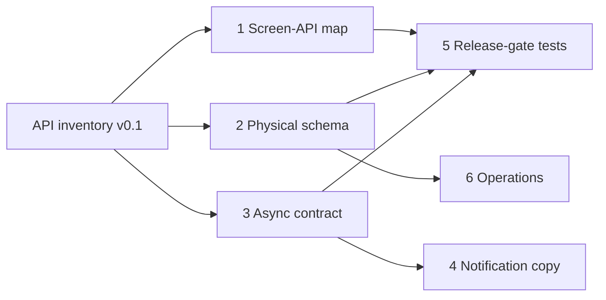

# Karat Hive — Remaining specification documents

| | |
|---|---|
| **Product** | Karat Hive — Digital Jewellery Marketplace |
| **Document** | Ordered work after the HTTP API catalogue |
| **Version** | 1.0 |
| **Status** | Draft — planning index, not a product requirement |
| **Date** | 1 September 2026 |
| **Depends on** | [`API-Route-Inventory.md`](API-Route-Inventory.md) v0.1 · SRS v1.3 · both architecture documents |

---

## 1. Purpose

[`API-Route-Inventory.md`](API-Route-Inventory.md) is the pre-code HTTP catalogue. It already carries envelope, pagination, idempotency, JWT claims, role presenters, **masking types** (§4.4), the **error catalogue** (§5), **media upload-intent** (§12), and FR → route traceability (§22).

This file is the list of documents that are still worth writing. It is not a second SRS and not a second architecture. Later documents cite the inventory and the SRS; they do not restate them.

**Do not start implementation by hand-writing OpenAPI.** `NFR-030` / `AD-BE-14` generate OpenAPI from code. The inventory is the checklist the first modules are written against; the generated spec then supersedes the inventory as the client contract.

---

## 2. Already covered — do not duplicate

| Topic | Where it lives |
|---|---|
| Paths, methods, auth column, request/response shapes | API inventory §6–§21 |
| Masked vs revealed party types | Inventory §4.4 · backend architecture §9 · frontend architecture §10 |
| Error codes and HTTP mapping | Inventory §5 |
| Media presign → PUT → complete | Inventory §12 · backend architecture §16 |
| Auth mechanisms, session lengths, token claims | Inventory §3.4, §8 · backend architecture §14 |
| FR → route | Inventory §22 |
| Screen → Flutter feature folder | Frontend architecture Appendix A |
| Outbox **event names** and job cadence | Backend architecture §11.2, §11.3 |
| Logical entities | SRS §6 |
| Visual system / widgets | `ui-screens/` · `component-widgets.md` |

---

## 3. Sequence

Write **1 → 2** before production handlers. **3** may overlap backend workers. **4–5** unblock copy and QA, not the first merge. **6** is last among product docs.

| # | Document | File (proposed) | Unblocks |
|---|---|---|---|
| **1** | Screen–route coverage matrix ✅ **authored v0.1** | [`docs/Screen-API-Map.md`](Screen-API-Map.md) | Flutter feature work; inventory gap-finding (13 gaps, 1 High, recorded as `SAM-GAP-nn`) |
| **2** | Physical schema ✅ **authored v0.1** | [`docs/Physical-Data-Model.md`](Physical-Data-Model.md) | Prisma/migrations, module table ownership. Encoded in `backend/prisma/schema.prisma` |
| **3** | Async contract ✅ **authored v0.1** | [`docs/Async-Contract.md`](Async-Contract.md) | Outbox payloads, workers, notification *triggers* (21 events, 7 consumers, 15 jobs; 5 proposed schema deltas; decision prefix `AD-ASYNC-nn`) |
| **4** | Notification copy | `docs/Notification-Catalogue.md` | EN/AR templates, `kh_l10n` keys |
| **5** | Release-gate test pack | `docs/Release-Gate-Tests.md` | QA cases that `NFR-013` / `NFR-029` require |
| **6** | Operations runbook | `docs/Operations.md` | Environments, `api`/`worker`, backup restore |

Optional, only if (1) stays too large: fold a **Vendor-lifecycle × route** table (Pub / `Vshell` / `V` / `A`) into (1) rather than a seventh document. Inventory §6 already has the Auth column; (1) must prove every *screen action* has a row, including empty and error states.

---

## 4. What each document must contain

### 4.1 Screen–route coverage matrix — authored, [`Screen-API-Map.md`](Screen-API-Map.md) v0.1

**Why.** The inventory is route-first. Screens cite a “primary route”; they do not prove every field, CTA, filter, and edge state is reachable. Flutter implements screens, not paths.

**Status.** v0.1 maps all 67 screens (load / actions / empty-error → route or `error.code`). Found 13 gaps — `SAM-GAP-7` is a live contradiction (pre-`ACTIVE` Vendor must set Categories/Regions to activate, but those `PUT`s are marked `ACTIVE`-only). Two route-index omissions were fixed in the inventory. The delivered document uses a screen-row table rather than one row per field; a per-field expansion can follow if `NFR-029` test derivation needs it.

| Column | Content |
|---|---|
| Screen ID | `CUS-Snn` / `VEN-Snn` / `ADM-Snn` |
| UI element | Field / Action / Filter / System (same kinds as `ui-screens/`) |
| Method + path | From the inventory; `client-only` where true (`CUS-S08`, `CUS-S12`, biometric) |
| Error codes the UI must handle | From inventory §5 |
| Notes | Masked type vs revealed; `Vshell` vs `ACTIVE` |

Coverage claim: **every row in every `ui-screens/**` Fields table** maps to exactly one of: a route, a client-only rule, or an explicit “out of v1” note.

Do not paste schemas. Link the inventory heading.

### 4.2 Physical schema — authored, [`Physical-Data-Model.md`](Physical-Data-Model.md) v0.1

**Why.** SRS §6 is a logical dictionary. Architecture §12 is conventions and hot-path indexes. Neither is a migratable schema.

**Status.** v0.1 delivered as `Physical-Data-Model.md` (not the proposed `Physical-Schema.md`), encoded in [`backend/prisma/schema.prisma`](../backend/prisma/schema.prisma) with `prisma validate` passing; the SQL Prisma cannot express lives in `backend/prisma/sql/`. Ten schema deltas are now pending against it — five from `Screen-API-Map.md` (`SAM-GAP-1`, `4`, `6`, `8`) and five from [`Async-Contract.md`](Async-Contract.md) §10 — tracked as **T36** in [`Backend-Implementation-Plan.md`](Backend-Implementation-Plan.md), to be resolved before the initial migration is frozen.

Must include:

- Every SRS §6 entity plus backend Appendix C tables (`outbox_event`, `otp_challenge`, `refresh_token`, `rate_limit_bucket`, `job_lock`, …)
- Enums aligned with inventory §4.2 (and the SRS validity-hours tension in inventory §23 / `AD-API-07`)
- Unique constraints that enforce `BR-009`, `BR-011`, `BR-012`, `BR-017`
- Indexes named in architecture §12.5
- Object-storage keys as columns only; bytes stay in R2/MinIO

Cite `AD-BE-05` (Prisma + raw SQL for hot reads). Do not invent a second data model.

### 4.3 Async contract — authored, [`Async-Contract.md`](Async-Contract.md) v0.1

**Why.** Architecture §11 names events and jobs. Workers cannot be written without **payload fields**, producer module, consumer(s), and retry semantics. The inventory only says “emits outbox” in passing.

**Status.** v0.1 gives the outbox envelope + retry contract, a full `data` pseudo-schema for all 21 events (14 from architecture §11.2 + 7 new — `request.matched`, `request.edited`, `request.cancelled`, `offer.expiry.warning`, `announcement.scheduled`, `vendor.document.expiring`, `request.draft.purge_warning`), a closed set of 7 consumers, the §11.3 job table expanded with lease key / success metric / user-visible symptom (+ 4 new jobs), the notification-dispatch trigger table, and 5 `[PROPOSED]` schema deltas (§10). Decision prefix `AD-ASYNC-nn`.

| Event (from architecture §11.2) | This document adds |
|---|---|
| `request.published` | Payload; fan-out consumer; `matchCount` |
| `offer.accepted` | Payload **without** competitor price/identity (`BR-008`, architecture §9.5) |
| `media.uploaded` | Processing steps already in inventory §12 — do not restate; add worker I/O only |
| … | Same for the rest of §11.2 |

Also: the job table from §11.3 with **lease key**, success metric, and user-visible failure (e.g. Request still showing live after `expiresAt`).

Notification *dispatch* belongs here (channel, recipient id, event). Wording belongs in document 4.

### 4.4 Notification copy

**Why.** Inventory §18 is the in-app centre API. `FR-VEN-026` / `FR-SYS-008` list triggers; there is no EN/AR body, deep-link, or quiet-hours behaviour per trigger.

One row per trigger: event from (3), channels, template key, placeholders (never a competitor’s price), `Vshell` allowed or not.

### 4.5 Release-gate test pack

**Why.** `NFR-029` requires masking absence tests and full state-machine transitions. SRS §5 and architecture §10 are the rules; this is the **case list** QA and CI share.

Must include:

- Request / Offer / Vendor / Connection transition tables (legal vs 409)
- Per-role GET of a live Request and Offer: named fields that **must be absent**
- Concurrent Acceptance (`BR-011`)
- Idempotent replay of `POST …/accept` and `POST …/offers`

Do not rewrite acceptance criteria from every FR. Trace to FR ids.

### 4.6 Operations runbook

**Why.** Cloud region and R2 residency (`NFR-020`) are still `[BLOCKED]` for production KYC. Local/CI can proceed on MinIO without this document. Hosted deploy cannot.

Contents: flavours (`local` / `ci` / hosted), `api` vs `worker` (`AD-BE-07`), secrets, PITR + object-store restore together (`NFR-011`), gold-rate feature flag (`AD-API-09`).

Yahoo Finance legal sign-off stays a Legal item, not a spec chapter.

---

## 5. Parallelism

Backend module scaffolding can start when **2** exists (even a draft of identity + taxonomy tables). Flutter repositories can start when **1** exists for the screens in that feature. Neither should wait for **4** or **6**.

---

## 6. Explicitly not next

| Tempting artefact | Why not |
|---|---|
| New SRS version for API paths | Paths are not product requirements; `AD-API-*` stay in the inventory |
| Hand-maintained `openapi.yaml` | Conflicts with `AD-BE-14`; generate after the first handlers |
| Standalone masking / error / media / auth specs | Already in the inventory + architecture |
| Threat-model book | Backend architecture §18 is enough until the first pentest (`NFR-018`) |
| Separate Customer vs Vendor API books | `AD-API-02` — shared resources, role presenters |

**SRS chore, not a new document:** align Offer validity hours (`FR-VEN-013` vs §6 entity dictionary) on the next SRS revision — inventory `AD-API-07` / §23.

---

## Appendix A — Revision history

| Version | Date | Change |
|---|---|---|
| 1.0 | 1 Sep 2026 | First sequence after API inventory v0.1. Collapses the earlier 14-item list: drops duplicates of inventory §3–§5 and §12. |
