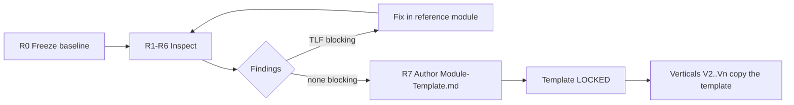

# Template-Lock Review Plan — Check-point-1 Vertical

> **Status: `[PROPOSED]`** — plan of record for the review that decides whether the Check-point-1
> vendor-onboarding vertical becomes the binding module template. Does **not** override the SRS,
> `CONTEXT.md`, or the domain invariants in `CLAUDE.md`; where this plan and those disagree, they win.
> Baseline under review — **restated 6 Sep 2026**: no longer `feat/vendor-onboarding-vertical` alone.
> The reviewable state is **`main`** (CP1 backend + Flutter close-out + Firebase ID-token
> `AuthGuard` path from `feat/firebase-setup`, plus the **Admin CP1 taxonomy slice**). Two
> checkpoints now feed the template, not one: [CP1 vendor vertical](checkpoints/checkpoint-1-vendor-onboarding-vertical.md)
> and [Admin CP1 taxonomy](Admin-Checkpoint-1-Taxonomy-Plan.md).
>
> **§6 was re-verified against the tree on 6 Sep 2026.** Three of the five pre-review suspicions were
> wrong or stale; two are confirmed and are now seeded findings. Read §6 before planning the work —
> the phase estimates in §8/§9 assume the corrected picture.

## 1. Purpose

Check-point-1 shipped one vertical end-to-end. Every later vertical (Requests, Offers, Connections,
Subscription, Admin) is meant to copy its shape. Before that copying starts, the shape has to be
**inspected, corrected, and written down** — otherwise fifteen modules inherit whatever the first one
happened to do, including its accidents.

This plan defines *how* that inspection is run, what counts as evidence, and what must be true before
the template is declared locked.

Two things make locking urgent and cheap right now:

- `backend/src/modules/` holds **16 modules, of which 11 are empty five-folder stubs**
  (`application/ controller/ domain/ presenter/ repository/`, each holding only `.gitkeep`). The
  directory skeleton is already committed — so the template is *already* being asserted structurally,
  without a document that says what goes in each folder.
- **Five are populated**, and they already disagree about the shape:

  | Module | Files | Layers actually used |
  |---|---|---|
  | `identity` | 21 | all five |
  | `vendor-onboarding` | 17 | all five |
  | `taxonomy` | 10 | **no `domain/`** |
  | `media` | 7 | all five |
  | `audit` | 3 | **`application/` only** |

  Counts exclude `.gitkeep`. Fixing a pattern across five modules is a morning's work; across sixteen
  it is a rewrite. That `taxonomy` and `audit` already skip layers is not necessarily wrong — a
  taxonomy module may have no domain logic worth isolating — but nothing states when skipping is
  allowed, which is exactly the gap `TLC-16` exists to close.

## 2. Identifiers

| Prefix | Meaning | Defined in |
|---|---|---|
| `TLC-nn` | Template-lock criterion — a property the template must have | §4 of this document |
| `TLF-nn` | Template-lock finding — a gap found while reviewing a `TLC` | §6 register, appended during the review |

`TLC` numbering is stable and never reused. A criterion judged not-applicable is marked `WAIVED` with a
reason, not deleted.

## 3. What is under review

| Surface | Reference implementation | Also inspected as counter-example |
|---|---|---|
| Module shape | `backend/src/modules/vendor-onboarding/` | `identity/`, `taxonomy/`, `media/`, `audit/` — the last two are the layer-skipping cases (`TLF-03`) |
| Cross-cutting edge | `backend/src/edge/**` | — |
| Platform ports/adapters | `backend/src/platform/**` | — |
| Data & migrations | `backend/prisma/**` | `docs/Physical-Data-Model.md` |
| Test scaffolding | `backend/test/{contract,integration,masking,concurrency,performance}/` | co-located `*.spec.ts` |
| Flutter feature shape | `apps/kh_mobile/karat_hive/lib/features/{auth,onboarding,dashboard}/` | `apps/kh_admin/` |
| Flutter shared packages | `packages/{kh_api,kh_core,kh_design_system,kh_domain,kh_l10n,kh_ui_domain}/` | — |
| CI | `.github/workflows/{backend,frontend}.yml` | — |

**Excluded from this review** (deliberately, to keep the gate closable): feature completeness of the
vertical itself, admin-portal screens beyond their shell, performance tuning, and any `[BLOCKED]` open
decision listed in `CLAUDE.md` (Yahoo Finance terms, `AD-FE-12` data grid, `NFR-020` residency).

## 4. Criteria

Each criterion carries a **pass bar** — the specific observable that closes it. "Looks fine" is not a
pass bar; a named file, a passing test, or a documented rule is.

### Group A — Backend layer shape

| ID | Criterion | Pass bar |
|---|---|---|
| `TLC-01` | Layer boundaries are real, not just folder names | `domain/` imports nothing from `@nestjs/*`, `@prisma/client`, or `../repository`; `controller/` never imports `repository/`; `presenter/` is the only place a response shape is built. Enforced by a lint rule, not by reading. **Half is already enforced** — see `TLF-02`: `eslint.config.mjs` guards the *inter-module* graph and `index.ts` entry points; the *intra-module* layer stack is unguarded |
| `TLC-02` | Port vs. adapter placement is decided | Written rule for when a dependency becomes a `platform/ports/*.port.ts` (currently: `otp-sender`, `password-hasher`, `storage`) vs. a module-local service; a second module can add one without inventing a location |
| `TLC-03` | Edge contract is uniform and zero-config for new controllers | A new controller inherits envelope, error mapping, validation, `request-id`, idempotency and rate-limit purely by being routed; no per-endpoint wiring in `vendor-onboarding/controller/*` that a copier must remember |
| `TLC-04` | Masking is a mechanism, not per-endpoint code | `edge/masking/masking.interceptor.ts` + `identity-keys.ts` + `@RevealsIdentity` decorator is the only path; a masked field is **absent** from the payload (`BR-006`, `FR-SYS-003`, `NFR-013`), proven by `backend/test/masking/` |
| `TLC-05` | Write + outbox in one transaction, demonstrated once | One `application/` method writes domain rows and an outbox event inside a single Prisma transaction, with the consumer registered in `platform/outbox/outbox.events.ts` **and** `docs/Async-Contract.md` §2. This is the pattern Acceptance atomicity (`BR-011`–`BR-013`) will reuse. **Confirmed failing at baseline — `TLF-01`.** Not a risk to assess; work to schedule |
| `TLC-06` | Guard composition is reusable | `vendor-access.guard.ts` composes role + `VERIFIED` + `ACTIVE` + type-subscription (`BR-002`, `FR-VEN-031`) as a declarative unit; `requests`/`offers` can apply it without re-checking inline |
| `TLC-07` | Migration & seed discipline | Documented Prisma migration naming, how `prisma/sql/*.sql` side files are applied (they are, in CI), and how a module extends `prisma/seed/` without editing a shared monolith |

### Group B — Test template

| ID | Criterion | Pass bar |
|---|---|---|
| `TLC-08` | Each of the five test buckets has a copyable example | Non-empty, passing example in `test/contract/`, `test/integration/`, `test/masking/`, `test/concurrency/`, `test/performance/`. **Known gap at baseline: three of the five are empty** (`.gitkeep` only) |
| `TLC-09` | Fixtures and auth are solved once | `test/integration/helpers.ts` provides DB reset (truncate vs. rollback — pick one and state it) and a one-line "act as vendor/customer/admin"; no test builds a JWT by hand |
| `TLC-10` | "Done" is machine-checked | Coverage floor (or an explicit no-floor decision) configured in `vitest.config.ts` and enforced in `backend.yml`, so module completeness is not a per-PR judgement call |

### Group C — Flutter template

| ID | Criterion | Pass bar |
|---|---|---|
| `TLC-11` | Package responsibilities are stated and observed | Written one-line charter per `packages/*`; no `lib/features/**` file imports Dio/`http` directly — network access is `kh_api` only. Checked by grep, then by lint |
| `TLC-12` | One feature folder is the canonical shape | `features/auth/` (`controller/ model/ presentation/ repository/`) documented as the shape, with routing entry, Riverpod controller, loading/empty/error states bound to backend `error.code`, and at least one widget test |
| `TLC-13` | Flavors, config and l10n conventions fixed | `main_dev/staging/prod` + `--dart-define-from-file=config/*.json` documented; l10n key naming stated; the `VendorShell` nav lesson (no `NavigationBar` below two destinations) captured as a rule, not just a fix |

### Group D — Traceability

| ID | Criterion | Pass bar |
|---|---|---|
| `TLC-14` | Slice maps to the spec | FR/BR IDs cited in the module's code or tests; `VEN-S01/S02/S03/S04/S05/S16` matched to routes in `docs/Screen-API-Map.md`; every gap found is registered as `SAM-GAP-nn`, none left informal. Every cited ID verified to exist and mean what is claimed |
| `TLC-15` | Build-time discoveries are back-propagated | Every deviation from `docs/API-Route-Inventory.md` and `docs/Physical-Data-Model.md` found while building the vertical is either reflected in those documents or recorded there as `[PROPOSED]` with a decision-register entry. Otherwise sixteen modules inherit a stale contract |
| `TLC-16` | The template exists as a document | `docs/Module-Template.md` states `TLC-01`–`TLC-15` explicitly, so "follow the template" is checkable in review rather than remembered |

### Group E — Operational gate

| ID | Criterion | Pass bar |
|---|---|---|
| `TLC-17` | CI is green end-to-end on the slice | `backend.yml` both jobs green (build, lint, unit, format, migrate + seed + integration); `frontend.yml` green (`melos analyze`, `melos test`, design-system goldens, debug APK, admin job). Workflow path filters actually cover what they claim — **re-verified 6 Sep 2026: they do.** `apps/kh_admin/**` is in both the push and pull_request filters and has a dedicated `admin` job |
| `TLC-18` | One manual end-to-end run against the real instance | The full V1 journey exercised against Supabase project `husuemlfcvacrysapwho`, including the KYC signed-URL round-trip; result recorded with date. **The journey's opening steps have changed** — sign-in is Google only, so "login → OTP register" is superseded; the run is Google Sign-In → KYC upload → awaiting → categories/regions → dashboard. `CP1-V01` and `CP1-V02` are still open for exactly this reason |

## 5. Phases

Phases are ordered by dependency, not by importance. R1–R2 findings usually invalidate R3–R4 evidence, so
do not run them out of order.

### R0 — Freeze the baseline (≈0.5 h)

1. Record the exact commit SHA under review at the top of the findings register.
2. Create branch `chore/template-lock-review`. Fixes land here; the review re-runs against the fixed state.
3. Confirm the toolchain a copier will use: `npm ci && npx prisma generate` in `backend/`,
   `melos bootstrap` at root, Flutter `3.44.7`.

### R1 — Backend layer shape (`TLC-01`, `TLC-02`, `TLC-06`, `TLC-07`) (≈1 day)

| Step | Method | Output |
|---|---|---|
| R1.1 | Read `modules/vendor-onboarding/**` in layer order (domain → application → repository → controller → presenter). Note every place a layer reaches past its neighbour | Boundary violation list |
| R1.2 | Same read for `identity/` and `taxonomy/` — where three modules disagree, the template is undefined | Divergence list |
| R1.3 | **Extend** the existing `eslint.config.mjs` (do not replace it — it already enforces the module graph and `index.ts` entry points) with the intra-module layer axis: either `boundaries/elements` split per layer, `no-restricted-imports` zones, or `backend/scripts/check-layering.mjs` + `npm run check:boundaries`. Add `boundaries/external` so `domain/` cannot import `@prisma/client` / `@nestjs/*`. Run it; every current violation is a `TLF` | Enforceable rule + findings (`TLF-02`) |
| R1.4 | List each `platform/ports/*.port.ts` and its adapters under `platform/adapters/`; write the "when does this become a port" rule | Rule text for `Module-Template.md` §Ports |
| R1.5 | Read `vendor-access.guard.ts` against `BR-002` / `FR-VEN-031`; confirm all four conditions (role, `VERIFIED`, `ACTIVE`, type subscription) and that it is applied declaratively | Guard verdict |
| R1.6 | Review `prisma/migrations/`, `prisma/sql/`, `prisma/seed/`; write the naming + extension rules | Rule text for `Module-Template.md` §Data |

### R2 — Cross-cutting invariants (`TLC-03`, `TLC-04`, `TLC-05`) (≈1 day)

| Step | Method | Output |
|---|---|---|
| R2.1 | For each `vendor-onboarding` endpoint, list what the controller does itself vs. inherits. Anything repeated per endpoint is a template defect, not a style issue | Edge-uniformity verdict |
| R2.2 | Verify `error-codes.ts` / `error-messages.ts` stay a typechecked `Record` pair (en + ar) and that every code thrown by the module exists in both | `TLF` per orphan code |
| R2.3 | Trace masking end-to-end for one payload: `identity-keys.ts` → interceptor → presenter. Confirm **absent, not null** (`NFR-013`). Attempt one deliberate leak (add a masked field to a presenter) and confirm `test/masking/` fails | Proven mechanism + a red-then-green demonstration |
| R2.4 | Confirm reveal is scoped to a single Connection (`BR-007`) at the mechanism level, even though Connections are unbuilt — the *shape* must not assume global reveal | Design verdict |
| R2.5 | ~~Find the transactional-outbox example.~~ **Already answered: there is none (`TLF-01`).** The step is now *write* one — a domain write and its outbox insert in a single Prisma transaction, a registered consumer, and a test that proves the event survives the write and not the rollback | Named file + test |
| R2.6 | Cross-check `outbox.events.ts` against `docs/Async-Contract.md` §2 — names, payloads, consumers | Diff list |

### R3 — Test scaffolding (`TLC-08`, `TLC-09`, `TLC-10`) (≈1 day)

| Step | Method | Output |
|---|---|---|
| R3.1 | Inventory the five bucket dirs. Empty buckets are `TLF` blocking — a copier cannot copy an absent example | Findings for `contract/`, `concurrency/`, `performance/` |
| R3.2 | Write the missing exemplars against the vertical: a contract test asserting the envelope + error shape of one endpoint; a concurrency test on a state transition (`vendor-state-machine.ts`) or `job-lock.policy`; a performance smoke against an `NFR` budget | Three copyable files |
| R3.3 | Read `test/integration/helpers.ts`; state the isolation strategy; add the missing role-actor helpers | Documented helper contract |
| R3.4 | Decide the coverage floor (or record "no floor" with a reason) and wire it into CI | `vitest.config.ts` + `backend.yml` change |
| R3.5 | Confirm the split between co-located `*.spec.ts` (pure units, e.g. `outbox.policy.spec.ts`) and `test/**` (DB-touching) is a stated rule | Rule text |

### R4 — Flutter template (`TLC-11`, `TLC-12`, `TLC-13`) (≈0.5–1 day)

| Step | Method | Output |
|---|---|---|
| R4.1 | Grep `lib/features/**` for direct `dio`/`http` imports and for API URL literals | `TLF` per leak |
| R4.2 | Compare `features/auth`, `features/onboarding`, `features/dashboard` — where they diverge, pick one and state it | Canonical feature shape |
| R4.3 | Verify each screen renders loading / empty / error, and that error text derives from backend `error.code` (not an HTTP status or a hardcoded string) | State-coverage verdict |
| R4.4 | Confirm every user-facing string is in `kh_l10n` (en + ar) and note the key convention | l10n rule |
| R4.5 | Check `apps/kh_admin/` shares the same package boundaries; if it diverges, decide now whether the template is one or two | Scope decision |

### R5 — Spec traceability (`TLC-14`, `TLC-15`) (≈0.5–1 day)

| Step | Method | Output |
|---|---|---|
| R5.1 | Extract every FR/BR/NFR/C id cited in the vertical's code, tests and checkpoint doc; verify each against `docs/Requirements-Spec-v1.3.md` — IDs are numerically adjacent and easy to transpose | Verified citation list |
| R5.2 | Diff the implemented routes against `docs/API-Route-Inventory.md` §8/§9/§12/§20 — path, method, request/response schema, error codes | Deviation list |
| R5.3 | Diff `prisma/schema.prisma` against `docs/Physical-Data-Model.md` | Deviation list |
| R5.4 | Apply R5.2/R5.3 deviations to those documents (or register them as `[PROPOSED]` in the relevant decision register: `AD-API-nn`, `AD-BE-nn`, `AD-ASYNC-nn`) | Updated docs |
| R5.5 | Confirm `VEN-S01..S05, S16` rows in `docs/Screen-API-Map.md` reflect what was built, and that `SAM-GAP-6/7` are either closed or still accurate | Updated map |

### R6 — Operational gate (`TLC-17`, `TLC-18`) (≈0.5 day)

| Step | Method | Output |
|---|---|---|
| R6.1 | Run both workflows on the review branch; both green from a clean checkout | CI run links |
| R6.2 | Audit workflow path filters against the directories they must cover. *`apps/kh_admin/**` is now covered (S2 dismissed); re-check the rest — `backend.yml` filters on `backend/**` only, so a root-level change that affects the backend would skip it* | Workflow verdict |
| R6.3 | Verify `prisma migrate deploy` succeeds on an **empty** database, then seed, then integration — the copier's first experience | Clean-DB verdict |
| R6.4 | Run the V1 journey manually against Supabase `husuemlfcvacrysapwho`, including the KYC signed-URL round-trip; record the date and outcome | Manual-run record |

### R7 — Author and lock (`TLC-16`) (≈0.5 day)

1. Write `docs/Module-Template.md`: one section per rule established in R1–R5, each with the reference file
   path a copier opens. It states rules; it does not restate the SRS.
2. Add the "new module" checklist to it — the ordered steps for standing up module *n+1*.
3. Fold the mechanical checks (`check:boundaries`, coverage floor, masking suite) into `backend.yml` so the
   template is enforced by CI rather than by review memory.
4. Close the findings register; mark the template **LOCKED** with the date and commit SHA.
5. Optionally add a `docs/Module-Template.md` row to the authority chain table in `CLAUDE.md`.

## 6. Findings register

Appended during the review, in this document (§6) or a sibling `docs/Template-Lock-Findings.md` if it grows
past ~20 rows.

| Field | Notes |
|---|---|
| `TLF-nn` | Stable, never reused |
| Criterion | The `TLC-nn` it came from |
| Severity | `BLOCKING` (template cannot lock) / `NOTE` (lock, fix in V2) / `WAIVED` (with reason) |
| Evidence | File path + line, or failing command |
| Fix | Landed commit, or the doc updated |

**Severity rule:** a finding is `BLOCKING` if a later module copying the template would inherit it. A
finding local to the vendor vertical and invisible to a copier is a `NOTE`.

### 6.1 Pre-review suspicions — verified against the tree, 6 Sep 2026

These were written as suspicions to be confirmed or dismissed. They have now been checked. **Three of
five were wrong or stale**, which is itself the argument for running the review off evidence rather
than off recollection.

| # | Suspicion | Verdict | Criterion |
|---|---|---|---|
| S1 | `test/contract/`, `test/concurrency/`, `test/performance/` are empty | **CONFIRMED.** All three still `.gitkeep`-only. `test/integration/` has 4 files, `test/masking/` 3 | `TLC-08` |
| S2 | `frontend.yml` path filters omit `apps/kh_admin/**` | **DISMISSED — fixed on `feat/cp1-closeout`** (CP1-B06d). Both filters list it and a dedicated `admin` job exists. No work here | `TLC-17` |
| S3 | No transactional write+outbox exemplar in a domain module | **CONFIRMED, and worse than suspected** → `TLF-01` | `TLC-05` |
| S4 | 14 module dirs assert a five-folder shape no document defines | **CONFIRMED, count wrong.** 16 modules, **11** empty stubs, 5 populated — and the populated five already disagree (`taxonomy` has no `domain/`, `audit` is `application/`-only) → `TLF-03` | `TLC-01`, `TLC-16` |
| S5 | Layer boundaries rest on convention only — no import lint | **PARTLY WRONG** → `TLF-02`. A boundaries lint exists and is real; it guards a different axis than `TLC-01` describes | `TLC-01` |

### 6.2 Seeded findings

Verified before the review opened. Severity is provisional until R1–R2 run, but each already meets the
§6 severity rule — a module copying the template inherits all three.

| `TLF` | Criterion | Severity | Evidence | Fix |
|---|---|---|---|---|
| `TLF-01` | `TLC-05` | **BLOCKING** | `platform/outbox/outbox.events.ts` declares 23 event types and `OutboxProducer` exists, but **no module imports it**. `vendor.registered` / `vendor.documents.submitted` were added to the catalogue by CP1 and are never emitted; no consumer is registered outside `outbox.dispatcher.spec.ts`, so the dispatcher's "no consumers …; marking done" branch is the only path an event could take | Open — `T45` in [`Backend-Implementation-Plan.md`](Backend-Implementation-Plan.md) v0.4 (D-1) |
| `TLF-02` | `TLC-01` | **BLOCKING** | `backend/eslint.config.mjs` configures `boundaries/element-types` (module · platform · edge · shared · config, `default: 'disallow'`) and `boundaries/entry-point` (`module` reachable only via `index.ts`). All five populated modules expose an `index.ts`. **But `boundaries/elements` treats `src/modules/*` as one element** — nothing stops `controller/` importing `repository/`, and `boundaries/external` is not configured, so nothing stops `domain/` importing `@prisma/client` or `@nestjs/*`. The module graph is machine-checked; the layer stack inside a module is not | Open — extend the config, or add `check:boundaries` for the intra-module axis only |
| `TLF-03` | `TLC-16` | **BLOCKING** | 11 of 16 modules are `.gitkeep`-only five-folder stubs; the 5 populated ones use 5, 5, 5, 4 and 1 of those layers. No document says which layers are mandatory | Open — `docs/Module-Template.md` (R7 / Phase C) |
| `TLF-04` | `TLC-07` | **NOTE** | `src/main.ts:39` registers `outbox.drain` through `SchedulerService`, which leases it per tick — contradicting `Backend-Implementation-Plan.md` § Scheduled-job coverage, which says outbox drain is deliberately *not* lease-based so workers drain concurrently under `FOR UPDATE SKIP LOCKED` | Open — `T46` (D-2). `NOTE` not `BLOCKING`: modules do not copy `main.ts`, but it misleads anyone reading it as the scheduler example |

## 7. Exit criteria

The template is locked when **all** hold:

1. Every `TLC-01`–`TLC-18` is `PASS` or `WAIVED` with a recorded reason.
2. No `BLOCKING` finding is open.
3. `docs/Module-Template.md` exists and each of its rules names a reference file.
4. Both CI workflows are green on the review branch from a clean checkout, including the new mechanical checks.
5. The manual end-to-end run (`TLC-18`) is recorded with a date.
6. `docs/API-Route-Inventory.md`, `docs/Physical-Data-Model.md`, `docs/Async-Contract.md` and
   `docs/Screen-API-Map.md` agree with the shipped vertical, or record the disagreement as `[PROPOSED]`.

Until then, later verticals may be *planned* but should not be *built* — every module written before the
lock is a module that will need retrofitting.

## 8. Effort

| Phase | Estimate |
|---|---|
| R0 | 0.5 h |
| R1 | 1 day |
| R2 | 1 day |
| R3 | 1 day |
| R4 | 0.5–1 day |
| R5 | 0.5–1 day |
| R6 | 0.5 day |
| R7 | 0.5 day |
| **Total** | **≈5 working days**, including writing the missing test exemplars and the template document |

R3 and R5 carry the most uncertainty: R3 **will** require writing three test styles from scratch (S1
confirmed), and R5's cost depends entirely on how far the built vertical drifted from the `[PROPOSED]`
catalogues.

**Effect of the 6 Sep re-verification on this estimate: roughly none, for two offsetting reasons.**
S2 and half of S5 are already fixed, which removes perhaps half a day from R1 and R6. But `TLF-01`
turns `TLC-05` from *assess a risk* into *write an exemplar and its test*, and `TLF-03` shows the
five populated modules already disagree on layer usage, so R1.2's divergence list is real work rather
than a formality. The total stands at **≈5 days**. What changed is the *confidence*: less of the plan
is now speculative.

## 9. Minimum lock path — three phases

If the full R0–R7 sequence cannot be run, these three phases carry **~95 % of the risk** the review exists
to retire. The test is not "how much work is it" but **"would a module copying the template inherit this
defect sixteen times?"** — the three phases below are the only ones where the answer is yes.

Note what this does *not* buy: about **4 days instead of 5**. The compression is worth doing for focus and
sequencing, not for calendar. The dropped phases are the cheap ones; they are dropped because their failures
are *discoverable and repairable per module*, not because they are quick.

### Phase A — The mechanism review (was R1 + R2) — ≈2 days

Covers `TLC-01`–`TLC-07`. **This is the thing being copied.** Every defect here is inherited by definition.

| Must produce | Why it is non-negotiable |
|---|---|
| The **intra-module** half of the layer rule made executable, with every current violation fixed | `TLF-02`. The inter-module half already exists and works — `eslint.config.mjs` guards the module graph and `index.ts` entry points. What is unguarded is `controller/` → `repository/` and `domain/` → `@prisma/client`. Narrower than this plan first assumed, and still the criterion that decays most silently |
| One **transactional write + outbox** exemplar in a domain module, with its test | `TLC-05` / `TLF-01`. **Confirmed absent** — this is scheduled work, not a check. Acceptance atomicity (`BR-011`–`BR-013`), the hardest invariant in the system, is this pattern. If it is invented later, it is invented under deadline, in the module that can least afford it being wrong |
| Masking proven **red-then-green**: add a masked field to a presenter, watch `test/masking/` fail, revert | `TLC-04`. `NFR-013` says *absent*, not null. A masking suite that has never failed is not evidence that it works |
| A stated port-vs-module rule, and `vendor-access.guard` confirmed to compose all four `BR-002` conditions declaratively | `TLC-02`, `TLC-06`. Both are places where module two will otherwise improvise |

Skipping any single item above forfeits the phase — this is not a partial-credit phase.

### Phase B — The test scaffolding (was R3) — ≈1 day

Covers `TLC-08`–`TLC-10`. Three of five buckets are empty; a copier cannot copy an absent example, so
sixteen modules ship with three test styles missing.

| Must produce | Notes |
|---|---|
| A contract-test exemplar | Envelope + `error.code` shape of one vendor endpoint |
| A concurrency-test exemplar | Against `vendor-state-machine.ts` or `job-lock.policy` — the state machine is the shape Offers and Connections reuse |
| A performance-test exemplar | A smoke against one stated `NFR` budget; cheap now, never written later |
| Role-actor helpers in `test/integration/helpers.ts` + a stated DB-isolation strategy | `TLC-09`. Without it every module hand-rolls JWTs |

Coverage floor (`TLC-10`) can be deferred to Phase C's CI wiring if time is short.

### Phase C — Write it down and enforce it (was R7 + the enforcement half of R6) — ≈1 day

Covers `TLC-16`, plus the mechanical parts of `TLC-17`. Highest leverage per hour in the whole plan.

| Must produce | Notes |
|---|---|
| `docs/Module-Template.md` — one section per rule from Phase A/B, each naming the reference file a copier opens | Written **agent-facing**: this document's real audience is the future sessions that build modules 2–16 |
| The "stand up module *n+1*" ordered checklist | Turns the template from description into procedure |
| Phase A's boundary check, the masking suite and the coverage floor wired into `backend.yml` | An unenforced template is a suggestion. This is what makes drift *fail a build* instead of *fail a review* |
| Green CI from a clean checkout | ~~`frontend.yml` path filters~~ already corrected on `feat/cp1-closeout` (S2 dismissed). What remains is confirming both workflows pass from an empty database with the new mechanical checks added |
| Template marked **LOCKED** with date + commit SHA | A lock nobody dated is not a lock |

### The residual 5 % — what is knowingly dropped

| Dropped | Consequence | Mitigation |
|---|---|---|
| **R4** Flutter template | Features 4–n diverge from `features/auth`'s shape | Lowest real risk: only three features exist, UI churns anyway, and divergence is visible on sight in review |
| **R5** Doc back-propagation | Later modules are planned against a stale `[PROPOSED]` API inventory and data model | **The riskiest omission.** Buy it down with a ~2 h slice: *list* the deviations found during Phase A into the findings register without fixing the documents, so module two's author is at least warned |
| **R6.4** Manual end-to-end run | The vertical is trusted on CI evidence alone | **This mitigation was overstated — corrected 6 Sep 2026.** What ran on 6 Sep was the KYC storage round-trip, not the journey. `CP1-V01` (backend walk-through) and `CP1-V02` (Flutter walk-through) are both still open, and their opening steps were superseded by Google Sign-In. So R6.4 is not "already done"; it is unrun against the current auth path. Keep it — it is half a day and it is the only end-to-end evidence that exists |

If a fourth phase ever becomes affordable, it is **R5**, not R4.
