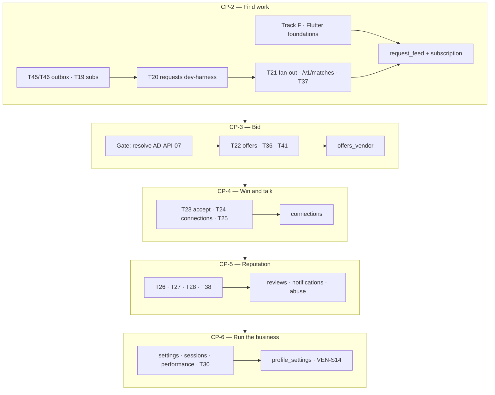

# Vendor App Completion — Plan of Record (Check-points 2–6)

| | |
|---|---|
| **Product** | Karat Hive |
| **Document** | Plan of record for the remaining 16 Vendor screens, backend + Flutter |
| **Version** | 1.0 |
| **Status** | Draft — awaiting Technical Lead sign-off on the `[PROPOSED]` register (§9) |
| **Date** | 7 September 2026 |
| **Scope** | Vendor app only. Full-stack verticals. Sliced as journey check-points |
| **Task list** | [`Vendor-App-Completion-Tasks.md`](Vendor-App-Completion-Tasks.md) |
| **Predecessor** | [`checkpoints/checkpoint-1-vendor-onboarding-vertical.md`](checkpoints/checkpoint-1-vendor-onboarding-vertical.md) |
| **Does not override** | SRS v1.3 · `API-Route-Inventory.md` · `Architecture-Backend.md` / `-Frontend.md` · `Async-Contract.md` · `Physical-Data-Model.md` |

This document is the frozen contract for Vendor check-points 2 through 6. It **cites** the authority chain; it does not restate it. Where this plan and the SRS disagree, the SRS wins. Where this plan and `Backend-Implementation-Plan.md` disagree on backend task identity, that document's `T`-IDs remain authoritative — this plan slices them, it does not renumber them.

---

## 1. Context

Check-point 1 delivered one Vendor journey end-to-end: login → registration → KYC upload → Awaiting-Approval shell → Categories/Regions → thin dashboard. That is **6 of 22 Vendor screens** (`VEN-S01`–`S05`, `S16`). Google Sign-In and Firebase ID-token verification landed on `main` afterwards.

The remaining **16 screens** — `VEN-S06`–`S15`, `S17`–`S22` — have no implementation plan. `Backend-Implementation-Plan.md` phases P6–P12 describe the server side but carry no Flutter breakdown, and P6–P12 are entirely unstarted.

### 1.1 What the tree actually looks like

| Area | State |
|---|---|
| Backend modules | 5 of 16 populated. `abuse`, `admin`, `connections`, `gold-rate`, `matching`, `notifications`, `offers`, `requests`, `reviews`, `settings`, `subscription` are empty five-folder stubs |
| Live routes | 30, of which 28 are product routes. Every route the remaining 16 screens call is absent |
| Outbox | Producer, claimer, dispatcher and 23 event types exist. **Zero producers and zero consumers are registered in `src/`** — deviation `D-1`, task `T45` |
| Scheduled jobs | 1 of the 15 in `Async-Contract.md` §6 (`outbox.drain`), and it is lease-based, which §6 forbids — deviation `D-2`, task `T46` |
| Flutter | `auth`, `onboarding`, `dashboard` features. Six `kh_*` packages. Several primitives every remaining screen needs are absent (§6) |

The honest summary: **beyond onboarding, the Vendor app is greenfield on both sides of the wire.**

### 1.2 Feature-module target state

`Architecture-Frontend.md` §5 fixes the module names. The remaining screens map as follows; `onboarding/` and `dashboard/` are check-point-1 deviations from that list and are reconciled in CP-2 (§6.2).

| Module | Screens | Check-point |
|---|---|---|
| `request_feed/` | `VEN-S05`–`S08` | CP-2 |
| `subscription/` | `VEN-S22` | CP-2 |
| `offers_vendor/` | `VEN-S09`–`S11`, `S14` | CP-3, `S14` in CP-6 |
| `connections/` | `VEN-S12`, `S13` | CP-4 |
| `notifications/` | `VEN-S17` | CP-5 |
| `reviews/` | `VEN-S19`, `S20` | CP-5 |
| `abuse/` | `VEN-S21` | CP-5 |
| `profile_settings/` | `VEN-S15`, `S16`, `S18` | CP-6 (`S16` already shipped) |

---

## 2. Two structural findings

These shape the whole plan and are stated up front so neither is discovered mid-slice.

### 2.1 A Vendor-only scope still needs Customer-side backend

A Vendor cannot be matched to a Request that no Customer published, and an Offer cannot reach `ACCEPTED` without a Customer accepting it. Two Customer-side backend tasks are therefore unavoidable:

| Task | Needed by | Delivered as |
|---|---|---|
| `T20` — `POST /v1/requests`, `POST /v1/requests/{id}/publish` | CP-2 (nothing to match against) | **API + seed/dev harness only. No Customer UI** |
| `T23` — `POST /v1/offers/{id}/accept`, `POST /v1/offers/{id}/decline` | CP-4 (nothing to win) | **API + dev harness only. No Customer UI** |

This follows the check-point-1 precedent of `POST /v1/dev/vendors/{id}/verify`: a guarded, non-production endpoint plus seed helpers that let one role's journey be exercised before the other role's client exists.

**Do not read this as the Customer app being underway.** `CUS-S01`–`S22` remain unplanned. The Customer *presenters* built here are the minimum to make the Vendor journey real, and the Customer vertical will extend rather than replace them.

### 2.2 Subscriptions are a gate, not a feature

`BR-002` requires three things before a Vendor may see a Request or submit an Offer: verification state `VERIFIED`, account state `ACTIVE`, **and** an active Type Subscription for that Request type. Subscriptions are Admin-granted — `AD-API-04` gives the Vendor no `POST`, only `GET /v1/me/subscriptions` plus a deep link to `platform-config.subscriptionContactUrl`.

`T19` is pending. So subscription read (`VEN-S22`) lands in **CP-2, not last**: it is the screen that explains an empty feed. Shipping the feed without it produces a dead-end where a correctly-onboarded Vendor sees nothing and has no way to find out why.

---

## 3. Check-point 2 — *Find work*

**Goal.** A `VERIFIED` + `ACTIVE` Vendor with an active subscription opens the app and sees real matched Requests, can filter and save presets, opens a Request detail with the Customer masked, and understands from `VEN-S22` why the feed is empty when it is.

**Screens.** `VEN-S06` (feed), `VEN-S07` (filters + presets), `VEN-S08` (Request detail, masked), `VEN-S22` (subscriptions), and `VEN-S05` upgraded from the check-point-1 thin shell to real counts.

### 3.1 Backend

| Method | Path | Auth | Notes |
|---|---|---|---|
| `GET` | `/v1/matches` | `V` | Filters `requestType, direction, categoryId, regionId, purityKarat, weightMin/Max, budgetMin/Max, publishedWithinHours, includeResponded, q, sort ∈ NEWEST\|EXPIRING\|HIGHEST_VALUE\|FEWEST_OFFERS, presetId, limit, cursor`. Returns `RequestForVendor[]` |
| `POST` | `/v1/matches/{requestId}/viewed` | `V` | `204`. Sets `request_match.viewed_at`; decrements the dashboard New Requests count |
| `GET` | `/v1/requests/{id}` | `CV` | Vendor presenter. Not in the caller's match set → `404`, never `403` |
| `GET` | `/v1/filter-presets` | `V` | `[ASSUMED]` |
| `POST` · `PATCH` · `DELETE` | `/v1/filter-presets[/{id}]` | `V` | `[ASSUMED]` |
| `GET` | `/v1/me/subscriptions` | `Vshell` | Read-only per `AD-API-04` |
| `GET` | `/v1/platform-config` | — | `[PROPOSED]`. Closes `SAM-GAP-5`; values already seeded at CP-1 |
| `GET` | `/v1/me/dashboard` | `V` | Exists with zeroed counts — replace with real aggregates |
| `POST` | `/v1/requests`, `/v1/requests/{id}/publish` | `C` | **Dev harness only** (§2.1) |

Impl-plan tasks: `T19`, `T20`, `T21`, `T37`, `T45`, and the `/v1/platform-config` item left open under `T16`.

**Async.** `request.published` → consumer `matching:fan-out`, which emits one `request.matched` **per matched Vendor** (`AD-ASYNC-02` — not one fat event). `vendor.eligibility.changed` → consumer `matching:eligibility-recompute` (`T37`). This is the first genuine producer/consumer pair in the codebase and therefore closes `D-1` (`T45`); `T46` un-leases `outbox.drain` in the same slice.

**Masking.** `RequestForVendor` must omit Customer identity fields entirely — absent from the payload, not null (`BR-006`, `NFR-013`). The offers-received **count** is permitted; competing prices, terms and identities are not (`BR-008`). A dedicated masking spec extends the check-point-1 one.

### 3.2 Flutter

New module `request_feed/` (`VEN-S05`–`S08`) and `subscription/` (`VEN-S22`), each with the `Architecture-Frontend.md` §5.1 folder shape and — new for this check-point — its own `routes.dart` mounted by the app router.

New shared widgets: `SH-REQ-01` (Request summary card, vendor variant), `SH-ID-01` (masked party label), `SH-ID-07` (trust signal row), `SH-DOM-03`, `SH-DOM-07` (expiry countdown), `SH-DOM-08`, `SH-MED-03` (image gallery), `SH-FND-16` (filter bottom sheet), `SH-FND-25` (end sentinel), `SH-FND-19`/`SH-FND-20`, `SH-SHELL-01/02/03` (vendor shell + bottom navigation), `SH-SHELL-06` (pull-to-refresh).

**Exit criteria.** A seeded Customer publishes a Request; within one outbox drain the subscribed Vendor sees it in `VEN-S06`; the Vendor opens `VEN-S08` and the response contains no Customer identity field; an unsubscribed Vendor sees an empty feed and `VEN-S22` explains why.

---

## 4. Check-point 3 — *Bid*

**Goal.** The Vendor submits an Offer against a matched Request, revises or withdraws it within the rules, and tracks it across Pending / Accepted / Rejected-Expired tabs.

**Screens.** `VEN-S09` (submit), `VEN-S10` (revise / withdraw), `VEN-S11` (My Offers).

### 4.1 Entry gate — resolve the validity-hours contradiction

`FR-VEN-013` specifies 12/24/48 h with a 24 h default. The SRS §6 entity dictionary specifies 24/48/72/168. This is a live contradiction registered as `AD-API-07` (inventory §23) and flagged as an SRS chore in `Spec-Document-Sequence.md` §6.

**CP-3 does not start until this is resolved.** Whatever the answer, `SH-OFF-03` reads the option set from `platform-config.offerValidityHours` and never hard-codes it, so the client survives a later change (`BR-020` — a settings change binds only entities created after it).

### 4.2 Backend

| Method | Path | Auth | Notes |
|---|---|---|---|
| `POST` | `/v1/requests/{id}/offers` | `V` | **Idempotency-Key required.** `BR-009` one non-terminal Offer per Vendor per Request. Validity clamped to the Request's remaining life |
| `POST` | `/v1/offers/{id}/revise` | `V` | **Idempotency-Key required.** `[ASSUMED]`. Max 3 revisions; resets expiry, still clamped |
| `POST` | `/v1/offers/{id}/withdraw` | `V` | `[ASSUMED]` |
| `GET` | `/v1/me/offers` | `V` | Tabbed `PENDING\|ACCEPTED\|CLOSED`; `CLOSED` covers `REJECTED`, `EXPIRED`, `WITHDRAWN` |
| `GET` | `/v1/offers/{id}` | `CV` | Role presenter; current-terms snapshot before revise |

Impl-plan tasks: `T22`, `T41` (offer-expiry warning job, `FR-VEN-013` AC4), and the `T36` schema deltas that `T41` is blocked on.

**Async.** Producers `offer.submitted`, `offer.revised`, `offer.withdrawn`, `offer.expiry.warning`, `offer.expired`. Jobs `offer-expiry-sweep` (1 min) and `offer-expiry-warning` (5 min, T−6 h, guarded by `expiry_warned_at`). Per `AD-ASYNC-10` the first-Offer `PUBLISHED → OFFERS_RECEIVED` transition is **synchronous inside the offer POST**; the reverse direction is the `offers:request-state` consumer. Per `AD-ASYNC-09` jobs use database `now()` and the snapshotted `expires_at`.

**Guardrails.** `BR-008` governs `VEN-S11`'s Rejected tab: an "awarded elsewhere" notice may state that the Request was awarded, and must not carry the winning price or Vendor. Free-text notes are scanned for contact details (`BR-022`) and rejected with `CONTACT_DETAILS_IN_TEXT`.

### 4.3 Flutter

Module `offers_vendor/` (`VEN-S09`–`S11`). New widgets `SH-OFF-01` (offer summary row), `SH-OFF-02` (terms form), `SH-OFF-03` (validity picker), `SH-OFF-04` (read-only terms block), `SH-FND-26` (tabs), `SH-FND-18` (count badges), `SH-FND-15` (confirm dialog), `SH-MED-01/02/05` (image pick, upload, thumbnail strip).

**Exit criteria.** Submit → revise ×3 → 4th revision rejected with `OFFER_REVISION_LIMIT`; withdraw from Pending; a second concurrent Offer on the same Request rejected with `OFFER_ALREADY_PENDING`; an Offer left to expire moves to the Rejected-Expired tab by the sweep job, with a T−6 h warning recorded.

---

## 5. Check-point 4 — *Win and talk*

**Goal.** A Customer accepts the Vendor's Offer; identities reveal atomically; the Vendor reaches the Customer over WhatsApp or a phone call and can close the Connection.

**Screens.** `VEN-S12` (Connections list), `VEN-S13` (Connection detail).

### 5.1 Backend

| Method | Path | Auth | Notes |
|---|---|---|---|
| `POST` | `/v1/offers/{id}/accept` | `C` | **Dev harness only** (§2.1). The atomic transaction |
| `POST` | `/v1/offers/{id}/decline` | `C` | **Dev harness only.** `[ASSUMED]` |
| `GET` | `/v1/me/connections` | `CV` | Active first, then Closed |
| `GET` | `/v1/connections/{id}` | `CV` | Revealed counterparty; includes `talk.waUrl` |
| `POST` | `/v1/connections/{id}/contact-events` | `CV` | Channel + timestamp only. **Never content** (`NFR-017`) |
| `POST` | `/v1/connections/{id}/close` | `CV` | |

Impl-plan tasks: `T23`, `T24`, `T25`.

**The invariant this check-point exists to protect.** Acceptance is atomic and irreversible (`BR-011`–`BR-013`, `FR-SYS-006`, `FR-SYS-007`): accepting one Offer rejects every competitor, creates exactly one Connection, and reveals both identities in a single transaction. `T25` is a concurrency test proving that two simultaneous accepts on the same Request produce exactly one Connection.

Reveal is scoped to the Connection that produced it (`BR-007`) and never generalises — the same Vendor and Customer meeting on a different Request stay masked. `offer.accepted` carries the winner plus `rejectedOfferIds`, and carries **no** competing price or identity (`AD-ASYNC-03`, Locked).

**Talk.** `wa.me` deep link only (`C-03`, `NFR-017`). No Business API, no callback, no conversation content — the platform is technically incapable of reading it. Contact events record that a channel was opened, nothing more. Identity access is audit-logged; bulk export is prohibited (`NFR-016`).

### 5.2 Flutter

Module `connections/` (`VEN-S12`, `S13`). New widgets `SH-CON-01` (summary row), `SH-CON-02` (Talk button, builds the `wa.me` link and logs the contact event), `SH-CON-03` (tap-to-call with copy fallback), `SH-CON-04` (close action → review prompt), `SH-ID-02` (revealed party card), `SH-FND-22`.

Revealed-identity Connection detail is cached **for the session only and never written to disk** (`Architecture-Frontend.md` §9.5). `AD-FE-07` requires `MaskedParty` and `RevealedParty` to be distinct sealed types, not one nullable model — the CP-2 foundation work (§6.1) makes this possible, and a client-side masking test asserts pre-acceptance screens can only construct `MaskedParty`.

**Exit criteria.** Dev-harness accept → the winning Vendor's `VEN-S11` Accepted tab links to a Connection; `VEN-S13` shows the revealed name and mobile; every losing Vendor sees `REJECTED` with no winner information; a WhatsApp tap records a contact event with no content; closing the Connection prompts the review flow and blocks further contact events with `CONNECTION_CLOSED`.

---

## 6. Foundations

CP-2 is the largest slice because it carries the primitives every later screen depends on. These are not refactors of choice — each is verified absent from the current tree and blocking.

### 6.1 Flutter — Track F

| Item | Why it blocks | Reference |
|---|---|---|
| `MaskedParty` / `RevealedParty` sealed types in `kh_domain` | Feed and Connections both need them; the single highest-leverage item | `AD-FE-07`, `SH-ID-01`/`SH-ID-02` |
| `PagedListController` + `SH-FND-25` end sentinel | Every list screen; the feed is specified for 1000+ rows | Frontend arch §9.6 |
| `SH-SHELL-06` pull-to-refresh | The primary cache-invalidation trigger — nothing else invalidates today | Frontend arch §9.5 |
| `SH-DOM-07` countdown bound to `ServerClock` | `ServerClock` exists in `kh_core` and is wired into the client, but no widget consumes it | `AD-FE-11` |
| ARB + `gen_l10n`, replacing the inlined `KhStrings` table | Deferred at CP-1 "until more surfaces land". 16 screens is that moment. Unblocks ICU plurals, Arabic-Indic numerals and the hard-coded-string lint | Frontend arch §14 |
| freezed + json_serializable | 16 screens of hand-written DTOs and hand-rolled `copyWith` is not viable | `AD-FE-05` |
| Per-feature `routes.dart` | Routing is centralised in `lib/app/router.dart` today | Frontend arch §5.1 |
| Vendor shell bottom navigation | Only a thin `vendor_shell` exists | `SH-SHELL-01/02/03` |

### 6.2 Reconciling the check-point-1 module deviation

CP-1 created `features/onboarding/` and `features/dashboard/`, neither of which is in the `Architecture-Frontend.md` §5 module list; the document folds KYC and awaiting-approval into `auth/`, Categories/Regions into `profile_settings/`, and `VEN-S05` into `request_feed/`.

**Decision: keep `onboarding/` and fold `dashboard/` into `request_feed/`.** A distinct onboarding module earned its place — it is a coherent journey with a flow-scoped controller and its own shell — so the architecture document is amended to list it. `dashboard/` has no such justification: `VEN-S05` is the head of the feed journey and shares its providers. Both changes are registered in §9 and must be reflected in `Architecture-Frontend.md` §5 and Appendix A rather than left as silent drift.

### 6.3 Backend

`T45` (first real outbox producer and consumer, closing `D-1`) and `T46` (un-lease `outbox.drain`, closing `D-2`) land in CP-2 because matching fan-out is the first genuine async path. `T36` — the `SAM-GAP` and `Async-Contract` §10 schema deltas plus four partial indexes — is a prerequisite for `T41` (CP-3) and `T44`, and its `[PROPOSED]` columns need Technical Lead sign-off before the migration is written.

---

## 7. Check-point 5 — *Reputation and awareness*

**Goal.** The Vendor is notified when something needs attention, reviews the Customers they have dealt with, manages their own public rating, and can report abuse.

**Screens.** `VEN-S17` (notification centre), `VEN-S19` (leave feedback), `VEN-S20` (my reviews and responses), `VEN-S21` (report abuse).

### 7.1 Backend

| Method | Path | Auth | Notes |
|---|---|---|---|
| `GET` | `/v1/notifications` | `CV` | 90-day window |
| `POST` | `/v1/notifications/{id}/read` | `CV` | |
| `POST` | `/v1/notifications/read-all` · `GET /v1/notifications/unread-count` | `CV` | `[PROPOSED]` |
| `POST` | `/v1/devices` · `DELETE /v1/devices/{id}` | `C/V` | `[PROPOSED]`. Push registration |
| `POST` | `/v1/connections/{id}/reviews` | `CV` | `BR-016`, `BR-017` — one per Connection per party |
| `GET` | `/v1/me/reviews` | `CV` | `[ASSUMED]` |
| `POST` | `/v1/reviews/{id}/response` | `V` | `[ASSUMED]`. One public response per review, held for approval |
| `POST` | `/v1/reviews/{id}/flag` | `V` | `[ASSUMED]`. Re-enters the Admin queue; the review stays visible until an Admin acts |
| `POST` | `/v1/abuse-reports` | `CV` | `[ASSUMED]`. Reporter identity withheld from the reported party |

Impl-plan tasks: `T26`, `T27`, `T28`, `T38`.

**Two schema deltas this check-point must carry.**
`SAM-GAP-4` — `AbuseEntityType` is `REQUEST|OFFER|CONNECTION|REVIEW` and has no `CUSTOMER`, which blocks `FR-VEN-030`'s "report a Customer" path outright. `SAM-GAP-8` — no rating time series exists anywhere, which blocks `VEN-S20`'s six-month trend chart; the fix is `ratingTrend: {period, average, count}[]` on `GET /v1/me/vendor/performance`.

**Async.** Consumer `notifications:dispatch` handles 17 event types; `reviews:rating-recompute` handles `review.published` / `review.moderated`. Jobs `notification-retry` (1 min, `FAILED` with `attempt < 3`), `rating-reconcile` (5 min), `request-expiry-warning`, `vendor-document-expiry` (daily 02:00 GST, `T44`). Quiet hours and business hours may defer delivery.

**Rules.** Customer ratings are visible to Vendors and Admins only; Vendor ratings are public (`BR-018`). Three distinct Vendor reports on one Request auto-flag it for priority Admin review. Notification copy is not this document's job — it belongs in the not-yet-written `docs/Notification-Catalogue.md` (`Spec-Document-Sequence.md` §4.4), which CP-5 should trigger.

### 7.2 Flutter

Modules `notifications/`, `reviews/`, `abuse/`. New widgets `SH-NTF-01/02/03`, `SH-ID-03` (rating summary), `SH-ID-04` (star input), `SH-ID-05` (comment field), `SH-ID-06` (review list item), `SH-RPT-01` (abuse form, Vendor category set), `SH-FND-17` (snackbar), `SH-FND-18`.

This is also where push-triggered cache invalidation is wired (`AD-FE-10`): `firebase_notification_service.dart` exists but neither the in-app centre nor the invalidation trigger is implemented. Deep-link targets per `Async-Contract.md` §7.2 are `/requests/{id}`, `/offers/{id}`, `/connections/{id}`, `/me/vendor`, `/me/vendor/documents`, and they resolve through the same guard chain as any other route.

---

## 8. Check-point 6 — *Run the business*

**Goal.** The Vendor maintains their business profile, tunes settings and language, manages sessions, and reviews their own performance.

**Screens.** `VEN-S14` (offer history and performance), `VEN-S15` (business profile), `VEN-S18` (settings).

### 8.1 Backend

| Method | Path | Auth | Notes |
|---|---|---|---|
| `GET` · `PATCH` | `/v1/me/settings` | `C/V` | Notification prefs, channels, quiet hours, language, default preset |
| `GET` · `DELETE` | `/v1/auth/sessions[/{id}]` | `C/V/A` | Active session list and revoke |
| `POST` | `/v1/auth/password` | `V` | Set or change the email password |
| `GET` | `/v1/me/vendor/performance` | `V` | `offersSubmitted`, `acceptanceRate`, `averageResponseMinutes`, `averageOfferedVsAccepted?`, `byOutcome[]`, plus `ratingTrend[]` from CP-5 |
| `GET` | `/v1/me/vendor/performance/export` | `V` | `[ASSUMED]`. Signed CSV `{downloadUrl, expiresAt}` — own records only |
| `GET` | `/v1/gold-rates` | `CV` | **`[BLOCKED]`** for end-user display; behind flag `goldRates.endUserDisplay` (`AD-API-09`) |

Impl-plan tasks: the `T15` remainder (sessions, devices, password), `T30`.

`PATCH /v1/me/vendor` already exists from CP-1 and `VEN-S15` consumes it. The screen's job is to make `BR-004` legible: editing legal business name, trade licence number or registered address returns the account to `PENDING_VERIFICATION` and drops the Vendor back to the Awaiting-Approval shell. That must be a warned, confirmed action, not a surprise.

`averageOfferedVsAccepted` is an **aggregate over the period** and never a per-Request comparison — a per-Request figure would leak a competitor's winning price and breach `BR-008`.

### 8.2 Flutter

`profile_settings/` (`VEN-S15`, `S18`) and the `VEN-S14` screen in `offers_vendor/`. New widgets `SH-SET-01` (language picker, applies RTL immediately), `SH-SET-02` (settings group list), `SH-FND-04/06/09/10/23/24`, and a mobile rating-trend chart block.

**Gold rates stay dark.** The Yahoo Finance redistribution question is unresolved, so `VEN-S05`'s rate panel and any bullion rate display remain behind `AD-API-09` with `goldRates: null`. CP-6 builds the flag and the panel; it does not turn the flag on.

---

## 9. Decisions this plan makes — `[PROPOSED]`

Each needs Technical Lead sign-off and must then be registered in the named document, taking the next free number in that register. This plan deliberately does not assign the numbers itself, to avoid colliding with IDs allocated elsewhere.

| Decision | Register in |
|---|---|
| Split the single `KhApi` facade into per-resource clients (`MatchesApi`, `OffersApi`, `ConnectionsApi`, …). CP-1 shipped one sectioned facade, diverging from its own plan; at 16 screens the facade becomes the bottleneck | `Architecture-Frontend.md` §3 |
| Adopt freezed + json_serializable now, retiring hand-written DTOs — activates the already-approved `AD-FE-05` rather than superseding it | `Architecture-Frontend.md` §3 (note against `AD-FE-05`) |
| Migrate `kh_l10n` from the inlined `KhStrings` table to ARB + `gen_l10n` — activates §14 as written | `Architecture-Frontend.md` §14 |
| Keep `features/onboarding/` as a first-class module and fold `features/dashboard/` into `request_feed/` (§6.2) | `Architecture-Frontend.md` §5 and Appendix A |
| Customer-side `T20` and `T23` ship as API + dev harness with no Customer UI (§2.1) | This document; note against `T20`/`T23` in `Backend-Implementation-Plan.md` |

## 9.1 Open decisions this plan does **not** resolve

| Item | Blocks | Status |
|---|---|---|
| Offer validity option set — `FR-VEN-013` 12/24/48 vs SRS §6 dictionary 24/48/72/168 (`AD-API-07`, inventory §23) | `VEN-S09`, `VEN-S10` | **CP-3 entry gate.** Client reads `platform-config.offerValidityHours` regardless |
| `SAM-GAP-4` — `AbuseEntityType` has no `CUSTOMER` | `VEN-S21`, `VEN-S08` | Schema delta, folded into `T36`, delivered CP-5 |
| `SAM-GAP-8` — no rating time series | `VEN-S20` trend chart | `ratingTrend[]` added to the performance route, CP-5 |
| `SAM-GAP-5` — no config source for legal/support URLs | `VEN-S18` | Closed by `GET /v1/platform-config`, CP-2 |
| Yahoo Finance redistribution terms | End-user gold-rate display | Unchanged. Flag stays off (`AD-API-09`) |
| Object-storage residency (`NFR-020`) | Production KYC personal data | Unchanged; swappable behind the S3 adapter, non-blocking |

### 9.2 Documentation defects to correct

Not work, but they will mislead whoever picks this up.

- `Backend-Gap-Fix-Plan.md` lists `F01`–`F17` as `pending`; all seventeen are landed in code. `D04` ("tick `T33`–`T35`") was never applied back to that file.
- `API-Route-Inventory.md` §20 heading says Categories/Regions require `ACTIVE`, contradicting the shipped `vendor-access.guard.ts`, which admits `VERIFIED` pre-`ACTIVE`. This is `SAM-GAP-7` residue — the guard is correct, the heading is not.

---

## 10. Sequencing

The check-points are strictly ordered — each consumes the previous one's data. **Within** a check-point, backend leads on contract-bearing work and Flutter follows, exactly as at CP-1. Track F in CP-2 has no backend dependency and starts on day one.

Two things can be pulled forward off the critical path: the `T36` schema-delta sign-off (needed by CP-3, decidable during CP-2) and `docs/Notification-Catalogue.md` (needed by CP-5, writable any time after CP-3).

---

## 11. Verification

Every check-point closes the same way CP-1 did: an automated suite plus a scripted manual walk-through. The per-check-point curl sequences and Flutter click-paths live in [`Vendor-App-Completion-Tasks.md`](Vendor-App-Completion-Tasks.md) Track V.

| Level | Requirement |
|---|---|
| Backend integration | Happy path plus **every** error code and state transition, against CI Postgres |
| Masking | Extends the CP-1 spec. For each new role-presented route, named Customer fields must be **absent**, not null (`NFR-013`, `NFR-029`) |
| Concurrency | `T25` — two simultaneous accepts yield exactly one Connection (`BR-011`) |
| Idempotency | Replay of `POST /v1/requests/{id}/offers` and `POST /v1/offers/{id}/accept` returns the first result, not a second entity |
| Controller | Loading / empty / error / data for every screen (`Architecture-Frontend.md` §20) |
| Widget | Every `SH-FND-12` empty and `SH-FND-13` error state has a test |
| Golden | Every new shared component, LTR **and** RTL (`AD-FE-13`) |
| Client masking | Pre-acceptance screens can only construct `MaskedParty` (`AD-FE-07`) |

---

## 12. Risks

| Risk | Mitigation |
|---|---|
| **CP-2 is front-loaded** — foundations, the first outbox path, and Customer-side request publishing all land together. It will feel disproportionately slow | Track F has no backend dependency; run it in parallel from day one. Resist moving foundations later — every one of them is load-bearing for CP-3 onward |
| **`BR-008` is easy to breach by accident.** A helpful "you were beaten by AED X" message, a competitor count that becomes a list, an unmasked aggregate | Competitor blindness is asserted in the masking spec at every check-point, not just CP-2. Treat any new field on an Offer or Request presenter as guilty until proven masked |
| **`T36` blocks `T41` and `T44`** and needs Technical Lead sign-off on `[PROPOSED]` columns | Escalate during CP-2, well before CP-3 needs it |
| **Zero outbox consumers exist today**, so CP-2 exercises the async path for the very first time in anger | `T45` is scoped as a deliberate first-consumer exercise with its own tests, not as a side effect of matching |
| **The Customer app remains unbuilt**, so every Vendor journey is validated through a dev harness | Keep harness endpoints behind the CP-1 `DEV_VERIFY_ENABLED` pattern — `NODE_ENV != production`, guarded, returning `404` when disabled. Never let a harness route reach production |
| **Notification copy is unwritten** (`docs/Notification-Catalogue.md` does not exist) and CP-5 needs EN/AR bodies | Trigger that document at CP-3, not CP-5 |
| **Screen count invites scope creep** into Customer or Admin work that looks adjacent | The scope line is in the header. `CUS-*` and `ADM-*` screens are out, and Customer-side backend ships as API-plus-harness only |

---

## Appendix A — Revision history

| Version | Date | Change |
|---|---|---|
| 1.0 | 7 September 2026 | First plan of record for Vendor check-points 2–6, covering the 16 screens left after check-point 1 |
