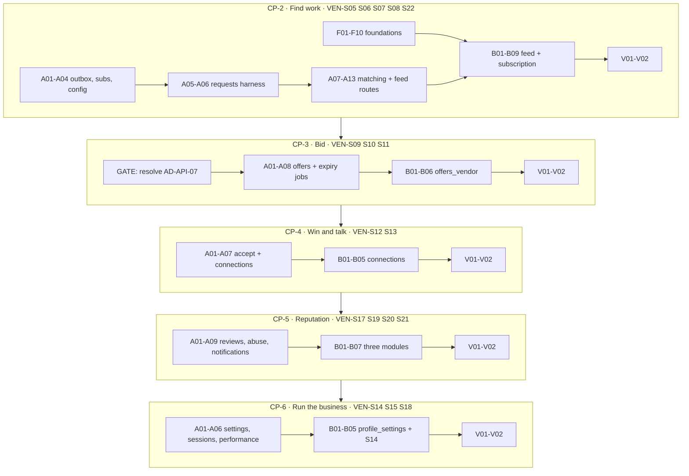

# Vendor App Completion — Task Register (Check-points 2–6)

| | |
|---|---|
| **Product** | Karat Hive |
| **Document** | Executable task list for the remaining 16 Vendor screens |
| **Status** | Working backlog — derived from the plan of record |
| **Date** | 7 September 2026 |
| **Plan of record** | [`Vendor-App-Completion-Plan.md`](Vendor-App-Completion-Plan.md) |
| **Does not override** | SRS v1.3 · `API-Route-Inventory.md` · `Architecture-Backend.md` / `-Frontend.md` · `Async-Contract.md` |
| **Predecessor register** | [`checkpoints/checkpoint-1-vendor-onboarding-tasks.md`](checkpoints/checkpoint-1-vendor-onboarding-tasks.md) |
| **Screens** | `VEN-S06`–`S15`, `S17`–`S22` (16 new) · `VEN-S05` upgraded |

The plan of record is the frozen contract. This file is the work list: IDs, order, files, acceptance. **Do not invent routes, fields, or states that are not in the plan.** Where a route shape is needed and the plan does not fix it, `API-Route-Inventory.md` is the fallback — not improvisation.

Status values: **done** (on disk, matches the plan) · **partial** (files exist, item incomplete) · **open** (not started) · **deferred** (explicitly out of this check-point) · **gate** (blocks the check-point starting).

Task IDs continue the check-point-1 convention. `CP1-*` IDs are retired and never reused. Tracks: **F** frontend foundations · **A** backend · **B** Flutter feature · **I** infra/decisions · **V** verification.

---

## Roadmap



**Gates.** CP-2: `melos run analyze` green after Track F; backend `npm run build && npm test`. CP-3: `AD-API-07` resolved (`CP3-I01`). CP-4: CP-3 Track V closed. CP-5: `T36` columns applied. CP-6: none.

---

# Check-point 2 — Find work

Screens `VEN-S06`, `VEN-S07`, `VEN-S08`, `VEN-S22`, and `VEN-S05` upgraded from the CP-1 thin shell.

## CP-2 Track F — Flutter foundations

No backend dependency. Start day one, in parallel with Track A.

| ID | Task | Files | Acceptance | Status |
|---|---|---|---|---|
| CP2-F01 | `MaskedParty` / `RevealedParty` sealed types | `packages/kh_domain/lib/src/party.dart` | Two distinct sealed types per `AD-FE-07`, not one nullable model. Masked carries role, Region, optional rating and deal count. Revealed carries name, mobile, address. A unit test asserts a masked payload cannot produce `RevealedParty` | done |
| CP2-F02 | `PagedListController` + `SH-FND-25` | `packages/kh_core/lib/src/paged_list_controller.dart`, `packages/kh_design_system/.../end_sentinel.dart` | Cursor-based per frontend arch §9.6. One shared controller drives every list. End sentinel renders at the tail; duplicate-page and empty-page cases covered | done |
| CP2-F03 | `SH-SHELL-06` pull-to-refresh | `packages/kh_design_system/lib/src/widgets/kh_refresh.dart` | Wraps any scrollable; invokes an async callback; shows the platform indicator. This is the primary cache-invalidation trigger (§9.5) | done |
| CP2-F04 | `SH-DOM-07` expiry countdown | `packages/kh_ui_domain/lib/src/expiry_countdown.dart` | Derives from `ServerClock` offset, never device time (`AD-FE-11`). Urgency styling under 24 h and under 6 h. Ticks without rebuilding the parent list | done |
| CP2-F05 | ARB + `gen_l10n` migration | `packages/kh_l10n/lib/l10n/app_en.arb`, `app_ar.arb`, generated delegates | Replaces the inlined `KhStrings` table. ICU plurals, Arabic-Indic numerals in every formatter, localised semantics labels. Lint rejects hard-coded user-facing strings. All CP-1 strings migrated with no regression | open |
| CP2-F06 | freezed + json_serializable | `packages/kh_domain`, `packages/kh_api` | Activates `AD-FE-05`. Existing hand-written DTOs and hand-rolled `copyWith` converted. `build_runner` wired into `melos run gen` | open |
| CP2-F07 | Per-feature `routes.dart` | `lib/features/*/routes.dart`, `lib/app/router.dart` | Each feature exports its routes; the app router mounts them (frontend arch §5.1). Guard chain behaviour unchanged — `test/app/guards_test.dart` still passes | open |
| CP2-F08 | Vendor shell + bottom navigation | `lib/app/shells/vendor_shell.dart`, `packages/kh_design_system/.../shell/` | `SH-SHELL-01/02/03`. Tabs Home · Requests · Offers · Connections · Profile, with later tabs disabled until their check-point lands. Preserves per-tab navigation stack | open |
| CP2-F09 | Split `KhApi` facade into per-resource clients | `packages/kh_api/lib/src/clients/*.dart` | `AuthApi`, `MeApi`, `VendorApi`, `MediaApi`, `TaxonomyApi`, plus new `MatchesApi`, `RequestsApi`, `FilterPresetsApi`, `SubscriptionsApi`, `PlatformConfigApi`. `KhApi` becomes a thin aggregate so no call site breaks in one commit | open |
| CP2-F10 | Fold `features/dashboard/` into `request_feed/` | `lib/features/request_feed/` | `VEN-S05` moves under `request_feed/`; `features/dashboard/` deleted. `features/onboarding/` stays and is registered in the architecture doc instead (plan §6.2). Existing dashboard tests moved, not rewritten | open |

## CP-2 Track A — Backend

| ID | Task | Endpoint / files | Acceptance | Status |
|---|---|---|---|---|
| CP2-A01 | Un-lease `outbox.drain` (`T46`, closes `D-2`) | `platform/outbox/`, `main.ts` | Drain no longer holds a job lease; competing workers are safe via row claim alone, per `Async-Contract.md` §6 | done |
| CP2-A02 | First real producer + consumer (`T45`, closes `D-1`) | `platform/outbox/outbox.dispatcher.ts` registration, `modules/matching/` | A domain module both emits and consumes through the outbox. `outbox_consumer` marker gives idempotency (`AD-ASYNC-04`). Retry 1 m / 5 m / 25 m (`AD-ASYNC-05`); exhausted → `state=FAILED` (`AD-ASYNC-06`) | done |
| CP2-A03 | Subscription read + Admin grant (`T19`) | `modules/subscription/`, `GET /v1/me/subscriptions` (`Vshell`) | Four independent type entitlements with state, period, price snapshot, renewal date. **No Vendor POST** (`AD-API-04`). Admin/seed grant path exists. Grace and expired states distinguishable | done |
| CP2-A04 | `GET /v1/platform-config` (closes `SAM-GAP-5`) | `modules/settings/` | Serves `offerValidityHours`, `requestLifetimeHours`, karat list, media limits, `legal.termsUrl`, `legal.privacyUrl`, `support.contactUrl`, `subscriptionContactUrl`. Values already seeded at CP-1 — surface, do not re-seed | done |
| CP2-A05 | Requests module, publish path (`T20`) | `modules/requests/`, `POST /v1/requests`, `POST /v1/requests/{id}/publish` (`C`, Idempotency-Key) | Draft → publish with the Customer presenter. Structural attributes immutable after publish (`BR-014`). Hard expiry set to 48 h at publish (`C-07`). Emits `request.published`. **API only — no Customer UI** | done |
| CP2-A06 | Request dev harness + seeds | `modules/requests/controller/dev-requests.controller.ts`, `prisma/seed/` | Guarded exactly like CP-1 dev-verify: `DEV_VERIFY_ENABLED && NODE_ENV != production && (ADMIN \|\| x-dev-key)`, else `404`. Seeds a Customer plus publishable Requests of all four types | done |
| CP2-A07 | Matching fan-out (`T21`) | `modules/matching/`, consumer `matching:fan-out` | On `request.published`, writes `request_match` rows for every Vendor satisfying `BR-002` — `VERIFIED` + `ACTIVE` + Category + Region + active subscription for that type. Emits one `request.matched` **per matched Vendor** (`AD-ASYNC-02`) | done |
| CP2-A08 | `GET /v1/matches` | `modules/matching/controller/` (`V`) | All filters and `sort ∈ NEWEST\|EXPIRING\|HIGHEST_VALUE\|FEWEST_OFFERS`; cursor pagination with `meta.nextCursor`; `includeResponded` defaults false; `presetId` applies a saved preset. Empty → `200 data:[]` | done |
| CP2-A09 | `POST /v1/matches/{requestId}/viewed` | `modules/matching/` (`V`) | `204`. Sets `request_match.viewed_at`; the dashboard New Requests count drops accordingly. Idempotent on repeat | done |
| CP2-A10 | `GET /v1/requests/{id}` Vendor presenter | `modules/requests/presenter/` (`CV`) | Full spec, images, budget, notes, offers-received **count**. Customer identity fields **absent** (`BR-006`). Not in the caller's match set → `404`, never `403` | done |
| CP2-A11 | Filter presets CRUD | `GET/POST /v1/filter-presets`, `PATCH/DELETE /v1/filter-presets/{id}` (`V`) | `[ASSUMED]`. Named, per-Vendor, cross-session. One may be marked default (read by `VEN-S18` later) | done |
| CP2-A12 | Eligibility recompute (`T37`) | consumer `matching:eligibility-recompute` | On `vendor.eligibility.changed`, recompute that Vendor's match set — additions and removals. Subscription lapse removes future matches without deleting Offer history | done |
| CP2-A13 | Real dashboard aggregates | `GET /v1/me/dashboard` (`V`) | Replaces CP-1 zeroes: `newRequests{count, preview≤3}`, `pendingOffers{count, expiringWithin24h}`, `activeConnections{count, noTalkCount}`, rating, `subscriptions[]`. `goldRates` stays `null` behind `AD-API-09` | done |
| CP2-A14 | Masking spec extension | `backend/test/masking/` | For `RequestForVendor` and every new presenter, named Customer fields are **absent**, not null. Competitor price, terms and identity absent from all match and request payloads (`BR-008`) | done |
| CP2-A15 | Integration suite | `backend/test/integration/vendor-feed.spec.ts` | Happy path plus every error code and state transition, against CI Postgres. Includes the unsubscribed-Vendor empty-feed case | done |

## CP-2 Track B — Flutter features

| ID | Screen / task | Files | Acceptance | Status |
|---|---|---|---|---|
| CP2-B01 | API clients | `packages/kh_api/lib/src/clients/` | `MatchesApi`, `RequestsApi`, `FilterPresetsApi`, `SubscriptionsApi`, `PlatformConfigApi` on the CP2-F09 split. DTO → domain via freezed | open |
| CP2-B02 | `request_feed/` scaffold | `lib/features/request_feed/` | §5.1 shape plus `routes.dart`. Repository returns `Result<T>`; server cache as `FutureProvider`s; controllers are `AutoDisposeNotifier` | open |
| CP2-B03 | `VEN-S06` available Requests | `.../presentation/request_feed_screen.dart` | Infinite scroll on `PagedListController`; offer count without competitor prices; expiry countdown; responded-marker toggle; pull-to-refresh. Empty state suggests broadening Categories/Regions/subscription | open |
| CP2-B04 | `VEN-S07` filters and presets | `.../presentation/request_filters_sheet.dart` | `SH-FND-16` bottom sheet with every filter and the four sorts; save/apply/delete presets; one-tap reset offered at zero results | open |
| CP2-B05 | `VEN-S08` Request detail | `.../presentation/request_detail_screen.dart` | Full-res gallery, type-specific spec, masked Customer label, aggregate rating signal, offers-submitted count. Fires `viewed` on open. Actions disabled when the Request is closed or expired | open |
| CP2-B06 | `VEN-S05` full dashboard | `.../presentation/vendor_dashboard_screen.dart` | Real counts from `CP2-A13`; three panels deep-link into feed, offers (disabled until CP-3) and connections (disabled until CP-4); entitlement panel links to `VEN-S22`; gold-rate panel hidden while the flag is off | open |
| CP2-B07 | `VEN-S22` subscriptions | `lib/features/subscription/` | Four entitlements with state, period, renewal. Subscribe/upgrade is a **deep link** to `platform-config.subscriptionContactUrl`, never an in-app mutation (`AD-API-04`). Grace and expired messaging distinct | open |
| CP2-B08 | New shared widgets | `packages/kh_design_system`, `packages/kh_ui_domain` | `SH-REQ-01` (vendor variant), `SH-ID-01`, `SH-ID-07`, `SH-DOM-03`, `SH-DOM-08`, `SH-MED-03`, `SH-FND-19`, `SH-FND-20`. Domain-aware widgets go in `kh_ui_domain`, never `kh_design_system` (§5.2) | open |
| CP2-B09 | Tests and goldens | `apps/.../test/`, `packages/*/test/` | Controller tests loading/empty/error/data per screen; widget tests for every `SH-FND-12` and `SH-FND-13` state; LTR + RTL goldens for each new shared widget; a client masking test per `AD-FE-07` | open |

## CP-2 Tracks I and V

| ID | Task | Acceptance | Status |
|---|---|---|---|
| CP2-I01 | Escalate `T36` schema deltas for Technical Lead sign-off | `SAM-GAP` + `Async-Contract` §10 columns and the four partial indexes signed off during CP-2 — `T41` in CP-3 is blocked on them | open |
| CP2-I02 | Register the plan's `[PROPOSED]` decisions | Plan §9 rows carried into `Architecture-Frontend.md` §3/§5/§14 and Appendix A, each taking the next free `AD-FE-nn` | done |
| CP2-I03 | Correct stale documentation | `Backend-Gap-Fix-Plan.md` `F01`–`F17` marked done (they are landed); `API-Route-Inventory.md` §20 heading corrected to match `vendor-access.guard.ts` (`SAM-GAP-7` residue) | done |

**CP2-V01 — Backend walk-through.** `npm run seed && npm run start:dev`, `DEV_VERIFY_ENABLED=true`.

```
BASE=http://localhost:3000
1.  Seed or dev-verify a Vendor to ACTIVE with categories + regions
2.  Grant a Type Subscription for FIND_ORNAMENT       (admin/seed path)
3.  GET  /v1/platform-config                          → offerValidityHours, legal URLs
4.  GET  /v1/me/subscriptions                         → one ACTIVE entitlement
5.  POST /v1/requests            (dev harness, Customer)
    POST /v1/requests/{id}/publish                    → emits request.published
6.  wait one outbox drain                             → request_match row written
7.  GET  /v1/matches                                  → the Request appears
8.  GET  /v1/requests/{id}                            → NO Customer identity field present
9.  POST /v1/matches/{id}/viewed                      → 204
10. GET  /v1/me/dashboard                             → newRequests count decremented
11. Revoke the subscription → eligibility.changed     → GET /v1/matches now empty
```

**CP2-V02 — Flutter walk-through.** `melos bootstrap` → `flutter run --dart-define-from-file=config/dev.json`. Sign in as the ACTIVE Vendor → Dashboard shows real counts → Requests tab lists the seeded Request → open filters, save a preset, apply it → open the Request detail and confirm no Customer name anywhere → pull-to-refresh → revoke the subscription server-side, refresh, confirm the empty state and that `VEN-S22` explains it.

**Deferred from CP-2:** Offer actions on `VEN-S08` (CP-3) · Connections tab (CP-4) · notification deep links (CP-5) · gold-rate panel (CP-6, flag stays off) · Customer UI (out of scope entirely).

---

# Check-point 3 — Bid

Screens `VEN-S09`, `VEN-S10`, `VEN-S11`.

| ID | Task | Endpoint / files | Acceptance | Status |
|---|---|---|---|---|
| **CP3-I01** | **Resolve the Offer validity option set** | SRS revision or `AD-API-07` ruling | `FR-VEN-013` says 12/24/48 h; the SRS §6 dictionary says 24/48/72/168. One wins and `platform-config.offerValidityHours` serves it. **CP-3 does not start until this closes** | **gate** |
| CP3-A01 | `T36` schema deltas applied | new migration | Columns and the four partial indexes from `SAM-GAP` + `Async-Contract` §10. Signed off in `CP2-I01`. Partial-unique index enforces `BR-009` | open |
| CP3-A02 | Offers module + submit | `modules/offers/`, `POST /v1/requests/{id}/offers` (`V`, Idempotency-Key) | `BR-002` gate, `BR-009` one non-terminal Offer per Vendor per Request. Validity clamped to the Request's remaining life and never past its hard expiry. Errors `VENDOR_NOT_ACTIVE`, `SUBSCRIPTION_REQUIRED`, `NOT_IN_MATCH_SET`, `OFFER_NOT_OPEN`, `OFFER_ALREADY_PENDING`, `CONTACT_DETAILS_IN_TEXT`. Emits `offer.submitted`. First Offer flips the Request `PUBLISHED → OFFERS_RECEIVED` **synchronously** (`AD-ASYNC-10`) | open |
| CP3-A03 | Revise | `POST /v1/offers/{id}/revise` (`V`, Idempotency-Key) | `[ASSUMED]`. Max 3 revisions → `OFFER_REVISION_LIMIT`. Resets validity, still clamped. History retained internally. Emits `offer.revised` | open |
| CP3-A04 | Withdraw | `POST /v1/offers/{id}/withdraw` (`V`) | `[ASSUMED]`. `PENDING` only, else `OFFER_NOT_PENDING`. Emits `offer.withdrawn` | open |
| CP3-A05 | Offer reads | `GET /v1/me/offers` (`V`), `GET /v1/offers/{id}` (`CV`) | Tabs `PENDING\|ACCEPTED\|CLOSED`; `CLOSED` spans `REJECTED`, `EXPIRED`, `WITHDRAWN`. Rejected rows may say the Request was awarded elsewhere and must carry **no** winning price or Vendor (`BR-008`) | open |
| CP3-A06 | Expiry sweep + warning (`T41`) | jobs `offer-expiry-sweep` (1 min), `offer-expiry-warning` (5 min) | Warning at T−6 h guarded by `expiry_warned_at`, emitting `offer.expiry.warning`. Sweep expires and emits `offer.expired`. Both use database `now()` and the snapshotted `expires_at` (`AD-ASYNC-09`) | open |
| CP3-A07 | `offers:request-state` consumer | `modules/offers/` | On `offer.expired`, walks the Request state back when no non-terminal Offer remains (`AD-ASYNC-10`, reverse direction) | open |
| CP3-A08 | Tests | `backend/test/integration/vendor-offers.spec.ts` | Every error code; revision-limit boundary; idempotent replay of submit; masking spec extended to Offer presenters | open |
| CP3-B01 | `offers_vendor/` scaffold + `OffersApi` | `lib/features/offers_vendor/`, `packages/kh_api/.../offers_api.dart` | §5.1 shape plus `routes.dart` | open |
| CP3-B02 | `VEN-S09` submit Offer | `.../presentation/submit_offer_screen.dart` | `SH-OFF-02` terms form; `SH-OFF-03` validity picker reading `platform-config`, **never hard-coded**; up to 3 supporting images through the CP-1 media pipeline with purpose `OFFER_IMAGE`; computed absolute expiry shown before submit | open |
| CP3-B03 | `VEN-S10` revise / withdraw | `.../presentation/revise_offer_screen.dart` | Current-terms snapshot; revisions-remaining indicator; withdraw behind `SH-FND-15` confirm; blocked once the Offer leaves `PENDING` | open |
| CP3-B04 | `VEN-S11` My Offers | `.../presentation/my_offers_screen.dart` | Three tabs with counts matching the dashboard; date-range and type filters; search by Request reference; countdown prioritised under 24 h. Accepted tab links to the Connection (disabled until CP-4) | open |
| CP3-B05 | Widgets | `packages/kh_ui_domain`, `packages/kh_design_system` | `SH-OFF-01`, `SH-OFF-02`, `SH-OFF-03`, `SH-OFF-04`, `SH-FND-26` tabs, `SH-FND-18` badges, `SH-FND-15` confirm, `SH-MED-01/02/05` | open |
| CP3-B06 | Tests and goldens | | Controller and widget tests per screen; LTR + RTL goldens for the new widgets | open |

**CP3-V01 — Backend.** Submit an Offer on the CP-2 seeded Request → revise three times → confirm the fourth returns `OFFER_REVISION_LIMIT` → submit a second Offer on the same Request and confirm `OFFER_ALREADY_PENDING` → withdraw → submit again → set a short validity and let the sweep expire it, confirming the T−6 h warning fired once → confirm a note containing a phone number is rejected with `CONTACT_DETAILS_IN_TEXT`.

**CP3-V02 — Flutter.** Feed → Request detail → Submit Offer with images → My Offers Pending shows a live countdown → Revise → Withdraw → confirm the Rejected-Expired tab shows the expired Offer with **no** winning price or competitor name.

**Deferred from CP-3:** acceptance and Connections (CP-4) · offer-related notifications (CP-5) · performance analytics `VEN-S14` (CP-6).

---

# Check-point 4 — Win and talk

Screens `VEN-S12`, `VEN-S13`.

| ID | Task | Endpoint / files | Acceptance | Status |
|---|---|---|---|---|
| CP4-A01 | Accept transaction (`T23`) | `POST /v1/offers/{id}/accept` (`C`, dev harness) | **One transaction:** accept the winner, reject every competing Offer, create exactly one Connection, reveal both identities (`BR-011`–`BR-013`, `FR-SYS-006`, `FR-SYS-007`). Irreversible. Emits `offer.accepted` with the winner and `rejectedOfferIds`, carrying **no** competing price or identity (`AD-ASYNC-03`) | open |
| CP4-A02 | Decline | `POST /v1/offers/{id}/decline` (`C`, dev harness) | `[ASSUMED]`. Optional reason category, surfaced to the Vendor on the Rejected tab | open |
| CP4-A03 | Connections module (`T24`) | `modules/connections/`, `GET /v1/me/connections`, `GET /v1/connections/{id}` (`CV`) | Revealed counterparty scoped to this Connection only (`BR-007`). Detail includes `talk.waUrl`. Identity access audit-logged; no bulk export (`NFR-016`) | open |
| CP4-A04 | Contact events | `POST /v1/connections/{id}/contact-events` (`CV`) | Channel `WHATSAPP\|PHONE` and timestamp only. **No content ever** (`NFR-017`, `C-03`). On a closed Connection → `CONNECTION_CLOSED` | open |
| CP4-A05 | Close Connection | `POST /v1/connections/{id}/close` (`CV`) | Either party may close. Emits `connection.closed`. Closed detail is read-only and `talk.available:false` | open |
| CP4-A06 | Concurrency test (`T25`) | `backend/test/integration/acceptance-concurrency.spec.ts` | Two simultaneous accepts on the same Request produce exactly one Connection and one `ACCEPTED` Offer (`BR-011`). Idempotent replay of accept returns the first result | open |
| CP4-A07 | Masking and reveal spec | `backend/test/masking/` | Before acceptance both parties masked; after acceptance revealed **only** within the Connection. The same pair on a different Request stays masked (`BR-007`). Losing Vendors see no winner information | open |
| CP4-B01 | `connections/` scaffold + `ConnectionsApi` | `lib/features/connections/` | §5.1 shape plus `routes.dart`. Revealed detail cached for the session only, **never to disk** (§9.5) | open |
| CP4-B02 | `VEN-S12` Connections list | `.../presentation/connections_screen.dart` | Active before Closed; revealed name, Request reference, agreed price, date. Talk shortcut on Active rows only | open |
| CP4-B03 | `VEN-S13` Connection detail | `.../presentation/connection_detail_screen.dart` | Revealed name and mobile with copy and tap-to-call; accepted Offer terms in full; Talk opens a pre-filled `wa.me` link and logs a contact event; Close behind a confirm, then prompts the review flow; read-only banner when closed; WhatsApp-absent fallback to Web, copy or call | open |
| CP4-B04 | Widgets | `packages/kh_ui_domain` | `SH-CON-01`, `SH-CON-02`, `SH-CON-03`, `SH-CON-04`, `SH-ID-02`, `SH-FND-22` | open |
| CP4-B05 | Wire `VEN-S11` Accepted tab and dashboard | `lib/features/offers_vendor/`, `request_feed/` | Accepted rows deep-link to the Connection; the "No Talk" flag prompts contact; the dashboard Active Connections panel goes live | open |

**CP4-V01 — Backend.** Two Vendors submit Offers → dev-harness accept one → confirm exactly one Connection exists, the loser's Offer is `REJECTED` with no winner information, and both identities are revealed only inside the Connection → run the concurrency test → log a contact event and confirm only channel and timestamp are stored → close, and confirm a further contact event returns `CONNECTION_CLOSED`.

**CP4-V02 — Flutter.** My Offers Accepted → Connection detail shows the revealed name and mobile → Talk opens WhatsApp with pre-filled text → tap-to-call and copy both work → Close prompts the review flow (screen lands in CP-5) → reopen and confirm the read-only banner.

**Deferred from CP-4:** the review screens the close flow prompts (CP-5) · notification on acceptance (CP-5).

---

# Check-point 5 — Reputation and awareness

Screens `VEN-S17`, `VEN-S19`, `VEN-S20`, `VEN-S21`.

| ID | Task | Endpoint / files | Acceptance | Status |
|---|---|---|---|---|
| CP5-A01 | `AbuseEntityType` extension (`SAM-GAP-4`) | migration + `modules/abuse/` | Adds `CUSTOMER` (and `VENDOR`) so `FR-VEN-030`'s report-a-Customer path is reachable at all | open |
| CP5-A02 | Abuse reports (`T27`) | `POST /v1/abuse-reports` (`CV`) | `[ASSUMED]`. Reporter identity withheld from the reported party. Three distinct Vendor reports on one Request auto-flag it for priority Admin review. Rate limit applied | open |
| CP5-A03 | Reviews (`T26`) | `POST /v1/connections/{id}/reviews`, `GET /v1/me/reviews` (`CV`) | `BR-016` party-to-the-Connection only; `BR-017` one per Connection per party → `REVIEW_ALREADY_EXISTS`. Submitted as `PENDING_MODERATION`. Customer ratings visible to Vendors and Admins only (`BR-018`) | open |
| CP5-A04 | Review response and flag | `POST /v1/reviews/{id}/response`, `POST /v1/reviews/{id}/flag` (`V`) | `[ASSUMED]`. One response per review, ≤500 chars, held for approval, second attempt → `CONFLICT`. Flag re-enters the Admin queue; the review stays visible until an Admin acts | open |
| CP5-A05 | Rating aggregation + `ratingTrend` (`SAM-GAP-8`) | consumer `reviews:rating-recompute`, job `rating-reconcile` (5 min) | Aggregate to 1 dp with distribution. Adds `ratingTrend: {period, average, count}[]` to `GET /v1/me/vendor/performance` — the six-month series `VEN-S20` needs and which exists nowhere today | open |
| CP5-A06 | Notifications module (`T28`) | `modules/notifications/`, `GET /v1/notifications`, `POST /v1/notifications/{id}/read` (`CV`) | 90-day window with category, timestamp, read state and deep link. `read-all` and `unread-count` are `[PROPOSED]` — implement or record as out of slice | open |
| CP5-A07 | Dispatch consumer + push port | consumer `notifications:dispatch`, `platform/ports/notification-sender.port.ts`, FCM adapter | Handles the 17 event types in `Async-Contract.md` §5. Channel and status enums per `AD-ASYNC-07`. Quiet hours and business hours defer delivery. Never places a competitor's price in a payload (`BR-008`) | open |
| CP5-A08 | Device registration + retry (`T38`) | `POST /v1/devices`, `DELETE /v1/devices/{id}` (`[PROPOSED]`), job `notification-retry` (1 min) | Retry `FAILED` deliveries with `attempt < 3`. Token registered on sign-in, removed on sign-out | open |
| CP5-A09 | Expiry-warning jobs | `request-expiry-warning` (5 min), `vendor-document-expiry` (daily 02:00 GST, `T44`) | Request warning at T−6 h (`C-07`); document reminder 30 days out, guarded by `reminder_sent_at` | open |
| CP5-B01 | `notifications/` module + `VEN-S17` | `lib/features/notifications/` | 90-day list, category icons, read/unread, deep links resolving through the guard chain to `/requests/{id}`, `/offers/{id}`, `/connections/{id}`, `/me/vendor`, `/me/vendor/documents` (`Async-Contract.md` §7.2) | open |
| CP5-B02 | Push-triggered invalidation (`AD-FE-10`) | `lib/app/notifications/` | Wires the existing `firebase_notification_service.dart` to invalidate the affected providers on push — the third invalidation trigger from §9.5. Foreground polling retained; no WebSocket | open |
| CP5-B03 | `reviews/` module + `VEN-S19` | `lib/features/reviews/` | Star input, comment ≤1000 chars, Connection context. Already-reviewed state blocks resubmission | open |
| CP5-B04 | `VEN-S20` my reviews and responses | `.../presentation/my_reviews_screen.dart` | Aggregate to 1 dp, count, distribution bars, six-month trend chart from `ratingTrend`, review list, response input ≤500 chars, flag-as-unfair. "New — limited history" under 3 reviews | open |
| CP5-B05 | `abuse/` module + `VEN-S21` | `lib/features/abuse/` | `SH-RPT-01` with the Vendor category set; entity context pre-filled from `VEN-S08` or `VEN-S13`; acknowledgement on submit; reporter never disclosed | open |
| CP5-B06 | Widgets | `packages/kh_ui_domain`, `packages/kh_design_system` | `SH-NTF-01`, `SH-NTF-02`, `SH-NTF-03`, `SH-ID-03`, `SH-ID-04`, `SH-ID-05`, `SH-ID-06`, `SH-RPT-01`, `SH-FND-17`, `SH-FND-18` | open |
| CP5-B07 | Tests and goldens | | Per-screen controller and widget tests; LTR + RTL goldens; a test asserting no notification payload carries a competitor price | open |
| CP5-I01 | Author `docs/Notification-Catalogue.md` | `Spec-Document-Sequence.md` §4.4 | EN/AR body per trigger, template key, placeholders, channels, deep link, quiet-hours behaviour, `Vshell` allowed or not. **Start during CP-3** — CP-5 cannot ship copy that does not exist | open |

**CP5-V01 — Backend.** Close a Connection → submit a review → confirm a second attempt returns `REVIEW_ALREADY_EXISTS` → moderate it and confirm the aggregate and `ratingTrend` update → post a response, confirm the second returns `CONFLICT` → flag a review and confirm it stays visible → report a Customer and confirm `CUSTOMER` is now a legal entity type → three Vendor reports on one Request raise the priority flag → force a delivery failure and confirm the retry job picks it up.

**CP5-V02 — Flutter.** Receive a push → notification centre shows it unread → tap the deep link and land on the right screen through the guard chain → read state updates → leave feedback from a closed Connection → my reviews shows the aggregate, distribution and trend → post a response → report abuse from a Request detail.

**Deferred from CP-5:** Admin moderation UI (out of scope) · `read-all` and `unread-count` if recorded out of slice at `CP5-A06`.

---

# Check-point 6 — Run the business

Screens `VEN-S14`, `VEN-S15`, `VEN-S18`.

| ID | Task | Endpoint / files | Acceptance | Status |
|---|---|---|---|---|
| CP6-A01 | Settings (`T15` remainder) | `GET/PATCH /v1/me/settings` (`C/V`) | Language, notification preferences by category, channel preferences, quiet-hours window, default filter preset. Security-critical categories locked on | open |
| CP6-A02 | Sessions and password | `GET/DELETE /v1/auth/sessions[/{id}]` (`C/V/A`), `POST /v1/auth/password` | Active session list with device and last-seen; revoke one. Password set/change → `PASSWORD_POLICY` on violation | open |
| CP6-A03 | Performance | `GET /v1/me/vendor/performance` (`V`) | `offersSubmitted`, `acceptanceRate`, `averageResponseMinutes` (publish → submit), `averageOfferedVsAccepted?`, `byOutcome[]`, `ratingTrend[]`. `averageOfferedVsAccepted` is a **period aggregate**, never per-Request — a per-Request figure breaches `BR-008` | open |
| CP6-A04 | CSV export | `GET /v1/me/vendor/performance/export` (`V`) | `[ASSUMED]`. Signed `{downloadUrl, expiresAt}`, own records only, no counterparty identities beyond those already revealed by a Connection | open |
| CP6-A05 | Gold rate (`T30`) | `modules/gold-rate/`, `GET /v1/gold-rates` (`CV`), jobs `gold-rate-poll` (15 min), `gold-rate-stale-alert` | Behind flag `goldRates.endUserDisplay` (`AD-API-09`), **shipped off**. Yahoo Finance redistribution terms remain unresolved, so end-user display stays `[BLOCKED]` | open |
| CP6-A06 | Tests | `backend/test/integration/vendor-settings.spec.ts` | Settings round-trip, session revoke, password policy, performance aggregates, export signing. Masking spec covers the export | open |
| CP6-B01 | `profile_settings/` module | `lib/features/profile_settings/` | Absorbs `VEN-S16` categories/regions from `features/onboarding/` per the architecture module list, leaving onboarding's KYC and awaiting-approval screens in place (plan §6.2) | open |
| CP6-B02 | `VEN-S15` business profile | `.../presentation/business_profile_screen.dart` | Editable trading name, description, logo, shop photos, business hours, contact person, business email. Legal business name, trade licence number and registered address are behind an explicit warning: saving them returns the account to `PENDING_VERIFICATION` (`BR-004`) and drops the Vendor into the Awaiting-Approval shell. Read-only verification status, rating, totals, masked public preview | open |
| CP6-B03 | `VEN-S18` settings | `.../presentation/settings_screen.dart` | Language with immediate RTL, notification matrix, quiet hours, default preset, password, active sessions with revoke, legal and support links from `platform-config`, app version, logout | open |
| CP6-B04 | `VEN-S14` performance | `lib/features/offers_vendor/presentation/offer_history_screen.dart` | Date-range, type, Category, Region and outcome filters; metric block; terminal-Offer history; CSV export. Aggregate comparisons only — no competitor prices | open |
| CP6-B05 | Widgets, tests, goldens | | `SH-SET-01`, `SH-SET-02`, `SH-FND-04/06/09/10/23/24`, rating-trend chart block. Full test and golden coverage | open |

**CP6-V01 — Backend.** Round-trip settings → revoke a session and confirm that token is rejected → change the password and confirm the policy error path → read performance and confirm the aggregate contains no per-Request competitor figure → request the CSV export and confirm the signed URL expires → confirm `GET /v1/gold-rates` respects the flag.

**CP6-V02 — Flutter.** Settings → switch to Arabic and confirm the layout mirrors immediately → set quiet hours and a default preset → revoke another session → open the business profile, edit the trading name and save with no re-verification → edit the trade licence number and confirm the warning, then the Awaiting-Approval shell → performance screen filters and exports.

**Deferred from CP-6:** turning on the gold-rate flag (`[BLOCKED]` on Yahoo Finance terms) · biometric unlock · anything Customer or Admin.

---

## Screen → task traceability

All 16 remaining screens, each in exactly one check-point.

| Screen | Title | FR | Primary routes | Module | Tasks | CP |
|---|---|---|---|---|---|---|
| `VEN-S05` | Vendor dashboard (upgrade) | `FR-VEN-004`–`007` | `GET /v1/me/dashboard` | `request_feed` | CP2-A13, CP2-B06 | 2 |
| `VEN-S06` | Available Requests feed | `FR-VEN-008` | `GET /v1/matches` | `request_feed` | CP2-A07/A08, CP2-B03 | 2 |
| `VEN-S07` | Filters and saved presets | `FR-VEN-009` `[ASSUMED]` | `GET/POST/PATCH/DELETE /v1/filter-presets` | `request_feed` | CP2-A11, CP2-B04 | 2 |
| `VEN-S08` | Request detail, masked | `FR-VEN-010`, `FR-VEN-011` | `GET /v1/requests/{id}`, `POST /v1/matches/{id}/viewed` | `request_feed` | CP2-A09/A10, CP2-B05 | 2 |
| `VEN-S22` | Subscription by Request type | `FR-VEN-031` | `GET /v1/me/subscriptions`, `GET /v1/platform-config` | `subscription` | CP2-A03/A04, CP2-B07 | 2 |
| `VEN-S09` | Submit Offer | `FR-VEN-012`, `013`, `015` | `POST /v1/requests/{id}/offers` | `offers_vendor` | CP3-A02, CP3-B02 | 3 |
| `VEN-S10` | Revise / withdraw Offer | `FR-VEN-014` | `POST /v1/offers/{id}/revise`, `/withdraw` | `offers_vendor` | CP3-A03/A04, CP3-B03 | 3 |
| `VEN-S11` | My Offers | `FR-VEN-016`–`019` | `GET /v1/me/offers` | `offers_vendor` | CP3-A05, CP3-B04 | 3 |
| `VEN-S12` | Connections list | `FR-VEN-020` | `GET /v1/me/connections` | `connections` | CP4-A03, CP4-B02 | 4 |
| `VEN-S13` | Connection detail | `FR-VEN-021`, `022` | `GET /v1/connections/{id}`, `/contact-events`, `/close` | `connections` | CP4-A03/A04/A05, CP4-B03 | 4 |
| `VEN-S17` | Notification centre | `FR-VEN-026` | `GET /v1/notifications`, `POST /v1/notifications/{id}/read` | `notifications` | CP5-A06/A07, CP5-B01 | 5 |
| `VEN-S19` | Leave customer feedback | `FR-VEN-028` | `POST /v1/connections/{id}/reviews` | `reviews` | CP5-A03, CP5-B03 | 5 |
| `VEN-S20` | My reviews and responses | `FR-VEN-029` `[ASSUMED]` | `GET /v1/me/reviews`, `POST /v1/reviews/{id}/response`, `/flag` | `reviews` | CP5-A04/A05, CP5-B04 | 5 |
| `VEN-S21` | Report abuse | `FR-VEN-030` `[ASSUMED]` | `POST /v1/abuse-reports` | `abuse` | CP5-A01/A02, CP5-B05 | 5 |
| `VEN-S14` | Offer history and performance | `FR-VEN-023` | `GET /v1/me/vendor/performance[/export]` | `offers_vendor` | CP6-A03/A04, CP6-B04 | 6 |
| `VEN-S15` | Business profile | `FR-VEN-024`, `BR-004` | `GET/PATCH /v1/me/vendor` | `profile_settings` | CP6-B02 | 6 |
| `VEN-S18` | Settings | `FR-VEN-027` | `GET/PATCH /v1/me/settings`, `GET/DELETE /v1/auth/sessions` | `profile_settings` | CP6-A01/A02, CP6-B03 | 6 |

## Mapping to `Backend-Implementation-Plan.md`

Tick a `T`-ID only for the **Vendor path**. Customer and Admin halves stay open.

| Impl-plan task | Check-point | Vendor-path scope |
|---|---|---|
| `T19` Subscriptions read + Admin grant | CP-2 | Full read path; Admin grant via seed/admin only |
| `T20` Request draft/publish/cancel/duplicate | CP-2 | **Publish path only, API + dev harness.** Cancel, duplicate and the Customer UI stay open |
| `T21` Fan-out + `/v1/matches` + masking tests | CP-2 | Full |
| `T37` Match-set recompute | CP-2 | Full |
| `T45` First real outbox producer + consumer | CP-2 | Full — closes `D-1` |
| `T46` Un-lease `outbox.drain` | CP-2 | Full — closes `D-2` |
| `T16` remainder — `/v1/platform-config` | CP-2 | Full |
| `T36` Schema deltas + partial indexes | CP-2 sign-off, CP-3 apply | Full |
| `T22` Offer submit/revise/withdraw/list | CP-3 | Full |
| `T41` Offer expiry warning job | CP-3 | Full |
| `T23` Accept transaction + decline | CP-4 | **API + dev harness only.** Customer UI stays open |
| `T24` Connections + Talk URL + contact-events | CP-4 | Full |
| `T25` Concurrency test | CP-4 | Full |
| `T26` Reviews + aggregation | CP-5 | Vendor-authored and Vendor-received paths; Admin moderation UI stays open |
| `T27` Abuse reports | CP-5 | Vendor reporter path; Admin queue UI stays open |
| `T28` Notifications + expiry workers | CP-5 | Full for Vendor triggers |
| `T38` Notification retry job | CP-5 | Full |
| `T44` Vendor document expiry job | CP-5 | Full |
| `T15` remainder — sessions, devices, password | CP-5 devices, CP-6 sessions/password | Full for Vendor |
| `T30` Gold-rate ingest/override + display flag | CP-6 | Built, **flag off** — end-user display stays `[BLOCKED]` |
| `T29` Admin lists/actions/exports | — | Out of scope |
| `T31` Generated OpenAPI + CI diff | — | Out of scope; still blocks `T32` |
| `T39` Retention purge · `T40` Gold-rate stale alert · `T42` Draft purge · `T43` Announcement dispatch | — | Out of scope |

## Constraints — do not reopen

- Identity masking until Acceptance (`BR-006`). Masked fields **absent** from JSON, never null.
- A Vendor never learns a competing Vendor's identity, price or terms — before, during or after (`BR-008`). Only the Offer count.
- Acceptance is atomic and irreversible (`BR-011`–`BR-013`); reveal is scoped to that one Connection (`BR-007`).
- Requests hard-expire at 48 hours with no extension; warning at T−6 h (`C-07`).
- WhatsApp is an outbound `wa.me` deep link only. No Business API, no callback, no conversation content (`C-03`, `NFR-017`).
- Settlement is off-platform (`BR-015`).
- AED, grams, karat. Stored UTC, displayed Gulf Standard Time (`BR-021`, `C-01`, `C-02`).
- No Redis, Kafka or Elasticsearch (`C-12`). Async is the PostgreSQL outbox; rate limiting is PostgreSQL token buckets.
- Flutter: Riverpod (`AD-FE-03`), go_router (`AD-FE-04`). Guards mirror server rules for usability and are **never** a security boundary.
- Dev-harness routes stay behind the CP-1 pattern — `NODE_ENV != production`, guarded, `404` when disabled. Never reachable in production.
