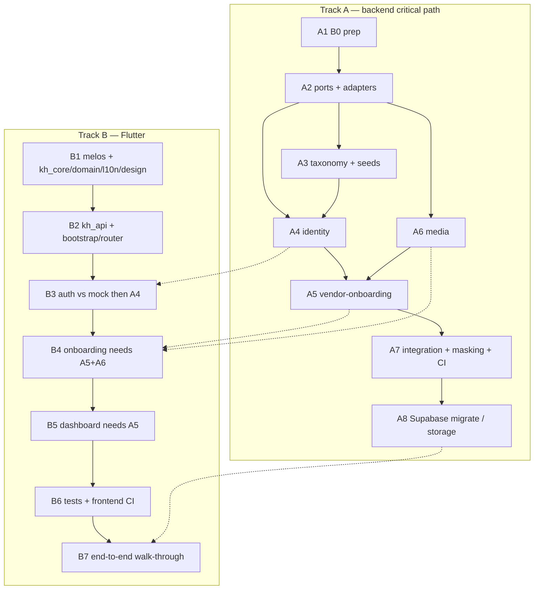

# Check-point-1 — Implementation task list

| | |
|---|---|
| **Product** | Karat Hive |
| **Document** | Executable task list for the Vendor onboarding vertical |
| **Status** | Working backlog — derived from the plan of record |
| **Date** | 4 September 2026 |
| **Plan of record** | [`checkpoint-1-vendor-onboarding-vertical.md`](checkpoint-1-vendor-onboarding-vertical.md) |
| **Does not override** | SRS v1.3 · API-Route-Inventory · Architecture-Backend / Frontend |
| **Branch** | `feat/vendor-onboarding-vertical` |
| **Screens** | VEN-S04, VEN-S01, VEN-S02, VEN-S03, VEN-S16, thin VEN-S05 |

The checkpoint is the frozen contract for this vertical. This file is the work list: IDs, order, files, acceptance. Do not invent routes, fields, or states that are not in the checkpoint.

**Current tree (6 Sep 2026):** Track A backend vertical is on `main`. Track B onboarding/dashboard/goldens/CI landed on `feat/cp1-closeout` and merged. Login/auth (Google Sign-In backend session, CP1-V01/V02 walks) is **out of this close-out**. Use [§ Remaining to close](#remaining-to-close) as the live punch list; the [full register](#full-task-register) is the whole vertical.

---

## How to execute

Backend-first for contract-bearing work; Flutter package scaffolding runs in parallel from day 1 (checkpoint Sequencing).



**Gates.** A1: `cd backend && npm run build && npm test`. A4: OTP → register → login → refresh → `GET /v1/me`. A5: documents → dev-verify → categories/regions → `ACTIVE` → dashboard. B1: `melos run analyze`. B7: checkpoint Verification walk-through, backend + Flutter.

---

## Remaining to close

Work still open against the plan of record. Do these in this order.

| ID | Track | Task | Why it is still open |
|---|---|---|---|
| ~~CP1-I02~~ | I | Paste `SUPABASE_SERVICE_ROLE_KEY` into `backend/.env` | **Done 6 Sep 2026** — key set, KYC storage round-trip verified |
| ~~CP1-I03~~ | I | Confirm private Storage bucket `kyc` exists in project `husuemlfcvacrysapwho` | **Done 6 Sep 2026** — bucket confirmed (private, 10 MiB, pdf/jpeg/png) |
| ~~CP1-B01a~~ | B | Add `tooling/golden_runner.dart` | **Done on feat/cp1-closeout** |
| ~~CP1-B01b~~ | B | `VendorStatusCard` in `kh_ui_domain` | **Done** (landed earlier on main) |
| ~~CP1-B02a~~ | B | Extract `app/guards.dart` + shells | **Done** (landed earlier on main) |
| ~~CP1-B02b~~ | B | `config/staging.json` | **Done on feat/cp1-closeout** |
| ~~CP1-B06a~~ | B | Controller tests for register / login | **Superseded — login/auth skipped.** KYC + categories/regions controller tests added on close-out. |
| ~~CP1-B06b~~ | B | Widget tests for login/register SH-FND-12/13 | **Superseded — login/auth skipped.** Awaiting + dashboard SH-FND-12/13 added on close-out. |
| ~~CP1-B06c~~ | B | LTR + RTL goldens for `kh_design_system` | **Done on feat/cp1-closeout** |
| ~~CP1-B06d~~ | B | Frontend CI goldens | **Done on feat/cp1-closeout** (`frontend.yml` goldens job + admin job) |
| **CP1-V01** | V | Backend walk-through | **Deferred — login/auth skipped.** OTP steps 1–3 superseded. KYC + dashboard HTTP cases exist in `vendor-media.spec.ts` (minted JWT). Live curl walk waits on a real session. |
| **CP1-V02** | V | Flutter walk-through | **Deferred — login/auth skipped.** Widget tests cover awaiting / KYC / categories / dashboard with a fake session. |

Deferred on purpose (do not pull into this checkpoint): ARB/`gen_l10n` (inlined `KhStrings` is the current stand-in), `freezed`/`json_serializable` (hand-written DTOs), listing `kh_admin` in the Dart workspace, standalone `melos.yaml` (Melos 8 config is in root `pubspec.yaml`), real SMS, EXIF/scan worker, OpenAPI generation. (Supabase Data-API/RLS was deferred here → **resolved 6 Sep 2026**, `docs/adr/0009`.)

---

## Full task register

Status values: **done** (on disk, matches the plan) · **partial** (files exist, plan item incomplete) · **open** (not started or not wired) · **deferred** (explicitly out of this checkpoint).

### Track A — Backend

#### A1 — B0 cross-cutting prep

Gate: `cd backend && npm run build && npm test`. Must land before any domain controller compiles.

| ID | Task | Files | Acceptance | Status |
|---|---|---|---|---|
| CP1-A01 | Error codes + en/ar messages | `backend/src/edge/errors/error-codes.ts`, `error-messages.ts` | Closed set includes `OTP_INVALID`, `OTP_EXPIRED`, `OTP_RATE_LIMITED`, `MOBILE_ALREADY_REGISTERED`, `EMAIL_ALREADY_REGISTERED`, `ACCOUNT_LOCKED`, `ACCOUNT_SUSPENDED`, `ACCOUNT_DEACTIVATED`, `VENDOR_NOT_ACTIVE`, `MEDIA_TYPE_REJECTED`, `MEDIA_QUARANTINED`, `MEDIA_NOT_READY`, `UPLOAD_NOT_COMPLETED`, `ILLEGAL_VENDOR_TRANSITION`. Typechecked `Record`. | done |
| CP1-A01a | HTTP 423 → `ACCOUNT_LOCKED` | `http-error.filter.ts` | Locked login returns 423 with that code. | done |
| CP1-A01b | Env for the vertical | `backend/src/config/env.ts`, `.env.example` | `JWT_REFRESH_TTL_DAYS=14`, `OTP_DEV_MODE`, `OTP_FIXED_CODE=000000`, `OTP_TTL_SECONDS=300`, `OTP_MAX_PER_NUMBER_PER_HOUR=5`, `LOGIN_MAX_FAILURES=5`, `LOGIN_LOCK_MINUTES=15`, `PASSWORD_MIN_LENGTH=10`, `SUPABASE_URL`, `SUPABASE_SERVICE_ROLE_KEY`, `SUPABASE_STORAGE_BUCKET_KYC=kyc`, `SIGNED_UPLOAD_TTL_SECONDS=900`, `DEV_VERIFY_ENABLED=false`, `DEV_VERIFY_KEY`. Production refuses missing storage creds and `DEV_VERIFY_ENABLED=true`. | done |
| CP1-A01c | Outbox event names | `backend/src/platform/outbox/outbox.events.ts`, `docs/Async-Contract.md` §2 | Append `vendor.registered`, `vendor.documents.submitted` (`[PROPOSED]`). Keep `vendor.verification.decided`, `vendor.eligibility.changed`. | done (code); confirm Async-Contract §2 row if not already registered |
| CP1-A01d | Account-lock columns | `schema.prisma` + new migration `20260902*_vendor_vertical` | `user.failed_login_attempts INT NOT NULL DEFAULT 0`, `user.locked_until TIMESTAMPTZ(6)`. **Do not reopen the init migration.** `npx prisma generate`. | done (`20260902120000_vendor_vertical`) |
| CP1-A01e | Surface `verificationMessage` | presenter + schema (column already in init) | `VendorMe.verificationMessage?` read/write. Closes SAM-GAP-6 for this vertical. | done |

#### A2 — Platform ports & adapters

Depends on A1.

| ID | Task | Files | Acceptance | Status |
|---|---|---|---|---|
| CP1-A02a | `OtpSender` + console adapter | `platform/ports/otp-sender.port.ts`, `adapters/sms/console-otp-sender.ts` | Logs `[OTP] +9715… -> 123456`. `fixed` mode returns `OTP_FIXED_CODE`. Token `OTP_SENDER`. | done |
| CP1-A02b | `ObjectStorage` + Supabase + local-disk | `ports/storage.port.ts`, `adapters/storage/supabase-storage.adapter.ts`, `local-disk-storage.adapter.ts` | `createSignedUploadUrl`, `headObject`, `createSignedDownloadUrl`. Path `vendor/{vendorProfileId}/KYC_DOCUMENT/{mediaKey}`. Bucket `kyc` private. TTL 900s. Local-disk bound when `NODE_ENV=test`. Token `OBJECT_STORAGE`. | done |
| CP1-A02c | Password hasher | `ports/password-hasher.port.ts`, `adapters/crypto/scrypt-password-hasher.ts` | `node:crypto` scrypt. No new dependency. | done |
| CP1-A02d | Wire ports | `platform.module.ts` → `AppModule` | Correct adapter selected by env. | done |

#### A3 — Taxonomy + seeds

Depends on A2. Parallel with A4/A6 after A2.

| ID | Task | Files | Acceptance | Status |
|---|---|---|---|---|
| CP1-A03 | `GET /v1/categories`, `GET /v1/regions` | `modules/taxonomy/` | Active-only two-level tree, no pagination, empty → `200 data:[]`. Module-public `assertActive(ids)`, `listActive()`. | done (`@Public` — needed by VEN-S01 before auth; see [Deviations](#deviations-already-taken)) |
| CP1-A03a | Taxonomy + platform-settings seeds | `prisma/seed/taxonomy.seed.ts`, `platform-settings.seed.ts` | UAE 7-emirate region tree; two-level category tree; `request.lifetime_hours=48`, bullion floor, `offer.validity_hours_options=[12,24,48]`, `request.max_concurrent_live=10`, karat list, media limits, `legal.terms_url` / `legal.privacy_url` / `support.contact_url` (SAM-GAP-5). Idempotent upsert. | done |
| **CP1-A03b** | Admin + vendor-dev seeds, orchestrator | `prisma/seed/admin.seed.ts` (new), `vendor-dev.seed.ts`, `index.ts`, `package.json` `prisma.seed` | One ADMIN user for dev-verify. `seedVendor({state:'PENDING'\|'VERIFIED'\|'ACTIVE'})` exported and **called** from `index.ts`. `npm run seed` is idempotent. | done |

#### A4 — Identity

Depends on A2 + A3. Every identity-returning handler has `@RevealsIdentity()` or MaskingInterceptor 500s.

| ID | Task | Endpoint / files | Acceptance | Status |
|---|---|---|---|---|
| CP1-A04a | OTP request | `POST /v1/auth/otp/request` `@Public` | Body `{mobileNumber, purpose: REGISTER_VENDOR\|LOGIN\|CHANGE_MOBILE}`. Live number + `REGISTER_VENDOR` → `MOBILE_ALREADY_REGISTERED`. Unknown + `LOGIN` → dummy challenge. Per-number/hour cap counted on `otp_challenge` rows (not the IP bucket). `201 {challengeId, expiresAt, retryAfterSeconds}`. | done |
| CP1-A04b | OTP verify | `POST /v1/auth/otp/verify` `@Public @RevealsIdentity` | `OTP_INVALID` / `OTP_EXPIRED`; 5 bad attempts lock the challenge. `REGISTER_VENDOR` → `{challengeId, mobileVerified:true}`. `LOGIN` → `SessionBundle`. | done |
| CP1-A04c | Vendor register | `POST /v1/auth/register/vendor` `@Public @RevealsIdentity` | One `withTx`: challenge → uniqueness (mobile/email/licence) → `taxonomy.assertActive` → `user` VENDOR/`ACTIVE` → `createProfile(PENDING_VERIFICATION)` → category/region rows → outbox `vendor.registered` → audit `VENDOR_REGISTERED` → `SessionBundle`. `201`. | done |
| CP1-A04d | Password login + lockout | `POST /v1/auth/login/password` `@Public @RevealsIdentity` | `locked_until>now` → `423 ACCOUNT_LOCKED`. Fail increments `failed_login_attempts`; at max, lock + audit `AUTH_ACCOUNT_LOCKED`. Success resets. `REJECTED` / `SUSPENDED` / `DEACTIVATED` → matching 403. Admin out of slice. | done |
| CP1-A04e | Refresh / logout | `POST /v1/auth/refresh` `@Public @RevealsIdentity`, `POST /v1/auth/logout` | Refresh TTL 14 days, access 900s. Logout `204`. | done |
| CP1-A04f | Me | `GET /v1/me` `@RevealsIdentity`, `PATCH /v1/me` | Vendor sub-read via `getVendorMe` → `VendorMe` + `verificationMessage?`, `lifecycle`, `awaitingApprovalReason`. PATCH `preferredLanguage` only. | done |

Internal files: `application/{otp,registration,login,session,me}.service.ts`; `domain/{otp-challenge,account-lock}.ts`; `repository/{otp,user}.repository.ts` (`countSince`); `presenter/{me,session}.presenter.ts`.

#### A5 — Vendor onboarding

Depends on A4 + A6. TDD the state machine first.

| ID | Task | Endpoint / files | Acceptance | Status |
|---|---|---|---|---|
| CP1-A05a | Domain state machine (TDD first) | `domain/vendor-state-machine.ts`, `document-rules.ts` (or equivalent constants) | Pure transition table. Mandatory set `TRADE_LICENCE` + `EMIRATES_ID`. Illegal source → `409 ILLEGAL_VENDOR_TRANSITION`. | done (rules live on the state-machine module) |
| CP1-A05b | Profile | `GET/PATCH /v1/me/vendor` `@RevealsIdentity` | `VendorProfile` + `verificationMessage` + `lifecycle`. PATCH `legalBusinessName\|tradeLicenceNumber\|businessAddress` → `PENDING_VERIFICATION` (`BR-004`), outbox `vendor.eligibility.changed`, audit `VENDOR_PROFILE_REVERIFY`. | done |
| CP1-A05c | Documents | `GET/POST /v1/me/vendor/documents` | POST `{documentType, mediaKey, expiryDate?}`. Media must be owner’s KYC in `PENDING_PROCESSING\|READY` else `UPLOAD_NOT_COMPLETED` / `MEDIA_QUARANTINED`. Presenter **no URL**. Mandatory set complete → outbox `vendor.documents.submitted`, audit `VENDOR_DOCUMENT_ADDED`. | done |
| CP1-A05d | Resubmit | `POST /v1/me/vendor/resubmit` | Only `REJECTED` → `PENDING_VERIFICATION`, clear message, outbox, audit `VENDOR_RESUBMIT`. Else `409`. | done |
| CP1-A05e | Categories / regions + activation | `PUT /v1/me/vendor/categories`, `PUT /v1/me/vendor/regions` | Body `{categoryIds[]}` / `{regionIds[]}` (≥1, active). Replace join rows. `tryActivate()`: `VERIFIED` && ≥1 cat && ≥1 region → `VERIFIED → ACTIVE` (SRS §5.4), outbox `vendor.eligibility.changed`, audit `VENDOR_ACTIVATED`. Optional `{estimatedMatchVolume}` (`FR-VEN-025` AC4). | done |
| CP1-A05f | Availability | `PATCH /v1/me/vendor/availability` | `{awayMode?, businessHours?}`. Guard admits `VERIFIED` (pre-ACTIVE) and `ACTIVE`. | done |
| CP1-A05g | Dev-verify | `POST /v1/dev/vendors/{id}/verify` | Guard: `DEV_VERIFY_ENABLED && NODE_ENV!=production && (ADMIN \|\| x-dev-key=DEV_VERIFY_KEY)`, else `404`. `VERIFY` → `VERIFIED` (and `ACTIVE` same tx if cats+regions). `REJECT` → `REJECTED`. `REQUEST_INFO` writes `verification_message`. Same `markVerified(tx,…)` the real admin module will call. | done (header-key only; ADMIN role path still unused until admin seed) |
| CP1-A05h | Dashboard | `GET /v1/me/dashboard` **ACTIVE only** | Zeroed counts, rating from profile, `goldRates:null`, `subscriptions:[]`. | done |
| CP1-A05i | Shell auth guard (SAM-GAP-7) | `controller/vendor-access.guard.ts` | Profile/documents/resubmit: `PENDING_VERIFICATION\|VERIFIED\|ACTIVE`. Categories/regions/availability: `VERIFIED` (pre-ACTIVE) **and** `ACTIVE`. Dashboard: `ACTIVE` only. Else `403 VENDOR_NOT_ACTIVE`. Implement the guard, not the Route Index ACTIVE-only literal. | done |

Module-public `index.ts`: `createProfile(tx,…)`, `getVendorMe(id)`, `assertActiveVendor(viewer)`, `markVerified(tx,…)`.

#### A6 — Media (KYC path)

Parallel with A4. Depends on A2.

| ID | Task | Endpoint | Acceptance | Status |
|---|---|---|---|---|
| CP1-A06a | Upload intent | `POST /v1/media/upload-intent` (Idempotency-Key required) | `KYC_DOCUMENT` allowed for vendor shell. PDF/JPEG/PNG ≤10 MiB else `422 MEDIA_TYPE_REJECTED`. Insert `media` `PENDING_UPLOAD`. `201 {key, uploadUrl, requiredHeaders, maxBytes, expiresAt}`. Audit `KYC_UPLOAD_INTENT`. | done |
| CP1-A06b | Complete | `POST /v1/media/{key}/complete` | `headObject` size/type; mismatch → `409 UPLOAD_NOT_COMPLETED`. `PENDING_UPLOAD → PENDING_PROCESSING`; outbox `media.uploaded`. **Dev shortcut:** KYC marked `READY` synchronously. | done |
| CP1-A06c | Delete unattached | `DELETE /v1/media/{key}` | `204` while unattached. | done |
| CP1-A06d | Module-public | `index.ts` | `getReadyMedia(key, ownerUserId)`. | done |

#### A7 — Integration, masking, CI

Depends on A4+A5+A6.

| ID | Task | Files | Acceptance | Status |
|---|---|---|---|---|
| CP1-A07a | Integration suite per endpoint | `backend/test/integration/vendor-onboarding.spec.ts` | Happy path + every error code + state transitions, against CI Postgres. | done (vertical suite present; extend if a code is unasserted) |
| **CP1-A07b** | Dedicated masking spec | `backend/test/masking/` | Identity-returning handlers do not 500. Masked fields **absent**, not null. | done (unit + CI integration) |
| CP1-A07c | Backend CI | `.github/workflows/backend.yml` | `services: postgres:16`; `prisma migrate deploy` + `psql -f prisma/sql/*.sql`; split `check` (lint/build/unit) vs `integration`. | done |

#### A8 — Supabase wiring

Depends on A7.

| ID | Task | Acceptance | Status |
|---|---|---|---|
| CP1-A08a | Apply vendor_vertical migration | `cd backend && npx prisma migrate deploy && npx prisma generate` | Columns exist on the Supabase Postgres the API uses. | operator step |
| CP1-A08b | Extensions + partial indexes | `prisma/sql/extensions.sql`, `partial-indexes.sql` via Supabase SQL (not a Prisma schema reopen) | pg_trgm, offer/subscription partial-unique, validity CHECK. | operator step |
| CP1-I03 | Private bucket `kyc` | `insert into storage.buckets (id,name,public) values ('kyc','kyc',false)`. No anon policies. | **done** (6 Sep 2026 — confirmed private, 10 MiB, pdf/jpeg/png) |

Outbox this slice: `vendor.registered`, `vendor.documents.submitted` (no consumer), `vendor.verification.decided`, `vendor.eligibility.changed` (later). Audit in-tx: `VENDOR_REGISTERED`, `AUTH_OTP_LOGIN`, `AUTH_PASSWORD_LOGIN`, `AUTH_ACCOUNT_LOCKED`, `KYC_UPLOAD_INTENT`, `VENDOR_DOCUMENT_ADDED`, `VENDOR_RESUBMIT`, `VENDOR_VERIFIED`, `VENDOR_REJECTED`, `VENDOR_INFO_REQUESTED`, `VENDOR_ACTIVATED`, `VENDOR_PROFILE_REVERIFY`.

---

### Track B — Frontend

#### B1 — Melos + packages (no backend dep)

| ID | Task | Files | Acceptance | Status |
|---|---|---|---|---|
| CP1-B01 | Workspace | root `pubspec.yaml` (Melos 8 `melos:` block), `packages/*`, `apps/kh_mobile/karat_hive` | `melos bootstrap` / `dart pub get` at root. Scripts `analyze` / `test`. `kh_admin` untouched. Shared `tooling/analysis_options.yaml`. | done (no standalone `melos.yaml` — see deviations) |
| CP1-B01c | `kh_core` | `packages/kh_core` | `Result<T,Failure>`; flavor `Env`; `Clock`; Dio factory (correlation, auth + single-flight refresh, locale, idempotency-key, server-time, envelope→`Failure`); `TokenStorage`; `AppLogger` with PII masking. | done |
| CP1-B01d | `kh_domain` | `packages/kh_domain` | `VendorLifecycle` + `AwaitingApprovalReason` (unknown → `.unknown`, `NFR-027`); `VendorMe`, `MeUser`, `SessionBundle`, `Category`/`Region`, `DocumentType`, `VendorDocument`; VOs as needed. | done |
| CP1-B01e | `kh_l10n` | `packages/kh_l10n` | en+ar strings for auth/onboarding/shell; `MoneyFormatter`; `RelativeTimeFormatter`. ARB generation deferred. | partial (inlined table; no Arabic-Indic numerals) |
| CP1-B01f | `kh_design_system` | `packages/kh_design_system` | Tokens via `ThemeExtension`; `KhScaffold` / `KhButton` / `KhTextField`; `SH-AUTH-02` OTP; `SH-MED-04` upload tile; `SH-FND-12/13/14`. `EdgeInsetsDirectional` only. Semantics inline. | done (LTR+RTL goldens on close-out; named `KhAppBar` / SH-SHELL-05/06 still deferred) |
| CP1-B01b | `kh_ui_domain` | `packages/kh_ui_domain` | `VendorStatusCard`, `DocumentChecklist`, `CategoryRegionPicker`. | done |
| CP1-B01a | Golden runner | `tooling/golden_runner.dart` | Shared LTR+RTL golden helper. | done |

#### B2 — App shell, API client, session

Depends on B1. Swap `kh_api` onto real A4 when up.

| ID | Task | Files | Acceptance | Status |
|---|---|---|---|---|
| CP1-B02 | `kh_api` | `packages/kh_api` | Hand-written client: auth / me / vendor / media / taxonomy. DTOs match this vertical’s schemas. Envelope unwrap. DTO→domain. No OpenAPI gen. | done |
| CP1-B02c | App bootstrap | `apps/kh_mobile/karat_hive/lib/{main_dev,main_staging,main_prod,bootstrap,app/app}.dart` | `ProviderScope` + env + restore tokens + `MaterialApp.router` + l10n + RTL. Delete counter `main.dart`. | done (`main.dart` remains as a thin entry) |
| CP1-B02d | Session | `app/session/session_controller.dart` | Keep-alive `Notifier<SessionState>`: tokens, `MeUser`, `VendorLifecycle`; signIn / refresh / signOut. | done |
| CP1-B02a | Router + guards + shells | `app/router.dart`, `app/guards.dart`, `app/shells/{unauth,awaiting_approval,vendor}_shell.dart` | Guard chain: not bootstrapped → `/splash`; not authed → `/vendor/login`; `pendingVerification\|rejected` → `/awaiting`; `verified` without cats/regions → `/awaiting` (CTA → `/vendor/categories-regions`); `active` → `/vendor/home`. Never authoritative. | done |
| CP1-B02b | Flavor config | `config/{dev,staging,prod}.json` | `KH_API_BASE_URL` via `--dart-define-from-file`. Dev uses `http://10.0.2.2:3000` on Android emulator. | done |

#### B3 — Auth feature

Depends on B2. Build against mock `AuthApi`, then point at A4.

| ID | Screen | Files | Acceptance | Status |
|---|---|---|---|---|
| CP1-B03a | VEN-S04 login | `features/auth/` | OTP tab + email/password tab. Controller states idle / otpSent / loading / error / authed. | done (scaffold) |
| CP1-B03b | VEN-S01 register | `features/auth/` | Multi-section form + inline OTP. Draft survives back-nav: details → otpRequest → otpVerify → submit. | done (scaffold) |
| CP1-B03c | Auth repository | `auth_repository.dart` | `Result<SessionBundle, Failure>`. | done |

Each feature keeps `presentation/ controller/ repository/ model/` (Architecture-Frontend §5.1). Per-feature `routes.dart` is optional while the vertical has 7 routes in `app/router.dart`.

#### B4 — Onboarding feature

Depends on B3 + A5 + A6.

| ID | Screen | Files | Acceptance | Status |
|---|---|---|---|---|
| CP1-B04a | VEN-S02 KYC | `kyc_upload_screen.dart`, `kyc_upload_controller.dart` | `SH-MED-04` tile per `DocumentType`. Per-file: intent → `dio.put(uploadUrl)` with progress → complete → poll `READY` → attach. Retry; survives nav. | done |
| CP1-B04b | VEN-S03 awaiting | `awaiting_approval_screen.dart` | Status, `verificationMessage`, CTAs, logout. Foreground-poll `GET /v1/me`. | done |
| CP1-B04c | VEN-S16 categories/regions | `categories_regions_screen.dart` | `CategoryRegionPicker`; save; optional away mode. | done |
| CP1-B04d | Onboarding repository | wraps `VendorApi` + `MediaApi` | Attach, resubmit, set cats/regions. | done |

#### B5 — Dashboard

Depends on A5 + B2.

| ID | Screen | Files | Acceptance | Status |
|---|---|---|---|---|
| CP1-B05 | VEN-S05 (thin) | `features/dashboard/` | Zeroed counts, gold-rate placeholder, rating, subscription summary, pull-to-refresh. `GET /v1/me/dashboard`. | done |

#### B6 — Tests + frontend CI

| ID | Task | Acceptance | Status |
|---|---|---|---|
| CP1-B06a | Controller tests | loading / empty / error / data per screen. | done for KYC + categories/regions. Login/register tests **skipped** (auth out of this close-out). |
| CP1-B06b | Widget tests | Every `SH-FND-12` / `SH-FND-13` state on the 6 screens. | done for awaiting + dashboard. Login/register **skipped** (auth out of this close-out). |
| CP1-B06c | Goldens | LTR + RTL for every `kh_design_system` widget (`AD-FE-13`). | done |
| CP1-B06d | `.github/workflows/frontend.yml` | Pinned Flutter → bootstrap → `melos run analyze` → `melos run test` → goldens → optional `flutter build apk --debug`. Path filter `apps/**`, `packages/**`, workspace file. | done |

#### B7 — End-to-end walk-through

See Track V.

---

### Track I — Infra

| ID | Task | Acceptance | Status |
|---|---|---|---|
| CP1-I01 | Env files | `backend/.env` + `.env.example` carry every B0 var. **Never** put `SUPABASE_SERVICE_ROLE_KEY` in the Flutter bundle. | partial |
| CP1-I02 | Service-role key | Paste into `backend/.env`. Local KYC signed-upload works. | **done** (6 Sep 2026 — key set, round-trip verified) |
| CP1-I03 | Bucket `kyc` | Private; service-role bypasses Storage RLS. | **done** (6 Sep 2026) |
| CP1-I04 | Open decision log | “Supabase Data-API exposure” recorded; deferred this checkpoint → **resolved 6 Sep 2026** (`docs/adr/0009`, `AD-BE-15`): RLS deny-all + `anon`/`authenticated` grants revoked. | **done** |

---

### Track V — Verification

Copy of the checkpoint walk-through; do not skip steps.

**CP1-V01 — Backend** (`OTP_DEV_MODE=console`, `DEV_VERIFY_ENABLED=true`, `DEV_VERIFY_KEY` set, `npm run seed && npm run start:dev`):

```
BASE=http://localhost:3000
1. POST /v1/auth/otp/request     REGISTER_VENDOR +971500000001  → console [OTP]
2. POST /v1/auth/otp/verify      → {mobileVerified:true}
3. POST /v1/auth/register/vendor → SessionBundle, lifecycle PENDING_VERIFICATION
4. GET  /v1/me                   → PENDING_VERIFICATION
5. POST /v1/media/upload-intent  (Idempotency-Key) → PUT uploadUrl → complete
   POST /v1/me/vendor/documents  TRADE_LICENCE then EMIRATES_ID
6. POST /v1/dev/vendors/{id}/verify  x-dev-key  {decision:VERIFY}
7. GET  /v1/me                   → VERIFIED (CATEGORIES_REQUIRED) or ACTIVE
8. PUT  /v1/me/vendor/categories + regions
9. GET  /v1/me                   → ACTIVE
10.GET  /v1/me/dashboard         → 200, zeroed counts
```

**CP1-V02 — Flutter:** `melos bootstrap` → `cd apps/kh_mobile/karat_hive` → `flutter run --dart-define-from-file=config/dev.json`. Walk Login → Register → OTP (console) → Awaiting-Approval → KYC PDF → (curl step 6) → pull-to-refresh → Categories/Regions → Dashboard.

Automated: backend Vitest integration (happy + every error code + transitions) + masking spec. Frontend: controller tests + SH-FND-12/13 widget tests + LTR/RTL goldens.

---

## Deviations already taken

Do not silently reverse these; they are the current tree. Revisit only with a checkpoint amendment.

| Plan said | Tree has | Keep? |
|---|---|---|
| Root `melos.yaml` | Melos 8 `melos:` block inside root `pubspec.yaml` | Yes — Melos 8 convention |
| `kh_admin` listed in Melos so bootstrap does not break | Dart workspace excludes it (`flutter create` stub) | Yes until the admin vertical |
| `app_en.arb` / `app_ar.arb` + generated delegates | Inlined `KhStrings` table | Yes this slice; ARB when a second surface lands |
| freezed + json_serializable | Hand-written `fromJson` | Yes — OpenAPI gen is T31/T35 |
| Taxonomy GET “any authed role incl. shell” | `@Public` | Yes — VEN-S01 must load cats/regions before a session |
| `document-rules.ts` | Constants on `vendor-state-machine.ts` | Yes |
| `admin.seed.ts` + `seedVendor` in orchestrator | Helper file unused; no admin seed | Done — `index.ts` calls both (CP1-A03b) |
| Feature `routes.dart` + three shells + `guards.dart` | `guards.dart` + unauth/awaiting/vendor shells | Keep — CP1-B02a done |
| `image_picker` + `file_picker` | `file_picker` only | Acceptable if KYC PDF/image pick works on device |

---

## Mapping to the backend implementation plan

This vertical is P2–P5 of [`Backend-Implementation-Plan.md`](../Backend-Implementation-Plan.md), sliced to Vendor only.

| Impl-plan task | This vertical |
|---|---|
| T12 OTP + register Customer/Vendor | Vendor half only (CP1-A04a–c). Customer register is out of slice. |
| T15 Sessions / me / shell guard | CP1-A04e–f, CP1-A05i |
| T16 Taxonomy GET + seed | CP1-A03, CP1-A03a |
| T17 Media port + complete/process | KYC path only; EXIF worker stays P4 |
| T18 Vendor profile, KYC, categories/regions | CP1-A05. SAM-GAP-7 resolved by the shell guard. |
| T19 Subscriptions | Out of slice (`subscriptions:[]` on the dashboard) |
| T31 OpenAPI | Out of slice |
| T44 Vendor document expiry job | Out of slice |

When this list is closed, mark T12 (vendor), T15 (vendor), T16, T17 (KYC), T18 **done for the Vendor path** on the impl-plan — do not mark Customer or Admin halves done.

---

## Constraints (do not reopen)

- Identity masking until Acceptance (`BR-006`). Masked fields **absent** from JSON.
- OTP is console/fixed-code behind `OtpSender`. No SMS this checkpoint.
- KYC storage is Supabase Storage, private `kyc` bucket, service-role signed URLs — not R2 yet (`adr/0008` remains the production decision).
- `PENDING_VERIFICATION → VERIFIED` via the guarded dev endpoint + seed helper. Real Admin verification is a later vertical.
- Flutter: Riverpod (`AD-FE-03`), go_router (`AD-FE-04`). One dual-mode binary later; this slice is Vendor-only.
- No Redis, Kafka, Elasticsearch (`C-12`).
- Supabase Data-API / RLS: was "log, do not fix" for this checkpoint → **resolved 6 Sep 2026** (`docs/adr/0009`, `AD-BE-15`); locked down at the database.
