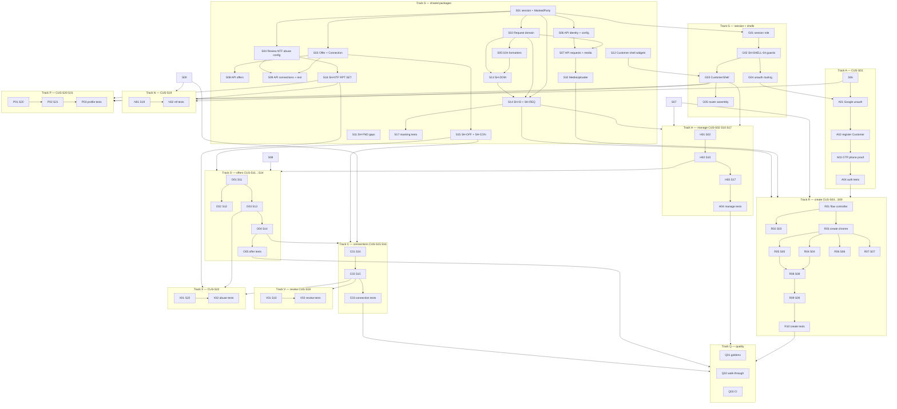

# Customer mode — Implementation task list

| | |
|---|---|
| **Product** | Karat Hive |
| **Document** | Executable task list for Customer mode in the dual-mode mobile app |
| **Status** | Working backlog — derived from the plan of record |
| **Date** | 7 September 2026 |
| **Version** | 0.4 |
| **Prefix** | `CM-*` — stable, never reused |
| **Screens** | `CUS-S01` … `CUS-S22` |
| **App** | `apps/kh_mobile` (same binary as Vendor; role is `userType`, not an in-session switch) |
| **Does not override** | SRS v1.3 · [`adr/0010`](../adr/0010-google-signin-only-login.md) · API-Route-Inventory · Architecture-Frontend / Backend · Screen-API-Map |
| **Branch (authoring)** | `cursor/customer-app-sweep-ce94` |
| **Companion Vendor list** | [`checkpoint-1-vendor-onboarding-tasks.md`](checkpoint-1-vendor-onboarding-tasks.md) |

This file is the work list: IDs, order, files, acceptance. Do not invent routes, fields, states, or error codes. Cite the inventory and `ui-screens/customer/`. A Request is never a listing; an Offer is never a bid; a Connection is never a chat (`CONTEXT.md`).

**Register hygiene.** Only the **orchestrator** ticks Status. Implementers do not edit this file. Tick after verifying the tree (on disk or HEAD), not from a worker’s claim. Values: **done** (acceptance met) · **partial** (files exist, acceptance incomplete) · **open** · **blocked**.

**Current tree (7 Sep 2026, orchestrator pass):** Wave 1 packages landed. `CM-S01`–`S05`, `S10`–`S12` **done**; `S06` **partial** (config/rates/settings still `kh_api` DTOs). Gate **S** is **not** passed (`S07`–`S09`, `S13`–`S17` open). `CustomerShell` (G03) still not assembled. Track K unchanged.

Login rule for this list: **Google is the only login** (`adr/0010`). OTP proves a mobile number (Talk / register). Password login is leftover Vendor CP1 UI and must not become the Customer path. SRS `CUS-S01` still mentions OTP login; until the SRS is rewritten, implement `adr/0010` and keep OTP as phone proof only.

---

## How to execute

Packages and shell first. No Customer screen starts until its shared types, API methods, and widgets exist. A track that **uses** a widget does not **author** that widget.

**Parallelism that is allowed.** After Gate S (packages compile): S11/S12 may run beside S13–S16. After Gate G: Track P and Track N may run beside Track R. Track X waits on an entity id from Offer or Connection. Track V waits on Connection detail.

**Forbidden.** Starting a `CUS-Snn` screen task while its `Depends on` IDs are not **done**. Putting `if (isVendor)` inside a shared widget. Parsing identity fields into a pre-acceptance model. Client-hiding masked fields that arrived in a payload (they must be absent — `BR-006`, `NFR-013`).

---

## Common patterns (shared implementation)

Copy these from Vendor Checkpoint-1. Do not invent a second architecture.

| Pattern | Rule | Where it already exists | Reuse for Customer |
|---|---|---|---|
| **Layering** | Widget → controller → repository → `KhApi` → `kh_domain`. Widgets do not call HTTP. Controllers do not parse JSON. | `features/onboarding/`, `features/auth/`, `features/dashboard/` | Every Customer feature folder in Architecture-Frontend §5 / Appendix A |
| **Feature folders** | `presentation/`, `controller/`, `repository/` (auth also has `model/`) | Vendor features | `request_create`, `request_manage`, `offers_customer`, `connections`, `reviews`, `notifications`, `profile_settings`, `abuse`; `auth` is **shared** with Vendor, not a second login stack |
| **Result** | Repositories return `Result<T, Failure>`. Show the server's localised `message`. Client copy only for no-network / timeout. | `kh_core` | All Customer repositories |
| **Riverpod** | Session keep-alive; screen notifiers autodispose; create-wizard state is **flow-scoped**, not screen-scoped (Architecture-Frontend §6.2) | `sessionProvider`, Vendor controllers | `RequestCreateController` spans `CUS-S03`…`S09` |
| **DTO boundary** | `KhApi` maps JSON → domain. Generated/hand DTOs never reach widgets (`AD-FE-07` adjacent: §9.1) | `packages/kh_api` | New Customer methods on the same `KhApi` class |
| **Idempotency** | `KhApiClient` already stamps `Idempotency-Key` on mutating calls. Accept UI must **not** mint a second key on retry; disable confirm; timeout → “check status” not “try again” (§9.4) | `packages/kh_core` interceptor | `POST …/publish`, `POST …/offers/{id}/accept` |
| **Media** | intent → PUT bytes → complete → poll until `READY` | `OnboardingRepository.uploadKycDocument` | Extract `MediaUploader`; purpose `REQUEST_IMAGE` (`CUS-S08`). Same helper later serves Vendor Offer images |
| **Taxonomy** | `GET /v1/categories`, `GET /v1/regions` already on `KhApi` | Vendor categories/regions | Request create: **single** select (`SH-TAX-01/02`), not Vendor multi |
| **Shells** | Two shells over shared features; role gate on cold start (`SH-SHELL-04`). No dual-role session (`C-08`) | `VendorShell`, `AwaitingApprovalShell`, `UnauthShell` — Vendor-only routes | Add `CustomerShell`. Guards branch on `userType`. Vendor awaiting shell stays Vendor-only |
| **Domain widgets** | Shared cards take `view: owner \| vendor`. Masked vs revealed are **different types** (`AD-FE-07`) | `VendorStatusCard`, `DocumentChecklist` only today | `SH-REQ-01`, `SH-OFF-01`, `SH-CON-01`, `SH-ID-01/02` live in `kh_ui_domain`, not in `apps/kh_mobile` |
| **Formatters** | One AED, grams, karat, relative-time, GST clock — in `kh_l10n`, never interpolating in widgets | `KhStrings` (Vendor copy only) | `SH-DOM-03/05/06/08`; server time already on `ServerClock` |
| **Empty / error / busy** | `SH-FND-12/13/14` | `state_views.dart` | Every list and create screen |
| **Tests** | Controller tests with fake `KhApi`; widget tests with fake session; LTR+RTL goldens for `kh_design_system` / `kh_ui_domain` | `test/features/*`, `test/app/guards_test.dart` | Same layout under `test/features/` plus masking tests (`§20`) |
| **Strings** | `KhStrings` keys until ARB/`gen_l10n` (deferred in Vendor CP1) | `packages/kh_l10n` | Add Customer keys; do not start a second i18n system |
| **OAuth gate** | Binds **publish**, not browse or draft (`BR-001`, Architecture-Frontend §7.3) | Not built | `SH-AUTH-05` on `CUS-S09` only |

**Customer-only widgets** (`CU-01`…`CU-20` in `ui-screens/component-widgets.md` §2.1) live in `apps/kh_mobile` feature folders. **Shared** `SH-*` live in packages.

**Do not share with Vendor by copying screens.** Share types, API, media, cards, formatters, shells-as-pattern. Vendor feed (`request_feed`) and Customer home (`request_manage`) are different information architectures on the same Request type.

---

## Backend contract (assumed — not tasks in this file)

These must already answer HTTP before the matching Flutter task is **done**. If a route is missing, that is a backend `G2-*` / `Tnn` item, not a new `CM-*` ID.

| Needed by | Routes / payload |
|---|---|
| Track A | `POST /v1/auth/google/session`, `POST /v1/auth/register/customer`, OTP `REGISTER_CUSTOMER` / `CHANGE_MOBILE` (proof only), `GET /v1/me` with `customer`, `oauthBound` |
| Track R / H | `GET /v1/platform-config`, `GET /v1/gold-rates`, `GET /v1/categories`, `GET /v1/regions`, `POST/PATCH /v1/requests`, `POST …/publish`, `POST …/cancel`, `GET /v1/me/requests`, `GET /v1/requests/{id}` Customer presenter, media intent/complete `REQUEST_IMAGE` |
| Track O | `GET /v1/requests/{id}/offers`, `GET /v1/offers/{id}`, `GET /v1/offers/{id}/vendor-rating`, `POST …/accept` `{confirmation:"REVEAL_AND_CONNECT"}`, `POST …/decline` |
| Track C | `GET /v1/me/connections`, `GET /v1/connections/{id}` with `talk.waUrl`, `POST …/contact-events`, `POST …/close` |
| Track V | `POST /v1/connections/{id}/reviews`, `PATCH /v1/reviews/{id}`, `POST …/withdraw` |
| Track N | `GET /v1/notifications`, `POST …/read`, `POST …/read-all` |
| Track P | `PATCH /v1/me`, `GET/PATCH /v1/me/settings`, `POST /v1/me/mobile/change`, `POST /v1/me/deactivate`, deletion-request pair, `POST /v1/auth/logout` |
| Track X | `POST /v1/abuse-reports` |

Screen → route mapping: [`docs/Screen-API-Map.md`](../Screen-API-Map.md) §3.

---

## Gates

| Gate | Passes when | Unblocks |
|---|---|---|
| **S** | `melos run analyze` (or package `dart analyze`) clean; `CM-S01`–`S10` done; masking types compile | Track G widgets that need session; API-backed screens |
| **G** | Fake Customer session reaches `CustomerShell`; fake Vendor session still reaches Vendor/awaiting; unauthenticated user cannot open `/customer/*` | Tracks A (finish), H, P, N |
| **A** | Google unbound → register Customer → `GET /v1/me` has `customer` and no `vendor`; returning Google lands on Home | Track R publish path |
| **R** | Draft save + publish (or `OAUTH_REQUIRED` banner then bind then publish); bullion floor error shown from server body | Track H detail of a live Request; Track O |
| **O** | Accept confirmation disabled during in-flight; one Connection; competing Offers not shown as still pending | Track C |
| **Q** | Widget tests for empty/error on critical path; goldens for `SH-ID-01/02` and `SH-REQ-01` owner; walk-through recorded | Merge of Customer mode vertical |

---

## Remaining to close (orchestrator)

Verified against the `cursor/customer-app-sweep-ce94` working tree on 7 September 2026. Do the open Track S items in this order before Gate G.

| ID | Status | Why |
|---|---|---|
| ~~CM-S01~~ | **done** | `party.dart` + `MeUser.customer` / `oauthBound` / `accountState`; `party_test` / `session_test` |
| ~~CM-S02~~ | **done** | `request.dart` `RequestForCustomer`; optional `unreadOfferCount` / `connectionId`; `request_test` |
| ~~CM-S03~~ | **done** | `offer.dart` `OfferForCustomer` + `connection.dart` `TalkPayload.waUrl`; `offer_connection_test` |
| ~~CM-S04~~ | **done** | Domain `PlatformConfig`, `GoldRate` (`available`/`stale`), `Settings`, review, notification, abuse |
| ~~CM-S05~~ | **done** | AED/g/karat/GST/relative-time formatters + Customer EN/AR keys |
| CM-S06 | **partial** | Methods exist; config/rates/settings still `fromJson` on `kh_api` DTOs, not `kh_domain` |
| CM-S07–S09 | open | Not started |
| ~~CM-S10~~ | **done** | `MediaUploader` + `KYC_DOCUMENT` / `REQUEST_IMAGE`; Vendor KYC uses helper; tests |
| ~~CM-S11~~ | **done** | `KhNumericField`, `KhSelectField`, `KhConfirmDialog`, `KhBadge`, `KhStatusChip` + tests |
| ~~CM-S12~~ | **done** | `KhAppShell`, `KhAppBar`, `KhBottomNav`, `KhPullToRefresh`; labels are parameters (l10n at G03) |
| CM-S13–S17 | open | `kh_ui_domain` still Vendor KYC/status only |
| Tracks G–Q, K | open | Blocked on remaining Track S / listed depends-on |

**Counts this pass:** 8 **done** · 1 **partial** · 53 **open** · 0 **blocked**.

---

## Full task register

Status values: **open** · **partial** · **done** · **blocked** (named backend or legal item).

Depends-on means **all listed IDs must be done before this ID starts**.

### Track S — Shared packages

Gate S.

| ID | Task | Depends on | Files (primary) | Acceptance | Status |
|---|---|---|---|---|---|
| CM-S01 | Session + masking types: `PartyRole`, account state, `MaskedParty` / `RevealedParty` with **no** name/mobile on masked; extend `MeUser` with `customer`, `oauthBound`, `liveRequestCount`, `canCreateRequest`, `accountState` | — | `packages/kh_domain/lib/src/session.dart`, new `party.dart` | Pre-acceptance type has no identity fields to read. `MeUser.fromJson` reads Customer branch. Vendor `MeUser.vendor` still works. | **done** |
| CM-S02 | Request domain: type, direction, state, owner presenter fields, reference, expiry, `offerCount`, optional `unreadOfferCount` / `connectionId` as **optional** (absent → UI hides) | CM-S01 | `packages/kh_domain/lib/src/request.dart` | Enums match inventory wires (`FIND_ORNAMENT`, …). No Vendor identity fields on owner type. | **done** |
| CM-S03 | Offer + Connection + Talk domain: `OfferForCustomer`, validity, terms, `MaskedParty` vendor; `Connection` with `RevealedParty` + `TalkPayload` (`waUrl`) | CM-S01 | `packages/kh_domain/lib/src/offer.dart`, `connection.dart` | Offer type cannot hold Vendor trading name. Connection type is the only place revealed Vendor fields exist. | **done** |
| CM-S04 | Review, Notification, AbuseReport, Settings, PlatformConfig, GoldRate snapshot types | CM-S01 | `packages/kh_domain/lib/src/` (split files) | Gold rate has `available` / `stale`; config has `maxConcurrentLiveRequests` and legal URLs if present (`SAM-GAP-5`). | **done** |
| CM-S05 | `kh_l10n` formatters: AED, grams 2 dp, karat, relative time, GST display from UTC (`BR-021`, `C-01`, `C-02`). Customer string keys for shells + auth | CM-S02 | `packages/kh_l10n` | Widgets must not concatenate currency. EN and AR keys for new strings. | **done** |
| CM-S06 | `KhApi`: `registerCustomer`, `GET/PATCH /v1/me` Customer fields, `GET /v1/platform-config`, `GET /v1/gold-rates`, `GET/PATCH /v1/me/settings` | CM-S01, CM-S04 | `packages/kh_api/lib/kh_api.dart` | Maps to domain; errors stay `Failure`. | **partial** |
| CM-S07 | `KhApi`: Requests list/create/patch/publish/cancel/duplicate + `GET /v1/requests/{id}` | CM-S02, CM-S06 | `packages/kh_api` | Publish/cancel go through existing idempotency interceptor. | open |
| CM-S08 | `KhApi`: Offers list/detail, vendor-rating, accept, decline | CM-S03, CM-S07 | `packages/kh_api` | Accept body `{confirmation:"REVEAL_AND_CONNECT"}`. | open |
| CM-S09 | `KhApi`: connections, contact-events, close, reviews, notifications, abuse-reports | CM-S03, CM-S04 | `packages/kh_api` | Talk URL is data, not constructed ad hoc from raw digits in the widget (normalise in domain/`PhoneNumber` per Architecture-Frontend §10.3). | open |
| CM-S10 | Extract `MediaUploader` from Vendor KYC upload; purpose parameter (`KYC_DOCUMENT` \| `REQUEST_IMAGE`) | CM-S07 | `packages/kh_core` or mobile `core/media/` | Vendor KYC still works via the helper. Customer images use `REQUEST_IMAGE`. | **done** |
| CM-S11 | Design-system gaps used by create/lists: numeric+unit (`SH-FND-03`), select (`SH-FND-04`), confirm dialog (`SH-FND-15`), badge (`SH-FND-18`), status chip (`SH-FND-19`) if missing | — | `packages/kh_design_system` | No raw `16.0` colours in feature code; tokens only. Existing `KhButton` / `KhTextField` / empty-error reused. | **done** |
| CM-S12 | Customer shell primitives: app bar + bottom nav items for Customer destinations (`SH-SHELL-01/02/03`); pull-to-refresh (`SH-SHELL-06`) | CM-S11 | `packages/kh_design_system` | Nav labels from `kh_l10n`. RTL via directional insets. | **done** |
| CM-S13 | Domain chrome widgets `SH-DOM-01`…`SH-DOM-09` | CM-S04, CM-S05 | `packages/kh_ui_domain` | Rate strip handles `available:false` and `stale`. Countdown uses `ServerClock`. | open |
| CM-S14 | `SH-ID-01/03/07`, `SH-REQ-01` with `view: owner`, `SH-REQ-03`…`SH-REQ-07` inputs | CM-S01, CM-S02, CM-S13 | `packages/kh_ui_domain` | `SH-ID-01` constructor takes `MaskedParty` only. Owner Request card has no Vendor identity. | open |
| CM-S15 | `SH-OFF-01`, `SH-OFF-04`, `SH-CON-01`…`SH-CON-04` | CM-S03, CM-S14 | `packages/kh_ui_domain` | Talk button opens `wa.me` from payload; logs via callback (repository records contact-event). | open |
| CM-S16 | `SH-NTF-01/02`, `SH-RPT-01`, `SH-SET-01/02`, `SH-ID-04/05` | CM-S04 | `packages/kh_ui_domain` | Abuse form does not invent entity types. Language picker applies locale immediately. | open |
| CM-S17 | Client masking tests: no widget path reads name/mobile from `MaskedParty`; owner/offer fixtures omit identity keys | CM-S14, CM-S15 | `packages/kh_ui_domain/test`, `packages/kh_domain/test` | Architecture-Frontend §20 client masking test exists and fails if a field is added to `MaskedParty`. | open |

### Track G — Session, role gate, Customer shell

Gate G. Do not start until CM-S01 is done (G01) / CM-S12 (G03).

| ID | Task | Depends on | Files (primary) | Acceptance | Status |
|---|---|---|---|---|---|
| CM-G01 | `SessionState.SignedIn` exposes `userType` and Customer vs Vendor home. Suspended Customer is a signed-in dead-end message, not Vendor awaiting | CM-S01 | `lib/app/session/session_controller.dart` | Customer JSON without `vendor` does not run `VendorLifecycle` routing. | open |
| CM-G02 | `AppGuards` + `SH-SHELL-04`: unauth → login; `CUSTOMER` → customer routes; `VENDOR` → existing Vendor/awaiting chain; never mount the other role's marketplace | CM-G01 | `lib/app/guards.dart`, tests | Existing `test/app/guards_test.dart` still pass for Vendor. New cases for Customer. | open |
| CM-G03 | `CustomerShell` bottom nav: Home `CUS-S02`, Requests `CUS-S10` (or home stack), Connections `CUS-S16`, Alerts `CUS-S19`, Profile `CUS-S20` — match `ui-mock/js/nav.js` | CM-G02, CM-S12 | `lib/app/shells/customer_shell.dart` | Material nav has ≥2 destinations. Vendor shell unchanged. | open |
| CM-G04 | Unauth shell: Google Sign-In shared; after session, role gate; **no** password tab on Customer path; Vendor register remains Vendor | CM-G02 | `lib/app/shells/unauth_shell.dart`, `lib/app/router.dart` | Unbound Google stays on completer chooser (Customer vs Vendor register). Bound Customer never sees `/vendor/home`. | open |
| CM-G05 | Assemble per-feature route files; typed path params (`requestId`, `offerId`, `connectionId`) | CM-G03, CM-A04 | `lib/app/router.dart`, `lib/features/*/routes.dart` | Deep-link shaped paths exist even if some screens are placeholders until their track. Placeholders must still be guarded. | open |

### Track A — Auth (`CUS-S01`)

Gate A. Login follows `adr/0010`, not OTP-as-login.

| ID | Task | Depends on | Files (primary) | Acceptance | Status |
|---|---|---|---|---|---|
| CM-A01 | Unauth: Google button (`SH-AUTH-04`); exchange `POST /v1/auth/google/session`; bound Customer → shell; unbound → completer | CM-S06, CM-G04 | `lib/features/auth/` (shared with Vendor, split presentation) | Firebase ID token is not sent to domain routes after exchange (G2-A14 already). | open |
| CM-A02 | Register Customer: display name, terms/privacy versions (`SH-FND-07`), `preferredLanguage`, optional email, `defaultRegionId?` | CM-A01 | `lib/features/auth/presentation/` customer register | `201` SessionBundle; duplicate mobile → `MOBILE_ALREADY_REGISTERED`. No `VendorProfile`. | open |
| CM-A03 | E.164 mobile + OTP **proof** (`REGISTER_CUSTOMER` / later `CHANGE_MOBILE`): `SH-AUTH-01/02/03`. Not a login | CM-A02 | auth controllers | OTP verify does not issue a session by itself (matches current backend verify → `mobileVerified`). | open |
| CM-A04 | Controller + widget tests: unbound, bound Customer, bound Vendor, suspended | CM-A03 | `test/features/` | Vendor login tests still pass or are updated to Google-only without restoring password as Customer login. | open |

### Track R — Request create (`CUS-S03`–`CUS-S09`)

Gate R. Flow-scoped controller is mandatory (`FR-CUS-015`, §6.2).

| ID | Task | Depends on | Files (primary) | Acceptance | Status |
|---|---|---|---|---|---|
| CM-R01 | `RequestCreateController`: holds draft id, type, attributes, media keys; PATCH draft on step transitions; restore on back | CM-S07, CM-A04, CM-G03 | `lib/features/request_create/controller/` | Killing a step widget does not lose fields. | open |
| CM-R02 | `CUS-S03` type tiles (`CU-02`, `SH-REQ-02`). Block entry when `canCreateRequest == false` (`SAM-GAP-2` via `GET /v1/me`) | CM-R01, CM-S14 | `…/presentation/` | Four types only. No start of a fifth live Request when cap hit. | open |
| CM-R03 | Shared create chrome (`CU-03`): category/region single pick, notes, gold-rate strip, keyboard avoiding | CM-R01, CM-S13, CM-S14 | `request_create` | Taxonomy from existing `KhApi.categories/regions`. | open |
| CM-R04 | `CUS-S04` Find An Ornament (`CU-04`, `FR-CUS-006`–`009`) | CM-R03 | `request_create` | Direction fixed BUY. Budget mandatory. | open |
| CM-R05 | `CUS-S05` Sell Old Gold (`CU-05`, `FR-CUS-010`) | CM-R03 | `request_create` | Direction fixed SELL. Indicative valuation suppressed if rate unavailable. | open |
| CM-R06 | `CUS-S06` Gold Coins (`CU-06`, `FR-CUS-011`) | CM-R03 | `request_create` | Direction selectable. Quantity > 0. | open |
| CM-R07 | `CUS-S07` Gold Bullion (`CU-07`, `FR-CUS-012/013`) | CM-R03, CM-S13 | `request_create` | Below floor → `BULLION_BELOW_MINIMUM` from server; no rate → cannot publish (compose allowed until publish). | open |
| CM-R08 | `CUS-S08` image capture (`SH-MED-01/02/05`) via `MediaUploader` | CM-R04, CM-R05, CM-S10 | `request_create` | Max images from platform-config. Reorder = `mediaKeys[]` order. | open |
| CM-R09 | `CUS-S09` review & publish (`CU-08/09`, `SH-AUTH-05`). Publish refused without `oauthBound`; banner binds then retries **same** idempotency key | CM-R08, CM-A03 | `request_create` | Draft PATCH vs publish POST distinct. `OAUTH_REQUIRED`, `MEDIA_NOT_READY`, `CONTACT_DETAILS_IN_TEXT`, `CONCURRENT_REQUEST_LIMIT` shown from server. | open |
| CM-R10 | Create-flow controller tests + widget tests for cap, bullion floor, OAuth banner | CM-R09 | `test/features/request_create/` | | open |

### Track H — Request manage (`CUS-S02`, `CUS-S10`, `CUS-S17`)

| ID | Task | Depends on | Files (primary) | Acceptance | Status |
|---|---|---|---|---|---|
| CM-H01 | `CUS-S02` Home (`CU-01`): my live Requests, unread marker if `unreadOfferCount` present else omit, quick-create → S03 | CM-S07, CM-S14, CM-G03 | `lib/features/request_manage/` | Empty `data: []` uses `SH-FND-12`. Pull-to-refresh. | open |
| CM-H02 | `CUS-S10` owner detail (`CU-10`): nested offer count, edit allowed fields, cancel, link to Offers; if `connectionId` present → S15 | CM-H01, CM-R09 | `request_manage` | Structural edit → `STRUCTURAL_FIELD_IMMUTABLE`. Cancel after accept refused. | open |
| CM-H03 | `CUS-S17` History: terminal states, cursor pagination (`SH-FND-25`), search by reference | CM-H02 | `request_manage` | Read-only. Empty state. | open |
| CM-H04 | Manage tests (empty, expiry countdown, cancel error) | CM-H03 | `test/features/request_manage/` | | open |

### Track O — Offers (`CUS-S11`–`CUS-S14`)

Gate O.

| ID | Task | Depends on | Files (primary) | Acceptance | Status |
|---|---|---|---|---|---|
| CM-O01 | `CUS-S11` Offers list (`CU-11/12`): sort/filter, unread if payload has `viewedByCustomerAt`, select 2–4 for compare | CM-H02, CM-S08, CM-S15 | `lib/features/offers_customer/` | Masked Vendor only. Poll while visible (Architecture-Frontend §11.3). | open |
| CM-O02 | `CUS-S12` comparison (`CU-13`): client composition over same list; accept from a column still goes through S14 | CM-O01 | `offers_customer` | Client guard: 2–4 selected. | open |
| CM-O03 | `CUS-S13` Offer detail + vendor-rating sheet (`CU-20`, `FR-CUS-031`); decline sheet (`CU-15`) | CM-O01 | `offers_customer` | `SH-ID-01` + `SH-OFF-04`. Report entry → Track X route. | open |
| CM-O04 | `CUS-S14` Mark as Interested (`CU-14`): irreversibility copy; disable confirm; check-status on timeout | CM-O03 | `offers_customer` | One Connection; competitors disappear on refresh. Errors `OFFER_EXPIRED` / `OFFER_NOT_PENDING` / `OFFER_ALREADY_ACCEPTED`. | open |
| CM-O05 | Offer tests including masking fixture and accept idempotency (same key) | CM-O04 | `test/features/offers_customer/` | | open |

### Track C — Connections (`CUS-S16`, `CUS-S15`)

| ID | Task | Depends on | Files (primary) | Acceptance | Status |
|---|---|---|---|---|---|
| CM-C01 | `CUS-S16` Connections list (`SH-CON-01`) | CM-O04, CM-S09, CM-S15 | `lib/features/connections/` | ACTIVE first. Empty state. Shared folder will later host Vendor list; Customer presentation first with `view: owner`. | open |
| CM-C02 | `CUS-S15` Connection detail (`CU-16`): `SH-ID-02`, Talk, copy, close, review CTA, exclude from screenshots (§18.2 / Architecture-Frontend §15) | CM-C01 | `connections` | `talk.available:false` when closed. Contact-event posted on Talk. WhatsApp missing → copy fallback. | open |
| CM-C03 | Connection tests: revealed fields only here; Talk does not parse competitor data | CM-C02 | `test/features/connections/` | | open |

### Track V — Reviews (`CUS-S18`)

| ID | Task | Depends on | Files (primary) | Acceptance | Status |
|---|---|---|---|---|---|
| CM-V01 | `CUS-S18` leave / edit / withdraw (`SH-ID-04/05`) | CM-C02, CM-S09 | `lib/features/reviews/` | `REVIEW_ALREADY_EXISTS`, edit window from server. Customer ratings not shown to other Customers (`BR-018`) — this screen is own review only. | open |
| CM-V02 | Review tests | CM-V01 | `test/features/reviews/` | | open |

### Track N — Notifications (`CUS-S19`)

May run parallel to Track R after Gate G.

| ID | Task | Depends on | Files (primary) | Acceptance | Status |
|---|---|---|---|---|---|
| CM-N01 | `CUS-S19` centre (`SH-NTF-01/02`): list, read, read-all, deep link through same guards | CM-G03, CM-S09, CM-S16 | `lib/features/notifications/` | Empty state. Unknown deep link → explanatory screen, not a crash. | open |
| CM-N02 | Notification tests | CM-N01 | `test/features/notifications/` | | open |

### Track P — Profile & settings (`CUS-S20`, `CUS-S21`)

May run parallel to Track R after Gate G.

| ID | Task | Depends on | Files (primary) | Acceptance | Status |
|---|---|---|---|---|---|
| CM-P01 | `CUS-S20` profile (`CU-18`): display name, photo if API supports, language, default region, mobile change + OTP | CM-G03, CM-S06, CM-S16, CM-A03 | `lib/features/profile_settings/` | `PATCH /v1/me`. Photo omitted if backend PATCH has no `photoMediaKey` (do not fake it). | open |
| CM-P02 | `CUS-S21` settings (`CU-19`): prefs, legal/support from platform-config (`SAM-GAP-5`), logout, deactivate, deletion two-step | CM-P01 | `profile_settings` | Deletion blocked → `FORBIDDEN` copy from server (`FR-CUS-004` AC2). Language change applies RTL. | open |
| CM-P03 | Profile/settings tests | CM-P02 | `test/features/profile_settings/` | | open |

### Track X — Abuse (`CUS-S22`)

| ID | Task | Depends on | Files (primary) | Acceptance | Status |
|---|---|---|---|---|---|
| CM-X01 | `CUS-S22` (`SH-RPT-01`): prefill entity from Offer or Connection; 5/24h `RATE_LIMITED` | CM-O03 or CM-C02, CM-S16, CM-S09 | `lib/features/abuse/` | No client-invented `VENDOR` entity if the running API still requires Request/Offer/Connection — follow live inventory. If backend already accepts `VENDOR` (`SAM-GAP-4` built), use it as documented. | open |
| CM-X02 | Abuse tests | CM-X01 | `test/features/abuse/` | | open |

### Track Q — Quality and verification

| ID | Task | Depends on | Files (primary) | Acceptance | Status |
|---|---|---|---|---|---|
| CM-Q01 | LTR + RTL goldens for `SH-ID-01`, `SH-ID-02`, `SH-REQ-01` owner, `SH-OFF-01`, `SH-CON-02` | CM-S17, CM-S15 | `packages/kh_ui_domain/test` | `AD-FE-13`. | open |
| CM-Q02 | Critical-path walk-through: register Customer → create → publish → (Vendor offer may be API-seeded) → compare → accept → Talk payload present | CM-R10, CM-H04, CM-O05, CM-C03 | evidence under `/opt/cursor/artifacts` or checkpoint notes | Architecture-Frontend §20 critical path. | open |
| CM-Q03 | Frontend CI includes Customer feature tests (same `frontend.yml` job or an added shard) | CM-Q01, CM-A04, CM-R10 | `.github/workflows/frontend.yml` | PR cannot merge with failing Customer widget tests. | open |

### Track K — Contract residuals (do not block earlier UI)

Consume backend fields when present. Do not synthesise them on the client.

| ID | Task | Depends on | Files (primary) | Acceptance | Status |
|---|---|---|---|---|---|
| CM-K01 | Unread Offer marker when `unreadOfferCount` / `viewedByCustomerAt` exist (`SAM-GAP-1`) | CM-H01, CM-O01 | presenters already optional in CM-S02/S03 | If field absent, no fake badge. If present, Home + list show marker. | open |
| CM-K02 | Deep-link Request → Connection when `connectionId` on owner Request (`SAM-GAP-3`) | CM-H02, CM-C01 | `CUS-S10` | If field absent, Offers/Connections navigation still works via lists. | open |

---

## ID index (stable)

| Track | IDs | Count | Screens / scope |
|---|---|---|---|
| S Shared packages | CM-S01 … CM-S17 | 17 | domain, api, l10n, DS, ui_domain, media, masking tests |
| G Shell / guards | CM-G01 … CM-G05 | 5 | role gate, CustomerShell, router |
| A Auth | CM-A01 … CM-A04 | 4 | CUS-S01 |
| R Create | CM-R01 … CM-R10 | 10 | CUS-S03–S09 |
| H Manage | CM-H01 … CM-H04 | 4 | CUS-S02, S10, S17 |
| O Offers | CM-O01 … CM-O05 | 5 | CUS-S11–S14 |
| C Connections | CM-C01 … CM-C03 | 3 | CUS-S15, S16 |
| V Reviews | CM-V01 … CM-V02 | 2 | CUS-S18 |
| N Notifications | CM-N01 … CM-N02 | 2 | CUS-S19 |
| P Profile | CM-P01 … CM-P03 | 3 | CUS-S20, S21 |
| X Abuse | CM-X01 … CM-X02 | 2 | CUS-S22 |
| Q Quality | CM-Q01 … CM-Q03 | 3 | goldens, walk-through, CI |
| K Residuals | CM-K01 … CM-K02 | 2 | SAM-GAP-1, SAM-GAP-3 |
| **Total** | **CM-S01 … CM-K02** | **62** | **22 Customer screens covered** |
| **Ticked 7 Sep (v0.4)** | done **8** · partial **1** · open **53** · blocked **0** | | Orchestrator pass after Wave 1 complete |

Screen coverage: every `CUS-S01`…`CUS-S22` appears in exactly one feature track (A, R, H, O, C, V, N, P, X). Shared `SH-*` and packages are Track S. No `VEN-*` or `ADM-*` IDs in this register.

---

## Out of this vertical

Do not pull in: Vendor feed/offers (`VEN-S05`…), Admin Portal, ARB/`gen_l10n` replacement of `KhStrings`, `freezed`/`json_serializable` (hand-written DTOs remain), Redis/Kafka, WhatsApp Business API, settlement, Yahoo end-user gold display (`G2-D04` — degrade via `available:false`), password login restoration.

---

## Revision history

| Version | Date | Change |
|---|---|---|
| 0.1 | 7 Sep 2026 | Initial Customer-mode task list. 62 `CM-*` IDs. Dependency order and shared-pattern table. |
| 0.2 | 7 Sep 2026 | Orchestrator register pass: tick S01, S02, S05, S10, S11 **done**; S06 **partial**. Hygiene: only the orchestrator ticks Status. |
| 0.3 | 7 Sep 2026 | Orchestrator: tick S03, S04 **done** after `kh_domain` files verified. S06 stays **partial**. |
| 0.4 | 7 Sep 2026 | Orchestrator: tick S12 **done** (`KhAppShell` / nav / refresh). Wave 1 package agents complete. |
